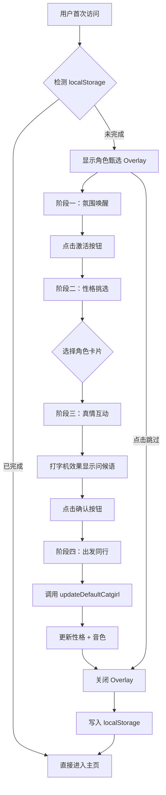

# 角色甄选引导系统

---

## 一、原始设计目标

### 整体流程规划

| 阶段 | 名称 | 状态 |
|------|------|------|
| 阶段一 | 感知唤醒 — 全局开屏沉浸式引导 | ✅ 已实现（简化版） |
| 阶段二 | 身份定义 — 角色卡片选择 | ✅ 已实现（待优化，emoji待替换） |
| 阶段三 | 性格注入与养成 — 外形/性格矩阵深度配置 | 部分实现 （外形目前没有其他的，声音和人设有匹配）|
| 阶段四 | 契约生成 — 多模态第一声问候 | 部分实现（目前文字打字机，声音回复以及模型显示待实现） |
| 体验增强 | 随机召唤、沉浸音效、术语切换等 | 🔜 暂缓 |

### 原始各阶段设想

**阶段一 — 感知唤醒**
- 视觉：流动粒子或深邃星空，中央悬浮微光"能量球"
- 文案：「在这个数字宇宙中，有一个生命正等待与你建立连接。你希望，TA 是谁？」
- 星空背景 ✅ 已实现；能量球简化为按钮

**阶段二 — 身份定义**
- 傲娇 / 高冷 / 知性 / 效率四张角色卡片 ✅ 已实现
- 随机召唤（右上角「掷骰子」） 🔜 暂缓

**阶段三 — 性格注入与养成**（部分实现）
- 外形投射：当前以 emoji 占位（😺 🤖 🌸 ⚡），立绘 / 半身图待接入 🔜
- 声音与人设匹配 ✅ 已实现（`CHARACTER_VOICE_MAPPING`）
- 性格矩阵：3×3 坐标系 + Slider 微调 🔜 暂缓

**阶段四 — 契约生成**（部分实现）
- 文字打字机动画 ✅ 已实现
- 各角色差异化完成屏（`readyTitle` / `readyDesc`）✅ 已实现
- 声音回复（选角色时播放样音 / 问候 TTS）🔜 待实现
- 模型半身图显示 🔜 待实现

**体验增强细节**（🔜 暂缓）
- 随机召唤 + 推荐理由
- 沉浸音效（钢琴/篝火/8-bit）
- 术语切换

---

## 二、已完成实现（v1.1.0 · 2026-03-14）

### 功能概述

用户首次进入系统时自动触发四阶段引导，完成后根据选择自动配置默认猫娘的性格和音色。

**已实现核心功能：**
- 四阶段引导流程：氛围唤醒 → 性格挑选 → 真情互动 → 出发同行
- 自动配置默认猫娘：根据选择自动设置性格和音色
- 跳过机制：右上角跳过按钮，保持默认配置
- 星空沉浸式背景动画
- 打字机动画：问候语逐字显示
- 重置功能：记忆浏览页面可重置，下次访问重新触发
- 多语言 i18n：通过 `memory.characterSelection.*` 翻译键覆盖六种语言
- 键盘无障碍：角色卡片支持 Tab 聚焦、Enter/Space 激活，`:focus-visible` 焦点环

---

### 文件结构

```
N.E.K.O/
├── templates/
│   ├── index.html                      # [已修改] 添加角色甄选 HTML 和入口脚本
│   └── memory_browser.html             # [已修改] 添加重置下拉选项
├── static/
│   ├── js/
│   │   └── character-selection.js      # [新建] 角色甄选逻辑
│   ├── css/
│   │   └── character-selection.css     # [新建] 角色甄选样式
│   ├── universal-tutorial-manager.js   # [已修改] 添加角色甄选重置逻辑
│   └── locales/
│       └── *.json                      # [已修改] 添加 tutorialPageCharacterSelection 及 characterSelection.* 翻译块
└── docs/
    └── character-guide.md              # 本文档
```

---

### 角色类型与配置映射

| 角色类型 | ID | 音色设定 | 性格描述 |
|---------|-----|---------|---------|
| 傲娇叛逆 | `tsundere_neko` | 俏皮女孩 (`voice-tone-PGLiTXeJCS`) | 傲娇猫娘 |
| 绝对理智 | `cool_mech` | 清冷御姐 (`voice-tone-PGLlMvr0Ai`) | 高冷机器人 |
| 极致温柔 | `intellectual_healer` | 甜美御姐 (`voice-tone-PGLmTEeUOu`) | 知心大姐姐 |
| 优雅利落 | `efficiency_expert` | 温柔少女 (`voice-tone-PGLlrd5SNM`) | 高效直接，学识渊博的专家 |

---

### 存储键

| 键名 | 类型 | 说明 |
|------|------|------|
| `neko_character_selection_completed` | String | 标记是否已完成角色甄选（`'true'`） |
| `neko_default_catgirl_name` | String | 记录人设选择目标角色的档案名，用于跨会话和重命名追踪 |

注意：此两键与普通引导的 `neko_tutorial_*` 前缀不同，在 `universal-tutorial-manager.js` 中需要特殊处理。

---

### API 端点

#### 获取角色列表

```http
GET /api/characters
```

#### 新建角色

```http
POST /api/characters/catgirl
Content-Type: application/json

{ "档案名": "test" }
```

当目标角色不存在时（被删除或首次安装时 `猫娘` 分类为空），调用此接口新建档案名为 `test` 的默认角色。

#### 更新角色设定

```http
PUT /api/characters/catgirl/{catgirlName}
Content-Type: application/json
```

#### 更新音色 ID

```http
PUT /api/characters/catgirl/voice_id/{catgirlName}
Content-Type: application/json

{ "voice_id": "voice-tone-PGLiTXeJCS" }
```

---

### 流程图



---

### 核心实现细节

#### 性格更新逻辑

系统区分**人设选择写入**与**用户自定义**两种情况：

- 若现有性格中已存在某个人设选择写入的性格词条（与 `CHARACTER_VOICE_MAPPING` 中任意 `personality` **完全匹配**），则**覆盖**该词条，避免重复叠加
- 若不存在任何人设选择词条（纯用户自定义），则**追加**到末尾，不影响原有内容

| 场景 | 原性格 | 选择 | 结果 |
|------|--------|------|------|
| 首次选择（空） | `（空）` | 傲娇猫娘 | `傲娇猫娘` |
| 用户自定义后首次选择 | `活泼可爱` | 傲娇猫娘 | `活泼可爱，傲娇猫娘` |
| 重新选择（覆盖旧人设） | `活泼可爱，傲娇猫娘` | 高冷机器人 | `活泼可爱，高冷机器人` |
| 重新选择（无旧人设词条） | `活泼可爱` | 高冷机器人 | `活泼可爱，高冷机器人` |

#### 默认猫娘识别与追踪

目标角色通过 `localStorage['neko_default_catgirl_name']` 持久记录，完整决策流程如下：

```
updateDefaultCatgirl() 被调用
│
├─ 读取 localStorage['neko_default_catgirl_name']
│   ├─ 有记录且角色仍存在 → 直接使用
│   └─ 无记录或角色已被删除
│       ├─ characters['猫娘']['test'] 存在 → 使用 test，写入 localStorage
│       └─ test 也不存在
│           └─ POST /api/characters/catgirl { 档案名: 'test' }
│               ├─ 创建成功 → 使用 test，写入 localStorage
│               └─ 创建失败 → 抛出错误，流程中断（不影响 overlay 关闭）
│
└─ 对目标角色执行性格 + 音色更新
```

**重命名同步**：`chara_manager.js` 的 `renameCatgirl()` 在改名成功后同步更新 localStorage 记录，确保下次触发时仍能找到同一角色。

#### 阶段切换

```javascript
goToStage(stageNumber) {
    document.querySelector('.character-stage.active')?.classList.remove('active');
    document.getElementById(`stage-${stageNumber}`)?.classList.add('active');
    if (stageNumber === 3) this.playGreeting();
    if (stageNumber === 4) this.updateFinalInfo();
}
```

#### 选卡防抖

`selectCharacter()` 在设置新的延迟定时器前先 `clearTimeout` 清除旧定时器，防止快速多次点击累积触发 `goToStage(3)`。

#### 键盘无障碍

角色卡片声明 `role="button" tabindex="0" aria-pressed`，支持 Tab 聚焦、Enter/Space 激活，选中状态同步更新 `aria-pressed`。CSS 通过 `:focus-visible` 提供仅对键盘用户可见的焦点环。

#### 错误处理

所有 API 调用包含 try/catch，即使更新失败也会继续关闭流程，不影响用户体验。

`script.onload` 中实例化 `CharacterSelection` 及调用 `start()` 的两条执行路径均有 try/catch 保护，捕获到异常时通过统一的 `handleCharacterSelectionError()` 移除 overlay 并 dispatch `characterSelectionLoadFailed` 事件，防止页面被永久遮挡。

---

### i18n 实现

界面文字通过 `memory.characterSelection.*` 翻译键管理，覆盖 zh-CN / zh-TW / en / ja / ko / ru 六种语言。

#### 为什么不用 `updatePageTexts()`

`updatePageTexts()` 在 i18n 初始化时扫描一次 DOM，而 `character-selection.js` 是动态加载的，执行时 `localechange` 事件已触发过，`data-i18n` 属性不会被系统处理。因此由 `_applyStaticI18n()` 在 `init()` 时主动扫描 overlay 内所有 `[data-i18n]` 元素并调用 `window.t()` 翻译，同时监听 `localechange` 支持语言切换后刷新。

#### 动态文字

`playGreeting()` 和 `updateFinalInfo()` 在运行时直接调用 `window.t()`，不依赖 `data-i18n` 属性。`updateFinalInfo()` 用 DOM API 拼接 `<strong>` 节点，避免 `innerHTML` 注入翻译文本带来的 XSS 风险。

#### 注意事项

翻译文件为 JSON 格式，字符串值内**不能使用 ASCII 双引号 `"`**，否则会破坏 JSON 结构。需要引号时使用中文书名号 `「」` 或单引号 `'`。

---

### 重置功能（memory_browser）

用户可在记忆浏览页面的"新手引导"下拉框中选择"初始人设"来重置角色甄选。

**重置逻辑**：
- 单独重置"初始人设"：删除 `neko_character_selection_completed` 键
- 重置"全部页面"：遍历删除所有 `neko_tutorial_*` 键，同时删除 `neko_character_selection_completed`

**注意**：重置仅删除 localStorage 标记，不影响已配置的角色性格和音色。重置后需刷新主页才能重新触发流程。

---

### 降级方案

#### FOUC（无样式内容闪烁）

overlay 默认设置 `visibility: hidden`，`link.onload` 触发后移除该属性；`link.onerror`（CSS 加载失败）时同样移除，保证流程可用。

#### `backdrop-filter` 不支持

通过 `@supports not` 加深背景色，保持内容可读性：

```css
@supports not (backdrop-filter: blur(1px)) {
    .character-card    { background: rgba(20, 20, 32, 0.92); }
    .greeting-modal    { background: rgba(10, 10, 20, 0.98); }
}
```

---

### 测试方法

```javascript
// 清除完成标记，触发重新显示
localStorage.removeItem('neko_character_selection_completed');

// 模拟已完成状态
localStorage.setItem('neko_character_selection_completed', 'true');

// 显示所有阶段（调试用）
document.querySelectorAll('.character-stage').forEach(s => s.style.display = 'flex');
```

---

### 文案速览（当前定稿）

> 按界面出现顺序排列，便于审查和传递给翻译。

#### 第一屏 — 引导唤醒

| 位置 | 文案 |
|------|------|
| 引导语 | 嘿嘿，我在这呢。跟我一起进入N.E.K.O.的世界吧~ |
| 主按钮 | 戳一下 |
| 右上角跳过 | 跳过 |

#### 第二屏 — 人设选择

| 位置 | 文案 |
|------|------|
| 页面标题 | 你眼中的我是什么样的呢~ |
| 底部提示 | 改变主意了也没关系，设置里随时可以「回溯」~ |

**角色卡片：**

| 卡片 | 名称 | 副标题 |
|------|------|--------|
| 傲娇 | 傲娇叛逆 | 口是心非，偶尔卖萌 |
| 机械 | 绝对理智 | 理性冷静，逻辑至上 |
| 治愈 | 极致温柔 | 温柔体贴，擅长倾听 |
| 效率 | 优雅利落 | 简洁高效，直击要点 |

#### 第三屏 — 连接过渡

| 位置 | 文案 |
|------|------|
| 过渡文字 | 时空穿越中—— |

#### 第四屏 — 问候确认

**各角色第一句问候：**

| 角色 | 问候语 |
|------|--------|
| 傲娇叛逆 | 喂，手伸过来。选了我，你就是我的人了！先说好，没我的允许不准想别人！ |
| 绝对理智 | 用户ID已记录，握手协议通过。正在载入长期陪伴进程。 |
| 极致温柔 | 遇见你，好开心。从今天起，我会一直陪在你身边~ |
| 优雅利落 | 已确认选择。我是您的执行官，未来将与您同行。 |

| 位置 | 文案 |
|------|------|
| 确认按钮 | 确认 |
| 返回链接 | 再想想 |

#### 第五屏 — 完成

| 角色 | 标题 | 说明文字 | 出发按钮 |
|------|------|---------|---------|
| 傲娇叛逆 | 哼，终于来了！ | 才、才不是专门等你的……总之，你来了就跟紧点！ | 出发，同行！ |
| 绝对理智 | 系统就绪。 | 所有模块加载完毕，等待你的第一条指令。 | 出发，同行！ |
| 极致温柔 | 我来啦~ | 我已经等不及啦，快来和我说说话吧~ | 出发，同行！ |
| 优雅利落 | 已就位。 | 准备完毕，请下达第一条指令。 | 出发，同行！ |

---

## 三、待实现功能

| 功能 | 优先级 | 说明 |
|------|--------|------|
| 声音回复 / 第一声问候 TTS | P1 | 选定角色后播放对应音色的语音问候 |
| 模型半身图显示 | P1 | 替换当前 emoji 占位，接入角色立绘 |
| 角色卡片 emoji 替换 | P2 | 卡片图标升级为立绘缩略图或头像 |
| BGM 切换逻辑 | P2 | 背景音效随人设切换（钢琴/篝火/8-bit） |
| 性格矩阵深度配置 | P3 | 3×3 坐标系 + Slider 微调 |
| 随机召唤功能 | P3 | 右上角掷骰子，随机匹配并给出推荐理由 |

---

### 与其他系统的关系

- **与新手引导系统**：独立运行，角色甄选完成后不会自动触发主页引导
- **与角色管理系统**：通过 `/api/characters` 端点更新默认猫娘配置

---

### 相关文档

- [新手引导系统文档](frontend/tutorial.md)
- [角色管理 API 文档](api/rest/characters.md)

---

*最后更新：2026-03-16*
