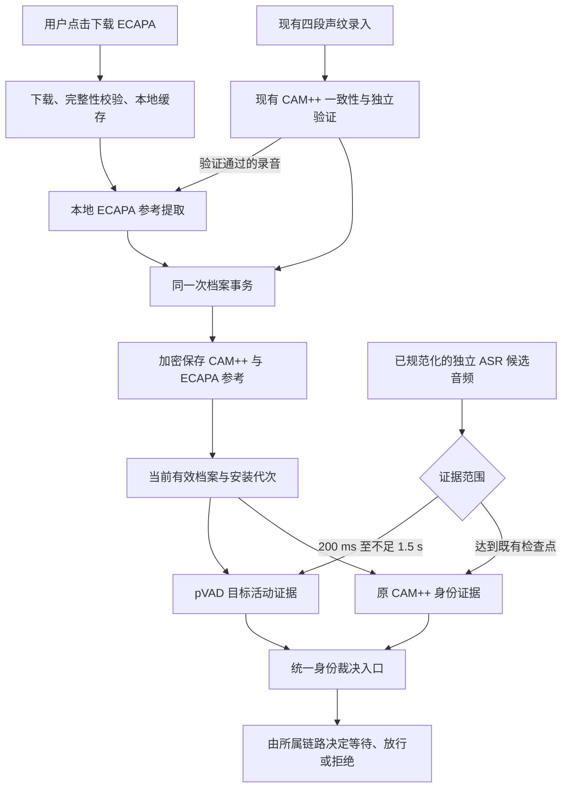

# FireRedChat-pVAD 与 ECAPA 按需录入：实施方案、约束与进度

更新日期：2026-09-08。状态：**P1–P5 的代码与自动化回归已完成，pVAD 保持观测模式；P6 真实效果、普通设备与实际桌面产物验收未完成。改动未提交、未部署。**

本次实现已按用户要求迁移到现有声音链路分支 `codex/voice-model-unavailable-ux`，最终不保留独立实施分支。本文同时记录已经落地的合同、验证证据和仍然阻止正式执行短句拒绝策略的门槛；“验收要求”不等于已经达到的生产能力。

## 1. 基线与已经确认的决定

| 项目 | 已确认内容 |
|---|---|
| 开发基线 | 当前声音链路分支 `codex/voice-model-unavailable-ux` 的已提交 HEAD `644600b830caed80abd1a2c33a76895a98e0f6ed` |
| 实施分支 | 现有声音链路分支 `codex/voice-model-unavailable-ux`，没有新增最终分支 |
| 实施工作区 | `C:\Users\ALEXGREENO\Desktop\CODE\N.E.K.O` |
| pVAD 分发 | 小型 pVAD 模型随项目提供 |
| ECAPA 分发 | 在声纹录制界面提供按需下载入口，说明用途和下载量 |
| CAM++ | 保留已有声纹档案、长句检查点和身份裁决规则 |
| 录入方式 | 优先复用现有四段录音，增加 ECAPA 配套档案，无需用户录两套不同流程 |
| 校准参数包 | 继续作为备选，本次不自动启动其开发、训练或注册 |
| 当前工作安排 | FireRed/ECAPA 已迁入现有声音链路工作区并与其未提交改动合并；保持未提交，不自动触发发布或运行服务切换 |

现有工作区原有 `main_logic/asr_client/audio.py`、`prewire_gate/`、speaker shadow shared host、TSE 及对应测试的未提交开发。本次迁移保留了这些内容，并对重叠装配点做了联合合并：有兼容 ECAPA 参考时，共享 host 在同一个物理进程中组合 pVAD 与 CAMP++，不额外启动第二套 CAMP++。`short_probe` 模式始终保留给前置链路的 CAMP++ 短探针；shadow 的 `standard` 模式仅在 200 ms 至不足 1.5 s 时调用 pVAD，达到 1.5 s 后仍调用 CAMP++。没有兼容 ECAPA 参考时，pVAD 观测不启用，也不取得上传或拒绝权限。

适用的项目规则：备忘录第 1 节分支与授权、第 2 节架构、第 3 节八语言文案、第 4 节异步与 ownership、第 5 节 Web/Electron、第 7 节验证。基线使用当前声音分支，是用户已明确指定的例外，不再重复询问。

## 2. 本次交付范围与边界

### 2.1 本次需要交付

1. 随包提供可校验来源和完整性的 pVAD ONNX 资源。
2. 按需下载 ECAPA 推理资源，提供进度、成功、失败和重试状态。
3. 在本地录入过程中生成与 pVAD 兼容的 ECAPA 参考向量。
4. 将参考向量与 Owner 档案、模型和音频处理版本绑定，加密保存。
5. 让短句获得独立的目标说话人活动证据，并通过已有身份裁决入口消费。
6. 建立故障隔离、取消回收、旧档案兼容和回归测试。
7. 完成 Web、Electron、真实模型和普通 CPU 设备验收后，再决定正式执行策略。

### 2.2 不在本次范围内

- 用 ECAPA 替换所有 CAM++ 校验，或者直接转换已有 CAM++ 向量。
- 重写 Silero VAD、SmartTurn 端点规则、Provider 协议或 ASR 主发送流程。
- 人声分离、回声消除、重叠语音恢复、整轮连续说话人切分。
- 把短句检测结果当作超过 3 秒后的持续身份保证。
- 自动采用“第一个开口的人就是 Owner”或“声音最大的人就是 Owner”。
- 根据转写内容、语义、相邻回合、复制音频、拼接下一句或补静音证明身份。
- 自动训练模型、自动量化、自动安装用户环境中的 PyTorch，或改变原有资源上限。

这些限制不取消整体声音链路已规划的持续检查、区间账本和 ASR 提交前门控；它们只是划清本次模型接入工作的范围。

### 2.3 必须区分旧链路与前置门控目标

当前已提交基线中的 `UNAVAILABLE` 可以按旧规则降级放行。本次保持旧链路兼容，不能把这种放行称为“Owner 验证通过”。

整体报告第 12.5 节以及原工作区正在开发的前置门控采用更严格的目标：在声纹保护开启的受保护路由上，身份不确定、缺参数、模型不可用或未评分不能自动获得上传权限。

因此，**pVAD 只产生证据，不得自行决定上传、重发或把严格门控改成 fail-open。** 接入旧链路时继承旧链路的降级语义；接入前置门控时服从它的区间裁决与唯一提交规则。不能用本次“可选模型失败不影响 CAM++”的要求，绕过前置门控。

## 3. 总体接入结构

**当前实现选择的是候选结束后评分：**把这个候选的真实 PCM 按 10 ms 帧依次送入因果模型，得到短句的活动证据。它还不是从麦克风入口开始连续产生决策的完整流式 pVAD 接入，也不是 ASR 上传前拦截。

这种方式可以复用现有后台声纹进程和候选归属，但要测量候选结束后新增的计算等待。如果后续需要采集期间连续推理、说话人区间裁剪或上传前保护，必须对接区间账本，不能仅靠当前终态评分实现宣称已完成。

模块方向已经落地：通用 `SpeakerProfile` 只拥有参考材料；ECAPA/pVAD 适配器只处理模型与音频；CAM++ 与 pVAD 的选择和结果转换位于 ASR 组装层。通用声纹对象和底层模型模块没有反向依赖 ASR 状态机。

## 4. 模型与依赖合同

| 资源 | 当前选项 | 文件量级 | 最终用途 |
|---|---|---:|---|
| pVAD | FireRedTeam/FireRedChat-pvad 的 `pvad.onnx` | 3,940,567 字节 | 随项目分发，日常目标活动推理 |
| ECAPA 原始权重 | FireRed 配套 SpeechBrain checkpoint | 83,316,686 字节 | 开发侧兼容性参照，不要求用户运行 PyTorch |
| ECAPA ONNX 候选 | vedk00/ecapa-voxceleb-speaker-embedding-onnx | 83,476,039 字节 | 通过一致性验证后作为按需下载候选 |
| 配套滤波器矩阵 | 同一 ONNX 候选的 fbank 文件 | 64,320 字节 | 重现 SpeechBrain 特征前端 |
| 候选下载合计 | ONNX + fbank | **83,540,359 字节，约 83.5 MB** | UI 显示实际资源总量 |

候选 ONNX revision：`a9cb9321b07b4ee5b0ea47fdd25242d9cacd824a`。模型和矩阵分别固定大小与 SHA-256，不能只依赖仓库的 main 分支内容。

最终目标是复用已有 ONNX Runtime，用户运行环境不增加 Torch、Torchaudio、SpeechBrain。开发侧为比对而创建的临时环境不属于产品依赖，不能打入安装包。

### 4.1 数值兼容性结果

最初的低相似度来自两处前端错误：fbank 二进制实际按 `(201, 80)` 存储后转置，不能直接 reshape 成最终方向；SpeechBrain STFT 使用常量零填充，不能使用 reflect。修正后，以固定官方 checkpoint、ONNX、fbank 和 8 组输入端到端复测：

| 指标 | 结果 | 验收线 |
|---|---:|---:|
| 最低归一化 embedding 余弦相似度 | 0.9999999999958895 | ≥ 0.99999 |
| 最大 embedding 元素误差 | 7.744656498054336e-7 | 同时报告 |
| 静音输入 | 两端均拒绝作为参考 | 行为一致 |

可复现报告位于 `main_logic/voice_identity/pvad/models/ecapa-compatibility.json`，开发侧验证器位于 `tests/unit/voice_identity/pvad/verify_ecapa_compatibility.py`。产品运行时不引入 Torch、Torchaudio 或 SpeechBrain。

该结果证明 ONNX 与指定官方前端/checkpoint 的数值空间一致，**不证明真实短句身份识别准确率**。正式拒绝策略仍受 P6 真实数据门槛约束。

### 4.2 兼容性验证顺序

1. 固定原始 checkpoint、转换模型、fbank 文件、软件版本和测试输入哈希。
2. 单独核对矩阵 shape、存储次序、数值，以及 16 kHz、FFT 400、步长 160 等前端参数；不能凭文件名推断矩阵方向。
3. 用同一份官方特征分别运行 PyTorch 和 ONNX，先隔离模型导出的差异。
4. 用同一份 PCM 分别运行官方前端与 NumPy 前端，再比较完整输出。
5. 比较不同长度、静音、正常语音、低音量、削波和噪声输入的行为。
6. 建议的数值验收线：普通有效输入的归一化 embedding 余弦相似度至少 0.99999，同时报告元素误差；异常输入必须一致地被识别为无效或不足。
7. 若候选无法达标，改用可审计的官方权重导出，或停止该候选接入。不得改用另一套 ECAPA checkpoint 后仍宣称兼容 FireRed。

兼容性通过只说明数值实现正确，不代表 200 ms 短句效果达标。

## 5. 下载与缓存边界

### 5.1 用户行为

- 打开页面只查询状态，不自动下载模型。
- 用户点击下载才允许拉取固定模型资源；不上传录音或声纹。
- 同一进程内重复点击、多个页面同时请求，复用同一下载任务。
- 关闭录制页面可以停止页面的进度刷新，应用持有的下载继续；关闭应用则有界取消下载并清理临时文件。
- 首版提供失败重试，不承诺断点续传。重试不能复用未经校验的半文件。
- 正在录入时拒绝启动新的下载操作；下载完成也不能悄悄改变已经开始的录入协议。

### 5.2 服务状态

已经实现 `missing → downloading → verifying → ready`，失败进入 `failed`，重试回到 `downloading`。进度 100% 不等于就绪，只有全部文件校验和发布完成才是 ready。

状态至少包含模型标识、版本、已接收字节、总字节、错误原因和任务代次。它与“配套声纹存在”“当前路由可用”“当前过滤开关开启”分开表达。

已经增加 `POST /api/voice-identity/models/ecapa/download`，沿用现有本地修改请求校验与 CSRF 约束；GET 状态保持只读。前端不能传入任意下载 URL、目标路径或模型标识来改变固定下载合同。

### 5.3 文件事务

- 资源存放到用户可写的模型缓存，不写入只读安装目录。
- 使用本次任务专有临时文件，校验大小、SHA-256、必要的 ONNX 输入输出和外部数据引用。
- 按不可变模型版本目录准备完整资源，整包校验完成后原子发布目录；未完成目录不会被状态查询识别为 ready。
- 校验失败、磁盘满、连接中断、任务取消均不得标为 ready。
- 旧下载不能更新新任务进度，也不能清理新任务文件。
- 原始 URL 及允许的 CDN 重定向必须保持 HTTPS。网络不可达时报告下载失败，不自动更换来源。
- 状态查询不读取大文件或重复计算 SHA；下载写盘、启动校验均离开事件循环。
- 当前下载合同总时限为 600 秒，连接/读超时为 15/30 秒；模拟取消、慢网和磁盘失败路径已测。操作系统永久阻塞文件 I/O 的极端情况没有硬时限保证。

## 6. 声纹录入与档案事务

### 6.1 复用现有流程

保留 `3 × 3 秒参考 + 1 × 5 秒独立验证` 的交互和现有 CAM++ 验证。不得因为增加 ECAPA 而降低原有音频质量门槛。

录入开始时固定本次是否需要 ECAPA、模型版本、音频处理协议、降噪配置和档案代次。下载尚未就绪时，仍可进行原 CAM++ 录入；稍后下载完成需要用户重新录入，不能从旧 CAM++ 向量伪造 ECAPA 向量。

当前实现在第四段通过 CAM++ 验证后，从该段固定 5 秒音频提取 ECAPA。这样不保留原始录音，也不增加一次录音交互。该参考形成方式以版本化 provenance 写入档案；若改用前三段聚合，必须更改参考方法版本并重新验收，不能无声替换。

### 6.2 提交约束

1. 新 CAM++ 与 ECAPA 参考属于同一次录入和同一新档案代次。
2. 在两者都准备好并通过各自检查前，保留旧档案与旧运行态。
3. 如果本次明确要求增强录入而 ECAPA 提取失败，不可显示增强成功。返回明确错误并保留旧档案；不偷偷提交一份没有 ECAPA 的新档案。
4. 复用现有 staged write、激活 prepare/commit/abort 和 ownership 检查，避免磁盘档案与正在使用的模型代次分裂。
5. 取消、过期、换人、开关改变和应用关闭后，旧计算结果只能回收，不能再发布。
6. 删除 Owner 声纹时删除两种参考并撤销运行态；模型缓存属于可复用资源，不等于用户的声纹资料。

### 6.3 兼容与隐私

- ECAPA 参考至少绑定模型身份、权重/导出版本、预处理版本、采样率、降噪配置和参考形成方式。
- 两份参考继续采用现有本机加密和密钥保护。原有安全存储不可用的平台不得绕过该限制。
- 新版本应读取旧 CAM++ 档案并明确显示“尚未生成增强声纹”。
- 新双参考使用加密 schema v4 和 v4 AAD；新程序严格读取既有 v3 CAM++ 档案且不自动重写。旧程序不保证读取 v4，这一回退边界保持明确。
- 克隆、关闭、删除、异常和部分构造失败都要回收两份参考；不得把 embedding、原始 PCM 或完整特征写入日志/API。
- 内存覆盖只能是尽力清除，不能声称 Python 中所有临时副本都能被绝对销毁。

## 7. pVAD 证据与裁决边界

### 7.1 时间范围

| 真实样本范围，16 kHz | 本次职责 |
|---|---|
| 少于 3,200 样本，即少于 200 ms | 不由本次 pVAD 短句方案赋予身份结论；沿用所属链路的微事件/不足证据合同 |
| 3,200 至不足 24,000 样本 | pVAD 短句证据候选范围 |
| 达到 24,000 样本，即达到 1.5 秒 | 原 CAM++ 检查点规则 |
| 超过 3 秒的后续内容 | 本次不新增连续身份保证；由整体持续检查方案负责 |

样本范围比四舍五入后的毫秒数更权威。每份证据记录真实覆盖起止样本，不能把前缀证据扩展到全句。最后不足 10 ms 的尾部必须显式记录覆盖不足或定义固定处理方式，不通过复制音频补足。

### 7.2 分数语义

CAM++ 的余弦相似度与 pVAD 的目标活动概率属于不同指标。不得把 pVAD 的 0.5 与 CAM++ 的 0.40 混为一个阈值，也不能在日志中都标为 CAM++ 相似度。

原 pVAD 的 10 ms 输出节奏、平滑和约 160 ms 连续激活条件，是活动检测规则，不是 160 ms 身份可靠率保证。需要核对上游平滑实现和初始化方式，不能仅凭 `alpha=0.8` 猜测完全等价。

当前实现将 pVAD 输出建模为 `owner_activity`、预留的 `negative_evidence`、`insufficient` 与 `unavailable`。高目标活动在观测层记录为 owner activity；低活动或不完整证据不会被冒充成可靠的非 Owner 结论。未检测到足够目标活动，可能源于极短发音、低音量、噪声、窗口边界或模型失配。

### 7.3 拟采用的实施约束

- 已增加独立的观测/执行隔离，使模型产生建议结果而不自动改变正式接收结果；未经验证的 `ENFORCE` 配置会被明确拒绝。
- 对有效目标活动、有效非目标证据、证据不足、不适用和运行失败分别建模。
- 用真实开发集选择规则，在独立测试前冻结；仅在门槛达标后进入正式执行模式。
- 不把“下载完成”或“档案带有 ECAPA”直接当作正式拒绝权限。还必须满足模型兼容、策略版本、受支持路由和有效安装代次。
- 不同 pVAD 候选、会话和档案不得共享可变 GRU/mel 状态；候选结束评分的第一版为每个候选重置状态。
- 若使用滑动窗口，重叠窗口不是独立身份票数。
- 输入错误、NaN、未加载、质量不适用和超时必须回到不足/不可用，不能伪装成低分非 Owner。
- Provider 与 SmartTurn 都通过同一组合入口生成短句观测证据，长句 CAM++ 路径保持原样；正式上传/拒绝权限仍未交给 pVAD。
- 最终裁决继续由所属链路拥有；旧 DENY、终态结算、发送阶段和 exactly-once 规则不能被迟到 pVAD 结果反转。

观测模式和正式执行之间的切换是发布门槛，不要求在普通用户界面堆叠调试选项。

## 8. 生命周期、并发和资源限制

### 8.1 生命周期

模型状态按 `UNLOADED → PREPARING → READY → RETIRING → UNLOADED/FAILED` 管理。ECAPA 仅在录入时加载；提取完成、取消、失败或超时后有界退出。pVAD 可以在有效语音会话期间驻留，关闭过滤或退休安装时回收。

ECAPA 提取使用独立 spawn 进程。进程创建、启动与句柄交接均离开事件循环；取消或超时会等待取得所有权，再执行 terminate/join 0.5 秒、必要时 kill/join 0.5 秒。真实 Windows 成功、启动阶段取消和 10 ms 超时三种探针均恢复原始 `active_children` 集合，最大事件循环心跳间隔约 16.3 ms。若操作系统自身永久阻塞原生 spawn 或磁盘 I/O，仍无法承诺总取消耗时的硬上界。

每个异步任务绑定 session、candidate/turn、档案、模型、配置、安装和 operation identity；跨 await 后检查。新旧安装不得共享可变参考，旧清理只能销毁自己持有的资源。

### 8.2 既有性能预算继续适用

整体报告第 12.5.7 节已有预算，本次接入不能额外再占一份：

| 项目 | 验收限制 |
|---|---|
| 设备 | 普通无独立 GPU 笔记本 CPU 可用，9900X 仅作初筛 |
| 新增内存 | 进程树增量总上限 250 MB，包含库、辅助模型、推理峰值、缓存、工作进程和新旧代重叠 |
| 回复新增延迟 | 目标 ≤300 ms，最大 500 ms；统计从说完到可听见回复的增量，包含队列与 TTS 竞争 |
| 本地权重就绪后的麦克风准备 | 额外准备最多 1 秒，未就绪时显示真实状态 |
| 长会话 | 缓存、排队、退休任务和模型实例数有界 |

录入 ECAPA 的耗时、峰值与日常回复延迟分开报告。录入模型不能常驻挤占运行预算。多个角色/manager 不能无上限各加载一份组合模型。

推理等待不能只沿用某个既有 5 秒上限而宣称满足 500 ms；需要从所属链路的剩余绝对期限中分配预算，排队、加载、推理和提交共用期限，不在每一步重新计时。

### 8.3 已有性能初筛

Windows、Ryzen 9 9900X、ONNX Runtime 1.25.0、单线程、按 100 Hz 喂入合成数据：pVAD 平均每帧约 0.83 ms，P95 约 1.16 ms；折合一个逻辑核约 8.4%；相对于已加载 Python/NumPy/ORT 的基线，预热后增加约 13.9 MiB。

这只是 pVAD 本体的合成输入探针，不能替代整链路延迟、ECAPA 峰值、真实语音效果或普通笔记本验收。

## 9. 录制界面合同

卡片标题：**短语音识别增强**。

建议说明：

> 下载 ECAPA，用于从你的录音中生成配套声纹，帮助判断“嗯”“好”等短语音是否由你说出。录音与提取均在本机处理，ECAPA 只在录入时运行，日常检测由内置 pVAD 完成。未下载时继续使用现有声纹功能；下载后需完成声纹录入。

按钮：`下载 ECAPA（实际总量 MB）`。候选 ONNX 若最终通过，目前对应约 83.5 MB；来源或资源组成改变时必须随 manifest 更新，不能写死 83 MB。

| 场景 | 显示与行为 |
|---|---|
| 未下载 | 用途、大小、下载按钮，原 CAM++ 流程可用 |
| 正在下载 | 字节进度、按钮禁用，不把进度当作模型可用 |
| 校验中 | 明确等待校验，不提前显示完成 |
| 下载失败 | 重试入口；不覆盖原声纹状态 |
| 模型就绪、未有 ECAPA 声纹 | 引导完成或重新录入 |
| 已有配套声纹、过滤关闭 | 显示档案就绪，不能写成正在保护 |
| 已有配套声纹、路由不支持/模型失败 | 保留档案就绪信息，另显示当前能力不可用 |
| 正在录入 | 阻止改变本次录入协议的操作 |

页面刷新仅在下载进行中触发，使用现有状态接口或独立模型状态接口均可，但不能把旧响应中的 enrollment/profile identity 覆盖到正在进行的新录入。窗口隐藏/关闭、页面恢复、跨窗口更新都需要验证，失败后的重试也必须重新与后台任务状态对齐。

同步维护 en、ja、ko、zh-CN、zh-TW、ru、pt、es 八个 locale。说明采用普通用户能理解的语言；转换精度、hash、线程和推理实现放在开发文档，不堆到产品流程。

Web 与 Electron 使用同一声纹页面；必须分别验证窗口大小、滚动、主题、键盘焦点、状态播报、下载进度和关闭行为。

## 10. 分发与可回退性

- 仓库、wheel/sdist 与桌面打包均应包含 pVAD 权重、许可、来源和可验证 manifest。
- ECAPA 权重不进入主安装包；按需缓存的目录、版本和模型资源验证规则固定。
- Nuitka 的 Windows/macOS/Linux 数据目录规则保持对偶，并验证实际产物中资源能被定位。
- Windows、macOS 与 Linux 构建参数已包含同一 pVAD 数据目录；自动化合同已核对权重大小/hash、来源、许可和 ECAPA 不入包。实际 Nuitka/Electron 产物加载 smoke test 仍未完成。
- 运行策略可停止消费 pVAD 证据而继续 CAM++；档案格式升级、程序版本回退和模型能力关闭分别设计，不能混为一个开关。
- 任何回退不能回滚已发送音频或重新结算已交付文本；前置门控的唯一提交合同继续有效。

## 11. 实施阶段与完成条件

| 阶段 | 工作 | 完成条件 | 当前状态 |
|---|---|---|---|
| P0 基线与合同 | 固定声音分支、现有工作区、资源/身份/提交边界 | 本文与已确认目标一致，声音链路已有改动不丢失 | 完成；FireRed/ECAPA 已迁入 `codex/voice-model-unavailable-ux` |
| P1 模型可用性 | ECAPA 分层一致性、pVAD 输出与平滑核对、许可和 hash | 模型合同有可复现证据，无 embedding 空间错配 | 完成；8 例最低 cosine 0.9999999999958895，pVAD 真模型通过 |
| P2 下载与资源 | 完整包发布、状态、取消、重试、无后台僵尸 | 模拟网络/磁盘与实际下载验证通过 | 代码和专项自动化完成；整包原子发布、HTTPS、取消与状态合同通过 |
| P3 录入与存储 | 双参考、录入快照、原子提交、格式迁移、释放 | 旧档案兼容，取消/失败不破坏旧档案，资源有界 | 完成；v4 双参考、v3 读取、事务与 session-owned 提取任务通过 |
| P4 证据接入 | 明确分数类型、观察/执行隔离、候选覆盖、双路由 | 不足证据不冒充身份结论；迟到与冲突不越权 | 观察模式完成；正式权限有意锁定，等待 P6 负证据规则 |
| P5 UI 与分发 | 八语言、状态与按钮、Web/Electron、产物资源 | 用户操作与真实状态一致，安装后能离线加载 | 页面、八语言、竞态测试、真实 Web 页面与构建合同完成；实际 Electron 产物仍待验收 |
| P6 效果与性能 | 真实短句独立测试、普通 CPU、TTS 并发、长会话 | 满足冻结的效果门槛和 250 MB/500 ms 等限制 | 尚未开始完整验收 |
| P7 合入准备 | 完整回归、影响分析、review 文档 | 无未解释失败，范围明确，再按项目流程处理 PR | 定向回归与 review 完成；未提交、未创建 PR |

依赖顺序：P1 是 P3/P4 宣称有效的前提。P2/P5 的独立工作可以先准备，但不能用界面完成代替模型和效果验收。若 P1 无法通过，保留 CAM++ 和研究结论，不自动引入大依赖或启动训练。

## 12. 验收清单

### 12.1 自动化与边界

- 下载：重复请求、断网、HTTP 错误、超长/截断、hash 错误、磁盘满、取消发生于 open/write/replace、进程重启、跨窗口状态恢复。
- 档案：旧 v3、合法双参考、错误模型/预处理版本、畸形向量、NaN、加密失败、暂存后取消、激活失败、删除、旧版本回退。
- 录入：ECAPA 在开始前已就绪/未就绪、下载中途完成、第四段不通过、模型提取超时、TTL、取消后旧结果、连续重录、旧档案仍可用。
- 推理：199/200/201 ms、1499/1500/1501 ms 附近真实样本边界，非整帧尾部，静音、削波、非有限输出、模型缺失与损坏。
- 身份：旧 profile/installation/turn/candidate 结果不能污染新实例；结果覆盖范围不能越界；重叠窗口不能重复投票。
- 两条路由：Provider 和 SmartTurn 的短候选结尾、排队、等候、取消、exact range、重复终态以及最终接收结果。
- 资源：窗口/麦克风关闭、模型取消、热重载、反复录入后没有持续增长的线程、进程、内存和待清理任务。
- UI：下载成功不是增强启用；失败不覆盖旧档案；关窗后无持续轮询；八语言 key、占位符、暗色主题、窄窗口和键盘操作。

新增实现的有效测试覆盖率目标至少 80%；覆盖率必须覆盖上述失败路径，不能仅用函数存在、字符串断言或完全模拟模型的测试充数。

### 12.2 真实效果数据

录入语音与开发/测试语音隔离。同一原始录音的裁剪、变速、加噪版本不能跨数据分组。合成混音与真实场景分别报告。

按至少 200–400 ms、400–800 ms、800–1500 ms 分桶，覆盖“嗯”“啊”“好”“对”“不是”“不用”等短句，以及旁人、相似声线、低音量、距离变化、背景播放、先后接话和重叠。

分别统计 Owner 误拒率、非 Owner 误放率、证据不足比例、故障/降级比例、业务最终接收率和等待延迟。不能只看概率、总体准确率或忽略降级样本。

效果门槛必须在独立测试前冻结。当前没有足够数据支持承诺固定误拒/误放百分比，因此本文不捏造一个已达标数字。基本要求是：相较旧短句全部降级路径明显减少旁人误放，同时 Owner 短句损失在事先约定范围内；大量未知被降级放行不能包装成改善。

## 13. 当前真实进度

### 13.1 已完成的改动

| 位置 | 内容 | 当前状态 |
|---|---|---|
| `main_logic/voice_identity/pvad/assets.py` | 固定资源、hash、下载任务和状态 | 完整 bundle 校验、不可变 snapshot、原子目录发布和取消清理已测 |
| `main_logic/voice_identity/pvad/models.py` | NumPy ECAPA 前端、spawn ORT 提取、FireRed pVAD | 数值兼容、真模型、超时/取消、事件循环和无残留进程已测 |
| `main_logic/voice_identity/pvad/models/` | pVAD 二进制、Apache 许可、来源与兼容报告 | 大小/hash/来源/许可和打包 include 合同已测 |
| `main_logic/voice_identity/profile.py` | 可选活动参考及克隆/关闭 | 双参考部分构造、关闭重试和深拷贝已测 |
| `main_logic/voice_identity_service/profile_store.py` | 双参考加密读写 | v4 写入、严格 v3 读取、provenance 校验和失败回滚已测 |
| `main_logic/voice_identity_service/service.py` | 下载状态、第四段提取、双参考提交、关闭下载 | 录入快照、旧档案保留、任务 fence 与 cleanup 已测 |
| `main_logic/voice_identity_service/pvad_backend.py`、`asr_composition.py` | 共享/私有后端的短句 pVAD 观察、长检查点 CAMP++ 与证据转换 | `short_probe` 不暴露 pVAD 分数；Provider/SmartTurn 组合入口已测，生产 deny 权限未开放 |
| `main_logic/voice_identity_service/shared_campplus_host.py` | 单一物理评分进程及每代 ECAPA 能力绑定 | 前置 CAMP++ 与 shadow pVAD/CAMP++ 共用一个进程，能力按 generation fencing 传递 |
| `main_logic/voice_identity_service/pvad_policy.py` | 活动、负证据预留、不足和不可用分类 | 观测模式完成；`ENFORCE` 在策略验证前明确拒绝 |
| `app/main_server/voice_identity_runtime.py` | 用户缓存路径与服务组装 | 生命周期和测试替身已适配并通过回归 |
| `main_routers/voice_identity_router.py` | 按需下载 POST 路由 | 本地修改/CSRF、错误映射和状态返回已测 |
| `templates/voice_identity.html`、JS/CSS | 增强卡片、说明、下载与状态刷新 | 旧 GET/POST、隐藏窗口和跨窗口竞态已测；实际 Electron 仍待验收 |
| `static/locales/` 八语言 | ECAPA 用途、大小、状态和重录文案 | 8 个 locale 完整 key 与占位符合同已测 |
| 两个桌面构建 workflow | pVAD 数据目录 | Windows/macOS/Linux 参数与不打包 ECAPA 合同已测；实际构建未跑 |

### 13.2 已运行的验证

- pVAD 本体：真实 ONNX 与独立合成输入 CPU 探针完成，结果见第 8.3 节。随包文件为 3,940,567 字节，SHA-256 与 manifest 一致。
- ECAPA 官方 checkpoint 与 ONNX 候选完成 8 例端到端一致性验证，最低 cosine 0.9999999999958895；报告见第 4.1 节。
- 真实 Windows ECAPA spawn：成功提取约 603–636 ms；启动阶段取消/10 ms 超时约 266–330 ms；5 ms 心跳最大间隔 16.3 ms；三种路径均无残留子进程。
- P1/P2 模型与资源专项：**52 passed**，覆盖率 **86.32%**。
- P3 服务、档案、运行时与路由专项：**277 passed**，主要新增模块合并覆盖率 **84.59%**。
- P4 策略与组合专项：**140 passed**，合并覆盖率 **89.33%**。
- 最终合并回归：声音身份、服务、路由、运行时、UI 静态合同、locale 与打包合同共 **685 passed，1 skipped**；Node 页面交互 **64 passed**。
- 独立复核在静止代码上再次运行 P1/P3/P4 组合专项 **175 passed**、ECAPA UI 专项 **7 passed**，未发现可复现阻断问题。
- 迁入声音链路分支并合并共享 pVAD host 后，组合层、共享宿主与运行时针对性回归为 **117 passed**。声音身份、共享 host、speaker shadow、前置门控、音频 dispatcher、路由、UI 与打包合同的大范围回归为 **1350 passed，7 skipped，1 deselected**；运行中的 1 秒异步超时和并发语言包写入造成的指纹失败均已单独复跑通过。被单独排除的既有环境断言要求本地 `tools/voice_eval` 目录不存在，该目录创建于 2026-07-06、最后修改于 2026-08-20，不属于本次改动。
- 真实 Web 页面：本地主服务 `/voice_identity`、脚本、样式、中文 locale 与状态接口均返回 200；ECAPA 83.5 MB 卡片、用途说明、暗色布局和按钮可见，浏览器控制台无错误。未触发实际 83.5 MB 下载；Electron/Nuitka 产物未运行。
- Ruff 在当前树通过；`git diff --check` 通过。仓库既有无效 `# noqa` 指令会产生警告，不是本次新增失败。
- GitNexus：通用 `SpeakerProfile` 影响评估 MEDIUM；`VoiceIdentityService.status` HIGH，涉及 6 个直接调用者、2 条受影响流程。迁移前的 FireRed 工作树 `detect-changes --scope all` 映射到 26 个文件、161 个符号、10 条执行流，整体风险 **HIGH**；主要集中在 enrollment 提交、档案删除、session cleanup、激活/回滚和 embedding 清理。迁移后的声音链路工作树需以其最终 `detect_changes` 结果为准。

尚未完成：真实 Owner/非 Owner 短句验收、负证据规则冻结、普通笔记本整链路 250 MB/500 ms 预算、TTS 并发与长会话、实际 Electron 交互和 Nuitka 产物加载。当前工作树的 `detect_changes` 已运行；提交前若代码继续变化需重跑。

### 13.3 当前不应被误认成完成的能力

当前是可审查的观测模式实现，不是已启用的生产短句拒绝策略。尤其不能宣称：200 ms 可可靠确认主人、旁人短句已被阻止上传、实时连续 pVAD 已完成、250 MB/500 ms 已达标，或实际桌面产物已经验收。ECAPA 数值兼容已经通过，但它不等于身份效果通过。

## 14. 下一步执行顺序

1. 以当前观测模式代码为冻结候选，不扩大模型、路由或上传权限范围。
2. 用与录入语音隔离的真实 Owner/非 Owner 数据按 200–400、400–800、800–1500 ms 分桶，冻结并验证负证据规则。
3. 在普通无独显笔记本上测量整进程树内存、说完到可听回复的增量、TTS 并发和长会话退休行为。
4. 运行实际 Web/Electron 页面操作与 Nuitka Windows/macOS/Linux 产物加载 smoke test。
5. 仅在 P6 门槛通过后，另行评审是否允许 `ENFORCE`；在此之前保持旧链路既有降级行为。
6. 提交前运行 GitNexus `detect_changes`，按项目流程复核 HIGH 风险 `status` 与 `_cleanup_session` 路径，再决定提交/PR。

## 15. 依据

- 项目工作流：`C:\Users\ALEXGREENO\Desktop\CODE\md\备忘录.md`。
- 整体链路和既有前置门控、资源约束：`C:\Users\ALEXGREENO\Desktop\CODE\md\声纹-ASR-VAD-SmartTurn-整体报告.md` 第 12.5 节。其实现快照较早，本文对当前状态以 HEAD 和本次实测为准。
- [FireRedChat-pVAD 官方模型](https://huggingface.co/FireRedTeam/FireRedChat-pvad)。
- [FireRed 官方插件实现](https://github.com/fireredchat-submodules/livekit-plugins-fireredchat-pvad/blob/main/livekit/plugins/fireredchat_pvad/vad.py)。
- [SpeechBrain 原始 ECAPA 模型](https://huggingface.co/speechbrain/spkrec-ecapa-voxceleb)。
- [ECAPA ONNX 候选转换版](https://huggingface.co/vedk00/ecapa-voxceleb-speaker-embedding-onnx)，仅列为待验证候选。
- 开发比对记录：`C:\Users\ALEXGREENO\AppData\Local\Temp\neko-ecapa-compat-models\compatibility.json`；临时文件可能被系统清理，关键结果已抄录在本文。

## 16. 本次提交边界

按用户要求，本次只提交本对话的 FireRed/ECAPA 实现。以上共享宿主整合与大范围回归记录描述的是合并工作区；共享宿主、前置门控和 TSE 属于其他任务，其基础实现及依赖它们的接线留在工作区，未纳入本次提交。本次提交以现有分支 HEAD 为基线，保留独立评分后端的 pVAD 观测和 ECAPA 按需下载、录入能力，档案格式为 v4。独立后端已提供评分模式分流接口，后续整合仍需共享宿主任务一起提交。生产短句拒绝、真实用户数据、资源预算和实际 Electron/Nuitka 验收仍以第 13.3 节和第 14 节为准。

本次独立提交快照验证：Python 回归 **686 passed，1 skipped**；Node 页面交互 **64 passed**；Ruff 与暂存差异空白检查通过。最终 GitNexus 暂存范围检查映射到 146 个符号、10 条流程，整体风险 HIGH，集中于录入提交、激活及清理。拆分过程未改写其他任务的工作区文件。
