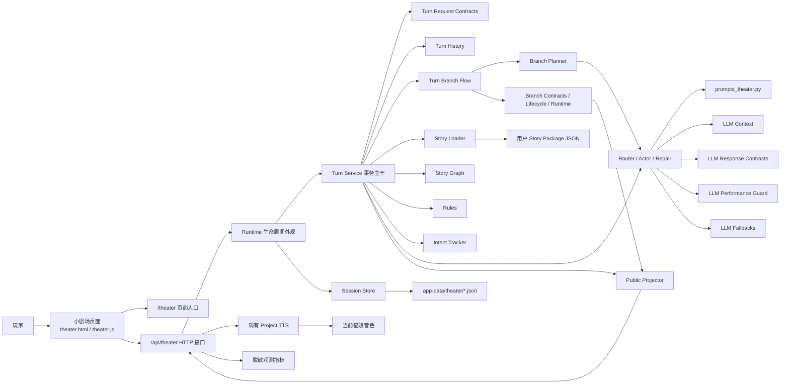
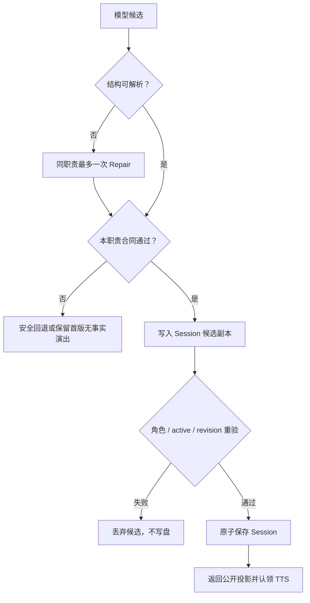
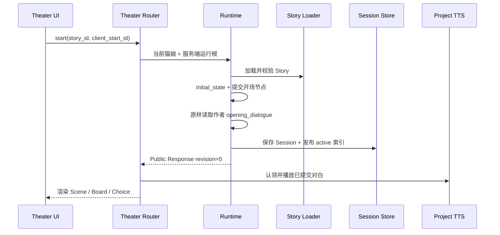
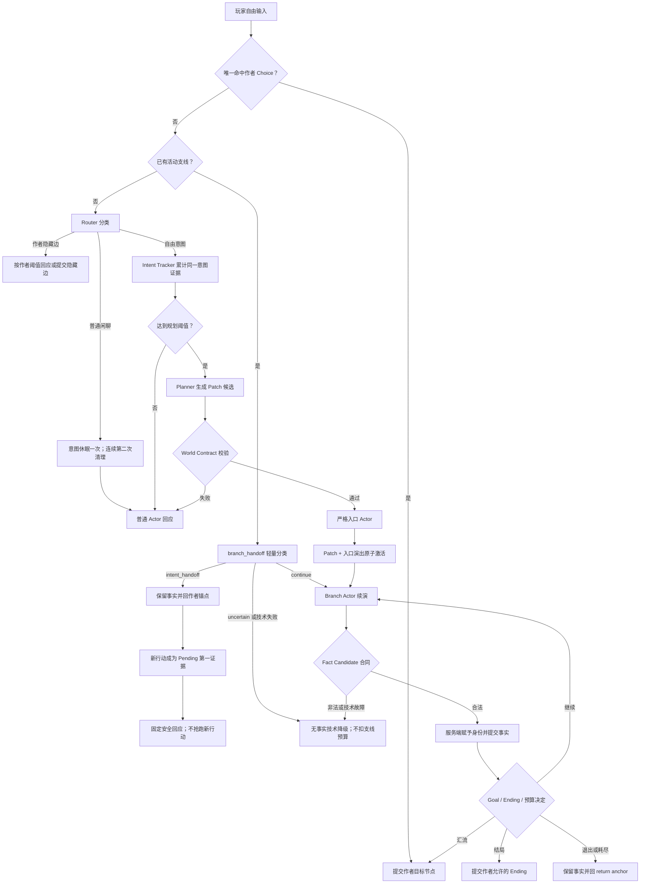

# N.E.K.O 小剧场架构与模块说明

## 1. 文档定位

本文整理当前小剧场的实际架构、功能边界、数据权威关系、核心流程和全部模块职责，作为后续维护、扩展用户剧本与 SDK 设计时的长期入口。

本文描述的是当前工作区已经存在的 v2.7 架构，不是实施计划。版本演进、点评采纳结论、验收数据和阶段性决策参见 [`neko-theater-v2.7-implementation-architecture.md`](./neko-theater-v2.7-implementation-architecture.md)。若本文与代码、测试或真实运行结果冲突，以可复现的当前代码事实为准，并同步修正文档。

当前框架的产品定义是：

> 作者提供 Story Package，服务端决定什么已经真实发生，大模型理解玩家并负责演绎，前端只展示已经原子提交的公开结果。

一场演出只有玩家和当前活跃猫娘两位直接发言者。后续正式剧本来自用户；内置剧本只是示例和测试夹具，不是框架的默认题材。

## 2. 架构目标与不变量

### 2.1 架构目标

1. **作者可控**：世界设定、主线因果、目标和可到达结局由 Story Package 声明。
2. **玩家自由**：推荐 Choice 是稳定建议，不是唯一入口；自然语言可以命中作者边，也可以形成受约束的临时支线。
3. **状态可信**：只有服务端规则和合同校验可以提交节点、事实、Goal、Ending 与 revision。
4. **演绎自然**：大模型用当前猫娘人格回应玩家，但不能成为状态数据库或替作者改写世界。
5. **可恢复**：刷新、网络重试、窗口重开、角色切换和进程重启不能重复推进或串用其他猫娘的 Session。
6. **内容通用**：运行时代码只理解 schema、合同和稳定 ID，不理解某个具体剧本的物品、地点、台词或剧情顺序。

### 2.2 必须长期保持的不变量

- Story Package 是作者权威；模型不能修改 Story JSON。
- Session 私有状态是运行时权威；前端本地状态不是剧情真源。
- Router、Planner 和 Actor 的输出都是候选，不因模型说“已经发生”就自动成为事实。
- 普通 Actor 只负责表现，不能推进静态图或写入 Branch Fact。
- Runtime Branch Patch 必须先通过 World Contract，再与入口演出一起原子激活。
- Branch Fact 必须在公开演出中可观察、符合 Patch，并由服务端分配身份后才算已提交。
- 正式结局只能由作者节点规则或 Ending Domain 的确定性证据触发。
- Projector 是私有状态与前端之间的唯一公开边界。
- 通用代码不得匹配特定 `story_id`、节点 ID、Choice ID、角色名、关键词或固定文案。
- 小剧场不向普通聊天写入文字消息，也不发送普通聊天的 turn-end；只复用现有 TTS 音频能力。

### 2.3 跨版本开发规范与改动范围硬约束

本节是小剧场的长期开发门禁，对当前版本和以后所有版本持续有效。升级到 v2.8 或更高版本、新建实施文档、重构目录、替换开发者或开发工具，都不能自动删除、弱化、改写或绕过本节。未来版本文档必须继续引用本节并明确声明继承；若确需改变约束本身，也必须先取得用户明确确认。

所有涉及小剧场的开发工作——包括代码、Story Package、Prompt、配置、脚本、测试、文档、UI、i18n、音视频资源和生成源——都必须遵守当前工作区的 [`neko-guide.md`](../../.agent/rules/neko-guide.md)；上游公开版本见 [Project N.E.K.O / neko-guide.md](https://github.com/Project-N-E-K-O/N.E.K.O/blob/main/.agent/rules/neko-guide.md)。实施时以当前工作区文件为直接规范来源，不能只凭记忆、旧版本摘录或一般工程习惯代替。版本更替不构成规范豁免。

小剧场默认允许修改的范围只有：

1. 小剧场 Story Package、作者合同、剧情图、演绎 Prompt、Session、回合事务、规则、支线、事实、投影、恢复、观测和小剧场专属 API；
2. 小剧场独立页面的 HTML、JavaScript、CSS、八语种文案、舞台音视频资源及其可重建生成源；
3. 与上述能力直接对应的小剧场测试、夹具、作者工具和开发文档；
4. 当前角色与小剧场之间必要且最窄的连接：解析当前角色身份、使用当前角色已配置的 TTS、在角色切换时隔离或恢复该角色所属的小剧场 Session。

以下内容默认不属于小剧场改动范围：

1. Live2D、VRM、MMD 的表情、动作、口型、模型状态、视觉过渡、模型位置或恢复协议；
2. 首页、普通聊天、聊天历史、全局 WebSocket、全局音频、通用角色卡、通用窗口管理、多显示器策略和其他页面的表现链路；
3. 与当前小剧场目标没有直接因果关系的共享基础设施重构、全项目视觉统一、顺手清理、兼容协议改写或相邻功能优化。

角色切换只授权处理“小剧场 Session 归属与当前角色 TTS 不串用”，不授权接管角色模型或恢复视觉表现。小剧场独立页面自己的布局、主题、舞台背景和交互属于小剧场范围，不得因为它们是视觉内容就误判为角色模型能力并撤销。

任何计划触及默认范围之外的文件或行为时，必须先停止实施，并向用户说明：当前代码证据、拟修改文件清单、为什么小剧场范围内无法完成、对其他链路的影响、可选的范围内方案和精确回退方式。只有用户针对该项给出明确确认后才能修改；“继续”、版本升级、既有脏工作区、旧计划或技术上看似必要，都不能代替确认。未获得确认时，保留现状并在小剧场范围内继续，不能先改后报。

每轮实施前必须先检查 `git status --short`，声明本轮允许修改的文件和可观察成功标准；完成后逐文件核对，每一处改动都必须能直接追溯到已确认的小剧场需求。若发现误改越界内容，应立即停止新增实现，先用 diff 或操作记录精确恢复误改，不得用整仓、整目录回退影响用户已有修改。

### 2.4 架构优化与弃用代码删除门禁

架构优化默认是“保持产品语义不变的内部收口”，不能把删除行数当作完成目标。代码只有同时满足以下证据才能按弃用项删除：

1. 当前生产调用链、动态注册入口和公开协议消费者均无引用；
2. 不承担旧 Session、用户 Story、幂等请求或角色归属的兼容解释；
3. 删除后仍有直接测试覆盖同一公开行为，且测试不再依赖被删除的私有挂点；
4. 对应文档、假后端和夹具不再伪造已经退出公开协议的字段。

只被测试直接调用的私有函数不能自动视为生产能力。若生产调用已经移除、测试只验证该孤立实现，应删除实现与旧测试，并把仍有价值的断言改到当前真实入口。反过来，FastAPI 装饰器注册函数、测试专用状态清理、离线观测报告读取等显式入口即使静态引用少，也不能按普通死代码删除。

三项兼容决策已经按无损迁移原则收口：Runtime 不再扫描或产生新的 24 小时休眠状态，但继续读取、投影和唤醒旧 Session 的 `dormant_at`；三份正式 Story 的所有边都显式声明 `visibility`，Loader 与 Graph 只为旧用户 Story 保留缺省 `recommended`，作者工具固定发出 `edge_visibility_legacy_default` 警告；五个正式动态槽位仍没有足够作者证据建立 Catalog，因此 `declarative_only` 路径继续保留并警告，不能由框架猜造目录。后续删除剩余兼容读取前仍必须证明旧数据可无损解释，不得通过删 Session、清活动索引或静默拒绝用户 Story 完成清理。

## 3. 系统总览



架构可以分为六层：

| 层 | 作用 | 是否拥有剧情写权限 |
|---|---|---|
| 内容层 | Story Package 与 Prompt 定义作者内容和模型职责 | Story Package 拥有作者定义权 |
| 接入层 | 页面路由、HTTP、CSRF、当前猫娘解析、TTS 桥 | 不直接推进剧情 |
| 编排层 | Session 生命周期和单回合事务 | 负责组织提交边界 |
| 规则层 | 静态图、合同、支线生命周期、结局判断 | 可以在候选 Session 中产生权威变化 |
| 模型层 | 路由、规划、演绎、一次 Repair 与安全回退 | 只产生候选，不直接写状态 |
| 展示层 | 公开投影、页面状态、桌面子窗口 | 只消费公开结果 |

## 4. 目录与全部模块职责

### 4.1 应用接入模块

| 文件 | 作用 |
|---|---|
| `app/main_server.py` | 注册 `theater_router`，把小剧场 API 纳入主 FastAPI 进程。小剧场与其他子系统共享事件循环，因此内部文件 IO 和模型调用必须保持异步。 |
| `main_routers/pages_router.py` | 提供 `GET /theater` 页面入口，加载小剧场模板、样式和脚本。 |
| `main_routers/theater_router.py` | 提供 `/api/theater` 接口；解析服务端当前猫娘；执行本地 mutation/CSRF 校验；把已提交对白窄桥接到现有 TTS。故事列表与开场均不扫描或按时间改写其他 Session。 |
| `main_routers/characters_router/crud.py` | 在当前猫娘切换或重命名时调用小剧场 Runtime，串行发布角色变化并关闭旧角色活动 Session，防止跨人格恢复和旧对白继续播放。 |

### 4.2 小剧场服务模块

| 文件 | 作用 | 关键边界 |
|---|---|---|
| `services/theater/__init__.py` | 声明小剧场服务包。 | 不承载业务逻辑。 |
| `services/theater/runtime.py` | 小剧场生命周期外观：故事列表、启动、恢复、输入转交、对白 TTS 认领、角色切换和结束。负责 Session schema、Story revision 及旧休眠存档等恢复兼容性检查。 | 不根据闲置时间生成新生命周期，不把不兼容存档猜测迁移到其他故事；保留原文件并返回明确原因。 |
| `services/theater/turn_service.py` | 唯一回合事务主干与总状态机。持有 Session/角色锁、候选副本、Story revision、模型返回与回合因果记录、最终重验、幂等缓存和原子保存；普通作者图推进仍在本模块编排。 | `submit / _submit_impl / _apply_turn / _current_catgirl_name` 必须继续在本模块定义；模型生成期间不写真源，最终重验角色、active Session 和 revision 后才保存。 |
| `services/theater/turn_request_contracts.py` | 规范化回合请求，派生低基数事务结果和执行面，校验玩家原话证据，并提供幂等回放与 revision 冲突响应。 | 只处理纯请求/响应值，不读写文件、Session 或模型；幂等回放必须返回深拷贝。 |
| `services/theater/turn_history.py` | 合成静态图补充对白，维护有限公开回合历史和统一毫秒时间戳。 | 不读 Story、模型、文件或 Session Store；历史上限保持最近四轮消息对。 |
| `services/theater/turn_branch_flow.py` | 在候选 Session 内执行活动支线转交、技术降级、续演、收束、支线进入和主动退出子流程。 | 不获取锁、不保存 Session、不反向导入 `turn_service.py`；`intent_handoff` 先收口旧支线再创建 Pending，同回合不规划第二条 Patch。 |
| `services/theater/session_store.py` | 异步读写 Session 与活动索引；提供同 Session、同运行目录活动索引、同角色三类锁；维护 revision、stale 判断和损坏索引重建。 | 磁盘提交成功后才更新内存索引；Session 文件是活动索引的恢复真源。 |
| `services/theater/story_loader.py` | Story 稳定门面：从 `config/theater/stories` 读取 Story Package，提供列表、严格 ID 加载、Scene 查询、公开故事卡投影和只读单文件校验入口；继续兼容导出 `StoryRootNotObjectError` 与 `initial_node_id`。 | 只负责 IO、查找和公开投影，不再承载作者合同实现；`summary`、未来 Scene 与生成约束不进入选剧接口；单文件校验不扫描 sibling；显式错误 Story ID 和恢复 ID 都不能回退到目录第一份故事。 |
| `services/theater/story_contracts.py` | Story 根结构与静态作者图的唯一校验入口：校验必填字段、Scene、节点、作者对白与 Choice、边引用、setup、全节点可达的前向图和显式结局，再按原有顺序调用动态合同。 | 校验成功返回深拷贝；异常类型、错误文本和校验顺序属于兼容合同；不读文件、不扫描目录、不执行运行时状态变更。 |
| `services/theater/story_dynamic_contracts.py` | 校验可选 v2.5 动态作者合同：成组字段、Narrative Goal、World Contract、完成事实投影、动态内容槽位与 Catalog、Ending Domain 及其交叉引用。 | 未迁移 Story 继续兼容 v2.4；v2.5 字段必须成组出现；Catalog 成员必须满足作者正向/禁止 traits；不承担 IO、公开投影或 Runtime 分支执行。 |
| `services/theater/story_graph.py` | 查询当前节点与可达出边；生成稳定推荐 Choice；解析可见 Choice、作者完成表达和隐藏语义边；统一过滤已完成 Goal 的入口。 | 前端显示的 Choice 来自“当前可达目标节点”的 suggestion；隐藏边永不公开为按钮。 |
| `services/theater/fact_view.py` | 从静态 `narrative_facts` 和已完成 Goal 的作者投影构建统一只读事实视图；按语义稳定去重并返回副本。 | 不读取原始 Branch Fact，不修改 Session，也不合并静态与动态事实存储。 |
| `services/theater/rules.py` | 初始化 Story State；应用作者节点的事实增量、道具、线索、flag 与 Goal；维护旧作者隐藏边的连续意图；通过统一 Fact View 执行静态门禁和结局判断。 | 只提交作者声明的数据，不根据台词内容猜测 Goal 或结局。 |
| `services/theater/intent_tracker.py` | 跟踪未命中作者边的通用自由意图，保存服务端身份、语义、来源节点、证据次数、有限原话和 active/dormant 线程状态；判断是否达到规划阈值；下一轮明确确认时可接纳普通复合输入或支线转交留下的 Pending 证据。 | 不含剧本关键词；规划必须显式匹配当前节点、服务端阈值和证据数量；换节点或换意图会清理，一次普通 idle 只休眠、连续第二次才清理；Pending 和休眠态都不能单独规划；玩家证据必须完整落入存储边界，不能静默截掉句尾后继续累计。 |
| `services/theater/branch_planner.py` | 调用 Planner，并立即使用本地合同校验其 Runtime Branch Patch；只向调用方返回已验证 Patch。 | Planner 无法生成服务端 ID、revision 或绕过 World Contract。 |
| `services/theater/branch_contracts.py` | 临时支线合同的稳定兼容门面，继续从原路径导出 Patch、Fact、History、公开实体校验函数和公开常量。 | 不承载合同实现，不新增包装层；现有 Runtime、Planner、Projector、Story 合同和测试消费者不得绕过门面改导入。 |
| `services/theater/branch_contract_common.py` | 提供 Patch 与 Fact 共用的精确字段、短文本、公开实体、事实三元组、内容槽与 Catalog 索引校验原语。 | 不认识 Patch 出口、Goal、Ending、History 或服务端事实身份；不反向导入业务合同，也不读写 Session、文件或模型。 |
| `services/theater/branch_patch_contracts.py` | 校验 Runtime Branch Patch、作者禁止事实并入、预算、出口、事实授权、Beat 和玩家动态按钮文案。 | 只依赖 Common；Planner 不能生成服务端身份、扩大 World Contract、引用已完成 Goal 或声明不可达出口。 |
| `services/theater/branch_fact_contracts.py` | 校验 Branch Fact Candidate、构造服务端权威事实、恢复时重验 Committed Fact 与原 Patch，并校验 Branch History。 | 只依赖 Common；候选必须已公开且命中 Patch 授权，Catalog object/kind/label 必须精确命中作者成员，History 只能引用同支线权威事实。 |
| `services/theater/branch_lifecycle.py` | 提供 Pending Intent 和活动支线的纯状态机；建立 return anchor；推进总预算与非推进预算；产生继续、汇流、结局、作者 Choice、主动退出、`intent_handoff` 或安全回锚决定；技术降级与显式转交都不消耗旧支线预算。 | 禁止嵌套支线；生命周期只返回固定状态与退出码，不生成剧情内容，也不把基础设施故障算成玩家非推进。 |
| `services/theater/branch_runtime.py` | 把活动 Branch Actor 的事实候选校验并提交；去重并分配 `fact_id/entity_id/source_revision`；按当前 Story 重验 Catalog 事实；判断 Goal/Ending 证据；生成和重验 opaque 动态 Choice；提供已结束支线的有限语义召回。 | 只有本轮新提交事实算进度；模型自报进度或 traits 无效；恢复/召回中的目录事实仍须命中作者成员；合法空事实仍是正常非推进。 |
| `services/theater/llm.py` | 唯一模型编排主干：本地定义自由输入 Router、活动支线 handoff、Planner、支线入口/活动支线/普通 Actor、一次 Repair、统一模型发送器、模型配置和调用观测顺序。 | 六个模型入口与 `_invoke_model_once` 必须继续使用本模块全局变量，确保现有 monkeypatch、调用次数、timeout、token budget、model trace 和指标顺序不变。 |
| `services/theater/llm_response_contracts.py` | 校验 Router、handoff、Planner 与 Actor 的结构化输出、回应焦点和唯一 JSON 对象，并生成稳定技术降级结果。 | 不读取文件、Session 或模型，不调用观测层；只接受既有字段、枚举和长度边界，多对象输出必须拒绝。 |
| `services/theater/llm_performance_guard.py` | 检查内部引用泄漏、未提交 Choice 抢跑、作者输出护栏、人格自称/同意边界和近期对白重复。 | 只返回既有稳定修复原因，不修改 Story/State，不把开放式叙事偏好升级成状态权威。 |
| `services/theater/llm_fallbacks.py` | 生成普通回合、支线入口、活动支线和意图转交的确定性安全回退。 | 不调用模型、不提交事实、不替玩家完成 Choice，也不生成新地点、物品或剧情状态。 |
| `services/theater/llm_context.py` | 对玩家原话、公开历史、已结束支线召回、作者权威事实和当前猫娘人格摘要执行有限投影。 | 不发起模型调用、不写文件或 Session；当前角色、路径边界和 token 截断行为保持统一。 |
| `services/theater/projector.py` | 把私有 Session 转成前端安全响应：Scene、旁白、对白、Board、Trace、Choice、Ending 与派生生命周期；将已提交动态公开实体合并到既有 Board 三组。 | 不公开私有事实、Goal、Patch、History、内部节点、路由候选或服务端身份。 |
| `services/theater/observability.py` | 记录 Router/Planner/Actor/Repair 的调用量、耗时、token、合同结果、回退与支线结果；`branch_handoff` 作为 Router 的独立模型 surface；另行记录完整 `submit` 事务耗时和 Session 锁等待；生成 P50/P95 和质量比率。 | 模型 surface 与完整回合执行面使用独立分母；handoff 回合在完整事务层仍是 `branch_turn`；只允许低基数枚举和数值，不保存玩家原话、Prompt、Story 内容、角色名或模型全文。 |

### 4.3 内容与 Prompt 模块

| 文件或目录 | 作用 |
|---|---|
| `config/prompts/prompts_theater.py` | 集中定义并构造自由输入 Router、活动支线 `branch_handoff` 轻量分类、普通/入口 Actor、Branch Planner、Branch Actor 的 Prompt。负责只投喂当前职责需要的有界上下文。 |
| `config/theater/stories/*.json` | 用户 Story Package 存放目录。当前三份 JSON 是可选内容与跨题材回归样本，全部走同一 Loader、Runtime、Projector 和 UI。 |
| `tests/fixtures/theater/narrative_eval_v1.json` | 三个独立合成题材、十六个案例及人工校准标签；不包含真实用户、正式 Story 或线上模型正文。 |
| `tests/utils/theater_narrative_eval.py` | 校验固定集、合入外部候选和人工复核，并只对可精确比较的结构项评分。 |
| `scripts/run_theater_narrative_eval.py` | 以零模型、零网络方式生成脱敏评测报告；输出不得与 dataset/observations 形成直接、符号链接或硬链接别名，报告通过同目录临时文件原子替换，输入、schema、写入和内部故障只输出稳定脱敏原因码。真实候选必须由另行授权的任务产生。 |
| `scripts/validate_theater_story.py` | 以零模型、零网络方式校验作者显式指定的一份 Story，输出稳定脱敏原因码、缺省 visibility 兼容警告和可选槽位执行级别；不扫描 sibling、不修复输入。 |
| `config/__init__.py` | 维护小剧场模型输入、输出、事实候选和召回等全局预算常量。业务代码不得自行散落另一套预算。 |
| `tests/fixtures/theater/narrative_eval_v1.json` 与 `tests/utils/theater_narrative_eval.py` | 保存跨题材合成人工金标，并对路由、事实锚点、按钮合同和汇流结构做确定性评分；人格、对白—按钮自然衔接与收束自然度只生成待人工审核项。 |

Story Package 内的专属人名、地点、物品、台词和节奏只能留在对应 JSON 中。若某份新剧本需要框架没有的能力，应先把需求抽象成可校验的通用 schema，并用不同题材的 Story 证明它不是单剧本特例。

### 4.4 前端与视觉模块

| 文件或目录 | 作用 |
|---|---|
| `templates/theater.html` | 小剧场独立页面骨架：故事介绍、舞台、演绎记录、Scenario Board、Trace、行动/对白 Choice、自由输入、Ending 与不兼容存档提示。 |
| `static/js/theater.js` | 页面状态机和 API 客户端：故事选择、启动、恢复、休眠提示、提交输入、busy 锁、幂等 ID、revision 冲突恢复、日志渲染、Board/Choice/Ending 更新与主动结束。 |
| `static/css/theater.css` | 小剧场响应式布局、浅色/深色主题、舞台与控件样式。视觉语言与 N.E.K.O 通用设置保持一致。 |
| `static/assets/theater/galaxy-flow-down-right-8s.mp4` | 前端舞台的冻结银河循环背景。运行时只播放视频，不依赖生成工具。 |
| `static/locales/{en,es,ja,ko,pt,ru,zh-CN,zh-TW}.json` | 小剧场用户可见文案的八语种翻译。新增或修改文案时必须同步全部 locale。 |

前端只保存一个不透明的 Session 指针 `neko.theater.activeSession.v1`。它不保存剧情事实、可达边、私有 Branch Fact 或结局判定；刷新时仍必须向服务端恢复公开快照。

### 4.5 桌面端与窗口承载

小剧场通过 `window.open('/theater', '_blank')` 打开独立页面。桌面端使用 N.E.K.O.-PC 已有的通用子窗口策略和 preload 窗口控制能力，不另建一套小剧场专属 Electron 运行时。

这意味着：

- 小剧场页面负责自己的业务状态与恢复；
- Electron 只负责窗口创建、边界、关闭/最小化/最大化等通用能力；
- 页面刷新后由服务端 Session 恢复，而不是依赖 Electron 窗口内存；
- 小剧场子窗口不得污染主窗口的普通聊天 DOM 或消息流。

### 4.6 测试模块

| 文件 | 覆盖范围 |
|---|---|
| `tests/unit/test_theater_story.py` | Story Loader、静态 Graph、Rules、入口、边引用、可达结局和 Story 通用性。 |
| `tests/unit/test_theater_runtime_light.py` | 启动、回合、恢复、幂等、revision、并发、角色边界、活动索引、旧休眠存档恢复/唤醒、不兼容存档原样保留、稳定终止原因，以及活动支线 handoff 的原子回锚与 Pending 转交。 |
| `tests/unit/test_theater_llm_light.py` | Prompt、模型 JSON 解析、各职责输出校验、`branch_handoff` 双摘录/高置信门禁、普通 Actor 轻介入策略、Repair 和回退。 |
| `tests/unit/test_theater_llm_module_boundaries.py` | 六个模型入口和统一发送器的原模块归属、旧路径对象身份、子模块依赖方向、独立技术降级结果和唯一 JSON 合同。 |
| `tests/unit/test_theater_frontend_light.py` | 模板、脚本、样式、locale、公开字段与前端轻量能力契约。 |
| `tests/unit/test_theater_intent_tracker.py` | 通用自由意图的继续、细化、替换、休眠/恢复、Pending 确认证据、阈值和清理。 |
| `tests/unit/test_theater_branch_contracts.py` | Patch、Fact、History、内容槽、Goal/Ending 引用和服务端身份保护。 |
| `tests/unit/test_theater_content_catalog.py` | 三种无关题材的 Catalog Loader、Patch/Fact 绑定、篡改拒绝、原子提交、恢复重验和旧槽位兼容。 |
| `tests/unit/test_theater_story_validation_cli.py` | 单文件作者校验、稳定原因码、报告脱敏、输入不变、输出冲突和零模型/零网络边界。 |
| `tests/unit/test_theater_narrative_eval.py` | 跨题材固定集、机械/人工评分边界、候选标签隔离、CLI 退出码、报告脱敏、输入输出别名拒绝、原子替换失败不破坏旧报告，以及零模型/零网络边界。 |
| `tests/unit/test_theater_branch_lifecycle.py` | Pending Intent、支线预算、非推进、`intent_handoff` 无预算回锚、其他退出决策和禁止嵌套。 |
| `tests/unit/test_theater_branch_runtime.py` | 事实提交、去重、动态 Choice、Goal 证据、Ending 证据和有限召回。 |
| `tests/unit/test_theater_fact_view.py` | 静态/动态 Goal 作者投影、节点与结局条件、模型公开状态、稳定去重、旧 Story 兼容和原始 Branch Fact 越权隔离。 |
| `tests/unit/test_theater_ending_domain.py` | Ending Domain 从 Story 合同到终态 Session 的端到端确定性闭环。 |
| `tests/unit/test_theater_projector.py` | 私有字段隔离和已提交动态实体的 Board 投影。 |
| `tests/unit/test_theater_mixed_input.py` | 正式剧本中自由输入与作者 Choice 的混合压力路径。 |
| `tests/unit/test_theater_observability.py` | 模型与完整事务指标聚合、锁等待、比率、枚举收敛、单次记录和内容隐私隔离。 |
| `tests/unit/test_theater_tts_bridge.py` | 已提交对白认领、去重、角色变化、stale revision 和现有 TTS 桥。 |
| `tests/unit/test_theater_turn_service_module_boundaries.py` | Turn Service 唯一事务主干、旧路径对象身份导出、子模块依赖方向、模型/Store 测试挂点和幂等深拷贝。 |
| `tests/unit/test_theater_page_runtime_smoke.py` | `/theater` 页面入口与真实静态资源加载。 |
| `tests/unit/test_theater_pc_window_contract.py` | 与兄弟 N.E.K.O.-PC 工程的通用子窗口契约。 |
| `tests/integration/test_theater_llm_protocol_smoke.py` | OpenAI-compatible 模型协议、请求结构、预算和错误响应。 |
| `tests/integration/test_theater_real_model_smoke.py` | 显式开关下的真实模型质量、完整自由支线长跑和脱敏评测报告。 |
| `tests/frontend/test_theater_browser_smoke.py` | 真实 Chromium 中的故事选择、启动、输入、刷新恢复、错误恢复和布局交互。 |
| `tests/electron/theater-electron-window-smoke.test.js` | 实体 Electron 子窗口、刷新恢复、窗口控制和显示器边界。 |
| `tests/electron/theater-electron-main-app-smoke.test.js` | 从实际主应用打开小剧场以及主/子窗口隔离。 |

## 5. 权威关系与数据边界

### 5.1 四类权威对象

| 对象 | 来源 | 可以决定什么 | 不能决定什么 |
|---|---|---|---|
| Story Package | 用户/作者 JSON | 世界、角色关系、静态图、Goal、内容槽、结局范围 | 某一场演出已经发生了什么 |
| Session `story_state` | 服务端规则提交 | 当前节点、事实、道具、线索、支线进度、已完成 Goal | 修改作者 Story 定义 |
| 模型输出 | Router/Planner/Actor | 路由候选、Patch 候选、演出文本、Fact 候选 | 直接写 Session、revision、Ending 或服务端 ID |
| Public Response | Projector | 前端本轮可以安全展示的内容 | 作为后续剧情真源反向写回私有状态 |

### 5.2 提交门



普通 Actor 的文本检查采用轻量介入：提问镜像、重复和称呼细节等软问题不会触发 Repair 或整轮兜底。`choice_rewrites` 只保留为空数组的旧模型响应形状，服务端无条件丢弃非空内容；静态 Choice 的文案、ID、模式、目标和 callback 始终来自作者。坏 JSON、越过作者/世界/同意边界、明确抢跑未提交的玩家结果等硬问题仍可触发一次 Repair，失败后使用安全回退。

Planner、Branch Fact 和 Ending 会改变权威状态，因此仍执行严格结构与合同校验。

## 6. Story Package 数据模型

### 6.1 基础内容

| 字段 | 作用 |
|---|---|
| `id / story_revision / title` | 故事稳定身份、版本和公开标题。 |
| `background` | 选择页唯一稳定背景介绍；正式发布 Story 必须写成单段电影式剧情简介，按 `len(background.strip())` 计算为 350–500 个 Unicode 字符；依次交代时代与地点、双主角当前关系与初始失衡、触发事件与眼前目标、两至三个升级压力、双方方法或价值观冲突及未决悬念，猫娘保持共同主角的主动性与边界；不混入 Story、Scene、Node、Choice、Goal、模型、规则、护栏等系统语言，也不剧透关键反转、关系或救援结果、正式结局。 |
| `summary / theme / world_seed` | 作者内部摘要、主题和模型世界上下文，不进入选剧 API。 |
| `seed` | 玩家身份、开场事实与禁止假设。 |
| `scenario_card` | 可选公开角色卡；存在时只声明玩家角色、当前猫娘角色和不剧透的公开目标，禁止重复 `brief` 或承载生成 `rules`。 |
| `restrictions / runtime_guardrails` | 仅供服务端与模型执行的作者边界、禁止模式和演绎硬约束，不进入故事选择页。 |
| `opening_dialogue` | 作者可直接播放的正式开场对白；缺失时保持为空，框架和模型都不能补写或改写。 |
| `initial_scene_id / scenes` | 服务端完整阶段集合；选剧接口只公开作者指定的 `initial_scene`，演出中只公开当前 Scene。 |
| `stage_props / clues` | 作者道具和公开线索。 |
| `ending_attractors` | 静态作者结局条件。 |

### 6.2 静态剧情图

| 对象 | 关键字段 | 作用 |
|---|---|---|
| Node | `node_id`、`belong_phase`、`node_type`、`scripted_dialogue`、`preconditions`、`state_diff`、`script_action`、`completes_goal_ids` | 表示一个可以确定性提交的作者剧情结果；除 seed 外必须提供正式作者对白。 |
| Edge | `from_node`、`to_node`、`visibility`，以及可选 Goal/Intent 元数据 | 表示当前节点可到达的作者结果。`recommended` 生成按钮，`latent` 只参与隐藏语义路由。 |
| Suggestion | `choice_id`、`choice_mode`、`label`、`completion_phrases`、`callback` | 定义进入目标 Node 的玩家行动或对白。ID 和目标始终由作者控制。 |
| Generation Guide | `narrator_intent`、`catgirl_raw_intent` 等 | 给 Actor 提供当前节点的表达意图，不直接成为公开事实。 |

Choice 的结构有一个容易误读的约定：当前页面展示的 Choice 来自当前节点可达的“目标节点”上的 `suggestions`，而不是当前节点自身。这样作者可以把“玩家做什么”与“做完后提交什么结果”放在同一个目标节点中。

正式发布的 Story 必须为每条边显式写出 `visibility`。缺失、空值或 `null` 继续按 `recommended` 解释只用于读取旧用户 Story；作者单文件工具会发出 `edge_visibility_legacy_default`，不能把兼容默认值继续当成新 Story 的作者格式。

### 6.3 v2.5 动态支线合同

| 对象 | 作用 |
|---|---|
| `world_contract` | 声明说话角色、不变事实、允许的动态事实类型、内容槽、禁止改变项、支线预算、退出策略、允许的 Ending Domain 和可汇流 Goal。 |
| `narrative_goals` | 声明一个剧情功能完成所需的证据角色、完成后汇入的作者节点与中性 callback，以及可选的永久事实投影。 |
| `ending_domains` | 声明动态结局所需 Goal、事实、禁止事实和最终作者 Ending 映射。 |
| Runtime Branch Patch | Planner 针对当前连续自由意图提出的临时计划，包括入口锚点、预算、事实能力、Beat 和出口候选。 |
| Branch Fact | 活动支线中已经公开发生、通过合同并由服务端赋予身份的结构化事实。 |
| Branch History | 支线结束后的只读索引，记录完成 Goal、关键事实引用、退出原因和结束 revision。 |

动态内容槽不是让模型发明任意世界对象，而是作者预先声明的受限空位。例如作者可以允许“一个有限、当地可得、非武器的维修零件”。只有槽位进一步提供 `catalog_items` 时，服务端才能用稳定 `(content_slot_id, content_id)` 证明具体公开实体属于作者目录，并精确校验事实 object、Board kind 与 label；模型自报 traits 或物件名称关键词都不是证明。目录内部引用、公开标签、成员数、traits 和 Planner 投影都有 Loader 预算，不能靠超长字段放大 Prompt，也不能把机器标签误报为可执行目录。无 Catalog 的旧槽仍按 v2.5 兼容运行，但其 `allowed_traits / forbidden_traits` 只能解释为声明边界，作者工具会标记为 `declarative_only`。

### 6.4 统一只读 Fact View

静态与动态路径共用 `completed_goal_ids`，但不共用同一种事实存储对象。框架用以下只读派生视图把已完成剧情功能安全地提供给静态规则与模型上下文：

```text
Fact View = narrative_facts
          + 已完成 Narrative Goal 的作者 completion_fact_projections
```

`completion_fact_projections` 是 Narrative Goal 的可选字段。每项必须恰好包含非空 `subject / predicate / object`，表达 Goal 完成后永久、单调成立的作者事实。Loader 拒绝附加 `branch_id / fact_id` 等身份字段和同一 Goal 内的重复三元组。旧 Story 缺少字段时行为与此前一致；正式 Story 新增投影若会改变节点、结局或演绎语义，必须提升 `story_revision`。

Fact View 只服务静态节点前置条件、传统结局条件、阶段输出护栏和各模型职责的公开已确认事实。动态 Goal/Ending Domain、动态 Choice、当前 Branch Actor 事实合同、History、Board 与恢复校验仍读取带支线作用域和服务端身份的原始 Branch Fact。模型生成的三元组因此不能绕过作者投影直接解锁静态剧情，Projector 和公开 API 也不会得到新的私有字段。

## 7. Session 数据模型与持久化

### 7.1 Session 包络

| 字段 | 作用 |
|---|---|
| `schema_version` | Session 协议版本，与 Story revision 分开管理。 |
| `session_id / story_id / story_revision / lanlan_name` | 演出、Story 版本和角色归属。 |
| `phase / state_revision / story_state` | 当前阶段、乐观并发版本和私有剧情状态。 |
| `turns` | 有界的近期公开对话，用于模型上下文。 |
| `public_snapshot` | 最后一次成功提交的公开响应，恢复时不重新调用模型。 |
| `turn_results_by_client_id` | 有界回合幂等缓存。 |
| `start_client_id` | 开场请求幂等 ID。 |
| `spoken_dialogue_revisions` | 已认领 TTS 的 revision，防止刷新或重试重播。 |
| `started_at / updated_at` | 活动时间戳；`updated_at` 只记录最近一次成功剧情提交或显式终止转换，不用于推断新的自动休眠状态。 |
| `dormant_at / ended_at` | 可选生命周期时间戳；存在时必须是非布尔正整数毫秒。Runtime 不再生成新的 `dormant_at`，但继续兼容旧休眠存档；旧文件若同时存在结束与休眠，恢复时以结束为准并移除休眠标记。 |
| `end_reason` | 仅在真正结束时写入的固定字符串枚举，并且必须伴随合法 `ended_at`；旧结束存档可以缺原因，未结束 Session 的孤儿原因、非字符串或枚举外原因均视为坏状态。 |

### 7.2 `story_state` 私有字段

| 字段组 | 作用 |
|---|---|
| `current_node_id / completed_node_ids / narrative_facts` | 静态作者图的当前位置与已提交事实。 |
| `available_prop_ids / used_prop_ids / clue_ids / flags` | Scenario Board 的作者实体状态。 |
| `scene_notes` | 有界自由互动笔记；不参与权威路由或结局。旧 Session 若残留 `choice_label_overrides`，运行时忽略并在下一次可保存回合清除。 |
| `active_goal_id / focused_intent_id / intent_streak / goal_pullback_count / branch_commitment` | 作者隐藏语义边的局部跟踪和已提交余波。 |
| `dynamic_intent` | 通用图外自由意图的服务端身份、有限证据及 active/dormant 短期线程状态；旧存档缺少线程状态时按 active 懒归一化。 |
| `pending_intent` | 复合输入在主线推进后，或 `intent_handoff` 关闭旧支线并回作者锚点后，等待目标节点下一轮再次确认的短期余意；它不携带支线激活权限。 |
| `active_runtime_branch` | 已验证 Patch、服务端身份、return anchor 和支线计数。 |
| `branch_facts / completed_goal_ids / branch_history` | 动态事实、统一 Goal 完成集合和已结束支线索引。 |

Fact View 不是 `story_state` 字段，也不会写盘；它在每次消费者读取时由上述权威字段与当前 Story 作者合同确定性派生。

### 7.3 磁盘位置

运行根由 `ConfigManager` 决定，小剧场不硬编码用户目录：

```text
<app-data>/theater/
├── active_sessions.json
└── sessions/
    └── <session_id>.json
```

- `sessions/*.json` 是每场演出的真源。
- `active_sessions.json` 只保存“猫娘名 → 当前 Session ID”的恢复索引。
- 活动索引损坏时，服务端会从每个角色最新的未结束 Session 重建，不改写剧情事实。
- Runtime 不再按 24 小时或其他闲置时长扫描、改写 Session；故事列表和开场都只处理当前请求范围，不遍历其他演出。
- 旧 Session 若已经保存合法 `dormant_at`，`/session/state` 与 `/session/active` 仍投影为可恢复 `dormant`，不会删除文件或活动索引。
- 第一笔成功的新回合会随候选 Session 原子清除旧 `dormant_at`；失败请求、revision 冲突、只读恢复和旧幂等回放都不能唤醒。真正的归档仍需历史列表与显式原子恢复接口，未实现前不得通过清除活动索引制造不可访问存档。
- 正式结局、支线结局、玩家离场、新演出替换、角色切换、管理关闭和开场发布失败分别保存固定 `end_reason`；旧 Session 缺失该字段仍可读取，未知任意文本则按状态损坏保留原文件。

## 8. HTTP 与公开响应

### 8.1 页面和 API

| 方法与路径 | 作用 |
|---|---|
| `GET /theater` | 返回小剧场独立页面。 |
| `GET /api/theater/stories` | 纯读取返回安全故事卡：固定字段为 `id / title / background / initial_scene`，Story 声明角色卡时再附带 `scenario_card`；不返回 `summary`、未来 Scene 或生成约束，也不修改 Session。 |
| `POST /api/theater/session/start` | 创建或幂等恢复一次开场；只有玩家明确确认后才替换不兼容活动存档。 |
| `POST /api/theater/session/input` | 提交 `choice`、`free_input` 或 `user_exit`。 |
| `GET /api/theater/session/state?session_id=...` | 返回指定 Session 最后一次已提交公开快照。 |
| `GET /api/theater/session/active` | 恢复服务端当前猫娘仍可继续的活动 Session。 |

两个 POST 都执行本地 mutation/CSRF 校验。请求体中的猫娘名不可信，服务端每次都从当前配置重读角色；Session ID 本身也不构成跨角色读取或推进权限。

### 8.2 Public Response

Projector 只返回：

- `session_id / story_id / state_revision / phase / session_lifecycle`；
- 公开 `scene`；
- 本轮 `narration` 与当前猫娘 `dialogue`；
- `scenario_board` 与 `scenario_trace`；
- 只有 `choice_id / label / choice_mode` 的 `suggestion_options`；
- `ending / can_resume / stale`。其中 `session_lifecycle` 只取 `active / dormant / ended`，`dormant` 仍然 `can_resume=true`。

不会返回：

- `story_state`、私有事实、隐藏边和 Prompt；
- Runtime Branch Patch、Branch Fact 原文、Goal 证据与 Branch History；
- `author_label`、目标节点、callback、完成短语或模型路由结果；
- Branch Fact 中的 `fact_id`、`branch_id`、`source_revision` 等权威字段；动态 `entity_id` 只会被转换成 Board 使用的不透明 `id`。

## 9. 核心运行流程

### 9.1 开场



开场先提交作者 seed 节点，再原样播放 Story 的 `opening_dialogue` 并公开初始 Scene。作者未提供开场对白时保持为空；框架不调用模型改写或补造固定人物台词，因此仍可恢复的 Session 与作者内容真源保持一致。

### 9.2 普通回合与作者图推进

1. Turn Service 校验输入类型、长度、`client_turn_id` 和 `base_revision`。
2. 在同 Session 锁内读取当前 Session，检查角色归属、stale、ended 和幂等缓存。
3. 深复制 Session，所有后续变化只写候选副本。
4. Choice 只在当前公开选项中解析；自由输入先尝试唯一命中作者 `completion_phrases`，否则交给 Router。
5. 若命中作者 Choice 或隐藏边并达到作者阈值，`rules.apply_node` 提交目标节点事实；静态出边条件通过 Fact View 同时读取静态事实和已完成 Goal 的作者投影。
6. 普通 Actor 读取提交后的真实状态与同一 Fact View 生成旁白；静态图推进的猫娘对白原样采用目标节点 `scripted_dialogue`，角色互动对白和受约束动态支线对白才由对应 Actor 生成。Actor 无权改写静态 Choice。
7. Projector 生成公开响应。
8. 获取角色锁并再次读取 Session，重验 active Session、当前猫娘与 revision。
9. revision 加一，保存公开快照和幂等结果，再原子写盘。
10. Router 返回后认领同 revision 的 TTS；TTS 失败只降级为文字，不回滚剧情。

### 9.3 自由输入到临时支线



通用自由意图默认需要两条同节点玩家证据后才规划，避免一句闲聊就改写剧情。证据不再要求严格相邻：第一次普通 `idle` 只把线程标为 dormant，休眠态不能触发 Planner；同一意图的 `continue/refine` 可以恢复，连续第二次 `idle`、换节点或 `new/replace` 会清理或重建。活动支线期间仍优先允许玩家用自然语言完成作者 Choice；选择作者主线时，支线以结构化 History 收口，已公开事实不会被抹掉。活动支线自由输入先经过独立 handoff 分类，但只有严格确认的显式转交才关闭旧支线，普通转折仍由 Branch Actor 续演。

### 9.4 活动支线的新意图显式转交

活动支线中的自由输入不能因为“出现了另一个动作”就自动中断当前 Patch，也不能在旧支线内部叠加第二条 Patch。当前实现使用独立 `branch_handoff` 轻量分类，并固定以下边界：

1. 动态 Choice 直接进入 Branch Actor，`user_exit` 继续结束整个 Session，自然语言作者完成入口继续优先以 `author_choice` 关闭支线；这三条既有路径不调用 handoff 分类。
2. handoff 分类只读取 Story 的公开标题/主题/背景、当前 Scene、近期公开对话、玩家本轮原话和活动 Patch 的 `seed_intent / objective` 语义；不接收 `branch_id`、预算、Beat、Fact 身份或服务端计数。
3. 只有玩家明确表示结束当前支线、同时提出具体且世界内可实施的新行动，模型给出的结束摘录和新行动摘录都能由服务端在规范化原话中逐字找到，且置信度达到严格阈值时，结果才是 `intent_handoff`。
4. 只有置信度不低于 `0.65` 的明确 `continue` 才由现有 Branch Actor 和 Fact 合同处理；低置信 continue、`uncertain`、坏结构、模型未配置、超时或调用失败都走无 Fact、无 Goal/Ending、无支线预算变化的技术降级，不能猜测关闭或续演。
5. `intent_handoff` 使用固定生命周期事件和 History 退出码，完整保留旧 Branch Fact，不增加 `turns_used / nonprogress_turns`，不完成 Goal、不触发 Ending，并回到服务端保存的作者 `return_anchor`。
6. 新行动只复用现有 `pending_intent` 保存经过逐字验证的第一条证据；同一回合不运行 Planner、不激活新 Patch，也不把整句新行动交给普通 Actor 自由演绎，而是返回固定的“已暂停、尚未开始、等待确认”安全回应。下一轮玩家在锚点明确确认后，才由既有 Pending 双证据链规划新的 Runtime Branch，普通 Actor 也只在该轮恢复并通过合法 History 召回旧事实。
7. History、回锚、Pending、公开演出、revision 和幂等结果都只存在于同一候选 Session，最终角色、active Session 和 revision 重验通过后才一起写盘；冲突时旧支线保持原样。

该能力不增加 Session 字段、输入类型或公开响应字段，也不要求修改前端、i18n、TTS、Electron 或 Story Package。确定性测试可以证明状态和原子边界，但真实模型的转交准确率、误中断率与新增分类延迟必须另行显式评测。

### 9.5 复合输入与 Pending Intent

玩家一句话可能先完成当前 Choice，再提出进入下一节点后仍合理的后续请求。Router 只能把可明确分离的后半句返回为 `residual_intent`：

1. 先原子提交作者 Choice；
2. Router 给出的摘录必须能由服务端在本轮规范化玩家原话中逐字找到；模型改写或虚构的摘录不会创建 Pending；
3. 服务端在目标节点创建短期 `pending_intent`；
4. 下一次玩家输入到来时，按目标节点、Scene 和 revision 重验；
5. 过期、换场、否定、坏结构，或语义路由正常完成但没有再次确认时丢弃；Router 技术故障不视为“未确认”，只在原 TTL 内保留一次重试机会；
6. Pending 自身不增加自由意图次数，也不能直接激活支线；只有下一轮玩家明确确认同一语义、Router 返回 `continue/refine` 时，已核验摘录才与本轮原话共同构成两条玩家证据并当轮进入 Planner。

### 9.6 恢复与不兼容处理

恢复只读取已保存公开快照，不重新调用模型。Runtime 会依次检查：

- Session schema 是否受支持；
- Story 是否仍存在且能通过当前合同；
- `story_revision` 是否一致；
- Session 是否属于当前猫娘；
- 私有状态、Branch Fact、History 和 revision 上界是否有效；
- 活动 Patch、预算、事实和 return anchor 是否还能解释；
- 公开快照是否存在。

可安全关闭的损坏活动支线会保留已提交事实，写入 `restore_invalid` History，并回到服务端保存的作者锚点。无法可靠解释的存档返回明确错误，原文件和 active 指针保持不变；玩家必须在前端看到提示后明确选择新开演出。

## 10. 模型职责与检查策略

| 职责 | 输入 | 输出 | 提交权限 |
|---|---|---|---|
| Router | Fact View 公开上下文、玩家原话、当前 Choice、作者隐藏候选、通用/Pending 意图语义 | 作者 Choice ID、作者 Intent ID、Free Intent 或 idle | 无，只能返回白名单 ID 或短语义候选 |
| Branch Handoff Router | Story 的公开标题/主题/背景、当前 Scene、近期公开对话、玩家原话，以及活动 Patch 的 `seed_intent / objective` 语义 | `continue / intent_handoff / uncertain` 与受限 handoff 候选 | 无；双摘录、高置信和服务端原话校验未全部通过时不能关闭支线 |
| Planner | World Contract、当前作者节点、Fact View 公开状态、有限公开对话和连续自由意图证据 | Runtime Branch Patch 候选 | 无，必须先过本地合同 |
| Ordinary Actor | 已确定的 Story/Scene/Node、Fact View 公开状态、近期对话、当前 Choice 与人格摘要 | narration、dialogue；兼容字段 `choice_rewrites` 必须为空 | 无；静态图推进只采纳模型旁白，节点对白与 Choice 均由作者控制 |
| Branch Entry Actor | 已验证 Patch 的公开行动方向、当前 Scene、玩家本轮坚持与人格摘要；不读取 `entry_callback` | 空 narration 与入口 dialogue | 无，与 Patch 一起原子激活 |
| Branch Actor | 已验证 Patch、当前 Beat、已提交事实、公开状态、玩家原话 | narration、dialogue、Fact Candidate | 无，事实候选必须再过合同 |
| Repair | 与失败职责相同的受限上下文和错误要求 | 同职责合法 JSON | 无，每次调用边界最多一次 |

所有模型调用：

- 从配置的模型 tier 获取 model/base URL/API key，不硬编码模型名；
- 不下发 temperature；
- 同时设置输入 token 预算、输出 token 预算和 timeout；
- 使用 `theater_router`、`theater_planner`、`theater_actor`、`theater_repair` 四个独立内部标签；
- `branch_handoff` 复用 `theater_router` 职责标签并以独立模型调用 surface 聚合；完整回合执行面仍是 `branch_turn`；
- 只解析唯一 JSON 对象，不接受 Markdown 或夹带多个对象；
- 当前玩家原话、Planner 意图摘要或证据一旦无法完整落入职责预算，直接使用固定 `context_incomplete` 技术降级；不得把截断前缀交给 Router、Planner 或拥有 Fact Candidate 的 Actor；
- Fact View 和 Branch History 的窗口裁剪只表示演绎上下文有限，不改变完整服务端权威状态；历史玩家消息以及猫娘同一回合的旁白/对白任一字段超限时，整条公开回合不进入模型上下文，Scene Note 超限时整条拒绝；Router、Planner 与可提交 Fact 的 Actor 默认不读取 Scene Note；缺失内容按未知处理，不能据此否认或补造事实；
- 公开旁白、对白和动态按钮文案不得包含模型可见合同中的稳定机器引用、内部字段或回合预算话术；命中时按硬越界处理并丢弃候选。静态 Choice 是作者原文，不经过 Actor 改写；
- Prompt 只消费用户 Story Package 与当前 Session 的通用字段，不携带内置故事特例。

## 11. 前端功能与状态同步

页面提供以下用户功能：

- 浏览 Story 的稳定背景、玩家身份、猫娘身份、不剧透目标和初始 Scene；
- 启动、结束和重新开始演出；
- 查看 Scene、旁白、猫娘对白和实际玩家输入；
- 展开/收起舞台与 Scenario Board；
- 查看可用道具、已使用道具和已发现线索；
- 选择行动 Choice 或对白 Choice；
- 自由输入不在推荐项中的行动或对话；
- 查看本轮 Trace 与正式 Ending；
- 刷新后恢复活动 Session；
- 在 revision 冲突、Story 缺失或存档不兼容时进行明确恢复。

`theater.js` 的本地状态只负责 UI：当前选中 Story、Session ID、revision、busy、输入关闭、日志行和 loading 行。`applyPayload` 每次以服务端 Public Response 同步 Scene、Board、Choice、Trace、Ending 和 revision，前端不自行推演下一节点。

网络重试只允许两类安全请求：GET，或携带稳定 `client_start_id/client_turn_id` 的幂等 POST。busy 状态同时锁定故事选择、按钮和自由输入，避免同一页面并发提交。

## 12. TTS、并发、安全与故障降级

### 12.1 TTS

- TTS 只读取已提交 Public Response 中的猫娘对白。
- 每个 revision 只能成功认领一次，网络重试和刷新不会重播。
- request ID 为 `theater_tts_<session_id>_<revision>`。
- metadata 使用 `source=theater`、`kind=theater_dialogue`。
- `mirror_text=False`，不会把台词写进普通聊天。
- `emit_turn_end_after=False`，不会污染普通聊天回合。
- `interrupt_audio=True`，新剧场对白获得当前播放权。
- 角色已切换、Session 已 stale、revision 已过期或没有 TTS Manager 时跳过；TTS 故障不影响文本剧情提交。

### 12.2 并发与幂等

- `session_guard` 串行同一 Session 的回合、恢复和结束。
- `character_guard` 串行同一猫娘的开场、active 切换、角色切换和 TTS 认领。
- `active_index_guard` 保护同一运行根的共享活动索引。
- 同时需要 Session 与角色锁的路径统一使用 `session_guard -> character_guard`，角色切换、新开场替换和 TTS 认领不得用旧副本覆盖较新的磁盘真源。
- `base_revision` 提供乐观并发控制。
- `client_start_id` 防止重复开场，`client_turn_id` 防止重复推进。
- 模型返回后仍会重新读取磁盘真源并复核角色、active 与 revision。
- v2.6 分开记录完整 `submit` 耗时和进入 `session_guard` 前的锁等待；当前仍在同一 Session 锁内执行模型调用，是否缩短锁生命周期必须依据长期数据另行设计，不能把持锁耗时误记为等待。

### 12.3 安全与隐私

- 写接口使用项目统一的本地 mutation/CSRF 校验。
- 当前猫娘只从服务端配置解析，不信任前端传入值。
- Session 恢复和输入都校验当前猫娘归属。
- Projector 只公开白名单字段。
- 指标不记录玩家原话、Prompt、Story 内容或模型全文。
- 临时调试若保存模型全文，只能放在本地、短期、明确的调试路径中，定位后删除，不能进入常规日志、遥测或提交。

### 12.4 降级原则

| 故障 | 行为 |
|---|---|
| 模型未配置、超时或调用失败 | 使用作者底稿或通用安全演出；Router 技术故障不冒充真实 idle，意图线程不休眠，已验证 Pending 只在原 TTL 内保留一次重试机会；Branch Handoff Router 的不确定或技术失败不关闭旧支线，走无事实、无预算变化的安全降级；活动支线可增加公开 revision，但不消耗总预算或非推进预算。 |
| 普通 Actor 软质量问题 | 保留不具备状态权限的正文；任何非空 `choice_rewrites` 都无条件丢弃，作者静态按钮保持原文。 |
| 模型硬越界或坏 JSON | 同职责最多一次 Repair，仍失败则安全回退。 |
| 当前玩家原话或 Planner 意图证据需要截断 | 记录固定 `context_incomplete`；Router/Handoff 不路由，Planner 不生成 Patch，Branch Actor 不提交 Fact 或消耗预算，普通/入口 Actor 使用无权威安全回退。 |
| Actor 泄漏内部字段、稳定机器引用或回合预算 | 作为硬越界拒绝；Branch Actor 同时丢弃事实候选，所有公开回退只使用有界 Scene 标题、合同已验证的公开行动方向、合法 History 是否存在和“是否已有进展”的布尔语义。Planner `entry_callback` 不进入入口 Actor Prompt 或公开演出。 |
| Planner/Patch 非法 | 不激活支线，继续当前作者节点。 |
| Story Catalog 非法或目录绑定不一致 | Loader/作者单文件工具拒绝非法目录；运行时任一 Fact 的 `content_id`、object、公开实体种类或标签不匹配时，原子丢弃整份 Actor 演出与候选，不接受模型自报 traits。 |
| Branch Fact 任一非法 | 包括命中作者禁止假设或冲突不可变事实；丢弃整份 Actor 演出与候选，改用无事实技术降级，不形成部分事实，也不消耗支线预算。 |
| 合法 Actor 返回空 Fact Candidate | 作为正常玩家非推进回合提交，仍推进总预算与非推进预算。 |
| 支线预算耗尽 | 保留已提交事实，按作者策略回 return anchor。 |
| Handoff 摘录、置信度或语义门禁不满足 | 不产生 `intent_handoff`；只有置信度不低于 `0.65` 的明确 `continue` 才交给 Branch Actor，其余结果走无事实、无预算变化的安全降级。 |
| revision/角色/active 冲突 | 丢弃候选，返回可恢复错误，不覆盖较新状态。 |
| Story 缺失或 revision 不兼容 | 保留旧 Session，要求玩家明确新开。 |
| TTS 失败 | 只降级为文字，不回滚剧情。 |

## 13. 可观测性与验收层次

小剧场采用四层验证：

1. **纯规则单元测试**：Story、Graph、Rules、Intent、Patch、Fact、生命周期、Projector、Session。
2. **协议和真实浏览器测试**：模型 HTTP 协议、页面路由、Chromium UI、恢复和错误处理。
3. **叙事质量评测**：默认 CI 只校验跨题材合成人工金标和确定性评分器，零模型调用；显式真实模型运行后，自动统计路由、事实与合同项，并把人格、对白—按钮自然衔接和收束自然度保留为 `human_review_pending`，只有显式结构化人工复核才能改为通过或失败，未审核时不得填零或冒充通过。评测报告必须写到与两份输入无别名关系的显式路径；写入失败时保留旧报告和输入原字节，不输出路径、候选正文或异常消息。
4. **显式真实模型与 Electron 验收**：真实演绎、完整支线长跑、实体窗口和主/子窗口隔离；真实模型额度必须使用独立显式开关，不能由普通 CI 或原有少量 smoke 隐式放大。

生产和评测指标按职责与场景聚合：

- 调用成功、超时和错误；
- 输入、输出和总 token；
- 延迟 P50/P95；
- generation、Patch 合同、Fact 合同和 Branch outcome；
- Repair、回退、合同拒绝和支线结果比率。
- 完整 `submit` 的固定输入类型、执行面和结果枚举、端到端 P50/P95，以及进入 Session 锁之前的纯等待 P50/P95；执行面固定为 `roleplay_response / graph_progress / branch_entry / branch_turn / user_exit / idempotent_replay / unresolved / invalid`。`branch_handoff` 只用于区分 Router 模型调用的 surface，整个活动支线自由输入事务仍聚合为 `branch_turn`，不能混入完整 `submit` 的执行面枚举。
- 相同 `client_turn_id` 的重试单列为 `idempotent_replay`：记录本次请求延迟，但不混入首次执行成功样本，也不重复提交业务状态。

这些指标只能说明框架职责和稳定性，不能替代对具体用户 Story 的叙事质量验收。

生产 `observability` 继续只保存固定枚举与聚合数值，不读取模型正文。离线叙事评测使用纯合成上下文并区分 `context_missing / technical_degraded / semantic_mismatch / contract_violation / human_review_pending`；调用方提供的候选观测可以在显式本地输入文件中包含合成正文，但生成的报告和控制台只保留稳定案例编号、维度、结果、人工待审状态与固定失败码，不复制上下文、玩家输入、对白、旁白或按钮全文。

## 14. 修改功能时应该进入哪个模块

| 需求 | 首选模块 | 不应放入 |
|---|---|---|
| 新增或修改具体剧情、物品、角色关系、台词 | 对应 Story Package JSON | `turn_service.py`、`llm.py` 或前端特判 |
| 扩展 Story 根结构或静态作者图合同 | `story_contracts.py` + Story 测试；只有涉及读取或公开投影时才改 `story_loader.py` | 只改 Prompt 而没有服务端校验 |
| 修改 Goal、World Contract、动态内容目录或 Ending Domain 作者合同 | `story_dynamic_contracts.py` + 对应 Story 测试；若改变执行语义，再进入 `branch_patch_contracts.py / branch_fact_contracts.py / branch_runtime.py` | 把合同重新堆回 Loader，或用模型自报 traits、标签关键词和题材词表替代作者声明 |
| 修改静态规则与已完成 Goal 共用的事实读取 | `fact_view.py` + `story_contracts.py` + 消费者测试 | 直接合并 Branch Fact 存储或让模型事实命中静态规则 |
| 修改推荐 Choice 可达性或解析 | `story_graph.py` | 前端自行过滤 |
| 修改静态节点提交语义 | `rules.py` | Actor Prompt |
| 修改自由意图累计规则 | `intent_tracker.py` | 按剧本关键词识别 |
| 修改临时支线 Patch、出口、事实授权或 Beat 合同 | `branch_patch_contracts.py`、`branch_planner.py`，并保持 `branch_contracts.py` 门面 | Planner 自由生成服务端字段，或把实现重新堆回门面 |
| 修改支线预算、退出和 Pending | `branch_lifecycle.py` | Actor 台词推断 |
| 修改候选/已提交事实、Catalog 绑定或 History 合同 | `branch_fact_contracts.py` + `branch_runtime.py`，并保持 `branch_contracts.py` 门面 | Projector、前端或 Patch 模块重复事实合同 |
| 修改 Patch 与 Fact 共用的公开短文本、公开实体或 Catalog 索引原语 | `branch_contract_common.py` + 两侧合同测试 | 在 Patch 与 Fact 模块各复制一套规则 |
| 修改 Goal/Ending 证据提交或动态 Choice | `branch_runtime.py` | Projector 或前端 |
| 修改回合输入校验、幂等结果或低基数执行分类 | `turn_request_contracts.py` | Router、页面或 Session Store 重复实现 |
| 修改有限公开回合历史或静态图补充对白拼接 | `turn_history.py` | 在事务主干中散落历史裁剪规则 |
| 修改支线进入、续演、转交、收束或主动退出子流程 | `turn_branch_flow.py` + 对应 Branch 模块 | 获取锁、保存 Session 或反向导入事务主干 |
| 修改一回合的执行顺序和原子边界 | `turn_service.py` | Router 层直接写盘 |
| 修改启动、恢复、角色切换和 TTS 认领 | `runtime.py` | 页面本地状态 |
| 修改持久化、锁或 active 索引 | `session_store.py` | 任意业务模块自行读写 JSON |
| 修改模型职责、Prompt、调用次数、Repair 次数或观测顺序 | `llm.py` + `prompts_theater.py` | Story JSON 中嵌入框架协议代码，或把模型发送器搬入职责子模块 |
| 修改 Router、handoff、Planner 或 Actor 输出 JSON 合同 | `llm_response_contracts.py` | 在模型入口、Runtime 或前端重复解析 |
| 修改公开演绎越权、抢跑、人格或作者边界检查 | `llm_performance_guard.py` | Actor Prompt 自报通过，或把开放式审美变成状态权威 |
| 修改模型故障时的确定性安全回退 | `llm_fallbacks.py` | 在 Turn Service、前端或具体 Story 中散落兜底文案 |
| 修改模型可见的公开状态、有限历史、支线召回或人格摘要 | `llm_context.py` | 直接投喂私有 Session、完整聊天流水或其他角色人格 |
| 修改叙事质量固定集、机械评分或人工复核协议 | `tests/fixtures/theater/narrative_eval_*.json` + `tests/utils/theater_narrative_eval.py` + 报告脚本 | 生产 `observability` 读取模型正文或用关键词冒充人工审美 |
| 修改前端可见字段 | `projector.py` + 前端 + 公共响应测试 | 直接暴露私有 Session |
| 修改布局和交互 | `theater.html/js/css` + 8 locales + 浏览器测试 | 按 Story ID 创建专属 DOM |
| 修改桌面窗口行为 | N.E.K.O.-PC 通用窗口层 + 契约/Electron 测试 | 在小剧场业务层复制窗口管理 |

## 15. 新增用户 Story 的接入检查

1. Story ID、revision、Scene ID、Node ID、Choice ID 和引用均稳定且唯一。
2. 顶层 `background` 只写玩家开演前应知的稳定背景；正式发布 Story 的单段电影式剧情简介按 `len(background.strip())` 计算为 350–500 个 Unicode 字符，并覆盖时代与地点、双主角当前关系与初始失衡、触发事件与眼前目标、两至三个升级压力、双方方法或价值观冲突和未决悬念，猫娘保持共同主角的主动性与边界。该长度合同是正式发布 Story 的作者验收，不是 Loader 对自定义 Story 的硬长度门禁；不要在 `scenario_card` 重复 `brief / rules`，也不要把 `restrictions`、运行时护栏、系统语言或结局答案混进公开介绍。若只修改公开简介文案，且不改变初始 Scene、静态节点、Choice、事实、Goal、结局、Session 可恢复状态或路由合同，则不提升 `story_revision`。
3. 每个 Scene 显式提供 ID、phase、title 和 text；开场 Scene、唯一 setup seed、全部 Node、前向无环静态图和至少一个显式 `ending_id` 的作者结局均从入口可达。
4. 除 seed 外，每个 Node 显式提供非空 `scripted_dialogue`；每条 Edge 显式提供 `visibility=recommended|latent`；每个作者 Choice 显式提供 `choice_id / label / choice_mode / callback`。Node 的 `state_diff`、道具、线索、Goal 完成和 suggestions 表达一致，不依赖运行时或模型补正文与字段。
5. `completion_phrases` 只描述已经实施 Choice 的等价表达，不把询问或未来计划当完成。
6. World Contract 只开放本故事真正允许的动态事实类型和内容槽；需要确定性证明具体内容时，给槽位提供人工确认的 `catalog_items`，并让每个成员满足全部必需 traits、避开禁止 traits。
7. Catalog 成员的 `content_id / fact_object / entity_kind / label` 是作者合同；内部引用使用有限 snake_case，公开标签遵守 Board 文本规则，且目录不得超过 Loader 的每槽、全 Story 与 Planner 投影预算。不能根据现有对白猜配，正式 Story 新增或修改目录时同步提升 `story_revision`。
8. Narrative Goal 使用可观察、可分别归属的完成证据，不让模型凭情绪判断完成。
9. 需要让静态条件或后续演绎承认 Goal 结果时，使用完整且永久成立的 `completion_fact_projections`；不要复制原始 Branch Fact，也不要把临时状态投影成永久事实。
10. Ending Domain 写清所需 Goal、必需/禁止事实和作者 Ending。
11. 所有直接说话者仍只有玩家和当前猫娘。
12. 具体内容没有被写进通用 Runtime、Prompt 或前端条件分支。
13. 先运行 `uv run python scripts/validate_theater_story.py --story <文件> --explain-slots`；`declarative_only` 表示旧槽仍兼容但没有内容语义证明，不应当成严格校验通过。
14. 至少通过 Story 校验、静态全路径、自由输入、恢复与公开投影测试；高风险内容再运行显式真实模型 smoke。

## 16. 相关文档

- [`neko-theater-v2.6-implementation-architecture.md`](./neko-theater-v2.6-implementation-architecture.md)：v2.5 基线、v2.6 点评采纳结论、实施状态、验证数据和验收标准。
- [`neko-theater-slimming-proposal.md`](./neko-theater-slimming-proposal.md)：从旧重型架构收缩到当前轻量架构的背景。
- [`neko-theater-date-list-story-writing.md`](./neko-theater-date-list-story-writing.md)：示例 Story 的创作与结构说明。
- [`llm-prompt-budget.md`](./llm-prompt-budget.md)：全项目模型输入与输出预算约束。
- `config/theater/stories/*.json`：当前 Story Package 的最终结构示例。
- `tests/**/test_theater*`：当前行为的可执行契约。
| `tools/hyperframes/theater-galaxy-loop/` | 银河背景的 HyperFrames 生成源、设计说明与渲染配置。它是视觉资产制作工具，不是小剧场运行依赖。 |
| 修改银河背景素材 | HyperFrames 工具源，渲染后替换冻结 mp4 | 让生产页面依赖生成工具 |
