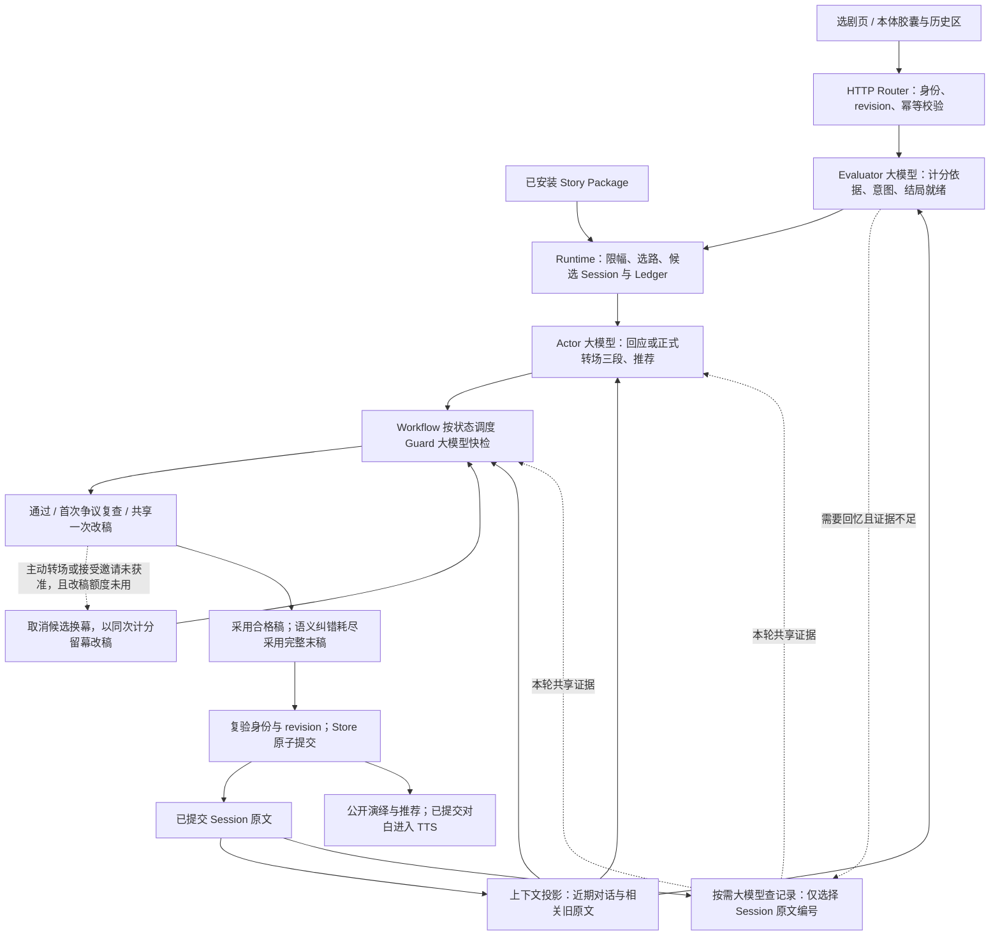
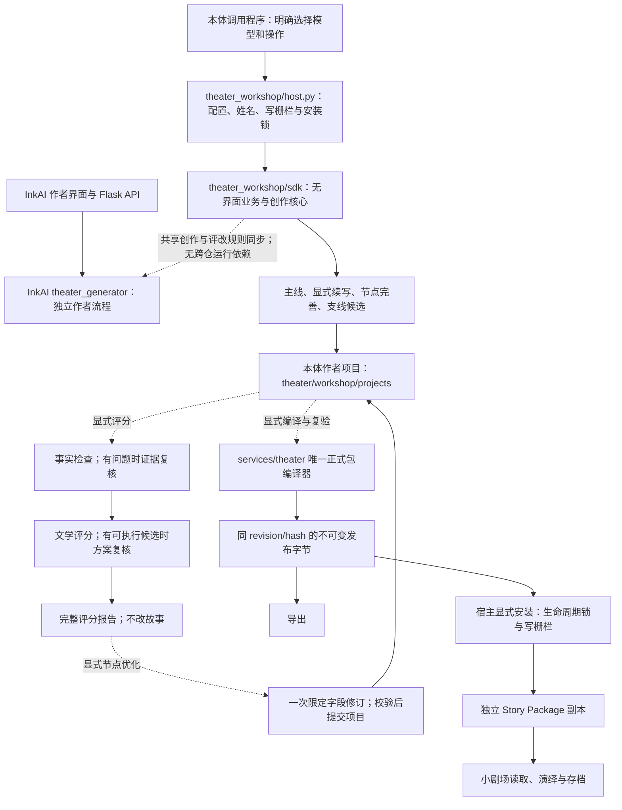

# N.E.K.O 小剧场架构开发文档

状态：Numeric v2.2；小剧场运行链与无界面工坊 SDK 已接入。按剧本版本、路线和输入方式分别验收，不宣称全部路线或模型稳定通过。此前模型效果优化保持暂停；现已按用户要求增加第3.4节固定旁白能力。第13节保存最新体验结论，第14节只索引已实施与未采用方案。

## 文档入口与维护分工

| 需要了解的内容 | 入口 |
| --- | --- |
| 当前演绎、模型权限、存档与前端合同 | 本文；模型调用与失败处理集中在第10节 |
| 问题、原始证据、修复与否决原因 | [实测问题与解决方案](./neko-theater-issues-and-solutions.md)；按问题编号检索 |
| SDK 目录、宿主、发布与迁移状态 | [工坊 SDK 迁移与接入说明](./neko-theater-workshop-sdk-migration.md) |
| 程序如何调用工坊 | SDK 使用说明（`theater_workshop/README.md`） |
| 创作、评分、证据、修订与原独立工作台 | InkAI 生成器开发文档（`InkAI-/docs/superpowers/specs/2026-08-06-neko-theater-numeric-v2-generator-design.md`） |

现行合同直接修改对应章节；实验结果只在问题文档完整记录，其他入口保留结论和链接。历史测试数量不是本轮复跑结果，仓库外实验链接仅在原文件仍存在时可作证据。

本文是 N.E.K.O 仓库内小剧场唯一的架构开发文档，统一收录产品边界、Story Package、Runtime、模型权限、持久化、前端、生成器协作和验收要求。当前代码和测试高于本文；发现实现与本文不一致时，应先在[小剧场实测问题描述以及解决方案](./neko-theater-issues-and-solutions.md)记录可复现证据，再决定修改代码或修正文档。

## 架构总览

### 小剧场：演绎、复核与提交


```mermaid
flowchart TD
    UI["选剧页 / 本体胶囊与历史区"] --> API["HTTP Router：身份、revision、幂等校验"]
    Package["已安装 Story Package"] --> Runtime["Runtime：限幅、选路、候选 Session 与 Ledger"]
    API --> Eval["Evaluator 大模型：计分依据、意图、结局就绪"]
    Session["已提交 Session 原文"] --> Context["上下文投影：近期对话与相关旧原文"]
    Context --> Eval
    Eval --> Runtime
    Eval -. "需要回忆且证据不足" .-> Lookup["按需大模型查记录：仅选择 Session 原文编号"]
    Session --> Lookup
    Runtime --> Actor["Actor 大模型：回应或正式转场三段、推荐"]
    Context --> Actor
    Lookup -. "本轮共享证据" .-> Actor
    Actor --> Review["Workflow 按状态调度 Guard 大模型快检"]
    Context --> Review
    Lookup -. "本轮共享证据" .-> Review
    Review --> Resolution["通过 / 首次争议复查 / 共享一次改稿"]
    Resolution -. "主动转场或接受邀请未获准，且改稿额度未用" .-> Stay["取消候选换幕，以同次计分留幕改稿"]
    Stay --> Review
    Resolution --> Adopt["采用合格稿；语义纠错耗尽采用完整末稿"]
    Adopt --> Commit["复验身份与 revision；Store 原子提交"]
    Commit --> Session
    Commit --> Display["公开演绎与推荐；已提交对白进入 TTS"]
```

普通留幕的可见正文也经过复核，包括仍有待确认邀请的回应；普通快检服务异常与正式快检异常的处理不同，见第10.3节。主动转场或接受邀请的实际去向明确未获准且共享改稿额度未用时，取消未提交换幕并留幕回应；额度耗尽仍采用末稿及其候选状态，不代表错误已经修正。Actor技术失败、身份或版本冲突仍受原子提交保护。初始开场先生成成功再建档，专属边界复核见第10.4节。

### 剧本工坊：SDK、独立工作台与发布


```mermaid
flowchart TD
    Caller["本体调用程序：明确选择模型和操作"] --> Host["theater_workshop/host.py：配置、姓名、写栅栏与安装锁"]
    Host --> SDK["theater_workshop/sdk：无界面业务与创作核心"]
    Web["InkAI 作者界面与 Flask API"] --> Legacy["InkAI theater_generator：独立作者流程"]
    SDK -. "共享创作与评改规则同步；无跨仓运行依赖" .-> Legacy
    SDK --> Generate["主线、显式续写、节点完善、支线候选"]
    Generate --> Project["本体作者项目：theater/workshop/projects"]
    Project -. "显式评分" .-> Facts["事实检查；有问题时证据复核"]
    Facts --> Quality["文学评分；有可执行候选时方案复核"]
    Quality --> Report["完整评分报告；不改故事"]
    Report -. "显式节点优化" .-> Repair["一次限定字段修订；校验后提交项目"]
    Repair --> Project
    Project -. "显式编译与复验" .-> Compiler["services/theater 唯一正式包编译器"]
    Compiler --> Candidate["同 revision/hash 的不可变发布字节"]
    Candidate --> Export["导出"]
    Candidate --> Install["宿主显式安装：生命周期锁与写栅栏"]
    Install --> Package["独立 Story Package 副本"]
    Package --> Theater["小剧场读取、演绎与存档"]
```

工坊 SDK 与插件 SDK、小游戏 SDK 是独立的平级领域能力，不带网页、Flask、模型设置页或新的 HTTP 服务。调用方通过 `open_workshop`、`host.call()`、`host.install()` 使用能力；模型由调用方显式指定，生成成功不自动评分、修订、应用支线或安装。

InkAI 保留独立作者界面、模型配置和跨仓 Validator CLI；它尚未改为调用本体 SDK 的薄适配。按用户要求，两端共享写作与评改规则继续同步，不能称 InkAI 已冻结或 SDK 运行时依赖相邻仓库。作者数据、正式包与 Session 分开，工坊不读取玩家 Session 或控制实际路线。详见第8节与 SDK 迁移文档。

## 1. 产品边界

小剧场只保留 Numeric v2 剧本模式。`/theater` 是唯一正式页面入口，只负责选剧、查看前情和角色身份以及开始或继续 Session；正式演绎在 N.E.K.O 本体胶囊与历史区中进行。旧 `/theater-home`、`/theater-numeric` 页面和自由模式的页面、API、Prompt、Session、Runtime 均已退役，不提供兼容重定向。

阅读顺序：第1—7节为运行、数据和前端合同，第8节为工坊协作，第9节为验证方式，第10节为模型链路，第11—12节为复杂度与退役对照，第13节为当前体验边界，第14节为历史方案索引。实现状态不等于真实体验已验收。

小剧场与普通聊天只共享当前猫娘配置、现有聊天宿主和底层 TTS 能力，不共享输入状态、草稿、历史、恢复指针或正式事实。剧场控制器只有在 Numeric v2 Session 激活且等待玩家输入时才能接管真实胶囊输入框；未激活时必须完全退出普通聊天链路。

Numeric v2 的产品定位是：

- 作者控制背景、双角色身份、主线、支线、结局、隐藏数值规则、路线条件和过渡合同；
- 玩家使用自然语言决定当下行动；
- 前置 Evaluator 判断隐藏数值变化、自然收束软信号、自由输入交互方式、已有转场态度及候选结局就绪；后置 Guard 的额外职责与已知缺口见第 10、11 节；
- Performance Actor 在同一次调用中生成旁白、猫娘动作与对白，以及玩家可直接发送的推荐输入；
- Runtime 确定性处理节点推进、路线、结局、软节奏提示、Ledger、Session 和原子提交；
- 不使用正式 Choice；推荐输入只是可选的普通自然语言快捷输入；
- 隐藏数值、阈值、路线条件和内部判定依据不对玩家公开。

## 2. 模块与权限

| 模块 | 职责 |
| --- | --- |
| `theater_workshop/host.py`、`theater_workshop/sdk/` | 独立作者能力与本体宿主；通过正式包交接，不参与演绎回合 |
| `services/theater/numeric_v2.py` | Story Package 合同、静态图、条件与可达性编译 |
| `numeric_v2_registry.py` | 剧本包导入、列举、加载与删除 |
| `numeric_v2_cast.py` | 将作者候选身份投影为当前玩家称呼和当前猫娘名 |
| `numeric_v2_identity.py` | 角色卡不可变 ID 与当前猫娘绑定 |
| `numeric_v2_evaluator.py` | 前置数值/意图判定与后置公开输出复核；不保存目标证据、不选路线 |
| `numeric_v2_runtime.py` | 候选状态、限幅、路线、结局、转场提议和 Ledger 事件；不提供旧 Session 迁移 |
| `numeric_v2_actor.py` | Performance 上下文投影、Prompt 预算，以及正文与推荐的同次编排 |
| `numeric_v2_actor_output.py` | Performance 输出解析、混合正文校验、换场去重和共享玩家输入文本保护 |
| `numeric_v2_budget.py` | 固定输入、历史和连续性预算；旧档位名只作同预算兼容别名 |
| `numeric_v2_context.py` | 共享历史、作者开场与事实投影；从 Session 提取可检索原文 |
| `numeric_v2_history.py` | 按需模型查找 Session 原文编号，核验后还原并共享证据，不生成事实摘要 |
| `numeric_v2_usage.py` | 请求级模型用量与缺报标记，不写入剧情历史 |
| `numeric_v2_workflow.py` | 编排前置判定、Runtime 候选、Actor、条件式主复核与受限恢复、身份复验和原子提交；记录分段耗时 |
| `numeric_v2_store.py` | Session、Ledger、表现历史和槽位索引的原子持久化；不迁移旧证据链 |
| `numeric_v2_archive.py` | 结束回执、单集记忆胶囊和完整公开演绎冷档案 |
| `numeric_v2_maintenance.py` | 冷启动审计、隔离区和可恢复删除事务 |
| `main_routers/numeric_theater_router.py` | `/api/theater-numeric` 的请求校验、错误映射、TTS 与归档 HTTP 入口 |
| `app/memory_server/routes.py`、`memory/recent.py`、`memory/timeindex.py` | 剧场胶囊 upsert、有界周目记忆、时间索引覆盖和 Prompt 渲染隔离 |
| `utils/llm_client/messages.py` | 内部消息来源元数据的序列化、识别与供应商协议剥离 |
| `static/js/theater_selector.js` | `/theater` 的剧本选择、导入、删除、开始和继续交接 |
| `static/js/theater_transport.js` | 选择页与本体共用的消息协议、请求 ID 和本地 JSON/CSRF 请求边界 |
| `static/app/app-theater-runtime.js` | N.E.K.O 本体中的 Session 恢复、输入提交、内容块播放和结束流程 |
| `services/theater/tts_bridge.py` | 已提交猫娘对白的共享 TTS 播放桥 |

权限边界不可跨越：

- Evaluator 不能选择路线、编写剧情或写 Session；
- Actor 与推荐不能直接修改 metric、节点、路线、结局或 Ledger；只有通过提交的可见演绎才成为后续历史，不由模型直接写入正式状态；
- Runtime 不解释自然语言，只应用已验证 delta，并从作者声明的路线中确定性选择；
- 前端不能提交隐藏 metric、阈值或目标节点；
- Store 只提交完整候选回合，包括按规则采用的语义末稿；不保存模型执行中的半状态，提交成功不等于复核通过；
- TTS 失败只降级为文字，不能回滚已经提交的剧情。

运行时没有独立 Planner、Director、自动文学评分或动态剧情规划层。现有 Evaluator、Actor、Guard 均调用大模型；首次争议复查与按需原文查找也可能增加调用，不能误写成只有固定三次请求。作者侧评分与节点优化属于生成器独立流程。

## 3. Story Package 合同

剧本模式只接受 `neko.story.numeric.v2`，顶层核心结构为：

- `meta`
- `intro`
- `characters`
- `catgirl_binding`
- `metric_schema`
- `initial_state`
- `start_node_id`
- `nodes`
- `endings`

Story Package 是作者事实源，不包含玩家 Session、Ledger、模型演绎历史或生成器项目元数据。

导入、加载和运行均要求 `meta.contract_version: "v2.2"`。v2 / v2.1 或未声明版本的包返回 `numeric_v2_upgrade_required`，必须由作者重新导出；不隐式迁移，不因本轮文档整理删除磁盘旧包。旧 Session 的继续运行门禁与维护收尾边界见第 4.2、6 节。

### 3.1 角色与身份

新工坊生成时使用当前猫娘名和用户昵称，并在 `intro.player_name`、`intro.catgirl_name` 成对保存完整姓名；身份以对应完整姓名和中文逗号开头，角色状态以对应姓名明确主体。旧包没有这两个字段时保留身份首段及原状态前缀合同，不改写旧包和 hash。运行时仍必须统一投影：

- 男主由用户扮演；`player_address_known=false` 时 Actor 只能看到“你”，直到用户作出包含完整配置昵称的明确自我介绍或称呼请求，并由成功回合原子确认；仅提及该昵称不算披露；
- `player_address_known=true` 时显示和演绎才使用当前用户昵称（现行来源为 `主人.昵称`，缺失时回退 `主人.档案名`，最后“你”）；
- 女主由当前猫娘扮演，统一使用当前角色卡猫娘名；
- 候选原名不能重新出现在 Actor 输出中；
- 玩家与猫娘的行为、经历和台词归属不能交换；
- 角色卡不可变 ID 只用于存储身份，不进入人格正文。

生成快照不决定最终演绎名。用户生成后改昵称或切换猫娘，再开演仍适配当时角色；失败续写和已有作者项目的支线、完善、评分、修订继续沿用原稿姓名，避免写作中途混名。知道真实昵称不自动改变剧情内披露状态。名称投影只作用于叙事数据，保留协议枚举和引用 ID；最长匹配也保护未改名的长姓名，避免较短姓名替换误伤。切换角色不会转移既有 Session 的稳定角色 ID 归属。

### 3.2 隐藏数值

`metric_schema` 定义数值 ID、范围、bands 和允许的增减规则；`initial_state.metrics` 必须完整覆盖所有 metric。`initial_state.player_address_known` 是结构化布尔状态，声明本剧开场时猫娘是否已经知道玩家称呼，不能从自然语言摘要或“称呼未知”等文案解析。v2.2 编译器不再为旧包补字段或保留兼容哈希；可选 `relationship_effect` 只能是 `positive / negative / none`，由作者或生成器明确声明，Runtime 不得根据数值 ID、名称或题材猜测。

v2.2 每个 metric 的 `per_turn_limit.increase/decrease` 都必须是 `1—5` 的正整数，允许更低或不对称；`[-5,+5]` 是单轮硬上限，不是固定变化量。数值总范围由作者声明，生成器新建默认 `0—50`；关系型默认单轮限幅 3，其他默认 5。

Evaluator 只能选择作者已经声明的 `criterion_id` 和有限强度 `weak / normal / strong / decisive`，不能直接决定任意 delta。服务端依据该 metric 对应方向的 `per_turn_limit` 确定性换算：`weak=1`、`normal=ceil(limit/3)`、`strong=ceil(2×limit/3)`、`decisive=limit`，再由 Runtime 限幅。按具体事件去重：重复确认、改述或回顾同一已完成行为不再计分，新的有意义行为可沿同一依据连续计分，不设四回合冷却，也不按输入文字相等永久禁止计分。Evaluator 接收最近八项实际奖励的输入原话并结合当前演出和相关旧历史判断对象、时点与结果；预算不足按完整项减少。这是模型语义判断，不能保证远期重复事件全部被识别。玩家端不显示原始值、metric ID、阈值、route gate、强度或内部判定证据。

### 3.3 节点、路线与结局

每个非结局节点仍可声明 `min_turns`，范围为 1—20；它只作为作者节奏提示，不作为运行时换幕门槛。这里的回合是“当前节点内成功提交的玩家自然语言输入回合”，不是主线章节数，也不包含失败、重复或 revision 冲突的提交。当前运行语义为：

- 普通换幕可以接受已公开邀请，也可以由玩家主动要求前往已公开的下一地点或阶段；仅询问、考虑或准备仍留幕。通向 terminal ending 的自然收束另见下条；
- `scene_complete` 只作为本轮 Ledger 中的自然收束软信号，不自动触发路线，也不要求目标全部完成；
- 采用邀请方式换幕时，需要当前访问中已有真实公开邀请。活跃邀请可接受；曾拒绝或暂缓的邀请在本轮明确改主意接受同一下一步时也可直接继续，不必重复邀请和确认。普通聊天、追问或犹豫不恢复旧邀请，不读取前一次访问的邀请；路线仍由 Runtime 按条件与 priority 选择；
- 最后一幕的核心问题与必要回应已经完成，或玩家本轮已明确实施/授权最后互动、前提具备且剩余仅女主配合与可确定的直接结果和回应；同时没有未决选择、未知成败、新风险、本轮待答问题或暂缓意图，能够完整承接候选结局时，同次 Evaluator 可返回 `natural_ending_ready=true`。Runtime 仅在 `scene_complete=true`、选中 terminal ending、没有拒绝当前提议且结算前后仍是同一路线时自然结束，不额外要求邀请或接受。不能绕过高优先级普通幕，也不把当前预览结局的授权挪给加分后改选的另一结局；
- 接受后没有可用路线时仍留在当前节点，候选 `route_status` 为 `transition_offered`，但旧提议布尔已清除；本轮是否重新锁存由后续 Actor/复核与 Runtime 收口决定。只有 `unclear` 才直接保留旧提议，不能把结果标签当成锁存状态；
- 多条路线同时满足时，只选择唯一最高 priority；同优先级并列属于非法状态；
- 只有一个出口的顺序节点允许空条件；同一节点有多个出口时，每条路线都必须有明确数值条件；
- 每个可达非结局节点最终都必须能够到达 terminal ending。

非结局节点还可以声明玩家不可见的 `recommended_turns`，范围为 `min_turns`—40；当前短篇生成器默认把 `min_turns` 与 `recommended_turns` 都设为 3，作者可在剧本生成器的节点属性中逐幕调整建议回合。它是软节奏预算，不是正式路线条件：

- 接近预算时，Actor 应减少重复闲聊并把互动重新聚焦到当前幕自然方向；
- 当前节点成功回合数等于预算时进入 `closure`：基础 Actor 在同一次生成中先回应玩家，再收窄到当前因果和已有自然出口；出口尚未成熟时可以继续交付当前幕结果，不要求本轮必须提议；
- 当前节点成功回合数超过预算时进入 `overdue`：基础 Actor 在同一次生成中禁止新开支线、补齐遗漏目标或为道具追加使用场景；当前因果已经收住时可以提出下一步，否则应先交付新的可见结果；普通换幕可邀请玩家决定，也可承接玩家主动要求前往已公开去向，不能替玩家作决定；自然结局只使用上述独立就绪条件；
- `overdue` 可以增强表达直接性，也可以让剧本已经明确的环境压力随时间合理发展，但必须承接最近已提交事实，不得无来源制造倒计时、追兵、事故、截止日期或最后通牒。`HH:MM` 究竟是当前钟点还是剩余时长只能由 Story Package 事实决定，演绎器不得仅凭文本格式猜测方向或硬改数值；
- `closure / overdue` 都允许休息、离开和时间流逝，但不能替玩家作自主决定、越过尚未发生的关键选择或提前播放下一幕；有正式前因的即时身体结果仍按因果合同处理；
- Workflow 不因 `scene_complete` 或超过推荐回合再调用一次事后收束生成器；`normal / closure / overdue` 只改变基础 Actor 本轮看到的软节奏说明；
- `recommended_turns` 不改变 `scene_complete`，不触发路线，也不改变 Runtime 的 route gate 和 priority 判定；`min_turns` 只作为作者提示保留；
- 玩家端不显示预算；作者可以在生成器节点检查器中调整。

每个非结局节点的 `story_beat` 可以使用以下结构化作者事实；它们只提供创作上下文，不是 Runtime 任务：

- `opening_scene`：本幕作者开场事实与阶段边界。正式转场时允许 Actor 根据实际历史改写措辞，保持必要时空与结果，已发生动作不再复演。缺少时只取当前摘要首句作为作者输入。开场只能建立环境或猫娘可见行动，不能替“你”执行行动或决定；
- `relationship_ceiling`：当前幕允许的最高关系阶段，只能是 `stranger / guarded / cooperative / trusted / intimate`。Actor 将它与隐藏关系 metric 的当前阶段取更严格者；缺少时按当前场景的默认关系边界处理；
- `goals`：当前包仍可携带带稳定作者 ID、行为主体和证据方式的作者元数据，与旧 `must_happen` 互斥。同幕最多八项，`owner` 只能是 `catgirl / player / shared / environment`；编译器只校验结构，普通 Actor、Evaluator、Runtime 和 Session 都不消费它来推进剧情；
- `goals[].evidence`、delivery 与来源字段仍有编译器作者元数据校验，不能声称已从全仓删除。运行时不做 semantic 目标判定、不逐字锁存 exact anchor，也不以目标证据覆盖 `scene_complete` 或换幕；是否从运行包移除仍是尚未实施的候选。

玩家输入的动作前提与已发生剧情矛盾时，角色自然提醒实际状态，不补造前置动作；玩家从实际状态明确实施新的可行动作可以承接。

目标字段不会写入 Session，也不会被 Runtime 转换为完成任务；作者可以改写、遗漏、合并或舍弃普通素材。角色身份、不可逆事实和重要道具生命周期仍需保持连续。

路线的 `transition_contract` 至少承担两类约束：

- `must_deliver`：换场时必须带入目标场景的事件或信息；
- `must_preserve`：换场后仍必须保持的已发生事实。

进入 terminal node 后 Session 标记为 `ended`，前端显示公开结局标题和摘要并关闭输入。Normal、Good、Bad 等结局类型属于作者语义，不改变 Runtime 的统一终局处理。

### 3.4 作者固定旁白

`story_beat.fixed_narrations` 是 v2.2 的可选扩展；没有该字段的剧本沿用原流程。每项必须提供：

| 字段 | 含义 |
| --- | --- |
| `id` | 同幕唯一的片段编号 |
| `text` | 作者原文，内部空白、换行、引号和序列号原样保存；不接受空串或首尾空白 |
| `trigger` | `{"type":"entry"}`，或 `{"type":"condition","condition":"明确的可观察完成事件"}` |
| `after` | 同幕更早片段的编号数组；按作者顺序展示，不允许循环依赖 |
| `required_before_exit` | 作者是否要求本片段展示后才能离幕或自然结束 |

每幕最多8项，原文合计最多2000 tokens；超限报错，不截断。终止输入的结局节点只能使用 `entry`；需要玩家触发的日志放在仍可互动的前一幕。入幕片段不能依赖条件片段。

- 入幕：程序在场景说明后、猫娘动作对白前插入原文，开场与正式换幕均适用。
- 幕内条件：现有 Guard 在同一次调用中逐项判断，返回 `fixed_narration_triggers: [{id,evidence}]`；程序校验已提交历史、玩家输入或当前来源正文中的逐字引用、编号、前置片段与未展示状态，在最终正文后插入原文。考虑、邀请和推荐不构成已发生动作；角色对新文本的阅读反应在下一次正常回应中承接，不追加确认按钮。
- Actor 不能生成或覆盖运行记录中的 `fixed_narrations`；未触发原文不送给普通 Actor/Guard，只给触发条件。入幕原文供开场反应参考；已展示原文进入后续真实历史、原文查找、导出与归档，日志中的往事不自动成为当前现场。
- 只采用最终稿对应的无正文违规复核结果；改稿清空旧触发判定。缺字段、超时、无引用或错误编号不触发。语义改稿耗尽仍按既有完整末稿规则提交，片段可在后续回合依据真实历史重新判定；存储失败不留下展示标记。
- `required_before_exit=true` 的未展示片段会让本次选路留幕，仍只进行本轮一次数值结算。即使本轮稍后触发，也先展示并留出阅读回应；下轮再按实际历史收束。只有该显式字段产生门槛，普通 `goals` 继续是软素材。

不增加专用模型调用、改稿次数或输入容量。只有存在待判定片段时，普通 Guard 沿用正式 Guard 的512输出 tokens，以容纳编号与引用；无候选仍为190。触发数组在有候选时必填、未触发为空，避免旧五字段格式造成静默漏播。语义时机依赖复核准确度，不能由逐字引用的存在证明语义必然正确。

运行记录在实际所属容器保存 `node_id/id/text/bindings/position`；展示清单从已提交 opening/performance history 推导，按 Session、节点、编号只展示一次，不增加第二份完成状态。提交与冷恢复校验原文、顺序、重复与入幕片段完整性；刷新、幂等重试与测试分叉复用既有原子提交链。桥段不能挂片段。新建 Session 仅接受与当前姓名投影完全一致的入幕片段，拒绝调用方提前注入条件片段；历史重放仍按已保存的展示姓名核验。上下文按实际展示顺序读取场景说明、入幕原文、猫娘演出和条件原文。

姓名仅替换作者显式写出的 `{{catgirl_name}}` 与 `{{player_name}}`，单次替换、不递归展开；昵称未披露时为“你”。展示时的绑定与渲染原文一同保存，历史不因之后改名重写；普通字句及 `00-Aoi` 等序列号不做猜测替换。作者应避免在固定文本里预写玩家未必做出的动作；如原文与历史可能冲突，应调整作者资产或采用正常动态演出，不能让固定旁白代做玩家选择。

前端使用已有旁白显示，固定文本不按括号拆成角色动作、不进入猫娘 TTS。无需新增工坊编辑界面或设置页；SDK 调用方编辑作者字段即可。实现入口为 `numeric_v2_fixed_narration.py`；接入与验证边界见问题2.115。

## 4. 单回合合同

主阶段示意如下；Actor 内部的基础补推荐不是独立固定阶段：

```text
玩家原话
  → 校验 Session ID、Story、当前猫娘不可变 ID、base_revision、client_turn_id 和输入长度
  → Evaluator 一次调用；需要回忆而证据不足时，按需查 Session 原文并共享给后续 Actor/Guard
  → 服务端把 criterion + strength 确定性换算为 delta
  → Runtime 应用 delta、scene_complete 提示、转场态度、route gate 和 priority
  → Runtime 检查包含完整配置昵称的明确自我介绍或称呼请求，形成候选称呼状态
  → Actor 按 normal / closure / overdue 软节奏生成正文、推荐和提议信号；返回前可轻量补全真正无效的推荐
  → 按当前状态进入普通复核或正式转场三段复核；首次正文/邀请争议可独立思考复查一次，仍违规才共用一次改稿，按钮问题仅删除（范围及额度见第 10.3 节）
  → 重新校验 Session、角色绑定和 revision
  → 原子提交 Session + Ledger event + performance record
  → 公开快照
  → 已提交猫娘对白进入 TTS
```

主阶段串行执行，基础补推荐只发生在 Actor 返回前；Guard 删除按钮后不再补齐。格式/重复重试仍可能重新进入 Actor，不能据此承诺全回合仅一次补推荐。自然收束或超期本身不触发额外生成。TTS 只读取原子提交后的公开对白。

Evaluator 输出严格限定为：

```json
{
  "history_query": "",
  "public_destination_quote": "",
  "ending_reason": "",
  "scene_complete": false,
  "natural_ending_ready": false,
  "metric_changes": {
    "metric_id": {
      "strength": "weak",
      "criterion_id": "author_rule_id"
    }
  },
  "transition_intent": "unclear",
  "interaction_intent": "mixed_or_unclear"
}
```

`history_query` 是可选的本轮查找问题，不进入剧情或 Ledger；留空不增加查找调用。v2.2 不再有 `goal_evidence`、交付回执或完成锁存字段。`scene_complete` 只是 Evaluator 提供的自然收束提示；`transition_intent` 支持 `accept / initiate / reject / unclear`：接受/拒绝已有邀请，或主动要求进入已公开的下一地点、下一阶段；`interaction_intent` 只调整基础 Actor 本轮回应优先级。这些信号不绕过数值选路、玩家行动权和提交前复核。新增可选布尔值 `natural_ending_ready` 只核对当前候选结局；缺失或降级为 false，不恢复逐项目标锁存。普通目标与道具仍只作为作者素材。自然结束沿用原子三段交付、`ended` 状态与结束回执，不伪造 `transition_intent=accept`。Ledger 仅在就绪为 true 时保存该信号，Store 校验和分叉重放缺省 false，旧历史不会因完成软信号被重新解释为提前结束。

普通未换场回合的 Actor 输出严格限定为：

```json
{
  "performance": "（把咖啡推到玩家手边）先暖暖手。刚才那件事……（抬眼看向玩家）我答应了。",
  "suggested_inputs": ["（我握住杯子）我先听你说。", "（我放下杯子）这件事先缓一缓。"],
  "transition_offered": false
}
```

`performance` 是模型一次生成的完整演绎正文：全角中文括号内只允许当前猫娘的即时微动作，括号外全部视为当前猫娘实际说出口的对白。动作与对白可以自然穿插，不限制固定对白句数，也不要求每句对白前机械添加动作。Runtime 在提交前校验括号成对、禁止嵌套，并按当前 `required / optional / forbidden` 发声合同检查对白；提交后按同一解析器确定性投影为内部 action/dialogue 片段，供历史展示、TTS、Evaluator、归档与近重复保护消费。Session 保存原始 `performance` 顺序，不保存第二份易漂移的解析结果；正常 Actor 输出使用当前混合正文；Runtime、Store 和前端仍有旧表现格式读取/校验分支。它们与旧目标证据 Session 的拒绝门禁不同，不能写成所有旧正文记录均不可恢复；删除前需核实实际数据和消费者。

推荐输入是点击后原样发送的玩家自然语言，当前生成合同为 `（玩家动作）玩家对白`，动作中的“我”可以自然省略，括号外不强加中文引号。候选不得替猫娘、环境或结果行动，不由前端机械改写语态。真实玩家自由输入无需符合推荐格式，也不要求有动作或以“我”开头。

旁白采用分层节奏：普通回合以对白为主体，每个括号只写一项猫娘动态微动作，目标长度不超过 18 个汉字或 12 个单词；不能写静态情绪解释、心理结论、关系评价，也不能压缩多个连续动作、未来剧情或整幕摘要。普通回合只有在环境、时间、地点、实体、关键物品状态或玩家即时身体状态确实产生新变化时，才可额外输出 `scene_update`。玩家身体结果必须由玩家输入、已提交记录或作者确定性事实直接造成，并在同一句交代可见前因；允许受伤、失衡、条件反射或被外力带动，不能扩写成玩家的意愿、承诺、路线或关系选择。解析后按 `scene_narration` 原子保存并以独立 system 气泡展示。开场、`transition_bridge`、`target_opening` 和结局交付继续使用独立 `scene_narration`，保持原有场景旁白样式且不受微动作字数限制。实时演绎时，`performance` 按原始字符顺序在同一个猫娘历史消息气泡中逐字显示；Runtime 只把已经提交且位于括号外的对白片段依次交给 TTS。独立场景旁白继续使用 system 气泡且不进入 TTS。`min_turns` 只作为作者提示保留；目标、道具和过渡描述始终只是演绎素材，不构成收幕硬条件。接近推荐回合时 Actor 优先保证当前互动与下一幕之间的自然因果，允许遗漏、改写或舍弃任何不合时宜的素材。

节点 `chapter` 仅作作者主题上下文，不是已发生事实、幕完成条件或必须复述的文案；不能覆盖真实历史、当前边界或过渡合同，也不能代替数值选路。各阶段实际投影以当前构建函数为准，不要求普通六块 Prompt 额外增加标题字段。

### 4.1 换场合同

当 Runtime 已选择路线时，Actor 同一回合必须完成三个连续动作：

1. 直接回应玩家本轮输入并收住来源节点的当前互动；
2. 用必要的环境、时间、地点变化或有正式前因的玩家即时身体结果完成桥接，不替玩家作自主决定；
3. 建立目标节点 `opening_scene` 的现场，但不在同一回合演完整个目标节点。

换场输出继续使用固定顺序的 `source_response`、`transition_bridge`、`target_opening` 三段结构。紧凑 Actor 输出包含 `source_performance`、`bridge_scene_narration`、`target_scene_narration`、`target_performance` 四个必填文本，以及可为空的 `source_scene_narration`。其中两个表演与目标旁白必须非空；`bridge_required=false` 时桥段允许空字符串，缺字段或非字符串仍拒绝。桥段许可由既有转场合同投影得到，同一结果传入Actor上下文、解析和Runtime；仍有独立交付或作者桥段时必须保留，不能只凭同地点省略。新提示要求先写来源旁白；没有必要外部回应时填空，被问的在场 NPC 则给出具体答复、明确拒绝或说明未知，不能只写姿态或用猫娘评价代替。解析器兼容旧输出省略该字段，空串归一化为省略，非空旁白组装到 `source_response.scene_narration`，先于猫娘 `performance` 展示；没有新增第四阶段或模型调用。Runtime 确定段位标签、顺序与目标节点，不用作者原文覆盖生成旁白。

作者桥段和 `opening_scene` 约束时间、地点、必要结果和阶段边界，允许根据真实历史改写动作措辞。来源旁白和猫娘回应承接本轮已授权互动，仍受来源幕认知及事实边界限制；桥段和目标开场只承接结果，不能复演或新增玩家决定。来源原本禁言时猫娘表演保持 `forbidden`，否则使用 `optional`；NPC 旁白不改变猫娘发声合同，目标沿用自身合同。旧三段数组可携带同样的可选来源旁白；Runtime 提交与 Store 的版本 3 校验均接受无此字段的旧记录，并拒绝非空字段的类型或格式错误。历史保留旁白原文，前端按既有内容块顺序显示，猫娘 TTS 仅消费对白，不朗读 NPC 旁白。来源旁白及可选桥段的实现与验证边界分别见问题2.96、2.104。

Workflow 在提交前合并复核三段正文和目标按钮，终局没有按钮也复核。来源历史、实际选中目标和作者合同一起提供，不重新选路；入幕基线不能覆盖当前决定。`must_preserve` 不要求逐项复述，已在历史或来源回应成立的交付不在桥段重复。明确正文冲突共用一次改写，坏按钮定点删除；正式快检技术失败或超预算整轮不提交，争议复查失败保留初判，语义纠错耗尽采用完整末稿。主动请求或接受邀请的去向被明确否定、且改稿额度未用时，先取消候选换幕再留幕改稿；具体边界见第10.3节。原先无按钮的终局新增一次正文复核；普通转场把原按钮复核扩为整段复核，耗时与次数进入现有诊断。模型复核仍可能误判，不把通过当作事实质量的绝对保证。解析器、Runtime 和 Store 继续校验三段完整性、可见目标节点和 Ledger `to_node_id` 一致，前端按原顺序展示。

节点 ID 已推进不等于玩家看见了换场。换场交付必须成为可验证的提交条件；仅把 `route_changed`、目标 beat 和过渡合同放进 Prompt 不足以保证一致性。实测证据和当前未解决的转场错配见[问题文档](./neko-theater-issues-and-solutions.md)。

“休息、睡觉、离开、结束交谈”不是关键词路线条件。幕内可撤回准备与新地点、新时段、新互动阶段的结果必须分开；普通换幕由玩家接受可见提议（`accept`），或明确要求进入已经公开的下一地点/阶段（`initiate`）触发候选选路；询问、考虑、准备、无邀请时含糊的“好/继续”不算主动请求。目标完成、休息用词与推荐回合数均不能替代行动授权。终局另按自然结束规则处理，不要求额外确认或虚构物理离场。

主动请求必须先输出 `public_destination_quote`，引用当前场景已提交演出中明确公开去向的原文；判定器核对引文真实存在，缺失或虚构则将 `initiate` 降为 `unclear`，不报发送失败。当前输入自己说出地名、作者方向和目标预览不算此前公开。Runtime 仍按本轮结算后数值选路，不要求先产生邀请，也不新增 Session 状态。正式 Guard 与首次争议复查独立检查公开依据、明确行动意愿、实际去向及作者边界；主动转场复核输出同名引文，缺失或虚构会报 `player_action`。引文存在只证明出处，是否真的公开该去向仍由语义复核判断。Ledger 保存本轮有效意图，恢复和分叉沿既有选路链重放，不重解释旧 `accept`。

已核对的主动请求引文随本轮 EvaluationResult 传给正式 Guard，投影前再次校验出处；首次争议复查和重写复核收到同一份原文，仍独立判断其含义与玩家授权。它是临时调用材料，不写入 Session/Ledger，也不直接放行正文。Evaluator 先读实际演出与玩家输入，再读作者方向；只有 `pending_transition` 给出对应提议才使用 `accept`。开场虽说过邀请但未登记 pending 时，明确实施已公开下一步仍按 `initiate` 核对，不能空口 `accept` 后被 Runtime 的无邀请保护归零。预算、历史裁剪与原文失配时的保护不变。

### 4.2 回合工作记忆

Session 中的实际开场与表现历史是演绎原文来源，Ledger 保存对应状态事件。近期窗口和相关原文先作确定性投影；证据不足时允许按需调用模型查完整 Session，见第10.6节。查找只选择原文编号，不生成摘要事实库、不参与 Runtime 推进；Session 不保存目标证据、交付回执或模型改写的摘要正文。

装箱合同如下：

1. 普通 Actor 默认保留当前访问中从开场至最新一轮的完整真实对话，只存玩家实际输入和已提交回应。未选择的推荐、模型草稿和内部判断不算历史；循环重访不能混入此前同名节点记录。
2. 总预算不足时按最早完整回合淘汰，不截断本轮输入与最新完整回合；固定合同自身超限时明确失败，不能删安全依据后继续。已保留的完整历史不再重复提供索引。
3. 新幕第一个普通回合可以带上一幕已提交来源回应末尾最多两个可见块、80 Token 的 `previous_scene_tail`；不含旧玩家输入或完整旧幕任务，下一普通回合自动消失，预算不足时优先删除。
4. 历史真正被裁剪后才计算当前幕记录摘录，并计入总预算。摘录可能缺少前提和结果，不能证明目标完成，也不成为第二套事实库。
5. Actor 输入固定10000 Token，历史预算5200；普通回合按完整回合装箱，正式换幕另有12个完整历史回合上限。固定玩家输入、角色和来源/目标合同不得被通用裁剪器二次改写。旧档位名称不再改变容量。
6. 换幕保留来源与目标各自必要边界、作者目标开场约束、过渡合同及角色/发声合同，不发送目标证据清单。跨幕记录进入下一幕历史时只投影目标开场，避免重复消费旧玩家输入。
7. Evaluator固定7000，普通Guard固定6000，主动请求补查或正式Guard固定8000 Token。相关原文检索最多1500 Token、12个完整单元，作者字段预算360，均包含在各自总输入上限内。当前输入及待审正文完整保留；快检与争议复查使用相同阶段容量，各消费者仍独立装箱，不保证拿到完全相同历史。固定必需内容超限沿用原错误流程。
   正式转场的目标作者禁令若已完整出现在 `hard_boundaries`，不再随目标状态或表演合同重复传递；摘要截短或超出条数的原文仍保留，正向授权及 Engine 原包不变。短样本预算通过不保证实际完整转场也能装入；固定合同和最新证据超限时仍回滚，不跳过复核。
8. Prompt 装箱诊断记录预算和保留/淘汰 revision，不记录正文。高置信整段重复仍可触发受限改写；纯闲聊的最后短回应仅在既有严格条件下可降级，不放宽事实、所有权或场景边界。

带旧目标证据链字段的 Session 直接拒绝，不提供隐式迁移；不兼容 Story Package 和包哈希不匹配也不能继续演绎。这不等于拒绝所有历史表现格式：Store 仍识别 `performance_contract_version` 为缺省、1、2、3 的记录，并按相应版本和 Ledger 复验。维护/删除链路仍可读取生命周期快照，用于结束旧 Session、补齐公开归档或清理孤儿回执，但不会把不兼容的旧目标证据 Session 重新投影为当前剧情或允许继续提交新回合。旧 Session 或客户端的 `economy / balanced / quality` 均映射到同一固定容量，缺省名称为 `balanced`，不为此迁移或改写旧存档。工作记忆每轮从现有 `opening_performance` 和 `performance_history` 重建；前端不再提供档位选择。这一层只改变模型看到历史的方式，不改变 Ledger、Session revision 或原子提交。

仅剧本 revision/hash 不匹配、但生命周期链仍有效的恢复槽，会向选剧页返回禁止继续的快照；用户仍可结束、归档既有公开演出并重新开始，不能用新包投影旧节点。包本身暂时无法编译或需要升级时，维护审计保留其 Session 和旧索引槽位，不当作坏存档隔离删除。存储位置迁移复制整个 `theater/`，覆盖剧本包、Session、回执、公开档案、工坊作者项目及遗忘恢复记录。

压测需要复用真实中段状态时，Runtime 可以从指定 revision 确定性重放并创建隔离测试分叉。分叉必须使用新 Session ID，保留原存档兼容字段和截至该 revision 的 Ledger/正文，先完整复验后一次写入独立 Session 文件；不得发布到剧本的“继续演绎”恢复槽，也不得修改来源 Session。该能力是内部压测基础设施，不向玩家暴露世界线选择。

内部真实模型压测统一使用 `scripts/run_numeric_v2_stress.py`。执行器只读已安装剧本和当前模型/角色配置，所有 Session、Ledger、分叉与 JSON 报告写入新建临时目录；保留三个同容量档位名作为旧参数别名，支持推荐/自由/混合输入策略、指定 revision 分叉、失败后的原子回退复验、Performance/Evaluator 装箱 revision 诊断和每轮 Workflow 分段耗时。执行器不调用 TTS、不发布到正式恢复槽，也不替代前端人工测试。

### 4.3 角色化表达与文风多样性

Numeric v2 是由 AI 驱动的类 Galgame。角色卡切换的价值不能只体现为猫娘名字变化；在同一剧情身份和同一玩家输入下，不同猫娘仍应表现出可感知的措辞、句长、主动性、情绪外显方式和互动节奏差异。

演绎优先级必须拆开“能发生什么”和“如何表现”：

1. 已发生事实、节点 `boundaries` 和过渡合同决定剧情硬边界；
2. 当前猫娘角色卡是唯一核心人格，决定措辞、句长、价值取向、主动性和情绪外显方式；
3. 剧情身份、当前幕状态和隐藏关系 band 只能调整她此刻的目标、信任、距离、亲密度和主动性，不能覆盖核心人格；
4. 当轮情绪和文风变化在以上边界内自由生成。

Story Package 只新增结构化入幕状态，不新增第二份人格或可变 Runtime 状态。“入幕状态”统一指开场演完、第一条玩家输入之前的起点：开场已放下物件，状态就记录放下后的持物与位置；不能仍写动作前姿态，也不能提前写普通回合目标的完成结果。后续变化由实际开场和已提交演出历史承接，不逐轮恢复作者快照。目标幕尚未播放时，该状态描述预期的开场结果，不是来源幕已经发生的事实；其中“尚未操作”等可变预设须按实际历史更新，不能推翻玩家已做的连续动作。

玩家提前明确实施同一地点、对象工具与必要前提均已具备的连续动作时，承接动作结果，不能仅因作者安排在下一节点就否认。后续转场、开场及状态按历史适配，不再次要求执行或把物件退回原状。新地点、新时段、未知成功结果与作者明确禁令仍受约束；普通换幕接受公开提议或承接玩家主动要求前往已公开去向。共享行动规则已同步 Actor、Evaluator、Guard 与生成器，不增加存档字段或模型调用。真实联调仍出现行动误拦截，不能把规则接入视为模型执行达标；见问题文档 2.48。

| 来源 | Actor 投影 | 权限 |
| --- | --- | --- |
| 当前角色卡人格摘要 | `acting_context.core_persona` | 唯一核心人格；人格冲突时优先 |
| `intro.catgirl_identity` | `acting_context.story_identity` | 初始剧情身份、经历、能力与目标，不定义基础性格 |
| `catgirl_binding.role_overlay` | `acting_context.story_role_context` | 如何进入故事及长期关系弧线，不定义基础性格 |
| 当前节点 `story_beat.catgirl_situation` | `acting_context.current_scene_state` | 当前幕临时状态 |
| 当前节点 `story_beat.character_state` | `acting_context.character_state` | 作者写定的女主、男主、环境入幕状态、跨幕连续事实和角色归属边界；不进入 Session/Ledger |
| 当前节点 `story_beat.acting_contract` | `acting_context.acting_contract` | 结构化声明当前认知、记忆、自称模式、人格权限和允许/禁止行为；优先于角色卡表达风格 |
| 目标节点 `story_beat` | 目标剧情方向、角色状态/边界与作者开场约束 | 换幕时分别交付方向和实际开场，不发送待完成目标清单，也不把方向倒写为已完成 |
| `relationship_effect != none` 的隐藏 metric bands 与当前幕关系合同 | `acting_context.relationship_control` | 两类上限取更严格者；控制距离、触碰、亲昵称呼、暧昧、依赖和关系承诺，不公开原始数值和阈值 |
| `relationship_effect = none` 的隐藏 metric bands | `acting_context.capability_state` | 提供能力、压力、线索等非关系状态，不得改变关系距离 |
| 目标节点关系合同 | `acting_context.target_relationship_control` | 仅在换幕回合提供，防止目标开场沿用来源幕的亲密许可 |

`characters` 当前只要求是对象，Actor 不消费，不能把它启用为并行人格事实源。每轮 Actor 都从角色卡、当前节点和 Session metrics 确定性重建 `acting_context`；`acting_contract` 明确规定当前认知、记忆和自称权限时，角色卡只能提供剩余的表达风格，不能覆盖该合同。数值跨 band 或 Runtime 进入目标节点时自然得到新的临时状态，不改写角色卡、不持久化模型总结，也不需要“每幕重写人设”。

关系型 metric 只由显式 `relationship_effect` 识别。Actor 把正向数值的低、中、高 band 投影为从戒备到亲密的阶段，把反向数值按相反方向投影；多个关系数值取最严格者，再与当前幕 `关系上限` 取更严格者，得到 `effective_stage`。该阶段是亲密行为硬上限：最低阶段只能礼貌回应、有限软化和保持距离，不能提前演出暧昧、占有、依赖、主动肢体接触、伴侣式亲昵称呼或已经建立的亲密关系；较高阶段仍必须由已发生事实支撑。核心人格只决定许可行为如何表达，不能越过阶段；推荐输入服从同一上限，低关系阶段也不能反向授权敌视、羞辱或威胁。普通 Actor 的关系投影压为统一阶段与自然语言 `response_contract`，不重复发送已被合同覆盖的 band/允许/禁止清单，也不接收原始数值或阈值。

当前回合可见关系姿态使用 Evaluator 结算前的 Session metrics，避免玩家单次行为刚跨 band 就在同一条猫娘回复中瞬间改变关系；非关系型 `capability_state` 可以使用本回合结算后的候选 metrics，让线索、能力和压力变化及时影响表现。换场回合分别计算来源幕与目标幕上限，目标开场不能沿用来源幕更宽松的亲密许可。

关系语义不能用有限关键词正则伪装成硬校验。Actor 按 `effective_stage` 确定性投影 `response_contract`，同次正文与推荐服从同一上限；补推荐也接收该边界。结构和字段继续硬校验，自由文本关系的生成与 Guard 复核必须用真实正反例验证，不能宣称模型自报即构成百分之百确定性拦截。

当前普通 Actor 用 `role` 提供核心人格，并靠真实历史保持表达连续；不再常驻 `recent_openings` 或随机轮换句式模板。常用词和角色口头禅不是禁词，重复保护针对高置信的整段复刻，而非单个起手词。角色化文风、事实边界和关系上限需分别验收，不能仅靠更换显示名称证明人格差异。

正式质量验收至少包括：同一角色连续 8—10 轮的起手结构复用检查，以及同一 Story、同一输入在三张明显不同角色卡下的盲测对比。通过标准是角色差异能够从措辞、节奏和行为反应中识别，而不只是替换显示名称；该项需要真实模型压测，单元测试只验证 Prompt 权重、边界和上下文投影。

## 5. Session、Ledger 与原子性

每个回合使用稳定 `client_turn_id` 和 `base_revision`：

- 重复提交不能重复调用模型或写入第二条记录；
- 服务端已提交但响应丢失时，同一 `client_turn_id` 只返回当前权威快照；胶囊据此重建完整历史并移除乐观气泡，不要求服务端再次返回或播放单条 performance；
- revision 冲突返回 409，前端刷新服务端快照并保留未提交草稿；
- Evaluator、Actor 或 Store 任一步失败都不提交半回合；
- Actor 生成成功前不写 Session、Ledger 或表现历史；称呼状态与成功回合的 Session、Ledger event、performance record 一起原子提交；
- 称呼未知时不把配置昵称发送给 Actor；只有玩家本轮通过包含完整昵称的明确自我介绍或称呼请求披露它时，Actor 输出中的相同字符串才允许通过确定性保护；
- Session 文件中的 Ledger 事件和表现记录按 revision 一一对应，加载时复验节点、数值、计数器和链尾；
- 新建 Session 先写完并同步同目录临时文件，再在跨进程创建锁内检查目标不存在并原子发布；不依赖硬链接、不覆盖同 ID，发布前进程中断不占用正式文件名。锁文件保留，进程退出释放锁；这只保证单文件创建，不扩大为多进程同时更新槽位与回合的事务承诺；
- 并发结束、重复结束、剧本删除和回合提交通过相同的故事级边界保护，只有一个最终结果可以提交。

公开 HTTP 投影只包含恢复和演绎所需信息：intro、当前场景摘要、开场表现、表现历史、revision、Session 状态、旧预算名称兼容字段、推荐输入和公开结局。完整 Ledger、隐藏数值和内部规则保留在服务端。

## 6. 演绎槽位与持久化生命周期

Numeric v2 的持久化唯一键是：

```text
Story ID × 猫娘角色卡不可变 character_id
```

每个组合最多保留一个 Session 文件，`story_sessions.json` 只保存槽位到 Session ID 的恢复指针。

- 角色卡改名不改变 `character_id`，因此不丢进度；
- 删除角色卡后新建同名角色会得到新 ID，不能继承旧进度；
- 关闭窗口或退出 N.E.K.O 不结束 Session，剧本槽位和 `player_address_known` 继续持久化；但完整重启后默认关闭小剧场，玩家需从选剧页主动“继续演绎”才重新进入；
- 切换猫娘不删除其他猫娘的进度，切回后恢复各自槽位；
- 剧情终局在当前槽位保留只读记录；玩家主动退出写入 `ended_reason=user_exit`，不改变 Ledger、revision 和演绎历史，并可从选剧页原子恢复为 `active`；
- 主动退出后同时提供“继续”和“开始”：继续恢复同一 Session，“开始”经确认后创建新 Session ID 并原子替换旧文件；剧情终局只提供“开始”；
- 正常恢复只读取索引；Numeric v2 冷启动初始化或显式维护才全盘复验文件并重建索引；
- 审计前必须取得权威角色配置；读取失败、结构异常、规范化名称重复或角色 ID 迁移未能落盘时中止，不用默认人设判断角色已删除，不移动存档或标记维护完成。首次缺少配置且默认身份写入失败时，恢复可写后重试保存同一身份；权限读取失败或原文件丢失不据此覆盖。恢复读取后可重新审计；普通聊天仍保留原有配置回退；
- 损坏、无主或重复文件移入有界隔离区，最多保留 6 份，不能阻断其他合法槽位恢复。

删除剧本使用可恢复事务级联删除 Story Package、该剧本全部 Session 和索引项；任一步失败恢复删除前快照。存在 `active` Session 时，前端列出对应猫娘名并要求确认。删除猫娘角色卡按不可变 ID 级联删除其在所有剧本下的 Session。

活动 Session 仍不限制单次演绎的回合数或文件体积，Ledger 与表现历史会在该周目内持续增长。玩家确认记忆后，完整公开演绎转入不参与 Prompt 的冷档案；近期工作记忆按每个 Story 最近三个周目、全部 Story 合计最多三十条收敛；冷档案按 Story × `character_id` 默认保留最近五份未收藏记录，收藏记录不参与自动淘汰。

### 6.1 演绎记忆归档

玩家在剧本页明确选择“记下本次演绎”后，服务端从已结束 Session 确定性生成单集记忆胶囊并复用 memory server `/cache/{lanlan_name}`；前端不能拼接 transcript、直写记忆文件或在结束前台增加摘要模型调用。

#### 6.1.1 存储分层

活动 Session、Ledger 与 `performance_history` 是演绎期间的唯一事实源。“记下本次演绎”之后，数据分成冷档案和工作记忆两层；完整 transcript 不进入普通聊天 Prompt。

| 层级 | 稳定键与位置 | 保存内容 | 是否进入日常 Prompt |
| --- | --- | --- | --- |
| 活动演绎事实 | Story ID × `character_id` 的当前 Session 槽位 | 完整 Session、Ledger、开场和表现历史 | 只供 Numeric v2 Runtime 与 Actor 使用 |
| 结束回执 | `numeric_v2/end_receipts`，按 Session 指针和结束事实定位 | `pending / writing / written / skipped`、归档 revision 水位、稳定请求 ID 和待提交冷档案 | 否 |
| 完整公开冷档案 | `numeric_v2/public_archives/<sha256(session_id)>.json` | 玩家可见的开场、玩家输入、旁白、转场、动作、猫娘对白和公开结局 | 否 |
| 单集工作记忆 | 当前猫娘 `recent.json` | 每个 Session 一条 `system` 单集摘要胶囊 | 是，但只以虚构剧场上下文渲染 |
| 时间索引副本 | 当前猫娘 `time_indexed.db` | 每个 Story 一个稳定事件，内容覆盖为最近三个周目胶囊 | 只服从相同的剧场来源隔离 |

冷档案 schema 为 `neko.theater.numeric.v2.public-archive`。顶层只保存 `story_id`、`session_id`、剧本标题、不可变 `character_id`、归档时的双方称呼、revision、暂停或完成状态和公开结局；`opening` 保存有序表现及 `parts`，`turns` 按 revision 保存 `player_input`、有序表现及 `parts`。`parts.kind` 只允许玩家可见的 `scene_narration / action / dialogue` 投影。隐藏数值、关系 band、阈值、路线条件、Evaluator 输出、推荐输入、内部节点 ID 和 Ledger 一律排除。

暂停周目的摘要取最新一轮公开表现，规范空白后最多保留 360 个字符，并优先在完整句末收束；已经进入公开结局时直接使用结局摘要。这个摘要过程完全确定性，不新增 LLM 调用，也不把冷档案全文重新总结一遍。

#### 6.1.2 单集胶囊合同

每次归档只向 memory server 发送一条 `role=system` 消息。基础元数据为：

```json
{
  "source": "theater_numeric_v2",
  "memory_tier": "episode_summary",
  "message_kind": "episode_summary",
  "story_id": "story_id",
  "session_id": "session_id",
  "story_title": "剧本标题",
  "episode_status": "paused | completed",
  "ending_title": "公开结局标题或空字符串",
  "ending_summary": "公开结局摘要或空字符串",
  "episode_summary": "确定性单集摘要",
  "archive_from_revision": 1,
  "archive_through_revision": 8
}
```

memory server 写入时再确定性补充 `run_index`、`story_run_count` 和 `ending_titles_seen`。同一 `story_id + session_id` 的暂停、继续和完成归档必须替换原胶囊，沿用原 `run_index`；状态、摘要和 revision 范围以最新成功写入为准。重新开始使用新 Session ID，因此形成同一 Story 的新周目。每个 Story 在 `recent.json` 中只保留最近三个周目胶囊，但最新胶囊继续携带累计周目数和去重后的已见结局集合。

归档时若剧本 revision/hash 已变，不能借用新包的结局。公开冷档案和记忆胶囊仍依据持久化 Session 保留通关状态：`status=ended` 且无退出原因（现行自然结局），或原因明确为 `natural_ending`，记为 `completed`；中途 `user_exit` 仍为 `paused`。旧 Session 未独立保存的结局标题和摘要留空，单集摘要使用已提交正文，不从新包补写。

胶囊不是猫娘对白，也不是玩家现实经历。Prompt 渲染只能自然说明猫娘与玩家共同演绎过该虚构剧本、这是第几周目、本次暂停或达到哪个结局，以及公开摘要；不能给 `system` 胶囊套用玩家或猫娘署名。剧本标题已有成对书名号或当地语言标题符号时原样保留，缺失时才由八语言模板补齐。

#### 6.1.3 写入、失败与重试顺序

归档端点先复验结束回执、Story、Session、当前 `character_id` 和 revision，再与回合提交、重新开始、剧本删除共用故事级锁。锁内执行以下顺序：

```text
receipt: pending
  → receipt: writing
  → Theater：原子写待提交公开冷档案
  → memory server：recent 按 Session upsert
  → memory server：以 recent 为基线重建全部剧场 time_indexed 事件
  → Theater：发布冷档案并执行“最近 5 份 + 收藏”保留策略
  → receipt: written，并推进 archived_through_revision
```

memory server 对当前猫娘使用 settle lock 串行 recent 与时间索引更新。待提交冷档案在迁移旧时间索引之前落盘，但不出现在正式档案列表；memory server 成功后才发布。任一步失败都把 receipt 恢复为 `pending`，重试再次执行同一 Session upsert 和全量有界剧场索引重建，不追加重复胶囊。玩家在失败后改选“暂不记录”时销毁待提交档案。相同结束事实的重复点击、刷新和响应丢失由 Story ID、Session ID、revision、`character_id` 生成的稳定 `end_receipt_id` 与 `archive_request_id` 收敛。

点击“暂不记录”只把 receipt 标记为 `skipped`，不创建胶囊或冷档案，也不删除可继续的 Session。归档持有故事级锁期间，重新开始和剧本删除必须等待，不能在删除完成后重新产生孤立冷档案。

#### 6.1.4 记忆隔离与容量边界

- `BaseMessage.metadata` 在 `recent.json` 和 SQL 时间索引序列化中保留，转换成供应商 OpenAI 消息时主动剥离，不能把内部来源字段发送成模型协议内容；
- 全部 Story 在 `recent.json` 中合计最多三十条剧场胶囊；时间索引每次以这一有界集合重建，每个 Story 使用一个稳定事件，并自动删除旧版剧场全文行、已淘汰胶囊和已不在 recent 中的 Story 事件；
- 普通聊天压缩只摘要非剧场消息，压缩提交后把结构化剧场胶囊原样放回；普通历史触发硬上限裁剪时也必须保留剧场胶囊及其来源元数据；
- 剧场胶囊不参与普通聊天的用户事实、猫娘自我披露、反馈、复读、人格提取、证据信号、反思合成或通用 history review，不能把角色扮演内容晋升成现实事实；`review_history` 自身统一过滤传入快照与兼容读取结果，模型输入和提交槽位使用同一份非剧场快照；
- 完整公开冷档案不进入 recent 压缩、时间召回或普通 Prompt。每个 Story × `character_id` 默认保留最近五份未收藏档案，收藏档案额外保留；取消收藏后立即重新执行保留策略；
- 每个可恢复 Session 只保留最新回执指针。重新开始删除旧 Session 回执；冷启动 GC 删除无 Session 指向、已被新 revision 替换的回执和待提交档案；
- 旧格式 `recent.json` 中同一 Session 的多条剧场正文在下一次剧场胶囊写入时折叠为一条 `system` 摘要；同次写入会以 recent 有界集合原子重建 `time_indexed.db` 剧场行，完成旧时间索引的惰性迁移；
- 选剧页提供显式“忘记该剧本”。确认后删除当前猫娘该 Story 的 recent 胶囊、time-indexed 剧场行、完整冷档案和旧回执，但不删除 Story Package 或当前 Session；已结束 Session 保留一个最新 `skipped` 决策回执，防止页面立即重复询问。Session 的 `forgotten_through_revision` 记录遗忘水位，继续演绎后重新归档时排除已遗忘的开场与旧回合，不能让它们重新进入记忆或冷档案。遗忘后没有新回合就退出时，回执为 `skipped`，不询问重新记录；摘要构造同样按归档范围和遗忘水位筛选，旧的空区间回执不能把最后一条已遗忘正文写回。
- 遗忘先在 `numeric_v2/forget_transactions/` 保存按剧本和角色隔离的待完成记录，冻结文件清单与 Session revision；水位写成后再请求记忆服务删除，最后清理本地档案、回执并移除待完成记录。失败保留记录，显式重试沿原清单完成；期间禁止重新归档和替换恢复槽，不因刷新补建新的归档邀请。重试不把之后的新回合纳入原遗忘水位。演绎候选提交时在 Session 锁内沿用磁盘上的最新遗忘水位，不能用生成前的快照覆盖它；新回合仍正常提交。此机制提供可恢复提交，不声称两个服务能同时原子写入。

#### 6.1.5 重开、删除与恢复

已经 `written` 的周目在“重新开始”前必须存在公开冷档案。兼容旧版本时，如果旧 receipt 已写入记忆但还没有对应 `public_archives` 文件，Runtime 先从仍在槽位中的旧 Session 补写冷档案；补写失败则不得替换旧 Session。补写成功后，新 Session 原子替换恢复槽位，旧周目胶囊与冷档案按各自生命周期保留。

删除剧本时，可恢复删除事务必须同时备份并级联删除 Story Package、该 Story 的 Session、槽位索引、公开冷档案、结束回执和待提交档案；事务失败时一起恢复。删除角色卡时按不可变 `character_id` 清理其 Session、冷档案和回执，并纳入角色删除回滚快照；旧数据缺少 ID 时才使用历史猫娘名回退。角色改名仅迁移已有恢复槽，不把隔离快照发布为可继续进度。已经写入当前猫娘记忆系统的单集胶囊不因删本地剧本包而跨服务静默删除；用户需要完整删除时使用“忘记该剧本”。选剧页保留当前猫娘的“已删除 · 记忆管理”条目，只读取记忆服务现有的公开摘要，禁止开演、继续和再次删包；不复制一份新记忆。待完成遗忘记录不随删包清除，条目允许重试；记忆服务暂时不可用时，仍展示本地待完成操作并提示读取失败。遗忘完成且没有保留摘要后条目消失。

“记下本次演绎”最终语义是：让猫娘在日常对话中保留一份有界、明确标记为虚构的单集摘要，同时把完整公开 transcript 写入 Theater 冷档案。需要检查具体回合时从 `public_archives` 按 Story ID 与 Session ID 读取，不能反向依赖 recent 胶囊重建演绎。

角色删除事务还按不可变 `character_id` 收集并备份该角色的待完成遗忘记录，包括剧本包早已删除的记录；正常删除和非法名称救援删除均清理这些记录，后续失败则随既有快照原样恢复。无角色 ID 时不猜测归属，不删除其他角色的遗忘记录；单独删剧本仍保留待完成遗忘供用户重试。

## 7. 前端与 TTS

- 自由输入复用本体胶囊输入框；推荐选项复用现有 Galgame 按钮及其展示、键盘焦点和点击交互。小剧场只适配演绎状态、草稿恢复与提交目的地，不另建输入或选项组件；
- 推荐仅在真实提交回调就绪时显示，宿主回调注销后同步隐藏；桥接层不以空包装函数冒充可用回调；
- 自由输入也只传入实际已注册的提交回调；回调缺失时保留草稿，注册或注销时更新胶囊，不回退到普通聊天提交；
- 新演绎快照通过启动校验后，若剧本或 Session 身份改变，通过现有草稿恢复协议清空旧输入；同 Session 重放及被拒绝的启动保留当前草稿，包括失败后恢复的原文；
- 演绎未处于 `awaiting_player` 时，同一输入锁同时约束胶囊入口、已展开文本框和所有提交方式，忙碌期间不清空草稿；输入法失焦恢复写回当前剧场草稿，不污染普通聊天草稿；
- `/theater` 选择页显示背景介绍、玩家身份和猫娘身份，不显示节点标题、场景卡或隐藏状态；
- 选择页不提供上下文档位选择；创建、继续与重新开始均使用同一固定预算；
- 玩家点击开始或继续即确认当前选择，迟到的后台记忆列表不再用旧 URL 偏好切换剧本。响应按角色、剧本 ID 与选择代次复验，启动消息使用请求时捕获的剧本 ID；
- 候选启动和刷新指针恢复在异步准备期间，也接收对应 Session 的结束和剧本删除事件，并使该启动失效、移除失效刷新指针；尚未接管界面时不依赖 `active` 判断，不新增模型或网络复核；
- N.E.K.O 本体历史区按服务端已提交顺序播放玩家原话、场景旁白和猫娘演绎内容，不把剧场历史混入普通聊天消息；
- 普通回合的括号微动作与对白保留在同一猫娘消息中，开场、换场和结局旁白使用独立 system 消息；
- 旧版有序 `content` 的 `action` 块按括号动作恢复，包括只有动作的转场桥；不因所处 phase 改为场景旁白或丢弃；
- 只有猫娘对白进入 TTS，括号微动作和独立场景旁白不朗读；服务端只允许按已提交内容块坐标请求播放；
- 推荐输入直接作为普通自然语言提交，不先回填输入框，也不携带正式 Choice ID；
- 已确认未提交的模型失败恢复原推荐并显示提示：推荐点击不回填非空草稿，自由输入保留原文。未知网络结果保留原输入与幂等编号，不恢复旧按钮或自动重试；状态冲突只消费刷新后的权威快照，退出/切换后的迟到失败不得接管输入；
- terminal scene 关闭玩家输入和推荐输入，并引导返回选剧页；玩家主动结束先确认，再回到选剧页询问是否写入记忆；
- 刷新只恢复已提交历史，不重播历史 TTS；
- TTS 请求和去重键包含 Session、revision、lifecycle_revision 和内容块坐标；服务端在初读及持生命周期锁的入队前复验，拒绝手动退出或旧生命周期的请求，正常结局对白仍可播放。旧页面缺少生命周期参数时语音请求被拒绝并按原文字兜底，刷新后使用新协议。前端只接受匹配本次 `speech_id` 的完成、取消或不可播放事件；无编号的普通语音事件不结束剧场等待，丢失事件仍由现有估时兜底。

## 8. 剧本工坊 SDK 与 InkAI 协作边界

本体工坊已位于 `theater_workshop/sdk/`，`host.py` 提供名字、显式模型、作者目录、写栅栏和受保护安装。它与 `services/theater/` 的演绎状态分开，正式包只由本体编译器裁定。接口、锁顺序、完整作者项目导入、发行验收见[SDK 迁移与接入说明](./neko-theater-workshop-sdk-migration.md)，调用示例见SDK 使用说明（`theater_workshop/README.md`）。

本体注册表先在包目录写完并同步临时文件，再借用既有 `portalocker` 依赖，在跨进程导入锁内复验目标不存在并原子发布。没有硬链接能力的文件系统也不在最终文件名下分段写入；同 ID 导入仍拒绝覆盖，锁文件保留以避免等待进程锁到不同文件。进程退出释放锁，发布前中断仅可能留下隐藏临时文件，不占用正式安装名。

- 创建作者项目并生成初始主线与一个 Normal 结局；支线、多个结局、评分与修订由调用方分别发起。
- 作者项目写入 `<app_docs_dir>/theater/workshop/projects/`，安装产物写入 `theater/numeric_v2/packages/`；生成不自动发布。
- 编译、复验、导出、安装核对相同 revision、canonical bytes 与 hash；安装不覆盖同 ID 包。替换既有包须另走明确授权的生命周期操作。
- SDK 不读相邻 InkAI、不启动网页或 HTTP 服务；原工作台仍保留自己的 API、界面与 Validator CLI，二者不能同时写同一作者目录。
- 两端共享创作、事实、证据、文学、方案和修订规则持续同步；本体宿主与 SDK 接口只在 N.E.K.O 维护，原界面/API 在 InkAI 维护。
- 工坊不持有 Session、Ledger、演绎状态或 Runtime 推进权。原工作台的节点检查器、支线向导等界面描述不代表 SDK 自带界面。

首次结构生成不要求模型同时输出 metric、阈值、priority、`min_turns` 或 `recommended_turns`。两类回合默认值、稳定 ID、正式条件、互补路线、结构校验、编译和原子写入应由程序确定性处理。当前短篇生成器将非结局节点的 `min_turns` 与 `recommended_turns` 固定投影为 3；可达数值支线的阈值距离、作者声明的单回合变化范围和必要演绎余量只用于作者侧可达性与节奏诊断，不再拉长 Runtime 的推荐值。

生成器编译后还要执行全包作者诊断，结果复用 `compile_result.warnings` 的 `{code, path, message}` 结构，但不写入 Story Package，也不阻断导出：

- 在 metric 声明的完整整数范围内，对当前 `metric_compare` 条件的阈值分区进行确定性代表点枚举，识别条件本身数学不可能、全部满足状态被更高 priority 兄弟路线遮蔽、合法状态没有任何出口，以及按数值与 priority 无法进入的节点或结局；
- 从 `initial` 状态沿图传播软节奏区间，分别提示 `recommended_turns` 内难以进入、只在部分入口可进入，以及理论可达但需要额外演绎回合的结局；这些结论只能叫“软节奏困难”，不能写成 Runtime 不可达；
- 条件组合超过枚举上限、路径状态过多、循环或复杂入口无法给出可靠结论时，必须返回 `route_analysis_unknown`，不能用近似结果冒充数学证明；
- 同一来源、不同目标的兄弟路线若精确复用相同转场原因和可见桥段，只产生 `route_transition_duplicate` 软提示；作者显式触发的质量评估再结合条件语义、玩家可执行行动与进入后的直接后果做语义审查。共同地点或个别措辞相似本身不是问题，不使用 embedding/文本距离阈值，也不把语义相似度变成编译硬门槛。

作者向导的入口距离检查与全包静态 warning 是不同层级；不再以“前段剧情”标签决定 Runtime 规则。向导按可达入口分别估算，具体通过、警告或阻断策略以 InkAI 当前生成器合同为准；全包静态分析不能把 `unknown` 写成已证明不可达。两者都不改写运行时三回合推荐值。

生成器作者项目同时维护与关系弧并行的 `character_state_arc`。它逐幕分别声明女主、男主和环境在开场演完后的状态、从上一幕延续的事实、状态主体与职责边界，以及猫娘当前认知、记忆、自称、人格范围和发声合同。状态线本身不进入 Session 或 Ledger；生成器把三方状态、连续事实和状态边界投影到 `story_beat.character_state`，同时把猫娘认知权限投影到 `acting_contract`、把边界并入 `must_not_happen`、把连续事实写入目标路线的 `must_preserve`。开场已明确交付的动作只承接结果，不能再次列为 `turn` 目标；普通回合待发生的结果不能提前进入状态，不能为凑完成而把待玩家参与的目标搬进开场。普通换场不得重新 `fresh_boot`，伤情、昏迷、持有物和照护方向必须明确主体；支线与结局继续承接同一状态线。

现行主线输出每章1—6项 `ordered_goals`，逐项声明主体、来源、交付方式与时点；程序投影成稳定ID的 `story_beat.goals` 作者元数据。`catgirl_progress_events` 是早期输入形状，不能作为当前生成协议。Runtime不逐项执行这些目标，也不消费其 `state_effects` 来锁存进度或驱动发声。开场、叙事方向、关系弧、角色状态弧和出口计划分别投影，不能将预计取得、签署或换主结果提前写入入幕事实。

生成器预设和缺省数值根据 `relationship_effect` 选择安全限幅：关系型默认每回合增减上限为 3，非关系型默认 5；作者在高级设置中仍可显式修改。该默认值只负责降低未来剧本的关系跳变速度，Runtime 继续使用 Story Package 中已经声明的正式限幅。

### 8.1 引导式支线创作

支线生成采用“终点先行、结局反推、默认不要求手算阈值”：

1. 作者从当前恰好只有一个出口的非结局节点发起；
2. 先选择终点：回到主线、通往已有结局或产生新结局；
3. 选择回到主线时，必须让作者明确选择具体回接节点，默认推荐原顺序出口的下一幕；
4. 产生新结局时，先生成并确认可编辑的结局草稿，再从结局反推 1—3 幕过程；
5. 作者用自然语言说明触发原因和想要的篇幅；
6. 生成模型只生成可预览的剧情过程与因果解释；
7. 作者确认后，程序一次性写入节点、路线、过渡合同和可选新结局。

默认界面展示“当信任达到愿意托付秘密的程度”一类人类可读语义，不要求作者手算 metric ID、运算符、阈值和 priority。高级编辑仍必须可以检查和修改原始条件，不能形成黑箱。

若作者已经选择条件，模型只能解释因果；只有作者选择“让生成模型推荐”时，模型才能从程序依据现有 metric bands 构造的候选集合中返回一个候选 key。项目缺少合适 metric，或 bands 只有无法表达剧情含义的占位词时，向导必须先要求作者完善数值规则或确认新增预设，不能让模型静默发明正式数值。

回接点选择器必须显示会绕过的主线幕和关键事实。支线需承接被绕过的 `must_happen` 与主线路线 `must_deliver`；1—3 幕无法安全承接时，在模型调用前禁用该候选。主线顺序来自生成器作者项目元数据，不能依赖 `mainline_XX` ID 前缀猜测，也不写入 Story Package。旧项目无法唯一识别主线时，由作者沿现有路线确认。

模型只接收任务需要的上下文投影：背景、双角色身份、来源节点、最近 1—2 个上游节点、原出口、已选终点、被绕过事实、相关 metric 语义与 bands、允许候选、作者方向和篇幅。目标预算为 8K—12K tokens，硬上限 16K；不发送完整项目、无关支线、Session、Ledger 或 Runtime 历史。超限候选应在选择前禁用并解释，不能截断关键事实后继续生成。

生成器的专项字段、DTO、向导检查及转场理由/桥段/开场联合审阅以 InkAI 生成器文档和代码为准；作者原文并列展示不等于语义校验通过，也不会自动修包。它们不能覆盖本页的 Runtime 权限边界。

### 8.2 评分、证据与限定节点修订

作者点击“评分”时，`generation/quality.py` 按以下顺序执行：事实检查；存在事实问题时独立复核原文证据；文学六维评分；存在可执行修订候选时复核方案。事实、证据、文学与方案任一阶段失败都不保存半份新评分，API返回具体失败阶段。完整报告写入作者项目的 `authoring.quality_assessment`，不改 Story Package。

文学维度可以通过 `fact_issue_ids` 关联已列事实问题，通过 `related_issue_ids` 关联同一文学或关系问题，不重复展示同一修法。问题须定位节点与 `repair_targets`，证据和方案复核决定是否可执行；评分高不能抵消事实问题，报告可查看也不代表可以直接改稿。

节点优化要求当前revision、未过期报告及 `repair_plan_version=3`；旧报告继续可读，必须重新评分后才能优化。程序重新核对保护字段和可执行方案，合并同节点建议后调用修订模型；实际差异只能落在所点击节点的授权字段内，越界、无修改或保护字段变化均拒绝。成功后原子更新项目，并按内容变化标记既有评分/编译等派生结果过期。此功能不是自动改全包，也不会自动覆盖已安装剧本或玩家存档。

| 本体模块 | 职责与 InkAI 对应 |
| --- | --- |
| `theater_workshop/host.py` | 本体模型、姓名、写入保护、进程内编译与异步安装；原工作台的跨仓桥不迁入 |
| `theater_workshop/sdk/workshop.py`、`contracts.py` | 从旧 API 提取的公开业务与输入合同；原 `theater_generator/api.py` 继续服务旧网页 |
| `theater_workshop/sdk/generation/numeric_v2.py` | 主线、续写、完善、支线 Prompt 与投影；对应 InkAI 同名生成模块 |
| `generation/runtime_rules.py` | 两端创作／评改需要一致的运行规则 |
| `generation/facts.py`、`evidence.py` | 事实编号、问题与原文证据复核 |
| `generation/quality.py`、`repair.py`、`plan_review.py` | 评分、问题关联、方案权限和单节点修订 |
| `numeric_v2_project_store.py` | 作者项目、revision、检查点、草稿、报告及派生状态 |
| `numeric_v2_branch.py`、`numeric_v2_analysis.py` | 支线候选与应用；数值、路线遮蔽和软节奏诊断 |

表中未写前缀的模块相对 `theater_workshop/sdk/`，InkAI 对应目录为 `theater_generator/`。相同写作规则不表示宿主依赖、存储所有权和发布入口也相同。

### 8.3 共用写作规则与同步要求

- 关键互动、分支与结局优先由男女主推进；配角只提供必要背景、简短线索与直接回应。保留既有因果必需的 NPC 职责，不把配角存在判为运行违规。
- 过程用主体、对象、必要前提、操作和可见结果描述，删除抽象“体现难度”，不换成反复确认、失败次数或额外劳动。条件具备的角色自主行动可以连贯交付；结果成立后不再追加难题。
- 开场后状态、过程中的变化与离幕携带结果分别描述。道具的用途不证明已经取得，作者 `source_ids` 不证明实际玩家已经操作；明确谁持有、谁受伤、谁照护谁以及哪些认知限制持续有效。
- 当前回应与未来去向分开：先交付本幕必要因果，再公开具体安排；询问下一步不算接受，合法主动请求不要求补一次邀请。后续开场按已提交历史适配，避免重复劳动与重置状态。
- 口头表达限制写清角色、对象和范围；允许以动作表达认可，不把某角色不能直夸扩大为NPC也不能回应。不可逆能力损失不能扩成失去全部日常记忆。
- 数值建议按每轮增减2点估算推荐回合内的分支入口距离，`[-5,5]`只是硬范围；同一事件不重复刷分，新有效行为可以连续计分。静态诊断仍按其数学模型独立标明“理论可达”“软节奏困难”和“未知”，不能把±5极值当作普通体验预期。
- 最后互动及必要回应完成后可以自然结束；关闭输入后不再提出需要玩家回答的新问题或新邀约。

运行规则变更时，要核对主线、续写、完善、支线、事实检查、证据复核、文学评分及修订实际使用的共享Prompt，并同步必要的作者包字段。两端的 `generation/numeric_v2.py` 与 `generation/runtime_rules.py` 须覆盖全部实际创作和评改入口：玩家可主动发起已公开的同一出口安排，幕内移动不授权另一个目的地；来源邀请、桥段与目标开场应兑现同一去向、时段及开始的活动，不编造捷径、停业或玩家改主意来圆场。具体保留规则见问题2.80、2.103、2.110；这些仍是模型规则，不是确定性语义证明。

## 9. 验证入口与验收矩阵

按实际改动选择检查，不为文档整理重新压测或重跑无关套件：

```bash
# 在 N.E.K.O 根目录：运行、恢复与压测入口回归
.venv/bin/python -m pytest -q tests/unit/test_theater_numeric_v2*.py tests/unit/test_theater_submit_recovery.py tests/unit/test_numeric_v2_stress_runner.py
# SDK 与宿主
.venv/bin/python -m pytest -q tests/unit/theater_workshop
# 真实模型示例：只读已安装包，隔离 Session/报告，不调用 TTS
.venv/bin/python scripts/run_numeric_v2_stress.py --story-id STORY_ID --turns 40 --strategy mixed --output /tmp/neko-stress-report.json
```

`STORY_ID` 换成待测实际 ID；候选包可另传 `--package-root`，分叉可用 `--fork-revision`。`mixed` 原生策略是每十次尝试约3次推荐、7次自由输入，且待确认邀请优先推荐，因此须统计实际比例。问题2.113使用全部自由输入；2.114的7推荐／3自由为仓库外专用执行器，不是已加入 CLI 的新参数或默认值。自然结束后不延长回合凑比例。

真实演绎核对输入、可见正文、拒稿、复核理由、实际路线、最终存档、耗时和兜底；动态玩家只看公开历史，生成与净化调用单列。模拟玩家或推荐主动要求停留不能自动归为 Runtime 卡死。确定性、原生模型、注入恢复夹具和生命周期证据分别统计，不能只看是否到结局。InkAI 共享规则改动另运行该仓库的生成、事实、证据与修订测试。

架构改动按涉及范围核对以下矩阵：

1. Story Package schema、数值规则、路线条件、可达性和结局编译；
2. `min_turns`、`recommended_turns` 软节奏、`scene_complete`、priority、条件阻塞、支线进入与回流；
3. Performance 身份替换、玩家行为归属、开场与换场合同，以及 Suggestion 玩家候选合同；
4. Session revision、幂等、并发提交、原子失败、重启恢复和跨剧本隔离；
5. 角色改名、同名新角色、切换角色、重新开始、删剧本和删角色；
6. 前端公开投影、刷新恢复、结局面板、输入关闭和隐藏数值隔离；
7. 剧场模式与普通聊天的输入、草稿、历史、音频和恢复链路不串线；
8. 八语言用户文案 key 一致且 JSON 可解析；
9. 记忆归档必须覆盖：明确同意才写入、待提交档案发布/销毁、公开冷档案不含隐藏状态、同 Session upsert、暂停到完成更新、新 Session 周目递增、同 Story 最近三个周目与全局三十条上限、旧时间索引迁移、冷档案最近五份与收藏保留、回执 GC、显式忘记、普通压缩与硬裁剪保留剧场胶囊、重开保留已确认冷档案、删除事务回滚和失败安全重试；
10. 真实前端模型回放按问题文档第 5 节区分运行失败、测试器误报和体验问题；
11. 真实桌面 TTS 设备发声仍需人工验收，自动测试只能覆盖桥接和降级语义。
12. 数值与关系专项必须覆盖：强度到 delta 的确定性映射、同依据重复奖励抑制、低关系越级对白和推荐输入拒绝、跨 band 延迟到下一回合生效；
13. Actor 预算专项必须覆盖：先删辅助字段、再淘汰最早完整回合、换场来源目标降级顺序、固定事实与当前输入不截断，以及固定合同超限时不产生半回合；
14. 生成器专项必须覆盖：当前 `ordered_goals` 作者协议、开场后状态、出口因果、玩家归属、评分证据与方案权限、节点修订边界，以及关系/非关系数值默认限幅分别为3/5。

任何“提示词看起来已经要求模型做到”的行为，都必须用真实输出或可执行回归证明；Prompt 本身不算完成证据。

## 10. 现行模型上下文与复核合同

本节只描述当前代码，不另列一套“已收口优化方案”。普通回合仍有前置 Evaluator、Actor、后置 Guard；格式/重复重试、基础补推荐和唯一语义改写仍可能增加调用。字段齐全和原子提交只能证明程序合同，不证明演绎质量。

### 10.1 普通 Actor 的六块输入

| 字段 | 当前内容与边界 |
| --- | --- |
| `role` | 当前猫娘人格、剧本身份、作者状态、认知/发声限制与关系合同；不是普通聊天整份 System Prompt |
| `current_scene` | 当前开场处境与本幕完整剧情方向；方向不是任务清单或已发生结果 |
| `story_so_far` | 当前访问中的真实已提交对话；未选择推荐、被拒稿和内部判断不作为历史 |
| `pacing` | 当前/推荐回合、叙事重心、输入方式及待确认提议；软节奏不授权额外创作或自动换幕 |
| `next_scene` | 提供当前合格出口的理由、主题及既有桥段的实际移动范围，标明尚未发生；结局保留收束提示，不发送完整下一幕正文 |
| `player_input` | 玩家真实输入，始终放在最后，不套用推荐格式限制 |

节点静态处境明确标为“开场演完后”的起点；动态状态承接 `story_so_far` 已提交事实，不能逐轮复位。作者身份、能力、认知/记忆限制与硬边界持续有效。没有新增事件真值或删除作者字段；作者材料自身矛盾与模型时态误读仍可能发生。

普通 Actor 与同轮 Guard 共用 Runtime 的只读选路函数，按本轮数值结算后的条件和 priority 公开当前合格出口的理由、主题及桥段中的实际移动范围；多出口或同目标不同合同均不再一律隐藏方向。移动范围用于说明可邀请的地点、时段和活动，仍是获准后才执行的计划；含糊理由不能授权另造目的地。没有合格出口时才返回 `runtime_unresolved`。预览不锁定邀请、不写 Session，玩家接受时仍按最新数值选路，条件变化可能改变最终路线；隐藏数值、未选路线和目标幕正文不提供给普通 Actor。普通换幕接受邀请或主动请求已公开去向后、或终局满足自然结束条件后，均由 Runtime 按数值、条件和 priority 选路。正式换幕才携带目标方向与开场，提交前复核三段与作者合同的语义一致性，仍需真实压测识别模型误判。

实际开场由 `numeric_v2_context.scene_opening_text` 共用提取：完整显式 `opening_scene` 优先，否则取摘要首句，再回退角色处境首句。Actor、Guard 和边界改写使用相同规则；整幕方向单独保留，不能被伪装成开场事实。

固定事实、所有权与转场规则集中在普通 System；动态作者硬边界仍会追加。历史完整时不重复注入索引，只有预选或最终装箱实际删除历史后才计算一次已提交记录摘录，并计入同一预算。摘录可能缺少限定条件或结果，不是完成证据；只删除一次性旧幕短尾声不触发索引。

### 10.2 自由输入、推荐与软节奏

前置 Evaluator 复用现有请求返回 `chat / scene_action / mixed_or_unclear`，不新增调用或持久状态。它只决定自由输入本轮如何回应：

- `chat`：回应主观交流，不读取下一幕方向、不受超期催促、不主动提出或重述离幕；允许剧情暂不推进；
- `scene_action`：承接明确行动或需要外部可见结果的问题，事实不足时保持未知；
- `mixed_or_unclear`：先回应对白或情绪，再处理明确行动；缺失字段或 Evaluator 降级也使用此值。

Router 只允许当前 revision 已公开的推荐文本声明 `input_source=suggestion`。合法推荐点击不受纯闲聊合同覆盖，但与自由输入适用相同授权：准备、意愿或尝试不自动授权后续操作和成功结果；旧推荐有误时允许澄清，不能为了兑现按钮而越界。来源与交互意图均不能改变数值规则或绕过普通转场的玩家授权；自然结局使用独立的就绪信号。

`normal / closure / overdue` 只改变基础 Actor 的本轮提示。拒绝、纯闲聊与必要作者前提优先于收束压力；`scene_complete` 和超期本身不再触发第二次提议、聚焦或补推荐生成。没有成熟出口时继续回应，不因未提议而回滚。当前连续过程结果与玩家后续操作的粒度仍执行不稳定，不能把“要求交付结果”当作已验证的自然流畅保证。

Evaluator先区分外部事实、任务进度与下一步安排的询问（scene_action），以及只谈主观感受的闲聊（chat），再独立判断转场授权。“今天的核对算完成了吧”可读取出口方向，但仍是询问，不等于接受；“今天一起做事开心吗”保持闲聊。避免把事实问题标成chat后，Actor因看不到下一幕而重新制造当前任务。

推荐正常目标仍是 2—3 条 `（玩家动作）玩家对白`，动作可以省略“我”；公开 API 只保存字符串。已有合法推荐不因开场、提出转场或换幕而强制刷新；基础生成真正缺失或格式失效时，仍可轻量补全一次，失败保留合法正文。Guard 删除不安全按钮后不再补全或重审，允许剩余 0—1 条，玩家仍可自由输入。终局输入已关闭，Actor 强制清空推荐并跳过补推荐及相应按钮复核；这不是把普通幕推荐整体改为可选。转场补全内部使用 `accept_input + alternative_inputs`，公开后仍是字符串数组；Prompt 将接受路径放在第一条，但正文提议有效性不依赖接受按钮。推荐全面改为可选 `0—3`、取消基础补全尚未实施。

补推荐消费本轮实际可见事实：普通/开场包括独立 `scene_narration` 与猫娘正文；换幕只取目标开场与目标回应，不带来源输入。投影完整不代表模型一定正确消费这些事实。

### 10.3 主语义复核与恢复边界

普通主复核在本轮未换幕且有可见正文／场景更新或提议信号时进入，包括已有待确认邀请的追问、闲聊和澄清，不再因Session保留邀请而跳过。用户已确认优先检查错误邀请并接受这些回合增加的模型耗时。沿用同一快检、首次争议和共享一次改稿，原邀请锁存仍由Runtime保留；普通快检故障不清除旧邀请，正文没有重提邀请也不影响随后正常接受。已有待确认邀请时仍不触发漏判主动请求补查。正式换幕完整复核来源回应、动态桥段和目标开场；开场、普通快检降级等边界仍单独处理，不能称为概率模型保证安全的全量闸门。实现与残留见问题2.89。

当前 Guard 不只检查 Actor 布尔标记。它读取候选正文、场景更新、推荐、当前作者边界、真实历史和未来边界，同时判断：

1. 作者事实边界是否保持；
2. 正文是否替玩家补行动或选择；
3. 正文是否已经播放未经确认的新阶段；
4. 正文中是否公开跨阶段提议；
5. 正文提议是否具体、由已发生事实导向且与实际入口兼容。

这些语义由同一次概率模型请求产生，不是确定性事实证明。基础输出为 `offer_present / valid / body_violations / unsafe_suggestion_indexes / failure_reason`；正式主动转场另核对公开引文及 `initiation_authorized`，接受邀请的正式转场另含 `acceptance_authorized`，普通漏判补查另含 `missed_initiation / public_destination_index`。正文枚举与按钮索引必填，删除重复 `violations` 总类及缺失字段兼容。三个 `*_preserved` 查询由这两份不重叠证据派生；`failure_reason` 只供改写，程序不解析其中词语反推安全。该协议是单次模型输出，不涉及旧 Session 数据迁移。

- 作者边界覆盖正文、场景更新与推荐；已播放的所有权/阶段违规只写正文枚举，按钮问题只写索引。按钮是未来候选，不是已发生动作。
- `offer_present / valid` 只判断正文与场景更新；按钮不能首次提出、补足或否决正文提议。合法正文邀请即使没有接受按钮仍可锁存；按钮首提或另换目的地也只影响对应按钮。`valid` 表示可供接受，不要求玩家已经接受，与主动请求补查 `missed_initiation` 独立；未执行请求也不能被当成正文新增玩家行动。
- 普通复核先独立判正文与邀请，再检查按钮；猫娘承认旧邀请有误并提出符合实际出口的新邀请，保留玩家重新选择，不要求本轮已经接受新安排。Actor同样区分“历史说过”与“安排正确”，仅在原邀请仍符合出口时推荐接受旧提议；更正不补造人物行程或新阻碍。实测仍会混淆这些判断，不能将Prompt规则当作已稳定达成的模型能力。
- Guard System 只按五个实际输出字段组织，不再以派生 `*_preserved` 量重复讲解；先区分本轮玩家动作、已提交历史、待审正文和未来候选。开场状态是入幕起点，后续承接已发生事实；已实施动作允许承接，准备不授权后续操作，尝试不预设成功，未来邀请不等于已经执行。
- 无正文提议不免除安全检查；正文、提议和按钮在同次请求内独立核对，正文无邀请但按钮首提时仍须报告索引。这不是额外模型阶段，不能宣称模型已稳定执行。
- Guard 用路线理由、已有桥段与实际开场核对接受后的入口，不再把目标幕结束方向投影为 `after_acceptance_direction`。未来桥段仍不是当前已知事实；作者理由与桥段本身矛盾不会被自动修正。
- 每份候选先做一次快速复核；每回合只对首次正文违规或无效正文邀请，使用同一份完整证据追加一次独立思考复查，不传初判理由。复查有效时采用完整新判断；超时、协议/服务异常或模型未注册思考能力时保留原判断。仍违规才共用一次语义改写：普通留幕从原输入、历史与具体原因重生成，开场和正式三段仍携带候选，第二稿不再追加争议复查，仍有语义否定则按用户确认采用最后一版格式完整的候选，不按错误类型追加预算。每次 Actor 生成内部仍最多四次格式/重复尝试，不等于全回合最多两次供应商请求。
- 浏览器请求截止时间覆盖既有完整重试链：开场180秒，输入660秒。输入最坏预算包含初稿、漏判转场恢复和共享改稿三次生成阶段，每阶段最多四次35秒正文尝试及一次35秒推荐补全，再计入判定、查历史、快检、争议复查和提交余量；开场为两次正文／推荐及两次快检。它们是网络等待硬上限，不是正常请求耗时，也不增加模型调用或纠错次数。
- 正式主动转场的 `initiation_authorized` 单独核对本次已发生的时空转移是否匹配公开安排与玩家意愿：实际到了哪里、时间经过到何时。真实引文不等于去向匹配；目标段新提出的话题、打算或邀请不算已经出发，额外操作与角色主体冲突另列正文违规，不自动否定合法移动。快检及争议后的有效判断明确为false、且全回合语义改稿额度未用时，撤销未提交的换幕，基于原始Session和同一次数值变化重新准备留幕候选，用原有一次改稿回应玩家。错误三段不作为底稿或历史；留幕稿不再触发同轮漏判补查，只复核并按既有末稿规则提交，不重复计分、不要求玩家重说。该字段不写Session；旧输出缺省未知，不能从失败理由猜测。详见问题2.80。
- 接受邀请的正式复核固定保留锁存原邀请的完整可见原文及 revision，结合后续明确澄清和本轮输入，核对玩家接受的地点、时间、阶段是否与实际选中出口及候选转移一致；原邀请不覆盖后续纠正。`acceptance_authorized=false` 接入上述同一取消分支，不能把答应旧错误邀请当成答应另一安排，也不能让正文去了旧地点、节点却进入另一幕。正常接受、更正后接受及拒绝后改主意不追加确认；合法转移中的额外操作或持物错误仍单独改正文。该字段仅在接受邀请的正式复核中解析，类型必须为布尔，旧输出缺省未知，不持久化、不增加模型阶段或改稿预算。取消后的普通复核明确旧三段未播放，新合法邀请是供下一轮选择，不要求玩家本轮已经答应；仍禁止执行错误去向或擅自执行新安排。原始否定理由保留在诊断，不作为留幕底稿。详见问题2.88。
- 已确认错误邀请的撤下例外：接受复核用 `pending_invitation_invalid` 区分原邀请与实际入口不符、以及合法邀请尚未被接受。只有明确为 true 且进入现有取消改稿分支时，改稿前撤下旧邀请，并将这一结论与原文共享给 Actor 和末次复核。最终新邀请须被判有效才重新锁存；无效末稿仍按原规则进入历史，但不能借旧标记复活邀请。该回合历史与 Ledger 同步记录 `transition_offer_invalidated=true`，旧邀请检索和拒绝后再接受不能跨越此边界；同轮更正的新邀请可正常接受。普通追问、合法邀请误判接受和旧输出缺省字段均不据此清除邀请，冷恢复、分叉和单次提交边界保持。详见问题2.110。
- 不安全按钮按索引删除；索引超过实际按钮数量时仅清空按钮。删除后不重审正文、不补按钮。删除场景更新后重审、纯正文二次判断及专用恢复生成均已移除。
- Actor 的幽灵标记在无正文提议时清除；Actor 漏标但正文提议复核有效时可以锁存。普通回合改稿不再携带被拒全文，从同一玩家输入、已提交历史和作者边界重新回应，保留具体复核诊断供核对；开场与正式三段改稿仍沿用未提交候选。被拒稿不进入历史，纠错额度耗尽后被采用的末稿正式提交，进入与展示一致的历史，改稿不追加推进或结果交付压力。普通边界改稿使用与Actor/Guard一致的本轮更新后数值预览路线，保留来源理由及可提出安排的时间、地点和阶段；桥段独有事实不能提前执行，但不禁止提出未来邀请。定点验证与限制见问题2.90。
- Runtime统一锁存新提议并保留或清除旧提议，Workflow不自行写三份转场状态。普通语义兜底时，以Guard的offer_present保留正文已经提出的邀请，即使valid仍为false；无正文邀请则清除Actor幽灵标记。兜底不直接改节点、不重新选路、不重复加分，正式转场未按上述规则取消时，仍提交本轮Runtime选定的三段结果。

Guard 固定初始保留最近12条完整记录与更早回合索引，旧档位名映射同一预算；总预算不足时先将较早完整回合移入索引，仍不足才丢弃最早索引，保留最新完整证据和必需作者合同。索引玩家输入/可见回应上限为 64/96 Token，截短时标记 `excerpt_only`，只是原文摘录而非已核实事实库。有限预算仍可能丢掉更早事实，不承诺完整长程记忆。固定必需输入自身超预算时不静默删空证据。复核把顶层 `player_input` 放在数据末尾，明确它是本轮授权；历史嵌套的旧输入仍用于事实核对，不能取代当前请求。接近、途中与实际抵达须按具体落点区分，模型效果及残留见问题2.74。解析允许完整的单个 JSON/无语言 Markdown 围栏，内部仍严格校验；夹杂说明、多段、错误字段和截断输出不修补。

普通或正式转场入口正常通过、以及只有按钮问题时一次 Guard；发生争议最多追加一次思考调用，改稿再快速复核一次，因此未恢复漏判的回合最多三次复核尝试；恢复漏判时额外复核正式候选，最多四次。争议复查与语义改稿的次数仍全回合共享。待确认邀请的留幕回应现也进入该链路；专属开场建档复核本轮不接入争议复查。误杀、漏放及原因错归仍须实测，不能由协议删减推断模型更准确。

自定义模型适配沿用本体：判定／Guard 从 `summary` 配置槽取得用户实际模型、地址、凭据及 `provider_type`，通过统一客户端选择 OpenAI 兼容或 Anthropic 协议；工坊 SDK 仍使用调用方显式指定的配置。争议参数复用 `config.providers.focus_extra_body`，未登记模型时明确不可用并保留快检结果，不能计为复查通过；已有映射也不保证自定义转发接口接受或实际开启思考。后续提速优先优化调用流程；供应商专用预算只能作为确认支持后的可选能力，不能在小剧场另设模型名单、按模型名猜参数或自动换模型。改变未知模型的现行降级行为仍需单独验证，当前没有新增能力探测或普通模式争议策略。相关实测与限制见问题2.112。

普通入口快速 Guard 请求或解析异常单列降级，保留正文但清除新提议信号，不为该服务故障改稿。正式转场快速复核异常回滚；争议复查异常只保留已有初判，不能沿普通降级路径清空其正文违规证据。这不是正文已获安全证明；声明专属开场边界的建档复核仍在异常时失败，不扩大为开场放行。前置 Evaluator 的无数值变化、态度不明确降级也不计作安全通过。

用户已确认以演绎连续性优先：普通对话与正式转场的语义纠错耗尽后，末稿作为正式剧情进入同一次Session/Ledger提交和后续模型上下文。`semantic_review_fallback`与`semantic_review_fallback_phase`仅记录是否兜底及ordinary/transition阶段；原始否定理由仍在`transition_review_results`，保留到工作流日志与压测原始记录，不将兜底统计为语义通过。存在可采用完整稿是前提；Actor生成/格式错误、正式快检请求/解析/容量异常、身份变更、写栅栏、revision冲突及存储失败仍走原错误或回滚流程。开场建档沿用原规则。原始实现与验证见问题2.75；未授权主动转场在有剩余改稿额度时留幕的修订见问题2.80，接受错误邀请的同类保护见问题2.88。连续续演验证见2.76：毕业普通/正式稿均实际触发兜底并提交，但森林仍有未取得关键物件就正常换幕的漏检；运行不断流不等于关键因果已完整交付。

来源事实核对补充见问题2.77：普通Actor的pacing不再回退到旧包transition_goal，避免把离幕条件中的“已取得/已连接”混作运行事实；显式narrative_focus标为作者建议，完整叙事仍在current_scene。Guard区分作者预期、待播候选和实际历史；`current_visit_history_complete`仅表示本次访问从入幕至今完整原文都在输入中，记录缺失、窗口裁剪或预算压缩后为false，不参与Runtime选路、完成判定或持久化。作者桥段中“承接既有状态”也须有实际来源，不能自证物品取得。当前快检仍会漏放固定反例，不能以这些约束或单元测试通过推断事实复核已可靠。

### 10.4 开场作用域与发声

`story_beat.opening_only_boundaries` 最多四条，仅在节点公开开场有效；`must_not_happen`、场景边界与禁演行为仍是全幕约束。正式换幕后第一个普通回合不再套开场限制。同一限制若同时存在于开场和永久字段，永久版本仍生效；作者修改需明确意图，本文件不授权自动迁移正式包。

声明开场专属边界的节点，在建档前使用不落盘的临时 Session 做已有复核；失败最多重生成一次并携带原因，第二次仍失败时不创建正式 Session、Ledger 或恢复槽。没有该字段的包不因此增加开场复核。正式换幕同时检查动态三段与首批按钮；正文冲突按第 10.3 节复查与改写，不能回退到逐字播放作者桥段。

发声合同仍为 `required / optional / forbidden`，由节点 `acting_contract` 与 Session 发声状态决定，不由已删除的目标交付效果触发。换幕分别校验来源和目标；沉睡、失声等状态不能为了格式强制开口。NPC 的必要动作和回应通过 `scene_update` 展示，不进入猫娘 TTS。两类正文事实的重复、时态冲突仍需验证，不能用拆字段代替连续性。

### 10.5 输出预算与观测

`numeric_v2_budget.py` 是固定预算的唯一配置来源：Actor输入10000、判定7000、普通复核6000、正式复核及主动请求补查8000；历史5200/12回合、原文检索1500/12条。用户已取消档位选择，旧 `actor_budget_profile` 的三个名称仅作同预算兼容别名，不迁移或改写旧存档。按需装箱，额外调用另计；上限按本地分词估算，不等于供应商计费用量。

开场和输入HTTP响应独立附带 `token_usage`：供应商报告的已知输入/输出、完整性以及每次演员/补推荐/判定/快检/争议/历史查找调用。不估算缺报，失败也记录，幂等重放零次；输入含缓存，输出含供应商计入的思考。请求作用域与普通聊天隔离，不写入剧情或存档。选剧页传递开场用量，演绎记录面板显示最近一次请求并可展开，刷新或继续旧会话不恢复历史账单。验证与限制见问题2.71。

容量实验未证明普遍扩容收益，详见问题2.72。当前复核额外使用待审正文断言检索已提交原话，原文池不包含候选和按钮；问题与断言独立匹配，作者方向只补充排序。来源、否定、后续更正及访问边界继续保留，词面匹配不足或容量不足仍可能漏检。主动转场须独立核对已公开去向与本轮明确请求；成立后可交付剩余路程和抵达，目标幕额外操作仍需各自授权。实现与模型验证见问题2.73，不等于全程体验验收。

| 调用 | 输出上限 Token |
| --- | ---: |
| 普通 Actor | 700 |
| 初始开场 Actor | 900 |
| 换幕 Actor | 1200 |
| 前置 Evaluator | 360 |
| 普通快速 Guard（含漏判补查） | 190；有待判定固定旁白时512 |
| 正式转场快速 Guard | 512 |
| 首次争议思考复查 | 4096（包含内部思考） |
| 轻量补推荐 | 260 |
| 按需历史查找（每页） | 256 |

这些是失控保护上限，不要求写满，也不保证任意供应商都以同样方式遵循输出协议。快速 Guard 独立时限 8 秒，争议复查独立时限 30 秒；只覆盖该次调用的已注册思考参数，不修改普通聊天或正式模型配置。限额不能代替原因、误杀与漏放验证。

Workflow 分别记录 Evaluator、Runtime、Actor、Guard、提交的累计工作耗时与整回合墙钟；Actor 尝试数与真正供应商请求数分开，成功失败均保留诊断。`dispute_review_attempts / dispute_review_degraded` 记录争议复查尝试与失败，`transition_review_results.review_mode` 区分快速和争议判断，`transition_judge_calls` 包含两者尝试；`semantic_rewrite_attempts` 统计共享语义改稿次数，违规类别计数不能相加冒充调用次数；已删除恢复路径的专属计数同步删除。演绎流畅度评叙事衔接、重复、等待和发送中断，不评生成速度；P50/P95 只属于技术耗时。

### 10.6 按需查找 Session 原文

Actor、Evaluator、Guard 通过同一原文检索函数补充相关旧历史，固定最多1500 tokens、12个完整单元，包含在各自总预算内。过滤常用代词与问句填充词后，当前问题可按一个中文对象片段召回；较长的候选断言仍要求两个匹配片段。当前问题和待审断言优先，其次由上一轮已显示对象辅助召回跨幕或超出普通窗口的来源，最后才按作者方向补充。选择后按回合排列，保留完整原文、说话来源及当前访问标记。只取已提交玩家输入与演出，不取推荐、未采用稿或作者预期；原文缺失不证明从未发生，失忆和认知边界仍有效。普通Actor保持六块结构，证据嵌入story_so_far。

用户确认按需查完整演绎记录。Evaluator沿用现有调用，在近期上下文及本地检索不足以回答既往事实时返回可选history_query；已有足够证据、普通闲聊或未来安排留空，不增加调用。Workflow据此调用numeric_v2_history一次，从同一Session投影全部玩家输入、已播放正文和旁白。长记录按完整字段分页，每页沿用7000输入上限、最多两页并发，总等待12秒；只允许模型返回当前页原文编号，程序核验后取回原话，不让模型编写另一份事实库。结果在本回合Actor、重写、快检与争议复查间共享，不持久化、不重新计分、不自动授权转场，也不扩大Actor的10000上限。

查找状态found仅表示找到相关原文，not_found表示未找到依据，partial表示超时、协议失败或有超长字段未扫描；后两者均不证明事件不存在。查找失败继续原演绎流程，演员应回应能确认的部分并坦诚缺少依据。共享证据仍按各消费者剩余预算装箱，优先保留后续更正，不能截掉句尾限制。调用成本通过现有token_usage的history_lookup阶段和工作流诊断记录；语义纠错超限采用末稿的规则不变。

Guard容量不足时缩减可选检索，保留完整授权引文、最近回合和候选；不改变复核模型及原有授权规则。词面检索不是完整记忆，关联不足或单元过长会漏检；已有矛盾历史也不会自动被修正。前置漏判已接入一次有来源补查，详见2.68；过程中的移动不等于已经抵达，按当前明确请求承接剩余路程。干净跨幕学校/城市回忆与毕业下一步安排的定向验证见2.69，仍不等于全剧本、高值支线或桌面体验验收。


### 10.7 主动转场漏判补查

用户已允许：未换幕、无活跃待确认邀请且前置意图为unclear时，在既有普通复核调用中同时补查玩家是否明确要求进入已公开去向。服务端只从当前访问的已提交演出构造编号原文表；模型输出missed_initiation和public_destination_index，服务端按实际发送的表还原原文并复验出处。不能引用玩家当前输入、未提交候选或作者未来计划；编号或原文无效不恢复。旧五字段返回缺省不恢复，开场与既有正式复核不增加这些字段。

补查成立后丢弃普通稿，从本轮原始StoredSession与同一次计分结果重新prepare，Runtime按更新后数值选路。真正换幕才生成正式三段，再独立检查请求、去向、作者边界与候选；技术失败不提交，持续语义否定在全回合改稿额度耗尽后采用当前完整三段。只提交一次，不把中间稿送往历史或TTS，不让玩家重复确认。拒绝与已有活跃邀请仍走原流程，不从旧上路记录自动追认。

每轮最多恢复一次；争议复查和语义改稿仍各最多一次，共享到正式阶段。补查不多一次常驻模型调用，当前输入使用固定正式复核8000上限；仅恢复时多一次正式生成及其复核。诊断missed_initiation_recoveries计实际恢复，transition_review_results记录补查信号，均不写Session/Ledger。

该补查不保证模型正确识别出口。曾有局部正例恢复，也有含糊接受误报；后续末稿兜底允许提交未纠正的正式转场，不能再把“快检指出错误”等同于“错误不会提交”。第13节记录错误目的地实测；2.80接入有剩余改稿额度时取消未获准主动转场的处理，仍不能保证所有错误均被模型识别。历史定向验证见问题文档2.68—2.70。

询问下一步去向属于需要行动答复的scene_action，转场意图仍为unclear；演员可看见并说明当前路线支持的时点、地点和行动，但不能把询问当作接受，也不能把未来阶段挪成现在的新任务。已有本幕结果与待提出/接受的后续安排分别判断。

正式复核的公开引文核验同时支持单块摘录和混合performance原文：用同一内容块解析器对齐，混合引文只能匹配本次访问同一记录中的连续完整块，不跨回合拼接、不接受旧幕来源。出处校验只证明原文存在，去向是否公开、玩家是否授权仍由正式复核独立判断。较短正式Prompt未通过授权反例，已撤回；现行规则及复查策略保持，见问题2.70。

## 11. 当前框架审查：复杂度与演绎的关系

结论：复杂度集中在概率判断、事实投影与补救编排，不在三态 Runtime 本身。已经观察到误杀、漏放、重复和转场错配；但不能据此推断所有问题都由长 Prompt 引起，也不能把单次删字实验当作复杂度的严格因果证明。

| 审查项 | 现行机制 | 仍有限制 |
| --- | --- | --- |
| Guard 职责膨胀 | 删除重复总违规协议，正文枚举与按钮索引分别负责各自内容；进度/文风不作为整轮硬违规 | 没有关闭所有权、作者事实或阶段保护，也没有把概率判断变为证明；误杀/漏放仍须实测 |
| 契约分叉 | 正文首提，按钮不能代替；入口只用路线理由、桥段和实际开场，不再使用目标幕的退出方向 | 作者合同自身冲突与同轮前提语义仍未全部解决，不自动改包 |
| 静态状态与历史竞争 | 静态字段改为入幕起点，动态状态承接已提交历史，持续硬边界仍生效 | 不新增记忆库；不能据此声称所有复读均已解决 |
| 可见事实投影缺口 | 普通/开场基础补推荐加入独立旁白；换幕仍隔离来源输入 | 输入投影回归已覆盖，不代表模型消费或双正文重复已验收 |
| 多层修补替代职责收敛 | 每回合仅首次正文/邀请争议可思考复查一次；正文/提议共用一次改稿；删按钮不再重审或补齐；移除删旁白探测、纯正文再判和专用刷新方法 | 格式重试仍在；Guard 服务降级、pending/route 的既有检查范围不变 |

代码证据入口：`services/theater/numeric_v2_actor.py` 的 `_system_prompt / _role_prompt_text / _suggestion_source_text`，`numeric_v2_evaluator.py` 的 `_build_transition_judge_messages`，以及 `numeric_v2_workflow.py` 的 `execute_numeric_v2_turn / _drop_reported_unsafe_suggestions`。逐项代码依据、真实样本和验证等级维护在[问题文档](./neko-theater-issues-and-solutions.md)当前审查入口，避免两份文档复制整段故障报告。

不能把复杂度审查简化为“删掉 Guard 就自然了”：7.50/7.55 的 Actor 首稿在复核前即可重复或替玩家行动，Guard 又会漏放；7.58 单句与短 System 实验均未通过。近期完整历史已经送达仍出现倒退，也不能证明扩大上下文就能解决误读。当前按需原文查找解决证据召回，不自动纠正模型结论或已提交矛盾。

必须保留的保护是：Runtime 独占数值与选路、普通换幕的公开去向与玩家明确接受或主动请求、关键玩家决定所有权、作者明确硬边界、真实历史、幂等/revision/身份复验、原子提交及提交后 TTS。审查目标是减少重复解释和修补依赖，不削弱这些产品底线。

## 12. 历史方案对照

旧第 10—12 节曾同时保留多套“当前方案”和逐轮补丁，现合并为下表。已退役机制不再保留可被误当作实施指令的长流程；尚在代码中的兼容/恢复路径不得因删文档而宣称已删除。

| 历史机制 | 当前状态与替代 |
| --- | --- |
| v2.1 Typed Goal、`DeliveryDirective`、交付回执、进行中目标证据、来源完成胶囊 | 不再参与演绎、Session 或换幕。当前包/编译器仍校验部分作者 `goals / evidence / delivery` 元数据，不能说全仓已清空 |
| 目标全部完成、`min_turns` 阻断、多级 closing/awaiting 状态 | 普通换幕使用可见提议与接受，或已公开去向与主动请求，再由 Runtime 选路；终局另有自然结束例外，目标和回合仅为素材与软节奏 |
| 独立推荐代理、固定隐藏 `purpose / goal_id` 槽位 | 正文与推荐同次生成；现有辅助补推荐仍保留，不等于零额外调用 |
| 场景导演、`ScenePlan`、目标型统一上下文/提交协调器蓝图 | 不作为已落地类或后续自动实施任务；现有上下文函数与 Workflow 按实际消费者维护 |
| 推测 Actor | 已弃用，当前保持串行生成与通用延迟观测 |
| 超软预算出口重采样、自然/超期事后 `focus / offer` 生成 | 已删除；软节奏只作用于基础 Actor |
| Guard 后的短仲裁、同类错误再加一次改写、换投影反复复核 | 旧方案已删除或否决；现按用户授权仅首次争议增加一次同证据思考复查，失败保留初判，正文/提议仍共用一次改写 |
| 开场/转场后强制刷新、安全过滤后再补推荐 | 已删除；基础生成真正缺失、格式无效时的轻量补全仍在 |
| 完整历史与常驻索引重复注入 | Actor 改为裁掉历史后按需摘录；Guard 近期完整记录与更早索引分开装箱 |
| 未调用的通用消息裁剪器、八条历史包装、旧混合正文校验与直接写槽／改绑定助手 | 已删除无生产调用方的实现及通用裁剪器专属测试；保留当前按消费者装箱、对白策略校验和事务式 Session 生命周期。v2.1 字段变体测试不再重复验证同一个升级错误，旧入口与 Registry 的拒绝测试仍保留 |
| 强制推荐动作以“我”开头、旧推荐中文引号格式 | 当前采用 `（玩家动作）玩家对白`，可省略动作主语“我”；不限制真实自由输入 |
| 规则追加、短 Guard、原文引用、结果优先生成、入口投影等后续实验 | 未通过正反例与安全验收的版本未保留；不能根据局部提交率将其重新列为解决方案 |

具体历史实验边界保留在问题文档 7.47—7.58；现行模型与复核合同直接维护在第10—11节。历史曾有完整结局样本，不代表当前版本或每类输入已通过验收。旧包/旧 Session 的门禁与生命周期收尾以第 3、4、6 节为准；包同步与各次实测记录在问题文档，不能把历史临时方案作为新的实施要求。

## 13. 当前准入结果与后续边界

### 13.1 以实际版本、路线与输入方式验收

同一剧本的不同轨迹不能混成“全部通过”。《晴川镇的晚风地图》当前实测包为 `story_2fa2c3823a41 / draft_2`，hash `sha256:ba8905e64b1a52aa7a8218ee0131e46f2ba1648b3490300a09d91bdb902e6581`。

| 证据 | 轨迹与结果 | 可以得出的结论 |
| --- | --- | --- |
| 问题2.114：计划70%推荐、30%自由 | 单条新局连续22轮到安静结局“静水微澜”；实际16推荐／6自由，第2轮进入第二幕 | 本条剧情推进可接受；不是全路线验收 |
| 问题2.113：全部自由输入 | 安静34次提交、探索22次提交分别结束；均有连接故障后接续。随和40请求／39提交仍在第三幕；另有两个有界分叉 | 两条支线的进入和收尾有证据；该批整体流畅度未通过 |
| 2.113与2.114合并观察范围 | 2.114没有新增不同路线；标准主线 `mainline_05 / mainline_06 / ending_normal` 未覆盖 | 不能宣称三个结局均通过；未覆盖也不证明不可达 |

2.114共22请求／22提交，0次取消候选换幕；中位8.195秒，最长54.682秒，其余21轮最长11.685秒。长等待来自一次入座授权／动作主体复核误报、争议超时和一次改稿，最后为语义末稿兜底。没有明显错误去向或持续卡住的新实证，仍不能称所有复核通过。输入耗时不含动态玩家及TTS，完整运行264.256秒也不包含真人阅读和语音时间。

### 13.2 已保留处理与待观察问题

已保留：动态三段承接历史、可选桥段许可、来源可选旁白、普通待确认回应复核、取消明确错误主动／接受换幕、错误旧邀请撤下边界、按需原文查找。具体合同见第4、10节。

待观察：复核误报／漏报与长等待、公开旧安排再次进入正文、主体和持物混写、结局重复，以及同一事件跨回合重复计分。2.114的返程重复减分未改变本次安静分支条件，不能据此证明其他阈值无影响。补充规则、快检放行、存档成功和末稿兜底均不能代替事实核验。

### 13.3 当前停止条件与验证边界

按用户最后的收口要求，2.114单次压测后停止，不再追加框架优化、改稿或路线补跑。普通文句重复和不改变选择的细节先记录；有新的明确任务或人工反馈时再定位。不能沿用历史“继续迭代”的授权把第14节重新当作执行清单。

后续人工体验重点为明显误转场、关键选择被代做、长时间无推进、恢复异常及真实TTS。2.114的冷恢复、历史／Ledger一致、分叉、重复请求拒绝、幂等退出继续及自然结局关闭输入已验证；没有HTTP、桌面、真实TTS或其他自定义模型新证据。本次文档整理不增加任何运行验收成绩。

### 13.4 其他剧本的历史准入

| 历史包与证据 | 当时结论及限制 |
| --- | --- |
| 森林 `draft_53`、毕业 `draft_42`；问题2.78 | 分别29轮普通结局、40轮恋爱结局，可带问题体验；不是当前所有稿件的重新验收 |
| 《潮汐站的第七码头》`draft_4`；问题2.80 | 25轮经支线到证据广播结局，该路线可开始人工体验 |
| 《云舒镇的奇遇》`draft_8`；问题2.80 | 43条分段接续到城市结局；不是最新版本从头一次贯通，不代表低值路线或TTS已测 |
| 《白栎岛的逆风风筝节》`draft_7`；问题2.85—2.108 | 部分结局有分段记录，仍有实体状态和复核问题，未取得整本干净通过结论 |

原始失败、版本变更和测试数量仅在问题文档对应条目维护；已删除的电车包记录也只作历史证据，不作为当前可安装清单。临时产物保存在仓库外，不重建 `.agent/notes`。

## 14. 框架方案与实验状态索引

这里保留历史小节编号供交接检索，不是自动待办。现行机制写在第4、10节；新框架取舍、玩家权限、额外调用或模型分工需要单独明确范围。未采用方案不得因为存在实验代码而当作生产能力。

### 14.1 首轮实施结果

已保留可选桥段：既有合同不要求独立桥段时允许空串，仍为三段存储；必要过场、字段完整性和同次提交保持。简化结局候选没有通过正常对照，未加入包或SDK协议。证据：问题2.104。

### 14.2 当前回应任务的否决边界

只生成当前回应、由程序关闭输入的候选仍产生新邀请、追问和漏答，未采用。不能把空推荐或结束布尔视为正文已完成收束。证据：问题2.105。

### 14.3 带出处的回合前状态参考

原文编号关联的只读状态参考局部改善Actor，仍有推断和错误状态；未接入正式流程或持久化，不成为新事实库。证据：问题2.106。

### 14.4 现有复核共享状态的否决结果

Guard共享同一参考仍有漏报、误报和超时，未采用；没有动态状态字段、状态提交或新生成协议。证据：问题2.107。

### 14.5 结局追加首次复查的实验边界

结局快检放行后额外复查可纠正局部新邀约，但漏报与约22秒额外等待仍在，未采用。正式流程仍只在首次正文／邀请争议时复查。证据：问题2.108。

### 14.6 暂停迭代后的新稿节奏实测

晴川镇 `draft_1` 的原生mixed轨迹40请求／39提交仍在第三幕，演员和模拟玩家共同延长闲聊与新活动，节奏未通过；该包已在用户明确授权后替换为 `draft_2`。证据：问题2.109—2.110。

### 14.7 候选换幕去向的定点修复

已保留出口实际移动范围投影、`pending_invitation_invalid` 及 `transition_offer_invalidated` 边界；SDK与InkAI同步来源邀请／桥段／目标开场一致性规则。局部正确转场有证据，错误旧安排混入与长等待未根治。证据：问题2.110。

### 14.8 去向争议提速的未采用边界

普通模式、短提示和三处原文摘录仍有漏检及误取消，未采用。部分早期“完整提示”并非同一当前版本，后续2.112已补同版本对照；保留这一实验口径限制。证据：问题2.111。

### 14.9 自定义模型约束下的提速否决

思考预算512／1024、普通复查和候选位置调整未可靠改善；原生入口仍出现推翻正确拦截、提交错误地点。生产未增加专用参数或暗换模型；自定义模型继续服从本体客户端与已注册能力，未知能力保留快检结果。证据：问题2.112。

### 14.10 最新版分支进入与结束的实际覆盖

全部自由输入批次与7推荐／3自由批次的结论集中在第13节，完整证据为问题2.113—2.114。单条节奏可接受不覆盖其他轨迹的失败，也不构成重启优化的指令。
