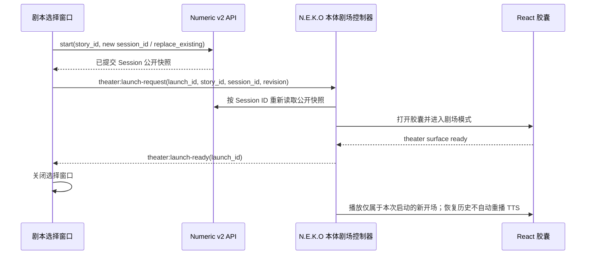
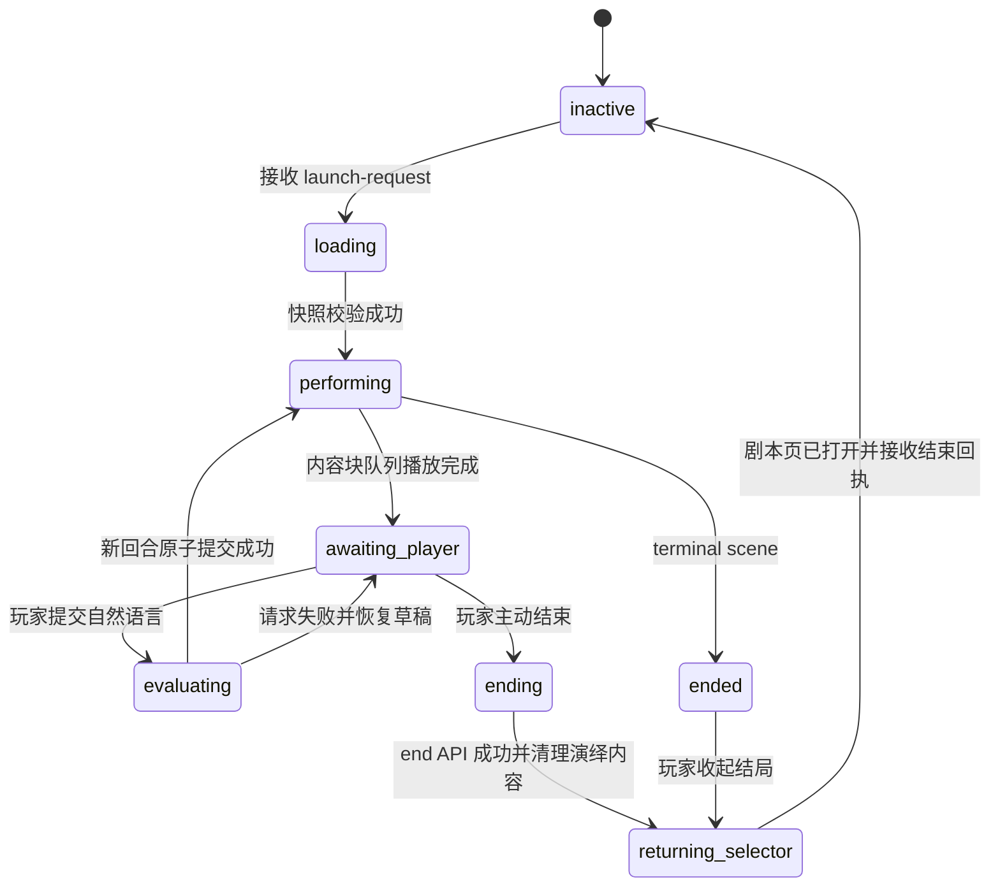

# N.E.K.O 小剧场胶囊演绎迁移方案

状态：历史迁移记录（当前实现合同以 `neko-theater-architecture.md` 的 Numeric v2.2 为准）

本文描述小剧场从“独立页面内选剧、输入和回放”迁移到“N.E.K.O 本体胶囊输入框演绎”的目标方案。它是迁移期间的专项实施记录，不是第三份长期小剧场合同；实施完成并通过验收后，应把仍然有效的规则合并回[小剧场架构开发文档](./neko-theater-architecture.md)，把真实演绎问题写入[小剧场实测问题描述以及解决方案](./neko-theater-issues-and-solutions.md)，再归档或删除本文。

当前代码和测试仍是“已经实现了什么”的事实源。对于目标状态，本文记录的“删除自由模式、收敛选剧入口、把演绎迁入本体胶囊”是本次已确认的迁移决策，临时覆盖长期架构文档第 1、7、9 节中与双模式和独立演绎页冲突的内容；Session、Ledger、模型权限、隐藏状态和原子提交等其余长期合同继续有效。本文没有授权立即修改代码。文中关于旧包、旧 Session、旧正文或独立推荐代理的兼容描述均为当时的迁移记录，当前实现已删除这些运行时兼容；旧包必须先升级到 v2.2。

## 1. 迁移目标

迁移完成后的玩家流程是：

1. 玩家从 N.E.K.O 设置菜单点击“小剧场”；
2. 独立小剧场窗口直接进入剧本选择界面，不再选择“剧本模式 / 自由模式”；
3. 玩家选择一个 Numeric v2 剧本，界面展示故事前情、玩家身份和当前猫娘的剧情身份；
4. 玩家点击“开始”或“继续”；
5. 服务端完成 Session 创建或恢复，N.E.K.O 本体确认已经接管演绎后，小剧场选择窗口关闭；
6. 胶囊显示当前旁白或猫娘对白；播放完成的旁白、对白和玩家行动进入胶囊上方现有历史对话区；对白自动逐句播放 TTS；
7. 轮到玩家时，同一个真实输入框恢复为可编辑状态，玩家只提交自然语言；
8. 点击推荐输入与手动输入走同一条自然语言提交链路；
9. 玩家主动结束或剧情自然终局后清理 N.E.K.O 本体中的演绎内容，重新打开剧本选择页并定位到刚结束的剧本，再由剧本页弹窗询问是否把本次公开演绎摘要写入当前猫娘的 N.E.K.O 记忆。

成功标准不是“把文本复制到输入框”，而是让胶囊在演出期间承担两种互斥状态：猫娘发言时是只读表演面；轮到玩家时仍是原来的真实输入框。

## 2. 明确边界

### 2.1 本次迁移包含

- 删除小剧场自由模式的页面、API、Runtime、角色切换附属逻辑和专属测试；
- 小剧场入口收敛为 Numeric v2 剧本选择；
- 把 Numeric v2 的 Session 控制、自然语言提交、恢复和结束能力迁到 N.E.K.O 本体；
- 把有序旁白 / 对白内容块迁到胶囊表现层；
- 多句对白自动逐句展示和播放；
- 增加剧场专属的 Live2D 整体动效入口；
- 预留确定性道具表现层；
- 保持 Runtime、Ledger、隐藏数值、路线、结局和原子提交权限不变。

### 2.2 本次迁移不包含

- 不把自由模式并入普通聊天；自由模式代码直接退役；
- 不增加正式 Choice、Planner、Director、多轮 Repair 或额外评分模型；
- 不让前端推断隐藏数值、路线或当前节点；
- 不让前端根据对白关键词猜测情绪、动作或道具状态；
- 不改变 `Story ID × character_id` 的唯一可恢复 Session 规则；
- 不把完整演绎历史重新塞进普通聊天消息列表；
- 不让生成器持有 Session、Ledger 或玩家演绎推进权。

## 3. 迁移前代码事实

| 当前能力 | 当前实现 | 迁移影响 |
| --- | --- | --- |
| 小剧场菜单入口 | `static/avatar/avatar-ui-popup-config.js` 三处均打开 `/theater-home` | 改为统一打开 `/theater` |
| 模式选择页 | `templates/theater_home.html` + `static/css/theater_home.css` | 由剧本选择页替代 |
| 自由模式页 | `templates/theater.html` + `static/js/theater.js` | 页面路径改作剧本选择；旧自由实现删除 |
| Numeric 演绎页 | `templates/theater_numeric.html` + `static/js/theater_numeric_v2.js` + `static/css/theater_numeric_v2.css` | 选剧能力留在选择窗口；演绎、输入、回放与结束迁到本体 |
| 自由模式后端 | `main_routers/theater_router.py`、`services/theater/free_*.py` | 删除并解除角色切换 / 改名附属调用 |
| Numeric 后端 | `main_routers/numeric_theater_router.py`、`services/theater/numeric_v2_*.py` | 保留；补充按已提交内容块播放 TTS 的接口 |
| 剧本摘要数据 | `NumericV2PackageRegistry.list_packages()` 已返回 `intro` | 选剧详情无需新增摘要端点，但列表响应需要身份投影 |
| 身份投影 | `NumericV2CastProjection.intro()` 返回 `background`、`player_identity`、`catgirl_identity`；当前 `/stories` 返回的仍是包内候选身份 | `/stories` 应由 Router 用当前玩家称呼和当前猫娘生成只读 `display_intro`，避免选剧页暴露候选原名 |
| 有序演绎 | `numeric_v2_performance.py` 已把普通表现和三段式换场展开为有序内容块 | 本体按同一顺序消费，不重排 |
| 胶囊输入 | `frontend/react-neko-chat/src/App.tsx` 中的受控 `textarea` | 不允许把对白写入 `value`；新增剧场展示状态和独立剧场草稿 |
| 胶囊字幕 | 非输入态已经使用 `.compact-chat-capsule-button > .compact-chat-capsule-text` 展示普通聊天字幕 | 剧场激活时不再把演绎内容写入该字幕位，胶囊只负责玩家输入 |
| 胶囊历史 | `CompactExportHistoryPanel` 已在胶囊上方显示 `user / assistant / system` 气泡，并具备流式呈现、自动钉底、滚动、收起和高度调整 | 增加只读剧场展示模式；普通微动作与对白合并为 assistant 消息，开场和换场旁白保留 system 消息，均逐字追加且不混入普通聊天 `messages` |
| GalGame 选项 | `.composer-galgame-slot > .composer-galgame-options` 已在胶囊附近显示 A / B / C 三项，并处理长文本跑马、上下放置和 Electron 命中区域 | 推荐输入直接复用该视图和样式，但使用剧场专属数据与回调，不开启 GalGame 模式、不生成正式 Choice |
| 输入提交 | `app-buttons.js` 给 `reactChatWindowHost.setOnComposerSubmit()` 绑定普通聊天发送 | 在统一发送入口增加“剧场激活时交给剧场控制器”的窄分流，不能覆盖或重复绑定宿主回调 |
| 胶囊宿主 | `static/app/app-react-chat-window/*` 暴露 `openWindow`、`setViewProps`、草稿回滚等 API | 增加剧场表现 API，但保持普通聊天默认值完全不变 |
| TTS | Numeric Router 当前把同回合全部对白用换行拼成一次 `speak_committed_line()` | 改为由本体按已提交 block 坐标逐句请求；不能继续整段拼接 |
| 记忆写入 | 普通聊天每回合调用 memory server `/cache/{lanlan_name}` | 剧场服务端从完整 Session 确定性生成一条单集摘要胶囊并复用 `/cache`；同 Session upsert，每个 Story 在 recent 与时间索引中都只保留最近三个周目，不让前端直写记忆文件，不在结束前台增加摘要模型调用 |
| 头部气泡 | `avatar-reaction-bubble.js` 思考态显示“。。。”，其他状态只切换情绪主题 / 图案，不显示回复文本 | 保持气泡职责，不把剧场对白再复制到头部气泡 |
| Live2D 情绪动作 | `live2d-emotion.js` 的 fallback 只改 `ParamAngleX/Y`，不是模型整体位移 | 新增剧场专属整体表现层，不能覆盖模型的用户位置与缩放 |
| 跨窗口通信 | `app-interpage` 已使用 `BroadcastChannel('neko_page_channel')`，并有同源 `postMessage` 后备 | 增加剧场命名空间和确认回执，不复用教程专属 action |

“前情摘要”在当前 Numeric v2 合同中没有独立字段。第一版选剧详情将 `intro.background` 以“故事前情”展示；它不是玩家上次游玩的进度摘要。若未来要展示“上次演到哪里”，必须由 Session 公开投影提供，不能把两者混为一谈。

“男女主身份”在 UI 中按故事文案表达，但数据合同继续使用“玩家身份 / 猫娘剧情身份”。不能假定每个玩家角色都是男性，也不能把候选姓名当成运行时姓名。选剧列表和正式开场都必须使用服务端按当前角色配置生成的身份投影；原始 `intro` 留在服务端包数据中，不直接作为玩家显示文本。

## 4. 目标信息架构与交互

本节采用 UI/UX Pro Max 的渐进披露、单一主操作、键盘可达和减少动效原则，并复用 N.E.K.O 现有颜色、字体、圆角和窗口控件，不引入另一套视觉品牌。

### 4.1 路由收敛

- `/theater`：唯一正式入口，直接显示 Numeric v2 剧本选择；
- `/theater-home`：已删除，不再注册或重定向；
- `/theater-numeric`：已删除，不再注册或重定向；
- `/api/theater`：随自由模式删除；
- `/api/theater-numeric`：继续作为唯一小剧场 API 前缀。

### 4.2 剧本选择界面

桌面宽度充足时使用“左侧剧本列表 + 右侧详情”的主从布局；窄窗口使用“列表 → 详情”的单列推进。开始、继续和删除三个操作在选中剧本后都保持可见，当前可执行动作使用主按钮层级，其余动作降低层级或禁用，避免按钮位置随 Session 状态跳动。

列表卡片展示：

- 剧本标题；
- 作者；
- 语言；
- 当前猫娘是否存在进行中 / 已结束 Session；
- 选中态和键盘焦点态。

选择剧本后，详情区展示：

- `display_intro.background`：标签为“故事前情”；
- `display_intro.player_identity`：标签为“你的剧情身份”；
- `display_intro.catgirl_identity`：标签为“猫娘剧情身份”；
- “开始”“继续”“删除”三个操作；
- 次操作：返回列表、导入剧本。

按钮状态固定为：

| 当前状态 | 开始 | 继续 | 删除 |
| --- | --- | --- | --- |
| 从未开始 | 可用，视觉主操作 | 禁用 | 可用，危险操作 |
| 正在演绎 | 禁用 | 可用，视觉主操作 | 可用，危险操作 |
| 已结束 | 可用，视觉主操作；确认后创建新 Session 并替换旧记录 | 禁用 | 可用，危险操作 |

正在演绎时“开始”禁用，玩家只能回到本体继续，或通过胶囊历史区的“结束演绎”完成结束确认；选剧页不能发送 `replace_existing` 或创建新 Session。

已结束时点击“开始”，显示破坏性确认，明确说明会创建新的 Session 并替换该 Story × 当前角色的可恢复记录；确认后使用新的 Session ID 调用现有替换语义。点击“删除”始终使用删除预检和危险确认；若预检发现活跃 Session，必须列出受影响角色并再次确认，不能只靠短暂 toast。

选择变化时只请求该 Story 的 `/session/active`，不在首次加载时为全部剧本并发创建或恢复 Session。没有选中剧本时主按钮禁用。列表为空时显示“导入剧本”的空状态，不显示无意义的确认按钮。

可访问性要求：

- 列表项、导入、开始、继续、删除、返回和确认按钮均可用键盘操作；
- 焦点样式不能只依赖颜色；
- 主要点击目标不小于 44 × 44 px，相邻目标至少留 8 px；
- 正文与背景对比度不低于 4.5:1；
- 请求超过 300 ms 显示就地 loading；错误常驻在当前操作附近，不能只显示短暂 toast；
- 普通过渡以 150—300 ms 的 `transform` / `opacity` 为主，复杂过渡不超过 400 ms；
- 遵守 `prefers-reduced-motion`，关闭非必要位移、缩放和背景循环动效。

### 4.3 开始与跨窗口交接

“开始”不是先关窗口再通知本体，而是两阶段交接：



交接消息只传 Story ID、Session ID、revision、`launch_id` 和动作类型，不把整份 Session 或隐藏状态跨窗口复制。N.E.K.O 本体必须重新向服务端读取快照，服务端仍是事实源。

消息通过现有 `neko_page_channel` 增加独立 `theater:*` 命名空间，并保留同源 `window.opener.postMessage` 后备。必须校验同源、消息 schema、`launch_id`、目标角色与超时。不能把剧场消息塞进 `yui_guide_*` 教程协议。

Electron 的 Pet 本体页与独立 `/chat` 页都会加载剧场 Runtime，但只有紧凑胶囊窗口可以拥有演绎投影和 TTS。选剧页若由 Pet 打开，Pet 只把 `launch-request` 确定性转交给 `data-chat-host-kind="compact"` 的 Runtime，自身不得读取快照或播放正文；`/chat_full` 即使仍存活也不得并行接管。同一 `launch_id` 的短时重发只覆盖聊天页尚在加载的竞态，目标 Runtime 必须幂等去重。

只有收到 `theater:launch-ready` 后才关闭选择窗口。若 Session 已成功创建但本体未确认，选择窗口保持打开，显示“演出已准备好，正在连接 N.E.K.O 本体”，允许重试交接；重试只能恢复同一 Session，不能创建第二个 Session。

## 5. N.E.K.O 本体中的演绎状态机

本体新增一个页面级剧场控制器，负责 Numeric API、跨窗口接管、有序播放、TTS、提交和清理。它不进入 React 组件内部处理业务，不接管 Runtime 权限。



核心状态建议为：

| 状态 | 胶囊 | 胶囊上方历史 | 胶囊附近操作 |
| --- | --- | --- | --- |
| `inactive` | 普通聊天输入 | 恢复普通聊天历史及进入剧场前的展开状态 | 普通聊天工具 |
| `loading` / `evaluating` | 剧场等待态，不可编辑 | 保留已提交的剧场历史 | 禁止重复提交 |
| `performing` | 复用现有字幕位，显示当前旁白或对白 | 当前 block 完成后追加对应气泡 | 无，或只显示“跳过等待” |
| `awaiting_player` | 真实输入框 + 独立剧场草稿 | 显示本 Session 的公开演绎历史 | GalGame 样式的推荐输入，只提交 Numeric 自然语言 |
| `ended` | 输入关闭，显示公开结局 | 追加公开结局摘要 | 只允许返回剧本页 |
| `returning_selector` | 清除剧场投影并恢复普通聊天 | 清除剧场消息源并恢复普通历史 | 重新打开 / 聚焦剧本页 |

剧场激活期间，`app-buttons.js` 的统一文本发送入口先询问剧场控制器是否接管。只有控制器明确处于 `awaiting_player` 时才向 `/api/theater-numeric/session/input` 提交；未激活时完全沿用现有普通 WebSocket 聊天链路。禁止临时覆盖 `reactChatWindowHost.setOnComposerSubmit()`，否则重新绑定、教程或窗口恢复可能把正常聊天回调覆盖掉。

图片附件、截图、GalGame 正式选项和普通聊天工具在剧场输入态禁用；推荐输入仍只是普通文本快捷提交，不携带 route、choice 或隐藏条件。

剧场控制器只接管“胶囊文本提交、胶囊历史消息源和剧场 TTS”三项能力。普通聊天消息与历史面板展开偏好仍在后台保持原状态，但不能在剧场激活期间覆盖剧场历史；普通主动消息和普通聊天语音应延后到剧场退出后展示，或在进入剧场时明确取消尚未开始的播放，不能与剧场逐句 TTS 抢占同一播放器。退出、终局、角色切换和异常恢复都必须释放这三项能力，未锁定的 Live2D idle、拖拽、窗口和其他页面能力继续由原系统管理。

## 6. 胶囊输入框、对白与旁白

### 6.1 复用当前历史气泡，不新建旁白组件

当前 compact 界面已经有两种可直接利用的真实能力：

- `data-compact-chat-state="input"`：在 `.compact-chat-surface-frame` 内渲染受控的 `textarea.composer-input`；
- 胶囊上方的 `CompactExportHistoryPanel` 已能展示 assistant 消息、处理 streaming 文本、自动钉底和滚动。

因此不新增“旁白条”“对白层”或第二个胶囊。剧场演绎统一进入现有历史区：

1. `performing` 时按内容语义为当前 performance 创建历史消息，并标记为 `streaming`；
2. 普通 narration 在追加前包装为一层中文括号，并与紧邻 dialogue 逐字追加到同一 assistant 气泡；
3. 开场和换场 scene narration 保持原有独立 system 气泡及样式，不受普通微动作字数规则限制；
4. 每个历史消息分组播放完成后切换为 `sent`；
5. 胶囊不显示剧场当前块，`awaiting_player` 时继续使用真实 `textarea`；
6. 头部气泡不复制正文。

表演期间要锁住 `.compact-chat-capsule-button` 的“点击进入输入态”行为，直到内容块队列结束。普通聊天回复若在后台到达，只更新普通聊天自己的状态，不得覆盖剧场历史。

当前 `textarea` 是 React 受控输入，组件内部同时维护普通 `draft`、IME、回滚和提交状态。猫娘对白和旁白都不能通过 DOM 赋值、合成 `input` 事件或 `setViewProps({ value })` 写进去。剧场使用独立 `theaterDraft`，做法与现有 `catLocalTextOnly` 的独立草稿思路一致；退出剧场时清空它并恢复进入剧场前的普通聊天草稿，Numeric 请求失败时也只能恢复到 `theaterDraft`。

建议给 `ChatWindowSchemaProps` 增加一个最小 `theaterPresentation` 投影，而不是让 React 自己请求 Numeric API：

```ts
type TheaterPresentation = {
  active: boolean;
  phase:
    | 'loading'
    | 'performing'
    | 'awaiting_player'
    | 'ended'
    | 'returning_selector';
  storyTitle?: string;
  history?: Array<{
    id: string;
    type: 'player_action' | 'narration' | 'dialogue' | 'ending';
    text: string;
    author?: string;
    displayKind?: 'action' | 'scene';
    status?: 'streaming' | 'sent';
  }>;
  suggestedInputs?: string[];
  busy?: boolean;
};
```

宿主增加 `setTheaterPresentation()` / `clearTheaterPresentation()`；默认 `active=false` 时不得改变普通聊天 DOM、尺寸、草稿、工具、教程、拖拽、最小化或恢复行为。

### 6.2 历史对话区与播放时序

- 普通微动作逐字进入当前 assistant 历史气泡，开场和换场旁白逐字进入 system 气泡，两者都不朗读；猫娘对白逐字追加时并行请求对应 TTS，完成后再推进；
- 普通微动作与紧邻对白共用猫娘气泡；开场和换场场景旁白继续使用独立旁白气泡，不存在“当前字幕”和“完成历史”两份正文；
- 三段式换场严格按 `source_response → transition_bridge → target_opening` 及段内 block 顺序播放，不额外显示隐藏节点 ID、章节卡或路线提示；
- 历史区使用现有自动钉底和滚动能力；
- 玩家点击推荐输入或提交手动输入后，立即以临时右侧玩家气泡进入历史，不等待 Evaluator / Actor 返回；提交成功后原位保留，失败时撤回临时气泡并把文本恢复到 `theaterDraft`，不能留下已发生的假记录；
- 普通微动作和猫娘对白合并映射为 `assistant` 气泡，开场和换场场景旁白映射为 `system` 气泡，玩家行动映射为 `user` 气泡，公开结局映射为 `system` 气泡；
- 进入剧场时以临时请求展开现有历史区并钉住底部，但不改写用户普通聊天历史区的持久展开偏好；玩家手动收起后，本轮不能因新 block 到来反复强制展开；
- 恢复 Session 时用服务端公开投影重建剧场历史，不重新播放历史 TTS、逐字动画或 Live2D 效果。

复用方式是在 `CompactExportHistoryPanel` 增加只读 `theater` 模式，而不是复制组件：

- `messages` 改为消费独立的剧场公开历史投影，不能把这些条目追加进普通聊天 `messages`；
- 隐藏导出预览、选择、全选、反选、复制和下载控件，只保留气泡、滚动、自动钉底、收起和高度调整；
- `aria-label` 改为“小剧场演绎记录”，不能继续宣读为“导出对话”；
- 退出剧场时清除临时剧场消息源，恢复原普通历史、原滚动状态和原展开偏好。

### 6.3 括号动作与旁白精简修改方案

本节记录胶囊演绎落地后的第二轮文本表现合同，当前已完成代码实现与自动回归。目标不是删除所有旁白，而是把普通互动回合从“对白外再写一段小说叙述”改成“对白为主体，必要的微动作作为括号补充”。

#### 6.3.1 玩家可见规则

普通回合优先显示为：

```text
（她把一杯热咖啡推到你手边）
“先暖暖手，别又逞强。”
```

括号动作只补 Live2D 无法完整表现、但能帮助玩家补全画面的即时细节：

- 合适：`（她抿了抿嘴）`、`（她悄悄拉了拉你的衣角）`、`（她偏过头去）`、`（她把咖啡推到你手边）`；
- 不合适：`（她看起来很开心，眼神里闪烁着光芒）`，因为它主要在解释状态；
- 应改为：`（突然凑近，眼睛亮晶晶地盯着你）`，因为它描述当下可观察的动态；
- 不允许在一个括号里连续写“起身、取物、走近、递出、回忆、解释”等一串动作，也不能写剧情总结、心理结论、关系评价或未来预告；
- 仍然不能替玩家补写动作、姿势、心理、接受物品或已经作出的选择。

“动态而非状态”按语义判断，不按关键词硬拦截。`眼睛亮晶晶` 可以作为“凑近并注视”这一动态动作的可见细节，但不能单独承担一段静态情绪说明。前端不能用“开心”“凑近”等关键词自行判断文本类型。

不同演绎位置使用不同显示方式：

| 位置 | 内容目标 | 玩家可见样式 |
| --- | --- | --- |
| 普通未换场回合 | 猫娘即时微动作或单一环境动态 | `（短动作）`，随后或穿插猫娘对白 |
| 开场第一块 | 建立必要的地点、时间和现场 | 独立场景旁白，不强制括号，不限定字数 |
| `source_response` | 回应玩家时的猫娘微动作 | 可显示为 `（短动作）` |
| `transition_bridge` | 时间、地点或行动桥接 | 独立场景旁白，不用括号碎片代替换场，不限定字数 |
| `target_opening` | 建立目标节点 `opening_scene` | 独立场景旁白，不强制括号，不限定字数 |
| 结局收束 | 交付公开结局事实 | 独立短旁白或结局卡，不压成微动作 |

普通回合由模型一次生成完整混合正文。每个括号动作的目标长度不超过 18 个汉字或 12 个单词；动作数量和对白句数不设固定模板，也不要求每句对白前机械插入动作。没有足够信息时，应选择最小动作而不是发明道具、距离、触碰或关系变化。开场和换场所需的场景旁白继续遵循原有合同和样式，不受微动作字数限制。

#### 6.3.2 数据与 TTS 合同

新合同把模型侧输出收敛成一个混合正文，不新增公开 `action` 类型：

```json
{
  "performance": "（把热咖啡推到你手边）先暖暖手。刚才那件事……（抬眼看向你）我答应了。",
  "suggested_inputs": ["那我们现在开始吧"]
}
```

- 全角中文括号内是猫娘或环境的即时微动作，括号外全部是当前猫娘实际说出口的对白；
- Session 保存原始 `performance` 字符串，Runtime 使用同一解析器确定性生成内部 action/dialogue 片段，不保存第二份解析副本；
- 括号必须成对且不能嵌套；普通回合必须同时存在微动作和有效对白，非法混合正文不能提交；
- 前端按原始字符顺序逐字显示，不给解析片段额外插入换行；
- `speak-block` 只接受服务端从已提交正文解析出的对白片段索引，不信任前端提交的文本；
- 开场、换场桥和目标开场使用独立 `scene_narration`，继续进入 system 气泡且不进入 TTS；
- 当前 Session 只接受 `performance` 与 v2.2 合同；带旧 `content` 或 `narration/dialogue` 字段的存档不再由运行时恢复演绎，必须先升级。维护/删除链路可读取生命周期快照做结束、归档补齐或清理，但不会开放新回合。

前端展开 `performance` 时保留 `opening / ordinary / source_response / transition_bridge / target_opening` 阶段，并为解析片段生成内部 `displayKind: action | scene`。实时播放时，Runtime 为混合正文创建一条临时 `streaming` 猫娘历史消息，按原始字符串逐字追加，同时按解析顺序逐段请求括号外对白 TTS；完成后切为 `sent`。React 继续复用现有历史消息组件，不新增第三套气泡；胶囊只保留玩家输入职责。

Numeric v2 页面载荷通过 `participants.player_name / catgirl_name` 显式提供当前展示绑定。Runtime 创建或恢复历史记录时必须把对应名称写入每条玩家行动和猫娘演绎的 `author`；不能让 React 用“玩家”或 `Neko` 占位文案猜署名。场景旁白和结局继续使用 system 署名，不冒充任一角色。

#### 6.3.3 Actor Prompt 修改点

主要修改 `services/theater/numeric_v2_actor.py`，不增加模型调用：

| 位置 | 目标修改 |
| --- | --- |
| `NUMERIC_V2_ACTOR_NARRATION_BREVITY_INSTRUCTION` | 定义 `performance` 的括号内外语义；动作和对白可自然穿插且不限制固定数量；每个动作保持短小、动态、括号成对且禁止嵌套 |
| `NUMERIC_V2_ACTOR_STYLE_INSTRUCTION` | 把“旁白优先展示可见反应”进一步收敛为“对白为主体，动作只在补足画面时出现”；避免每轮固定使用“听到/闻言 → 神态说明 → 对白”的模板 |
| `_system_prompt()` | 普通回合只生成 `performance`；开场和换场使用 `scene_narration`；括号外只能是猫娘实际发言，括号内不能替玩家行动 |
| `_opening_messages()` 的 `instruction` | 开场只允许一句必要场景锚点和猫娘主动对白，不把章节正文展开成长旁白 |
| `_turn_messages()` 的 `turn_instruction` / `response_instruction` | 普通回合先直接回应玩家，只推进一个互动节拍；接近 `recommended_turns` 时用猫娘动作、对白或环境动态把待发生目标带入现场，而不是增加叙述长度 |
| `_parse_output()` 与 `numeric_v2_performance.py` | 校验混合正文并确定性拆出动作/对白；普通回合至少包含一个动作和一句对白；不兼容旧 Session 内容块 |

可直接落入 `NUMERIC_V2_ACTOR_NARRATION_BREVITY_INSTRUCTION` 的 Prompt 草案为：

```text
In a performance string, text inside Chinese full-width parentheses is a visible
micro-action and all text outside parentheses is spoken dialogue by the active catgirl.
Actions and dialogue may interleave naturally; do not target a fixed number of actions,
sentences, or dialogue lines, and do not add an action mechanically before every sentence.
Each parenthesized action must be one immediate micro-action by the active catgirl, no
longer than 18 CJK characters or 12 words. Describe motion, not a static emotional
explanation, psychological conclusion, relationship judgment, future beat, or scene
summary. Parentheses must be balanced and cannot be nested.
```

这段只控制“如何表达”，不能取代现有的动作归属、玩家行为禁止、过渡三段式、人格优先级和事实连续性规则。`_opening_messages()` 与换场 `turn_instruction` 仍需分别强调例外，不能只靠系统 Prompt 猜测当前字段用途。

不建议仅靠降低 `NUMERIC_V2_ACTOR_MAX_OUTPUT_TOKENS` 控制旁白。该上限同时覆盖多句对白和三段式换场 JSON，整体下调可能截断合法结构；应先用明确的内容合同和真实模型复测控制密度。也不建议第一版增加严格中文字数拒绝器：当前 Actor 没有多轮 Repair，因一条稍长但可用的微动作拒绝整回合，会比显示稍长更影响演绎连续性。若实测仍明显超长，再基于真实分布增加宽松上限或提交前校验。

#### 6.3.4 前端修改点

| 文件 | 目标修改 |
| --- | --- |
| `static/app/app-theater-runtime.js` | 解析混合正文并保留原始字符顺序；微动作与对白组成 assistant 消息，独立 `scene_narration` 组成 system 消息；TTS 只消费括号外片段；恢复历史仅接受当前 v2.2 投影 |
| `frontend/react-neko-chat/src/message-schema.ts` | 给剧场历史条目增加可选 `displayKind` 和前端临时 `streaming / sent` 状态；缺失字段只按当前 v2.2 默认投影，不恢复旧合同 |
| `frontend/react-neko-chat/src/App.tsx` | 小剧场输出只映射到历史消息；narration 与 dialogue 都使用猫娘 assistant 气泡，结局卡仍可使用 system；胶囊只作为玩家输入框 |
| `frontend/react-neko-chat/src/CompactExportHistoryPanel.tsx` | 直接复用既有 assistant 气泡和 `SmartTextBlock` 的 streaming 呈现，不新增旁白或打字机组件 |
| `frontend/react-neko-chat/src/styles.css` | 删除只服务胶囊旁白预览的样式；不能改普通聊天消息的共享基线 |

Runtime 不再补写括号，而是原样显示已经校验的混合正文。内部 `displayKind` 只服务新旧合同统一投影，不能根据正文关键词猜测动作或场景旁白。

#### 6.3.5 是否修改剧本生成器

旁白精简本身不需要先改 `NEKO_Numeric_drama`。当前生成器已经把每章详细 `narrative` 写入 Story Package 的 `story_beat.summary`；N.E.K.O Actor 并非完全看不到生成剧情，而是有意只投影：

- `summary` 第一完整句 → `opening_scene`；
- `must_happen` → `pending_goals`；
- `must_not_happen` → `boundaries`；
- `transition_goal` → `scene_direction`；
- 章节标题 → 软主题锚点。

当前 v2.2 已改为把当前幕完整 `story_beat.summary` 直接放入普通回合的 `current_scene`，并把下一幕完整简介压入 `next_scene`；这两块都只是剧情方向，不是已发生事实或待办清单。早期迁移草案中的 `summary_after_acceptance`、`opening_after_acceptance`、`transition_direction` 不再作为普通回合的独立 Prompt 字段：它们只可能作为 Runtime/Actor 的内部换场预览数据存在，正式换场另行发送紧凑的 `transition` 数据。Actor 根据当前回合数与推荐回合数决定何时收束，但在玩家接受和 Runtime 正式换场前，不得把未来简介中的事件、地点、角色、道具或玩家行动写成已经发生。

分阶段决策当前状态如下：

1. 阶段 C2 的代码、Prompt、胶囊显示和自动回归已完成；首轮免费端点探针记录到开场半截 JSON；改用临时 `qwen3.7-plus` 后，两本样本各 8 回合均形成成功提交轨迹，可用于初步观察换场流畅度；
2. 当前 v2.2 保持生成器与 Runtime 合同不变，真实模型失败按输出合同记录，不用新增剧本专属 Prompt 或自动 Repair 掩盖；
3. 迁移期间提出的生成器阶段 G1（`interaction_beats`）没有进入当前设计和实现范围；若未来重新讨论，必须作为新的产品方案单独确认，不能把下方备选设计当作现行待办。

以下 G1 内容仅保留为迁移期间的历史备选方案，不代表当前实现要求：

4. `interaction_beats` 只能描述猫娘或环境可以主动呈现的互动机会，例如“女主把旧信摊开并指出日期矛盾”，不能规定玩家回答、接受物品、靠近或承诺；
5. 这些节拍只能作为 Actor 的软场景计划，不参与 Evaluator `scene_complete`、Runtime 路由、Ledger 或隐藏数值；Actor 单回合不能压缩演完多个节拍，也不能把计划倒写成已发生事实；是否已经发生仍以 `recent_context` 为准，不增加独立节拍状态机；
6. 若未来重新启动 G1，必须同时修改生成器合同、N.E.K.O 编译合同、Actor 投影和两边文档，不能只在生成器中增加一个 N.E.K.O 不读取的字段。

如果未来重新立项 G1，预计涉及（历史备选，不是当前待办）：

| 仓库 | 文件 / 区域 | 目标修改 |
| --- | --- | --- |
| `NEKO_Numeric_drama` | `theater_generator/generation/numeric_v2.py` | 主线、节点完善和支线 Prompt 生成安全的 `interaction_beats`，并投影进 `story_beat` |
| `NEKO_Numeric_drama` | `theater_generator/numeric_v2.py`、`neko_v2_bridge.py` | 校验字段数量、玩家行动归属和 N.E.K.O 编译结果 |
| `NEKO_Numeric_drama` | 生成器设计文档、前端节点编辑器 | 让作者能查看和编辑互动节拍，不要求理解 Prompt 或 JSON |
| `N.E.K.O` | `services/theater/numeric_v2.py` | 若未来启用 G1，再决定是否编译可选 `interaction_beats`；不得借此恢复旧包运行兼容 |
| `N.E.K.O` | `services/theater/numeric_v2_actor.py` | 在 Token 预算内投影软节拍，并明确其不是已发生事实和完成条件 |
| `N.E.K.O` | `services/theater/numeric_v2_evaluator.py` | 默认不消费该字段；测试保护它不能改变 `scene_complete` 判断 |

`min_turns` 仍只决定 Runtime 最早允许完成当前节点的回合，不能控制旁白长度；盲目提高它会让所有节点被硬性拖长。`recommended_turns` 更适合表达作者希望的互动空间：它提示 Actor 何时聚焦和收束，但不强制推进。上段关于按互动节拍建议 `recommended_turns` 的内容属于未采用的 G1 备选，不是当前 v2.2 运行要求。

#### 6.3.6 验证标准

自动回归至少覆盖：

1. Actor Prompt 明确要求普通 `performance` 使用“括号微动作 + 括号外对白”，动作和对白数量不使用固定模板；
2. 普通回合至少包含一个括号动作和有效括号外对白，括号不成对、嵌套括号或纯动作输出不能提交；
3. 混合正文在历史区按原始字符顺序逐字显示；旧 Session 不再恢复，不能通过显示层重新套括号兼容；
4. `transition_bridge`、`target_opening` 和开场第一块仍按独立旁白显示，不被误包成连续微动作；
5. TTS 端点继续拒绝动作和场景旁白，只朗读从已提交正文解析出的括号外对白；
6. 玩家行动即时气泡、推荐输入直接提交、失败撤回和普通聊天草稿隔离不受影响；
7. 三段式换场、历史恢复、近重复保护、角色卡人格层级和物品连续性回归不退化。

真实模型复测至少连续演绎 8—10 回合并记录：

- 普通回合是否避免固定为“一个动作 + 两句对白”，并能按互动自然穿插多个动作与对白；
- 是否仍出现静态情绪解释、心理总结或多动作压缩；
- 对白是否成为主要信息和情感载体；
- 三张不同角色卡的动作选择、句长和说话节奏是否仍有明显差异；
- `recommended_turns` 前后是否能自然从展开转为聚焦，而不是靠加长旁白或突然跳幕；
- 精简后是否出现剧情信息不足或同一 `pending_goal` 反复打转；若确需处理，另立 G1 产品讨论，不在本次迁移中自动启动。

### 6.4 推荐输入复用 GalGame 选项框

推荐输入直接复用现有 `.composer-galgame-slot > .composer-galgame-options > .composer-galgame-option` 视图，包括 A / B / C 标签、长文本跑马、上下自动放置、键盘焦点和 Electron 命中区域。不再通过通用 `choicePrompt` 模拟，也不新建推荐输入组件。

复用只发生在显示层：

- 新增 `theaterSuggestedInputs` 和 `onTheaterSuggestedInputSelect`，不写入 `galgameOptions`，也不调用 `onGalgameOptionSelect`；
- GalGame 模式保持关闭；点击 A / B / C 后只取对应自然语言文本，走与手动输入完全相同的 Numeric 提交链；
- 选项不携带 route、Choice ID、隐藏条件或 priority，A / B / C 只是视觉序号；
- 现有 GalGame 选项框一次最多显示三项。当前 v2.2 由同一次 Actor 调用生成 2—3 条推荐，不存在独立推荐代理；旧 Session 不恢复，推荐文本也不携带剧情状态；
- 仅在 `awaiting_player` 展示；玩家开始输入、提交、进入 `performing`、结束或角色切换时立即清理。

现有 GalGame 请求、正式选项、通用 `choicePrompt`、小游戏邀约和破冰回调保持不变；剧场推荐输入存在时不得同时显示这些其他选项层。

## 7. 多句对白与 TTS 逐句播放

当前 `_speak_dialogue()` 会把同回合全部对白用换行拼成一次语音，无法让视觉层可靠地知道每句何时结束。本次迁移改为“前端编排、服务端只朗读已提交块”：

1. `session/start` 和 `session/input` 完成原子提交后只返回公开快照，不再自动整段调用 `_speak_dialogue()`；
2. 新增 `POST /api/theater-numeric/session/speak-block`；
3. 请求只提交 `story_id`、`session_id`、`revision`、确定性解析片段索引和稳定 `playback_request_id`，不提交要朗读的文本；
4. 服务端从已提交 `opening_performance` 或 `performance_history` 解析该片段，确认它是括号外猫娘对白、Session/角色/revision 仍有效后才调用 TTS；
5. 本体先显示一句对白，再请求该句 TTS，并使用返回的 `speech_id` 等待匹配的 `neko-assistant-speech-end`；
6. 收到结束事件后自动进入下一内容块；TTS 不可用、未排队或超时时，按文字阅读时长继续；
7. 第一条剧场语音可以中断进入剧场前残留的普通聊天音频；后续句子不得互相 `interrupt_audio`；
8. 刷新 / 恢复只重建已提交状态，不自动请求历史 block 的 TTS；只有本次刚提交或刚创建的新表现进入播放队列。

Actor 的 `performance` 括号外片段是正式对白段。连续对白句可以位于同一片段；当中插入新的括号动作时，解析器自然产生下一段对白。持久化只保存原始混合正文，片段索引由同一解析器在服务端和前端重建，不能把切分结果重复写回 Session。

播放队列必须带 `session_id + revision + block_index`。开始新回合、主动结束、角色切换、Session 被其他窗口替换或页面卸载时，立即取消旧队列；迟到的 `speech-end` 不能推进新 Session。

## 8. 头部气泡、情绪与 Live2D 整体动效

### 8.1 头部气泡现状与迁移原则

当前头部气泡不是根据输出内容显示回复文字：思考阶段显示“。。。”；获得情绪后只切换 `happy / sad / angry / surprised / neutral` 主题和图案，非思考态文本为空。迁移后仍保持这一职责：

- 历史区猫娘气泡按内容块顺序显示对白和场景内微动作；开场、换场旁白继续使用独立旁白气泡；
- 胶囊只负责玩家输入；
- 头部气泡只显示思考和情绪反馈；
- 同一句内容不能在头部气泡与胶囊重复出现。

现有普通聊天的 `analyzeEmotion()` 发生在 WebSocket 最终回复链路，Numeric HTTP 回合不会自然经过它，而且它不能区分“答应”和“疑惑”。为了不增加额外模型调用，也不允许前端猜关键词，本迁移需要显式扩展 Actor 表现合同。

### 8.2 表现提示合同

每个猫娘对白 block 可增加一个可选语义提示：

```json
{
  "type": "dialogue",
  "speaker_id": "active_catgirl",
  "text": "好呀，那就一起去看看。",
  "performance_cue": "agree"
}
```

允许值只包括：`neutral`、`surprised`、`angry`、`happy`、`agree`、`confused`、`thinking`。Actor 只选择语义提示；Runtime / 解析器校验白名单并随已提交 performance 保存；前端不能提交或覆盖该字段。提示缺失或非法时使用 `neutral`，不阻止文字演绎。

这是迁移期间拟议的 Performance Actor 表现 DTO 扩展，当前 v2.2 尚未实施；它不应赋予 Actor 修改数值、路线、节点或事实的权力，也不应重新引入独立推荐代理或旧 Session 兼容。若未来重新立项，必须同步修改长期架构文档和 Performance 严格字段校验，并另行设计版本升级路径。

确定性映射为：

| 语义提示 | 头部气泡 | 模型整体效果 |
| --- | --- | --- |
| `surprised` | `surprised` | 左右快速 Shake，300 ms |
| `angry` | `angry` | 左右快速 Shake，300 ms |
| `happy` | `happy` | 向上小幅 Bounce 一次 |
| `agree` | `happy` | 向上小幅 Bounce 一次 |
| `confused` | `neutral`，首版不新增美术 | 向一侧倾斜 15° 后恢复 |
| `thinking` | `thinking` | 缓慢靠近镜头后恢复 |
| `neutral` | `neutral` | 无整体效果 |

### 8.3 Live2D 实现边界

现有 `playSimpleMotion()` 修改 Live2D Core 的头部角度参数，不满足“模型整体 Shake / Bounce / Tilt / Approach”。新效果必须作用于模型专属的外层 PIXI 表现容器：

- 不直接改写 `currentModel.x/y/scale` 的用户基线；
- 不移动胶囊、按钮、头部气泡或其他页面 UI；
- 每个效果开始前读取当前基线，结束、取消、切模型和退出剧场时恢复；
- 同时最多一个整体效果，新对白到来时先安全结束上一效果；
- 只使用 `transform` 类属性，不修改持久化模型偏好；
- `prefers-reduced-motion` 下禁用 Shake / Bounce / Tilt，只保留极轻微透明度或完全静止；
- 首版只承诺 Live2D；VRM、MMD、PNGTuber 无对应适配器时降级为气泡和文字，不得影响演绎。

引入外层容器会触及模型加载、拖拽、缩放、视口变化和切换恢复，必须用真实桌面链路验证，不能只做 CSS 动画或单元测试。

## 9. 道具视觉层

道具分为三类，权限不同：

1. 场景装饰道具：由 Story Package 的节点表现元数据声明，进入节点时显示；不代表玩家已经获得或使用；
2. 有状态剧情道具：是否出现、位置、持有人和可用状态必须由 Runtime / Ledger 的正式事实投影决定；
3. 瞬时效果：爱心、汗滴、问号、震动残影等只由已提交 `performance_cue` 触发，不进入剧情事实。

第一阶段先实现瞬时效果和场景装饰的容器，不立即把毛巾、秋刀鱼等正文名词自动变成道具。后续 Story Package 可增加可选、纯表现的资源清单，例如稳定 asset ID、图片路径、锚点、层级和 reduced-motion fallback；生成器负责作者编辑和资源校验，N.E.K.O Compiler 负责白名单与路径安全。

有状态道具不能由 Actor 文本或前端关键词识别生成。只有 Runtime 已经给出公开道具状态投影时才显示，避免“文字说毛巾在储物柜，画面却把毛巾放在沙发上”这类事实冲突。资源缺失时只降级为无道具，不影响 Session、Ledger、TTS 或剧情提交。

道具层必须挂在 Live2D / 场景的专属表现层，不进入胶囊 DOM，不跟随胶囊拖动；退出剧场、切换角色、删除剧本或 Session 失效时统一清理。

## 10. 结束、终局与恢复

### 10.1 主动结束

本体在剧场激活时显示轻量“剧场中 · 剧本名”状态和“结束演出”操作。点击结束并确认后：

1. 停止当前内容块队列和剧场 TTS；
2. 用当前 `base_revision` 调用 `/session/end`；
3. 服务端把本次主动退出标记为 `status=ended, ended_reason=user_exit`，返回公开快照和不透明 `end_receipt_id`；该状态表示已经离开演绎界面，不代表剧情终局；
4. 清空 N.E.K.O 本体中的当前字幕、剧场历史消息源、推荐输入、结局临时层、道具、Live2D 效果、`theaterDraft` 和播放指针；
5. 释放剧场输入分流，立即恢复普通聊天胶囊、普通历史和原普通聊天草稿；
6. 使用当前入口相同的命名窗口 `neko_theater` 调用 `openOrFocusWindow('/theater?story_id=...')`，重新打开或聚焦剧本选择页；
7. 等剧本页发出 `theater:selector-ready` 后，本体发送 `theater:post-end`，只携带 Story ID、Session ID、结束 revision、`end_receipt_id` 和一次性消息 ID；
8. 剧本页重新读取服务端状态，定位刚退出的剧本，确认它是 `ended_reason=user_exit` 后再弹出记忆询问；本体不显示该询问；记忆选择完成后，“继续”恢复同一个 Session，“开始”经确认后重新开局。

演绎正文只有在 `/session/end` 成功后才清理。若结束请求失败，保持剧场激活并显示常驻错误，允许重试；若 Session 已退出但剧本页打开失败，本体保持普通聊天状态并显示可重试提示。重新进入剧本页后仍可继续该 Session，不得因窗口打开失败丢失进度。

### 10.2 记忆写入合同

剧本选择页定位到刚结束的剧本后，使用页面现有对话框体系弹出模态询问：“是否让 N.E.K.O 记下本次演绎内容？”操作为“记下本次演绎”和“暂不记录”。焦点进入弹窗后先落在标题或正文，Tab 只在弹窗内循环；Esc、关闭按钮和明确点击“暂不记录”都表示拒绝写入，不能把关闭行为解释为同意。

“记下本次演绎”表示把公开演绎交给现有记忆系统管理，不是把 Session、Ledger 或完整隐藏状态复制进记忆目录。复用普通聊天的 memory server `/cache/{lanlan_name}` 链路：

1. 剧本页调用新的剧场归档端点，只提交 `story_id`、`session_id`、结束 revision、`end_receipt_id` 和稳定 `archive_request_id`，不上传自行拼接的 transcript；
2. 服务端重新读取已结束 Session，校验 Story、不可变 `character_id`、revision 和当前角色绑定；
3. 完整玩家输入、旁白、转场、动作和猫娘对白先保存在 Session；玩家确认记忆后，服务端先原子写入不对列表暴露的待提交冷档案，memory server 成功后再发布到 `public_archives`。重新开始删除恢复槽位 Session 后，已确认记忆的旧周目仍可按 Story ID、Session ID 查阅，但不复制进普通 recent Prompt；
4. 每次成功归档只确定性生成一条 `system` 单集摘要胶囊。`metadata.source=theater_numeric_v2`、`memory_tier=episode_summary`，并保存 Story、Session、剧本标题、暂停或结局状态、摘要和 revision 范围；胶囊不是玩家或猫娘的一句对白；
5. 同一 Session 继续演绎后再次归档时，memory server 以 `story_id + session_id` upsert 原胶囊，暂停状态被最新完成状态替换，不生成第二份剧本标题或重复周目；
6. 重新开始产生的新 Session 视为新周目。每个 Story 在近期工作记忆中只保留最近三个周目胶囊，全部 Story 合计最多三十条；`time_indexed.db` 以 recent 有界集合重建，删除旧版剧场全文和已淘汰事件。每个 Story × 角色默认保留最近五份未收藏完整档案，收藏档案额外保留；
7. 单集摘要只使用玩家可见演绎和公开结局生成，不包含隐藏数值、band、阈值、路线条件、Evaluator 原始结果、推荐输入、内部节点 ID 或 Ledger；本次写入不在按钮前台新增摘要 LLM；
8. 剧场胶囊必须从普通事实、反馈、自我披露、复读、人格提取和通用 history review 链路中隔离，不能把角色扮演内容晋升为现实事实；
9. 写入期间弹窗按钮禁用并显示“正在记录…”；成功后关闭弹窗，在该剧本详情显示“本次演绎已记下”的就地成功反馈；失败时弹窗保留并提供“重试”“暂不记录”，不能绕过未决记忆选择直接恢复；
10. 点击“暂不记录”销毁本次待提交档案并把 receipt 标记为 skipped，不删除 Session，也不影响从选剧页继续或重新开始；
11. 页面刷新时可按 `end_receipt_id` 恢复 pending / writing / written / skipped 状态。若玩家直接关闭整个剧本窗口，不能后台默认写入；未决 receipt 下次回到该剧本页时可以继续询问。

实现收口约束：`end_receipt_id` 与 `archive_request_id` 均由服务端根据 Story ID、Session ID、结束 revision 和不可变 `character_id` 确定性生成。前端只能保存并回传该 `archive_request_id`，失败重试不得重新生成。剧场服务先保存待提交冷档案，再调用 memory server `/cache/{lanlan_name}`；memory server 在同一角色 settle lock 内按 Session upsert recent 胶囊，然后以 recent 为基线重建全部剧场 time-indexed 事件。只有 memory server 成功且待提交档案已发布时，receipt 才进入 `written`。

选剧页在身份介绍下方复用现有卡片样式显示冷档案摘要，提供“收藏 / 取消收藏”和“忘记该剧本”。忘记是显式破坏性操作：删除当前猫娘该 Story 的 recent 胶囊、time-indexed 剧场行、冷档案和旧回执，但保留剧本包与当前 Session。重开、删剧本和删角色时分别清理旧 Session 回执、Story 回执或角色回执；冷启动 GC 删除其余无主回执。

这里复用 `/cache` 的业务写入能力，不能调用面向记忆浏览器整文件编辑的 `/api/memory/recent_file/save`，也不能由浏览器直接改 `recent.json`。角色名称发生变化时，服务端必须由 Session 的 `character_id` 解析当前角色和记忆目标，不能信任前端传来的猫娘名。

### 10.3 自然终局

进入 terminal scene 后在胶囊历史追加公开结局标题与摘要，并关闭玩家输入和推荐输入。玩家点击“收下结局 / 返回剧本页”后执行与主动结束相同的本体清理、剧本页返回和记忆询问，但不再次调用 `/session/end`。重新进入选剧页时，该 Story 显示已结束，主操作为“开始”；点击后需确认以新 Session 原子替换旧记录。

### 10.4 刷新和重启

- 本体在当前程序生命周期内刷新后，若存在当前角色对应的会话级剧场指针，向服务端重新读取 Session 并恢复到 `awaiting_player` 或自然终局的 `ended`；
- 完整退出 N.E.K.O 后不保留该前端指针，重启时默认关闭小剧场；后端 Session 与 Ledger 不结束，玩家可从选剧页点击“继续演绎”恢复；
- 已提交历史只用于 Actor 连续性和必要的当前画面恢复，不在胶囊中高速重播；
- 恢复时重建胶囊上方的公开剧场历史，并把最后一个旁白 / 对白显示为静态上下文，但不自动播放历史 TTS 和动效；
- 记忆询问属于剧本页，不属于本体胶囊状态；剧本页刷新后按结束 receipt 恢复询问或写入结果，不能要求本体重新播放演绎正文；
- 角色切换不删除其他角色的 Numeric Session；当前剧场控制器应退出可见演出并按新角色显式重新选择或恢复，不能继续向旧角色 Session 提交。

## 11. 自由模式删除清单

以下是当前代码已经证实的直接自由模式链路，实施时应在同一个功能分支删除或解除引用：

### 11.1 直接删除

- `main_routers/theater_router.py`；
- `services/theater/free_runtime.py`；
- `services/theater/free_seed.py`；
- `services/theater/free_role_card.py`；
- `static/js/theater.js` 的自由模式实现（文件名可由新的选剧脚本接管，也可以新建 `theater_selector.js` 后删除旧文件）；
- `tests/frontend/test_theater_free_browser.py`；
- `tests/unit/test_theater_free_runtime.py`；
- `tests/unit/test_theater_tts_bridge.py` 中只验证自由 Router 的用例，Numeric TTS 用例迁到 Numeric Router / 新 speak-block 测试。

### 11.2 解除引用或重写

- `app/main_server/web_app.py`：删除旧 `theater_router` 导入和挂载；
- `main_routers/characters_router/crud.py`：删除自由 Session 的切换发布边界与改名清理；Numeric v2 继续按不可变 `character_id` 恢复，不能照搬“改名即结束 Session”的自由模式语义；
- `main_routers/pages_router.py`：`/theater` 改为选剧页，旧两页改重定向并最终移除；更新静态资源版本清单；
- `templates/theater_home.html`、`templates/theater_numeric.html`：由新的单一选剧页替代；
- `static/css/theater_home.css`、`static/css/theater_numeric_v2.css`：选剧所需样式合并为单一页面样式，演绎样式迁到 React 胶囊；
- `tests/unit/test_theater_frontend_light.py`、`tests/unit/test_theater_page_runtime_smoke.py`：从“双模式 / 自由页隔离”改为“单一选剧入口 / 本体演绎隔离”；
- `tests/electron/theater-electron-*.test.js`：移除 `/api/theater/free/*` mock，改测选剧窗口交接、本体确认、关闭选择窗口、胶囊提交和恢复；
- `tests/unit/test_character_memory_regression.py`：删除自由 Session 与角色切换 / 改名绑定断言，保留 Numeric `character_id` 回归；
- 8 个 locale：删除只服务自由模式和模式选择的 key，新增选剧、交接、剧场状态、结束和错误 key，并校验 key 集合一致。

### 11.3 删除前二次确认的旧 Story v3 模块

`services/theater/llm.py`、`llm_response_contracts.py`、`story_loader.py`、`story_contracts.py`、`story_graph.py`、`session_store.py`、`authoring_dto.py`、`fact_lifecycle.py`、`time_anchor_contract.py` 当前主要服务旧 Story v3 / 自由模式及其测试，但不能仅因文件名相似一次性删除。实施删除前必须再次用源码引用搜索和完整测试确认没有 CLI、生成器校验或外部导入；确认无消费者后再连同对应测试和 `tests/conftest.py` 夹具一起移除。

必须保留 Numeric v2 仍在使用的共享模块，包括 `llm_context.py`、`name_projection.py`、`paths.py`、`tts_bridge.py` 以及全部 `numeric_v2_*.py`。

历史用户数据目录中的 `theater/free/` 不在本次启动时自动删除。代码停止读取即可；若未来清理磁盘，必须作为单独、明确、可恢复的数据迁移征得授权。

## 12. 文件级实施建议

| 文件 / 区域 | 目标改动 |
| --- | --- |
| `templates/theater.html` | 重写为单一剧本选择与详情页 |
| `static/js/theater_selector.js`（建议新增） | 获取剧本、选择详情、导入 / 删除、查询选中 Story Session、启动交接、接收结束回执并显示记忆询问 |
| `static/css/theater_selector.css`（建议新增） | 主从布局、单列响应式、焦点、loading、错误和 reduced-motion |
| `static/app/app-theater-runtime.js`（建议新增） | 本体剧场状态机、Numeric API、内容块队列、剧场历史投影、恢复、结束、返回剧本页和清理；保留内容块所在阶段并投影 `action / scene` 显示语义 |
| `static/app/app-interpage/*` | 增加启动与结束返回所需的 `theater:*` 消息 schema、同源校验、selector-ready 和一次性回执 |
| `static/app/app-buttons.js` | 在唯一文本发送入口做剧场激活分流；默认路径不变 |
| `static/app/app-react-chat-window/*` | 保存剧场投影、暴露 set/clear API、构造 React props |
| `frontend/react-neko-chat/src/message-schema.ts` | 增加严格、可选的 `theaterPresentation`、独立剧场历史和推荐输入 schema |
| `frontend/react-neko-chat/src/App.tsx` | 独立 `theaterDraft`；让现有历史面板和 GalGame 选项视图消费剧场投影，胶囊只负责玩家输入，不新增旁白 / 对白 / 推荐输入组件 |
| `frontend/react-neko-chat/src/CompactExportHistoryPanel.tsx` | 增加只读 `theater` 模式，保留气泡与滚动，隐藏选择和导出控件，使用正确 aria-label |
| `frontend/react-neko-chat/src/styles.css` | 只补旁白语义和剧场历史模式的局部修饰及 reduced-motion；复用现有胶囊 / 历史 / GalGame 选项样式，不改共享定位基线 |
| `main_routers/numeric_theater_router.py` | `/stories` 增加当前角色的 `display_intro`；停止整段自动 TTS；结束时生成 receipt；增加只朗读已提交 block 和归档已结束 Session 的接口 |
| 剧场记忆归档适配 | 从完整 Session 生成单条单集摘要胶囊，按 Session 幂等 upsert 到 memory server `/cache/{lanlan_name}`，不直写记忆文件 |
| `services/theater/numeric_v2_performance.py` | 提供稳定内容块坐标 / 兼容读取，支持对白 cue |
| `services/theater/numeric_v2_actor.py` | 先落实括号微动作与独立场景旁白的 Prompt 边界；后续阶段如重新立项再严格解析可选 `performance_cue`；当前推荐由同次 Actor 调用生成 2—3 条，旧 Session 不兼容 |
| Live2D manager 相关文件 | 增加模型专属外层表现容器和可取消效果 API |
| `main_routers/pages_router.py`、`app/main_server/web_app.py` | 收敛路由和资源挂载，移除自由 Router |
| `static/locales/*.json` | 同步 8 语言文案 |

如果项目实际加载的是 `static/react/neko-chat/neko-chat-window.iife.js` 和 CSS 构建产物，修改 React 源码后必须执行 `bash build_frontend.sh`，并验证页面引用的构建产物已经更新。

## 13. 分阶段实施顺序

### 阶段 A：删除自由模式并收敛选剧入口

实施状态：已完成代码迁移与自动回归。

- 新 `/theater` 选剧页可列出、查看、导入和删除 Numeric v2 剧本；
- 删除自由 Router / Runtime 和角色附属逻辑；
- 删除已无调用方的 `/theater-home`、`/theater-numeric` 临时重定向；
- 不改变 Numeric Runtime 结果。

### 阶段 B：本体接管 Session 与真实输入框

实施状态：已完成代码迁移与自动回归。

- 完成双阶段窗口交接；
- 本体恢复 / 提交 / 结束 Numeric Session；
- 普通聊天草稿和剧场草稿隔离；
- 主动结束成功后清理本体演绎内容、恢复普通聊天并重新打开剧本页；剧本页定位结束 Story 后显示记忆询问；
- 剧场归档复用 memory server `/cache` 并具备 Session 级幂等回执。

### 阶段 C：有序旁白、对白与逐句 TTS

实施状态：代码迁移与自动回归已完成；真实模型换场复测受当前免费端点非 JSON 返回阻断，桌面窗口和真实 TTS 设备仍待人工验收。

- 使用现有历史面板把普通微动作与对白逐字追加到猫娘气泡，开场和换场旁白逐字追加到独立旁白气泡；
- 历史面板与普通聊天历史隔离，恢复时直接展示完整气泡；
- 推荐输入复用 GalGame A / B / C 选项框，但只提交自然语言；
- 三段式换场不丢顺序；
- speak-block 只读取已提交文本；
- 多句对白自动推进，恢复不重播。

### 阶段 C2：括号动作与旁白精简

实施状态：代码、Prompt、React 构建产物与自动回归已完成；新 Story ID、新 Session ID 的真实模型探针已执行，但两本代表剧本均在开场返回非 JSON，尚不能宣称换场体验通过。

- 普通回合由模型一次生成 `performance` 混合正文，括号微动作和对白可自然穿插，不限制固定对白句数；
- 每个括号只写一项不超过目标长度的动态微动作，括号外全部是猫娘对白；
- 开场、三段式换场桥和目标开场继续使用独立 `scene_narration`；
- Runtime 确定性解析动作和对白，TTS 只读取括号外片段；Session 使用 `neko.script.session.numeric.v2` 与 Story Package `v2.2` 合同，旧内容块合同不再兼容；
- 真实模型需在可返回结构化 JSON 的端点上完成 8—10 回合复测；是否扩展生成器不由本次迁移自动触发，必须另立产品讨论。

### 阶段 D：情绪 cue、Live2D 整体效果与瞬时道具

实施状态：未开始。对白 / 旁白基础输出已先按阶段 C 落地；本阶段等待表现提示合同和道具展示方案进一步确认。

- 先更新 Actor / Runtime 表现合同；
- 再实现 Shake、Bounce、Tilt、Approach；
- 最后接入不影响剧情事实的瞬时道具；
- 有状态剧情道具另行设计公开 Runtime 投影后再做。

每一阶段都必须能够单独回归，不能在胶囊迁移未稳定时同时改 Story 路由、模型人格或隐藏数值算法。

## 14. 验收矩阵

### 14.1 选剧与交接

1. 点击“小剧场”直接进入剧本列表，不再出现自由模式；
2. 选中剧本后显示正确的故事前情、玩家身份和猫娘剧情身份；
3. 选中剧本后始终显示主开局按钮、继续和删除；没有 Session 时主开局按钮显示“开始”，存在任何 Session 时显示“重新开始”，并按 Session 状态正确启用和禁用；
4. active Session 只启用“继续”，网络层不能产生 start / replace 请求；
5. `ended_reason=user_exit` 的 Session 同时启用“继续”和“开始”：“继续”原子恢复同一 Session，“开始”确认后使用新 Session ID 替换旧记录；剧情自然终局只启用“开始”；
6. 本体未 ready 时选择窗口不关闭，重试不会创建重复 Session；
7. 本体 ready 后选择窗口关闭，胶囊开始播放正确 Session；
8. 普通浏览器和 Electron 子窗口均可完成交接，消息拒绝不同源和错误 schema。

### 14.2 胶囊与输入隔离

1. 猫娘对白和普通微动作合并显示在现有历史区的 assistant 气泡中；开场和换场旁白使用原有 system 气泡；胶囊只负责玩家输入，演绎正文不进入 `textarea.value`；
2. 轮到玩家时显示真实输入框，中文 IME、Enter / Shift+Enter 和发送按钮仍正常；
3. 普通聊天草稿在进入和退出剧场后保持不变；
4. Numeric 提交失败时恢复剧场草稿，不发送到普通 WebSocket；
5. 胶囊上方现有历史面板显示独立剧场历史：玩家在右、猫娘在左，普通微动作并入猫娘气泡，开场、换场旁白和结局使用 system 样式；退出后恢复普通聊天历史；
6. 剧场历史模式不显示选择、预览、复制和下载控件，也不把条目追加进普通聊天 `messages`；
7. 推荐输入使用现有 GalGame A / B / C 选项框，点击结果与手动输入生成相同 Numeric 请求字段，不包含 Choice ID，也不触发 GalGame 回调；
8. 剧场未激活时普通聊天、教程、GalGame、图片、拖拽、最小化和恢复链路无变化。

### 14.3 演绎与 TTS

1. 普通回合严格按 Actor 的原始 `performance` 字符顺序可见，并包含至少一个短括号动作和有效对白；
2. 三段式换场按来源回应、过渡桥、目标开场连续播放；
3. 连续对白按括号边界解析为语音片段并自动播放，不限制只能回复两句；
4. 当前 performance 从第一个字开始进入上方历史；普通微动作和对白按分组进入猫娘气泡，开场和换场旁白进入独立旁白气泡；胶囊不显示演绎正文；
5. 玩家行动提交后立即以临时气泡进入历史；提交成功后原位保留，请求失败时撤回且恢复剧场草稿；
6. TTS 不可用时按文字阅读时长继续，不回滚已提交剧情；
7. 当前程序内刷新能重建公开剧场历史且不重播历史 TTS；完整重启默认关闭小剧场，主动继续后再从 Session 重建历史；
8. 当前程序内刷新能重建 v2.2 公开剧场历史；旧 `narration/dialogue` Session 不再恢复；
9. 头部气泡不显示对白正文，思考和情绪主题仍正确。
10. 普通未换场 narration 在猫娘历史气泡中显示为一层中文括号动作；开场、`transition_bridge` 与 `target_opening` 保持原有场景旁白样式和独立 system 气泡，不受微动作字数限制；
11. 普通回合不设固定动作数或对白句数；每个动作只描述一个动态焦点，不用静态情绪解释、心理总结或连续动作代替对白；
12. 括号动作不进入 TTS，混合正文原样保存，解析结果不会重复写入 Session；旧 Session 不可恢复并返回升级提示。

### 14.4 Live2D 与道具

1. `surprised / angry` 只让模型整体 Shake 300 ms；
2. `happy / agree` 只让模型整体 Bounce 一次；
3. `confused` 倾斜 15°，`thinking` 缓慢靠近，结束后恢复；
4. 动效不移动胶囊、按钮和其他 UI，不写入模型持久化位置 / 缩放；
5. 动效中切角色、切模型、退出和取消不会留下偏移；
6. reduced-motion 下没有强位移动效；
7. 道具资源缺失或非 Live2D 模型不会阻断剧情、TTS 和输入。

### 14.5 Session 与清理

1. Session、Ledger、revision、幂等、角色不可变 ID 和原子提交回归全部通过；
2. 点击“结束演出”只有在 `/session/end` 成功后清理本体演绎内容，清理范围包含当前字幕、剧场历史、推荐输入、临时结局层、道具、动效、剧场草稿和播放队列；
3. 清理后立即恢复普通聊天胶囊、普通历史、普通草稿和输入链，并重新打开或聚焦 `neko_theater` 剧本页；
4. 剧本页收到并复验结束回执后定位到刚结束的 Story，再弹窗显示“记下本次演绎 / 暂不记录”；本体胶囊不出现该询问；
5. 点击“暂不记录”、Esc 或弹窗关闭不产生 memory `/cache` 请求；直接关闭整个剧本窗口也不能后台默认写入；
6. 点击“记下本次演绎”只向日常记忆写入一条单集摘要胶囊；完整公开回合保留在 Theater `public_archives` 冷档案，摘要不包含隐藏数值、条件、节点 ID、Evaluator 结果和推荐输入；
7. 相同 Session 的暂停、继续与完成归档始终 upsert 为一份最新记忆；重新开始的新 Session 作为新周目，同 Story 近期最多保留三个周目胶囊；重复点击、刷新或超时重试不能产生重复记忆，写入失败可重试或跳过；
8. 记忆写入使用服务端 `/cache/{lanlan_name}` 适配，不调用 `/api/memory/recent_file/save`，不由浏览器直接写文件；
9. 服务端主动退出的 Session 可在选剧页通过“继续”恢复同一进度，也可通过“开始”用新 Session ID 再次开局；剧情自然终局不能继续；
10. 自由 API 返回 404，代码与测试中不存在 `/api/theater/free/*`、`free_runtime` 或自由模式恢复指针；
11. 8 个 locale JSON 可解析、key 集合一致、页面没有只写中文 fallback 的新文案。

真实模型复测仍要使用新 Story ID 和新 Session ID，重点验证换场、休息、旁白 / 多句对白穿插、章节主题、物品事实、当前输入权重、三张角色卡文风和小葵核心人格。胶囊迁移不能用视觉层掩盖这些现有演绎质量问题。

## 15. 实施完成后的文档收口

迁移通过后应同步修改长期架构文档：

- “双模式隔离”改为“Numeric v2 单模式”；
- 页面与模块表改为单一选剧入口 + 本体演绎控制器；
- 前端与 TTS 章节改为“胶囊当前字幕 + 上方独立剧场历史 + GalGame 样式推荐输入 + 逐句播放”合同；
- 结束流程加入返回剧本页和剧本页记忆询问，明确该弹窗不属于本体胶囊；
- Actor 输出合同加入可选 `performance_cue`；
- 验收矩阵删除“剧本模式与自由模式不串线”，替换为“剧场模式与普通聊天输入、草稿、音频和恢复链路不串线”；
- 实测问题文档新增胶囊迁移后的真实表现证据和复测状态。

完成上述收口后，本文不再作为长期事实源。
