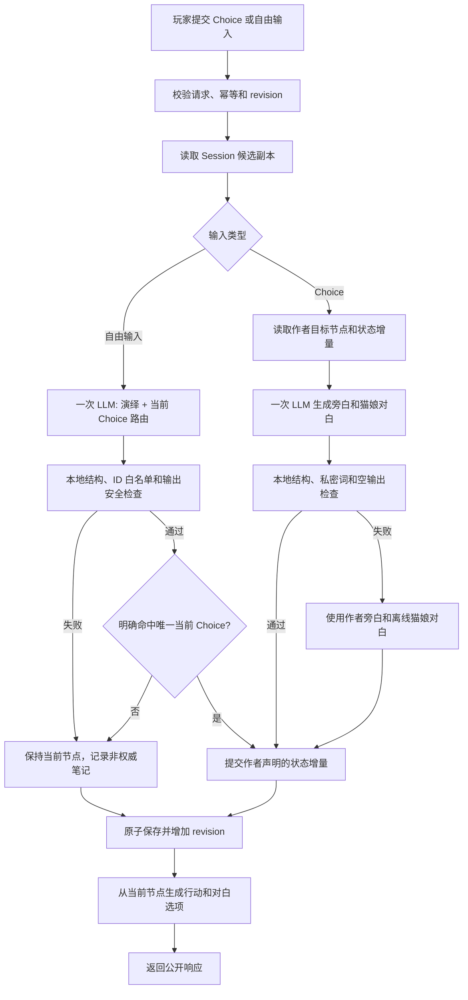

# N.E.K.O 小剧场瘦身提案

## 1. 文档状态

本文是小剧场从旧重型方案收缩到单猫娘轻量主链时的**历史提案与第一轮结果记录**。文中的“当前版本”指当时的瘦身基线，不代表 v2.6 当前事实；World Contract、受约束 Runtime Branch Patch 等后来已经实现的能力，以长期架构文档和 v2.6 实施文档为准。多猫娘分饰不同角色仍不属于当前运行时。

提案的目的，是把当前版本需要的 1v1 互动小说能力，与最终版本需要的受约束动态叙事和多猫娘人格能力分开，避免为了最终愿景一次性建设全部通用引擎。

当前实现细节参见：

- [`neko-theater-v2.6-implementation-architecture.md`](./neko-theater-v2.6-implementation-architecture.md)

## 2. 已确认产品目标

小剧场的最终目标是：

> 以猫娘与玩家 1v1 演绎为核心，由作者剧情保证故事可推进、可结束；大模型负责自然回应和增强沉浸感，也可以在作者声明的剧场边界内改写剧情真相，但不能偏离剧场背景、题材、世界规则和结局范围。未来可以在同一剧本中接入多个不同猫娘人格分饰不同角色；当前版本只让玩家自己的猫娘接入剧情。

### 2.1 当前版本目标

- 采用“约 70% 作者剧情 + 30% 自由互动”的互动小说模式；
- 作者静态剧情保证故事一定能够推进并抵达正式结局；
- 推荐选项是当前主要推进方式，并分为玩家行动与玩家对白；
- 玩家可以自由说话，大模型需要优先自然回应玩家；
- 玩家明确说出或实施唯一当前推荐意图时，可以使用自然语言通过同一个作者出口；
- 当前自由输入主要丰富演绎，不承担无边界、永久性的剧情真相改写；
- 当前一场演出只有玩家与玩家自己的猫娘；
- 优先保证剧情稳定、回应自然、选项不断流、延迟和成本可控。

### 2.2 最终版本目标

- 作者剧情继续提供世界边界、主线目标、可推进骨架和可结束范围；
- 推荐选项从主要入口逐步降为辅助入口，玩家可以更自由地表达行动和对白；
- 模型可以提出长期有效的剧情真相改写，例如增加符合世界观的新事实、改变支线因果或生成新的可达路径；
- 所有改写必须满足作者声明的 World Contract，不能把修仙故事改成科技结局，也不能把爱情主线改成历史讨论；
- 同一剧本可以绑定多个猫娘人格，由不同人格分别饰演不同角色；
- 多角色能力是未来阶段，不进入当前轻量版首轮实施。

### 2.3 “允许改写真相”的工程定义

最终版本中的“模型改写剧情真相”不等于模型直接修改 Session。模型只能提出受约束的剧情补丁，由服务端验证后提交。

作者需要为每个剧本声明 World Contract，至少包括：

- 题材与核心主题；
- 世界时代、技术水平和超自然规则；
- 玩家与角色身份边界；
- 不可改变的基础事实；
- 允许改写的事实类型；
- 主线目标和允许的结局域；
- 禁止出现的题材漂移和结局类型。

模型提出的剧情补丁只有在符合 World Contract、引用合法、能够继续推进且不破坏可结束性时，才能成为新的权威剧情事实。这项能力属于未来版本，当前版本先保留接口方向，不实现完整动态改写引擎。

## 3. 瘦身前复杂度结论

瘦身前 `services/theater` 包含 30 个 Python 模块、约 12,689 行代码。其中：

| 模块组 | 代码量 | 占比 | 主要复杂度来源 |
|---|---:|---:|---|
| `runtime.py`、`turn_coordinator.py`、`story_compiler.py` | 4,671 行 | 36.8% | 多协议兼容、多回合类型、严格编译和多条编排链 |
| 动态图链 | 1,247 行 | 9.8% | Dynamic Candidate、Runtime Graph Overlay 和静态图桥接 |
| 四个演绎 Engine | 1,704 行 | 13.4% | Anchor、Director、Narrator、Persona 分阶段调用与回退 |
| Condition、Entity、Evidence、Random | 595 行 | 4.7% | 实体生命周期、凭据推导和可复现随机事件 |
| Turn Request、Transaction、Session Store | 315 行 | 2.5% | 请求幂等、revision、原子提交和恢复 |

结论：原框架规模超过当前 1v1 互动小说首版的最低需要，但复杂度并不是由已经实现的多角色系统造成的。原主要膨胀点是旧协议与 v2.3 并存、Full/Economy 双链、动态图、严格编译、复杂实体状态、随机事件和多阶段模型编排。

## 4. 瘦身原则

1. 当前产品核心固定为“玩家与自己的猫娘进行 1v1 演绎”，暂不建设多角色调度器。
2. 当前版本由静态剧情图负责故事骨架和关键状态推进，大模型负责演戏；最终版本再开放经过 World Contract 校验的剧情真相改写。
3. 自由输入必须得到猫娘回应；明确命中唯一当前 Choice 时复用其稳定 ID 推进，否则保持当前节点而不是显示“GM 拉回”。
4. 推荐选项始终来自作者静态图，并明确区分玩家行动与玩家对白。
5. 无论当前版还是最终版，大模型都不能绕过服务端校验直接提交节点、道具、线索、flag、Evidence、Ending 或事实增量。
6. 文件数量不是唯一目标。应减少执行链和状态概念，避免把原有复杂度塞进六个千行文件。
7. 刷新恢复、重复提交保护和私密事实隔离属于用户体验底座，不因单玩家模式而删除。
8. 先建立轻量主链并验证体验，再删除旧实现；不在当前未收敛状态下直接大范围重写。

## 5. 对六文件方案的判断

| 建议 | 结论 | 调整方式 |
|---|---|---|
| 把 30 个模块压缩到 6 个 | 方向可理解，但不直接照搬 | 目标改为 8 个职责清晰的核心模块，减少执行链而不制造大文件 |
| Anchor、Director、Narrator、Persona 合成一次调用 | 部分采用 | 当前版合并演绎输出；未来允许返回候选剧情补丁，但必须经 World Contract 和规则校验 |
| 每轮固定减少为一次模型调用 | 作为目标，不作绝对保证 | 澄清和规则回合可以零调用；需要演绎的回合最多一次常规模型调用 |
| 删除 Runtime Graph Overlay | 建议当前版延期 | 当前图外输入改成角色互动或匹配现有 Choice；最终版再重新设计受约束动态剧情补丁 |
| 图外内容全部写入事实账本 | 当前版不作为权威状态 | 当前只写有上限的 `scene_notes`；未来通过验证的剧情补丁可以转为权威事实 |
| Entity、Condition、Evidence 合成规则模块 | 基本采用 | 使用稳定 ID 的集合状态和简单条件，不使用中文显示名记账 |
| 删除锁、revision 和幂等 | 不采用 | 单玩家仍可能重复点击、网络重试、刷新和同时提交 |
| 延迟固定降到 2 秒、成本降到 2.5 折 | 暂无证据 | 重构前后记录模型调用数、token、P50 和 P95，再给结论 |

## 6. 建议保留的当前版 1v1 核心能力

以下能力直接影响互动小说是否稳定可玩，建议保留：

- 稳定 `story_id`、`node_id` 和 `choice_id`；
- 静态剧情节点和确定性 Choice 跳转；
- 行动与对白选项分区；
- 自由输入的场景内角色回应、唯一当前 Choice 的自然语言命中，以及现有 Choice 的非权威上下文化文案；
- 非结局节点始终存在可用选项；
- 当前节点、完成节点、道具、线索和简单 flag；
- 作者声明的确定性结局条件；
- 猫娘对白和旁白的单次模型演绎；
- 模型不可用或输出不合格时的作者文本回退；
- Session 存档、刷新恢复和角色 active session；
- `client_turn_id` 幂等、`state_revision` 和原子保存；
- 私有剧情事实与前端公开响应隔离；
- 玩家主动离场与正式剧情结局分离；
- 8 个 locale 和当前 Electron 独立窗口链路。

## 7. 建议延期的能力

这些能力不是永久删除，而是在真实用户验证当前“70% 作者剧情 + 30% 自由互动”玩法之前不进入默认主链：

- Runtime Graph Overlay；
- Dynamic Candidate 动态节点、动态边、动态实体和静态桥接；
- 多对象 Overlay Plan；
- 随机事件权重、冷却和成功回合时间轴；
- 独立 Evidence 生命周期；
- 三维 Entity Lifecycle；
- GM Redirect Anchor 池、优先级和 cooldown；
- Level 2 模型语义 Validator；
- Full/Economy 两套明显分叉的执行链；
- Public/Internal 高级 Trace Inspector；
- 自动 Memory Fusion；
- 多角色 Speaker Policy；
- 多 NPC 同场调度；
- 长剧本分层召回和 Session Checkpoint。

其中 Runtime Graph Overlay 和多角色能力在最终目标中仍有对应需求，但不能直接恢复当前重型实现。未来应分别重构为“World Contract 约束的剧情补丁”和“剧本角色槽位到猫娘人格的绑定层”。

## 8. 建议的轻量核心架构

不以“六个文件”为硬目标，建议保留八个核心业务模块：

| 模块 | 单一职责 |
|---|---|
| `runtime.py` | 对外入口；启动、输入、恢复、离场和正式结束 |
| `turn_service.py` | 一条线性的 1v1 回合编排链 |
| `session_store.py` | Session 原子读写、active 索引、revision 和幂等结果 |
| `story_loader.py` | 发现剧本、加载剧本和执行轻量协议检查 |
| `story_graph.py` | 静态节点查询、Choice 匹配、可达性和下一组选项 |
| `rules.py` | 道具、线索、flag、简单条件和结局判断 |
| `llm.py` | 一次结构化演绎请求、提示词组装和安全回退 |
| `projector.py` | 组装前端公开 Scene、Board、Trace、Choice 和 Ending |

`__init__.py` 只保留 package 标记，不计算为业务模块。提示词、Story JSON、Router、模板和前端仍放在原有外围目录，不强行塞进核心模块。

## 9. 建议的轻量状态

轻量 `story_state` 只保留：

| 字段 | 作用 |
|---|---|
| `current_node_id` | 当前静态剧情节点 |
| `completed_node_ids` | 已完成节点集合 |
| `available_prop_ids` | 当前可以使用的道具 |
| `used_prop_ids` | 已经使用或消耗的道具 |
| `clue_ids` | 已公开线索 |
| `flags` | 作者声明的简单剧情标记 |
| `scene_notes` | 当前版本中有长度和数量上限的非权威场景笔记 |
| `narrative_facts` | 作者节点提交的权威结构化事实，按 `subject / predicate / object` 生成稳定比较键 |
| `choice_label_overrides` | 当前节点的非权威选项文案覆盖，进入新节点时清空 |

约束：

- 节点、道具、线索和标记等权威状态使用稳定 ID，结构化事实使用稳定三元组键；
- `scene_notes` 只帮助猫娘承接当前对话；
- 当前版本的 `scene_notes` 不参与 Choice 可达性、线索确认和结局判断；
- 当前版本的权威状态增量只来自 Story 中目标节点的作者声明；
- `choice_label_overrides` 只能改变当前按钮文案，不能改变 Choice ID、目标节点或可达性；
- 最终版本可以增加经过 World Contract 校验的 committed story patches，但不能把原始模型输出直接当作权威状态；
- 不引入未经产品确认的耐性值、好感度或关系分数。

## 10. 当前版轻量回合流程

### 10.1 Choice 回合

Choice 使用稳定 `choice_id`。服务端直接取得目标节点、作者状态增量、callback 和 `choice_mode`，不调用模型猜测按钮含义。

### 10.2 自由输入回合

自由输入与点击共用当前稳定 Choice，但不允许开放式跳转。同一次模型调用同时生成演绎、判断玩家本轮是否已经明确完成唯一当前 Choice，并可在未命中时返回承接对话的新标签：

- 明确说出唯一当前对白，或明确实施唯一当前行动时，模型只能返回该现有 `choice_id`；服务端重新解析当前可见 Choice 后，按与点击完全相同的目标节点、callback 和状态增量推进。
- 询问原因、评价、否定、假设、未来打算、含义不清、同时可能命中多个选项或图外行动都保持当前节点，并记录有上限的非权威场景笔记。
- 模型不可用、坏 JSON、未知 ID 或安全检查失败时不猜测推进。
- 未命中时必须为每个当前 Choice 更新显示文案，并删除已经被上文询问、说出、完成或否定的过时修饰语；ID、类型、目标节点和 callback 保持不变。

### 10.3 当前版模型输出边界

当前版本的一次模型调用只允许返回旁白、猫娘对白、当前可见的 `matched_choice_id` 和当前 Choice 的显示文案改写。模型不得返回或控制：

- 节点 ID；
- 新 Choice ID、Choice 模式或目标节点；
- 道具、线索和 flag 增量；
- Evidence；
- Ending；
- revision；
- 任意公开或私有 Trace 的最终结果。

最终版本可以扩展候选剧情补丁字段，但补丁必须与演绎文本分离，并经过独立的 World Contract、引用、连续性和可结束性校验后才允许提交。

## 11. 当前版轻量 Story 协议

协议至少保留：

- Story 基础信息；
- 开场节点；
- 静态节点；
- 每个非结局节点的 Choice；
- Choice 的 `choice_id`、`choice_mode`、label、目标节点和作者 callback；
- 节点提交后增加的道具、线索和 flag；
- 简单的 Choice 前置条件；
- 正式结局条件；
- 猫娘演绎边界和禁止泄露文本。

轻量 Compiler 只检查：

- ID 唯一；
- 起始节点存在；
- Choice 目标存在；
- `choice_mode` 合法；
- 非结局节点至少有一个可用出口；
- 结局节点从起点可达；
- 道具、线索和 flag 引用合法；
- 结局条件引用合法。

## 12. 多人格猫娘扩展边界

当前版本只维护一个当前 NPC 槽位，由玩家自己的猫娘接入剧本：

| 字段 | 作用 |
|---|---|
| `character_profile_id` | 当前使用的猫娘人格 |
| `display_name` | 展示名称 |
| `speaking_style` | 语言风格 |
| `personality_boundaries` | 性格和行为边界 |
| `relationship_context` | 开场关系背景，不等于数值好感度 |
| `fallback_dialogue_templates` | 模型失败时的离线对白 |

当前版不需要多角色 Speaker Policy、NPC 排程或多人世界状态。

最终版本允许同一剧本定义多个角色槽位，并把不同猫娘人格绑定到不同角色。届时需要新增的核心能力是：

- 剧本角色槽位；
- 猫娘人格与角色的绑定；
- 当前发言角色选择；
- 每个角色独立可见信息和人格上下文；
- 多角色对白顺序和同场状态。

这是一项独立的未来扩展，不应提前塞进当前 1v1 Turn Service。

## 13. 迁移方案

### 阶段一：确认产品目标（已完成）

当前版本已经确认为“约 70% 作者剧情 + 30% 自由互动”，最终版本再扩展为作者骨架与自由改写同等重要。

### 阶段二：定义当前版最小协议（已完成）

在不删除 v2.3 的情况下，定义一份待命名的轻量协议。版本名称需要产品确认，本文不预设为正式 `v2.4-lite`。

### 阶段三：验证正式剧本（已完成）

当前使用十八回合甜蜜恋爱剧本《约会清单最后一项》确认正式 JSON 剧本可以完整通关：

- 完整主线可通关；
- 行动和对白选项不会缺失；
- 自由输入始终得到自然回应；
- 图外互动不污染关键剧情；
- 刷新、重试和离场正常；
- 一次演绎回合最多一次常规模型调用。

### 阶段四：建立轻量主链（已完成）

先让新剧本走轻量链，保留旧 v2.3 作为对照。记录两条链的模型调用次数、token、响应 P50/P95、回合失败率和玩家完成率。

### 阶段五：删除旧复杂度（持续收口）

只有在轻量链达到体验和测试标准后，才依次删除：

1. Overlay 和 Dynamic Candidate；
2. Random Event；
3. Entity Transition 和独立 Evidence；
4. 旧 Full 多阶段演绎链；
5. 不再使用的旧协议兼容代码；
6. 对应测试和前端入口。

删除顺序不能反过来，避免先破坏当前可运行基线。

### 阶段六：根据用户反馈启动最终版能力

只有当前版获得正向用户反馈后，再按优先级增加：

1. 推荐选项之外的长期自由行动；
2. World Contract 和受约束剧情补丁；
3. 动态支线与作者主线的安全重连；
4. 同一剧本的多角色槽位；
5. 多个猫娘人格分饰不同角色。

## 14. 验收指标

### 14.1 功能体验

- 玩家每轮都能看到可执行的行动或对白选项，正式结局除外；
- 玩家自由输入后，猫娘先回应输入内容；
- 玩家用自然语言明确完成唯一当前推荐意图时，提交结果与点击该 Choice 一致；
- 询问、否定、假设、歧义和图外输入不能误推进作者节点；
- 未命中剧情时不出现“GM 拉回：请回到剧本选项”；
- 当前版模型不能凭空增加线索、道具和结局；最终版只有通过 World Contract 校验的剧情补丁才能改变权威事实；
- 同一剧本可以完整开始、恢复、通关和离场；
- 当前版由玩家自己的猫娘完成演绎；多猫娘人格同剧本属于未来验收范围。

### 14.2 性能与稳定性

- 普通演绎回合最多一次常规模型调用；
- 澄清和纯规则回合允许零模型调用；
- 网络重试不会重复推进剧情；
- revision 冲突不会覆盖较新的 session；
- 模型超时或坏输出仍返回非空演绎和可用选项；
- 重构前后以实测 P50、P95 和 token 消耗比较，不预设固定降幅。

### 14.3 工程范围

- 核心业务执行链只有一条；
- 每个核心模块保持单一职责；
- 剧本专属内容不进入通用 Runtime；
- 前端不读取或推导私有 Story State；
- 舞台折叠后仍显示当前 Scene 文本，剧情阶段提示不能随背景介绍一起隐藏；
- 旧复杂模块在无调用、无协议依赖和测试迁移完成后才删除。

## 15. 风险与待确认项

1. 当前版延期 Overlay 会限制图外行动的长期影响，这是为了先验证 70/30 玩法的有意取舍，不能误写成最终产品不支持动态真相。
2. 如果剧情强调悬疑推理，完全删除 Evidence 和语义防剧透可能降低严谨性，应保留一个更轻的确定性版本。
3. 如果现有 v2.1/v2.2 Story 仍需长期兼容，无法一次性删除旧链，需要先迁移 Story。
4. 不同模型供应商对结构化 JSON 的支持不一致，`llm.py` 必须保留解析失败和离线回退。
5. 把文件数量作为 KPI 容易制造大文件；真正指标应是执行链数量、状态概念、模型调用数和可测试性。

## 16. 已确认决策与剩余问题

已经确认：

- 当前版是互动小说为主，自由输入负责丰富演绎；
- 当前版约为 70% 作者剧情和 30% 自由互动；
- 当前版保留推荐选项作为主要推进方式；
- 最终版允许玩家自由输入长期改写剧情；
- 真相改写不能偏离剧场背景、题材、世界规则和结局域；
- 当前版只接入玩家自己的猫娘；
- 最终版允许同一剧本中的多个猫娘人格分饰不同角色。

后续设计仍需逐步确认：

1. 当前剧本是否都必须有明确任务、线索和正式结局？
2. 玩家是否可以失败或进入坏结局，还是所有路径最终都温和收束？
3. 当前猫娘在剧本中是保持自己的身份，还是可以代演作者定义的单一角色？
4. 剧场经历是否应该影响普通聊天中的猫娘，影响到什么程度？
5. 首批剧本是短篇单次通关，还是需要支持数小时、多次存档的长篇？
6. 最终版多角色是由用户拥有的多个猫娘人格参演，还是允许系统提供剧本内置人格？

以上问题没有阻止当前版轻量架构实施，但会影响未来 Ending、Memory、角色绑定和长期存档的具体边界；对应扩展开始前仍需单独确认。

## 17. 第一轮实施结果

第一轮瘦身收口时，`services/theater` 已从 30 个模块、约 12,689 行缩减为九个 Python 文件（含 `__init__.py`）、共 1,328 行。

已完成：

- 建立 `runtime / turn_service / session_store / story_loader / story_graph / rules / llm / projector` 八个业务模块；
- 把 Anchor、Director、Narrator、Persona 合并为一次结构化演绎调用；
- 删除 Runtime Graph Overlay、Dynamic Candidate、Random Engine、Entity Lifecycle、Evidence、GM Anchor 和 Level 2 Validator；
- 删除 Full/Economy 双链和前端模式选择；
- 删除 Random Event、Evidence/Question Board 和 Memory Candidate 前端入口；
- 保留 Choice、自由输入、行动/对白分区、幂等、revision、原子存档和刷新恢复；
- 删除质量不达标的初遇、雨窗和星灯祭三份测试剧本；
- 删除《留给明天的那盘磁带》和《今夜，轮到我们署名》两份旧内置内容，不再让历史测试剧本占用产品故事列表；
- 新增十八回合甜蜜恋爱剧本《约会清单最后一项》：以“用完美计划躲避真心”为人物缺口，通过情侣练习、牵手、礼物、甜点、合照、中点假胜利、雨水洗掉准备稿和脱稿双向告白完成开场/终场对照；
- 新增项目级 `.agent/skills/neko-theater-story-writer/`，沉淀可复用的概念锁、弹性节拍、双主角边界、交互节点转换、Story Package 协议和验证流程；Skill 不固定题材、主题、氛围或回合数，后续可创作不同风格；
- 小剧场 `/theater` 在桌面端复用通用设置的主屏工作区定位，剧本面板有内容时默认折叠并允许玩家按需展开；
- 删除公开响应中前端不再消费的 `initial_scene / reply / suggestions` 重复字段，以及旧 `/session/end` 兼容接口；
- 删除私有 Session 中无消费者的 `current_scene_id / turn_count / ending_decision / expired`，以及旧 `event_id` 和选项 `action_type` 残留字段；
- 将自由输入路由收口为“只匹配唯一当前可见 Choice”：自然语言可以复用作者出口，但不能新增节点、跳到非当前出口或直接提交权威状态；
- 删除代码内置测试故事，正式故事统一从 `config/theater/stories/*.json` 加载；
- 增加轻量 Session `schema_version=1`，拒绝迁移未知旧状态并自动清除旧 active 索引；
- 通过当前正式剧本的 42 次自由输入 + 18 次推荐选项混合压力测试，并把对话上下文、幂等响应与场景笔记限制为固定窗口；
- 删除公开 Trace 中前端不读取的提交结果、线索变化和道具变化字段，以及规则层对应的差异计算；
- 保留旧剧本真实模型回归发现并修复的运行时问题：自由输入照抄作者固定台词、最近上下文缺少旁白动作和故障回退误接越界请求；新剧本不得沿用旧轮次统计冒充已完成真实模型长跑；
- 修复自由互动与静态选项脱节：模型可在同一次调用中上下文化现有 Choice 标签，节点推进承接最近对话，不再否认刚说出的内容；
- 当前正式剧本补齐 `scenario_card.catgirl_role`，前端在棕色舞台内常驻展示背景、双方身份和目标，避免玩家在不知道自身人设时突兀开演；
- 将前端脚本从约 900 行缩减到 417 行；
- 将 Prompt 配置从多 Engine 提示词缩减为一个 79 行的演绎提示词；
- 用轻量测试替换只验证已删除能力的旧测试。

第一轮轻量版当时仍坚持：自由输入默认自然回应并保持当前节点，只有明确完成唯一当前 Choice 时才复用其稳定 ID 推进；模型可以改写现有 Choice 的显示文案，但不能直接写入权威事实。后续 v2.5/v2.6 已在受约束的 World Contract、Runtime Branch Patch 与服务端事实提交门内扩展动态支线；本段只保留为第一轮取舍记录，不代表当前运行时边界。
