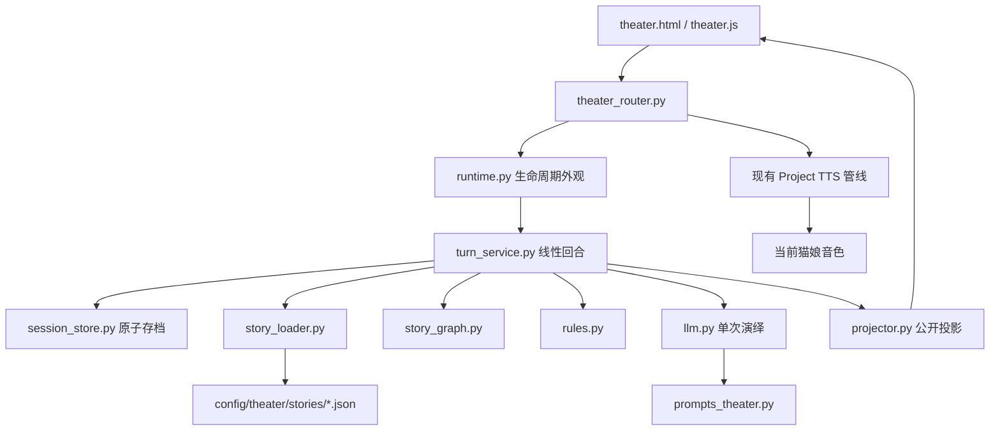
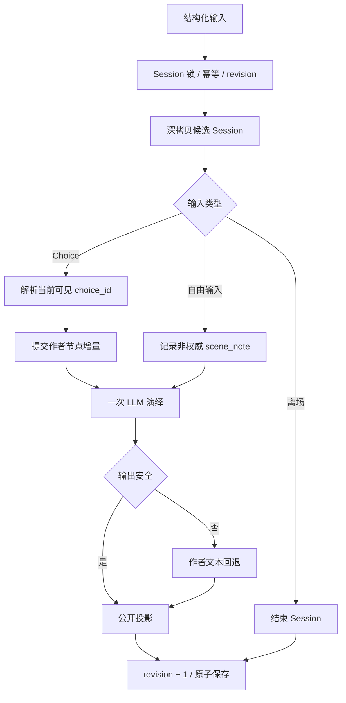

# N.E.K.O 小剧场轻量版功能实现与架构说明

## 1. 文档状态

本文描述瘦身分支当前真实代码。原 v2.3 的 30 模块重型架构已经退出运行主链，历史设计与删减原因参见：

- [`neko-theater-nsn-v2.3-scripted-gm-theater.md`](./neko-theater-nsn-v2.3-scripted-gm-theater.md)
- [`neko-theater-slimming-proposal.md`](./neko-theater-slimming-proposal.md)

当前产品范围是：一场演出只有玩家和玩家自己的猫娘；作者静态剧情保证故事可推进、可结束；大模型用一次调用生成旁白和猫娘对白；自由输入未命中剧情时自然回应并保持当前节点。

## 2. 当前架构



当前 `services/theater` 只有九个 Python 文件，其中 `__init__.py` 不承载业务逻辑。核心实现共 1,328 行。

## 3. 模块职责

| 模块 | 职责 |
|---|---|
| `runtime.py` | 列出故事、创建 Session、输入转交、公开恢复、活动 Session 恢复、管理结束和过期清理 |
| `turn_service.py` | 校验三类输入，在候选副本上执行 Choice、自由对话或离场，并完成幂等与 revision 提交 |
| `session_store.py` | 当前协议 Session 原子读写、旧存档隔离、角色 active 索引、同 Session 进程锁和 revision 读取 |
| `story_loader.py` | 统一加载 JSON 正式故事、执行轻量引用检查、选择场景和生成故事公开卡 |
| `story_graph.py` | 当前节点、静态出边、稳定 Choice 和行动/对白分类 |
| `rules.py` | 简单事实、道具、线索、flag、场景笔记、节点增量和确定性结局 |
| `llm.py` | 一次模型请求生成旁白与猫娘对白；超时、坏 JSON 或内部术语命中时回退作者文本 |
| `projector.py` | 生成 Scene、Board、Trace、Suggestions 和 Ending 的公开响应 |
| `__init__.py` | Python package 标记 |

外围文件：

| 文件 | 职责 |
|---|---|
| `main_routers/theater_router.py` | HTTP 入口、本地 mutation 保护、当前猫娘/私有目录解析，以及猫娘对白到现有 Project TTS 的窄桥接 |
| `config/prompts/prompts_theater.py` | 唯一结构化演绎 Prompt 和 World Contract 当前版边界 |
| `config/theater/stories/*.json` | 作者静态 Story Package |
| `templates/theater.html` | 单猫娘互动小说页面结构 |
| `static/js/theater.js` | 前端请求、恢复、重试、渲染和行动/对白提交 |
| `static/css/theater.css` | 舞台、Board、日志、Trace、Choice 和窄窗口布局 |
| `static/locales/*.json` | 八个 locale 的玩家可见文本 |

## 4. 当前 Story 协议

每份故事保留：

- `id / title / summary`；
- `background / theme / world_seed / restrictions`；
- `seed` 中的玩家身份、开场事实和禁止假设；
- `initial_scene_id / scenes`；
- `narrative_nodes / edges`；
- `ending_attractors`；
- 正式内置剧本的 `scenario_card`，包含 `brief / player_role / catgirl_role / primary_goal / rules`；加载器继续兼容尚未提供开场卡的外部轻量剧本；
- 可选 `stage_props / clues`。

节点主要字段：

| 字段 | 用途 |
|---|---|
| `node_id` | 稳定节点身份 |
| `belong_phase` | 映射表现层 Scene |
| `node_type` | 区分 seed、core 和 ending |
| `title / summary` | 作者剧情结果和离线旁白 |
| `preconditions` | required/forbidden facts |
| `runtime_generation_guide` | 给单次演绎模型的作者指令 |
| `scripted_dialogue` | 离线或安全回退对白 |
| `script_action` | 使用道具和公开线索 |
| `state_diff` | 作者声明的权威事实增量 |
| `suggestions` | 到达本节点的玩家行动或对白 |

Story Loader 当前检查必填字段、node ID 唯一、edge 引用和 setup 入口。

## 5. 轻量状态

`story_state` 只包含：

| 字段 | 说明 |
|---|---|
| `current_node_id` | 当前静态节点 |
| `completed_node_ids` | 已完成节点 |
| `narrative_facts` | 作者节点提交的结构化事实 |
| `available_prop_ids` | 当前出现的道具 |
| `used_prop_ids` | 已使用道具 |
| `clue_ids` | 已公开线索 |
| `flags` | 作者简单剧情标记 |
| `scene_notes` | 最近六条自由互动笔记，非权威状态 |
| `choice_label_overrides` | 当前节点 Choice 的临时上下文化文案，不改变 ID、目标和模式 |

`scene_notes` 只进入猫娘演绎上下文，不参与静态图可达性、道具、线索和结局判断。

Session 顶层携带 `schema_version=1`。没有该版本或版本不一致的旧重型存档不会进入轻量 Runtime，其 active 索引会在恢复或角色切换时清除。

## 6. 回合协议

| `input_kind` | 载荷 | 行为 |
|---|---|---|
| `choice` | `choice_id` | 推进到当前可见静态目标节点 |
| `free_input` | `message` | 始终角色回应并保持节点；只有 `choice_id` 可以提交作者剧情 |
| `user_exit` | 无 | 主动离场，不算作者剧情结局 |

所有请求必须携带 `client_turn_id`；重复 ID 回放首次响应。`base_revision` 防止旧窗口覆盖新剧情。

公开响应只保留前端真实消费的 `scene / board / trace / action_choices / dialogue_choices / ending` 等字段，不再重复返回旧协议的 `initial_scene / reply / suggestions`。HTTP 层也不再暴露单独的 `/session/end` 兼容接口；主动离场统一通过 `input_kind=user_exit`，角色切换和过期清理仍在 Runtime 内部结束 Session。

## 7. 一次回合



## 8. 单次模型边界

模型返回 `narration`、`dialogue` 和可选的 `choice_rewrites`。上下文包含当前猫娘短人格、故事背景、主题、作者限制、禁止假设、主线目标、当前场景、目标节点作者指令、公开道具/线索/笔记、最近公开对话和当前稳定 Choice。

`choice_rewrites` 只能引用当前可见 `choice_id` 并改写显示文案；服务端保留作者声明的模式、目标节点和 callback。模型不能新增或提交节点、Choice 身份、道具、线索、flag、事实、Ending、revision 或任意私有状态。进入新节点后，上一节点的文案覆盖立即清除。

当前版以作者静态状态为权威。最终版允许改写真相的能力，将来通过独立 World Contract 剧情补丁实现，不复用已经删除的 Overlay。

## 9. 前端体验

前端保留故事选择、舞台背景介绍、Scene、演出日志、轻量 Board、行动/对白选项、自由输入、公开 Trace、落幕/离场、Session 恢复、同请求体网络重试和 revision 冲突恢复。背景介绍嵌入棕色舞台，在开演前展示故事背景、玩家身份、猫娘身份与本剧目标；切换剧本和恢复 Session 时同步更新，开演后继续保留。新生成的猫娘对白会通过现有 Project TTS 自动朗读；旁白、玩家输入和恢复快照不触发朗读。

前端已经删除：

- Full/Economy 模式选择；
- Random Event 入口；
- Evidence 和 Questions 面板；
- Memory Candidate；
- GM Redirect 展示。

## 10. 猫娘对白 TTS

当前版本只为 `dialogue.text` 提供语音，不把 TTS 扩展成新的剧场编排模块：

1. `session/start` 和成功提交的新回合可以触发朗读；`session/state`、`session/active` 和 revision 冲突恢复只读快照，不重播上一句。
2. TTS 文本只能取自 Runtime 已保存公开快照中的当前 `dialogue.text`。前端不能提交任意朗读文本，避免把 theater 接口变成通用 TTS 代理。
3. Router 复用当前猫娘对应的 `LLMSessionManager.mirror_assistant_speech()` 和项目既有音色、供应商、音频下发链路，不创建第二套 TTS Worker，也不调用 `/api/game/*/speak` 或占用 game route state。
4. 调用固定使用 `mirror_text=false`、`emit_turn_end_after=false`，因此猫娘台词不会再次写入普通聊天气泡、普通聊天历史或普通聊天 turn-end。
5. 新对白使用新的 `speech_id` 并打断上一段剧场语音；离场或正式结局允许朗读本轮最后一句猫娘对白。
6. TTS 不可用、当前猫娘没有活动 `LLMSessionManager`、没有主窗口 WebSocket 或供应商失败时，文字演绎照常完成；语音是可降级的表现层能力，不能令剧情回合失败。
7. 同一 `session_id + state_revision` 只允许触发一次朗读；网络重试和幂等回放不得重复播报。
8. 该桥接只能读取公开对白、Session ID、revision 和当前猫娘名，不读取或外发隐藏线索、事实账本、Prompt、Board 私有字段或完整 theater Session。

TTS 调用顺序：

```text
剧情回合原子提交
  → Router 取得已提交的 session_id + state_revision
  → Runtime 认领该 revision 的公开 dialogue.text
  → 当前猫娘 LLMSessionManager
  → 现有 TTS Worker / 当前猫娘音色
  → 主应用既有音频 WebSocket 播放
```

## 11. 已删除的后端能力

- Anchor、Director、Narrator、Persona 四段串行编排；
- Runtime Graph Overlay 和 Dynamic Candidate；
- Random Engine；
- Entity Lifecycle；
- 独立 Evidence Engine；
- GM Redirect Anchor；
- Level 2 模型 Validator；
- State Preview/Rollback 多层状态机；
- Full/Economy 双执行链；
- 旧 Turn Coordinator、Turn Request 和 Turn Transaction 模块；
- 自动 Memory Fusion。

## 12. 测试边界

当前测试覆盖正式短篇《留给明天的那盘磁带》和二十八回合都市爱情剧本《在晚风重逢以前》的加载与完整通关；同时覆盖行动/对白分区、非权威自由笔记、Choice、自由回应、旧 Session 隔离、恢复、离场、幂等、revision、并发、单次模型协议、安全回退、八语言、Chromium 页面和跨页面资源隔离。TTS 增量测试还必须覆盖只朗读猫娘对白、同 revision 去重、恢复不重播、无 Session Manager 安静降级，以及不占用游戏 route。代码内置测试故事以及初遇、雨窗和星灯祭三份质量不达标剧本已经删除。

两份正式剧本还执行了“70% 自由输入 + 30% 推荐选项”的混合压力测试：短篇使用 16 次自由输入和 7 次选择，长篇使用 65 次自由输入和 28 次选择。自由输入包含正常交流、关系试探、未来战争和修仙渡劫等越界要求。测试确认自由输入不会改变当前节点、完成节点、权威事实、道具、线索、flag、Choice ID/目标或正式结局，两份故事均能按作者图落幕；显示文案可以根据刚发生的互动更新。

为防止高自由输入比例放大存档，Session 只保留最近 8 条模型上下文消息、最近 32 个幂等响应和最近 6 条非权威场景笔记。

随后使用当前配置的真实模型完整执行相同 70/30 序列，共生成 116 个演绎回合。两份剧本均按作者结局落幕，对未来战争和修仙要求也能留在原题材；但首轮发现自由输入仍会多次照抄刚播放的作者固定台词。根因是自由回合继续携带 `scripted_dialogue`，且最近上下文没有旁白动作。修复后，自由回合不再注入固定台词，最近上下文同时携带旁白与对白，并拒绝与上一条高度相似的长对白。第二轮完整复测中，两份剧本的相邻对白完全重复均降为零。

真实模型偶发故障仍可能触发离线回退，因此回退文案也改为自然留在眼前事件中，不再复述越界请求或使用“我会放在心上”。空旁白在纯角色互动回合属于协议允许行为，不应误报为剧情断裂。

真实模型和 Electron 主应用 smoke 仍由显式环境开关控制。

## 13. 后续扩展边界

只有当前版获得用户正向反馈后，才考虑 World Contract、受约束剧情补丁、动态支线安全重连、多角色槽位和多个猫娘人格分饰不同角色。这些能力必须作为独立扩展进入，不能重新把当前线性 Turn Service 膨胀成通用世界模拟器。
