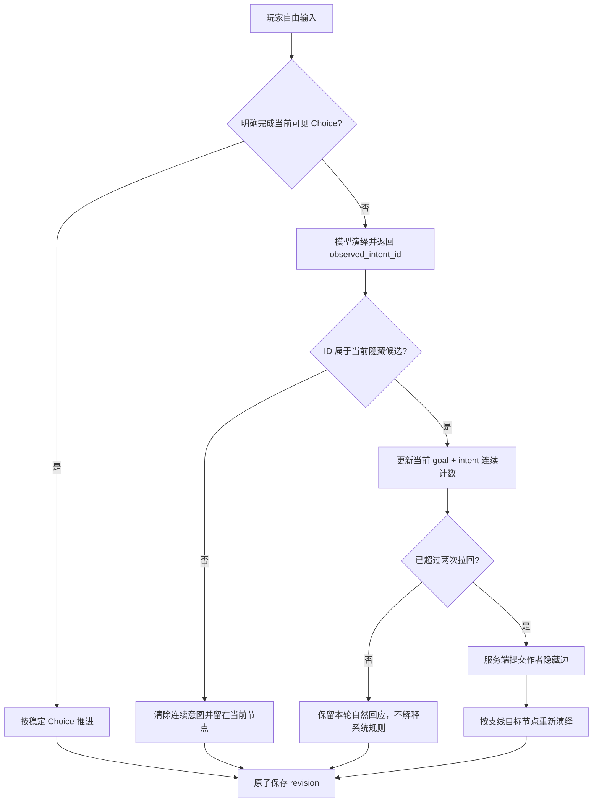
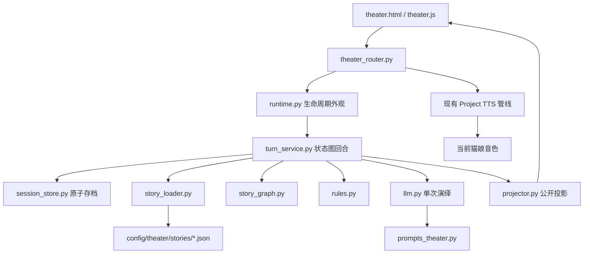
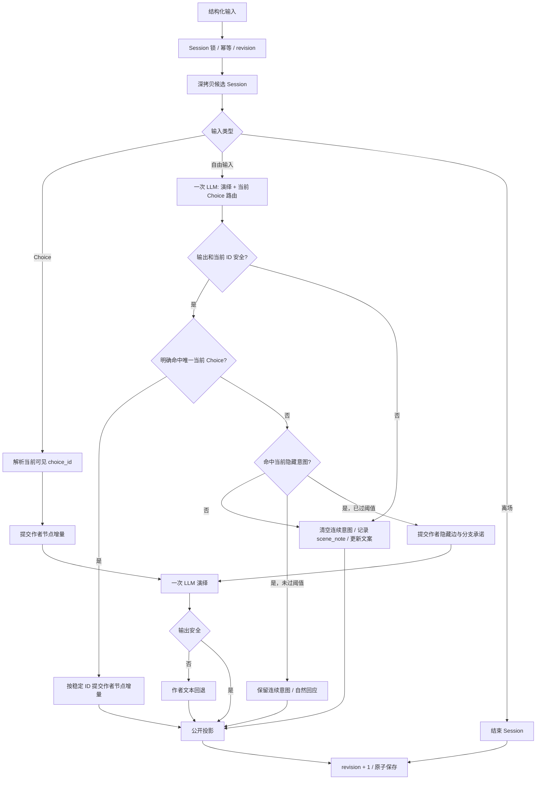

# N.E.K.O 小剧场 v2.4 功能实现与架构说明

## 1. 文档状态

本文记录 v2.4 的开发目标、实施顺序与当前真实代码。核心图协议、路由、正式剧本和直接回归已经落地；真实模型与 Electron smoke 仍按项目既有显式开关单独验收。原 v2.3 的 30 模块重型架构已经退出运行主链，删减原因参见：

- [`neko-theater-slimming-proposal.md`](./neko-theater-slimming-proposal.md)

v2.4 不恢复旧动态图，也不引入 Neo4j 等图数据库。现有 `narrative_nodes / edges` 继续承担叙事状态图，结构化事实继续承担事实层；新增能力只解决一个已复现问题：玩家必须点击推荐按钮或说出近似按钮文案才能推进，持续表达合理的图内意图也只能被困在当前节点。

## 2. v2.4 开发计划

### 2.1 产品目标

把当前“只有推荐按钮能够稳定推进”的线性体验改成“作者设置护栏的多叉路口”：

1. 推荐选项仍是玩家可见、最稳定的主线入口。
2. 作者可以在当前节点声明不显示按钮的隐藏语义边；自由输入命中这些边时，系统先让猫娘在当前场景自然回应，而不是立即把玩家送往下一幕。
3. 同一剧情目标内，玩家连续两次坚持同一图内意图时，猫娘可以自然回应并尝试收束；第三次仍坚持时，进入作者写好的支线节点。
4. 玩家更换话题后，旧意图计数清零；不同节点和不同目标的计数互不污染。
5. 系统外指令、越界题材、歧义输入和模型未知 ID 不得创建支线、修改事实或推进剧情。
6. 支线既可以延迟汇回主线，也可以到达不同结局；不同结局必须是玩家选择产生的有效叙事结果，不能作为“不听推荐”的惩罚。

### 2.2 技术边界

v2.4 在现有边对象上增加最小元数据，不新增第二套图协议：

| 字段 | 作用 |
|---|---|
| `visibility` | `recommended` 为玩家可见推荐边；`latent` 为只参与服务端自由输入路由的隐藏语义边 |
| `transition_id` | 作者声明的稳定边身份，用于 Trace、分支残留与测试，不由模型生成 |
| `goal_id` | 拉回次数所属的局部剧情目标；切换目标或节点后重新计数 |
| `intent_id` | 模型可返回的稳定图内意图 ID；只允许命中当前节点作者提供的候选 |
| `intent_summary / intent_examples` | 向模型说明什么语义属于该边，不作为玩家可见文案 |
| `pullbacks_before_transition` | 正式进入支线前允许留在当前节点回应的次数；本轮试点固定为 2 |

模型只新增输出 `observed_intent_id`。它负责从当前作者候选中判断玩家正在坚持哪个意图，不得返回目标节点、事实增量、结局或自由文本状态摘要。服务端校验 ID 后更新结构化计数，并在达到作者阈值时提交对应静态边。模型判断错误最多造成“停留或进入作者已有分支”，不能凭空写入世界事实。

`story_state` 新增以下服务端字段：

| 字段 | 作用 |
|---|---|
| `active_goal_id` | 当前正在观察的局部剧情目标 |
| `focused_intent_id` | 当前连续表达的作者意图 |
| `intent_streak` | 同一目标、同一意图的连续命中次数 |
| `goal_pullback_count` | 已经消耗的留在当前节点回应次数，不超过作者阈值 |
| `branch_commitment` | 已正式进入的隐藏边 ID，供汇流节点保留支线余波 |

这些字段是路由状态，不是角色知识，不能进入猫娘台词、推荐按钮或玩家可见规则说明。

### 2.3 回合顺序



可见 Choice 优先于隐藏意图，避免一句话同时像“接受主线”又像“继续闲聊”时由模型改变作者主线。隐藏意图第一次和第二次出现时，猫娘只根据眼前输入自然回应；第三次才丢弃旧节点生成稿，应用作者静态状态增量，并用目标节点重新生成当轮演出，避免出现“第二轮才回应第一轮”的错位。

### 2.4 《约会清单最后一项》试点

试点放在 `node_honest_observation` 的暴雨段落：

1. 原有前往 `node_false_victory` 的推荐边保持不变。
2. 新增“暂停处理清单，继续询问彼此印象”的隐藏语义边。
3. 玩家连续表达同一意图三次后进入“把话说慢一点”的支线中心；前两次猫娘可以回答、迟疑或尝试回到眼前事件，但不得宣读“两次拉回”“隐藏边”等玩法规则。
4. 支线中心提供两种作者选项：继续谈完并在环境变化后延迟汇入屋顶主线；或暂不确认关系，约定明天不用清单再见。
5. 第二条路径进入“温暖但未完成”的不同结局：双方确认彼此重要，但把正式告白留到明天。它不是失败结局，也不否定玩家此前的交流。
6. 汇流节点必须读取已经提交的支线事实，在对白中保留刚才谈过彼此印象的余波，不能假装支线从未发生。

### 2.5 实施顺序

1. 更新 Story Loader 与图查询：校验边可见性和隐藏语义元数据；推荐列表过滤隐藏边；提供当前隐藏候选解析。
2. 更新状态与 Turn Service：保存目标级连续意图；可见 Choice 优先；两次停留、第三次提交；节点切换时清理局部计数并保留分支承诺。
3. 更新模型协议：Prompt 只提供当前隐藏候选，解析器只接受白名单 `intent_id`；内部路由规则与公开演绎上下文隔离。
4. 更新正式剧本：增加暴雨支线中心、延迟汇流节点和替代结局，不改动原十五步主线的可通关性。
5. 增加回归测试：结构校验、隐藏边不显示、连续意图计数、换意图清零、未知 ID 保守停留、第三次进入支线、支线汇流和替代结局。

### 2.6 完成标准

v2.4 只有同时满足以下可观察结果才算完成：

- 页面仍只显示作者的推荐选项，不泄露隐藏边、意图 ID、目标 ID、计数或内部规则。
- 点击推荐按钮和自然语言明确完成推荐项时，结果与 v2.3 当前主线一致。
- 同一图内意图连续输入一次、两次时节点不变；第三次进入作者支线，并在当轮回应本轮输入。
- 中途切换成普通聊天、不同意图或系统外请求后，不沿用先前计数。
- 模型返回未知意图 ID、坏 JSON 或不可用时，不推进、不写事实，并继续使用现有安全回退。
- 支线可选择汇回主线或进入替代结局；两条路径都能到达合法 Ending，且已经发生的支线事实不会在汇流后消失。
- 现有单元、集成、前端和混合输入回归通过；真实模型与 Electron smoke 仍按项目已有显式开关执行，未运行时必须明确说明。

## 3. 当前架构



当前 `services/theater` 只有九个 Python 文件，其中 `__init__.py` 不承载业务逻辑。核心实现共 1,328 行。

## 4. 模块职责

| 模块 | 职责 |
|---|---|
| `runtime.py` | 列出故事、创建 Session、输入转交、公开恢复、活动 Session 恢复、管理结束和过期清理 |
| `turn_service.py` | 校验三类输入，在候选副本上执行显式 Choice、自然语言命中、目标级隐藏意图、自由对话或离场，并完成幂等与 revision 提交 |
| `session_store.py` | 当前协议 Session 原子读写、旧存档隔离、角色 active 索引、同 Session 进程锁和 revision 读取 |
| `story_loader.py` | 统一加载 JSON 正式故事、校验节点引用与隐藏边元数据、选择场景和生成故事公开卡 |
| `story_graph.py` | 当前节点、推荐边、隐藏语义边、稳定 Choice 和行动/对白分类 |
| `rules.py` | 简单事实、道具、线索、flag、场景笔记、局部意图计数、节点增量和确定性结局 |
| `llm.py` | 一次模型请求生成旁白与猫娘对白；超时、坏 JSON 或内部术语命中时回退作者文本 |
| `projector.py` | 生成 Scene、Board、Trace、Suggestions 和 Ending 的公开响应 |
| `__init__.py` | Python package 标记 |

外围文件：

| 文件 | 职责 |
|---|---|
| `main_routers/theater_router.py` | HTTP 入口、本地 mutation 保护、当前猫娘/私有目录解析，以及猫娘对白到现有 Project TTS 的窄桥接 |
| `config/prompts/prompts_theater.py` | 唯一结构化演绎 Prompt 和 World Contract 当前版边界 |
| `config/theater/stories/*.json` | 作者静态 Story Package |
| `templates/theater.html` | 单猫娘互动小说页面结构 |
| `static/js/theater.js` | 前端请求、恢复、重试、渲染和行动/对白提交 |
| `static/css/theater.css` | 舞台、Board、日志、Trace、Choice 和窄窗口布局 |
| `static/locales/*.json` | 八个 locale 的玩家可见文本 |

## 5. 当前 Story 协议

每份故事保留：

- `id / title / summary`；
- `background / theme / world_seed / restrictions`；
- `seed` 中的玩家身份、开场事实和禁止假设；
- `initial_scene_id / scenes`；
- `narrative_nodes / edges`；
- `ending_attractors`；
- 正式内置剧本的 `scenario_card`，包含 `brief / player_role / catgirl_role / primary_goal / rules`；加载器继续兼容尚未提供开场卡的外部轻量剧本；
- 可选 `stage_props / clues`。

节点主要字段：

| 字段 | 用途 |
|---|---|
| `node_id` | 稳定节点身份 |
| `belong_phase` | 映射表现层 Scene |
| `node_type` | 区分 seed、core 和 ending |
| `title / summary` | 作者剧情结果和离线旁白 |
| `preconditions` | required/forbidden facts |
| `runtime_generation_guide` | 给单次演绎模型的作者指令 |
| `scripted_dialogue` | 离线或安全回退对白 |
| `script_action` | 使用道具和公开线索 |
| `state_diff` | 作者声明的权威事实增量 |
| `suggestions` | 到达本节点的玩家行动或对白 |

Story Loader 当前检查必填字段、node ID 唯一、edge 引用和 setup 入口。

边的 `visibility` 缺省为 `recommended`，兼容现有轻量故事。`latent` 边必须声明唯一 `transition_id`、局部 `goal_id`、当前节点内唯一 `intent_id`、`intent_summary`、非空 `intent_examples` 和非负整数 `pullbacks_before_transition`；缺失或歧义会在 Story Loader 阶段拒绝加载。

## 6. 轻量状态

`story_state` 只包含：

| 字段 | 说明 |
|---|---|
| `current_node_id` | 当前静态节点 |
| `completed_node_ids` | 已完成节点 |
| `narrative_facts` | 作者节点提交的结构化事实 |
| `available_prop_ids` | 当前出现的道具 |
| `used_prop_ids` | 已使用道具 |
| `clue_ids` | 已公开线索 |
| `flags` | 作者简单剧情标记 |
| `scene_notes` | 最近六条未命中 Choice 的自由互动笔记，非权威状态 |
| `choice_label_overrides` | 当前节点 Choice 的临时上下文化文案，不改变 ID、目标和模式 |
| `active_goal_id` | 当前连续意图所属的局部剧情目标 |
| `focused_intent_id` | 当前连续命中的作者意图 |
| `intent_streak` | 同一目标、同一意图的连续命中次数 |
| `goal_pullback_count` | 已消耗的当前目标停留回应次数 |
| `branch_commitment` | 已正式进入的隐藏边 ID，跨汇流节点保留 |

`scene_notes` 只进入猫娘演绎上下文，不参与静态图可达性、道具、线索和结局判断。局部意图字段只参与服务端隐藏边路由，不进入角色知识或公开投影；任何节点推进都会清空局部计数，但保留已经提交的 `branch_commitment`。

Session 顶层携带 `schema_version=1`。没有该版本或版本不一致的旧重型存档不会进入轻量 Runtime，其 active 索引会在恢复或角色切换时清除。

## 7. 回合协议

| `input_kind` | 载荷 | 行为 |
|---|---|---|
| `choice` | `choice_id` | 推进到当前可见静态目标节点 |
| `free_input` | `message` | 明确完成唯一当前 Choice 时优先推进；否则可更新当前作者隐藏意图，超过拉回阈值后进入静态支线；普通聊天保持节点 |
| `user_exit` | 无 | 主动离场，不算作者剧情结局 |

所有请求必须携带 `client_turn_id`；重复 ID 回放首次响应。`base_revision` 防止旧窗口覆盖新剧情。

公开响应只保留前端真实消费的 `scene / board / trace / action_choices / dialogue_choices / ending` 等字段，不再重复返回旧协议的 `initial_scene / reply / suggestions`。HTTP 层也不再暴露单独的 `/session/end` 兼容接口；主动离场统一通过 `input_kind=user_exit`，角色切换和过期清理仍在 Runtime 内部结束 Session。

## 8. 一次回合



## 9. 模型协议与目标节点重演

模型返回 `narration`、`dialogue`、`matched_choice_id`、`observed_intent_id` 和可选的 `choice_rewrites`。上下文包含当前猫娘短人格、故事背景、主题、作者限制、禁止假设、主线目标、当前场景、公开道具/线索/笔记、最近公开对话、当前稳定 Choice，以及当前节点作者隐藏意图的稳定 ID 与语义说明。内部候选与公开演绎上下文分区保存，模型不得把路由规则转述成台词。

`matched_choice_id` 只能引用当前可见 Choice。玩家明确说出唯一当前对白，或明确实施唯一当前行动时可以命中；询问原因、评价、否定、假设、未来打算、歧义和图外行动都必须保持节点。模型不可用、输出坏 JSON 或返回未知 ID 时同样保守停留。

`observed_intent_id` 只能引用当前隐藏候选，并与 `matched_choice_id` 互斥；可见 Choice 命中具有优先权。服务端只接受白名单 ID，自己读取作者目标、阈值和 callback。第一次、第二次命中保留本轮演出；第三次命中会丢弃基于旧节点生成的文本，先提交目标节点，再执行一次目标节点演绎，从而当轮回应玩家而不是晚一轮。

未命中 Choice 的自由互动必须为每个当前可见 `choice_id` 返回一项 `choice_rewrites`，不能把实时更新当作可选增强。新标签必须承接本轮玩家输入和猫娘回应，并删除已被询问、说出、实施或否定的过时修饰语；例如玩家已经询问照片为何保留，按钮不得继续显示“不追问她为何留着”。服务端仍保留作者声明的模式、目标节点和 callback。模型不能新增或提交节点、Choice 身份、道具、线索、flag、事实、Ending、revision 或任意私有状态。自然语言命中后由服务端重新解析稳定 Choice、提交作者节点并清除上一节点的文案覆盖，与点击按钮共用同一权威状态链。

当前版始终以作者静态状态为权威。模型动态创建节点或改写真相仍不在 v2.4 范围内，未来若引入 World Contract 剧情补丁，也不能复用已经删除的 Overlay。

## 10. 前端体验

前端保留故事选择、舞台背景介绍、Scene、演出日志、轻量 Board、行动/对白选项、自由输入、公开 Trace、落幕/离场、Session 恢复、同请求体网络重试和 revision 冲突恢复。背景介绍嵌入棕色舞台，在开演前展示故事背景、玩家身份、猫娘身份与本剧目标；切换剧本和恢复 Session 时同步更新，开演后继续保留。舞台折叠时只隐藏背景介绍和状态，当前 `theater-scene-text` 继续显示在紧凑栏并由每轮公开响应更新，避免玩家失去剧情阶段提示。新生成的猫娘对白会通过现有 Project TTS 自动朗读；旁白、玩家输入和恢复快照不触发朗读。

前端已经删除：

- Full/Economy 模式选择；
- Random Event 入口；
- Evidence 和 Questions 面板；
- Memory Candidate；
- GM Redirect 展示。

## 11. 猫娘对白 TTS

当前版本只为 `dialogue.text` 提供语音，不把 TTS 扩展成新的剧场编排模块：

1. `session/start` 和成功提交的新回合可以触发朗读；`session/state`、`session/active` 和 revision 冲突恢复只读快照，不重播上一句。
2. TTS 文本只能取自 Runtime 已保存公开快照中的当前 `dialogue.text`。前端不能提交任意朗读文本，避免把 theater 接口变成通用 TTS 代理。
3. Router 复用当前猫娘对应的 `LLMSessionManager.mirror_assistant_speech()` 和项目既有音色、供应商、音频下发链路，不创建第二套 TTS Worker，也不调用 `/api/game/*/speak` 或占用 game route state。
4. 调用固定使用 `mirror_text=false`、`emit_turn_end_after=false`，因此猫娘台词不会再次写入普通聊天气泡、普通聊天历史或普通聊天 turn-end。
5. 新对白使用新的 `speech_id` 并打断上一段剧场语音；离场或正式结局允许朗读本轮最后一句猫娘对白。
6. TTS 不可用、当前猫娘没有活动 `LLMSessionManager`、没有主窗口 WebSocket 或供应商失败时，文字演绎照常完成；语音是可降级的表现层能力，不能令剧情回合失败。
7. 同一 `session_id + state_revision` 只允许触发一次朗读；网络重试和幂等回放不得重复播报。
8. 该桥接只能读取公开对白、Session ID、revision 和当前猫娘名，不读取或外发隐藏线索、事实账本、Prompt、Board 私有字段或完整 theater Session。

TTS 调用顺序：

```text
剧情回合原子提交
  → Router 取得已提交的 session_id + state_revision
  → Runtime 认领该 revision 的公开 dialogue.text
  → 当前猫娘 LLMSessionManager
  → 现有 TTS Worker / 当前猫娘音色
  → 主应用既有音频 WebSocket 播放
```

## 12. 已删除的后端能力

- Anchor、Director、Narrator、Persona 四段串行编排；
- Runtime Graph Overlay 和 Dynamic Candidate；
- Random Engine；
- Entity Lifecycle；
- 独立 Evidence Engine；
- GM Redirect Anchor；
- Level 2 模型 Validator；
- State Preview/Rollback 多层状态机；
- Full/Economy 双执行链；
- 旧 Turn Coordinator、Turn Request 和 Turn Transaction 模块；
- 自动 Memory Fusion。

## 13. 测试边界

当前只内置一份正式剧本《约会清单最后一项》。原十五步推荐主线保持不变；v2.4 使用十九个节点、十九条边和两个结局承载暴雨隐藏支线、延迟汇流与替代结局。此前的《留给明天的那盘磁带》和《今夜，轮到我们署名》已从 `config/theater/stories` 删除，不再作为产品内容或测试夹具。当前测试覆盖剧本加载、完整主线、隐藏边不公开、目标级连续意图、换话题清零、未知 ID 白名单、第三次进入支线、支线汇流、替代结局、行动/对白分区、非权威自由笔记、恢复、离场、幂等、revision、并发、模型协议、安全回退、八语言、Chromium 页面和跨页面资源隔离。

当前正式剧本继续执行“70% 自由输入 + 30% 推荐选项”的主线路径压力测试。普通交流、关系试探和越界要求在没有命中当前作者隐藏意图时不会改变节点、权威事实、道具、线索、flag 或结局；只有当前白名单意图连续超过作者阈值，才会进入作者静态支线。明确命中可见 Choice 的自然语言与点击提交仍共享同一权威状态链，模型故障时不会猜测推进。

为防止高自由输入比例放大存档，Session 只保留最近 8 条模型上下文消息、最近 32 个幂等响应和最近 6 条非权威场景笔记。

旧剧本阶段曾使用真实模型完成 70/30 演绎回归，并据此修复自由输入照抄作者固定台词、最近上下文缺少旁白动作和故障回退误接越界请求的问题；这些运行时修复继续由协议测试保护，但已删除的旧故事不再作为当前内容依据。新剧本的真实模型完整长跑仍由显式环境开关控制，未运行时不得沿用旧统计声称已经完成。

本地 Codex 剧本创作规范位于 `/Users/mac/.codex/skills/neko-theater-story-writer/`。Skill 固定的是当前运行时边界：仅玩家与当前猫娘两位直接发言的主角、作者节点控制权威推进、Story Package 字段和验证流程；它不固定恋爱、悬疑、喜剧等风格与主题。新增或重写剧本时先完成概念锁、弹性节拍表和双主角能动性检查，再转换为 JSON 节点图。

真实模型偶发故障仍可能触发离线回退，因此回退文案也改为自然留在眼前事件中，不再复述越界请求或使用“我会放在心上”。空旁白在纯角色互动回合属于协议允许行为，不应误报为剧情断裂。

真实模型和 Electron 主应用 smoke 仍由显式环境开关控制。

v2.4 当前 Python 小剧场回归结果为 `136 passed, 3 skipped`。通过项包含 Story、Runtime、模型协议、TTS、前端资源隔离与 Chromium 页面；三项跳过均来自项目原有的真实模型显式开关，不得表述为已经完成真实模型长跑。

## 14. 后续扩展边界

v2.4 只实现作者声明的静态隐藏边与局部意图计数。World Contract、模型动态创建节点、运行时改写真相、多角色槽位和多个猫娘人格分饰不同角色仍不在本版范围内；这些能力若未来进入，必须作为独立扩展，不能重新把 Turn Service 膨胀成通用世界模拟器。
