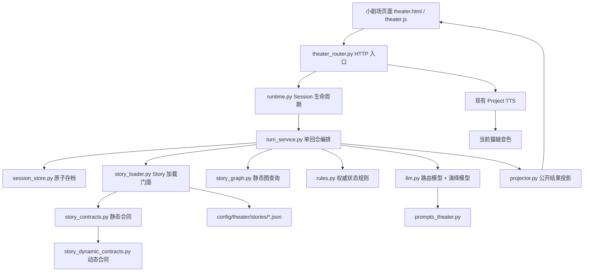
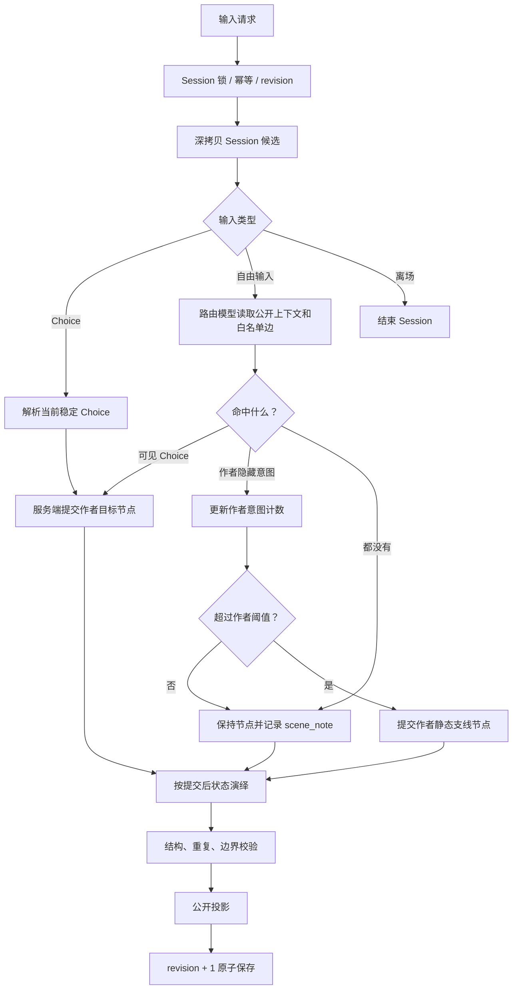
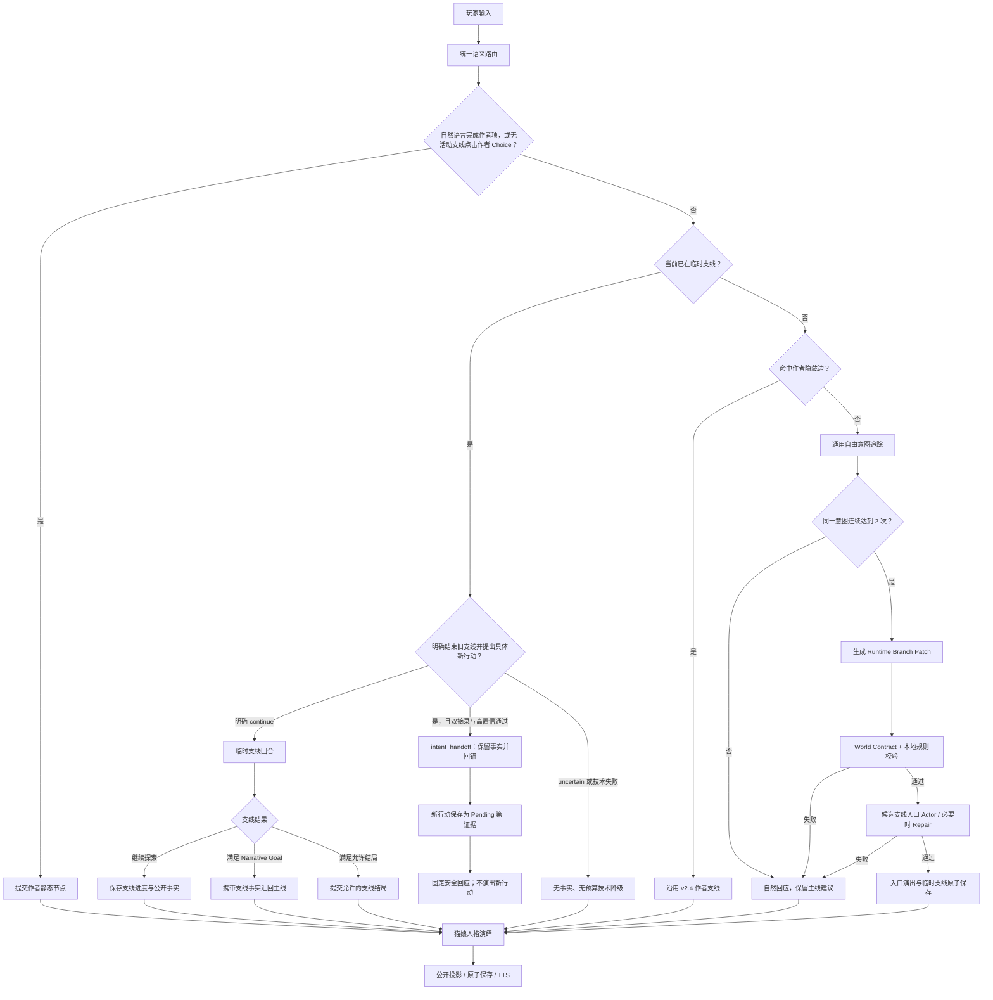

# N.E.K.O 小剧场 v2.7 功能设计与架构说明

## 1. 文档状态

本文同时说明四件事：

1. **v2.4 历史基线**：以作者静态剧情图为权威，支持推荐选项、自然语言命中和作者预设隐藏支线。
2. **v2.5 已完成基线**：在 v2.4 稳定主干上增加受约束的运行时临时支线，让玩家连续坚持未预设的合理行动时，剧情能够围绕该行动继续发展。
3. **当前工作区可验证的 v2.6 基线**：已经依次收口意图连续性、技术降级语义、完整回合观测、统一事实读取、活动支线新意图转交、上下文完整性、内部字段隔离、离线叙事评测、动态内容 Catalog、可恢复 Session 休眠、Story 作者真源、公开投影边界和 Session 私有模型返回记录；尚未完成的真实模型人工复核、正式 Story Catalog 决策与长期锁数据仍按 v2.6 完成声明保留。
4. **v2.7 当前设计**：综合 SillyTavern、rekallhalo 与 Thriller 中经源代码或原始参考文档核实后适合小剧场的部分，把开发重点从“还能创建多少分支”转向“猫娘是否真正回应玩家本轮输入、是否允许在当前场景深入探索、推荐项是否表达意图，以及支线结果是否留下可感知涟漪”。

为避免其他开发者或大模型把计划误认成现状，本文使用以下状态：

| 标记 | 含义 |
|---|---|
| **[现有]** | v2.4、v2.5 或当前 v2.6 基线已经具备，v2.7 继续沿用 |
| **[已实现]** | 当前工作区已经具备，可从运行链和测试中验证 |
| **[v2.7 设计]** | 产品与架构方向已经确认，但代码、测试或真实运行验证尚未开始 |
| **[开发中]** | 已进入明确实施范围，但尚未完成全部代码与验证 |
| **[后续]** | 方向成立，但必须在数据、独立设计或前置能力收敛后实施 |
| **[不采纳]** | 与产品边界冲突、当前代码已解决，或缺少事实依据 |

本文是 v2.7 的功能设计、后续实施和交接依据。v2.6 既有代码、测试、真实模型长跑与 Electron 验证结果只能证明对应旧行为，不能替代 v2.7 的因果回应、垂直钻探或涟漪汇流验收。最终事实始终以当前代码、测试、Session 演绎记录、显式人工复核和 Electron 运行结果为准。

v2.7 初始基线轮只建立完整设计文档；当前已进入分阶段实现。下文每项能力仍须按对应代码、测试与运行证据分别标记，不能因为文档已经完整就提前写成“已实现”。

### 1.1 跨版本长期开发门禁

v2.7 及以后所有小剧场版本无条件继承长期架构文档的[“跨版本开发规范与改动范围硬约束”](./neko-theater-architecture.md#23-跨版本开发规范与改动范围硬约束)。版本号变化、新建开发文档、目录重构、开发者或开发工具更换，都不能让该约束失效；未来版本文档必须继续引用并声明继承，不能静默删除、弱化或绕过。修改约束本身同样需要用户明确确认。

所有涉及小剧场的开发——代码、Story、Prompt、配置、脚本、测试、文档、UI、i18n 和资源——都必须先读取并遵守当前工作区的 [`neko-guide.md`](../../.agent/rules/neko-guide.md)；上游公开版本见 [Project N.E.K.O / neko-guide.md](https://github.com/Project-N-E-K-O/N.E.K.O/blob/main/.agent/rules/neko-guide.md)。实施时以当前工作区文件为直接规范来源，不能用旧摘录或模型记忆代替。

本版本默认只允许修改小剧场自身的内容、运行时、Session、API、独立页面、舞台资源、TTS 窄桥、角色 Session 隔离及其直接测试和文档。Live2D、VRM、MMD、角色模型表情/动作/口型/视觉恢复、首页与普通聊天、全局音频/WebSocket、通用窗口或多显示器策略均不因“小剧场需要当前角色”而自动进入范围。小剧场自己的 UI、主题和舞台背景属于小剧场范围，应与角色模型表现明确区分。

若某项实现确需触及上述范围外内容，必须在修改前列出代码证据、文件清单、必要性、跨链路影响、范围内替代方案和回退方式，并等待用户针对该项明确确认。没有确认不得修改；用户只说“继续”、版本更替或旧计划曾提及，都不算授权。发现误改时先按 diff 或操作记录精确恢复越界部分，再继续范围内工作，不能用宽范围回退破坏其他小剧场改动或用户已有修改。

v2.3 重型框架的删减背景参见：

- [`neko-theater-slimming-proposal.md`](./neko-theater-slimming-proposal.md)

## 2. 一句话理解小剧场

N.E.K.O 小剧场是一套只有“玩家”和“当前活跃猫娘”直接说话的互动叙事系统。

作者提供故事世界、主线目标、关键因果和可结束范围；服务端保存已经真实发生的剧情状态；大模型负责理解玩家自由输入，并用当前猫娘的人格演出这一回合；前端只展示已经提交成功的公开结果。

v2.5 的核心变化是：

> 推荐选项从“唯一能推进剧情的门票”变成“稳定的主线建议”。玩家连续坚持一个符合当前世界、但作者没有提前写成按钮的行动时，系统可以生成一段受约束、可恢复、能汇流或结束的临时支线。

v2.6 的核心变化是：

> 不再把“相邻两轮说法相同”误当成“玩家坚持”的唯一证据，也不再把模型或合同故障误算成玩家没有推进；活动支线中的新行动只有在玩家明确要求结束当前支线后才进入受约束转交，普通转折继续由当前 Branch Actor 承接；同时用完整回合指标衡量玩家真正等待的时间，而不是用单次模型调用耗时代替端到端体验。

v2.7 的核心变化是：

> 不再把玩家自由度主要等同于“生成更多剧情分支”。普通回合必须先对玩家本轮输入作出明确、可感知、与已知事实一致的回应；只要没有产生新的权威事实，玩家可以围绕当前人物、物件、关系、疑问和已经发生的事件继续“垂直钻探”，不必先命中按钮或激活 Runtime Branch Patch。推荐项继续提供稳定主线方向，但应表达玩家意图与态度；只有真正改变剧情状态的行动，才进入作者静态节点或受 World Contract 约束的临时支线。

## 3. 产品目标与边界

### 3.1 v2.5 产品目标

1. 玩家可以用自然语言实施推荐行动，不必逐字复述按钮。
2. 玩家可以围绕当前场景自由聊天，猫娘必须优先回应本轮输入。
3. 玩家连续两次坚持同一个合理的图外意图时，系统默认在第二次进入围绕该意图生成的临时支线。
4. 临时支线已经公开发生的物品、行动和关系结果可以成为权威事实，后续剧情不能遗忘或反向否定。
5. 临时支线完成当前剧情功能后，可以带着结果自然汇回作者主线；若玩家选择造成有效分歧，也可以进入作者允许的支线结局域。
6. 推荐选项继续存在，但只提供可执行方向，不向玩家解释路由、计数、世界契约或系统规则。
7. Session 刷新、网络重试、窗口恢复和 TTS 继续保持幂等，不能因为引入动态支线破坏当前稳定底座。

### 3.2 必须保持的叙事边界

1. 一场演出只有玩家与当前活跃猫娘两位直接发言者。
2. 猫娘只能依据眼前观察、玩家已经说过的话、已公开事实和已建立共同记忆回应，不能读取玩家内心或未来剧本。
3. 旁白只描述环境、事件和可见动作，不能替玩家决定心理、动机或未输入的行动。
4. 关系升级、身体接触、承诺和关键秘密必须经过公开铺垫、双方行动与适当同意。
5. 模型不能绕过服务端直接写 Session、revision、正式事实、Ending 或静态故事文件。
6. 支线不是对“不点推荐按钮”的惩罚；不同结局必须来自玩家选择造成的有效叙事后果。
7. 后续正式剧本由用户提供；当前内置剧本只作为兼容性与端到端测试夹具，不定义框架默认题材、物品、关系或剧情节奏。
8. 通用运行时与 Prompt 只能消费 Story Package 的规范字段，禁止按当前剧本的 `story_id`、节点、Choice、关键词或固定文案增加特殊分支；内容专属规则必须写回对应 Story Package。

### 3.3 v2.5 明确不做

1. 不引入 Neo4j 或其他图数据库。
2. 不恢复 v2.3 的 Runtime Graph Overlay、Dynamic Candidate、多对象 Overlay Plan 或四阶段模型编排。
3. 不建设多 NPC 调度、多猫娘同场扮演或通用世界模拟器。
4. 不让每句闲聊都自动变成长期事实。
5. 不允许玩家一句无关输入立即改写世界真相、人物身份或故事类型。
6. 不要求前端展示“已偏离一次”“正在生成支线”等破坏沉浸感的系统说明。
7. 不在第一次图外意图时投机预生成 Patch；是否需要预生成只能在真实 P95、成本和废弃率证明确有必要后另行评估。
8. 不跨 Session 或跨玩家复用完整 Runtime Branch Patch；只允许复用 schema、Prompt 模板和作者静态素材。
9. 不在 Session 原子提交前向前端流式展示角色对白、支线旁白或动态事实。
10. 不把校验失败的 Patch 自动改绑到其他 Narrative Goal 或 Ending Domain；失败必须保守停留，不猜测作者意图。

### 3.4 用户剧本通用性开发硬约束

后续正式剧本来自用户，框架不能把当前内置剧本当成默认世界。该约束高于单个示例跑通、短期模型效果和局部测试便利性，所有 v2.5 代码审查均须逐项确认：

1. 通用运行时、Prompt、Projector 和前端只能读取 Story Package schema、当前 Session、公开事实与稳定公共接口，不得读取“当前剧本是谁”后切换专用逻辑。
2. 禁止在通用代码中匹配当前内置剧本的 `story_id`、节点 ID、Choice ID、角色名、物品名、地点名、关键词、固定台词或剧情顺序；把这些内容换成另一份合法 Story Package 后，框架行为仍应成立。
3. 当前内置剧本只允许出现在三类位置：Story Package 内容本身、明确标注为示例的设计文档、端到端或兼容性测试夹具。示例不得反向成为运行时协议。
4. 某个用户剧本确实需要的新能力，必须先抽象成有明确语义和校验规则的通用 schema，再至少用两份题材或结构不同的 Story Package 证明它不是单剧本特化；否则留在该剧本内容层。
5. 前端不得按剧本专门增加 DOM 分支、选择器、颜色、固定按钮或剧情提示。选剧接口只接收标题、稳定背景、角色身份、不剧透目标和初始 Scene；演出接口再按当前状态提供 Scene、作者 Choice、道具、线索和已验证动态公开实体。生成约束不得进入选择页。
6. 框架级回归必须保留“扫描通用运行时中是否出现当前剧本专属标记”的守门测试；新增功能若必须引用测试剧本内容，只能在对应 fixture 或测试断言中引用。
7. 性能优化同样受此约束：缓存键、检索索引、Prompt 裁剪和回退路径必须基于 schema、revision、Goal、事实类型或稳定引用，不能按现有剧情用词建立捷径。

### 3.5 v2.6 多模型点评采纳结论

本节记录对 `/Users/mac/Desktop/各模型点评.rtf` 的逐项核实结果。点评只提供调查线索，不能直接成为实现依据；每个采纳项都必须能在当前代码、测试或真实运行指标中找到证据。

| 点评方向 | 结论 | v2.6 处理 |
|---|---|---|
| 静态事实与动态事实形成长期双轨 | **已按安全边界采纳** | 已实现统一只读 Fact View：读取 `narrative_facts`，并按 `completed_goal_ids` 追加 Narrative Goal 的作者 `completion_fact_projections`。不合并存储，也不让模型生成的原始 Branch Fact 三元组直接命中静态规则。 |
| `streak=2` 容易被自然问答或短暂闲聊打断 | **采纳** | 首批把一次 idle 从“立即清除”改为有界休眠；只有明确继续、细化或替换才改变支持证据，休眠本身不增加次数。 |
| 长对话中同一意图可能因中间闲聊被过早遗忘 | **采纳为有界修正** | 首批只允许同节点的一次 idle 进入休眠，连续第二次 idle、节点变化或明确替换仍会清理；不引入无限期语义记忆，也不让休眠态自行触发 Planner。 |
| Pending Intent 与普通自由意图争抢调度 | **修正后采纳** | 当前调度顺序是确定的，不存在两条路径随机竞争；真实问题是复合输入后仍可能要求玩家表达第三次。首批允许合法 Pending 在下一轮明确确认时提供前一条证据，但 Pending 单独仍不能激活支线。 |
| Router 拆分复合输入是静默故障点 | **已建立持续评测入口** | 保留自然语言复合输入和现有严格字段、长度与低置信拒绝边界，不要求玩家使用分隔符。阶段十增加跨题材合成人工金标和精确结构评分；默认 CI 只验证数据与评分器，真实准确率仍须显式运行模型后报告。 |
| 三层锁全程包住慢模型并导致全局死锁 | **不按原描述采纳** | 实际只有 `session_guard` 覆盖完整回合，`character_guard` 在提交前获取，异步锁不会阻塞整个事件循环；但同 Session 的锁等待问题成立。首批先记录完整回合和锁等待，后续再决定是否引入 Pending Turn 与锁外模型调用。 |
| 安全回退生硬且会破坏沉浸 | **已按无权威上下文收口** | Router 技术故障继续不冒充真实 idle；普通/入口/活动支线与 handoff 回退现在只使用有界公开 Scene 标题、合同已验证的行动方向、合法 History 是否存在和“是否已有已提交进展”的布尔语义，不复述任意玩家原话、不新增事实、不代做下一步，也不消耗支线预算。 |
| Opaque Choice 会出现失效或幻觉 ID | **不按原描述采纳** | 当前稳定 ID 由服务端从 `branch_id + beat_id` 派生，提交时会重验并拒绝旧 ID；无需重做 ID。Actor 台词与按钮语义对齐仍列后续评测。 |
| 活动支线期间提出新意图可能被现有支线吞没 | **已按显式转交边界采纳** | 活动支线自由输入新增独立 `branch_handoff` 轻量分类。只有玩家同时明确结束当前支线、提出具体新行动，两个逐字摘录均能由服务端在本轮原话中验证且置信度达到严格阈值时，才以 `intent_handoff` 关闭旧支线；普通转折继续交给 Branch Actor，不引入支线栈或嵌套 Patch。 |
| 内容槽没有 Schema 与测试 | **核实后补齐可选严格模式** | 原有 Loader 只能证明槽位引用和 traits 外形，不能证明具体物件语义。阶段十一采用作者有限 Catalog：作者目录成员以 `content_id` 绑定 Patch、Fact、提交和恢复；无 Catalog 的旧 Story 保持兼容，但作者诊断固定标为 `declarative_only`，不得宣称已完成语义证明。 |
| 支线被作者 Choice 中断没有状态机 | **不采纳** | 当前已有 `author_choice` 退出码、事实保留、History 与预算不消耗规则，不重复建设。 |
| 恢复中的“可安全关闭”标准含糊 | **部分采纳** | 当前代码已有 branch ID、作者锚点、revision、Patch 与事实结构检查；后续把判定矩阵补进长期架构文档，并评估损坏 Patch 下事实来源解释是否充分。 |
| 模型职责过度拆分导致支线入口延迟 | **采纳为数据驱动项** | 现有指标只聚合单次模型调用，不能证明玩家端等待。首批增加端到端回合指标；没有数据前不合并 Router 与 Planner。 |
| 作者创作门槛过高、通用性只对当前题材成立 | **已完成首个零模型工具入口** | 新增显式单文件 Story 校验、脱敏稳定原因码、内容槽合同解释和三种无关题材 Catalog 夹具；不扫描正式 Story 目录、不修文件、不调用模型或网络。模拟 Patch 仍可在后续按同一工具边界扩展。 |
| 测试重工程契约、轻叙事质量 | **已完成首版评测底座与输出安全收口** | 阶段十建立带人工金标的路由、事实记忆、按钮一致、人格和汇流评测；机械项与人工项严格分开，人格、对白—按钮自然衔接和汇流自然度在人工审核前固定为 `human_review_pending`，不能用关键词或无模型 auto-pass 代替。阶段十三进一步拒绝报告覆盖 dataset/observations，并以原子写入和稳定脱敏错误保护评测输入。 |
| 背景介绍与生成约束混在 `scenario_card.brief / rules`，框架又补造 Choice、结局和作者对白 | **采纳并完成作者真源收口** | 阶段十四把 `background` 定为唯一公开背景，选剧接口只下发初始 Scene 和结构化公开身份；Loader 拒绝重复 brief/rules、缺失 Choice 字段、坏阶段、非结局死路和隐式结局；开场与静态节点对白原样采用作者文本，静态 Choice 不再接受模型改写；Branch Fact 在提交门再次拒绝作者禁止假设和不可变事实冲突。 |
| 24 小时 Session 静默结束 | **已完成可恢复休眠基础** | 阶段十二把 24 小时无提交改为独立 `dormant`：不写 `ended_at`、不覆盖 `updated_at`、不改剧情或活动索引，成功新回合才原子唤醒；真正归档仍需历史列表与显式恢复入口，不能用清除 active 指针冒充。 |
| 应扩成任意世界模拟与任意结局 | **不采纳** | 与作者权威、双人演出和受约束临时支线的产品定义冲突。v2.6 改善表达自由与反馈，不把小剧场改成通用世界模拟器。 |

### 3.6 v2.6 首批实现范围与成功标准

首批只修改通用服务层、Prompt、开发文档和直接测试，不修改 Story 内容、前端、i18n、TTS 或 Electron 链路：

1. **端到端回合观测**：记录完整 `submit` 耗时、Session 锁等待、稳定场景和固定结果枚举；报告和通用 instrument 都不得包含玩家原话、Story、Prompt、模型全文或角色名。
2. **短期意图线程**：一次普通 idle 只让当前意图休眠，不增加证据；休眠超过固定上限、节点变化、明确替换或作者路径推进才清除。旧 Session 缺少 v2.6 辅助字段时按中性默认读取，不改 revision。
3. **Pending 二次确认**：复合输入创建的合法 Pending 仍不能单独激活支线；Router 返回的摘录必须能由服务端在本轮规范化玩家原话中逐字找到，否则不创建 Pending。玩家在目标节点下一轮明确确认同一语义后，这条已核验摘录与本轮原话构成两条服务端证据，可以当轮进入 Planner。
4. **技术降级隔离**：模型未配置、超时、坏格式 Repair 失败、演绎护栏拒绝或 Fact 合同整组拒绝时，可以公开无事实安全回应并增加 revision，但 `turns_used / nonprogress_turns` 保持不变，Branch Fact、Goal 和 Ending 也不改变。
5. **兼容与回归**：玩家真实闲聊或询问而没有新事实时仍属于叙事非推进回合，继续按作者预算计数；相同 `client_turn_id` 重试不得重复增加证据或任何预算，并在完整事务指标中单列为幂等回放，不能混入正常成功样本。

### 3.7 v2.7 三方参考采纳结论

本节整理三类外部参考，但只吸收经过官方仓库源文件或参考文档核实、并且符合 N.E.K.O 双人演出与作者权威边界的方法。外部项目不是本项目事实源；本文不复制其代码，不把其产品宣传当成已经验证的运行时能力，也不因概念相似而引入新的通用世界模拟器。

核对快照如下：

| 来源 | 核对分支与提交 | 在本次评估中的角色 |
|---|---|---|
| [SillyTavern](https://github.com/SillyTavern/SillyTavern/tree/8172dcd0ee672d3cd9a5e5f7af134f91a45cd2b8) | `release@8172dcd0ee672d3cd9a5e5f7af134f91a45cd2b8` | 成熟角色聊天产品的自由输入、上下文预算、历史锚点与演出聚焦交互 |
| [rekallhalo](https://github.com/Idun/rekallhalo/tree/c0785a9152234ec6d253aaf66d3877d1dc0fd0ac) | `main@c0785a9152234ec6d253aaf66d3877d1dc0fd0ac` | AI 互动小说的 Choice/Text 双入口、回合因果记录、章节蓝图与结构化多模态输出 |
| [Thriller](https://github.com/pajama-studio/thriller/tree/d23889c3bb4c835e530612451a7979fdba42c3de) | `main@d23889c3bb4c835e530612451a7979fdba42c3de` | 互动叙事写作方法、玩家能动性、垂直钻探、选择设计与涟漪汇流 |

总取舍如下：

| 来源 | 可吸收进小剧场 | v2.7 落点 | 明确不吸收 |
|---|---|---|---|
| SillyTavern | 自由输入作为主要互动表面；按相关性与预算选择上下文；只读历史锚点；舞台和对话优先的聚焦界面 | 回合因果回应合同、后续事实检索预算、Branch History 索引和现有舞台布局 | 提交后的 Swipe 重生成、编辑历史、从旧消息任意分叉覆盖当前现实、大量可拖拽扩展面板 |
| rekallhalo | Choice/Text 双入口；每段结果记录 `causedBy`；当前章节目标与节奏上下文；不同记忆职责分层 | 玩家输入—回应因果包、作者 Scene/Goal/Beat 上下文、上下文职责分层 | God Mode、导演式预设事件、模型直接改写全部记忆与好感度、字数达标即完成章节、任意版本切换和历史改写 |
| Thriller | 演员模式；意图型 Choice；Accept/Reject/Deflect 覆盖思路；垂直钻探；汇流三层写法；涟漪模型；可达性与一致性检查 | 玩家控制权说明、Choice 写作规范、普通回合深入探索、汇流差异保留、作者诊断与人工验收 | QBN/Storylet 通用运行时、任意变量表达式、五种拓扑运行时切换、固定选择率/内容倍率/节点字数硬门禁 |

#### 3.7.1 从 SillyTavern 吸收：自由输入优先与上下文按需进入

SillyTavern 对 v2.7 最重要的启发不是界面皮肤，而是“用户消息本身就是本轮最重要的叙事事件”。小剧场据此采用以下设计：

1. 玩家自由输入先进入猫娘的直接回应义务，再判断它是否完成作者 Choice、延续活动支线或形成新的状态改变意图；路由结果不能成为忽略玩家提问、提及物件或表达态度的理由。
2. 推荐 Choice 是低门槛的主线建议，不是唯一允许发生的动作。玩家没有点按钮时，猫娘仍要围绕本轮输入继续演出；只有需要提交新事实时才进入静态图或动态支线合同。
3. 当 Branch Fact、Branch History 和公开对话增长到全量注入不再安全时，按当前 Goal、玩家本轮涉及的公开实体、事实类型和稳定引用选择上下文，并同时设置比例预算和绝对 token 上限。检索结果只能影响模型上下文，不能获得事实提交权。
4. `branch_history / return_anchor / revision` 可以继续作为只读历史锚点，帮助解释支线从哪里开始、产生了什么结果和如何汇回；它们不能成为玩家覆盖当前 Session 的任意回滚入口。
5. Visual Novel 式聚焦只吸收“舞台、角色、当前对白和输入优先”的信息层级，不照搬 SillyTavern 的密集聊天布局、扩展面板或皮肤体系。

SillyTavern 的 Swipe、历史编辑和旧消息分叉适合开放式聊天创作，但会破坏小剧场已提交事实、TTS、revision 和单一现实，因此继续列为 **[不采纳]**。

#### 3.7.2 从 rekallhalo 吸收：回合因果包、蓝图上下文与记忆分层

rekallhalo 的 [`types.ts`](https://github.com/Idun/rekallhalo/blob/c0785a9152234ec6d253aaf66d3877d1dc0fd0ac/types.ts)、[`geminiService.ts`](https://github.com/Idun/rekallhalo/blob/c0785a9152234ec6d253aaf66d3877d1dc0fd0ac/services/geminiService.ts) 和 [`useGameEngine.ts`](https://github.com/Idun/rekallhalo/blob/c0785a9152234ec6d253aaf66d3877d1dc0fd0ac/hooks/useGameEngine.ts) 把自由文本与 Choice 汇入同一推进函数，并以 `causedBy` 把新 Story Segment 绑定到触发它的玩家输入。v2.7 吸收其因果可读性，但不照搬前端状态权威：

1. 每个成功回合都应形成一个可复盘的“输入—路由—回应—事实候选—提交结果”因果包。现有 `client_turn_id`、revision、公开回合记录和 Session 私有 `llm_return_records` 继续作为基础；v2.7 需要补足“本轮必须回应的玩家语义焦点”及其来源证明，不能只保存模型全文后依靠人工猜测。
2. 玩家语义焦点只能来自本轮完整原话中的可验证摘录或服务端已经确认的当前 Choice，不得由模型补造。它可以是明确问题、被提及的公开物件、玩家正在实施的动作、对猫娘的态度或要求继续深挖的既有事件。
3. rekallhalo 的章节蓝图应映射到现有作者 `Scene / Narrative Goal / Beat / Ending Domain`，只向 Actor 提供当前演出需要的目标、张力和边界；不新增“达到字数、触发次数或互动次数就自动完成章节”的平行判定。
4. rekallhalo 的“即时上下文、近期摘要、长期记忆、核心事实、人物记录、物品清单”只作为职责分层参考。N.E.K.O 继续使用当前公开对话、Scene、Fact View、Branch History、Board 与 Story 作者字段；模型生成的记忆摘要不能直接成为核心事实、库存或关系数值。

God Mode、导演式 Scheduled Events、模型自报好感变化、任意回溯生成平行宇宙和提交后的正文版本切换都改变了玩家角色和权威状态语义，继续列为 **[不采纳]**。

#### 3.7.3 从 Thriller 吸收：演员模式、垂直钻探与涟漪汇流

Thriller 的 [`reader-agency.md`](https://github.com/pajama-studio/thriller/blob/d23889c3bb4c835e530612451a7979fdba42c3de/interactive-fiction/references/reader-agency.md)、[`choice-design.md`](https://github.com/pajama-studio/thriller/blob/d23889c3bb4c835e530612451a7979fdba42c3de/interactive-fiction/references/choice-design.md)、[`interactive-prose.md`](https://github.com/pajama-studio/thriller/blob/d23889c3bb4c835e530612451a7979fdba42c3de/interactive-fiction/references/interactive-prose.md)、[`narrative-convergence.md`](https://github.com/pajama-studio/thriller/blob/d23889c3bb4c835e530612451a7979fdba42c3de/interactive-fiction/references/narrative-convergence.md) 和 [`advanced-if.md`](https://github.com/pajama-studio/thriller/blob/d23889c3bb4c835e530612451a7979fdba42c3de/interactive-fiction/references/advanced-if.md) 主要属于写作方法，不是生产运行时。v2.7 按以下边界吸收：

1. 玩家采用“演员模式”：作者决定世界真相、角色过去、关键因果和允许的结局域；玩家决定自己说什么、做什么、相信什么、如何回应和愿意把当前关系推进到什么程度。玩家不是能直接改写世界历史的导演。
2. “垂直钻探”优先于无止境横向分支。玩家可以围绕同一公开事件，从事实、情感、动机、矛盾、缺席信息和既有物件等角度继续追问；只要没有新事实需要提交，普通 Actor 就应承接，不创建 Patch。
3. Choice 文案表达意图与态度，而不只描述机械动作。Accept/Reject/Deflect 只用来检查一个社交选择点是否覆盖了不同合理姿态，不要求每轮固定显示三个按钮，也不阻止玩家输入第四种做法。
4. 每个有意义的选择至少要产生即时可感知回应；少数选择继续产生短期态度差异、后续 Choice 差异或长期结局影响。不同层级的影响必须分别落在公开演出、已提交支线事实/History 和作者 Goal/Ending 投影中，不能都由模型对白冒充。
5. 汇流采用三层写法：所有路径共享的必要主线事件、根据已提交事实生成的条件差异、对玩家此前行动的简短回顾。汇流可以回到同一作者节点，但不能抹掉玩家选择产生的具体方式和关系余波。
6. 可达节点、非结局死路、无限循环、结局条件和所需前置信息继续由确定性 Story 工具检查；是否动人、Choice 是否形成真正两难、回应是否自然、汇流是否保留情感重量仍需人工或显式真实模型评审，不能由默认零模型评分器代填。

QBN、Storylet 池、任意变量表达式、运行时拓扑切换和固定内容倍率会重新制造动态候选池、状态组合爆炸或 v2.3 式重框架，继续列为 **[不采纳]**。未来若某个 Story 需要 Storylet，只能先证明它是作者内容组织方式，而不是第二套运行时事实系统。

### 3.8 v2.7 设计范围与成功标准

v2.7 首批只收敛“玩家输入是否被真正承接”和“同一场景能否自由深入”，不以增加模型阶段、数据库、通用世界模拟或任意回滚换取表面自由。

#### 3.8.1 [v2.7 设计] 回合因果回应合同

1. 现有 Router 在不增加一次模型调用的前提下，提供一个有界的本轮回应焦点：焦点类型、来自本轮原话的逐字摘录或当前 Choice 身份，以及是否可能要求状态变化。
2. 服务端必须验证自由输入焦点确实来自完整玩家原话；截断输入、补造摘录、旧回合摘录或模型自行概括成新事实时，焦点无效并走现有安全路径。
3. 普通 Actor、入口 Actor 和 Branch Actor 都接收当前职责允许看到的回应焦点，并先在公开对白中承接它，再处理主线提醒、支线进度或 Choice 建议。
4. Actor 可以返回内部“已承接焦点”引用供诊断，但该自报不具备事实权威，也不能单独证明叙事质量。确定性测试只证明焦点没有在调用链丢失；真实是否回应仍由 Session 模型返回、最终公开对白和人工复核共同判断。
5. 若玩家同时执行作者 Choice 并提出剩余问题，作者动作可以正常提交，但剩余问题必须作为同回合回应义务或现有 `residual_intent` 进入下一节点，不能因静态推进而静默消失。

#### 3.8.2 [v2.7 设计] 普通回合垂直钻探

普通 Actor 可以在不写事实的前提下：

- 回答关于当前公开物件、环境、猫娘态度和刚才对白的问题；
- 根据已公开事实解释猫娘自己的观察、犹豫、偏好或计划；
- 从不同角度重新审视已经发生的事件；
- 对玩家的接受、拒绝、质疑、玩笑、沉默和转移话题作出人物化反应；
- 提醒仍存在的主线建议，但不得用提醒代替回应。

普通 Actor 不能：

- 宣布玩家没有输入的动作已经发生；
- 新增未公开人物、物件、关系承诺、秘密、伤害或结局；
- 把“讨论一个行动”写成“已经完成该行动”；
- 仅因玩家提到新名词就创建 Runtime Branch Patch；
- 通过旁白读取玩家内心或替玩家决定动机。

当玩家持续实施会改变权威状态的图外行动时，继续复用 v2.6 双证据、Planner、World Contract、Branch Fact 和 Goal/Ending 链，不为垂直钻探建设第二套事实系统。

#### 3.8.3 [v2.7 设计] Choice 与自由输入协同

1. 静态 Choice 继续由 Story 作者提供并保持原文，不交给模型重写。
2. 作者 Skill 后续增加意图型 Choice、知情选择、无明显最优项、即时反馈和合理姿态覆盖检查；这些属于作者指导与人工审查，除长度、身份、目标和可达性等机械项外，不升级为 Loader 硬门禁。
3. 动态 Choice 继续绑定已验证 Patch Beat 和服务端稳定身份；公开文案应表达玩家可执行的意图，不泄露 Goal、Fact、预算或内部动作合同。
4. Choice 不得垄断互动。玩家始终可以用自由输入接受、拒绝、细化、转移、询问或提出另一种合理做法。
5. 不规定每回合必须有两个或三个选项；选项数量由作者剧情功能和当前可执行状态决定。

#### 3.8.4 [v2.7 设计] 涟漪与三层汇流

1. **即时涟漪**：猫娘本轮对白明确回应玩家刚才的输入。
2. **短期涟漪**：后续若干回合可以从近期公开对话、活动 Branch Fact 或当前 Branch History 引用玩家的具体做法和猫娘态度。
3. **长期涟漪**：只有作者 Goal 的 `completion_fact_projections`、正式静态事实或 Ending Domain 结果进入长期权威视图。
4. 汇流正文按“共同主线事件—条件差异—选择回顾”组织；作者中性 callback 保证模型失败时仍可汇回，Actor 只根据已验证事实增加人物化差异。
5. 大多数普通聊天的短期涟漪可以自然衰减，不能把每句闲聊写入永久事实；核心选择的长期影响必须由 Story 明示。
6. 受预算约束的事实检索仍为数据驱动 **[后续]**：只有 Branch Fact/History 的规模、召回错误与 token 数据证明全量上下文已成为问题时才实施。

#### 3.8.5 v2.7 明确不做

1. 不建设多 NPC 调度、多猫娘同场或任意世界模拟器。
2. 不增加 QBN/Storylet 通用池、图数据库、运行时拓扑切换或任意变量表达式。
3. 不加入 God Mode、玩家导演事件队列、全局剧情查找替换或可见精确好感度。
4. 不允许提交后 Swipe、正文重生成、历史编辑或从旧 revision 覆盖当前 Session。
5. 不让模型直接写核心记忆、库存、关系数值、章节完成或 Ending。
6. 不根据字数、对话轮数、关键词或情绪猜测自动完成 Scene/Goal。
7. 不新建独立“回应检查模型”；首批必须复用现有 Router/Actor/Repair 职责和完整回合观测。
8. 不为三个外部项目建立兼容层，也不复制它们的 UI、代码或数据结构。
9. 不把 Thriller 的经验数字变成默认评分阈值，不扩大当前零模型评测器去猜人格、自然度或情感重量。
10. 不把 v2.7 文档完成写成代码完成。

#### 3.8.6 v2.7 可观察成功标准

1. 玩家提到当前场景中的“伞”等公开物件并提出问题时，猫娘同回合明确回应该物件或问题，不能只继续原主线台词。
2. 玩家围绕既有事实追问原因、情绪、矛盾或遗漏时，普通 Actor 可以连续承接，而不因没有点击 Choice 被判定为无效输入。
3. 玩家只是讨论、询问或设想一个动作时，不提交该动作已经发生的事实。
4. 玩家连续实施图外状态改变行动时，仍按 v2.6 双证据和合同链进入临时支线，不被普通聊天无限拖住。
5. 静态 Choice 原文、目标和 callback 保持作者权威；自由输入可以表达按钮之外的合理态度和方法。
6. 每个成功模型回合可以用 `client_turn_id + revision` 定位玩家输入、回应焦点、原始模型返回、最终公开回应和事实提交结果；这些私有诊断信息不进入 Projector。
7. 支线汇流后的对白能够提到已验证的具体完成方式，过时 Choice 消失，但共同主线继续推进。
8. 任何玩家未输入的心理、动机和动作都不能由第二人称旁白擅自决定。
9. 三份题材和关系结构不同的 Story 共同证明上述规则不依赖当前内置剧本的角色名、物件名、节点或关键词。
10. 机械链路由自动化测试证明；是否真正回应、Choice 是否自然、汇流是否有情感重量由显式真实模型记录和人工复核证明，二者不得互相冒充。
11. v2.7 新增行为在真实 Electron 窗口中验证输入、演绎日志、TTS 和按当前角色恢复 Session，不以浏览器静态 DOM 代替桌面验收。

## 4. 核心名词

| 名词 | 通俗解释 |
|---|---|
| Story Package | 作者写好的故事 JSON，包含背景、场景、节点、边、选项、道具、线索和结局 |
| Scene | 玩家可见的剧情阶段卡；一个 Scene 可以覆盖多个叙事节点 |
| Node | 一个已经发生后可以提交状态的作者剧情节点 |
| Edge | 从当前节点到目标节点的可达关系 |
| Choice | 玩家可见的作者推荐行动或对白，使用稳定 `choice_id` |
| Author Latent Edge | 作者预先写好、但不显示按钮的隐藏语义边 |
| Narrative Goal | 一个剧情段落必须完成的功能，例如“双方完成礼物交换”，不把具体实现写死为某件物品 |
| Free Intent | 玩家没有完成当前 Choice，但持续表达的合理行动目的，例如“我就想送黑色墨水” |
| Pending Intent | 状态已经推进或活动支线已经显式回锚后，仍待在目标节点重新确认的短期剩余行动意图；它本身不拥有支线激活权限 |
| World Contract | 作者声明的动态创作边界，规定允许新增什么、禁止改变什么、可以去往哪些结果 |
| Runtime Branch Patch | 大模型提出、服务端校验后保存在当前 Session 内的临时支线方案 |
| Branch Fact | 临时支线中已经公开发生并经服务端确认的事实 |
| Branch History | 已结束支线的结构化索引，只引用关键事实、完成目标和退出方式，不替代权威事实 |
| Convergence | 支线完成某个 Narrative Goal 后，带着真实结果重新接回作者主线 |
| Ending Domain | 作者允许动态支线抵达的结局类型范围，不是模型任意发明结局 |

## 5. v2.4 历史运行基线

本节记录 v2.5 开发开始时的 **[现有]** 能力，用于解释哪些底座被保留；v2.5 当时新增的职责以第 7、8、14 节为准，v2.6 增量以第 3.5、3.6 节以及阶段七至阶段十二为准。

### 5.1 总体结构



### 5.2 当前模块职责

| 模块 | 当前职责 |
|---|---|
| `runtime.py` | 列出故事、创建和恢复 Session、转交输入、认领已提交对白、结束与闲置休眠 |
| `turn_service.py` | 保留唯一锁内事务与总状态机，在候选 Session 上编排普通作者图推进、最终重验、因果记录、revision、幂等和原子保存 |
| `turn_request_contracts.py` | 规范化回合输入，派生事务结果/执行面，校验玩家原话证据，并提供幂等回放和 revision 冲突响应 |
| `turn_history.py` | 合成静态图补充对白，维护最近四轮公开消息和统一毫秒时间戳 |
| `turn_branch_flow.py` | 在候选 Session 内执行支线转交、技术降级、续演、收束、进入和主动退出，不获取锁或保存 Session |
| `session_store.py` | Session 原子读写、活动 Session 索引、同 Session/同角色锁、旧版本隔离 |
| `story_loader.py` | 加载 Story JSON，提供严格 ID 查找、公开投影、Scene 查询、单文件校验入口和旧公开路径兼容导出 |
| `story_contracts.py` | 校验 Story 根结构、Scene、静态节点、作者 Choice、边、setup、全图可达性与可达结局，并保持原校验顺序和错误语义 |
| `story_dynamic_contracts.py` | 校验成组 v2.5 合同、Narrative Goal、World Contract、可选事实投影、Catalog 与 Ending Domain |
| `story_graph.py` | 查询当前节点、可见推荐边、作者隐藏边、Choice 和自然语言作者完成表达 |
| `fact_view.py` | 只读合并静态事实与已完成 Goal 的作者事实投影，稳定去重且不修改 Session |
| `rules.py` | 应用节点事实、道具、线索、flag、局部隐藏意图计数，并用统一 Fact View 判断静态门禁和确定性结局 |
| `llm.py` | 本地定义六个模型入口、统一发送器、模型配置和观测顺序，保持既有 monkeypatch、调用次数、timeout 与 token budget |
| `llm_response_contracts.py` | 校验 Router、handoff、Planner 与 Actor 的结构化输出、回应焦点和唯一 JSON，并生成稳定技术降级结果 |
| `llm_performance_guard.py` | 检查内部引用、未提交 Choice 抢跑、作者输出护栏、人格/同意边界和近期对白重复 |
| `llm_fallbacks.py` | 提供不提交事实、不替玩家行动的普通、支线入口、活动支线和意图转交安全回退 |
| `llm_context.py` | 有限投影玩家原话、公开历史、支线召回、作者事实和当前猫娘人格摘要 |
| `projector.py` | 把私有 Session 投影为前端可见的 Scene、Board、Trace、Choice 和 Ending |
| `theater_router.py` | HTTP 接口、本地写入保护、当前猫娘校验，以及已提交对白到 TTS 的窄桥接 |

### 5.3 当前 HTTP 入口

| 接口 | 用途 |
|---|---|
| `GET /api/theater/stories` | 纯读取获取安全故事卡；不触发 24 小时扫描或任何 Session 生命周期写入 |
| `POST /api/theater/session/start` | 为当前猫娘创建新演出或替换旧活动演出 |
| `POST /api/theater/session/input` | 提交 Choice、自由输入或主动离场 |
| `GET /api/theater/session/state` | 读取指定 Session 已提交公开快照 |
| `GET /api/theater/session/active` | 恢复当前猫娘尚未结束的活动 Session |

### 5.4 当前 Story Package

当前故事由以下部分组成：

- `id / story_revision / title`：故事稳定身份、版本和公开标题；
- `background`：选择页唯一稳定背景介绍；正式发布 Story 必须写成单段电影式剧情简介，按 `len(background.strip())` 计算为 350–500 个 Unicode 字符，交代世界、双主角处境、触发事件、升级压力、双方方法冲突与未决悬念，不混入生成规则、系统语言或剧透结局；
- `summary / theme / world_seed`：作者内部摘要、主题和模型世界上下文，不进入选剧接口；
- `restrictions`：仅供服务端与模型执行的作者边界，不进入选择页；
- `runtime_guardrails`：禁止输出模式，以及在指定事实成立前持续生效的关系和动作硬边界；
- `seed`：玩家身份、开场事实和禁止假设；
- `scenario_card`：可选公开角色卡；存在时只包含玩家角色、猫娘角色和不剧透的公开目标，`brief / rules` 属于重复或越界字段，Loader 直接拒绝；
- `opening_dialogue`：作者可直接播放的正式开场对白，不经模型改写；
- `initial_scene_id / scenes`：服务端完整阶段集合；选剧接口只公开作者指定的 `initial_scene`，演出中只公开当前 Scene；
- `narrative_nodes / edges`：作者静态剧情图；
- `stage_props / clues`：道具和公开线索；
- `ending_attractors`：正式结局条件。

节点主要字段：

| 字段 | 当前用途 |
|---|---|
| `node_id` | 稳定节点身份 |
| `belong_phase` | 决定当前展示哪个 Scene |
| `node_type` | `seed`、`core`、`branch` 或 `ending` |
| `title / summary` | 作者定义的节点结果和离线旁白依据 |
| `preconditions` | 进入目标节点前需要或禁止的事实 |
| `runtime_generation_guide` | 演绎模型使用的作者意图和边界 |
| `scripted_dialogue` | 除 seed 外必填的正式作者节点对白；模型可读取它帮助生成旁白，但静态图推进时不能替换正文 |
| `script_action` | 使用道具、公开线索 |
| `state_diff` | 进入节点时提交的作者权威事实 |
| `suggestions` | 进入本节点的玩家行动或对白 |

当前图有一个容易误读、但必须理解的规则：

> 当前节点 A 的出边指向目标节点 B；玩家在 A 演出结束后看到的 Choice，来自 B 的 `suggestions`。选择后先执行该 Choice 的 callback，再演出并提交 B。

因此，B 的 Choice 中出现的人、地点、物品和动作，必须已经在 A 的公开演出中被介绍。

### 5.5 当前推荐边与作者隐藏边

`edges.visibility` 缺省为 `recommended`：

- `recommended`：生成玩家可见的推荐 Choice；
- `latent`：不显示按钮，只作为自由输入路由器的作者白名单候选。

作者隐藏边必须提前写好：

- `transition_id`；
- `goal_id`；
- `intent_id`；
- `intent_summary / intent_examples`；
- `pullbacks_before_transition`；
- 静态目标节点和 callback。

当前模型只能返回作者给出的 `intent_id`。没有对应隐藏边的话，无论玩家把同一合理要求说多少次，都不会形成新支线。

### 5.6 当前 Session 和权威状态

Session 顶层保存：

- `session_id / story_id / lanlan_name`；
- `schema_version / state_revision`；
- `phase / story_state`；
- 最近公开对话 `turns`；
- 最近幂等响应 `turn_results_by_client_id`；
- 仅供服务端单局复盘的私有模型返回 `llm_return_records`；
- `public_snapshot`；
- 开始、更新时间和结束时间；
- 已认领的对白朗读 revision。

`story_state` 当前包含：

| 字段 | 当前含义 |
|---|---|
| `current_node_id` | 当前已提交作者节点 |
| `completed_node_ids` | 已完成作者节点 |
| `narrative_facts` | 作者节点提交的结构化事实 |
| `available_prop_ids / used_prop_ids` | 当前可用和已使用道具 |
| `clue_ids / flags` | 已公开线索和作者标记 |
| `scene_notes` | 最近六条自由互动笔记，不是正式剧情事实 |
| `choice_label_overrides` | 仅为旧 Session 残留字段；当前运行时忽略并在下一次可保存回合清除，不再属于功能协议 |
| `active_goal_id / focused_intent_id` | 当前作者隐藏边的局部目标和意图 |
| `intent_streak / goal_pullback_count` | 作者隐藏意图的连续命中和停留次数 |
| `branch_commitment` | 已进入的作者隐藏边身份 |

权威状态原则：

1. 模型输出不是状态。
2. 只有服务端接受的 Choice、作者节点增量或规则提交才会改变正式事实。
3. `scene_notes` 可以帮助模型承接对话，但不能单独解锁节点、道具、线索或结局。
4. 前端只读取 `public_snapshot`，不能自行推断剧情已经发生。

### 5.7 当前输入和回合顺序

支持三种输入：

| `input_kind` | 行为 |
|---|---|
| `choice` | 使用当前可见 `choice_id` 推进静态图 |
| `free_input` | 尝试自然语言命中当前 Choice 或作者隐藏边；否则留在当前节点对话 |
| `user_exit` | 主动离场，不算作者结局 |

所有输入都携带 `client_turn_id`；同一 ID 只提交一次。`base_revision` 防止旧窗口覆盖更新后的剧情。



### 5.8 当前两阶段模型协议

自由输入通常经历两个职责隔离的模型阶段：

1. **路由阶段**：读取故事背景、当前 Scene、公开事实、最近对话、玩家本轮原话、当前 Choice 和作者隐藏候选；v2.4 基线返回 `matched_choice_id` 与 `observed_intent_id`，v2.5 已把后者更名为 `authored_intent_id`，旧名仅在服务端读取侧兼容过渡数据。
2. **演绎阶段**：读取服务端已经确定的状态；角色互动与动态支线可生成受约束的 `narration / dialogue`，静态图推进只采纳模型旁白并原样使用作者 `scripted_dialogue`。兼容字段 `choice_rewrites` 必须为空且不会取得按钮权限。

路由模型不能写台词，演绎模型不能提交节点。这样可以避免猫娘说“腕带已经戴好”，但后台仍停在“是否戴腕带”的旧状态。

模型失败时：

- 路由失败：保守留在当前节点，不猜测推进；
- 演绎失败：静态图使用作者 summary 与 scripted dialogue；角色互动或动态支线只使用不提交事实的技术降级；
- 未知 ID、坏 JSON 或越界输出：丢弃对应输出，不写权威事实。

### 5.9 当前前端、恢复与 TTS

前端负责故事选择、背景卡、对话日志、旁白、Board、行动/对白 Choice、自由输入、Loading、落幕和恢复；不掌握私有事实与路由规则。

成功回合先原子保存，再把公开 `dialogue.text` 交给现有 Project TTS。`session/state`、`session/active` 和 revision 冲突恢复只读取快照，不重复朗读。TTS 不可用时，文字剧情照常完成。

## 6. v2.4 已确认的能力缺口

本节解释为什么需要 v2.5。

以《约会清单最后一项》的杂货铺为例：玩家连续输入“挑一瓶墨水”“黑色的墨水”“我就要给墨水”。演绎模型可以理解墨水，也可以让猫娘自然回应，并把推荐文案改成包含墨水；但当前节点没有作者预设的“墨水”隐藏边，路由模型只能返回空 ID。

最终结果是：

1. 每轮都被当作普通角色互动；
2. `scene_notes` 记录了墨水，但没有权威剧情含义；
3. 作者隐藏意图计数始终为零；
4. 系统不能创建围绕墨水的支线；
5. 原静态 Choice 仍要求玩家选择星铃或木笔，产生“猫娘接受了墨水，但系统不承认”的割裂。

所以，缺口不是“模型没有足够上下文”，而是当前协议只允许模型从作者白名单边中选择，没有“识别通用自由意图—生成支线—提交支线事实—完成主线目标”的链路。

## 7. v2.5 总体架构

v2.5 保留 v2.4 的静态主线、Session、幂等、revision、公开投影和 TTS，在 Turn Service 与模型之间增加受约束的动态叙事能力。



## 8. v2.5 新增能力

### 8.1 [已实现] 通用自由意图追踪

当前 `focused_intent_id` 只能记录作者提前声明的意图。v2.5 增加与作者隐藏边分离的通用自由意图：

| 字段 | 含义 |
|---|---|
| `intent_key` | 服务端生成的当前 Session 内稳定意图身份，不由玩家看见 |
| `intent_summary` | 只陈述玩家想实施的公开行动，例如“挑选黑色墨水送给猫娘” |
| `origin_node_id` | 第一次出现该意图时所在的作者节点 |
| `streak` | 连续坚持同一意图的次数 |
| `evidence_messages` | 支撑该判断的最近玩家原话，数量有上限 |
| `relation` | 本轮是继续、细化、替代还是切换意图 |

同义、口语、错别字和细化表达应当合并：

- “挑一瓶墨水”；
- “黑色的”；
- “就送这个，不要配笔”；
- “我还是想把墨水给她”。

这些可以被识别为同一意图。若玩家改成“先去买伞”，则切换意图并重新计数。

路由模型建议只返回语义判断，不拥有状态 ID：

```json
{
  "route_kind": "free_intent",
  "matched_choice_id": "",
  "authored_intent_id": "",
  "free_intent": {
    "summary": "挑选黑色墨水送给猫娘",
    "relation": "refine",
    "confidence": 0.93
  }
}
```

其中 `relation` 只允许 `new / continue / refine / replace`。服务端依据当前 Session 中的意图和本轮证据决定新建、延续或重置 `intent_key`，并负责累计 `streak`；模型不能通过自报 ID 或次数触发支线。

复合输入可以额外返回一个不拥有状态权限的剩余意图。例如：

```json
{
  "route_kind": "authored_choice",
  "matched_choice_id": "choice_wear_pair_wristband",
  "residual_intent": {
    "summary": "进入下一场景后去买伞",
    "evidence_excerpt": "然后先去买伞"
  }
}
```

`residual_intent` 只有在当前 Choice 已经明确完成、后半句又能与当前动作清楚分离时才允许存在。服务端提交 Choice 后，把它保存为带创建 revision、来源节点和短期有效范围的 `pending_intent`；进入目标节点后重新校验，不能在旧节点提前累计 `streak`，也不能因为模型返回了摘要就直接创建支线。

首版 `pending_intent` 固定保存 `summary / evidence_excerpt / source_node_id / target_node_id / target_scene_id / created_revision / expires_revision`。`evidence_excerpt` 必须能由服务端在规范化后的本轮玩家原话中逐字找到，模型改写或虚构的摘录会使整个 residual 被丢弃。`expires_revision = created_revision + 1`：它可以在目标节点当前提交或紧邻的下一 revision 重新交给 Router 校验，之后直接过期。该结构不包含 `intent_key / streak / active_runtime_branch`，因此自身永远不能触发支线；v2.6 只有在下一轮 Router 明确返回同一语义的 `continue/refine` 时，才把已核验摘录作为上一条玩家证据，与本轮原话共同建立服务端意图线程并当轮进入 Planner。

意图生命周期必须使用明确规则，不使用隐藏的强度加权、冷却池或模糊衰减：

1. `continue / refine` 且仍在同一作者节点时才增加 `streak`；active 或 dormant 线程都保留原服务端身份，但 dormant 必须先由本轮明确承接才能恢复为 active；
2. `new / replace` 重建当前通用意图；第一次普通 idle 只休眠且不增加证据，连续第二次 idle、换节点或坏状态才清理；
3. 作者节点推进时默认清除原节点意图，只有合法 `pending_intent` 可以带到目标节点重新判断；
4. `pending_intent` 过期、与新 Scene 不兼容、玩家明确否定或 revision 已落后时直接丢弃；
5. 模型置信度只用于拒绝低可信判断，不能让单句跳过“连续两次”的产品规则；
6. 相同 `client_turn_id` 的重试不能重复增加 streak、重复创建 pending intent 或延长有效期。

`scene_notes`、通用意图和正式事实的职责保持分开：`scene_notes` 是供演绎承接的非权威近期互动摘要；`dynamic_intent.evidence_messages` 是只供路由和规划使用的短期玩家证据；`branch_facts` 才是已经公开发生并通过校验的权威事实。

默认阈值：

1. 第一次合理图外输入：猫娘自然回应，保留或上下文化改写主线建议；
2. 第二次连续坚持同一意图：尝试生成并进入临时支线；
3. 无需让猫娘说“再偏离一次就进入支线”，内部计数永不公开。

### 8.2 [已实现] World Contract

World Contract 是作者为动态支线声明的边界，不是猫娘台词，也不是前端规则说明。

允许动态支线的 Story Package 使用以下结构：

```json
{
  "world_contract": {
    "speaking_roles": ["player", "active_catgirl"],
    "immutable_facts": [],
    "allowed_dynamic_fact_types": [
      "observable_action",
      "ordinary_local_prop",
      "spoken_preference",
      "reciprocal_relationship_step"
    ],
    "dynamic_content_slots": [
      {
        "slot_id": "slot_local_stationery_gift",
        "allowed_fact_type": "ordinary_local_prop",
        "allowed_traits": ["stationery", "locally_available"],
        "forbidden_traits": ["relationship_commitment_symbol"]
      }
    ],
    "forbidden_changes": [
      "player_identity",
      "catgirl_identity",
      "story_genre",
      "unrevealed_secret",
      "unearned_relationship_status"
    ],
    "branch_turn_budget": {"default": 4, "max": 6, "max_nonprogress_turns": 2},
    "branch_abort_policy": {
      "mode": "return_to_anchor",
      "neutral_callback": "两人暂时停下这次尝试，重新看向眼前仍待决定的事情。"
    },
    "allowed_ending_domains": [],
    "convergence_goal_ids": []
  }
}
```

上面的槽位结构仍是 v2.5 兼容形态：`allowed_traits` 按三份现有 Story 的真实用法表示“目录成员必须同时具备的正向特征”，`forbidden_traits` 表示不得命中的特征。它们本身只是作者声明，不能由模型自报或物件名称关键词证明。需要确定性授权的槽位可选增加作者 Catalog：

```json
{
  "slot_id": "slot_local_stationery_gift",
  "allowed_fact_type": "ordinary_local_prop",
  "allowed_traits": ["stationery", "locally_available"],
  "forbidden_traits": ["relationship_commitment_symbol"],
  "catalog_items": [
    {
      "content_id": "content_black_ink",
      "entity_kind": "prop",
      "label": "黑色墨水",
      "fact_object": "black_ink",
      "traits": ["stationery", "locally_available", "ordinary_gift"]
    }
  ]
}
```

`catalog_items` 每项必须且只能包含 `content_id / entity_kind / label / fact_object / traits`；同槽 `content_id` 唯一，`entity_kind` 只允许现有 Board 支持的 `prop / clue`。`content_id / fact_object` 必须是含下划线的稳定小写引用且不超过 `64` 字符，不能用自然语言冒充内部身份；公开 `label` 与运行时 Board 共用短自然语言校验，不能包含内部字段或机器引用。每槽最多 `16` 个成员、单 Story 最多 `32` 个 Catalog 成员；成员与严格槽的正向/禁止 traits 均限制数量和单项长度，全部严格槽投影到 Planner 的 JSON 总计不得超过 `12000` 字符。Loader 要求全部 `allowed_traits` 都出现在成员 traits 中，并拒绝任何 `forbidden_traits` 交集。运行时不解释 `stationery`、`repair_component` 等词义，只信作者已经校验通过的 `(slot_id, content_id)` 成员关系，也不会静默截断超限权威 ID。

这些字段已经进入 v2.5 Story 协议，并由 Loader 严格校验。World Contract 至少回答：

1. 谁可以说话；
2. 哪些事实永远不能被动态修改；
3. 当前世界允许临时出现哪些普通物件与动作；
4. 哪些关系变化需要什么公开证据；
5. 支线最长可以演几回合；
6. 可以汇入哪些 Narrative Goal；
7. 可以抵达哪些结局类型；
8. 预算耗尽、玩家转回作者 Choice 或连续不推进时如何安全退出；
9. 自由生成的物件和动作必须绑定哪个作者声明的动态内容槽位。

只声明 `ordinary_local_prop` 这类宽泛类型不足以完成可验证校验。Planner 提出的自由物件、地点或关系动作必须绑定当前 Story 中稳定的 `dynamic_content_slots.slot_id`。对于带 Catalog 的严格槽位，事实模板还必须绑定该槽现有 `content_id`，Actor 的事实对象和公开实体种类/标签必须精确匹配作者成员，提交与 Session 恢复会结合当前 Story 再次查表；活动支线恢复还会把已有事实重新对照原 Patch，不能整体改绑到同槽另一成员。已结束 History 没有保存完整 Patch，只能重验事实仍属于当前 Story 作者目录，不能把这一边界表述成本地文件防篡改签名。服务端不能把模型自报的“这个物件很普通”或名称关键词当作证明。无 Catalog 的旧槽位继续按 v2.5 行为运行，以免静默关闭既有用户 Story，但其 traits 只能称为 `declarative_only`，不能称为可执行语义证明。作者可以不声明任何槽位，此时该 Story 仍可使用静态主线和作者隐藏边，只是不允许凭空新增对应动态内容。允许动态支线的 Story 必须提供非空 `branch_abort_policy.neutral_callback`，否则 Loader 拒绝加载相关配置。

边界检查分为三层，不能都塞进 World Contract：

1. **产品安全策略**：在普通路由和 Patch 规划前处理产品级非法或高风险请求；
2. **World Contract**：判断内容是否符合当前故事、人物、地点、关系和动态创作范围；
3. **演绎输出护栏**：检查旁白、对白和动态支线 Choice/Board 公开文案是否出现第三人发言、读心、内部规则、未获同意的关系动作或未公开事实；静态 Choice 不进入模型改写链。

被拒绝的输入可以得到符合当前人格的安全回应，但拒绝本身不能创建 Branch Fact、增加 streak、改变 Narrative Goal 或伪装成作者结局。

### 8.3 [已实现] Runtime Branch Patch

当同一合理自由意图第二次出现时，支线规划模型只生成结构化候选方案，不直接写 Session，也不直接生成正式结局。

当前候选结构：

```json
{
  "origin_node_id": "node_enter_festival",
  "seed_intent": "挑选黑色墨水送给猫娘",
  "objective": "完成一段围绕墨水选择与交换的双人互动",
  "entry_callback": "玩家仍然把黑色墨水留在手中，没有改选其他礼物。",
  "turn_budget": 4,
  "content_slot_ids": ["slot_local_stationery_gift"],
  "allowed_new_facts": [
    {
      "fact_type": "ordinary_local_prop",
      "fact_role": "player_selected_gift",
      "content_slot_id": "slot_local_stationery_gift",
      "content_id": "content_black_ink"
    },
    {
      "fact_type": "observable_action",
      "fact_role": "catgirl_accepted_gift",
      "content_slot_id": ""
    },
    {
      "fact_type": "observable_action",
      "fact_role": "gift_exchange_publicly_completed",
      "content_slot_id": ""
    }
  ],
  "forbidden_assumptions": [
    {
      "subject": "outside_character",
      "predicate": "speaks_directly",
      "object": "scene_dialogue"
    }
  ],
  "beat_outline": [
    {
      "beat_id": "beat_confirm_ink",
      "objective": "确认玩家仍选择黑色墨水",
      "observable_action": "黑色墨水仍在玩家手中",
      "player_choice_label": "拿起选中的墨水，确认就要这一瓶",
      "exit_preparation": ["player_selected_gift"]
    },
    {
      "beat_id": "beat_exchange_gift",
      "objective": "公开完成礼物交换",
      "observable_action": "猫娘收下礼物，双方结束挑选",
      "player_choice_label": "把选好的墨水递给她，说明这是礼物",
      "exit_preparation": [
        "catgirl_accepted_gift",
        "gift_exchange_publicly_completed"
      ]
    }
  ],
  "exit_candidates": [
    {"kind": "converge", "goal_id": "goal_exchange_personal_gift"},
    {"kind": "ending_domain", "ending_domain_id": "ending_domain_gentle_pause"}
  ]
}
```

模型只提出 Patch 内容。`branch_id`、创建 revision、当前猫娘和实际起点由服务端在校验通过后写入，模型不能指定或覆盖这些受保护字段。`entry_callback` 当前仅作为旧 Patch 结构兼容字段接受合同校验，不进入入口 Actor Prompt、确定性回退或公开演出；入口公开结果只允许使用当前 Scene 与合同已验证的行动方向。

`allowed_new_facts` 只声明当前 Patch 可以产生的事实模板，基础字段固定为 `fact_type / fact_role / content_slot_id`；它不能直接写事实三元组或服务端 ID。引用 Catalog 严格槽位时，该模板必须再携带本槽现有 `content_id`；旧声明式槽位和无槽事实不得自报该字段。新生成的 `beat_outline` 每一项固定使用 `beat_id / objective / observable_action / player_choice_label / exit_preparation`，必须至少有一个可执行节拍，且只能为本 Patch 已授权的事实角色做出口准备。`observable_action` 是 Actor 使用的内部完整舞台编排；`player_choice_label` 是唯一允许公开成按钮的简短玩家行动，不能替玩家决定猫娘的反应、双方结果或后续剧情。为兼容修复前已经保存的活动 Patch，恢复校验允许缺少 `player_choice_label`，但这种旧 Beat 不会再投影动态按钮，也绝不回退公开 `observable_action`。

Patch 只存在于当前 Session，不写回 `config/theater/stories/*.json`。相同 Story 的其他玩家、其他猫娘和新 Session 不会继承它。

服务端必须验证：

1. 起点仍是当前节点，不能使用过期上下文；
2. 意图有最近玩家原话作为证据；
3. 新物件、行动和地点符合 World Contract；
4. 不新增第三位直接发言者；
5. 不暴露作者秘密或玩家内心；
6. 至少存在一个合法出口；
7. 回合预算在作者范围内；
8. Catalog 严格槽位的事实模板必须绑定本槽现有 `content_id`，不能跨槽冒用；
9. 目标和结局只能引用当前 Story 声明的稳定 ID。

校验失败时，系统继续在当前场景自然回应，不把失败原因告诉角色或玩家，也不写任何支线事实。

`beat_outline` 只描述这条短支线的目标、内部可观察行动、玩家当前可实施的单一行动和出口准备，不是固定节拍表，也不强制每条功能性支线制造告白、危机或情绪高潮。Patch 必须有因果可执行的下一步，但不能依赖模型即兴补齐缺失的动机、线索、同意或收束条件。合同会拒绝以“双方、两人、彼此、猫娘”等舞台主语开头，或在后续分句规定其他角色反应的 `player_choice_label`；该规则只约束通用行动归属，不匹配任何具体剧本人物、物件或情节。

服务端只能接受完整合法的 Patch，不能把未知 Goal、坏出口或越界内容自动改写成“最接近”的作者目标。避免死锁的责任由激活前的出口校验和作者 `branch_abort_policy` 共同承担，不由运行时猜测汇流方向。

### 8.4 [已实现] Narrative Goal 与目标式汇流

当前静态图常把剧情功能和具体执行方式写死。例如“完成礼物交换”被写成“选择星铃或木笔”。这会让墨水支线即使演得自然，也无法被主线承认。

v2.5 已把关键段落抽象为作者目标：

```json
{
  "narrative_goal": {
    "goal_id": "goal_exchange_personal_gift",
    "summary": "玩家与猫娘各自选择并交换一件具有个人含义的礼物",
    "completion_evidence": [
      "player_selected_gift",
      "catgirl_accepted_gift",
      "gift_exchange_publicly_completed"
    ],
    "converge_to_node_id": "node_share_dessert",
    "convergence_fact_roles": [
      "player_selected_gift",
      "catgirl_accepted_gift"
    ],
    "fallback_convergence_callback": "双方已经完成这次礼物交换，带着实际选中的礼物离开货架。"
  }
}
```

作者的星铃和木笔 Choice 是完成该目标的稳定推荐路径；经验证的墨水支线也可以提供相同完成证据。

静态路径不得通过节点名、物件名或 `state_diff` 文案猜测 Goal。作者在真正提交该剧情功能的节点显式声明：

```json
{
  "node_id": "node_authored_goal_result",
  "completes_goal_ids": ["goal_exchange_personal_gift"]
}
```

如果某条推荐或隐藏入口只在 Goal 未完成时有效，作者可以在 edge 上绑定同一个稳定 `goal_id`。Story Graph 会同时过滤已完成 Goal 的绑定边，以及任何试图再次完成该 Goal 的目标节点；`suggestion_options / resolve_choice / resolve_authored_completion / latent_transition_options` 共用这一个过滤结果，因此旧按钮、自然语言完成表达、隐藏语义入口和刷新快照不会分叉。推荐边的 Goal 引用和节点 `completes_goal_ids` 由 Loader 对照 Narrative Goal 白名单校验；v2.4 已存在且不属于 Narrative Goal 的 latent `goal_id` 仍只保留局部路由语义，只有其值真实进入 `completed_goal_ids` 时才会失效。

一旦目标完成：

1. 服务端提交实际发生的礼物事实；
2. 将该 Narrative Goal 标记为完成；
3. 跳过仍要求重新挑礼物的过时 Choice；
4. 从与当前 Goal 关联的 Branch Fact 中选择实际完成方式，生成一段只承接公开结果的汇流 callback；
5. 从作者声明的 `converge_to_node_id` 继续主线。

汇流不是把玩家强行送回旧问题，而是让不同做法完成同一个剧情功能。

`completed_goal_ids` 只记录“剧情功能已经完成”，具体通过墨水、星铃还是木笔完成应继续保存在 Branch Fact 或作者事实中。不要为每种自由物件不断增加 `gift_type` 一类专用状态字段；汇流演绎使用 `convergence_fact_roles` 选出相关事实即可。模型汇流失败时使用作者 `fallback_convergence_callback`，但 callback 只能确认已经公开发生的共同结果，不能补写具体礼物、动作或关系变化。

当前实现中，静态节点提交和动态支线汇流都只追加同一个 `completed_goal_ids` 集合。Planner Prompt 会收到已完成作者 Goal ID，但服务端仍会独立拒绝任何再次以该 Goal 为 `converge` 出口的 Patch；恢复中的旧活动 Patch 也走同一校验并按 `restore_invalid` 安全关闭。Ending Domain 仍可把已完成 Goal 当成作者声明的前置证据，不会被误当成重复汇流。内置兼容性夹具因新增静态 Goal 完成语义将 `story_revision` 从 `date-list-last-item-v2.5.0` 升为 `date-list-last-item-v2.5.1`，旧 revision Session 按既有门禁保留原文件并返回不兼容结果，不解释到新图。

### 8.4.1 [已实现] 统一只读 Fact View 与作者事实投影

静态作者节点把结果写入 `narrative_facts`，动态支线则以带 Branch 身份的事实证明 Narrative Goal。两者不能直接合并存储：Branch Fact 的 `subject / predicate / object` 来自模型候选，只做公开性与合同白名单校验，不足以直接解锁作者静态规则。

v2.6 因此新增只读 `Fact View`，其来源固定为：

```text
narrative_facts
+ 已完成 completed_goal_ids 对应的作者 completion_fact_projections
```

作者可以在 Narrative Goal 上可选声明永久、单调成立的投影：

```json
{
  "goal_id": "goal_restore_shared_system",
  "completion_fact_projections": [
    {
      "subject": "shared_system",
      "predicate": "repair_state",
      "object": "restored"
    }
  ]
}
```

Loader 要求每项恰好包含非空的 `subject / predicate / object`，并拒绝同一 Goal 内的重复投影和附加 Branch 身份字段。字段缺失时等同空列表，因此旧 Story 与旧 Session 不需要迁移；若作者为正式 Story 新增投影并改变可达条件或演绎语义，应提升 `story_revision`。

Fact View 按静态事实、Goal 作者顺序和投影顺序稳定去重，返回副本且不写回 `story_state`。当前消费者只有：

1. 静态节点 `preconditions.required_facts / forbidden_facts`；
2. 传统 `ending_attractors` 事实条件；
3. `runtime_guardrails.conditional_output_guards` 的阶段解除条件；
4. Router、Planner、普通 Actor、支线入口 Actor 与活动 Branch Actor 共用的公开已确认事实。

原始 `branch_facts` 不进入该视图；当前支线的 Goal/Ending Domain 证据、动态 Choice、Branch Actor 事实合同、History、Board 和恢复检查继续读取带 `branch_id / fact_role / fact_type / source_revision` 的作用域事实。这样实现的是“统一读取、保持分域真源”，不是把两套事实对象扁平合并，也不会把服务端身份泄露给前端或模型。

### 8.5 [已实现] Branch Fact

临时支线事实分为三层：

| 层级 | 示例 | 是否权威 |
|---|---|---|
| 对话上下文 | “玩家正在考虑黑色墨水” | 否，只帮助当前演绎 |
| 候选事实 | “玩家准备购买黑色墨水” | 否，尚未公开实施 |
| 已提交 Branch Fact | “玩家选择黑色墨水；猫娘已经收下” | 是，后续必须承认 |

只有可观察、已发生、通过 World Contract 校验的结果才能提交。禁止把“玩家很紧张”“猫娘已经爱上玩家”“墨水代表永恒”等模型解释写成事实。

Branch Fact 至少需要保留稳定身份、来源与公开证据：

```json
{
  "fact_id": "branch_fact_server_generated",
  "branch_id": "branch_server_generated",
  "goal_id": "goal_exchange_personal_gift",
  "fact_type": "ordinary_local_prop",
  "fact_role": "player_selected_gift",
  "subject": "player",
  "predicate": "selected_gift",
  "object": "black_ink",
  "content_slot_id": "slot_local_stationery_gift",
  "content_id": "content_black_ink",
  "source_revision": 12,
  "public_entity": {
    "entity_id": "branch_entity_server_generated",
    "kind": "prop",
    "label": "黑色墨水",
    "status": "used"
  }
}
```

模型先提出不含 `fact_id / branch_id / source_revision / public_entity.entity_id` 的 Branch Fact Candidate；服务端确认本轮结果已经公开发生、且命中活动 Patch 的事实模板后，才在原子提交边界补齐这些权威字段。Catalog 严格槽位的候选必须原样携带 Patch 已绑定的 `content_id`，`object` 必须等于作者 `fact_object`，并必须提供与作者 `entity_kind / label` 精确一致的 `public_entity`；任一候选篡改都会原子拒绝整组事实。提交后的 `content_id` 保留在私有 Branch Fact 中，Session 恢复会结合当前 Story 再次查表，但 Projector、Board 和完成 History 召回都不公开该内部 ID。旧无 Catalog 槽位继续允许没有 `content_id` 的事实结构，只能视为兼容行为。

`fact_role` 必须来自当前 Goal 或 Ending Domain 预先声明的稳定语义角色，用于确定性校验完成证据；模型不能临时创造新角色名来证明 Goal 或结局成立。普通公开动作和对白事实可以没有实体投影；上述“目录事实必须有实体”只作用于带 Catalog 的内容槽。

`public_entity.status` 是框架枚举而不是自由文案：`kind=prop` 时只允许 `available / selected / used`，其中 `available / selected` 投影到现有可用道具区，`used` 投影到已使用区；`kind=clue` 时只允许 `discovered` 并投影到已发现线索区。Projector 只接受同时具备服务端 `fact_id / branch_id / source_revision / entity_id` 的已提交实体，输出时仅保留现有 Board 所需的 `id / label / public_hint` 或 `id / title / public_text`，不得复制原始 Branch Fact、Goal、revision 或私有字段。同一 `entity_id` 出现多条合法记录时采用最高 revision 的最后状态，使恢复和迁移投影保持确定性。

Session 权威状态已经增加：

| 字段 | 用途 |
|---|---|
| `dynamic_intent` | 当前通用自由意图的服务端身份、有限玩家证据和 `active/dormant` 短期线程状态；旧存档缺少线程状态时按 active 懒归一化 |
| `pending_intent` | 复合输入提交当前 Choice 后，或 `intent_handoff` 关闭旧支线并回锚后，等待在目标节点下一轮重新校验的短期剩余意图 |
| `active_runtime_branch` | 当前临时支线 Patch、进度、预算和出口 |
| `branch_facts` | 已提交的动态公开事实 |
| `completed_goal_ids` | 已由静态路径或动态支线完成的 Narrative Goal |
| `branch_history` | 已结束支线的结构化索引，不保存无限原始生成内容，也不复制权威事实全文 |
| `return_anchor` | 支线结束后允许汇回的作者节点与目标 |

这些字段属于服务端权威状态。前端只接收其中适合公开展示的物品、线索、行动结果和当前 Choice。

每条 `branch_history` 至少记录 `branch_id`、`completed_goal_ids`、`key_fact_ids`、`exit_kind` 和 `ended_revision`。可选自然语言 recap 只帮助调试或演绎，不参与节点、Goal、Ending 或关系判断。演绎模型需要回忆支线细节时，应以 `key_fact_ids` 精确取回已提交 Branch Fact，不能把所谓“最有情感价值”的模型判断直接升级成权威状态。当前首版按最近四条合法 History 选择、总计最多八条关键事实，并对 Goal 作者摘要和事实语义字段逐项施加 24 token 上限；只向普通 Actor 投影 `subject / predicate / object`、可选公开实体语义和已完成 Goal 的作者摘要，不下发 `fact_id / branch_id / source_revision / entity_id / fact_role`。结构损坏、跨支线或不存在的引用整条忽略，绝不按相似文本改绑。后续 History 规模确实超过首版预算时，再基于玩家本轮提及实体和当前 Goal 增加确定性相关性选择。

v2.5 首版正常运行时 `exit_kind` 固定为 `goal_converged / ending_domain / author_choice / budget_exhausted / nonprogress_exhausted / user_exit`；恢复校验另有服务端专用的 `restore_invalid`，只表示活动状态损坏但仍具有可信 `branch_id` 与作者 `return_anchor`，因此被安全关闭。v2.6 阶段九增加服务端固定退出码 `intent_handoff`，只表示玩家明确结束旧支线并把具体新行动交给锚点后的 Pending 重验。新增退出原因必须先扩展服务端状态机和测试，不能把任意模型文本直接保存为退出类型。

### 8.6 [已实现] 临时支线内的自由演绎

进入临时支线后，按钮只显示当前 Patch 已校验的玩家行动建议，作用是提供灵感，不是推进门禁。作者静态 Choice 暂时隐藏，避免已经被玩家自由选择绕开的主线物件或动作与当前支线继续竞争；支线结束并回到作者图后再按当前节点和 Goal 恢复投影。

每个支线回合需要判断：

1. 玩家是在继续当前支线意图；
2. 玩家是否公开实施了一个可提交动作；
3. 是否产生新的候选或正式 Branch Fact；
4. 是否已经满足 Narrative Goal；
5. 是否达到作者允许的 Ending Domain；
6. 是否需要继续、汇流或结束。

支线内动态 Choice 由服务端从 Patch 中已经校验的 Beat 确定性派生；模型不能提供、改写或替换其稳定 ID。前端提交后仍由服务端按当前活动支线和事实重验，不能把任意模型文本当成稳定 ID 执行。

首版动态 Choice 不增加新的模型调用，也不允许 Actor/Planner 提供 `choice_id`。服务端按 `beat_outline` 顺序，只从首个尚未被本支线已提交事实角色满足、且 `exit_preparation` 非空的 Beat 读取 `player_choice_label` 并派生一个行动按钮；`observable_action` 始终是私有编排数据。没有可验证完成证据的 Beat 只供 Actor 编排，不投影为按钮。公开 `choice_id` 使用由服务端私有 `branch_id + beat_id` 确定性派生的 opaque UUID，刷新后稳定但不直接暴露支线或 Beat 身份。活动支线期间服务端只接受当前动态按钮，旧页面或伪造请求提交作者静态 Choice、旧 Beat、旧支线、已完成或损坏状态的按钮时统一返回 `choice_not_available`，不调用 Actor、不消耗预算也不增加 revision；自由输入和明确 `user_exit` 不受影响。点击合法动态按钮后仍进入现有 Branch Actor 和事实提交链，不重新运行 Router 或 Planner。旧活动 Patch 若没有玩家按钮文案则安全显示零个按钮，玩家仍可自由输入或退出，不会把内部舞台说明暴露给玩家。

Branch Runtime 必须实现下面的确定性生命周期：

1. 每个已提交的支线输入都消耗总 `turn_budget`；没有形成可提交动作或进度时，同时增加 `nonprogress_turns`；
2. 玩家用自由输入明确完成作者项时，既有自然语言作者完成入口仍按路由优先级执行，活动支线以 `exit_kind=author_choice` 关闭，已经提交的 Branch Fact 保留；活动支线隐藏作者静态按钮并拒绝旧页面提交的静态 ID；
3. 玩家在支线中短暂闲聊时，猫娘先回应本轮输入，但不得把闲聊伪装成支线进度或 Branch Fact；
4. `nonprogress_turns` 或总预算达到作者上限且 Goal 尚未完成时，按 `branch_abort_policy` 关闭支线并回到 `return_anchor`，使用作者中性 callback；
5. 安全退出不得强制标记 Goal 完成、不得进入 Ending Domain，也不得删除已经公开发生的 Branch Fact；
6. v2.5 不允许活动支线内再创建第二条 Runtime Branch Patch。玩家提出新的合理意图时，可以先作为非推进互动回应；当前支线关闭后，新的连续证据必须重新累计；
7. 支线关闭后清除旧 `dynamic_intent`、预算和临时候选事实，只把结构化 `branch_history` 与已提交 Branch Fact 留在 Session。

v2.6 阶段九在上述“不嵌套”边界内增加显式转交：只有独立 `branch_handoff` 分类确认玩家同时要求结束当前支线和实施具体新行动，服务端又能逐字验证结束摘录与新行动摘录，且模型置信度达到严格阈值时，才以 `intent_handoff` 无预算退出并回 `return_anchor`。新行动只复用现有 `pending_intent` 保存为第一条证据，同一回合不调用 Planner、不激活新 Patch；下一轮玩家明确确认后才沿用现有双证据 Planner 链。普通增补、细化和话题转折只有明确分类为 `continue` 时才交给 Branch Actor；低置信、坏结构和技术失败不能关闭支线，并走无事实、无预算变化的技术降级。

活动支线首版固定保存 `branch_id / patch / created_revision / return_anchor / turn_budget / max_nonprogress_turns / turns_used / nonprogress_turns`。状态转换优先级固定如下：

1. 自由输入命中作者完成入口、玩家主动离场，或严格通过 `intent_handoff` 转交时先关闭支线，不消耗支线演绎预算；其中转交只回作者锚点并创建 Pending，不在同回合规划；
2. 已公开提交的支线回合增加 `turns_used`，未推进时增加 `nonprogress_turns`，推进时把连续不推进次数清零；
3. 同一提交若已经满足 Goal，先汇流；否则若满足 Ending Domain，进入作者结局；
4. 仍未完成时才判断连续不推进和总预算上限；两者同回合触发时记录更具体的 `nonprogress_exhausted`；
5. 无提交、revision 冲突和相同 `client_turn_id` 幂等回放不调用状态转换，因此不消耗或延长任何预算。

### 8.7 [已实现] Ending Domain

v2.5 不允许模型凭空创建任意结局。作者提供结局域，例如：

- 完成主线关系确认；
- 双方确认彼此重要，但把正式告白留到以后；
- 双方因公开分歧提前结束本次约会，但不改变既有身份；
- 完成当前事件后自然离场。

支线规划器只能选择作者允许的 Ending Domain，并提交该结局要求的公开证据。最终 Ending ID、状态写入和公开落幕仍由服务端规则决定。

Ending Domain 不能只是一个名称列表。作者至少需要为每个 Domain 声明：

```json
{
  "ending_domain_id": "ending_domain_gentle_pause",
  "required_goal_ids": [],
  "required_fact_types": ["observable_action"],
  "required_fact_roles": ["mutual_pause_confirmed"],
  "forbidden_fact_roles": ["unilateral_relationship_commitment"],
  "ending_id": "ending_gentle_pause"
}
```

Planner 只能提出候选 Domain；服务端按已提交 Goal、Branch Fact 和作者禁止条件重新判断。证据不足时保持支线或按安全退出策略返回，不允许模型用一段结局文案代替正式证据。

当前实现状态：Story Loader 会校验 Domain、作者 Ending、必需 Goal、必需/禁止事实角色与事实类型的稳定引用；Runtime Branch Patch 在激活前还必须证明自己能够产出所选 Domain 的全部必需事实角色和类型，避免生成形式合法但永远不可达的出口。活动支线只使用当前 `branch_id` 下已经原子提交的事实，并按 Patch 出口顺序确定性检查已完成 Goal、事实类型、必需角色和禁止角色；同一回合若同时完成 Narrative Goal，仍按 8.6 的优先级先汇流。Actor 或 Planner 输出的 Ending ID 不具备权威性，最终 `ending_id` 只能由服务端从作者 Domain 映射取得，并与 Session 终态、Branch History、活动索引清理、恢复快照和 TTS 幂等状态一起提交。上述链路已经使用独立的通用用户 Story Package 夹具完成端到端自动化验证，不依赖当前内置剧本的题材、节点或关键词。

## 9. v2.5 路由优先级

同一句话可能同时包含主线行动和自由意图，因此需要固定优先级：

1. 主动离场、非法请求和 Session 安全校验；
2. 明确完成当前可见 Choice；
3. 当前已经激活的临时支线；
4. 当前节点的作者隐藏边；
5. 通用自由意图追踪；
6. 普通场景内闲聊。

采用该顺序的原因：

- 作者写好的稳定路径优先，减少不必要的动态生成；
- 已进入的支线必须连续，不能每轮重新规划；
- 作者隐藏边比临时支线拥有更完整的铺垫和结局，应优先采用；
- 只有前面都不匹配时，才把内容作为新的通用自由意图。

复合输入允许先完成主线，再保留兼容的后续意图。例如“戴上腕带，然后先去买伞”可以先提交戴腕带，随后把买伞保存为目标节点中的待回应意图；不能丢掉后半句，也不能在旧节点先演绎后再晚一轮推进。

处理复合输入时：当前 Choice 的 callback 和作者节点先成为权威状态；目标节点的演绎可以立即承接后半句，但 `pending_intent` 仍只是下一步路由证据，不能在同一请求里绕过“连续两次”直接激活临时支线。下一轮开始前，服务端按目标 Scene、当前事实、创建 revision 和玩家最新输入重新校验；不兼容或过期就丢弃。

模型调用职责仍保持分离：普通自由输入使用“路由 + 演绎”；达到动态支线阈值的入口回合额外执行一次 Patch 规划与本地校验；Patch 只在进入支线时生成一次，不在每个支线回合重复规划。当前调用已经按职责打标，并持续导出普通回合和支线入口回合的模型调用数、token、P50/P95、Repair 率、合同拒绝率、回退率和支线终态失败率。

Router、Planner、Actor 和 Repair 必须使用不同的内部调用标签分别观测。初版可以继续复用当前已配置模型；是否按职责选择不同能力档位，只能根据路由准确率、Patch 通过率、Actor 质量、延迟与成本数据决定，不把具体供应商或模型名称写入 Story Package。不得为了减少一次调用而把 Router 和 Planner 重新合并为一个既判断路由又生成复杂 Patch 的协议。

脱敏聚合指标与 Session 私有返回记录必须保持分离。指标继续只保存调用职责、执行面、状态、token 和耗时，不接收任何正文；`llm_return_records` 则服务于指定 Session 的 Bug 复盘，按实际调用顺序保存 Router、Planner、Actor、Repair 的供应商原始 `content`。记录同时包含固定调用标签、执行面、传输状态、模型/供应商标识、异常类型、调用时间，以及提交后补齐的 `session_id / client_turn_id / base_revision / result_revision`。它不保存系统 Prompt、用户 Prompt、API Key、Base URL 或异常消息，也不进入 Projector、`public_snapshot`、HTTP 响应、TTS 或前端。

模型返回不做正文截断，因此该字段应视为与 Session 对话同等级别的本地私有诊断数据。只有完整回合通过角色归属与 revision 二次校验后，采集结果才与候选 Session 一起原子保存；被拒绝、冲突或保存前失败的候选不留记录，`client_turn_id` 幂等重放也不会重复追加。一次成功模型传输即使随后因为坏 JSON、护栏或合同问题被 Repair 或安全回退替换，原始返回仍保留，后续 Repair 返回也作为下一条独立记录保存。新 Session 初始化空列表；字段上线前的旧 Session 在下一次成功回合中补空列表，不提升公开协议或 Session schema 版本。

## 10. v2.5 完整回合时序

### 10.1 普通主线回合

1. 前端提交 `choice_id` 或玩家自由输入。
2. 服务端取得 Session 锁并校验 `client_turn_id / base_revision`。
3. 在 Session 深拷贝上执行，不直接修改磁盘真源。
4. 明确 Choice 命中后提交作者节点、事实、道具和目标完成证据。
5. 若输入还包含可分离的后续意图，在目标节点创建有时效的 `pending_intent`，但不增加其 streak。
6. 演绎模型读取提交后的状态生成旁白；静态图推进的猫娘对白原样采用目标节点 `scripted_dialogue`，普通角色互动与受约束动态支线才使用模型对白。模型可以读取下一轮作者 Choice 作为剧情交接上下文，但不能改写其文案。`scenario_card.catgirl_role` 作为独立故事身份输入，与日常人格摘要分开；当前故事身份、任务关系和公开事实决定称呼与场域语域，角色卡只影响模型拥有创作权的文本，不能覆盖作者对白或把平等队员改写成主从、亲属或既成恋人。
7. 服务端验证输出时区分硬护栏与软语义检查。坏 JSON、明确玩家完成态抢跑、作者禁用内容、关系/世界合同越界仍须在公开前 Repair 一次，Repair 仍失败才使用安全回退；反问、复述和称呼细节只影响文风，不触发 Repair、文本替换或兜底。完成态检查必须在同一分句内出现玩家主语与明确动作/完成表达，环境事件中的“了”和“立即去做”的命令不能作为玩家已完成 Choice 的证据。任何非空 `choice_rewrites` 都无条件丢弃，作者按钮保持原文，不为按钮文案额外调用模型。
8. Projector 生成公开快照。
9. 将本回合采集的私有模型返回绑定 `client_turn_id` 和提交前后 revision；随后与公开快照、幂等结果及权威状态一起原子保存。
10. HTTP 返回公开结果；已提交猫娘对白按 revision 交给 TTS。

### 10.2 第一次图外合理意图

1. 路由确认没有完成可见 Choice，也没有命中作者隐藏边。
2. 通用意图追踪生成或更新 `intent_summary`，`streak=1`。
3. 不创建支线，不写正式事实。
4. 猫娘直接回应玩家当前要求。
5. 作者静态 Choice 保持原文，不根据本轮模型文本追加或删减上下文；只有活动 Runtime Branch 才能按已验证 Patch 生成独立的动态 Choice。

### 10.3 第二次坚持同一意图

1. 路由确认本轮是对同一意图的继续或细化，`streak=2`。
2. 支线规划模型生成 Runtime Branch Patch。
3. 服务端使用 World Contract、本地 schema、当前事实和出口规则校验 Patch。
4. 校验通过后，只在候选 Session 内构造带服务端身份和回锚点的活动支线候选，尚不写入真源。
5. 入口 Actor 按已验证 Patch 回应本轮输入；首版坏 JSON、护栏失败或复读时，只允许在提交前执行一次 `theater_repair`。
6. 模型入口合法时使用人格化对白；首版与 Repair 均失败、调用异常或模型配置临时缺失时，必须改用当前公开 Scene 与合同已验证的 `seed_intent` 生成不新增事实的确定性安全对白，入口旁白保持为空，随后把 Patch、活动支线、公开演出和 revision 一起原子保存。Planner 的 `entry_callback` 只为旧 Patch 结构兼容保留，既不进入入口 Actor Prompt，也不得成为公开演出。只有 Planner、Patch 合同或入口字段本身不合法时才丢弃候选，不能因 Actor 输出抖动把已经确认两次的自由意图静默送回固定推荐项，也不能出现“台词进了支线、Session 没进”的双重现实。

### 10.4 临时支线回合

1. 路由优先读取当前 Patch，不再把玩家当成主线普通闲聊。
2. 模型提出本轮公开演出、动作结果和候选事实。
3. 服务端只提交可观察且通过校验的 Branch Fact。
4. 若尚未满足出口，保存支线进度并继续。
5. 若满足 Narrative Goal，提交目标完成并执行汇流。
6. 若满足允许 Ending Domain，由确定性规则提交正式结局。
7. 每轮提交后更新总预算和非推进回合数；达到任一上限且仍未满足 Goal 时，按作者退出策略关闭支线并返回 `return_anchor`。
8. 若模型未配置、调用失败、Repair 失败、演绎护栏拒绝或 Fact 合同整组拒绝，使用 Patch 的目标与当前事实生成技术降级演出；安全文字可以随 revision 原子提交，但不消耗总预算或非推进预算，也不改变 Fact、Goal 或 Ending。只有协议合法但没有新增事实的正常 Actor 回合才按叙事非推进计数；无提交或同一 `client_turn_id` 的幂等重试同样不消耗预算。

## 11. “送墨水”端到端示例

> 本节只用当前剧本说明协议如何工作，不授权运行时代码匹配该剧本的 ID、节点、Choice、“墨水”等关键词或固定句式。相同链路必须仅依赖 Story Package、World Contract 和 Session，在任意符合 schema 的用户剧本中成立。

假设当前公开场景是旧街杂货铺，作者推荐玩家选择星铃或木笔，World Contract 允许当地货架上的普通文具成为动态礼物。

### 回合一

玩家：“我想挑一瓶墨水。”

系统内部结果：

- 没有完成星铃或木笔 Choice；
- 没有作者预设墨水隐藏边；
- 生成自由意图“挑选墨水作为礼物”；
- `streak=1`；
- 不提交购买事实。

公开表现：猫娘根据货架、盲选规则和玩家这句话自然回应；推荐项可以变成“继续确认墨水”或“改选作者礼物”，但不能要求玩家重复已经说清的内容。

### 回合二

玩家：“黑色的，就送这个，不配笔。”

系统内部结果：

- 判断为同一意图的细化；
- `streak=2`；
- 生成“黑色墨水礼物交换”Patch；
- World Contract 确认墨水属于当前场景可用普通文具；
- 激活临时支线。

公开表现：猫娘回应黑色墨水及“不配笔”这一明确选择，不能再建议必须搭配木笔。

### 支线发展

可能发生：

1. 玩家确认选择黑色墨水；
2. 猫娘隔着货架完成自己的礼物选择；
3. 双方交换礼物；
4. 猫娘根据当前人格说出会怎样使用墨水。

只有交换真正公开发生后，服务端才提交：

```text
player selected black ink as gift
catgirl accepted black ink
personal gift exchange completed
```

### 汇流

`goal_exchange_personal_gift` 已满足，系统跳过仍要求选择星铃或木笔的旧 Choice，携带“黑色墨水已经送出”的事实进入甜品屋或下一作者节点。后续猫娘可以记得墨水，但不能凭空声称已经用它写过尚未发生的内容。

## 12. 故障、恢复与安全回退

### 12.1 模型调用失败

| 失败位置 | 当前行为 |
|---|---|
| 当前玩家原话超过职责输入预算 | 不把截断前缀送入 Router、Handoff 或 Actor；记录固定 `context_incomplete`，普通回合使用无权威公开回退，活动支线不提交事实且不消耗预算。自由意图证据若无法无损写入 Session，同样拒绝累计 |
| Planner 意图摘要或任一玩家证据超过单字段预算 | 不生成 Patch、不调用 Planner 模型；当前作者节点与意图线程保持原语义，由普通无权威演绎承接 |
| 普通路由技术失败 | 公开通用安全回应但不冒充真实 idle；动态意图不休眠，已重验 Pending 在原 TTL 内保留一次重试机会，私有技术标记不写入 Session 或公开响应 |
| 通用意图识别失败或一次普通 idle | 当作普通角色互动，不增加证据；同节点合法意图先休眠一次，休眠态不能规划，连续第二次 idle 才清理 |
| 普通 Actor 明确抢跑未提交 Choice 结果 | 作者回调不进入普通 Actor 公开上下文；只有同一分句明确写出玩家实施/完成待选动作或感谢玩家完成时才阻断，Repair 仍失败后使用不提交事实的安全回应与作者原始选项。环境完成语气、命令和建议不得参与该判定 |
| 普通 Actor 软语义质量可疑 | 反问、复述、人格自称缺失和近似照读均原样放行，不触发 Repair 或兜底；这些文本不具备写入节点、Goal、事实和结局的权力 |
| 普通 Actor 返回非空 Choice 改写 | 无条件丢弃 `choice_rewrites`，作者原始按钮保持不变；该字段仅保留旧 JSON 响应形状，不参与质量重试 |
| Actor 公开正文或按钮泄漏内部字段、机器式稳定引用或回合预算 | 视为硬越界并丢弃候选；活动 Branch Actor 同时丢弃整组 Fact Candidate，转入无事实、无预算技术降级 |
| 产品安全策略拒绝 | 不进入意图追踪或 Patch 规划；使用产品允许的安全回应，不写剧情事实 |
| Patch 生成失败 | 不进入支线；自然回应当前输入 |
| Patch 校验失败 | 丢弃 Patch；不公开校验细节 |
| Patch 出口或内容槽位非法 | 整体拒绝，不自动改绑到其他 Goal、Domain 或作者节点 |
| 支线入口 Actor 坏 JSON、护栏失败、复读或调用异常 | 在尚未展示、尚未写 Session 时对同一已验证 Patch Repair 一次；仍失败则使用公开 Scene 与合同已验证的行动方向生成无事实对白并原子激活支线，旁白保持为空，绝不公开坏输出、`entry_callback` 或退回固定推荐项 |
| 支线演绎失败 | 使用已保存 Patch 与 Branch Fact 回退，不能丢失支线；安全文字可随 revision 提交，但不消耗支线总预算或非推进预算 |
| Branch Fact 合同整组拒绝 | 丢弃整份 Actor 正文和候选并改用技术降级；不提交部分事实、不完成 Goal/Ending，也不消耗支线预算 |
| 合法 Actor 返回空事实候选 | 仍是正常的玩家非推进回合，按确定性生命周期消耗总预算与非推进预算 |
| 汇流生成失败 | 使用作者提供的中性汇流 callback |
| 支线预算耗尽但 Goal 未完成 | 保留已提交事实，按作者退出策略关闭支线，不伪造完成证据 |
| TTS 失败 | 文字结果照常成功 |

技术降级不复用作者剧情预算，因此连续基础设施故障可能让活动支线保持更久；这是首批保护玩家剧情机会的明确取舍。后续若线上数据证明需要熔断，应增加独立、低基数、可恢复的运维失败计数或暂停状态，不能重新借用 `turns_used / nonprogress_turns` 充当基础设施错误计数。

上下文化回退的边界是“不断裂、不矛盾、不抢跑”，不是在模型不可用时重新实现自然语言生成。普通回退可以承认当前公开 Scene、仍存在的未执行选择以及合法 History 中确有已确认内容；入口回退只确认当前 Scene 与合同已验证的行动方向，narration 固定为空；活动支线只把 `seed_intent` 当作玩家想做的方向，并用布尔值说明既有进展仍保留。Planner 的 `entry_callback`、原始 Branch Fact、玩家长原话、服务端 ID、预算、计数和失败原因都不能拼入对白。

### 12.2 刷新与网络重试

1. Patch 和 Branch Fact 必须保存在 Session，不得只留在模型上下文或前端内存。
2. 相同 `client_turn_id` 重试必须返回同一公开结果，不能生成第二条支线。
3. `base_revision` 冲突时前端读取最新快照，不能覆盖已经推进的支线。
4. 活动 Session 恢复后，前端只显示公开支线状态；内部 World Contract、意图计数和校验原因不投影。
5. Story Package 需要新增稳定 `story_revision`。Session 应记录开场时的 Story revision，避免更新剧本后用旧节点状态读取新图。
6. `pending_intent`、活动支线预算、非推进回合数和 `branch_history` 必须随 Session 恢复；过期 pending intent 在服务端恢复时清除，不能由前端自行判断。

当前实现中，新 Session 会同时保存 `schema_version` 与 Story Package 的 `story_revision`。恢复和未刷新页面的直接回合提交都会重验 Story revision；明确不一致时返回 `session_story_revision_mismatch`，保留原 Session 文件和 active 指针，不把旧按钮解释到新作者图。缺少 v2.5 私有字段但仍使用当前 Session schema 的早期存档，只补 `dynamic_intent / pending_intent / active_runtime_branch / branch_facts / completed_goal_ids / branch_history` 的中性空默认值和当前已成功加载 Story 的 revision，不修改节点、事实、对话或 revision。

活动支线恢复会重新校验固定字段、计数、Patch 合同、作者锚点、已提交事实/History 结构及其 revision 上界。合法状态原样继续，动态 Choice 保持稳定；超预算或 Patch 已损坏但仍保有可信服务端 `branch_id` 和作者锚点时，保留已提交 Branch Fact，以 `restore_invalid` 写入结构化 History，清除活动意图并回到该锚点，同时重建 Board 与 Choice 投影。找不到可信锚点、权威事实/History 损坏、Story 缺失或 revision 不兼容时不猜测修复、不清空进度，返回明确错误等待用户选择替换或后续兼容工具。恢复清理不调用模型、不增加 Session revision，也不会改写最后一次已提交旁白和对白。

当前前端把 `session_upgrade_required / session_version_unsupported / session_story_unavailable / session_story_revision_mismatch / session_state_invalid / session_snapshot_missing` 统一视为“存档已保留但不可安全继续”。页面使用与【通用设置】一致的蓝白信息卡明确说明旧演出不会被删除，禁用普通“开始”入口，只允许玩家通过卡片内“重新开演”发出 `replace_incompatible_session=true`。服务端对同一组六类结果执行只读开场预检，旧页面或直接 API 未携带明确确认时同样被阻断；确认后先完整创建新 Session，再原子切换 active，旧 Session 文件不标记结束、不重写快照。浏览器本地恢复指针在确认前继续指向原 Session，页面不会自动重开。

### 12.3 [已实现] 存档版本策略

v2.5 已采用“可证明兼容时中性补齐，不兼容时保留原文件并要求明确重开”的策略：

1. Session schema 仍为 `1`。同一 schema 下缺少 v2.5 私有字段的早期存档，只补 `dynamic_intent / pending_intent / active_runtime_branch / branch_facts / completed_goal_ids / branch_history` 的中性空默认值，不改节点、事实、对话或 revision。
2. Session 缺少 `story_revision` 且当前 Story 已成功加载时，可以补入当前 revision；已保存 revision 与当前 Story 明确不一致时，返回 `session_story_revision_mismatch`，不能把旧状态解释到新图。
3. schema 不支持、Story 缺失、Story revision 不一致、权威状态损坏或公开快照缺失时，保留旧 Session 文件与 active 指针，前端展示明确的不兼容信息卡。
4. 只有用户通过“重新开演”明确提交 `replace_incompatible_session=true`，服务端才先创建完整新 Session，再原子切换 active；旧 Session 文件不结束、不删除、不重写。
5. 当前策略不提供任意旧 revision 回滚或历史消息重写，避免制造两个权威现实。

### 12.4 观测与模型回归

每次模型调用至少记录调用职责、耗时、token、是否超时、解析结果、校验结果和回退原因。v2.6 另以完整 `submit` 为独立分母，记录固定输入类型、固定执行面、固定事务结果、端到端耗时及进入 `session_guard` 前的锁等待；成功、业务拒绝、异常和取消都只记录一次，相同 `client_turn_id` 回放单列为 `idempotent_replay`。指标签名不接收 `session_id / client_turn_id / story_id`、玩家原话、完整 Prompt、模型全文、角色名或人格内容。

当前生产 `instrument` 的全局直方图最大边界为 `10000ms`，超过十秒的完整事务会进入 overflow；本地显式评测窗口仍以原始数值计算精确 P50/P95。首批不为小剧场修改全局桶，若长期线上分位数需要区分十秒以上样本，应另行设计通用可配置边界。当前 `session_guard` 仍覆盖同 Session 的模型调用；首批只建立事实数据，不在没有长期等待分布时引入 Pending Turn 或锁外候选协议。

测试分成四层：

1. **确定性回归**：固定模型输出或本地兼容服务，覆盖 Router、Planner、Validator、Branch Runtime、Projector、幂等、迁移与失败回退，进入普通 CI；
2. **协议与页面回归**：验证模型 HTTP 协议、页面路由、Chromium 公开投影、恢复与错误处理，不把页面可见结果等同于真实模型质量；
3. **离线叙事评测**：固定集使用三个互不依赖的合成题材、十六个案例和人工金标，分别检查路由、事实记忆、对白—按钮一致、人格和剧情收束，并要求每个维度都跨三个题材。评分器只自动判断可精确比较的结构项；人格一致性、对白与按钮自然衔接、收束自然度在显式提交结构化 `human_review_result` 前保留为 `human_review_pending`，评分器不能代填。`uv run python scripts/run_theater_narrative_eval.py --output <显式本地路径>` 只校准固定集和评分器，零模型、零网络调用；传入另行生成的 `--observations` 后自动进入 candidate 模式，移除校准标签，机械失败或人工明确失败时返回非零，只输出脱敏案例编号、维度、结果和失败码，不把候选全文复制到报告。输出若与 dataset 或 observations 形成直接、符号链接或硬链接别名会在读取前拒绝；合法报告通过同目录临时文件原子替换，工具失败不覆盖旧报告。生成真实候选仍须单独取得模型预算授权；
4. **显式真实模型与 Electron 验收**：使用固定案例集检查自然语言准确率、Patch 合法率、汇流质量和越界率，并验证实体窗口；只通过显式开关或单独任务运行，不把一次随机模型波动直接当成代码回归结论。

真实模型层现在包含一条与内置剧本无关的通用车站 Story 长跑：连续两次 Router 必须把玩家坚持识别为同一自由意图，随后经过合同校验 Planner、严格入口 Actor 和最多三次活动支线 Actor；模型事实候选只有通过服务端 Patch 合同后才能提交，最终必须凭 `player_selected_drink / catgirl_received_drink` 两类作者证据汇流。正常链最多产生七次独立模型调用。Router 坏 JSON、入口 Actor 坏格式，以及活动 Actor 没有产生任何尚未提交事实角色时，都只允许在本轮尚未公开、尚未写 Session 的边界内执行一次 `theater_repair`；活动 Actor 的进度复核仍可返回空候选，不能把玩家的询问或计划强行提交为事实。按两次 Router、一次入口和三次活动 Actor 都触发 Repair 计算，理论最坏上限为十三次。入口 Repair 仍失败时不公开模型坏输出，而以当前公开 Scene 和合同已验证的行动方向生成通用无事实对白并原子激活支线；入口 narration 为空，Planner `entry_callback` 不进入公开演出。活动 Actor Repair 失败或没有补出新白名单角色时保留首版安全演出。测试另用不调用模型的代表性 Patch 证明夹具自身合法。入口只读取 `NEKO_THEATER_LLM_SMOKE_*` 专用环境变量；没有 `NEKO_RUN_THEATER_LLM_SMOKE=1` 时保持跳过，不读取用户日常配置或静默消耗额度。

当前 summary 配置已完成多批显式真实模型评测。初始重复运行先后暴露出职责误用、Planner 预算/空字段/数组问题、无槽动作事实复挂实体、入口坏 JSON，以及活动 Actor 偶发遗漏当前未完成事实等通用问题。修正只收紧职责入口、唯一 JSON 对象提取、通用合同和“当前待推进 Beat / 尚未提交事实合同”投影；没有加入车站、热饮或当前内置剧本特例。中间压力批次仍真实出现过 Router 坏输出、入口 Repair 拒绝和预算安全回锚，因此指标额外纳入 `branch_outcome`，避免只看传输/合同成功而漏掉生命周期失败。最终修正后的五轮完整评测均为 `5 passed`，耗时分别为 `31.35s / 28.46s / 26.58s / 25.95s / 23.51s`。

最终五轮评测窗口共记录 `47` 次模型调用，且只保存固定枚举与聚合数值：Router `20` 次（输入/输出 token `20439/1410`，P50/P95 `1535.39/3321.97ms`）、Planner `5` 次（`6479/3045`，`3530.26/3846.91ms`）、Actor `20` 次（`34623/3333`，`3926.63/4719.38ms`）、Repair `2` 次（`3536/200`，`3192.79/4282.43ms`）。按演出场景统计，自由输入 P50/P95 为 `1535.39/3321.97ms`，支线入口为 `3602.98/4356.01ms`，活动支线为 `3282.63/4167.82ms`。五个 Patch 和十组 Fact 合同全部通过，五条支线全部 `goal_converged`；Patch 拒绝率、合同越界率、回退率和支线失败率均为 `0`，Repair/Actor 为 `2/20 = 10%`。该窗口是完成验收样本，不冒充长期线上分布；生产 `instrument` 通道会继续按相同低基数维度累计。

后续只有在长期样本表明 P50/P95、失败率或 Patch 废弃率需要优化时，才评估更换职责模型、异步预规划或其他延迟优化。任何优化都必须继续服从 revision、原子提交和公开快照边界。

## 13. 前端与玩家体验

### 13.1 SillyTavern 既有参考结论与 v2.7 延续

v2.6 已以 [SillyTavern 官方仓库](https://github.com/SillyTavern/SillyTavern/tree/8172dcd0ee672d3cd9a5e5f7af134f91a45cd2b8) 的 `8172dcd0ee672d3cd9a5e5f7af134f91a45cd2b8` 快照检查 `world-info.js`、`bookmarks.js`、聊天备份、Visual Novel Mode 和移动端样式。v2.7 延续这些结论，并把“自由输入必须先获得直接回应”提升为演绎层设计；参考只用于验证成熟交互与上下文管理思路，不复制其聊天产品的状态语义，也不把外部实现当成本项目事实源。

| 酒馆能力 | 对小剧场的判断 | v2.7 延续方式 |
|---|---|---|
| World Info 按触发条件扫描，并按上下文比例与绝对上限控制注入预算 | **可吸收**。能避免支线事实增长后把全部历史塞回 Prompt | 在 Branch Fact 与 Branch History 达到需要检索的规模后，按当前 Goal、公开实体、事实类型和稳定引用选择相关事实，并设置确定性的 token 预算与上限；检索结果仍是上下文，不获得提交权威性 |
| 从指定消息建立 Branch/Checkpoint 快照 | **部分吸收**。结构化历史锚点有价值，但任意回滚会制造两个权威现实 | 继续使用 `branch_history / return_anchor / revision` 记录只读支线索引；不允许玩家把已提交 Session 回滚或从旧 revision 覆盖当前状态 |
| Visual Novel Mode、次要区域折叠和移动端适配 | **可吸收**。符合小剧场“演出优先”的产品目标 | 舞台、演绎日志和输入保持主视觉；剧本面板继续默认折叠；窄窗口保持 Choice 横向可读、工作区纵向滚动和输入可达 |
| 聊天备份浏览与恢复 | **暂不进入核心**。存档可见性有价值，但恢复语义必须先服从 Story revision 与 Session 原子性 | 继续服从现有 Session 恢复、revision 与幂等；未来若增加玩家可见存档，只能做版本校验后的导出/归档或明确的安全恢复流程 |
| Swipe 重生成、编辑历史消息、从旧消息任意改写后续 | **不吸收**。会破坏已提交事实、TTS 和 revision 的单一真相 | 修复或重试只允许发生在当轮原子提交之前；提交后不向前端暴露改写剧情历史的入口 |
| 大量扩展与可拖拽自定义面板 | **不作为 v2.7 目标**。会扩大状态面和前端复杂度 | 保持少量稳定面板与项目统一布局；只有真实用户需求和跨剧本价值都成立时再评估扩展点 |

因此，v2.7 不直接移植 SillyTavern 代码。首批落地重点是回合因果回应和普通场景垂直钻探，现有前端聚焦体验继续保留；“受预算约束的事实检索”作为 Branch Fact 规模增长后的通用优化点，必须通过不同用户剧本的检索正确率与 token 数据再启用。

### 13.2 N.E.K.O 统一视觉与交互基线

v2.7 继续不新增复杂面板。

小剧场以项目现有【通用设置】界面为视觉事实源，而不是照搬 SillyTavern 的深色密集聊天界面：

1. 标题栏复用 N.E.K.O 的青蓝渐变、白色窗口控件和一致的拖拽区域。
2. 页面使用淡蓝背景、白色圆角卡片、浅蓝描边和低强度蓝色阴影；主按钮使用项目蓝色渐变，危险或结束动作只使用克制的暖色语义。
3. 舞台可以保留低透明度动态氛围，但必须被蓝色背景体系收敛，不能重新形成与设置页割裂的棕黑主题。
4. 必须同时支持 `theme-manager.js` 的亮色与深色主题；深色主题只替换表面、文本、描边和阴影 token，不改变信息层级或剧情语义。
5. 桌面端优先展示舞台和演绎日志，次要剧本面板默认折叠；窄窗口下保证日志可滚动、Choice 可触达、输入区不被视口裁切。
6. 视觉调整不得改变 Session、Choice、Board、Trace、Loading、落幕、恢复、窗口控制或 TTS 链路；不得为当前测试剧本增加专属样式。
7. 舞台动态背景以 `tools/hyperframes/theater-galaxy-loop` 为 HyperFrames 真源：视觉形态参考原舞台素材，使用宽而柔和、沿途密度自然起伏的银河雾带与带内不规则聚集星尘，禁止激光式直线内核、规则稀疏点阵和剧情专属元素；银河带固定为左上到右下，所有离散星尘只沿与雾带坡度一致的相同正向向量线性移动，不允许反向、折返或随机漂移；每层位移量必须等于自身平铺周期，并用首尾快照与 8 秒、60fps 成片验证循环衔接。

前端继续展示：

- 当前公开 Scene；
- 旁白、玩家输入和猫娘对白；
- 当前可执行的行动/对白建议；
- 静态道具、线索，以及由已提交 Branch Fact 派生的动态公开物件和已发生结果；
- Loading、落幕和恢复。

前端不展示：

- World Contract；
- `intent_key / streak`；
- Patch JSON；
- “主线/支线”系统标签；
- 校验失败或拉回次数；
- 模型、Prompt、节点 ID 和内部规则。

动态公开物件必须由 Projector 根据已提交 Branch Fact 和已验证 `public_entity` 生成，与静态 Board 使用同一公开结构；前端不读取 `branch_facts` 原始对象，也不根据对白猜测物件是否已经取得、使用或失效。

Loading 文案只描述当前可感知的演出准备状态，不暴露“正在调用模型生成动态支线”。等待期间只能展示非剧情性的状态动画或占位，不能提前流式展示角色反应、旁白或候选动态物件；这些内容必须与 Session revision 一起提交成功后再显示。

第一次图外意图后，现有静态 Choice 仍显示作者原文，不能为了暗示 streak 而改写或新增“确认这个想法”“再坚持一次”等按钮。只有已经激活并校验的 Patch 才能提供绑定稳定行动方向的动态 Choice；静态作者 Choice 与动态支线 Choice 使用不同的权威来源。

## 14. 当前代码职责

v2.6 没有把全部能力继续堆进 `turn_service.py` 或已经较大的 `llm.py`，当前按职责拆分为以下模块：

| 当前模块 | 说明 |
|---|---|
| `turn_request_contracts.py` | 校验三类互斥输入和幂等字段，派生固定事务结果与执行面，校验玩家原话证据，并以深拷贝回放既有结果 |
| `turn_history.py` | 负责静态图补充对白拼接、有限公开历史和时间戳，不读取 Story、模型或 Session Store |
| `turn_branch_flow.py` | 负责候选回合中的活动支线转交、技术降级、续演、收束、支线进入和主动退出，不获取锁、不保存 Session，也不反向导入事务主干 |
| `intent_tracker.py` | 归一化自由意图、判断继续/细化/切换，维护有限证据和 active/dormant 短期线程，并只在下一轮明确确认时接纳普通复合输入或 `intent_handoff` 留下的 Pending 证据 |
| `branch_lifecycle.py` | 创建和重验 pending intent，构造活动支线并执行预算、非推进、技术降级、`intent_handoff` 与其他退出状态转换 |
| `branch_planner.py` | 调用通用 Planner，并只向下游返回通过合同校验的 Patch |
| `branch_contracts.py` | 临时支线合同稳定门面，兼容导出 Patch、Fact、History、公开实体校验与公开常量 |
| `branch_contract_common.py` | 提供两侧合同共用的精确字段、公开短文本、公开实体、事实三元组、内容槽与 Catalog 索引原语 |
| `branch_patch_contracts.py` | 校验 World Contract 引用、Runtime Branch Patch、动态内容槽位、Catalog 成员、Beat、出口与 Ending Domain 可达证据 |
| `branch_fact_contracts.py` | 校验候选/已提交 Branch Fact、Catalog 绑定、原 Patch 恢复绑定和 Branch History，并构造服务端事实身份 |
| `branch_runtime.py` | 提交合法 Branch Fact，按当前 Story 重验目录事实，判断 Goal/Ending Domain，派生和重验动态 Choice，提供无事实/无预算变化的技术降级提交，并生成有限 History 召回投影 |
| `fact_view.py` | 从静态事实和已完成 Goal 的作者投影构建统一只读事实视图；不读取原始 Branch Fact，也不修改 Session |
| `llm.py` | 构造普通 Router、活动支线 `branch_handoff` 轻量分类、Planner、Actor 与 Repair 调用，并独占统一模型发送、timeout、token budget、model trace 和指标顺序 |
| `llm_response_contracts.py` | 解析和校验各模型职责输出、回应焦点、唯一 JSON 与技术降级结果，不读取模型、文件或 Session |
| `llm_performance_guard.py` | 执行公开演绎的确定性越权、抢跑、作者边界、人格和重复检查，不修改权威状态 |
| `llm_fallbacks.py` | 只使用既有公开锚点生成无权威安全回退，不提交事实、Choice 或新剧情内容 |
| `llm_context.py` | 在模型调用前投影有限公开状态、历史、支线召回和当前猫娘人格，不修改 Session |
| `observability.py` | 记录脱敏职责/场景指标与完整 `submit`/锁等待，并导出调用量、token、P50/P95、合同与支线终态比率；`branch_handoff` 只属于 Router 模型 surface，完整回合仍归入 `branch_turn` |
| `tests/utils/theater_narrative_eval.py` | 校验合成评测集并对可精确比较的结构项评分；人格、自然衔接和收束自然度只生成明确的人工待审项，不调用模型或网络 |
| `scripts/run_theater_narrative_eval.py` | 读取固定校准集或调用方显式提供的候选观测，拒绝输出与任一输入的路径别名，并向显式本地路径原子写入不含上下文和正文的脱敏报告；脚本自身不生成模型候选 |
| `scripts/validate_theater_story.py` | 只校验作者显式指定的一份 Story，输出稳定脱敏原因码和可选槽位执行级别；不扫描目录、不修复内容、不调用模型或网络 |
| `story_contracts.py` | 作为 Story 根结构和静态作者图的唯一同步校验入口，负责 Scene、节点、Choice、边、setup、可达性与结局 |
| `story_dynamic_contracts.py` | 只负责可选 v2.5 动态作者合同及交叉引用，不读取文件、不投影公开故事卡、不执行 Runtime 状态变更 |

现有模块继续负责：

- `turn_service.py`：唯一事务主干和总状态机，保留 Session/角色锁、候选副本、普通作者图推进、最终重验、因果记录、revision、幂等和原子提交；
- `story_loader.py`：Story 文件 IO、稳定排序、严格 ID 查找、公开故事卡投影、Scene 查询和不扫描 sibling 的单文件作者校验门面；
- `story_contracts.py / story_dynamic_contracts.py`：分别承担静态根合同与可选动态作者合同，Loader 继续兼容导出既有异常类和 setup 查询函数；
- `story_graph.py`：作者主线、作者隐藏边和目标汇流查询；
- `rules.py`：作者静态事实提交，以及基于统一 Fact View 的节点门禁与确定性 Ending；
- `projector.py`：只公开玩家可见状态，并把已验证的动态公开实体映射到现有 Board 结构；
- `session_store.py`：存档、恢复、revision 和幂等；
- `theater_router.py`：HTTP 和已提交对白 TTS。

禁止重新形成“普通回合一条链、动态回合另一套完整链”的双框架。两种回合必须共用同一个 Session、revision、Projector、TTS 和提交边界。

## 15. 实施阶段与当前状态

### 阶段一：协议和测试夹具（已完成）

1. 固化本文中的 World Contract、动态内容槽位、Narrative Goal、Runtime Branch Patch、Branch Fact、Branch History 和 Ending Domain 证据 schema。
2. 固化 `pending_intent`、活动支线预算、非推进回合、作者 Choice 退出、预算耗尽和安全关闭的状态转换表。
3. 为《约会清单最后一项》的礼物段补充目标式定义、作者中性汇流/退出 callback 和 World Contract 测试夹具。
4. 先保证现有两阶段模型协议回归通过，再写“墨水连续两次仍无法进入支线”的失败测试。

### 阶段二：通用自由意图追踪（已完成）

1. 实现继续、细化、替代和换话题判断。
2. 兼容口语停顿、错别字、指代和短句承接。
3. 保证一次输入只更新一次计数，刷新和重试不重复累计。
4. 实现复合输入剩余意图的创建、目标节点重验、过期和否定清理；pending intent 不直接增加 streak。
5. 明确 `scene_notes / dynamic_intent / pending_intent` 的输入来源和清理边界。
6. 阶段二只负责意图与 pending intent；支线激活继续由阶段三的 Planner、合同和入口原子边界负责。

### 阶段三：Patch 与 World Contract 校验（已完成）

1. 增加 Patch 结构化生成。
2. 增加本地 schema、动态内容槽位、引用、边界、预算和出口校验。
3. 校验通过后与当前回合公开演出一起原子保存。
4. 模型或校验失败时保持 v2.4 安全行为，绝不自动改绑 Goal、Domain 或作者节点。
5. 为产品安全策略、World Contract 和演绎输出护栏分别建立测试入口和失败原因。

当前推进状态：通用 Planner Prompt、一次性结构化调用、JSON 对象解析和 `Runtime Branch Patch` 合同校验服务已经完成；Planner 只接收作者合同、当前作者节点、公开状态、最近公开对话和自由意图语义证据，不接收 `intent_key / origin / streak`，也不能输出服务端 ID 或 revision。Router、Planner、Actor、Repair 已使用四个独立内部调用标签。第二次连续意图达到阈值后，合法 Patch 会先取得服务端 `branch_id / created_revision / return_anchor` 候选，再交给严格入口 Actor；入口 Actor 输出通过结构和演绎护栏时使用人格化对白，连续失败时使用公开 Scene、合同已验证的行动方向和通用无事实对白，随后 `active_runtime_branch`、公开旁白/对白和 revision 才在候选 Session 中一起提交。Planner 拒绝、Patch 合同或入口字段非法、角色变化、Session 替换或最终 revision 冲突都不会保存半激活 Patch。公开响应继续使用 `roleplay_response`，不向前端暴露“支线入口”内部标签。活动支线后续回合已经接入阶段四的专用 Actor 和现有原子提交边界，入口激活后的下一回合不再退回普通自由输入链。

### 阶段四：支线执行与事实提交（已完成）

1. 实现支线内继续、动作提交、Branch Fact 和结构化 Branch History。
2. 保证猫娘优先回应本轮输入，并继承当前人格。
3. 实现总预算、非推进回合、自然语言作者完成入口、用户退出、安全关闭和禁止嵌套支线。
4. 让 Projector 从已验证 Branch Fact 派生动态公开物件，不向前端暴露私有事实。
5. 保证支线恢复、幂等、revision 和 TTS 共用现有底座。

当前推进状态：活动支线后续回合 Actor 已接通，并继续复用现有 Session、revision、候选副本、公开回合记录和 TTS 链路。Actor 只接收用户 Story Package 提供的边界、当前场景、已验证 Patch 语义、已公开事实和公开对话，不接收或生成服务端事实 ID；输出中的事实候选必须与本轮公开演出一起通过合同校验，任一候选非法时整组演出丢弃并走无事实安全回退，不会部分入账。合法事实由服务端分配 `fact_id / entity_id / source_revision`，只有本轮新增且通过验证的事实才能推进预算和目标证据；模型自报的“已推进”不具备权威性。总预算、非推进上限、禁止嵌套、自然语言作者完成入口、用户主动退出、预算耗尽回锚点和结构化 Branch History 已接入。Narrative Goal 的完整证据满足后可经作者声明的中性 callback 汇流，Ending Domain 的 Patch 可达性、证据不足继续、必需 Goal、必需/禁止事实、作者 Ending 映射和终态提交也已在同一服务端执行链完成端到端验证。动态公开实体已经按固定状态枚举投影到现有 Board 三组，且只接受具备服务端提交身份的事实；原始 Branch Fact、Goal 和 revision 不向前端公开。活动 Patch 的首个未完成证据 Beat 只会使用经过玩家行动归属校验的 `player_choice_label` 投影为 opaque 动态 Choice；内部 `observable_action`、作者静态 Choice、伪造或过期按钮都不会在活动支线中公开或产生提交。Story revision、早期中性默认值迁移、活动支线恢复重验、可修复损坏状态回锚点和不可修复存档保留已完成专项覆盖；六类保留型不兼容结果的前端显式重开卡、8 语种文案、服务端确认门禁和旧文件不改写语义也已经接通。

### 阶段五：Narrative Goal 汇流与结局域（已完成）

1. 静态 Choice 和动态支线使用同一目标完成证据。
2. 完成目标后过滤过时 Choice。
3. 增加作者中性汇流 callback、Goal 相关事实选择和结构化 Branch History 召回。
4. 为 Ending Domain 增加必需 Goal、必需/禁止 Fact 证据，并由确定性规则提交最终 Ending。
5. 验证汇流后不会忘记支线事实、混淆具体完成方式或重复已经完成的动作。

当前推进状态：第 1 至第 5 项的确定性服务端链路已经完成。静态节点使用作者 `completes_goal_ids`，动态支线使用同一 `completed_goal_ids`；Story Graph 按节点完成声明和 edge Goal 绑定统一过滤推荐 Choice、自然语言完成入口与 latent transition，Planner/恢复校验拒绝重复汇流 Patch。Ending Domain 由独立用户 Story Package 夹具覆盖证据不足、Goal 门禁、禁止角色冲突、服务端作者 Ending、Session/History/active index/TTS 终态闭环；Goal 汇流后的普通 Actor 已接入 `Branch History → key_fact_ids → 已提交事实语义` 的精确有限召回，并覆盖损坏引用隔离、服务端身份删除、事实数/token 预算以及下一普通回合真实接线。真实模型通用支线长跑已连续五轮完成 Router、Planner、入口 Actor、活动 Actor、事实提交与 Goal 汇流；长期自然引用质量仍通过阶段六持续观测，而不是写入新的内容特例。所有完成和失效语义都来自用户 Story Package 明示字段，不把当前示例剧本内容写入通用规则。

### 阶段六：真实演绎验收（已完成）

1. **已完成（冻结的 v2.5 结果）**：当时 Python 小剧场自动化回归共 `259` 项，默认 CI 为 `255 passed, 4 skipped`；Router、Planner、Actor、Repair 使用独立调用标签。
2. **已完成**：当前 summary 配置完成通用用户 Story 最终五轮连续长跑，并覆盖普通演绎、明确/非明确 Choice 路由、Planner 合同、入口 Actor、活动 Actor、事实提交和 Goal 汇流。
3. **已完成**：职责/演出场景指标持续导出调用数、输入/输出 token、P50/P95、传输状态、解析/回退原因、Patch/Fact 合同、Repair 和支线终态；最终五轮样本见 12.4，长期分布继续观测。
4. **已完成现有范围**：Chromium 页面、PC 主进程/子窗口、刷新恢复和实体双显示器失焦回焦 smoke 已通过；TTS 已有已提交对白、revision 幂等和恢复不重播的确定性覆盖。
5. **已完成首轮调整**：真实运行发现的预算、空字段、数组、实体归属和入口坏 JSON 问题均按通用合同修正，没有引入异步预规划、职责模型拆分或剧情特例。
6. **未执行**：只有用户明确确认“剧本与框架运行理想，可以同步”后，才更新 `neko-theater-story-writer` Skill。

### 阶段七：v2.6 首批体验语义收口（已完成）

1. 为完整 `submit` 事务增加端到端耗时和 Session 锁等待观测，并用固定执行面区分普通回应、作者图推进、支线入口、活动支线、用户退出和幂等回放；所有标签必须来自固定低基数枚举，指标中不得出现玩家原话、Story、Prompt、角色名或模型全文。
2. 把通用自由意图从“相邻回合计数”收口为有界短期意图线程：第一次普通 `idle` 只进入休眠，连续第二次 `idle` 才清理；休眠态不能自行触发 Planner，只有同节点的明确继续或细化可以恢复。
3. 复合输入产生的合法 Pending 仍不携带服务端意图身份，也不能单独激活支线；Router 摘录必须先由服务端证明来自本轮玩家原话。只有玩家在目标节点下一轮明确确认、Router 返回 `continue/refine` 时，这条已核验摘录才可作为上一条证据，与本轮原话共同进入 Planner。
4. 为活动支线增加独立的技术降级提交路径：安全文字可以随 revision 原子提交，但不得推进 `turns_used / nonprogress_turns`，不得提交 Branch Fact、完成 Goal 或触发 Ending；合法的无事实 Actor 回合仍按正常非推进语义计数。
5. 保持 `SESSION_SCHEMA_VERSION = 1`、公开响应、Story Package、前端和八语种文案不变；新增私有字段采用旧存档缺失时的中性懒归一化，不为补字段单独改盘。

当前状态：本节的服务层、Prompt、开发文档与直接测试已经完成；完整小剧场 Python 回归为 `270 passed, 4 skipped`。四项跳过仍是显式开关的真实模型测试，本轮没有重新执行真实模型长跑或 Electron 实体窗口 smoke，因此它们只保留为 v2.5 既有证据，不作为 v2.6 新语义的完成依据。

### 阶段八：v2.6 统一只读 Fact View（已完成）

1. 新增纯函数 `fact_view.authoritative_facts`，只合并 `narrative_facts` 与已完成 Goal 的作者 `completion_fact_projections`，按事实语义稳定去重并返回副本。
2. Story Loader 校验可选投影只能是无附加字段的完整事实三元组，并拒绝同一 Goal 内重复项；旧 Story 缺省为空，无需 Session schema 迁移。
3. 静态节点前置条件、传统 Ending、阶段性输出护栏以及五个模型职责的公开状态统一读取 Fact View。
4. 原始 Branch Fact 继续保留在动态 Goal/Ending、Choice、History、Board 与恢复链，不能直接解锁静态规则；Projector、公开 API、Story 内容、前端、i18n、TTS 和 Electron 均未改动。
5. 新增跨“档案门禁”和“轨道中继维修”两个无关题材的合成测试，覆盖静态/动态 Goal 等价、稳定去重、只读副本、节点 required/forbidden、传统 Ending、模型公开状态、护栏解除、旧 Story 兼容以及原始 Branch Fact 越权隔离。

当前状态：完整小剧场 Python 回归为 `278 passed, 4 skipped`。四项跳过仍需显式开启真实模型额度；本阶段没有修改 Prompt 文案或模型协议，也没有重新执行真实模型长跑和 Electron 实体窗口 smoke。

### 阶段九：v2.6 活动支线新意图显式转交（已完成）

1. 活动支线的自由输入在 Branch Actor 之前增加独立 `branch_handoff` 轻量分类。该分类只读取 Story 的公开标题/主题/背景、当前场景、近期公开对话、玩家本轮原话，以及活动 Patch 的 `seed_intent / objective` 公开语义；不接收 `branch_id`、预算、Beat、Fact 身份或任何服务端计数。它复用 `theater_router` 职责标签并使用独立模型调用 surface，完整 `submit` 事务仍记为 `branch_turn`。
2. `intent_handoff` 必须同时满足四项门禁：玩家明确要求结束当前支线、提出一个具体且当前世界内可实施的新行动、结束摘录与新行动摘录均能由服务端在规范化玩家原话中逐字找到、模型置信度达到严格阈值。任一条件不满足都不能关闭支线。
3. 只有置信度不低于 `0.65` 的 `continue` 才进入现有 Branch Actor 与 Fact 合同；低置信 continue、`uncertain`、输出坏结构、模型未配置、超时或调用失败时，使用无 Fact、无 Goal/Ending、无 `turns_used / nonprogress_turns` 变化的技术降级，不把不确定判断冒充玩家非推进或旧支线续演。
4. 合法转交以固定生命周期事件和 History 退出码 `intent_handoff` 关闭旧支线，完整保留既有 Branch Fact 与 History 引用，不消耗旧支线预算，不伪造 Goal 或 Ending，并回到服务端保存的作者 `return_anchor`。
5. 新行动不创建第二条 Patch，也不在同一回合调用 Planner；服务端复用现有 `pending_intent` 保存经过逐字验证的新行动摘录作为第一条证据。转交当轮不再调用普通 Actor 自由演绎整句新行动，而是使用固定的“已暂停、尚未开始、等待确认”安全回应；只有下一轮玩家在锚点明确确认同一语义时，现有 Pending 双证据链才进入 Planner，普通 Actor 才恢复并可通过合法 History 召回旧事实。
6. 动态 Choice 继续直接进入 Branch Actor；`user_exit` 继续结束整个 Session；自然语言作者完成入口仍优先以 `author_choice` 关闭支线。三条既有路径均不经过 `branch_handoff`，公开响应和输入协议不增加新类型。

当前状态：本轮服务端状态机、轻量分类 Prompt/解析、回合原子编排、直接测试与两份架构文档已经完成；相关链定向回归为 `177 passed`，完整小剧场 Python 回归为 `293 passed, 4 skipped`。阶段九保持 `SESSION_SCHEMA_VERSION = 1`，没有修改 API、公开响应、前端、i18n、TTS、Electron、Story Package 或正式 Story 内容。真实模型下的转交语义准确率和新增分类延迟本轮没有执行，因此不能声称已经验证；按既定六项权重口径，v2.6 已采纳改造总体进度为 **65%**。

### 阶段十：v2.6 上下文完整性、公开边界与叙事评测（已完成）

1. 当前玩家原话在 Router、Handoff、普通 Actor、入口 Actor 和活动 Branch Actor 中统一要求完整落入 `140` token 职责预算；需要截断时不把前缀交给模型，也不累计自由意图、提交 Fact 或消耗支线预算。Planner 的意图摘要与每条证据同样必须完整落入字段预算；规划门禁还必须显式匹配当前节点、固定 `streak=2` 阈值和至少两条完整玩家证据，阈值后因 Planner 技术失败产生的第三条有界重试证据仍可保留。旧 Session 中超限、错节点、次数越界或证据数量不一致的意图状态不能触发规划。
2. Scene Note 超过固定字符上限时整条拒绝，历史玩家消息超过单条模型窗口时整条不进入 Prompt；历史猫娘同一回合的对白或旁白任一超限时也整条退出，不能只保留正向前缀。需要路由、规划或提交事实的职责默认不读取 Scene Note。这样历史句尾的否定、转折和未写入模型的片段不会在下一轮悄悄取得权威。
3. 公开演出增加内部信息硬门禁：服务端 ID、Story/Scene/Node/Choice/Prop/Clue 等机器引用、内部字段和回合预算话术一旦出现在旁白、对白或 Choice 显示文案中，整份 Actor 候选被拒绝；动态按钮和 Board 标签另在 Patch/Fact 合同入口限制为 80 字以内的单行自然语言并拒绝同类机器引用，恢复旧提交事实时也重验。活动支线越界时同时丢弃 Fact Candidate 并走无事实、无预算技术降级。Planner 的 `entry_callback` 不再进入入口 Actor Prompt 或公开演出，只保留旧 Patch 结构兼容。
4. 普通、入口、活动支线和 handoff 的确定性回退只使用有界公开 Scene、合同已验证的行动方向、合法 History 是否存在及是否已有已提交进展等低权威语义；所有回退都不复述当前长原话、不代做动作、不生成事实。支线终态指标只在 Session 原子保存成功后记录，候选冲突或保存失败不会污染完成率。
5. 新增三个互不依赖的合成题材、十六个人工标注案例、五个叙事维度和五类固定失败码；每个维度都必须横跨三个题材。默认评分器与报告脚本零模型、零网络调用，并严格区分机械结论与结构化人工复核；外部候选自动移除内置校准标签，未复核项保持 `human_review_pending`。外部模型候选必须由单独授权的任务生成，报告只保留案例编号、维度、机械/人工结果和失败码。

当前状态：完整小剧场 Python 回归为 `335 passed, 4 skipped`，离线评测校准报告覆盖全部 `16` 个案例，Ruff 和 JSON/脚本入口检查通过。四项跳过仍由真实模型显式开关控制；本阶段没有调用真实模型，没有重新执行 Electron 实体窗口 smoke，也没有修改 API、公开响应结构、前端、i18n、TTS、Story Package 或正式 Story 内容。按既定路线权重，v2.6 已采纳改造总体开发进度为 **80%**。

### 阶段十一：v2.6 动态内容 Catalog 与作者单文件诊断（已完成框架能力）

1. 零模型审计复现了原合同漏洞：文具槽即使禁止 `relationship_commitment_symbol`，任意 `wedding_ring` 对象和“结婚戒指”公开实体仍能通过，因为旧链只证明槽位 ID 与事实类型，不消费 traits。阶段十一不采用模型自报 traits、名称关键词或内置题材词表。
2. 动态内容槽新增可选 `catalog_items` 严格模式；作者成员精确声明 `content_id / entity_kind / label / fact_object / traits`。Loader 把现有 `allowed_traits` 明确解释为全部必需正向 traits，并拒绝重复 ID、空目录、缺必需 traits、命中 forbidden traits、坏实体类型/标签/稳定引用、额外/缺失字段，以及超出成员、traits、字段或 Planner 投影预算的目录。
3. Catalog 槽位的 Patch Fact Rule 与 Branch Fact Candidate 必须绑定相同 `content_id`；候选 `object / public_entity.kind / public_entity.label` 必须精确匹配作者成员，目录事实必须有公开实体。提交保留私有 `content_id`，事实去重包含该字段，Session 恢复和完成 History 召回会结合当前 Story 重验；活动支线恢复还会对回原 Patch，Projector 和 Board 不公开该 ID。
4. Planner 读取作者 Catalog，入口与活动 Actor 只接收当前 Patch 已选择的目录成员；未选择目录不会重复注入。`content_id / fact_object` 纳入内部引用泄漏门禁，不能出现在公开旁白或对白中。整个实现只查稳定引用，不含当前三份 Story 的题材关键词。
5. 新增 `validate_story_file(path)` 和 `uv run python scripts/validate_theater_story.py --story <显式文件> [--explain-slots] [--output <显式路径>]`。工具只校验一个文件，不扫描同目录、不修复、不调用模型或网络；稳定区分 JSON、根类型、Story 合同、输入/输出和内部错误，报告不含绝对路径、Story 正文或异常原文。报告不能写入正式 Story 目录；同一作者目录中任何会被直接 `*.json` glob 命中的文件或目录也以 `output_conflicts_story_directory` 拒绝，输入/输出符号链接不能绕过。无 Catalog 槽固定警告 `slot_traits_declarative_only`，合法且可执行的目录才标记 `catalog_verified`。
6. 无 Catalog 的 v2.5 Story、Patch、Fact 和旧提交结构继续兼容，避免本轮静默关闭既有玩家内容；但兼容路径不获得 traits 语义证明。三份正式 Story 本轮没有自动补目录，因为目录成员和公开标签属于作者内容，不能由框架根据现有文案猜测。正式 Story 将来启用 Catalog 时必须人工确认内容并提升 `story_revision`。

当前状态：新增 `39` 项 Catalog 合同测试、`20` 项作者 CLI 测试和 Actor 目录投影/内部引用回归，覆盖文具、轨道维修件、档案线索三个无关题材，并补齐目录容量、活动 Patch 恢复绑定和报告路径污染边界。完整小剧场 Python 回归为 `402 passed, 4 skipped`；Ruff、格式、中文 docstring、异步阻塞和 diff 检查通过。本阶段没有调用真实模型、没有重新执行 Electron 实体窗口 smoke，也没有修改 API、公开响应、前端、i18n、TTS 或正式 Story 内容。按既定路线权重，总体开发进度为 **88%**；剩余约 `2%` 是正式 Story 的人工 Catalog 迁移与严格槽位真实演绎验证，约 `10%` 是真实模型叙事质量、Session 休眠/归档和长期锁等待数据驱动的生命周期收口。

### 阶段十二：v2.6 可恢复 Session 休眠（已完成基础闭环）

1. 只读审计确认原 24 小时机会性扫描会把未完成演出直接写成 `ended`、清空 Choice、移除活动索引并用清理时间覆盖 `updated_at`；页面通常先请求故事列表再恢复，因此玩家会在没有原因提示的情况下失去产品内恢复入口。Session 文件虽未物理删除，但剧情完成、玩家离场、替换、角色切换、管理关闭与超时无法可靠区分。
2. 24 小时无成功剧情提交现在只写顶层私有 `dormant_at`，不写 `ended_at`，不改变 phase、revision、Story State、公开 Choice、`updated_at` 或活动索引。重复扫描幂等；`dormant_at / ended_at` 若存在必须是非布尔正整数毫秒，`end_reason` 必须是固定字符串枚举并伴随合法 `ended_at`。旧结束存档仍允许缺原因，但坏类型、孤儿原因和任意外部文本都不会被 truthy 值静默放行。
3. 扫描落盘前执行只读恢复预检；Story/revision、私有状态、公开快照或生命周期不兼容时，原 Session 与 active 指针保持不变。`updated_at` 缺失时才回退 `started_at`，单份坏活动时间只跳过自身，不中止同批合法 Session。
4. 休眠扫描按 `session_guard -> character_guard` 取锁，并在角色锁内重读；与同猫娘新开场替换并发时，旧 Session 最终只能是 `replaced_by_new_session` 结束态，不能被扫描旧副本复活。
5. Projector 新增固定公开 `session_lifecycle = active / dormant / ended`；`dormant` 仍保持 `can_resume=true`。前端恢复休眠演出时保留原 Scene、Board、Choice 和 revision，并用八语种状态文案说明“演出已休眠，可以继续”，不把它渲染成剧情落幕。
6. 回合候选会先在副本中移除 `dormant_at`，只有完整校验、模型/规则处理、角色与 revision 二次校验和 Session 保存全部成功后才真正唤醒。失败输入、revision 冲突、只读恢复或旧 `client_turn_id` 幂等回放均保留休眠；幂等响应会覆盖为当前生命周期，不能回放 24 小时前的 active 标记。
7. 新终止继续复用既有作者/服务端语义并保存固定 `end_reason`：`story_complete / branch_ending_domain / user_exit / replaced_by_new_session / character_switch / management_end / start_publish_failed`。明确终止会清除休眠标记；旧结束存档允许缺字段。
8. 本阶段只实现可恢复“休眠”，不冒充真正“归档”。归档若要清除 active 指针，必须同时设计历史列表、玩家可见入口和原子恢复协议；否则仍会制造不可访问存档。正式 Story 的五个槽位也经只读审计确认没有成员级作者授权，本阶段不根据现有道具或对白猜配 Catalog，不修改正式 Story revision。

当前状态：新增休眠/唤醒、扫描幂等、真实 Session 锁争用、扫描与新开场替换竞争、幂等不唤醒、非法与孤儿生命周期字段保留、不兼容存档扫描原样保留、坏活动时间单文件隔离、固定终止原因、前端八语种提示和 Chromium 恢复回归；完整小剧场 Python 回归为 `416 passed, 4 skipped`。本阶段没有调用真实模型、没有执行人工叙事复核或 Electron smoke，也没有修改正式 Story。按既定路线权重，总体开发进度为 **92%**；剩余约 `2%` 是正式 Story Catalog 的作者决策，约 `5%` 是显式真实模型候选与人工叙事复核，约 `1%` 是需要线上长期样本才能判断的锁生命周期优化。真正归档属于另行产品能力，不在没有恢复入口时计作应补代码。

#### 产品复议：24 小时自动休眠（候选删除，尚未执行）

1. 产品侧认为“超过 24 小时自动进入休眠”可能属于多余机制，后续候选方案是删除自动时间判断。本记录表示待复议意见，不代表已经批准删除；当前代码和测试仍按上面的既有行为运行。
2. 主要质疑是：当前休眠不会释放文件、清除活动索引或形成真正归档，只增加一个状态提示；与此同时，它引入机会性扫描、额外生命周期字段、并发锁、兼容恢复、前端分支、八语种文案和相应测试，产品收益可能不足以覆盖维护成本。
3. 删除前必须先明确两项兼容决策：已有 `dormant_at` 存档应如何无损恢复为 active，以及公开 `session_lifecycle` 是收缩为 `active / ended` 还是暂时保留兼容字段。不得通过删除 Session 文件或清除 active 指针处理历史休眠存档。
4. 若确认删除，实施范围应严格限于自动休眠链：停止 24 小时扫描与 `dormant_at` 新写入，移除唤醒分支和休眠提示，并同步 Router、Runtime、Projector、前端、八个 locale、测试和两份架构文档。固定结束原因和正常 Session 恢复属于独立能力，不应随休眠机制一起删除。
5. 在产品最终确认前，不继续扩展真正归档、更多休眠策略或新的超时配置，也不以本节为依据提前修改代码。

### 阶段十三：v2.6 叙事评测报告输出安全（已完成）

1. 只读审计确认原评分命令在完成读取和评分后直接使用 `Path.write_text`：`--output` 与 `--dataset` 或 `--observations` 同路径时会覆盖输入；输出符号链接会跟随并截断目标输入，硬链接则会改写同一 inode。已有报告也可能在写入中途只剩空文件或半截 JSON。
2. 命令现在会在任何输入读取、目录创建和报告写入前逐一比较输出与两份输入：解析后的同一路径和符号链接别名由 `resolve(strict=False)` 拒绝，已存在的硬链接由 `samefile` 拒绝；路径比较本身失败时按冲突关闭，不能把无法证明安全当成覆盖授权。
3. 合法报告复用项目 `atomic_write_text`，在目标目录创建唯一临时文件，完整写入、flush、文件 `fsync` 后以 `os.replace` 提交；替换失败会清理临时文件，并保持既有报告及两份输入逐字不变。
4. 工具错误固定返回 `2`，并只在 stderr 输出稳定原因码：`output_conflicts_input / dataset_json_invalid / dataset_schema_invalid / dataset_read_failed / observations_json_invalid / observations_schema_invalid / observations_read_failed / output_write_failed / internal_error`。控制台不回显绝对路径、候选正文、异常类型、异常消息或 traceback。
5. 原退出语义保持不变：校准标签全部匹配，或 candidate 没有机械失败和人工明确失败时返回 `0`；校准失配、candidate 机械失败或人工明确失败时返回 `1`，且仍生成完整脱敏报告。人工待审不被擅自当作失败或通过。

当前状态：叙事评测单元回归为 `36 passed`，与作者单文件工具交叉回归为 `56 passed`，完整小剧场 Python 回归为 `432 passed, 4 skipped`。本阶段没有调用模型或网络、没有执行人工叙事复核或 Electron smoke，也没有修改正式 Story、Session、API、前端、i18n 或 TTS。该项是已建评测底座的确定性安全加固，没有完成剩余的作者决策、真实模型质量或线上长期数据门禁，因此总体开发进度保持 **92%**。

### 阶段十四：v2.6 Story 作者真源与公开投影收口（已完成框架主链）

1. 只读审计确认 `scenario_card.brief` 与顶层 `background` 重复，且 `scenario_card.rules` 把选剧介绍和生成约束混在同一公开对象；选剧接口还曾下发 `summary` 与全部 Scene，使浏览器在开演前持有后续剧情。当前协议把顶层 `background` 定为唯一公开背景真源，`GET /stories` 固定返回 `id / title / background / initial_scene`，Story 声明角色卡时再附带仅含玩家角色、猫娘角色和不剧透目标的 `scenario_card`，并保持纯读取。
2. 三份正式 Story 已删除 `scenario_card.brief / rules`，公开目标改为不剧透表述；约会故事背景移除“只有两位角色发言”等生成规则，未来故事背景移除协议权力边界，完整约束继续只存在于 `restrictions / runtime_guardrails / seed / world_contract`。初始 Scene 只描述开场时刻，不再承担稳定背景职责。
3. Loader 现在要求顶层背景、完整 Scene、唯一阶段、唯一 setup seed、合法节点类型、非 seed 节点的正式 `scripted_dialogue`、显式 ending ID、完整作者 Choice 字段和全节点可达的前向无环图；推荐边必须能匹配作者 Choice，非结局节点必须存在结构出口。缺阶段、缺作者对白、缺 Choice ID/文案/模式/callback、孤立子图、非结局死路、隐式结局或错误 Story ID 都直接拒绝，运行时不再用数组首项、节点标题、Node ID、模型对白或固定文案补造作者语义。
4. `opening_dialogue` 与静态节点 `scripted_dialogue` 作为作者可播放正文原样投影：开场不再调用模型做人格化转述，静态图推进只采纳模型旁白并覆盖回作者节点对白。`choice_rewrites` 只保留为空数组的旧模型 JSON 形状，解析器与 Turn Service 都不接受改写；旧 Session 的 `choice_label_overrides` 被忽略并在后续可保存回合清除。玩家主动离场只提交管理状态，不再伪造一句角色告别台词。
5. 作者边界不再只依赖 Prompt。服务端把 `seed.forbidden_assumptions` 确定性并入 Runtime Branch Patch；Branch Fact 提交门会再次拒绝命中禁止三元组的候选，并拒绝用同一主语和谓词的另一对象改写 `world_contract.immutable_facts`。任一候选越界仍原子拒绝整组，不能借合法 `fact_role` 完成 Goal。
6. 本阶段没有为三份正式 Story 自动猜配 Catalog。无 Catalog 的五个动态内容槽继续是明确标记的 `declarative_only` 兼容路径，尚不能证明模型生成的具体对象符合 traits；目录成员与公开标签必须由作者确认后才能提升 Story revision。普通角色互动和活动支线在模型故障时仍使用不提交事实的通用技术降级文本，这属于基础设施表现而非 Story 内容；若产品要求“可见角色文字也必须零框架代写”，需要另行设计公开降级状态与前端提示，不能把内部生成指南直接当对白。
7. Edge 缺少 `visibility` 时沿用 `recommended` 仍作为旧 Story 兼容规则保留。改成强制显式字段会让既有用户 Story 与存档失效，必须在兼容迁移策略确认后单独实施，不能在本轮静默收紧。
8. 三份正式 Story 的顶层 `background` 已改写为单段电影式剧情简介，按 `len(background.strip())` 计算实际为 `357 / 398 / 448` 个 Unicode 字符；继续以 `background` 为唯一公开背景真源，不增加 `synopsis`，不使用 `summary` 或 `scenario_card.brief`。简介只重组既有世界与双主角处境、触发事件、两至三个升级压力、双方方法冲突和未决悬念，不泄露关键反转、关系或救援结果、正式结局，也不混入 Story、Scene、Node、Choice、Goal、模型、规则或护栏等系统语言；初始 Scene、静态节点、Choice、事实、Goal、结局与 Session 合同均未改变，因此不提升 `story_revision`。

本轮电影式简介改写后的新鲜验证：Story 与 Chromium 定向回归为 `67 passed`，完整小剧场 Python/Chromium 回归为 `453 passed, 4 skipped, 25 warnings`；四项跳过仍是显式真实模型测试，25 项 warning 均为既有依赖或框架弃用提示。三份正式 Story 的单文件校验均返回 `valid`，无 Catalog 的五个槽继续只报告预期的 `slot_traits_declarative_only` 兼容警告；个人 Skill 通过 `quick_validate.py`，三条未提示目标长度的隔离前向输出为 `380 / 400 / 398` 字。该轮没有调用真实模型、执行人工叙事复核或重跑 Electron 实体窗口。按当前剩余门禁，v2.6 总体开发进度为 **95%**。

### 阶段十五：v2.6 Session 私有模型返回记录（已完成框架主链）

1. 新 Session 增加顶层私有 `llm_return_records`，统一模型传输入口按实际发生顺序采集 Router、Planner、Actor 与 Repair 的供应商原始 `content`。成功、超时和异常分别保留固定状态；异常只记类型，不保存可能夹带请求信息的异常正文。
2. 采集使用异步上下文隔离，每个回合得到独立列表，不跨 Session 或并发 Task 串写。采集上下文覆盖完整 `_apply_turn`，因此首个坏返回、Repair 返回及随后被服务端覆盖的返回都能保留，而没有活动回合上下文的普通模型调用不会污染历史 Session。
3. 模型返回只在回合通过角色归属、活动 Session 和 revision 二次校验后绑定 `session_id / client_turn_id / base_revision / result_revision`，并与候选 Session 一起原子保存。失败候选不写盘；旧 `client_turn_id` 在采集前命中幂等缓存，因此不会重复追加。
4. `Projector` 不读取该字段，公开响应、`public_snapshot`、TTS、前端与脱敏聚合指标均保持原协议。记录明确排除 Prompt、API Key、Base URL 和异常消息；原始模型正文不截断，所以 Session 文件属于本地敏感诊断数据，后续若增加导出、上传、共享或保留期必须另行设计授权与脱敏，不能直接复用该私有字段。
5. 字段上线前创建的当前 schema Session 在下一次成功回合中补为空列表，不修改旧文件的失败候选，也不提升 `SESSION_SCHEMA_VERSION`。记录能力只改善 Bug 证据，不改变路由、状态权威、剧本内容或玩家可见演出。

当前状态：模型采集、统一入口、Session 原子提交、幂等隔离与公开边界的定向回归为 `174 passed`；完整小剧场 Python/Chromium 回归为 `457 passed, 4 skipped, 25 warnings`。四项跳过仍是显式真实模型测试，warning 均为既有依赖或框架弃用提示。本阶段没有调用真实模型、执行人工叙事复核或重跑 Electron 实体窗口；它补齐了后续演绎问题复盘所需证据，但没有替代正式 Story Catalog、真实模型候选、人工自然度或长期锁数据门禁，因此 v2.6 总体开发进度保持 **95%**。

### 阶段十六：v2.7 演绎自由度与因果回应（核心实现完成，复核继续）

本阶段已经按当前真实调用链启动实现。首轮文件级计划记录于 `docs/superpowers/plans/2026-07-16-theater-v2.7-causal-response-slice-1.md`，第二轮记录于 `docs/superpowers/plans/2026-07-16-theater-v2.7-branch-response-focus.md`，第三轮记录于 `docs/superpowers/plans/2026-07-16-theater-v2.7-turn-causality.md`，真实模型焦点验收记录于 `docs/superpowers/plans/2026-07-16-theater-v2.7-real-model-focus.md`。当前范围覆盖 Router 回应焦点、普通/入口/活动 Branch Actor 投影、静态推进的作者对白组合、活动支线事实的动作焦点门禁、Session 私有回合因果记录、作者 Skill 的意图型 Choice、三层汇流与正式作者检查，以及三个题材的显式真实模型候选；没有修改 Story、i18n、Session 权威协议或 Electron 窗口协议。

计划顺序：

1. 在不增加模型阶段的前提下，为现有 Router/Actor 链增加有来源证明的本轮回应焦点，并让复合输入、静态推进、普通互动和活动支线共享同一因果包。
2. 调整普通 Actor 职责，使其能够围绕当前公开事实和玩家态度进行垂直钻探，同时继续禁止无依据事实、未输入玩家动作和抢跑 Choice 结果。
3. 为普通、入口和活动 Branch Actor 增加一致的回应焦点投影、内部引用与 Session 私有诊断关联；Projector 和公开 API 不新增内部字段。
4. 在 Story 作者 Skill 中增加意图型 Choice、合理姿态覆盖、即时反馈和三层汇流指导；只把可精确判断的身份、长度、引用、可达性与条件完整性留给确定性工具。
5. 以“提到伞却没有回应”为首个真实回归案例，并补充至少两个无关题材，分别覆盖公开物件追问、情感/动机追问、复合输入残留问题、讨论与实施区分和支线汇流涟漪。
6. 使用现有 Session 私有模型返回记录复盘 Router、Actor、Repair 和最终公开输出；自动化只证明字段来源与调用链，人工复核判断是否真正回应和是否自然。
7. 完成真实模型候选、人工复核和 Electron 实体窗口的输入、显示、角色切换与 Session 恢复验收后，才允许把本阶段状态更新为“已实现”。

首轮实现结果：

1. 最新“戴腕带并询问买伞”的 Session 记录证明，最终公开对白只剩目标节点作者文本；该旧 Session 尚无 `llm_return_records`，不能还原当时 Router 和 Actor 的原始 JSON，但当前代码中 `graph_progress` 无条件把 Actor `dialogue` 覆盖为目标节点 `scripted_dialogue`，与最终记录完全一致。已确认的根因是静态推进覆盖回应，而不是可以从旧存档证明的某次模型理解错误。
2. Router 合同新增无权威 `response_focus`，固定字段为 `focus_type / evidence_excerpt / requires_state_change`。焦点类型只允许问题、公开物件、动作和态度；服务端要求逐字摘录能在本轮完整玩家原话中找到，且状态变化标记必须是真布尔值。补造摘录、旧回合文本、额外字段、非法类型或非布尔标记都会被整体丢弃。
3. `response_focus` 与路由决定相互独立：普通 `idle` 追问仍可把合法焦点交给同节点 Actor，但不会因此命中 Choice、累计自由意图或提交事实；复合输入命中作者 Choice 时，焦点可以保留同句中仍待回答的问题或态度。技术回退和无合法焦点继续使用空对象。
4. 普通 Actor Prompt 新增有界“本轮回应焦点”。静态推进存在独立焦点时，Actor 只负责生成简短即时补充；Turn Service 删除模型输出中可能重复的作者文本后，再把目标节点 `scripted_dialogue` 逐字且只追加一次。没有独立焦点、模型配置缺失、Actor 只返回作者原文或无法给出补充时，仍只公开作者文本，不由框架伪造角色回答。
5. 该改动没有增加模型阶段、模型职责、事实存储、Session schema 或公开 API 字段。焦点不进入 Projector、Narrative Fact、Branch Fact 或 Choice 权威；现有 `llm_return_records` 仍可按 `client_turn_id + revision` 关联 Router/Actor 原始返回与最终公开响应。
6. 首轮确定性回归覆盖“腕带 + 伞”、太空船氧气表问题、旧照片态度追问和同节点普通追问；验证焦点来源、Router → Actor 传递、作者对白只出现一次，以及普通追问不改变节点或 Narrative Fact。相关单元回归为 `179 passed`；完整小剧场 Python/Chromium 回归为 `462 passed, 4 skipped, 25 warnings`，四项跳过仍是显式真实模型测试，warning 均为既有依赖或框架弃用提示；`scripts/check_llm_budget.py` 通过。
7. 第二轮把普通 Router 已验证焦点继续传入 Branch Entry；活动支线自由输入则由现有 handoff 分类调用同时返回焦点，不增加模型调用。摘录、字段和分类再次在服务端提交边界复核；`intent_handoff / uncertain` 只能携带空焦点，不能把新意图交给旧支线 Actor。
8. 活动 Branch Actor 已获得同一三字段焦点；当前动态按钮只有在服务端成功解析为仍可见 Choice 后，才从完整公开标签构造 `action + requires_state_change=true` 焦点。伪造或过期 Choice 会在构造焦点前被拒绝。
9. Branch Fact 新增保守前置门禁：只有经过复核的动作焦点且玩家本轮已实施会改变状态的动作，Actor 候选才进入原有 Patch、Fact Contract、revision 和生命周期校验；问题、讨论、提议、假设、观察和态度统一提交空候选。焦点不能单独创建事实，也不能让非法候选绕过原合同。
10. 本轮没有调用真实模型、执行人工叙事复核或 Electron 实体窗口；因此只能声明焦点不会在当前普通/入口/活动 Branch Actor 调用链丢失，且非动作焦点不能写入 Branch Fact，不能声明模型已经自然回答所有焦点。三层汇流、作者 Skill 和 Session 因果诊断展示仍待后续轮次。
11. 第三轮为新 Session 增加顶层私有 `turn_causality_records=[]`。每个成功提交回合保存一条记录，使用 `client_turn_id + base_revision + result_revision` 关联玩家输入、最终验证焦点、原始模型返回引用、最终公开旁白/对白/Trace/Ending，以及确定性状态增量；不把模型自报当成提交结果。
12. 原始模型正文仍只保存在 `llm_return_records`；因果记录只保存 `call_index / call_type / surface / status` 引用，避免重复正文。提交摘要从前后 `story_state` 求差，覆盖节点、Narrative Fact、Branch Fact、完成 Goal、Branch History、活动支线存在性和 Session 终结状态。
13. 因果记录与候选 Session、模型返回、幂等结果和公开快照共享一次原子提交。失败候选、角色或 revision 二次校验冲突、过时 Session 和幂等重放都不会追加；旧 Session 在下一次成功回合懒补空列表，字段类型损坏时保留原文件并拒绝推进。
14. 私有记录最多保留最近 32 条，与现有幂等窗口一致；淘汰只影响本地 Bug 诊断，不修改最近公开对话、Branch Fact/History 或作者权威。Projector、HTTP、TTS、前端、聚合指标和自动上传均不读取该字段。
15. 三层涟漪核验确认无需新增记忆系统：即时层继续使用回应焦点与最终公开输出，短期层使用近期公开对话和已结束 Branch History 的有界召回，长期层只使用作者静态事实与 `completion_fact_projections`。裸 Branch Fact 不能解锁静态节点或结局，本轮因此没有修改 Prompt、Branch Runtime 或 Story 合同。
16. 第四轮把意图型 Choice、Accept / Reject / Deflect 审查视角、即时反馈和三层汇流写入作者 Skill；Branch Actor 只在完成条件齐备时读取去 ID 的已验证做法与可能汇流语义，服务层仍逐字使用作者 callback 保证共同主线因果。
17. 显式读取当前 summary 档并运行既有真实模型 smoke，原有公开演绎、Choice 追问/实施区分和通用车站支线长跑全部通过；随后增加“腕带 + 买伞”、飞船氧气表和旧照片态度三个 v2.7 候选。机械层只验证 Router 焦点来源、输出可展示和内部字段隔离，不能用关键词评分替代人工自然度。
18. 首次候选测试把“直接回应”错误收窄为必须逐字复述题材名词，导致伞回答“该买一把、否则会淋湿”和照片回答“光线刺眼、没有大碍”被误报失败。根因是测试越界而非焦点丢失；机械断言移除该主观词面约束后，三条新增候选与完整显式 smoke 均通过，没有因此修改产品 Prompt 或运行时。
19. 三条合成公开候选经人工复核：伞案例在腕带 Choice 后立即同意买伞并说明淋湿风险；氧气案例依据公开的密封圈松动提示解释气密失效与读数下降；照片案例使用角色化 Deflect 回应不适追问，没有转向固定主线或要求玩家重复问题。该人工结论只适用于本次候选，不自动晋升为长期模型质量保证。
20. 用只读取 Skill、三份必需参考与合成 brief 的隔离模型上下文执行作者压力测试。失败候选依次暴露 `scripted_dialogue` 混入动作与外层引号、源节点错误持有出口 Choice、重复 Choice ID、未声明占位符、Scene phase 重复或节点错引、结局入口抢跑，以及正式简介实测不足；这些错误均由真实 JSON、Loader、作者工具或公开信息审查发现，没有修改运行时去兼容坏 Story。Skill 随后补齐纯台词、目标节点进入语义、phase 映射、唯一 ID、禁止自造占位符和实测字数规则，并新增只读作者检查脚本。最终临时候选背景实测 `472` 字，当前 Loader、作者检查和三分支做法回顾断言全部通过；临时 Story 未写入正式目录。受协作规则限制，本轮仍不是独立 Codex 子任务的零泄漏验收，不能把隔离模型草稿加主线程修订表述为完整新任务泛化证明。

阶段退出门槛：

- 不新增第五类模型职责或第二套事实系统；
- 玩家回应焦点有服务端来源证明且不会泄漏到公开协议；
- 普通深入探索与状态改变支线有明确分界；
- 静态作者 Choice 不被模型改写；
- 三个无关题材通过确定性回归，真实模型和人工结果另行记录；
- 文档、当前架构事实和实现状态一致。

## 16. v2.7 验收标准

### 16.1 自由度

- 玩家第一次提出合理图外行动时得到直接回应。
- 玩家第二次坚持同一行动时进入围绕当前内容生成的临时支线。
- 同义表达、错别字、指代和细化短句能维持同一意图。
- 换话题后不会错误沿用旧意图计数。
- 复合输入先提交当前 Choice，后半句在目标节点得到回应并保存为有时效的 pending intent；它不会在同一请求内直接触发支线。
- pending intent 过期、与新 Scene 不兼容或被玩家否定时会清除，不会在后续意外复活。
- 玩家不点击推荐按钮也能完成临时支线、汇流或抵达允许结局。

### 16.2 逻辑自洽

- 支线只使用当前公开人物、地点、物件和已知事实，或 World Contract 允许的普通新增内容。
- 猫娘没有读心、上帝视角或未来知识。
- 支线完成的物品与行动在后续持续有效。
- 进入 Board 的动态物件都来自已提交 Branch Fact 和已验证动态内容槽位，前端不从对白推断状态。
- 已完成目标的旧 Choice 不再出现。
- 汇流台词承认支线余波，不假装支线没有发生。
- 汇流使用当前 Goal 的关键 Branch Fact 保留具体完成方式，但不会为每种物件膨胀出专用状态字段。
- Ending Domain 只有在作者声明的必需 Goal 和事实证据全部满足时才能提交。
- 已完成 Goal 的作者投影可以满足静态节点、传统 Ending 和阶段护栏；原始 Branch Fact 本身不能直接命中这些静态条件。

### 16.3 稳定性

- Patch 生成或校验失败不污染 Session。
- 相同 `client_turn_id` 不会创建重复支线或重复事实。
- revision 冲突不能覆盖较新的支线进度。
- 刷新和活动 Session 恢复后可以继续同一支线。
- 24 小时无剧情提交只进入可恢复 `dormant`，不改变 phase、revision、事实、Choice、`updated_at` 或活动索引；页面恢复明确提示休眠而不是落幕。
- 只有成功新回合可以原子唤醒；失败、冲突、只读恢复和幂等回放不唤醒。真正结束保存固定原因，休眠不写 `end_reason`。
- 不兼容存档、非法生命周期字段和坏活动时间不能被休眠扫描改写；坏活动时间只隔离当前 Session，不阻断同批合法扫描。
- 休眠扫描与同猫娘新开场替换并发时，被替换旧 Session 不能从结束态复活。
- 支线达到预算或非推进上限时会保留已提交事实并安全返回，不会死锁、伪造 Goal 或进入未授权结局。
- 活动支线内不能创建嵌套 Runtime Branch Patch；作者静态按钮不再与支线按钮竞争，但自由输入明确完成作者项时仍可关闭当前支线。
- Branch History 只引用关键事实和退出结果，不把自然语言摘要当成权威状态。
- TTS、前端投影和落幕继续使用已提交公开快照。

### 16.4 观测与性能

- Router、Planner、Actor、Repair 的调用数、耗时、token、失败和回退原因可以独立统计。
- Planner 只在进入支线时调用一次；普通支线回合不重复规划。
- 前端等待期间不展示未提交剧情内容，失败后不会留下“演出已经发生但 Session 没有记录”的残影。
- 完成声明包含普通回合与支线入口回合的 P50/P95、失败率和 Patch 拒绝率；真实模型未运行时明确标注未验证，不用单元测试结果替代。

### 16.5 示例 Story 协议验收（非框架特例）

下列“墨水”场景只验证当前示例 Story Package 是否正确使用通用协议；框架验收必须还能替换为题材、物件和目标不同的用户 Story，生产代码不得匹配这里的内容词。示例体验应满足：

1. “挑一瓶墨水”被记录为第一次自由意图；
2. “黑色的，就送这个”被判断为同一意图的细化；
3. 第二次输入当轮进入墨水临时支线；
4. 猫娘不再要求必须放下墨水或搭配木笔；
5. 交换完成后提交“黑色墨水已经作为礼物送出”；
6. 礼物 Narrative Goal 完成；
7. 系统跳过星铃/木笔旧 Choice，自然进入后续剧情；
8. 后续对白记得墨水，但不虚构尚未发生的使用经历。

### 16.6 v2.6 首批新增验收

- 一次 `submit` 无论成功、业务拒绝、异常或取消都只记录一次完整事务结果；执行面只使用 `roleplay_response / graph_progress / branch_entry / branch_turn / user_exit / idempotent_replay / unresolved / invalid` 固定枚举，Session 锁等待只统计进入 `session_guard` 之前的等待，不把持锁模型耗时误算成锁等待。`branch_handoff` 只是 Router 模型调用 surface，完整活动支线自由输入事务仍记为 `branch_turn`。
- 相同 `client_turn_id` 的回放单列为 `idempotent_replay`，仍记录本次请求的端到端耗时，但不能混入首次执行的成功样本，也不能重复提交状态或消耗叙事预算。
- 第一次普通 `idle` 后，同节点意图保留服务端身份和有限证据但进入休眠；休眠态不会触发 Planner，连续第二次 `idle` 清空，`continue/refine` 可以恢复并累计。
- 合法 Pending 的摘录必须能在创建回合的规范化玩家原话中逐字找到；只有下一轮明确确认同一语义时，它才与本轮组成两条玩家证据并进入 Planner。模型改写/虚构摘录、Pending 单独存在、换意图、过期、错节点、作者推进或幂等重试均不得重复规划。
- Router 的模型未配置、调用失败或 Repair 失败使用私有技术标记，不能当成真实 `idle`；已经验证的意图线程保持不变，Pending 对象与原 `expires_revision` 不变，只在既有 TTL 内保留一次重试机会。技术标记不得写入公开响应或 Session。
- 技术降级回合可以保存安全旁白和对白并增加 revision，但支线预算、事实、Goal 和 Ending 保持不变；正常 Actor 的合法空事实候选仍消耗非推进预算。
- 所有新增观测标签都来自固定枚举；报告、instrument、公开响应和 Session 文件中都不包含玩家原话、Prompt、Story 内容、模型全文或内部技术降级标记。

### 16.7 v2.6 统一 Fact View 新增验收

- 静态节点与动态支线完成同一 Narrative Goal 时，Fact View 产生相同作者投影，且不会把投影写回 `narrative_facts`。
- required/forbidden 节点条件、传统 Ending、阶段输出护栏和五个模型职责读取同一权威事实结果。
- 未完成 Goal、未知 Goal、模型原始 Branch Fact、服务端 Branch 身份和重复投影均不能污染该视图。
- 旧 Story 缺少 `completion_fact_projections` 时保持原行为；正式 Story 新增投影属于作者语义变化，按 Story revision 门禁管理。

### 16.8 v2.6 活动支线意图转交新增验收

- 只有“明确结束旧支线 + 具体新行动 + 两段原话逐字可证 + 高置信”同时成立时，才产生 `intent_handoff`；普通增补、细化、话题转折和单纯提出另一行动都不能误关当前支线。
- `continue` 继续进入现有 Branch Actor；`uncertain`、坏结构和分类基础设施故障只提交无事实、无预算变化的安全降级，不产生 handoff、Goal、Ending 或新 Patch。
- `intent_handoff` 保留旧支线全部已提交事实，以固定 History 退出码关闭并回作者锚点；旧事实继续可由 Board 与合法 History 召回，不合并到静态事实存储。
- 新行动只作为锚点范围内 Pending 的第一条证据；同回合不调用 Planner，下一轮明确确认后才可进入现有双证据规划链，因此任意时刻最多只有一条活动 Runtime Branch。
- 动态 Choice、`user_exit`、自然语言作者完成入口、幂等回放、revision 冲突和最终原子保存保持原有优先级；冲突候选不能留下半关闭 History 或半创建 Pending。
- 本轮自动化只证明协议、状态与原子边界；真实模型语义准确率、误中断率和新增分类 P50/P95 必须在显式评测后单独报告。

### 16.9 v2.6 上下文完整性与叙事评测新增验收

- 当前玩家原话或 Planner 任一语义证据超过职责预算时，Router、Handoff、Planner 和拥有 Fact Candidate 的 Actor 均不得读取截断前缀、累计意图、提交事实或消耗支线预算；下一轮也不能通过被截短的历史消息、Scene Note 或旧动态意图重新获得权威。
- 超限 Scene Note、历史玩家消息，以及猫娘同回合中任一超限的旁白/对白按整条拒绝；旧 Session 中字段缺失、超限、来源节点错误、`streak` 越界或证据数量不足的 `dynamic_intent` 不满足 Planner 门禁。合法短历史只能提供无权威演绎上下文，不能修改完整服务端事实。
- 模型旁白、对白、动态按钮和 Board 标签中的内部字段、服务端 ID、Story/Scene/Node/Choice/Prop/Clue 稳定引用及预算话术均按硬越界拒绝；动态按钮与 Board 标签还必须是 80 字以内的单行自然语言，入口 `entry_callback` 不进入 Actor Prompt、Repair 或公开回退。静态 Choice 直接使用作者原文，不经过 Actor 显示改写。
- 普通、入口、活动支线与 handoff 回退可以承认当前公开 Scene、合同已验证的行动方向、合法 History 和既有进展，但不得复述长原话、补写动作结果、创建事实或暴露内部身份。
- `safe_fallback`、`context_incomplete` 与支线终态使用固定低基数指标；终态只有在 Session 保存成功后才计入，候选冲突、保存失败或幂等回放不能重复污染结果。
- 固定叙事评测集至少覆盖三个独立合成题材、五个维度和十二至十六个案例，并锁定每个维度的跨题材覆盖。机械评分、人工复核、校准模式和外部候选模式必须分开；没有真实模型候选或人工复核时，只能声明评测底座和校准通过，不能声明五维叙事质量通过。
- 叙事评测输出不能与 dataset/observations 形成直接、符号链接或硬链接别名；输入、schema、编码、原子替换或内部异常失败时，输入和既有报告保持原字节，只输出稳定脱敏原因码。校准、质量门禁和工具错误继续分别使用退出码 `0 / 1 / 2`。

### 16.10 v2.6 Story 作者真源新增验收

- 选择页背景只读取顶层 `background`，不增加 `synopsis`，也不重新启用 `summary` 或 `scenario_card.brief`；`scenario_card.brief / rules` 被 Loader 拒绝，`summary`、未来 Scene、限制条件和运行时护栏不进入 `GET /stories`。
- 正式发布 Story 的 `background` 按 `len(background.strip())` 计算必须为 350–500 个 Unicode 字符，并写成单段电影式剧情简介：依次覆盖时代与地点、双主角当前关系和初始失衡、触发事件与眼前目标、两至三个升级压力、双方方法或价值观冲突，以及未决悬念；猫娘保持共同主角的主动性与边界。简介不得公布关键反转、关系或救援结果、正式结局，也不得混入 Story、Scene、Node、Choice、Goal、模型、规则或护栏等系统语言。该长度是正式发布 Story 与生成 Skill 的作者验收，不是 Loader 对自定义 Story 的硬长度门禁。
- `GET /stories` 是纯读取；只有启动 Session 的写流程可以触发当前仍保留的 24 小时休眠扫描。
- Scene 缺 ID/phase/title/text、节点阶段未知、setup seed 不唯一、非 seed 节点缺作者 `scripted_dialogue`、Choice 缺 ID/label/mode/callback、推荐边没有对应 Choice、存在不可达节点、非结局死路、静态图成环或 ending 节点缺显式 `ending_id` 时，Story 在进入运行时前失败。
- 开场对白逐字等于作者 `opening_dialogue`；静态图推进没有独立回应焦点时，对白逐字等于目标节点 `scripted_dialogue`。存在经服务端证明来自本轮原话、且未被作者 Choice 消费的独立焦点时，最终对白由 Actor 即时补充加逐字作者正文组成，作者正文必须且只能出现一次。作者未提供开场对白时保持为空，内部 `runtime_generation_guide` 永不冒充可见角色台词。
- 模型返回任意非空 `choice_rewrites` 或旧 Session 残留 `choice_label_overrides` 都不能改变静态 Choice 文案、ID、模式、目标或 callback。
- Branch Fact 即使拥有合法类型与完成角色，只要命中作者禁止假设或以相同主语/谓词冲突不可变事实，就必须整组拒绝，不能完成 Goal 或 Ending。
- 显式未知 Story ID 返回 `story_not_found`，缺失 Scene、Choice、Ending 或节点不能回退到目录第一份 Story、数组第一项、节点标题、Node ID 或框架固定剧情文案。

### 16.11 v2.7 演绎自由度新增验收（核心链已实现）

以下“回应焦点来源、普通/入口/活动 Branch Actor 传递、静态作者正文组合、普通追问不提交事实、支线问题不提交 Branch Fact、动态动作仍可提交合法候选、Session 回合因果关联、三层涟漪权威边界、作者 Choice/汇流指导、作者正式输出检查和人物化汇流 Prompt”已有确定性覆盖；伞、氧气表和旧照片三个题材已经取得本次显式真实模型候选并完成人工回应复核，作者 Skill 也完成一次隔离模型草稿、确定性修复循环与公开信息审查。小剧场与当前角色的边界只包括角色归属、Project TTS 朗读和按当前角色恢复 Session，不接管角色模型的表情、动作、口型、视觉过渡或模型恢复。确定性测试只证明合同和调用链，本次候选也不能替代长期模型分布。

- 自由输入的主要问题、公开物件、动作或态度在本轮 Actor 调用中作为有来源证明的回应焦点保留；
- Actor 最终公开对白对该焦点作出可感知回应，主线建议只能随后出现，不能替代回应；
- “伞”回归案例中，玩家提到伞时猫娘先回应伞及其当前意义，不直接跳回与伞无关的固定剧情；
- 同一场景的事实、情感、动机、矛盾和遗漏信息可以由普通 Actor 连续深入，不需要每轮创建 Patch；
- 讨论、询问、假设和已经实施的动作有稳定区分，未实施动作不进入 Narrative Fact 或 Branch Fact；
- 真正改变状态的图外行动继续经过两条玩家证据、Planner、World Contract、Fact 合同和服务端提交；
- 复合输入即使推进作者 Choice，也不会丢失同句中的剩余问题或态度；
- 静态 Choice 保持作者原文；动态 Choice 绑定当前未完成 Beat，并以玩家意图而非内部合同语言呈现；
- Accept/Reject/Deflect 只作为作者审查视角，不制造固定三按钮协议；
- 汇流同时包含共同主线、已验证条件差异和对具体玩家做法的短回顾；
- 即时、短期和长期涟漪分别使用公开回应、近期上下文/Branch History 和作者事实投影，不把普通闲聊永久化；
- 回应焦点、原始模型返回、最终公开输出和提交结果可以按同一回合关联，但均不进入公开 Projector；
- 三个无关题材共同通过，通用运行时不包含当前示例 Story 的物件、角色、节点或关键词；
- 真实模型自然度、角色一致性、Choice 质量和汇流情感重量由结构化人工结果确认，默认零模型评测器不得自动通过；
- Electron 实体窗口完成输入、显示、TTS、刷新，以及切换角色后只恢复该角色所属 Session 的验收。

## 17. 测试范围

v2.7 当前确定性覆盖回应焦点摘录来源、复合输入因果保留、普通垂直钻探不写 Narrative Fact、入口与活动 Branch Actor 焦点、支线讨论/实施区分、动态 Choice 动作证明、Session 私有因果记录、32 条保留边界、即时/短期/长期涟漪的既有权威分层、作者 Skill 的意图型 Choice/三层汇流指导、正式简介实测与结构检查、Branch Actor 的去 ID 汇流语义和已验证做法回顾。显式真实模型文件此前为 `8 passed`，其中三项是本轮 v2.7 跨题材候选；Skill 只读作者检查脚本已通过 Ruff、`quick_validate.py`、三份正式 Story 正例和多份隔离失败候选反例，最终合成候选同时通过当前 Loader 与 `472` 字正式作者验收。角色模型视觉表现不属于小剧场测试范围；角色相关验收只检查当前角色归属、TTS 不串角色和 Session 不跨角色恢复。

下列第 1 至第 41 项均已有确定性自动化、显式真实模型评测或实体 smoke；每项具体证据层级以测试开关和第 18 节声明为准：

1. Story Loader 对 World Contract、动态内容槽位、Narrative Goal、Story revision、退出策略和 Ending Domain 证据的校验；
2. 同义、错别字、标点、短指代、话题切换、一次 idle 休眠、同节点恢复、连续第二次 idle 清理和旧 Session 懒归一化的意图测试；
3. 第二条真实证据触发、首次不触发、休眠态不自行触发，以及同节点明确 `continue/refine` 恢复后可以触发；单句高置信不能越过阈值；
4. 复合输入 pending intent 的创建、目标节点重验、过期、否定、revision 冲突、不提前累计，以及下一轮明确确认时把 Pending 作为前一条证据并当轮进入 Planner；
5. Patch 未知引用、越界事实、第三角色、无出口、未知内容槽位和超预算整体拒绝，且不自动改绑；
6. Branch Fact 只有公开动作发生后才提交，服务端 ID、来源 revision 和动态公开实体不可由模型伪造；
7. 静态路径和动态路径都能完成同一 Narrative Goal；
8. 汇流后过时 Choice 消失，具体完成方式、关键 Branch Fact 和结构化 Branch History 保留；
9. Ending Domain 的必需 Goal、必需/禁止事实全部由服务端判断，证据不足不能结束；
10. 支线总预算、非推进回合、自然语言作者完成入口、静态按钮隔离、用户退出、安全关闭、禁止嵌套和已提交事实保留；
11. 产品安全策略、World Contract、演绎输出护栏分别失败时的无污染回退；
12. 模型失败、坏 JSON、超时、汇流失败和作者中性 callback；
13. Session 恢复、幂等、revision、并发、角色切换、闲置休眠/唤醒、固定终止原因和 Story revision 迁移；
14. 前端 Loading、Choice 更新、动态 Board、落幕和公开信息隔离，未提交剧情不提前显示；
15. TTS 只朗读新提交的猫娘对白，不朗读恢复快照或内部规则；
16. Router、Planner、Actor、Repair 的独立观测标签、调用数、token、延迟和回退指标；
17. 确定性 CI 回归、显式开启的真实模型评测与 Electron 窗口 smoke；
18. 完整回合成功、业务拒绝、异常、取消、锁等待、固定执行面、幂等回放与低基数隐私标签的精确一次观测；
19. 活动支线技术降级不推进预算/事实/Goal/Ending，以及合法空 Fact Candidate 仍按正常非推进回合计数；
20. Router 技术故障不让意图线程休眠，并让已验证 Pending 在原 TTL 内保留一次重试机会；下一轮明确确认仍可规划，且私有技术标记不会进入公开响应或 Session；
21. 静态节点、传统 Ending、阶段输出护栏和模型公开状态都能读取已完成 Goal 的作者事实投影，静态与动态 Goal 完成路径得到相同结果；
22. 未完成/未知 Goal 和原始 Branch Fact 不能进入统一 Fact View，投影稳定去重、只读复制，Loader 拒绝附加身份字段与重复项；
23. 活动支线 handoff 分类的严格字段、双摘录来源、高置信门禁，以及 `continue / intent_handoff / uncertain / technical_degraded` 四类结果隔离；
24. `intent_handoff` 的无预算 History、事实保留、作者回锚、Pending 第一证据、下一轮确认后才规划、禁止嵌套，以及动态 Choice、用户退出、作者完成、幂等和 revision 冲突优先级；
25. Router、Handoff、Planner、普通/入口/活动 Actor 对当前玩家原话与意图证据的完整预算门禁，超限时统一 `context_incomplete` 且不把前缀交给权威职责；
26. 超限历史玩家消息、猫娘同回合旁白/对白、Scene Note 和旧动态意图证据的整条拒绝，错节点/伪造次数/证据不足不能触发 Planner，以及跨两轮输入仍不能利用被裁掉的句尾推进或提交事实；
27. 公开旁白、对白、Choice、动态按钮和 Board 标签中的内部字段、稳定机器引用、服务端状态 ID 与预算话术拒绝，按钮/Board 标签的长度与单行门禁，以及 `entry_callback` 不进入入口 Prompt、Repair、旁白或对白；
28. 普通、入口、活动支线与 handoff 的跨题材上下文化安全回退，确保只使用有界公开锚点、无事实、无代做动作且不泄漏私有身份；
29. Fact 合同拒绝后的 `safe_fallback`、`context_incomplete` 与 Session 保存后支线终态观测，确保冲突候选和保存失败不计入完成率；
30. 三个独立合成题材、十六个案例、五维覆盖、五类失败码、机械与人工分离、外部候选标签隔离、脱敏报告和零模型默认路径的叙事评测回归；
31. Catalog Loader 的精确成员字段、必需/禁止 traits、重复 ID、实体类型和文具/维修件/档案线索三种无关题材；
32. Patch、Fact、提交、原子拒绝和恢复对 `(content_slot_id, content_id)` 的精确绑定，以及 object、kind、label 篡改和跨槽冒用拒绝；
33. Planner/入口/活动 Actor 的已选目录投影与 `content_id / fact_object` 公开泄漏门禁，未选择目录不得进入 Actor 上下文；
34. 单文件作者校验的稳定退出码、输入不变、坏 sibling 隔离、报告脱敏、显式输出冲突和零模型/零网络边界；无 Catalog 旧 Story、Patch 和 Fact 继续兼容但固定报告 `declarative_only`。
35. 24 小时休眠不改剧情状态、Choice、最后活动时间或 active 指针，重复扫描幂等，成功回合原子唤醒，失败/冲突/幂等不唤醒；覆盖真实 Session 锁争用、扫描与新开场替换竞争、`dormant_at / ended_at / end_reason` 非法与孤儿组合、坏 `updated_at` 批次隔离、不兼容文件与 active 指针保持不变，以及前端 `active / dormant / ended` 生命周期与八语种提示。
36. 叙事评测输出与 dataset/observations 的直接、相对解析、符号链接和硬链接冲突拒绝，坏 JSON/schema/UTF-8 与内部异常的稳定脱敏错误，原子替换失败时输入和既有报告逐字不变，以及校准 `0`、质量失败 `1`、工具错误 `2` 的退出语义兼容。
37. 安全故事卡只公开稳定背景、结构化角色/目标和初始 Scene，未来剧情与生成约束不下发；故事列表纯读取，不触发 Session 休眠或其他写入。
38. 严格 Story 合同覆盖完整 Scene、唯一 setup seed、显式作者 Choice、前向无环图、非结局出口、显式 ending ID、未知 Story ID，以及开场/静态节点作者对白与静态 Choice 不经模型改写。
39. Runtime Branch Patch 确定性并入作者 seed 禁止事实；Branch Fact 提交门拒绝禁止三元组与不可变事实冲突，并保持候选整组原子拒绝。
40. 显式真实模型对“腕带 + 买伞”的 Choice 与剩余焦点拆分、飞船氧气表纵向问题、旧照片态度追问和通用车站支线长跑；机械层验证焦点来源、公开候选和内部隔离，人工层单独确认直接回应与角色化 Accept/Deflect，不用名词复述率冒充自然度评分。
41. 作者 Skill 的只读正式输出检查覆盖 350–500 字实测、公开背景唯一真源、Scene phase 唯一映射、节点阶段引用、唯一 setup seed、seed 不持有出口 Choice、全局 Choice ID、纯 `scripted_dialogue` 外层和未声明占位符；三份正式 Story 均通过，隔离候选中的短简介、重复 ID、源节点 Choice 与自造占位符均被稳定拒绝。海底观测舱最终临时候选另由当前 Loader 和三条进入 Choice、三种具体做法回顾、可执行结局入口断言共同复核。

## 18. 当前基线与完成声明规则

当前正式 Story Package 包含《约会清单最后一项》《明天还会有两只杯子》和《等轨道灯再亮一次》三份用户可选故事。第一份包含十九个节点、十九条边和两个作者结局；第二份是原创温暖科幻成长故事，包含二十八个节点、二十九条边、三个动态汇流目标和两个自主关系结局；第三份是原创双人星球求生故事，包含二十八个节点、二十八条边、三个必须由双方专业证据共同完成的汇流目标、二十五回合静态主路径和两个获救后关系结局。三份题材与结构不同的正式剧本共用同一 Loader、Runtime、Projector 和前端故事卡，不允许在生产代码中增加题材专属判断。v2.4 已经具备作者隐藏边试点、两阶段自由输入路由、Session 恢复、TTS 和相关自动化回归；这些能力构成 v2.5 的实施基线。

冻结的 v2.5 基线共收集 `259` 项 Python 小剧场回归，结果为 `255 passed, 4 skipped`；四项跳过来自普通 CI 下的真实模型显式开关，其中三项是一轮生成/路由质量检查，一项是完整通用支线长跑。它们不能在默认 CI 中表述为已执行，但当时的 summary 配置已经另行完成最终五轮完整显式评测且全部通过。该基线的定向验证覆盖 Runtime、模型/Story/PC 契约、复合输入、通用自由意图、Pending Intent、Planner Prompt 与独立调用、Patch 合同失败回退、唯一 JSON 对象提取、Router/入口/活动 Actor 提交前单次 Repair、入口 Actor 连续坏输出后的通用安全激活、普通 Actor 明确完成态抢跑拒绝、环境完成语气与命令式回应放行、软语义与 Choice 显示问题的单次 Actor 放行、玩家明确行动豁免、推荐项作者核心保留与服务层二次校验、故事身份和日常人格的称呼语域优先级、当前未完成 Beat 的玩家行动按钮投影、内部舞台指令不可公开、其他参与者结果控制拒绝、活动支线静态按钮隔离和旧静态 ID 二次拒绝、旧 Patch 缺少公开文案时安全隐藏、活动支线原子激活与续演、事实候选整体拒绝、服务端事实身份、预算与非推进关闭、静态/动态统一 Goal 完成、过时推荐/隐藏入口过滤、重复汇流 Patch 拒绝、Branch History 精确有限召回与私有身份隔离、Ending Domain Patch 可达性与终态端到端闭环、自然语言作者完成入口/用户退出、动态实体 Board 投影与私有事实隔离、动态 Choice 刷新稳定性与伪造/过期拒绝、Story revision 门禁、用户 Story 严格 ID 恢复、早期存档中性迁移、活动支线恢复修复与不可修复存档保留、显式重开门禁、旧文件不改写、三份正式 Story 卡列表、两份新增题材剧本的双结局静态可达性、二十四与二十五回合无模型 fallback 全路径、星球求生剧本专业短句与非主从语域守门、三份正式剧本的七成自由输入压力、脱敏职责/场景指标、通用真实模型长跑夹具合同、Chromium 页面和 PC 窗口契约。

Electron 实体进程验证已经使用同级 `N.E.K.O.-PC` 的真实 Electron binary 通过两条 smoke：同源小剧场子窗口正确获得关闭、最小化、最大化与最大化状态桥；真实 PC 主进程完成开演、子窗口刷新和服务端 Session 恢复。双显示器强制模式也已在两块在线且未镜像的实体显示器上执行：小剧场被放入副屏工作区，父窗口与小剧场依次重新聚焦后，窗口仍命中同一副屏且 bounds 完全不变。单屏 CI 不会把这条强制双屏断言静默记为通过。

World Contract、动态内容槽位、Narrative Goal、Ending Domain、Runtime Branch Patch、Branch Fact、Branch History 和确定性生命周期目前已经具备 schema、纯规则与自动化测试。v2.6 把通用自由意图收口为同节点有界线程：一次真实 idle 只进入休眠，连续第二次 idle 才清理，明确 `continue/refine` 可以恢复；复合输入的 `residual_intent` 只有在服务端证明摘录来自本轮规范化玩家原话后，才会随作者 Choice 原子提交保存为短期 `pending_intent`，并在目标节点按节点、Scene 与 revision 重验；下一轮明确确认同一语义时，该摘录才作为前一条玩家证据，Pending 自身不携带服务端意图身份。Router 技术故障不冒充真实 idle，意图线程不休眠，已验证 Pending 只在原 TTL 内保留一次重试机会。阶段三至阶段五的 Planner、Patch、活动支线、事实、Goal、Ending、Projector 和恢复边界保持不变；活动支线的技术降级可以提交安全文字 revision，但不推进叙事预算或权威事实，正常合法空事实回合仍按非推进语义计数。阶段六的真实模型和 Electron 结果保留为 v2.5 既有证据；阶段七新增完整事务、锁等待、固定执行面与幂等回放观测；阶段八以统一只读 Fact View 和作者事实投影消除静态条件与已完成动态 Goal 的读取分叉，但不合并事实存储；阶段九增加严格 `branch_handoff` 分类和 `intent_handoff` 生命周期，只在玩家明确结束旧支线并提出具体新行动时保留事实回锚，以现有 Pending 跨回合确认，既不静默吞掉新意图，也不创建嵌套 Patch；阶段十让当前玩家输入和 Planner 证据遵守完整预算，拒绝内部字段外显，以有界公开上下文改善安全回退，并建立机械项与人工项分离的跨题材叙事评测底座；阶段十一用可选作者 Catalog 为动态内容事实建立稳定成员证明，并提供零模型单文件诊断，同时明确把无 Catalog 的旧槽位保留为 `declarative_only` 兼容路径；阶段十二把 24 小时静默终结改成保留剧情与活动索引的可恢复 Session 休眠，成功新回合才唤醒，并为真正终止保存固定原因；阶段十三保护离线评测输入与报告写入；阶段十四把背景、Scene、作者对白、静态 Choice、结局和 Branch Fact 边界重新收回 Story Package 与确定性提交门。全部实现只消费用户 Story Package 声明的合同、目标、目录、投影、出口和结局域，不得写入针对当前示例剧本的关键词、节点或情节优化。

### 18.1 v2.5 最终收口结果

1. 已使用与内置剧本无关的固定评测 Story，按 `theater_router / theater_planner / theater_actor / theater_repair` 导出调用数、输入/输出 token、耗时与结果状态。
2. 已分开导出自由输入、支线入口、活动支线和普通推进场景的 P50/P95，并计算 Patch 拒绝率、Repair 率、回退率、合同越界率和支线终态失败率。
3. 最终五轮、`47` 次调用的初始验收样本已经记录于 12.4；API Key、完整 Prompt、玩家原话、模型全文和 Story 内容均不进入指标。线上长期样本仍需自然积累，不能把本批数据解释成长期分布。
4. `neko-theater-story-writer` Skill 仍需用户单独确认后才能同步，不属于 v2.5 代码完成门槛。

### 18.2 v2.6 首批收口结果

1. 完整小剧场 Python 回归为 `270 passed, 4 skipped`；新增确定性覆盖完整事务精确一次记录、锁等待边界、固定执行面、幂等回放、一次 idle 休眠与恢复、Pending 摘录来源校验与明确确认、Router 技术故障保留，以及活动支线技术降级与合法空事实的差异。
2. 新增观测只使用固定低基数输入、执行面和结果枚举；报告 schema 保持 `1` 并以新增聚合字段兼容扩展，不记录玩家原话、Prompt、Story、角色名或模型全文。
3. 本轮未修改 Story Package、前端、i18n、TTS 或 Electron 链路；未重新执行真实模型长跑和 Electron 实体窗口 smoke，四项显式真实模型测试保持跳过，不能用 v2.5 的既有结果替代 v2.6 新语义评测。
4. 本轮已更新项目开发文档和通用运行时代码，但没有同步本地 Codex `neko-theater-story-writer` Skill；Skill 更新仍需用户单独明确确认。

### 18.3 v2.6 统一 Fact View 收口结果

1. 完整小剧场 Python 回归为 `278 passed, 4 skipped`；相对阶段七新增 8 项确定性测试。
2. 统一视图只读取静态事实和已完成 Goal 的作者投影，不读取原始 Branch Fact；静态节点、传统 Ending、输出护栏与五个模型职责已经共享同一作者权威结果。
3. 本阶段保持 `SESSION_SCHEMA_VERSION = 1`，没有修改正式 Story Package、公开响应、Projector、前端、i18n、TTS 或 Electron 链路；正式 Story 若将来新增投影，应按既有门禁提升自身 `story_revision`。
4. 本阶段未调用真实模型，也未重跑 Electron 实体 smoke；四项显式真实模型测试保持跳过，不能把确定性 Fact View 结果解释为叙事质量验证。

### 18.4 v2.6 活动支线意图转交收口结果

1. 本轮实现已纳入定向与完整自动化回归：相关链 `177 passed`，完整小剧场 Python 回归 `293 passed, 4 skipped`；相对阶段八新增 15 项确定性用例。
2. 活动支线自由输入现在先经过独立 `branch_handoff` 轻量分类：严格确认进入 `intent_handoff`，置信度不低于 `0.65` 的明确继续才交给 Branch Actor，低置信、不确定或技术失败走无事实、无预算变化的降级。
3. 转交使用固定 History 退出码，完整保留旧 Branch Fact，回作者锚点并复用现有 `pending_intent` 保存新行动第一证据；同一回合不调用 Planner 或普通 Actor，而是使用不抢跑新行动的固定安全回应，下一轮明确确认后才允许激活新 Patch。
4. 本轮保持 `SESSION_SCHEMA_VERSION = 1`，未修改 API 输入/公开响应、前端、i18n、TTS、Electron、Story Package 或正式 Story 内容；按既定路线权重，v2.6 已采纳改造总体开发进度为 **65%**。
5. 本轮未执行真实模型或 Electron 实体 smoke；因此 `branch_handoff` 的自然语言准确率、误中断率和新增分类端到端延迟仍属于未验证范围，不能由确定性测试替代。

### 18.5 v2.6 上下文完整性与叙事评测收口结果

1. 完整小剧场 Python 回归为 `335 passed, 4 skipped`；新增覆盖当前输入与 Planner 证据的完整预算、两轮句尾保护、Scene Note/历史/旧意图整条拒绝、内部信息硬门禁、动态按钮与 Board 标签合同、入口 `entry_callback` 隔离、上下文化安全回退、保存后终态观测，以及叙事评测数据与评分协议。
2. 合成固定集包含三个无关题材、十六个案例、五个维度和五类失败码，并强制每个维度都覆盖三个题材；默认校准与报告脚本不调用模型或网络，生成报告不保存合成上下文、玩家输入、对白、旁白或按钮全文。机械项与人工项分别统计，人工未复核时固定为 `human_review_pending`，提交结构化人工结论后才可得到人工通过或失败。
3. 当前只能声明“评测底座和内置校准通过”，不能声明真实模型的五维叙事质量已经通过。本阶段未生成外部模型候选、未消耗真实模型额度，也未执行人工自然度审核；真实准确率、人格一致性、对白—按钮自然衔接和收束自然度仍待显式评测。
4. 本阶段保持 `SESSION_SCHEMA_VERSION = 1`，未修改 API 输入/公开响应、前端、i18n、TTS、Electron、Story Package 或正式 Story 内容；没有重新执行 Electron 实体 smoke，四项真实模型测试继续按显式开关跳过。
5. 按既定路线权重，v2.6 已采纳改造总体开发进度为 **80%**。剩余约 `10%` 是动态内容槽的可执行语义与作者工具，约 `10%` 是真实模型叙事质量、Session 休眠/归档和长期锁等待数据驱动的生命周期收口。

### 18.6 v2.6 动态内容 Catalog 与作者诊断收口结果

1. 原 `allowed_traits / forbidden_traits` 只能校验声明外形，不能证明模型生成的具体实体。阶段十一新增可选作者 Catalog，服务端从 Loader、Patch Fact Rule、Fact Candidate、Committed Fact 到 Session 恢复都按稳定 `(content_slot_id, content_id)` 查表，不使用模型自报 traits、标签关键词或题材词表。
2. Catalog 成员固定包含 `content_id / entity_kind / label / fact_object / traits`。内部引用、公开标签、每槽/全 Story 成员数、traits 和 Planner 目录投影均有 Loader 上限；全部正向 traits 必须满足、禁止 traits 不得命中。Fact 的 object、公开实体种类和标签必须精确等于作者成员，混合候选一项非法即整组拒绝；活动支线恢复还会对照原 Patch 防止同槽改绑，预算和既有事实不变化。
3. 新增显式单文件作者命令，稳定区分合法、JSON 错误、非对象根、Story 合同错误和工具 I/O 错误；控制台与可选报告只含 schema、固定原因码、JSON 行列和槽位合同摘要，不回显绝对路径、标题、背景、对白、callback、原始异常或 JSON 片段。默认路径不调用模型或网络，也不写仓库；显式输出也不能把报告文件或 `.json` 目录混入 Story 扫描面，路径与最终文件符号链接不能绕过该门禁。
4. 无 Catalog 的正式 Story 和旧 Session 本阶段保持兼容并由工具警告 `slot_traits_declarative_only`；这只保证没有功能回退，不等于现有五个正式槽位已经获得语义证明。正式 Story 的目录成员、公开标签和 revision 需要作者另行确认，框架不能自动猜配。
5. 完整小剧场 Python 回归为 `402 passed, 4 skipped`，其中 Catalog 合同 `39` 项、作者 CLI `20` 项。本阶段未执行真实模型、人工叙事复核或 Electron smoke，未修改正式 Story、API 公开结构、前端、i18n 或 TTS。按既定路线权重，总体进度为 **88%**；剩余约 `2%` 为正式 Story Catalog 迁移与严格槽位真实演绎验证，另约 `10%` 为真实模型质量和数据驱动生命周期收口。

### 18.7 v2.6 可恢复 Session 休眠收口结果

1. 24 小时机会性扫描现在只写 `dormant_at`，不再写 `ended_at`、覆盖 `updated_at`、改变剧情 phase/revision/事实/Choice 或清除活动索引；重复扫描幂等，现有 `/session/state` 与 `/session/active` 均可恢复原快照。扫描先做只读恢复预检，不兼容文件原样保留；坏 `updated_at` 只隔离当前 Session，不阻断同批合法扫描。
2. 公开响应新增固定 `session_lifecycle`，前端与八个 locale 已接通休眠提示。成功回合通过候选副本原子清除休眠；失败、冲突、只读恢复和幂等回放均不唤醒。真实 Session 锁争用测试证明扫描不会覆盖先提交的新 revision；`session_guard -> character_guard` 与锁内重读进一步保证新开场替换不会被扫描旧副本复活。
3. 新结束存档保存固定 `end_reason`，覆盖作者完成、支线结局、玩家离场、替换、角色切换、管理关闭和开场发布失败；休眠不写结束原因。`dormant_at / ended_at` 必须是非布尔正整数，原因必须是固定字符串并伴随合法结束时间；旧结束存档缺原因仍兼容，坏类型或孤儿原因保留原文件并返回明确状态错误。
4. 三份正式 Story 的五个动态槽位经只读审计均没有足够成员级作者证据，框架未根据现有道具、对白或假设性文档示例猜配 Catalog，也未提升任何正式 Story revision。
5. 完整小剧场 Python 回归为 `416 passed, 4 skipped`，其中包含真实 Chromium 的休眠快照恢复与动态 i18n 状态竞争回归。本阶段未调用真实模型、未执行人工叙事审核或 Electron smoke；总体进度为 **92%**。剩余 `8%` 由正式 Story Catalog 作者决策、显式真实模型候选与人工复核、以及只能依赖线上长期样本判断的锁生命周期优化构成。
6. 产品侧已把“24 小时自动休眠”标为候选删除项：当前实现继续作为代码事实保留，但在最终决策前不再扩展；删除时必须无损兼容已有休眠 Session，且不能连带移除正常恢复与固定结束原因。

### 18.8 v2.6 叙事评测报告输出安全收口结果

1. `--output` 现在于读取前同时对照 `--dataset` 和可选 `--observations`，拒绝直接同路径、父目录跳转后的等价路径、符号链接和硬链接；比较失败按冲突关闭，输入文件和链接身份保持不变。
2. 报告改用项目统一的同目录原子写入。替换提交失败时旧报告、dataset 和 observations 均保持原字节，临时文件被清理；合法校准和 candidate 报告继续保留尾换行与既有脱敏 schema。
3. 输入 JSON、schema、编码、读取、输出写入和未预期内部错误均映射到稳定小写原因码与工具退出码 `2`，不回显绝对路径、候选正文、异常类型、消息或 traceback；校准/候选通过 `0` 和质量门禁失败 `1` 的语义未改变。
4. 叙事评测定向回归为 `36 passed`，与作者单文件工具交叉回归为 `56 passed`，完整小剧场 Python 回归为 `432 passed, 4 skipped`。本阶段保持零模型、零网络，不修改正式 Story 或运行时产品链；总体进度仍为 **92%**，剩余门禁仍是作者 Catalog 决策、显式真实模型与人工复核、以及线上长期锁数据。

### 18.9 v2.6 Story 作者真源收口结果

1. 选择页协议已从“整份 Story 的公开子集”收窄为独立安全投影：稳定背景只来自 `background`，只附带结构化角色/目标和作者初始 Scene；`summary`、未来 Scene、`restrictions`、`runtime_guardrails`、`seed`、图节点与边均不进入浏览器。故事列表不再触发 24 小时休眠扫描。
2. 三份正式 Story 已移除重复 `scenario_card.brief / rules` 并清理公开背景中的生成规则；Loader、Graph、Ending 和 Runtime 不再合成 Choice ID/模式/文案/callback、缺失 Scene、隐式结局或错误 Story 回退。开场与静态节点对白保持作者原文，静态 Choice 的显示和路由合同完全由作者控制。
3. Branch Fact 提交门补齐 Prompt 之外的作者事实保护：命中 `seed.forbidden_assumptions` 或以相同主语/谓词改写不可变事实时，整组候选被拒绝，合法 `fact_role` 不能绕过该门禁完成 Goal。
4. 三份正式 Story 的 `background` 已改写为单段电影式剧情简介，按 `len(background.strip())` 计算为 `357 / 398 / 448` 个 Unicode 字符；内容只重组既有世界、双主角处境、触发事件、升级压力、方法冲突与未决悬念，不增加 `synopsis`，不使用 `summary` 或 `scenario_card.brief`，不泄露关键反转或结局，也不混入系统语言。Story 结构和可恢复剧情合同未变，`story_revision` 保持不变；对应公开简介检查已同步到个人 Skill `neko-theater-story-writer`。
5. 本轮电影式简介改写后，Story 与 Chromium 定向回归为 `67 passed, 22 warnings`，完整小剧场 Python/Chromium 回归为 `453 passed, 4 skipped, 25 warnings`；warning 均为既有依赖或框架弃用提示。三份正式 Story 的 JSON 与单文件校验均通过，五个无 Catalog 槽只保留预期的 `slot_traits_declarative_only` 兼容警告。个人 Skill `neko-theater-story-writer` 通过 `quick_validate.py`，使用与修改前相同且未透露目标长度的三条隔离提示后，输出长度由 `350 / 399 / 288` 变为 `380 / 400 / 398`，三种题材都主动进入正式作者范围。
6. 本轮没有调用真实模型、执行人工叙事复核或重跑 Electron 实体窗口；四项真实模型测试继续按显式开关跳过。正式 Story Catalog、真实模型候选与人工自然度、线上长期锁数据，以及旧 Story `visibility`/技术降级展示的产品兼容决策仍未被确定性测试替代。
7. 按当前剩余门禁，v2.6 总体开发进度为 **95%**。其中作者真源和公开投影代码主链已完成；剩余约 `2%` 是正式 Story Catalog 与严格动态内容演绎，约 `2%` 是显式真实模型候选和人工复核，约 `1%` 是长期数据及上述兼容产品决策。

### 18.10 v2.6 Session 私有模型返回记录收口结果

1. 新 Session 会初始化 `llm_return_records=[]`；旧当前 schema Session 仅在下一次成功提交时补齐。每条记录保存一次真实模型传输的职责、执行面、状态、模型/供应商、原始返回、异常类型与时间，提交时再绑定 Session、客户端回合和前后 revision。
2. 统一 `_invoke_model_once` 是唯一正文采集入口，覆盖 Router、Planner、Actor 和 Repair。被解析器拒绝、被护栏替换或触发 Repair 的成功返回不会丢失；超时或异常不虚构正文，只保留固定状态和异常类型。
3. 记录与成功候选原子保存，revision 冲突、角色切换、过时 Session 或业务拒绝均不会写入；幂等重放不重新调用模型也不重复记账。ContextVar 隔离保证并发回合不会共享采集列表。
4. Prompt、玩家请求载荷、API Key、Base URL 和异常消息不进入记录；Projector、公开快照、HTTP、TTS、前端和聚合指标也不读取它。模型原始返回本身可能包含玩家内容，因此该 Session 字段按本地敏感诊断数据管理，不授权自动上传或对外导出。
5. 定向回归为 `174 passed`，完整小剧场 Python/Chromium 回归为 `457 passed, 4 skipped, 25 warnings`。本阶段没有真实模型调用或 Electron smoke，也不声称解决叙事自然度；总体开发进度仍为 **95%**。

### 18.11 v2.7 三方参考整合文档基线

1. 本轮只新增完整的 v2.7 文档，v2.6 文档保持不变；没有修改代码、Story、Prompt、个人 Skill、前端、i18n、TTS 或 Electron。
2. SillyTavern 参考固定为 `release@8172dcd0ee672d3cd9a5e5f7af134f91a45cd2b8`，rekallhalo 固定为 `main@c0785a9152234ec6d253aaf66d3877d1dc0fd0ac`，Thriller 固定为 `main@d23889c3bb4c835e530612451a7979fdba42c3de`；未来上游变化不自动改变本设计结论。
3. v2.7 只吸收自由输入优先、回合因果可读性、当前蓝图上下文、演员模式、意图型 Choice、垂直钻探、涟漪汇流和确定性路径检查；明确拒绝任意历史改写、God/Director Mode、模型权威记忆、QBN/Storylet 通用池与第二套状态系统。
4. 本轮没有运行代码测试，因为目标文件是设计文档且没有产品链改动；完成声明只包括“v2.7 设计基线已写入并通过文档自审”，不能声明任何 v2.7 运行时能力已经完成。
5. v2.6 既有代码完成度继续按上一基线记为 **95%**；v2.7 文档完成度为 **100%**，v2.7 新增代码实现度为 **0%**。后续开始编码后应按阶段十六的可观察门槛重新统计，不能把文档完成百分比计入代码完成。

### 18.12 v2.7 因果回应首轮实现结果

1. Router 新增经过来源复核的 `response_focus`，普通 `idle`、自由意图、作者隐藏意图和作者 Choice 都可以携带焦点，但焦点本身没有路由、事实或状态提交权。Turn Service 在调用 Actor 前再次按本轮玩家原话复核，防止测试替身或后续适配器绕过解析边界。
2. 普通 Actor 获得同一有界焦点；同节点纵向追问只产生公开回答和既有 Scene Note，不改变当前节点或 Narrative Fact。复合 Choice 则先按原事务提交作者节点和现有 Pending，再把剩余焦点交给目标节点 Actor。
3. v2.6“静态对白完全覆盖模型”的规则在 v2.7 被收窄：无独立焦点时仍逐字只显示作者对白；有独立焦点时先显示 Actor 的即时补充，再由服务端逐字追加一次作者对白。静态 Choice、callback、节点状态和下一轮推荐仍完全由作者真源控制。
4. 首轮没有新增模型调用、公开协议、Session schema、Story 字段、前端状态或第二套事实系统。模型不可用时不会由框架猜测焦点答案，而是安全退回作者文本；这保证不编造，但也意味着技术降级回合无法满足自然回应质量，必须在人工结果中单独标记。
5. 定向与相邻回归为 `179 passed`，完整小剧场 Python/Chromium 回归为 `462 passed, 4 skipped, 25 warnings`，模型预算规范检查通过；未调用真实模型，未执行 Electron 或人工叙事复核。按阶段十六全部门槛计，v2.7 新增代码实现进度暂记 **18%**；下一轮优先把同一焦点合同延伸到 Branch Entry 与活动 Branch Actor，并补讨论/实施区分回归。

### 18.13 v2.7 支线因果回应第二轮实现结果

1. Branch Entry 继承普通 Router 已经按本轮原话验证的 `response_focus`，并在入口 Actor 调用前再次复核。入口提示明确区分“本轮需要回应”与“支线后续事实已经发生”，继续保持入口旁白为空和 Patch 无事实提交权。
2. 活动支线 handoff 分类器在原有一次调用中增加固定 `response_focus` 字段，不新增 Router 或 Actor 调用。只有 `continue_branch` 可以携带合法焦点；补造摘录、额外字段、非法布尔、转交或不确定分类夹带焦点都会使严格合同失败，技术降级固定使用空焦点。
3. 活动 Branch Actor 接收复核后的焦点。动态 Choice 只在服务端确认当前按钮仍可用后，使用其完整标签构造动作焦点；自由输入则使用 handoff 分类器的本轮逐字证据。问题、讨论、提议、假设、观察和态度不会触发缺失事实的进度 Repair。
4. Branch Fact 候选增加服务层保守门禁：仅 `focus_type=action` 且 `requires_state_change=true` 时进入既有事实合同，其余情况一律传入空候选数组。该门禁只是额外必要条件；Patch 白名单、作者 World Contract、事实角色、revision、Goal、Ending Domain 与生命周期校验仍全部保留。
5. 确定性回归证明：假 Actor 在问题回合即使返回合法形状候选也不能增加事实或重置非推进计数；同一支线的当前动态按钮点击会生成动作焦点，合法候选仍可正常提交。相邻回归为 `190 passed`，完整小剧场 Python/Chromium 回归为 `466 passed, 4 skipped, 25 warnings`；未调用真实模型，未执行 Electron 或人工叙事复核。
6. 按阶段十六全部门槛计，v2.7 新增代码实现进度暂记 **32%**。下一轮优先完成 Session 因果诊断关联与汇流涟漪的最小实现设计，再推进作者 Skill；真实模型、人工自然度和 Electron 仍是独立门禁。

### 18.14 v2.7 Session 因果诊断与三层涟漪第三轮实现结果

1. 新 Session 初始化私有 `turn_causality_records=[]`。每个成功提交回合写入一条有界记录，固定关联 Session/客户端回合身份、前后 revision、原始输入、最终验证的 `response_focus`、本轮模型返回引用、最终公开演出子集和确定性提交摘要。
2. 模型原始正文不在因果记录中重复保存；`model_return_refs` 只引用同回合 `llm_return_records` 的调用序号、职责、执行面和状态。`final_public_output` 只复制旁白、对白、Scenario Trace 和 Ending，不复制 Board、推荐项或私有状态。
3. `commit_summary` 只比较提交前后的候选状态，记录新增 Narrative Fact、Branch Fact、完成 Goal 和 Branch History，并记录节点与活动支线存在性变化。问题回合即使 Actor 返回候选也显示零 Branch Fact 增量；当前动态动作提交后记录实际获得服务端身份的 Branch Fact。
4. 因果记录与现有 Session 事务原子保存。幂等重放不重复追加；旧 Session 缺字段时在下一次成功提交中懒补；非列表字段按诊断证据损坏处理并拒绝推进。列表只保留最近 32 条，不提升 `SESSION_SCHEMA_VERSION`。
5. Projector、公开快照、HTTP、TTS、前端与聚合指标均不读取 `turn_causality_records`。其中玩家原话、最终对白和模型返回引用仍属于本地敏感诊断数据；本轮没有授权导出、上传或共享。
6. 三层涟漪使用现有架构即可闭环：即时层是回应焦点和最终公开输出；短期层是近期对话与已结束 Branch History 的安全召回；长期层只接受作者 Goal 的 `completion_fact_projections` 和静态事实。六项边界测试证明裸 Branch Fact 不会晋升为静态门禁或结局证据，因此没有增加第二套记忆或模型调用。
7. 本轮相邻回归为 `111 passed`，完整小剧场 Python/Chromium 回归为 `469 passed, 4 skipped, 25 warnings`；未调用真实模型，未执行人工叙事复核或 Electron 实体窗口。按阶段十六全部门槛计，v2.7 新增代码实现进度暂记 **45%**。下一轮优先推进作者 Skill 的意图型 Choice/三层汇流指导，并单独设计人物化汇流正文。

### 18.15 v2.7 作者交互指导与人物化汇流第四轮实现结果

1. 个人 `neko-theater-story-writer` Skill 在既有 `storycraft.md` 和 `human-presence.md` 中补充意图型 Choice、知情可执行标签、Accept / Reject / Deflect 合理姿态审查、即时反馈、影响分层和三层汇流；Skill 主流程也把这些项目纳入作者审查。它们保持为作者指导与人工验收，不新增主观 Loader 硬门禁。
2. 三层汇流固定为作者共同主线事件、已提交事实支持的条件差异，以及一至两个具体玩家做法的短回顾。作者 callback 和目标节点必须独立保证静态因果完整；生成对白只能人物化既有差异，不能替作者补造过渡、事实、后果或主线结果。
3. Branch Actor Prompt 新增两个去 ID 投影：`已验证做法回顾` 只收录事实角色已经全部提交的 Beat，最多保留靠近出口的四段公开行动语义；`可能汇流语义` 只匹配当前 Patch 的 converge 出口，并只提供作者完成条件摘要和权威 callback，不提供 Goal ID 或目标节点 ID。
4. Actor 只有在本轮 Fact Candidate 覆盖全部尚未提交合同时，才可把对白写成汇流前最后一步；对白仍先承接玩家本轮原话，再按当前猫娘人格自然提及一至两个已验证做法并朝共同主线转身。未补齐合同时禁止提前宣布或暗示汇流完成，也禁止宣读事实清单或支线总结。
5. 提交后的共同主线旁白仍由服务层逐字使用作者 `fallback_convergence_callback` 覆盖，Branch Fact、Goal、Ending、revision、回退和原子保存链均未改变。实现没有新增模型调用、Session 字段、Story 字段、公开协议、前端状态或第二套记忆。
6. Skill 先以缺失五项语义的本地合同得到预期失败，再修改并转绿；`quick_validate.py` 通过。受当前协作约束限制，本轮没有新建独立子代理执行新上下文前向压测，因此只声明结构与本地语义合同通过。
7. 新 Prompt 单测先因缺少 `已验证做法回顾` 得到预期失败，最小实现后转绿；Prompt 全量回归为 `90 passed`，汇流运行时相邻用例为 `1 passed`，完整小剧场 Python/Chromium 回归为 `470 passed, 4 skipped, 25 warnings`，模型预算检查通过。未调用真实模型，未执行人工叙事复核或 Electron 实体窗口。按阶段十六全部门槛计，v2.7 新增代码实现进度暂记 **58%**；下一轮进入真实模型、人工自然度和 Electron 交互验收。

### 18.17 v2.7 真实模型回应焦点第六轮验收结果

1. 当前 summary 档经不泄漏内容的预检确认 model、base URL、API Key 和 provider type 均已配置。既有显式真实模型文件先按原范围运行并得到 `5 passed`：公开演绎非空且无内部字段、旧照片追问不误命中归还 Choice、明确归还动作命中 Choice，以及通用车站支线经过 Router、Planner、入口 Actor 和活动 Actor 后凭两类作者证据安全汇流。
2. 在同一显式门禁中新增三个 v2.7 题材候选。复合输入“把腕带戴上 + 要不要买伞”要求 Router 先命中当前腕带 Choice，同时保留逐字来自本轮且包含“伞”的无权威 `response_focus`，再交给目标节点普通 Actor；飞船氧气表问题和旧照片态度追问则直接使用服务端已经证明的 question/attitude 焦点验证普通纵向钻探。
3. 首次机械断言错误要求最终对白逐字复述题材名词，得到 `2 failed, 1 passed`。失败公开候选实际分别回答“该买一把，否则会淋湿”和“那天光线刺眼、没有大碍”，已经承接焦点；误报根因是关键词评分不理解代词、省略和 Deflect，而不是 Router 或 Actor 丢失焦点。测试随后只保留可机械判断的焦点来源、非空候选和内部字段隔离，未修改产品 Prompt、解析器、Repair 或运行时。
4. 调整后新增三项为 `3 passed`，完整显式真实模型文件为 `8 passed`。人工复核结论为：伞案例先同意买伞并说明淋湿风险，再由服务层保留作者腕带剧情；氧气案例直接引用公开的密封圈松动线索解释气密失效和读数下降；照片案例以符合角色回避姿态的 Deflect 回应不适追问，没有跳回固定主线或要求玩家重复输入。
5. 机械测试不把名词复述率、关键词集合、LLM 自评分或默认零模型评测器当作自然度真值。人工结论只针对本轮固定合成候选；供应商、模型版本、角色人格或上下文变化后仍需重新抽样，不能从一次 `8 passed` 推导长期质量已经稳定。
6. 同级 `N.E.K.O.-PC` 的真实 Electron binary 重跑普通子窗口桥接 smoke 为 `1 passed`，证明小剧场子窗口继续获得关闭、最小化、最大化和最大化状态探针。该 smoke 使用最小本地页面，只证明窗口桥合同，不证明演绎、角色切换或 Session 恢复行为。
7. 第一次完整确定性回归中，Chromium 自由输入 smoke 在测试环境 TTS worker 没有 WebSocket时出现一次 20 秒响应超时；相同用例隔离重跑为 `1 passed`，随后完整回归为 `482 passed, 7 skipped, 25 warnings`。没有证据表明它由本轮只新增的显式测试定义引入，因此未修改业务代码或放宽浏览器断言；该偶发资源/网络时序仍保留为后续测试稳定性观察项。
8. 本轮没有新增运行时模型调用、公开协议、Session 字段、Story 字段或状态权威；默认 CI 仍跳过七项真实模型用例，不会静默消耗额度。按阶段十六全部门槛计，v2.7 新增代码与本次显式验收进度暂记 **86%**；剩余门禁为作者 Skill 独立新上下文前向压测，以及 Electron 中的真实输入、显示、当前角色 TTS 和按角色隔离的 Session 恢复。

### 18.18 v2.7 作者 Skill 隔离压力测试与正式输出检查第七轮结果

1. 个人 `neko-theater-story-writer` Skill 先通过 `quick_validate.py`，三份必需参考和当前项目 Loader/作者 CLI 被重新核对。受当前协作规则限制，本轮没有启动独立 Codex 子任务；压力测试改用只携带 Skill、必需参考和合成题材 brief 的隔离模型上下文，主线程只在模型输出后读取原始产物、执行确定性检查和公开信息审查。该方法比同上下文自写样本更接近前向测试，但仍不能替代真正独立 Codex 任务的工具使用与泛化验收。
2. 第一份山顶天文馆候选在五处 `scripted_dialogue` 中混入动作描写与带外层引号的对白，并系统性漏掉 JSON 字符串闭合引号；一次带解析错误的重写仍复现同类问题。Skill 因此明确 `scripted_dialogue` 只能保存猫娘可直接播放的发言正文，不包含动作、舞台、说话人标签或外层中文引号；可见动作继续属于 callback、旁白意图或节点演出。
3. 第二份洗衣房候选转为严格 JSON 和纯台词，但正式简介实测只有 `274` 字，重复使用同一 Choice ID，把三条开场出口写在 seed 上，并在汇流对白发明运行时不存在的 `{{last_action_recall}}`。这些结果推动 Skill 增加全局 Choice ID、seed/目标节点出口语义、禁止未声明占位符，以及“实测后重写并重新计数”的明确流程；运行时和 Loader 没有为错误候选增加兼容分支。
4. 第三份海底观测舱候选先暴露重复 Scene phase 和节点阶段错引；修正后又由公开信息预检发现，目标节点虽然持有 Choice，内容却是节点演完后才该做的下一动作。`story-package.md` 因此补充一份目标节点持有进入 Choice 的最小 JSON，以及 Scene phase 全局唯一、`belong_phase` 精确引用和后续动作必须放到更后目标节点的硬说明。
5. Skill 新增 `scripts/validate_story_output.py` 只读作者检查器。`--formal` 模式输出不含剧本文本的稳定 JSON 结果，检查正式简介 `350–500` 实测、`scenario_card.brief/rules` 重复真源、Scene phase 与节点引用、唯一 setup seed、seed 错持出口、非 seed 纯台词、全局 Choice ID，以及除 Choice label 中 `{{lanlan_name}}` 外的未声明占位符。它不扫描目录、不修改输入、不联网，也不把作者语义扩展成运行时状态。
6. 检查器通过 Ruff 和三份正式 Story 正例，背景实测分别为 `357 / 398 / 448`；洗衣房反例稳定返回短简介、重复 ID、seed 出口和自造占位符，海底候选在 Loader 合法后仍因 `257` 字短简介被作者检查拒绝。当前 summary 模型在长 JSON 和第一次独立简介重写中分别只给出 `257 / 301` 字，第二次定向扩写后才达到 `472` 字，说明长度必须依赖机器实测和修订循环，不能相信模型自报。
7. 最终临时海底候选通过 `jq empty`、项目 `validate_theater_story.py`、Skill 正式作者检查和定向语义断言：三条 seed 出边分别显示采纳声呐、反对并核对舷窗、暂缓争论并隔离传感器的目标 Choice；三个分支专属汇流 callback 分别保留数据毛刺、光点记录和缺少环境读数的代价；共同 ending 由“确认启动供氧切换”的可执行动作进入。人工审查另外修正了开场未公开方法、callback 诊断玩家动机和“结束值守”提前领取结局的问题。临时产物没有写入正式 Story 目录。
8. 本轮修改范围只有个人作者 Skill、其只读脚本和本文档，没有修改运行时、正式 Story、API、Session、i18n、TTS、模型 Prompt 或 Electron 窗口。按阶段十六全部门槛计，v2.7 新增实现与验收进度暂记 **90%**；剩余主要门禁为 Electron 中的真实输入、显示、当前角色 TTS 和按角色隔离的 Session 恢复，另保留一次在规则允许时执行的独立 Codex 新任务前向复核。

### 18.19 v2.7 Electron 真实输入与角色归属第八轮验收结果

1. 同级 `N.E.K.O.-PC` 的真实 Electron binary 和真实主进程再次作为小剧场承载层启动；测试只读取其既有子窗口能力，没有修改 PC、通用窗口、多显示器、Live2D/VRM/MMD、全局音频或 WebSocket。小剧场子窗口加载本仓库真实 `theater.html` 与 `theater.js`，通过页面输入框和表单提交“请先检查折叠便笺”，不是由测试直接调用回合接口。
2. 隔离后端准确收到一次 `free_input`，请求绑定 `electron_restore_session`，携带原始玩家文本、`base_revision=0` 和 `turn_web_` 幂等 ID；公开响应显示在实际演绎日志中。随后使用真实 `webContents.reload()` 刷新子窗口，页面通过公开 Session 状态恢复到 `state_revision=1`，仍显示已经提交的猫娘回复，开场和回合请求分别保持一次，没有因刷新重复提交。
3. 该 Electron smoke 使用可控假后端，证明的是 PC 子窗口承载、真实页面输入、公开协议消费、日志显示和刷新恢复，不调用真实模型、TTS 供应商或扬声器，因此不能表述为“已经听到真实语音”。当前角色归属和 TTS 窄桥由后端确定性门禁单独证明：请求角色名不能覆盖配置中的当前猫娘；开场和回合在角色锁内重验；认领对白后若当前角色已经切换，旧角色对白不会进入 TTS；另一角色不能读取或推进旧角色 Session；活动索引的跨角色更新仍串行化。
4. 本轮验证为：`node --check tests/electron/theater-electron-main-app-smoke.test.js` 通过；显式 Electron 主进程 smoke 为 `1 passed`；当前角色、对白认领、TTS 与跨角色 Session 定向回归为 `16 passed, 80 deselected`；Chromium 小剧场相邻回归为 `8 passed, 22 warnings`。warning 均为既有框架、模板或 WebSocket 弃用提示，没有通过修改相邻模块压制。
5. 本轮产品代码没有变化，只增强小剧场 Electron 验收并更新本文档。按阶段十六全部门槛计，v2.7 新增实现与验收进度暂记 **96%**。剩余约 `2%` 是在配置真实 TTS 的本机上实际听取当前角色对白，并在切换角色时确认旧角色待播内容不会出声；另约 `2%` 是在协作规则允许时执行一次真正独立 Codex 新任务前向复核。两项都属于外部或人工验收门槛，当前没有证据要求继续扩大产品代码范围。

### 18.20 v2.7 架构清理第一轮结果

1. 本轮先按生产引用、测试引用和当前 worktree diff 复核弃用候选，没有用文件名、旧版本编号或“兼容”字样直接判断删除。确认 v2.7 已经取消自由演绎的拆句重写，只保留权威边界与整句重播门禁；`_sanitize_roleplay_repetition` 及其 `_remove_repeated_dialogue_segments / _sentence_segments / _near_duplicate_text` 私有实现因此已无生产调用，对应两条测试也只在验证孤立旧实现。本轮删除这四个函数和两条旧测试，没有改变 Router、Actor、公开协议或模型调用次数。
2. 删除 `runtime.py` 中只为旧测试挂点残留的 `llm` 导入，并把“开场不调用模型”的测试改为监控当前真实 `turn_service.llm.generate_turn_async` 入口；删除 `turn_service.py` 中无调用的 `re` 导入。首次定向回归据此暴露旧测试挂点并得到 `1 failed, 179 passed`，修正测试入口后为 `180 passed`，没有为了让旧断言通过而恢复无用生产依赖。
3. Electron 假后端移除当前公开响应不存在的 `reply / suggestions` 和故事卡 `summary`，改用 `dialogue / suggestion_options / background / initial_scene`，并把 Scene 身份键收口为 `scene_id`。真实 Electron 主进程、真实小剧场页面输入、显示和刷新恢复 smoke 继续为 `1 passed`，说明测试夹具已经对齐当前协议而没有降低行为断言。
4. 二次静态审计后，生产模块中没有剩余“仅定义一次且无生产消费者”的普通私有函数。仅测试调用的 `reset_evaluation_window / evaluation_report / reset_active_sessions_for_tests` 是明确测试或离线观测入口；四个 Router 函数由 FastAPI 装饰器注册，都保留。24 小时自动休眠、缺省 `visibility` 和无 Catalog 槽位仍承担旧数据兼容，不在本轮删除。
5. 完整小剧场 Python/Chromium 回归在排除明确越界的 PC 多显示器契约文件后为 `465 passed, 7 skipped, 25 warnings`；七项跳过仍是显式真实模型门禁，warning 仍来自既有 FastAPI、Starlette、Uvicorn 或 WebSocket 弃用提示。Ruff 的 `F401/F841` 检查无错误；既有 `DOCSTRING_CJK` 配置警告未在本轮跨范围整改。
6. v2.7 功能实现与验收进度仍为 **96%**；删除死代码不冒充剩余真实 TTS 或独立前向复核。另行建立的架构优化专项按“死代码与夹具漂移 25% / 兼容决策 25% / 超大模块无语义拆分 40% / 最终全量验收与文档 10%”计，本轮完成第一项，专项进度为 **25%**。后续优先对 `llm.py / turn_service.py / branch_contracts.py / story_loader.py` 的职责边界做只读分解设计，不在没有调用链证据时直接搬代码。

### 18.21 v2.7 Story Loader 无语义拆分结果

1. `story_loader.py` 收缩为稳定门面，只保留 Story 文件读取、稳定排序、严格 ID 加载、公开故事卡投影、Scene 查询和单文件校验入口；`StoryRootNotObjectError` 与 `initial_node_id` 继续从原模块路径导出，现有调用方和测试挂点无需迁移。
2. 新增 `story_contracts.py` 作为 Story 根结构与静态作者图的唯一同步校验入口；新增 `story_dynamic_contracts.py` 承担成组 v2.5 字段、Narrative Goal、World Contract、事实投影、Catalog 和 Ending Domain 校验。两者不读取文件、不扫描目录、不修改 Session，也不接触 Runtime、前端、TTS 或 PC 窗口。
3. 拆分保持原校验顺序、异常类型、错误文本、严格 ID 语义和校验成功后的深拷贝。显式单文件与目录扫描都通过同一个 `story_contracts.validate_story_package` 入口，避免未来两条加载链产生合同漂移。
4. 本轮没有改变 Story schema、正式剧本、公开 API、Session schema、模型 Prompt、调用次数、分支执行、前端、i18n、TTS、Electron、Live2D 或通用窗口链路；这是一轮职责搬迁，不把代码重排表述成 v2.7 功能进展。
5. 新增模块边界测试先在生产模块不存在时得到预期 `ImportError`，再覆盖兼容导出身份、两种读取入口共用合同函数和深拷贝隔离；Story/CLI 定向回归为 `82 passed`，Runtime/Fact View/Ending Domain 相邻回归为 `106 passed`。Ruff `F401/F841` 检查和 `git diff --check` 通过；Ruff 仍提示仓库既有的自定义 `DOCSTRING_CJK` 不是标准规则代码，本轮没有跨范围改写全部注释标记。
6. 排除明确越界的 PC/多显示器契约文件后，完整小剧场 Python/Chromium 回归为 `468 passed, 7 skipped, 25 warnings`；七项跳过仍是显式真实模型门禁，warning 仍来自既有 FastAPI、Starlette、Uvicorn 或 WebSocket 弃用提示。Electron 脚本语法检查通过，真实主进程小剧场输入、公开显示和刷新恢复 smoke 为 `1 passed`。
7. v2.7 功能实现与验收进度保持 **96%**，没有用模块拆分冒充真实 TTS 或独立前向复核。Story Loader 本轮计划已完成 **100%**；按 18.20 的专项权重，本轮完成四个超大模块候选中的第一个，架构优化专项由 **25%** 推进到 **35%**。下一轮是否继续拆分 `llm.py / turn_service.py / branch_contracts.py`，必须分别先做只读职责和兼容路径设计，不能因本轮通过就批量搬迁。

### 18.22 v2.7 Branch Contracts 无语义拆分结果

1. 原 `branch_contracts.py` 从约 1042 行收缩为 20 行稳定门面，只从原路径重导出既有公开函数与常量，没有增加包装函数、第二层 traceback 或新的 monkeypatch 路径。现有 Runtime、Planner、Branch Runtime、Projector、Story 动态合同和测试消费者均继续只导入该门面。
2. 新增 `branch_contract_common.py` 统一精确字段、公开短文本、公开实体、事实三元组、内容槽和 Catalog 索引原语；新增 `branch_patch_contracts.py` 承担 Runtime Branch Patch、出口、事实授权、Beat 与玩家按钮合同；新增 `branch_fact_contracts.py` 承担候选/已提交事实、Catalog 恢复绑定、原 Patch 重验和 Branch History。三个实现模块分别为 208、440 和 431 行。
3. 依赖固定为 Patch 与 Fact/History 分别单向依赖 Common；Common 不反向导入业务合同，Patch 与 Fact/History 不互相导入。四个模块都不执行文件 IO、Session 写入、模型调用或公开投影，外部消费者没有绕过门面使用内部模块。
4. 本轮逐语句机械搬迁原实现，保持受保护字段、stale/unknown origin、Catalog 成员、公开实体、bool/int、公开发生证明、Patch 授权、恢复重验和 History 证据的原校验顺序、`ValueError` 文本及深拷贝行为。无 Catalog 槽位、旧 Patch 可选按钮字段、公开实体状态和 History 退出枚举均未改变。
5. 新边界测试先在三个实现模块不存在时得到预期 `ImportError`，门面切换后以 `3 passed` 证明公开函数与常量对象身份、依赖方向和 History 深拷贝。拆分前 Branch Contracts/Catalog/Ending Domain 基线为 `75 passed`；切换后含边界测试的直接合同回归为 `78 passed`，Branch Runtime/Runtime/Fact View/Projector 消费者回归为 `109 passed`。
6. 四个生产模块通过 `py_compile`；Ruff `F401/F841` 和空白检查无错误，仍只有仓库既有的自定义 `DOCSTRING_CJK` 非标准规则提示。排除明确越界的 PC/多显示器契约后，完整小剧场 Python/Chromium 回归为 `471 passed, 7 skipped, 25 warnings`；七项跳过仍是显式真实模型门禁，warning 仍来自既有 FastAPI、Starlette、Uvicorn 或 WebSocket 弃用提示。Electron 脚本语法检查通过，真实主进程输入、公开显示和刷新恢复 smoke 为 `1 passed`。
7. 本轮没有修改 Story、Session/API、Prompt、模型调用、前端、i18n、TTS、Electron host、PC、Live2D、全局音频、WebSocket、窗口或多显示器链路。v2.7 功能实现与验收进度保持 **96%**；Branch Contracts 本轮计划完成 **100%**。按 18.20 的专项权重，完成四个超大模块候选中的第二个，架构优化专项由 **35%** 推进到 **45%**。后续 `llm.py` 与 `turn_service.py` 必须分别重新设计和确认，不能沿用本轮纯合同搬迁方式直接批量拆分。

### 18.23 v2.7 Turn Service 无语义拆分结果

1. `turn_service.py` 从 1581 行收缩为 772 行，但没有改成空门面：`submit / _submit_impl / _apply_turn / _current_catgirl_name` 仍在原模块定义，继续独占 Session/角色锁、候选副本、普通作者图总状态机、最终重验、回合因果记录、revision、幂等缓存和原子保存。
2. 新增 `turn_request_contracts.py`（130 行）承接请求校验、固定事务结果/执行面、玩家原话证据校验、幂等深拷贝和 revision 冲突响应；新增 `turn_history.py`（62 行）承接静态图补充对白、最近四轮公开消息和时间戳；新增 `turn_branch_flow.py`（680 行）承接活动支线转交、技术降级、续演、收束、支线进入和主动退出子流程。
3. 三个子模块都不反向导入 `turn_service.py`；支线模块不获取锁、不保存 Session。原模块继续按对象身份导出全部移动常量和辅助函数，没有增加包装函数；`turn_service.llm / session_store` 与支线模块仍共享同一模块对象，既有测试挂点和调用路径保持有效。
4. 本轮逐函数机械迁移，保持请求错误码、执行顺序、await 边界、模型调用次数、候选状态变更、支线退出顺序、History 裁剪、幂等深拷贝和公开响应不变。没有修改 Story/Session/API schema、Prompt、正式剧本、前端、i18n、TTS、Electron host、PC、Live2D、全局音频、WebSocket、窗口或多显示器链路。
5. 新边界测试先在目标模块不存在时得到预期 `ImportError`，切换后以 `4 passed` 证明唯一事务主干、旧路径对象身份、单向依赖、共享模型/Store 挂点和幂等深拷贝；核心 Runtime/Observability/Mixed Input 连同边界测试为 `106 passed`。
6. 四个生产模块通过 `py_compile`，Ruff `F401/F841/F821` 无错误，仍只有仓库既有的自定义 `DOCSTRING_CJK` 非标准规则提示。排除明确越界的 PC/多显示器契约后，完整小剧场 Python/Chromium 回归为 `475 passed, 7 skipped, 25 warnings`；Electron 脚本语法检查通过，真实主进程输入、公开显示和刷新恢复 smoke 为 `1 passed`。
7. v2.7 功能实现与验收进度保持 **96%**，Turn Service 本轮计划完成 **100%**。按 18.20 的专项权重，本轮完成四个超大模块候选中的第三个，架构优化专项由 **45%** 推进到 **55%**；剩余超大模块候选是 `llm.py`，必须先单独完成职责、依赖、测试挂点和模型调用顺序设计，不能直接照搬本轮拆分边界。

### 18.24 v2.7 LLM 无语义拆分结果

1. `llm.py` 从 2548 行收缩为 1386 行，但继续本地定义 `route_free_input_async / classify_active_branch_handoff_async / plan_runtime_branch_async / generate_branch_entry_async / generate_branch_turn_async / generate_turn_async`、`_invoke_model_once`、`_model_config` 和 `_record_context_incomplete`。六个模型入口的全局变量表仍是原 `llm` 模块，因此既有 `_invoke_model_once / create_chat_llm_async / set_call_type` monkeypatch 继续命中真实执行链。
2. 新增 `llm_response_contracts.py`（445 行）承接各职责输出解析、回应焦点、唯一 JSON 与技术降级结果；新增 `llm_performance_guard.py`（485 行）承接内部引用、未提交 Choice、作者输出、人格/同意边界和重复检查；新增 `llm_fallbacks.py`（173 行）承接四类确定性安全回退；新增 `llm_context.py`（164 行）承接完整文本门禁、有限支线召回、公开状态/历史和当前猫娘人格摘要。
3. 四个子模块都不反向导入 `llm.py`。Response Contracts 与 Context 相互独立；Performance Guard 只向下依赖 Response Contracts；Fallbacks 只依赖 Response Contracts 和 Performance Guard。原 `llm.py` 按对象身份导出全部移动常量和函数，没有增加包装器、代理 monkeypatch 或第二套模型调用入口。
4. 本轮逐函数机械迁移，保持 Prompt、模型 tier、调用次数、Repair 次数、timeout、token budget、call type、异常路径、model trace、脱敏指标、输出 JSON、固定回退文案和人格路径门禁不变。没有修改 Story/Session/API schema、正式剧本、前端、i18n、TTS、Electron host、PC、Live2D、VRM/MMD、全局音频、WebSocket、窗口或多显示器链路。
5. 新边界测试先在四个目标模块不存在时得到预期 `ImportError`，切换后以 `4 passed` 证明模型编排归属、全局变量表、旧路径对象身份、单向依赖、独立降级结果和唯一 JSON 拒绝语义。拆分前 LLM 基线为 `92 passed`；切换后含边界测试的 LLM 定向回归为 `96 passed`，Runtime/Branch Contracts/Ending Domain/Observability/Turn Service 相邻回归为 `139 passed`。
6. 五个生产模块通过 `py_compile`；Ruff `F401/F841/F821` 无错误，仍只有仓库既有的自定义 `DOCSTRING_CJK` 非标准规则提示。排除明确越界的 PC/多显示器契约后，完整小剧场 Python/Chromium 回归为 `479 passed, 7 skipped, 25 warnings`；Electron 脚本语法检查通过，真实主进程输入、公开显示和刷新恢复 smoke 为 `1 passed`。
7. v2.7 功能实现与验收进度保持 **96%**，LLM 本轮计划完成 **100%**。按 18.20 的专项权重，本轮完成四个超大模块候选中的最后一个，架构优化专项由 **55%** 推进到 **65%**；剩余 **35%** 只用于兼容决策收口、最终全量验收和架构文档收敛，不自动扩大到小剧场之外的项目模块。

### 18.25 v2.7 兼容决策与架构优化专项最终收口结果

1. 产品确认停止产生新的 24 小时自动休眠状态。`POST /api/theater/session/start` 不再执行全目录扫描，Router 的机会性包装、Runtime 的 `THEATER_SESSION_TTL_MS` 和 `cleanup_expired_sessions` 已删除；长时间未玩的 Session 保持活动且可恢复，生命周期只由成功回合、明确结束、角色切换或新开场替换改变。
2. 旧休眠存档兼容没有连带删除：`dormant_at` 的结构校验、恢复投影、前端提示、失败请求/幂等回放保持休眠、成功新回合原子唤醒，以及结束态清理仍保留。原扫描并发、批次隔离和坏活动时间测试随生产入口删除；公开兼容测试改为直接构造旧持久化字段，证明升级后不需要扫描器也能恢复和继续。
3. 三份正式 Story 的 76 条边全部显式声明 visibility：`75` 条 `recommended`、`1` 条 `latent`，没有改变图拓扑、节点、Choice、callback、数组顺序或三个 `story_revision`。Loader 与 Story Graph 继续把旧用户 Story 的缺失、空值或 `null` 解释为 `recommended`；作者单文件工具新增一次性脱敏警告 `edge_visibility_legacy_default`，不泄漏节点身份、不修改输入，也不把兼容 Story 判为失败。
4. 三份正式 Story 的五个动态内容槽位仍没有足够成员级作者证据，继续保持 `declarative_only` 与既有 `slot_traits_declarative_only` 警告。本轮没有根据道具名、对白或框架假设猜造 Catalog，也没有改动 Loader、Planner、Branch Fact、恢复重验或正式 Story revision；未来迁移仍需要作者逐项确认目录成员。
5. 测试驱动过程先得到开场仍调用扫描器的预期 `1 failed`，删除写入链后相关 Runtime、Story Router 与 TTS 窄桥为 `149 passed`；缺省 visibility 警告也先得到预期 `1 failed`，最小实现后作者 CLI 为 `21 passed`，Story/CLI/Catalog 相邻回归为 `119 passed`。三份正式 Story 单文件校验全部合法，报告中只剩五项预期声明式槽位警告。
6. `py_compile`、Ruff `F401/F841/F821` 和 `git diff --check` 通过；Ruff 仍只提示仓库既有的自定义 `DOCSTRING_CJK` 不是标准规则代码。第一次完整命令因 shell 通配符把明确排除的 PC 窗口契约文件重新作为显式参数传入，得到 `2 failed, 475 passed, 7 skipped`；两项失败分别依赖当前同级 PC checkout 已不存在的文件和不匹配的 PC 分支断言，与本轮代码无因果关系，因此没有越界修改 PC。修正文件选择并真正排除该契约后，完整小剧场 Python/Chromium 回归为 `474 passed, 7 skipped, 25 warnings`。
7. Electron 脚本语法检查通过，真实 PC 主进程加载本仓库小剧场页面、提交玩家输入、显示公开回复并在真实子窗口刷新后恢复 Session 的 smoke 为 `1 passed`。本轮没有调用真实模型或真实 TTS，也没有修改 UI、i18n、TTS、模型 Prompt、Electron host、PC、Live2D、VRM/MMD、全局音频、WebSocket、窗口或多显示器链路。
8. v2.7 功能实现与验收进度保持 **96%**，剩余门禁仍是本机真实 TTS 听取与独立新任务前向复核，不能用架构清理冒充。按 18.20 的专项权重，死代码与夹具漂移 `25%`、四个超大模块无语义拆分 `40%`、三项兼容决策 `25%`、最终全量验收与文档 `10%` 均已完成，架构优化专项进度由 **65%** 推进到 **100%**。
