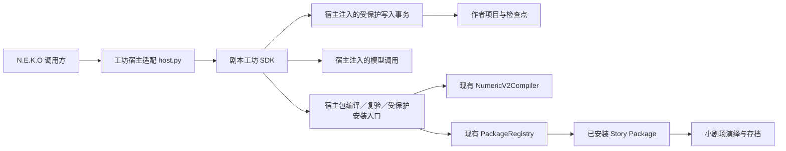

# 剧本工坊 SDK 迁移与接入说明

状态：`theater_workshop.sdk` 0.1.0 的无界面核心、公开接口、本体宿主、作者项目导入和发行检查入口已落地；真实模型生成、安装与演绎已有证据。全平台冻结发行物仍未验收，存量作者数据未整体切换，剧本质量按具体版本和路线判断。

| 当前问题 | 结论与入口 |
| --- | --- |
| 模块是否已迁入 | 已迁入；目录与能力见第3—5节，不再按“仅修姓名”的准备阶段理解 |
| 怎样调用／选择模型 | SDK使用说明（`theater_workshop/README.md`）；调用方显式传模型，不新增设置页或默认工坊模型 |
| 是否还需要工坊前端 | SDK无界面；原InkAI网页继续独立存在，不是本体依赖 |
| 旧作者数据是否迁完 | 完整导入接口和8份真实旧项目的隔离验证已完成；不等于正式目录已批量切换 |
| InkAI是否冻结 | 尚未冻结；按用户后续要求，共享创作与评改规则继续同步两端，见4.1 |
| 是否整体交付验收通过 | 源码／宿主与真实模型链路有证据；发行二进制、各平台及全路线质量不能据此推定 |

运行权限、模型链和当前停止条件以[小剧场架构](./neko-theater-architecture.md)为准；作者协议见InkAI生成器设计（`InkAI-/docs/superpowers/specs/2026-08-06-neko-theater-numeric-v2-generator-design.md`）。第1—8节为当前接入合同与验收状态，第9节按原编号保留迁移证据和问题索引，不再重复维护全部演绎实验。

## 1. 产品定位与迁移范围

SDK 是给其他程序调用的一组稳定能力、输入输出合同和开发说明。对本功能而言，调用方提供创作想法，工坊负责生成、检查、修订和产出剧本；调用方无需了解每轮 Prompt、项目文件结构或编译细节。

剧本工坊 SDK 与插件 SDK、小游戏 SDK 是三个平级领域能力。“平级”指职责和对外接口独立，不要求放在同一个物理父目录，也不要求使用同一种语言。

| 能力 | 当前代码位置 | 职责 |
| --- | --- | --- |
| 插件 SDK | `plugin/sdk/`，公开入口 `plugin.sdk.plugin`、`plugin.sdk.adapter` | 插件开发及外部协议适配，提供插件生命周期、事件及宿主能力访问 |
| 小游戏 SDK | `static/game/sdk/`；后端配套 `main_logic/mini_game_sdk/` | 游戏接入宿主提供的对话、语音、音频、形象等能力；按声明获得能力 |
| 剧本工坊 SDK | `theater_workshop/sdk/` | 作者项目、主线及支线创作、检查评分、限定修订、编译与显式发布 |
| 小剧场运行时 | `services/theater/`、`main_routers/numeric_theater_router.py` | 演绎、计分、选路、复核、Session/Ledger、恢复与 TTS 接入 |

工坊不继承插件基类，不经插件总线生成剧本，也不依赖小游戏 SDK。生成完成后通过 Story Package 交给小剧场。

核心迁移未批量移动旧作者数据或演绎存档。后续已通过SDK创建并安装新剧本，也按用户要求同步共享规则到InkAI；这些独立操作的版本与结果见第9节，不能继续概括为“从未修改正式包／原项目”。

## 2. 前端边界

SDK 自身不需要前端。本次迁移不带入 InkAI 的网页编辑器、故事地图、CSS、静态构建、Flask 服务或 `start_web.py`，也不为了 SDK 新增 N.E.K.O HTTP 路由。

原工坊前端可以继续留在 InkAI。以后 N.E.K.O 若提供“生成剧本”的按钮、聊天指令或自动化入口，由该入口调用 SDK；界面归调用方，生成及项目操作归 SDK。评分、修订、应用支线和安装仍需调用方明确发起，不因没有界面就自动全量执行。

## 3. 现行目录和依赖方向

以下结构已创建。迁入初期沿用已有模块名，方便比较迁移前后结果；公开接口集中在 SDK 入口。另有 `sdk/model.py`、`sdk/packages.py` 和 `sdk/json_response.py`，分别承接模型调用合同、包操作合同及原有 JSON 修复流程。

```text
N.E.K.O/
├── plugin/sdk/                         # 既有插件 SDK
├── static/game/sdk/                    # 既有小游戏前端 SDK
├── main_logic/mini_game_sdk/            # 既有小游戏宿主配套
├── theater_workshop/                   # 新的独立领域
│   ├── __init__.py
│   ├── host.py                         # N.E.K.O 配置、姓名、模型、安装适配
│   └── sdk/
│       ├── __init__.py                  # 稳定公开入口与版本
│       ├── workshop.py                 # 从现有 API 提取的业务编排
│       ├── contracts.py                # 与 HTTP 无关的输入输出合同
│       ├── generation/                 # 创作、事实、证据、评分、修订规则
│       ├── numeric_v2.py               # 作者侧投影和编译编排
│       ├── numeric_v2_analysis.py       # 数值与路线静态诊断
│       ├── numeric_v2_branch.py         # 支线规划、候选与应用
│       └── numeric_v2_project_store.py # 作者项目、revision、检查点
├── services/theater/                   # 保留现行运行时与唯一正式编译器
└── docs/design/neko-theater-workshop-sdk-migration.md
```

不放入 `plugin/sdk/`、`static/game/sdk/`、`deps/` 或 `services/theater/`。后者继续服务演绎，避免作者状态和运行 Session 混在一起。



SDK 不反向导入 `host.py`，不直接初始化 ConfigManager，不启动服务器。宿主提供模型调用、受保护写入事务、包操作和明确的项目根目录；姓名在创建生成任务时作为数据传入。无需引入通用插件机制、后台任务平台或第二套角色系统。

### 3.1 宿主写入保护与锁顺序

现行小剧场导入入口（`main_routers/numeric_theater_router.py`）在 `numeric_v2_story_session_guard` 内检查可写状态，再调用注册表。`NumericV2PackageRegistry.import_package` 本身只负责包校验及文件写入；直接复用它不会自动获得维护态保护或剧本生命周期锁。

宿主当前落实以下边界：

1. 作者项目的创建、更新、删除、生成状态、检查点、评分／编译／复验／安装回执都经宿主提供的写入事务提交。保护不能只放在 HTTP 路由或最终安装入口，否则程序直接调用 SDK 会绕过它。
2. 宿主复用全局写栅栏（`utils/cloudsave_runtime/fence.py`）的 `cloudsave_writable_transaction`，在最终文件变更期间覆盖可写检查与落盘。遇到维护、恢复等禁止写入状态，返回现有维护态错误，不能写回旧目录、建立另一份默认项目目录或自动重试提交。
3. 模型调用前取得项目 revision、名称快照和运行根快照；模型调用期间不持有文件事务锁。提交前重新核对运行根、可写状态及 revision；根目录已变化或稿件已更新时拒绝提交，保留已有项目，不将旧候选写进新根。
4. 正式包安装由 N.E.K.O 宿主处理，复用同一 `numeric_v2_story_session_guard(theater_root, story_id)`，与同剧本删除、恢复及其他生命周期操作协调。不能从工作线程另建事件循环去取得这把 `asyncio.Lock`，也不能在 SDK 内绕过宿主直接调用 CLI 安装。
5. 安装锁顺序固定为：宿主事件循环取得剧本生命周期锁 → 工作线程进入云存档可写事务 → 取得共享 Store 的短时锁 → 复验当前 revision/hash、安装及记录回执。普通项目写入只走后两层；禁止持有 Store 锁后等待事件循环取得剧本锁。同步文件事务在同一工作线程进入和退出，不能跨 `await` 持有线程锁。

同步生成与校验核心可以继续保留；涉及正式包的异步协调由宿主入口完成。同步核心向宿主交付不可变候选及其 revision/hash，不负责创建事件循环。上述事务只保护最终短时提交，不把模型等待时间变成正常聊天或演绎的阻塞时间。

## 4. 迁入模块与原项目对应

| 当前 InkAI 模块 | 迁移处理 |
| --- | --- |
| `generation/numeric_v2.py` | 保留主线生成、定点续写、节点完善、支线模型调用、确定性投影及最新共享写作规则 |
| `generation/runtime_rules.py` | 保留事实、证据、文学评分、修订共用的运行语义，继续单处维护 |
| `generation/quality.py`、`facts.py`、`evidence.py`、`repair.py`、`plan_review.py` | 保留实际的检查与修订链；评分不改稿，应用修订才写候选变更 |
| `numeric_v2_branch.py` | 保留先固定终点、再生成过程、检查候选、显式应用的流程及过期检查 |
| `numeric_v2_analysis.py` | 保留可达性、优先级遮蔽、节奏估算和 unknown 等诊断语义 |
| `numeric_v2.py` | 保留作者字段投影和诊断；正式包合同仍由 N.E.K.O 编译器裁定 |
| `numeric_v2_project_store.py` | 保留 revision、失败候选、检查点、报告失效规则和原子写入；宿主注入根目录与写入事务，并按第 5.1 节统一实例所有权 |
| `api.py` 的业务流程及 Pydantic 输入校验 | 提取到 `workshop.py`、`contracts.py`；不能只复制生成器而遗失提交、冲突和恢复步骤 |
| `neko_v2_bridge.py` | SDK 内改为进程内宿主适配，保留编译、发布复验和安装职责；跨仓桥继续服务独立InkAI工作台，不进入SDK，也不作为SDK缺失依赖时的回退 |
| `base_agent.py`、`config.py` | 不整份复制。解开顶层配置依赖，保留所需的调用结果、JSON 解析和错误合同，由宿主配置模型 |
| `frontend/`、Flask 路由、Web 启动脚本 | 留在原项目，不进入 SDK |

两个仓库当前都有 `config`、`utils` 等顶层名字。不能通过修改 `sys.path` 或从相邻目录动态导入来冒充迁移；必须改为 SDK 自己的包内导入，并注入宿主能力。

### 4.1 当前维护分工与同步规则

N.E.K.O 的 `theater_workshop/sdk/` 是本体创作能力维护入口，`host.py` 维护本体适配；正式Story Package合同只由 `services/theater/` 编译器裁定。InkAI的网页、Flask API、用户级模型设置和CLI桥继续在原仓库维护，尚未切换为SDK薄适配。

早期“验收后冻结旧核心、只维护SDK”的方案没有完成切换；用户后续明确要求工坊修改同步原项目，因此当前共享创作、事实、证据、文学、方案复核、节点修订及直接投影修复需要两端同步。对比时区分相同规则与必要的导入／模型宿主差异，不要求复制本体写栅栏或模型配置到旧网页。

每次共享规则修改核对两端 `generation/numeric_v2.py`、`generation/runtime_rules.py` 及实际消费者，并运行对应测试；作者／正式包同步是另一个显式动作。二者使用独立作者目录，SDK不从InkAI动态导入。不将尚未实施的旧前端接SDK、统一发行或数据切换写成自动下一步。

## 5. 对外调用合同

公开入口为 `TheaterWorkshop.open()`；在 N.E.K.O 中使用 `host.open_workshop()` 获取共享 `WorkshopHost`，通过异步 `host.call()` 调用同步核心，正式安装使用 `host.install()`。下表为能力合同，准确方法名和参数示例见 SDK 使用说明。

| 操作组 | 必须保留的输入／结果语义 |
| --- | --- |
| 项目创建、读取、更新与删除 | 项目 ID；修改传 `base_revision`；冲突返回稳定错误，不能覆盖较新稿 |
| ID 分配与完整作者项目导入 | `allocate_id` 保留节点／路线／结局 ID 前缀，不增加 revision；`import_project` 保留来源 ID、revision、作者数据与检查点，拒绝覆盖已有项目 |
| 主线生成及失败续写 | 标题、setup、生成姓名快照；返回故事及关系弧、状态弧、道具、主线顺序、节奏诊断；失败保留可恢复候选 |
| 节点完善 | 项目与节点 ID、revision；读当前节点及上游；只回填允许字段 |
| 支线终点、过程及应用 | 保留现有候选 ID、上下文指纹、端点和触发条件；过期候选不得应用；重复应用沿用既有幂等语义 |
| 事实检查、证据复核、文学评分 | 明确调用才执行；保留各阶段错误和证据；报告与具体稿件对应，评分不修改故事 |
| 节点修订 | 消费已核实问题与修订方案，保留修订范围；编译通过后按 revision 提交，其他节点不受影响 |
| 编译、发布复验、导出、安装 | 第一版保留四个明确操作；编译返回 canonical bytes、hash、warnings；复验建立当前稿的发布凭据；导出／安装均核对同一份产物，只有安装写正式包目录 |

当前保留同步生成／校验核心和可注入模型调用；宿主通过工作线程执行耗时业务，不阻塞服务事件循环。正式安装仍由服务小剧场的同一事件循环协调，不能在SDK内另建事件循环。多实例和并发由以下宿主／SDK保护承担，不能只依赖旧Store的文件原子替换。

错误继续区分输入不合法、revision 冲突、模型技术失败、模型候选不合合同、编译失败及安装失败。返回现有稳定错误码和结构化问题，HTTP 状态码属于外层适配。不要返回成功后再悄悄补全失败阶段。

### 5.1 实例所有权与并发边界

迁出基线的Store每实例各有一个 `RLock`，曾复现两个实例同时接受同一revision而覆盖修改。当前SDK通过下列共享实例与排他写者保护处理这一缺口；不能把旧反例写成宿主仍未接入。

- 正式模式由 N.E.K.O 主服务进程统一持有工坊写者。同一规范化项目根只创建一个 `TheaterWorkshop`／Store，重复获取复用该实例；禁止按请求或线程新建同根 Store。目录别名按本体平台路径规则归一，不能让同一目录获得两把不同的锁。
- 第一版不支持多个进程共同写同一作者目录。显式打开可写工坊时取得该根的跨进程排他所有权，复用本体现有 `portalocker` 依赖；第二个写者在任何模型调用或数据变更前返回明确的“目录正在使用”错误。锁文件属于本地控制状态，不复制进作者项目或同步快照；进程退出由操作系统释放锁，不用残留文件是否存在来判定占用。纯模块导入不取得锁、不创建目录。
- 同项目同时最多执行一个生成、完善、评分、修订或发布操作；重复发起返回处理中，不隐式排队或重复调用模型。普通读取保持可用，普通编辑可继续；长操作最终提交时重新检查 revision，编辑已推进版本就返回冲突，不覆盖新稿或把旧诊断写到新稿上。
- 开始长操作、失败记录和最终提交都使用第 3.1 节的写入边界。关闭工坊时先停止接收新操作，等待在途操作完成或明确放弃提交，再释放所有权；不能先释放后让迟到线程继续写。重启发现上次遗留 `running` 时记录中断状态，保留完整故事和已有检查点，等待调用方显式继续，不自动重发模型请求。
- Store 原子文件写入和 revision 检查继续保留，不以单写者模式替代它们。发布中的“检查 revision → 安装 → 保存回执”必须在同一项目短时提交区间完成，普通编辑不能插进这段最终提交。

### 5.2 发布复验与产物一致性

第一版明确保留“编译 → 发布复验 → 导出或安装”。迁入进程内只改变调用位置，不删除现有 `validate-neko` 的业务步骤，也不新增模型调用。现行依据是 InkAI API（`InkAI-/theater_generator/api.py`） 与 Store（`InkAI-/theater_generator/numeric_v2_project_store.py`） 中的 `compile_result`、`neko_validation` 和 hash 校验。

| 操作 | 迁移后必须满足的合同 |
| --- | --- |
| 编译 | 对确定的项目 revision 产生不可变 canonical bytes、非空 package hash 和 warnings；成功提交编译结果时清除旧发布复验与安装回执，失败只保存失败诊断 |
| 发布复验 | 要求当前 revision 已编译成功；用本体唯一正式编译器的严格 v2.2 入口重新读取并验证该份 canonical bytes，结果 bytes/hash 必须一致；成功回执明确关联当前 revision/hash |
| 导出 | 要求当前编译和复验都成功、关联 revision 正确且 hash 非空一致；重新核对当前稿的 canonical bytes，交付被验证的同一份字节，不另取一份变化后的 story |
| 安装 | 满足与导出相同的门禁，再按第 3.1 节提交该份已验证产物；注册表的正式校验和禁止覆盖同名包规则继续保留 |

SDK发布门禁核对成功状态、非空hash和revision；两个缺失hash均为None不构成有效凭据。旧API的迁出缺口不是必须保留的兼容行为，SDK已按上表补齐。

故事内容、标题或数值等导致包字节变化时，原编译、复验和安装结果失效；仅修改布局等不影响包字节的作者数据时，可以在核对 hash 不变后把有效凭据关联到新 revision。创作想法、主线顺序等对评分的影响仍走现行报告失效规则，不因包 hash 未变就沿用已经过期的评分。导入的旧项目若缺少可核实的复验版本／hash，保留其历史记录，但发布前必须重新编译、复验。

正式包与作者回执是两份文件，不能声称文件原子写入已实现跨文件事务。若包已安装而回执保存失败，明确报告这一事实；恢复时仅对同一 story_id 和已验证 hash 核对安装结果并补回执，不删除成功安装的包，不把不同 hash 的已有包当作成功。模型等待不进入上述提交区间。

### 5.3 可选固定旁白作者字段

各节点通过 `story_beat.fixed_narrations` 声明原文、入幕/幕内事件触发、同幕前置片段和离幕前必显标记，完整合同见[架构第3.4节](./neko-theater-architecture.md#34-作者固定旁白)。字段仍属于 Story Package，不带前端或独立模型设置。

主线章节与结局、支线路径与支线结局生成投影保留该可选数组；公开支线结局 DTO 同样接受。导入、作者更新、编译、宿主复验与导出保留原文，最终交由 N.E.K.O 编译器统一校验。生成模型只在作者明确要求时生成此资产，不默认冻结普通台词。

节点完善及自动文本修订不具有改写固定原文、触发条件或必显标记的权限。事实、证据、文学与修订共享上下文保留原文，允许指出冲突，但不能借修改前后文强迫玩家完成未授权行为；需要修改原文时由调用方显式更新作者项目，再按当前 revision 重新编译和复验。

已同步 InkAI 的生成、评分共享规则、主线/支线投影及支线结局 API 合同。未增加独立工作台可视编辑控件；旧作者项目也不会被批量改写。本体 SDK 与本体运行时应使用同一版本，不能假定旧运行时会显示新增字段。

## 6. 模型、预算与存储

宿主复用 N.E.K.O 的配置和 `utils.llm_client` 能力；生成器不携带独立密钥文件或修改正常聊天模型配置。接入时逐项核对现有 `operation`、输入输出预算、超时、重试、结构化输出和用量记录，不把“换成统一客户端”解释为更换模型或叠加重试。

用户最终确认由调用方选择模型，暂不改本体现有模型设置页面。`open_workshop(config_manager, model_config=...)` 接收调用方明确选定的模型、地址、凭据和供应商类型；也可注入 `model_call` 供测试或上层适配。没有配置时仍可管理／编译项目，但生成、评分明确报错，不自动占用聊天或演员模型。配置仅作工坊实例内的快照，不创建独立密钥文件；更换配置须先关闭在途实例再重开。

调用方还须在 `model_config.max_input_tokens` 明确提供正整数输入上限；没有默认容量，不能只传本体现有模型配置而遗漏此项。宿主按本体分词器统计完整消息及 JSON/角色字段，缺少有效预算或超限时在创建模型客户端前报错，保留作者内容、不截断后发送。上限按所选模型预留输出与分词差异的余量；注入 `model_call` 的自定义适配器自行落实同等检查。此项只约束工坊请求，不改变小剧场的输入上限或模型分工。

各操作的输出预算、主线最多三次模型调用和显式恢复规则保留；单次网络请求的客户端重试为0、超时120秒，不与核心恢复次数相乘。宿主保留输出预算与JSON响应校验，供应商参数由本体统一客户端处理；`NekoWorkshopModel` 不把旧工坊传入的固定温度或 `thinking` 参数原样透传。此为用户确认模型可选后的接入差异，不能将新旧模型输出差异计成纯代码迁移回归，也不据此宣称任意自定义端点已实测兼容。

演员 10000、判定 7000、普通复核 6000、正式复核 8000 的输入上限属于小剧场运行链，保持不变。工坊沿用自身各操作预算。数值硬范围仍为每轮 `[-5,5]`，作者规划按有效行为约 `±2` 分／轮估算。

运行数据位置由 `ConfigManager.app_docs_dir` 的当前存储策略确定，不能硬编码开发机路径：

```text
<app_docs_dir>/theater/
├── workshop/projects/                  # 作者项目目录
└── numeric_v2/
    ├── packages/                       # 现行正式包
    ├── sessions/                       # 现行演绎存档
    └── story_sessions.json             # 现行演绎索引
```

作者项目与正式包、演绎存档分开。安装是复制编译产物，不能让编辑器直接修改正在演绎的包。更新包继续遵守现行 story version/hash 和旧存档保护。

项目根路径只在显式打开工坊时由宿主解析，并与写者所有权绑定；运行期间存储根变化按第 3.1、5.1 节停止旧根提交并重新打开。不能将缓存的 `app_docs_dir` 当作跨迁移永久有效的写入地址。

完整作者数据使用显式 `import_project`，输入为包含 `_generation_checkpoint` 的原始项目 JSON 快照；不接受隐藏了检查点的 API 公开视图。验证当前迁出基线的项目格式及 JSON 可存储性，保留 authoring、revision、主线顺序、支线、报告及检查点；未完成稿可以继续编辑，不以正式包编译通过作为导入前提。

同 ID 已存在则拒绝，不覆盖、不改名。单个项目在宿主写栅栏及 Store 锁内原子写入，批量调用不声称跨项目原子提交。原 `running` 转为 `interrupted`，保留检查点并等待显式续写；原发布回执移入 `imported_publish_receipts`，重新编译、复验后才能导出或安装。调用方负责提供稳定来源快照，接口不自动读取或清理旧仓库。

旧作者数据已完成8份真实项目的隔离导入、字段／数量核对与发布复验，见9.4；未完成正式旧项目整体切换。后续通过SDK新建作者项目和安装包不等于迁移这些旧项目；批量切换仍须核对实际目标和数据清单，Session/Ledger不属于作者项目导入。

## 7. 姓名：已确认的产品语义

1. 新建生成任务读取当前猫娘名字、用户昵称。用户昵称来自现行 `主人.昵称`，缺失时沿用 `主人.档案名`、最后“你”的既有回退。
2. 同一大纲的失败续写使用原候选保存的姓名；向已有项目增加支线、完善节点或修订，继续使用该项目姓名，避免作者稿混入两组人。
3. 开演时按当时的猫娘与用户昵称适配，因此仍须保留运行时名称投影，不能因迁入本体而删除。
4. 程序知道真实昵称不等于剧情角色已经知道。未披露时公开称“你”；成功回合确认明确介绍后才使用昵称。`address_state`、`player_address_known` 的既有门槛不变。
5. 切换角色后可以用新角色开演同一剧本；这不授权把另一角色的进行中存档转交给新角色。Session 的稳定角色 ID、版本和历史保护仍按现行规则执行。

### 7.1 新包的显式姓名合同

生成器将完整姓名成对写入现有 `intro`，不再靠切开身份描述猜新稿姓名：

```json
{
  "intro": {
    "player_name": "小明，二号",
    "catgirl_name": "小岚",
    "player_identity": "小明，二号，回乡核对旧信的故人。",
    "catgirl_identity": "小岚，保管旧信的花店店主。",
    "background": "雨后，你来到那家花店。"
  }
}
```

两项姓名同时存在、非空且不同；身份以对应完整姓名加中文逗号开头。新稿的角色状态以对应姓名明确主体；`owner=player/catgirl`、ID、证据模式、发声状态等结构值继续使用协议枚举。此字段扩展沿用 `v2.2`，新包需要本次编译器支持，不能把能在旧版本中使用当作已验证兼容性。

旧包没有显式姓名时仍按既有身份首段投影，旧状态主体格式和原始包 hash 不改。没有姓名快照的旧生成检查点仍按“男主／女主”旧合同续写；不自动改造所有作者项目和已安装包。

### 7.2 现行姓名链路

- N.E.K.O `numeric_v2_identity.numeric_v2_authoring_names` 提供窄名称快照；只返回猫娘名和用户昵称。
- 原独立工坊通过现有 Validator CLI 的 `--authoring-names` 模式读取快照，再传给主线生成。该桥接不需要前端传名；本体SDK已由 `host.py` 直接调用同一名称来源。
- 主线及定点续写接收 `cast_names`，失败候选保存姓名快照；节点完善、支线、评分、证据及修订读取项目姓名，写作规则与确定性主体校验同步。
- 正式编译器验证显式姓名及状态主体；运行投影优先使用完整姓名，兼容旧包首段规则。
- 一次替换保持最长姓名优先，未改名的长姓名也参与匹配；叙事替换避开协议枚举和引用 ID，避免昵称与 `player`、`semantic` 等结构值相同造成污染。

保留边界：文本替换仍不等于自然语言实体识别。单字中文姓名沿用独立词边界保护；与普通词同形的姓名、作者另起简称等需要继续人工观察。双主角同名仍按现有不歧义合同拒绝，不擅自另取名字。若要支持任意别名或同名双主角，需要另行确认结构化角色引用方案，本轮没有新增模板语言。

## 8. 迁移阶段与验收状态

| 阶段 | 工作 | 完成依据 |
| --- | --- | --- |
| 0：姓名准备（已实现） | 同步作者、编译和运行投影；制定本文 | 名称反例、正常对照、作者及运行回归；不修改正式数据 |
| 1：迁出基线（已记录） | 保存实际工作区31项源／测试文件hash及编译对照 | 基线证据见9.3；原项目冻结切换未实施，共享规则继续按4.1同步 |
| 2：无界面核心（已实现） | 建立独立目录，提取 API 业务与输入校验，解开 BaseAgent/config 依赖 | 仅导入 SDK 不启动服务、不读写默认数据、不调用模型；注入假模型可跑全流程；公开入口不允许绕过实例与提交规则 |
| 3：本体宿主（已实现） | 注入名字、模型、项目路径、受保护事务及包编译／复验／安装入口 | 不依赖 InkAI 路径、Flask、旧前端或子进程；同样输入编译 bytes/hash 一致；维护态及锁顺序验证通过 |
| 4：生命周期与数据（隔离验证已做） | 隔离项目做多调用方、跨进程占用、续写、冲突、失败、重开与发布测试；准备可审查的数据导入结果 | 同根共享实例；迟到结果不覆盖新稿；复验凭据不过期使用；安装与回执失败可辨识恢复；Session/Ledger 未受影响；原数据保留 |
| 5：真实模型联调（已有局部证据） | 用不同题材核对生成→修订→安装→演绎，含切换猫娘和修改昵称 | 检查原始正文、复核、历史、路线、耗时与兜底；TTS 属于运行时独立验收，不作为 SDK 迁移门槛 |
| 6：正式发行物（待验证） | 按第 8.1 节核对实际构建、依赖及安装版调用 | 发行物脱离两个源码工作区仍能调用工坊并交给小剧场；按实际平台与架构记录结果，不能只凭开发环境通过宣布完成 |

提取时先保持算法、模型参数和调用次数，再单独处理后续优化。新增界面、全自动批量创作、独立 pip 发包和第三方插件入口均不属于本次迁移必要项。

### 8.1 正式发行链路

当前桌面后端主线是 Nuitka，依据[打包说明](/contributing/nuitka-packaging.md)、跨平台工作流（`.github/workflows/build-desktop.yml`）和Linux 工作流（`.github/workflows/build-desktop-linux.yml`）；Windows 独立工作流复用跨平台工作流。桌面发布脚本（`scripts/build-desktop-release.ps1`）使用已构建的 Nuitka 后端。仓库同时保留 PyInstaller 配置（`specs/launcher.spec`），不能只更新后者就认为正式发行已覆盖。

以下发行合同中，Nuitka包含参数、launcher入口和检查脚本已经接入；实际冻结二进制运行仍待验证：

- 将 `theater_workshop` 及其动态使用的生成、检查、修订模块纳入实际后端编译和导入验证；同步两个 Nuitka 工作流中的实际参数入口。Python 代码按包编译，不能用 `--include-data-dir` 复制源码代替；只有实际新增的非代码资源才补数据包含规则。
- 核对 SDK 最终依赖与本体锁定环境，去除对旧工坊 Flask、顶层 `config` 和独立密钥文件的依赖；不因旧 BaseAgent 曾依赖某供应商库就整份照搬依赖。通过编译产物的运行入口验证导入，不能要求 Nuitka 发行目录一定存在对应 `.py` 源文件。
- 保持既有插件 staging 流程；工坊是独立领域，不塞进 `prepare_nuitka_plugins.py` 的插件包清单。按需要扩展 发行检查（`scripts/check_nuitka_dist.py`）的资源检查及对应运行验证。若此次仍交付 PyInstaller 目标，同步其收集规则并单独验收；未交付的历史入口注明边界。
- 在源码和相邻 InkAI 目录均不可访问、未设置跨仓环境变量的干净环境中，通过安装版本体实际使用的宿主入口调用 SDK。先注入固定模型响应，执行创建、生成、续写、复验、导出、安装、重启读取及维护态拒写，确认安装产物可被同一发行版小剧场列出和打开；再完成计划内真实模型验收。TTS 不属于 SDK 迁移准入项。不得退回开发机 Python、CLI 或旧 Flask 服务替安装版完成调用。
- 对本次实际交付的 Windows、Linux、macOS 及架构分别记录构建版本、产物 hash 和运行结果；未验证的平台明确保留待验状态。通过构建、源码单测或静态资源检查中的某一项，不等于安装版端到端验证完成。本阶段准备发行物，不自动上传、签发或发布版本。

## 9. 验证与交接

以下为历史实施证据和问题索引。“本次”“未执行”只指该小节的批次；当前状态看文首与第8节。历史回归数量不代表本次文档整理重新运行。

### 9.1 姓名准备阶段的既有证据

姓名准备阶段新增确定性测试覆盖：完整标点昵称、运行时换名及披露前后、长短姓名重叠、替换不连锁、协议值保护、真实姓名进入模型请求、续写冻结姓名、旧检查点、节点完善、评分上下文、支线主体、原工坊 API 落盘，以及名称 CLI 的窄返回。

运行侧回归入口：

```bash
.venv/bin/python -m pytest -q \
  tests/unit/test_theater_numeric_v2*.py \
  tests/unit/test_theater_submit_recovery.py \
  tests/unit/test_numeric_v2_stress_runner.py
```

生成器回归入口：

```bash
.venv/bin/python -m pytest -q tests/theater_generator/test_numeric_v2*.py
```

姓名准备阶段使用固定模型响应和隔离项目验证代码链路，并通过真实 N.E.K.O CLI 执行新稿正式编译；这些结果不计作真实模型生成准确率。该阶段未进行长程模型演绎、桌面人工体验或 TTS 验证，也尚未提取 SDK。当前 SDK 状态以第 9.3 节为准。

姓名准备阶段记录的旧检查结果：

| 检查 | 结果与边界 |
| --- | --- |
| N.E.K.O Numeric v2、提交恢复、压测入口 | 654 项通过；2 项既有依赖弃用警告 |
| InkAI Numeric v2 全量检查 | 357 项通过，1 项失败：`test_numeric_v2_story_overview_displays_six_dimension_quality_report` 要求旧前端包含“此方案涉及节点或路线结构”，当前页面没有该字串；该测试只检查前端文件文字，与姓名代码无关，相关文件本轮未修改 |
| 修改前后编译对照 | 未声明显式姓名的两个现行 v2.2 测试样例（披露前／后）canonical bytes 和 package hash 一致；不扩大为所有历史协议或旧客户端兼容性证明 |
| 修改范围 | 未改前端、具体作者项目、安装包和演绎存档；未创建 SDK 目录 |

补丁前基线、回归输出及 hash 对照在 `/Users/mac/.codex/experiments/neko-workshop-sdk-names-74zfflwx/`。临时材料不写入 `.agent/notes`。

### 9.2 审核补充后的迁移准入条件

以下是审核要求；本次实现与验证状态见第 9.3 节，不能用第 9.1 节成绩替代：

| 审核问题 | 对应规则 | 必须补充的可观察验证 |
| --- | --- | --- |
| 本体写入保护缺失 | 第 3.1 节 | 维护态下项目与包均无写入；生成中切根后拒绝旧提交；安装与同剧本删除遵守同一生命周期锁，正常演绎不被长模型等待阻塞 |
| 多实例可能覆盖数据 | 第 5.1 节 | 同根重复获取复用实例；两个并发编辑最多一个接受旧 revision；第二进程在调用模型前拒绝占用；重启可接管已释放所有权并显式恢复检查点 |
| 发布复验步骤不明确 | 第 5.2 节 | 未编译、未复验、缺失 hash、hash 不同、revision 过期均拒绝导出／安装；纯布局更新与包内容更新分别验证凭据保留／失效；安装成功而回执失败可准确恢复 |
| 生成核心维护归属不明确 | 第4.1节 | 本体SDK无InkAI运行依赖；共享规则按后续用户决定同步两端，宿主／界面各自维护，不共用可写作者目录 |
| 缺少发行验收 | 第 8.1 节 | 实际 Nuitka 发行物在无源码环境通过程序调用与重启测试；按发行目标核对依赖和资源，逐平台记录已通过及待验范围 |

### 9.3 首版 SDK 实现与验证

当前版本为 `theater_workshop.sdk.__version__ = "0.1.0"`。已完成无界面核心提取、统一公开入口、N.E.K.O 宿主适配，以及阶段 4 的隔离生命周期测试。调用方显式提供模型；不新增工坊前端、HTTP 路由或模型设置页面。

迁出基线取自当时 InkAI 的实际工作区，记录了 31 个源文件／测试文件的 SHA-256，未只依赖旧 Git 提交。清单 hash 为 `abbbdf2f1c930d5d6a311d2069b04aed1f45bc077deb1cd27542b97d72c96146`。本次未修改 InkAI 文件；后续 SDK 接入与测试在 N.E.K.O 维护。当时未完成旧工坊冻结切换；后续用户要求继续同步原项目，现行分工见4.1。源码回归不等于发行验收。

| 检查 | 本次结果与边界 |
| --- | --- |
| SDK 和宿主隔离测试 | 335 项通过。包含 301 项迁入的核心回归；旧 Flask／跨仓 CLI 测试未搬入，业务提交边界由新的公开 SDK／宿主测试覆盖 |
| 小剧场及打包合同联合回归 | 合计 991 项通过，2 项既有依赖弃用警告；包括上述 SDK 测试、654 项 Numeric v2／恢复／压测入口测试和 2 项既有 macOS 打包合同测试 |
| 新旧包一致性 | 普通合同样例和显式姓名样例各一份，经旧工坊桥接编译与新进程内编译，canonical bytes、hash、warnings 一致；不是所有历史包兼容证明 |
| 写作规则一致性 | 主线与评分模块去除导入、基类和构造器差异后的 AST 一致；共享运行规则、事实、证据、方案复核、修订、路线分析及支线服务与基线文件逐字节一致 |
| 生命周期与发布 | 验证同根实例复用、并发编辑冲突、跨进程排他、异常进程退出接管、关闭等待在途操作、失败续写、模型等待期间编辑／切根／维护态、过期凭据拒绝、布局凭据承接、安装回执失败恢复及取消时保留生命周期锁 |
| 公开业务链 | 固定模型响应完成生成、完整评分、限定单节点修订、主线／新结局支线预览与幂等应用；评分失败不替换已有完整报告 |
| 发行入口 | 两个 Nuitka 工作流已包含 SDK，并调用 `scripts/check_theater_workshop_release.py`；`launcher.py --theater-workshop-smoke <fixture.json>` 在服务启动前执行隔离检查，不影响普通启动参数 |
| 源码发行冒烟 | 固定响应完成失败→重开续写→编译→复验→导出→安装→引擎加载→重开→维护态拒写；实际运行了 launcher 入口。此结果只证明源码环境，不能冒充冻结包运行 |

发行检查会在临时工作目录启动构建出的后端二进制，清除跨仓／Python 导入环境，要求关键模块确为 Nuitka 编译模块；构建侧 Python 仅生成固定测试数据，不替代二进制执行被测业务。检查输出平台、二进制 hash、包 hash 和步骤。当前环境未安装 Nuitka，本次未构建或执行 Windows、Linux、macOS 冻结发行物；这三个平台均保留待验状态。此次没有交付 PyInstaller 目标，未改其历史 spec。

仍未执行：用户旧作者项目的实际导入／切换、真实模型跨题材生成与演绎、人工 TTS 体验及全平台发行验收。`import_story` 仅从 Story Package 新建作者项目，不能用于声称完整作者数据已迁移；原项目、正式包和 Session/Ledger 保留原状。小剧场输入预算、计分、路线、姓名披露和恢复合同未作改动。

可复现证据保存在 `/Users/mac/.codex/experiments/neko-workshop-sdk-migration-npyis5aw/`，包含迁出基线、hash 清单、新旧编译对照、联合回归和源码发行冒烟日志。首轮新增测试曾因测试角色 ID 未带现行 `character_` 前缀，以及把 Pydantic 包内相对导入误判为旧顶层 config 而失败；已修正测试适配，未因此放宽产品姓名或导入边界。

联合回归命令：

```bash
.venv/bin/python -m pytest -q \
  tests/unit/theater_workshop \
  tests/unit/test_theater_numeric_v2*.py \
  tests/unit/test_theater_submit_recovery.py \
  tests/unit/test_numeric_v2_stress_runner.py \
  tests/unit/test_nuitka_macos_bundle_contract.py
```

### 9.4 接口与作者数据收口

旧 API 中用于创建节点、路线、结局的 ID 分配操作已补入 SDK 和宿主公开入口；原网页、Flask 服务与模型设置页按第 2、6 节不迁移。新增完整作者项目导入，区别于已有 `import_story`。

| 检查 | 结果与边界 |
| --- | --- |
| 新增接口回归 | 20 项通过：公开 ID 分配、完整数据保留、旧发布凭据失效、重开后编辑、带原姓名检查点续写、同 ID 并发冲突、异常输入、未完成稿、维护态／切根拒写、写入及 fsync 失败无残留 |
| 联合回归 | 1011 项通过，2 项既有依赖弃用警告；SDK 合计 355 项，其余为现行 Numeric v2、提交恢复、压测入口及 macOS 打包合同 |
| 真实旧作者数据 | 当前 InkAI 的 8 份原始项目全部在隔离目录导入，保留原 ID、revision 与作者内容，发布回执单独归档；原文件 SHA-256 前后相同。8 份均重新编译、复验、导出通过，包 hash 与导入前故事按当前编译器得到的结果一致 |
| 检查点边界 | 这 8 份真实项目当前均无检查点；检查点及姓名续写由确定性反例验证，不扩大为真实失败项目恢复的新证据 |
| 源码冒烟 | launcher 入口新增 ID 分配、完整项目导入、拒绝沿用旧发布回执和重新复验检查，已通过。Nuitka 工作流使用同一检查入口，尚未运行冻结发行物 |

本轮临时产物位于 `/Users/mac/.codex/experiments/neko-workshop-sdk-closeout-0stwvtd_/`；`legacy-import-final.json` 保存逐项目来源／副本 hash、revision 与发布检查，`verify_legacy_import.py` 可在新的隔离目录重放，`regression.txt` 保存联合回归结果。补齐期间还发现 `_write` 在 fsync 失败时可能未记录临时路径，现已在写入前登记并由失败测试验证清理。

代码接口及隔离数据验收已完成。仍待调用方指定配置后的真实模型验收、Windows／Linux／macOS 正式发行物验收和正式数据切换。TTS 由小剧场运行时负责，前文历史记录中的“未验证 TTS”不表示 SDK 缺少模块或未满足迁移条件。旧项目未正式冻结，当前共享规则同步边界以4.1为准。

### 9.5 本体 Qwen 真实生成、安装与压测

SDK已用调用方显式传入的qwen3.7-plus完成电车主线、两条支线、三结局结构、编译、复验、导出及安装；当时演绎未原生结束。真实模型链路已存在，不能继续写成从未联调；原包后来按用户要求删除。 完整证据与历史验证范围见[问题2.82—2.83](./neko-theater-issues-and-solutions.md)。

### 9.6 真实演绎问题回流 SDK 与修复包验证

电车修稿期间同步SDK与InkAI的状态来源、道具归属、阶段和公开前提规则；仅具体修复包及定点轨迹通过，不代表生成后必然一遍通关。 完整证据与历史验证范围见[问题2.84](./neko-theater-issues-and-solutions.md)。

### 9.7 新稿原样压测与当前安装状态

用户授权删除电车后，经SDK新生成并安装风筝节；保留主线／支线／多结局生成能力证据，原稿节奏与收尾没有通过。 完整证据与历史验证范围见[问题2.85](./neko-theater-issues-and-solutions.md)。

### 9.8 风筝节修复回流及当前边界

风筝节反例回流共享规则和修复包；SDK模块已存在，运行阶段边界与邀请分类仍须独立验证。 完整证据与历史验证范围见[问题2.86](./neko-theater-issues-and-solutions.md)。

### 9.9 继续迭代的输入污染与验收边界

动态玩家和推荐曾引入姓名、技能等未经公开的信息，污染轨迹不计干净验收。未因这些轨迹修改SDK公开协议。 完整证据与历史验证范围见[问题2.87](./neko-theater-issues-and-solutions.md)。

### 9.10 接受错误邀请的运行保护

运行侧将取消保护扩展至接受错误邀请，与主动请求共用一次改稿和同次计分；不增加工坊字段。 完整证据与历史验证范围见[问题2.88](./neko-theater-issues-and-solutions.md)。

### 9.11 待确认邀请的留幕检查

待确认邀请的留幕回应已纳入现有复核；这是运行侧改变，不是SDK新增调用或编辑界面。 完整证据与历史验证范围见[问题2.89](./neko-theater-issues-and-solutions.md)。

### 9.12 普通改稿的错误底稿影响

普通留幕改稿不再带被拒全文，仍有旧安排与推荐漏报；SDK创作／评分／发布接口不变。 完整证据与历史验证范围见[问题2.90](./neko-theater-issues-and-solutions.md)。

### 9.13 复核模型的隔离对照

其他复核模型仅做隔离对照，没有正式切换。工坊继续由调用程序选择模型，不绑定实验模型。 完整证据与历史验证范围见[问题2.91](./neko-theater-issues-and-solutions.md)。

### 9.14 游客体验与结局的完成范围

共享规则明确完成主体与结局范围；风筝节draft_7的分段收尾有证据，未取得整本最新稿干净从头通过。 完整证据与历史验证范围见[问题2.92](./neko-theater-issues-and-solutions.md)。

### 9.15 角色说明组装不再重复累积

SDK与InkAI修复角色说明精确前缀重复，保留不同状态和独立补充；未批量重写存量项目。 完整证据与历史验证范围见[问题2.93](./neko-theater-issues-and-solutions.md)。

### 9.16 运行侧推荐格式与终局检查

正式换幕推荐格式在运行侧补齐，终局仍有NPC漏答与状态问题；不计SDK整体生成质量通过。 完整证据与历史验证范围见[问题2.94](./neko-theater-issues-and-solutions.md)。

### 9.17 终局答复的失败对照与待确认协议

终局答复对照未可靠改善；当时提出的来源旁白后续已在9.18对应批次实现，不再是待确认任务。 完整证据与历史验证范围见[问题2.95](./neko-theater-issues-and-solutions.md)。

### 9.18 来源NPC旁白的运行协议

来源可选NPC旁白已在运行侧实现，保留三段、同次生成与一次提交；旁白不进入猫娘TTS，不新增工坊节点或调用。 完整证据与历史验证范围见[问题2.96](./neko-theater-issues-and-solutions.md)。

### 9.19 结局实体状态对照未采用

结局实体状态提示、历史顺序和模型候选未采用；不增加SDK状态提取能力。 完整证据与历史验证范围见[问题2.97](./neko-theater-issues-and-solutions.md)。

### 9.20 独立状态检查暂不接入

独立实体复核隔离候选未通过完整纠错闭环，未接入正式流程或SDK协议。 完整证据与历史验证范围见[问题2.98](./neko-theater-issues-and-solutions.md)。

### 9.21 思考改稿暂不采用

思考改稿存在超时和残留，未采用；工坊宿主仍使用调用方模型和既有预算。 完整证据与历史验证范围见[问题2.99](./neko-theater-issues-and-solutions.md)。

### 9.22 max普通改稿与完整恢复夹具

max普通改稿、摘要和字段结构实验没有形成稳定改善，未采用；注入恢复夹具与原生轨迹分开统计。 完整证据与历史验证范围见[问题2.100](./neko-theater-issues-and-solutions.md)。

### 9.23 生成顺序与纠错协议保持实验状态

生成顺序、复核证据与局部编辑均未采用，不将实验输出或解析器加入SDK。 完整证据与历史验证范围见[问题2.101](./neko-theater-issues-and-solutions.md)。

### 9.24 实验口径更正与运行侧候选否决

修正旧实验格式与标签口径，短复核和删除入幕状态候选仍未采用；没有新作者合同。 完整证据与历史验证范围见[问题2.102](./neko-theater-issues-and-solutions.md)。

### 9.25 生成与评改优先围绕双主角

SDK与InkAI已同步双主角优先规则：降低对NPC连续问答、操作或评价的关键依赖，保留必要配角回应和玩家选择权。 完整证据与历史验证范围见[问题2.103](./neko-theater-issues-and-solutions.md)。

### 9.26 框架协议优化与生成器接入边界

运行可选桥段已实现，简化结局未采用；桥段为空的许可由既有合同决定，不要求工坊增加新模式字段。 完整证据与历史验证范围见[问题2.104](./neko-theater-issues-and-solutions.md)。

### 9.27 当前回应候选不进入SDK协议

当前回应、回合前状态参考、共享状态和结局追加复查均停留在未采用实验；没有新的生成、状态或评分协议待移植。 完整证据与历史验证范围见[问题2.105—2.108](./neko-theater-issues-and-solutions.md)。

### 9.28 停止框架迭代后的单次新稿试跑

SDK生成晴川镇draft_1及两条支线、三个结局并安装；单次原生mixed轨迹未达不拖沓，后续由用户单独重启出口修复。 完整证据与历史验证范围见[问题2.109](./neko-theater-issues-and-solutions.md)。

### 9.29 出口一致性与候选换幕定点修复

SDK与InkAI已同步来源邀请、桥段、目标开场的去向／时段／活动一致性规则。晴川镇draft_2通过SDK编译复验并在用户授权删除旧包后安装；SDK仍禁止同ID直接覆盖。后续2.114单条七成推荐轨迹22轮到安静结局、节奏可接受，但复核长等待和其他路线边界仍在；当前停止追加优化。 完整证据与历史验证范围见[问题2.110—2.114](./neko-theater-issues-and-solutions.md)。
