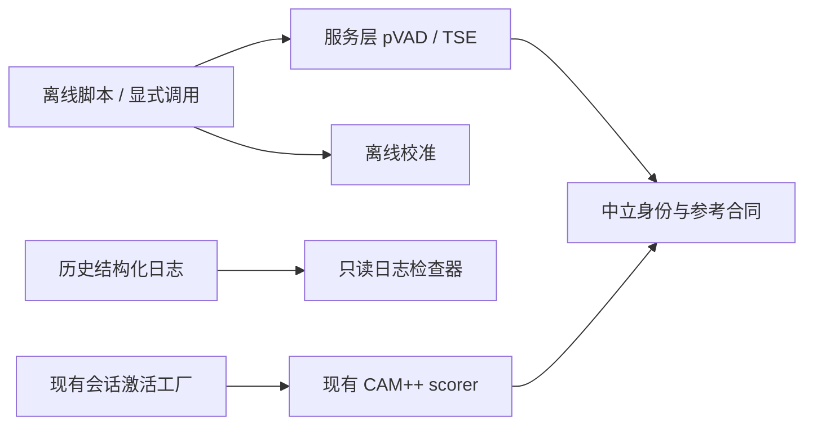

# 声纹拦截研发的配套模型与离线诊断工具

> **状态：配套模块的实现记录，未生产接线。** #2980 的主目标是[会话激活后的 ASR 前音频拦截](active-session-audio-interception.md)，以下模型、资源事务和离线分析能力为该目标提供研发基础。

生产入口继续使用 `OwnerVoiceSessionActivationFactory`，录入、schema 3 档案、RNNoise 合同、唤醒词和独立 ASR 开关沿用 main。当前 ACTIVE 期间仍放行音频；不能把配套工具的存在视作拦截功能已经完成。

## 可用范围

| 能力 | 入口 | 边界 |
| --- | --- | --- |
| FireRed pVAD / SpeechBrain ECAPA | `main_logic.voice_identity_service.pvad` | 提供模型数值适配、固定资源校验及显式 ECAPA 下载；未接入会话激活评分，不产生生产拒绝权限。 |
| REAL-TSE | `main_logic.voice_identity_service.tse` | 提供原始参考向量、NumPy 前处理、连续流推理、有界 worker 和资源事务；不接入麦克风上传。 |
| TSE 离线回放 | `scripts.tse_replay` | 用户提供三段参考和 16 kHz 单声道 PCM16 WAV，输出独立音频与报告，不发起 ASR 请求。 |
| TSE worker 测量 | `scripts.measure_tse_worker` | 用合成信号测量单 worker 时序和资源，不能作为真实分离效果或整机性能结论。 |
| 校准候选拟合 | `scripts.evaluate_voice_identity_calibration` | 消费脱敏 JSON 样本，校验划分、模型及前处理合同；输出候选不自动安装，也不改变线上阈值。 |
| 历史 ASR 日志检查 | `scripts.check_asr_pipeline_log` | 读取旧分支的结构化事件；缺失、截断和未观测分别报告。main 不新增这些事件的生产埋点。 |

模型代码依赖 `voice_identity` 的中立参考和身份合同；下载、文件、ONNX、线程与进程实现属于服务层，纯领域层不反向导入它们。



## 使用

在仓库根目录执行：

```sh
uv run python -m scripts.tse_replay --model-dir /models/tse --reference ref1.wav ref2.wav ref3.wav --input mixed.wav --output extracted.wav
uv run python -m scripts.measure_tse_worker --model-dir /models/tse --duration-seconds 60 --report measurement.json
uv run python -m scripts.evaluate_voice_identity_calibration --help
uv run python -m scripts.check_asr_pipeline_log historical.log --output report.json
```

TSE 发行清单的 `source` 仍为空，在线下载会明确报 `tse_source_unconfigured`；资源管理器支持调用方显式提供已固定清单对应的 ZIP 字节流。分离器和编码器权重不随本 PR 提交。pVAD 小模型及许可证随独立服务模块保存，ECAPA 大模型仅在显式请求后下载。

`scripts.package_tse_models` 保留原固定模型发行包的重建能力；其中发行包 README 是该资源版本的历史元数据，不表示当前应用有实时启用入口。不同 ECAPA 模型、前处理及参考方法不能互换，TSE 参考保持原始向量，不使用归一化声纹向量替代。

## 生命周期与回退

资源操作按 generation 和 stop event 隔离，取消后重新初始化使用新事件。上传取消、校验失败和发布失败不留下可用的半成品；native 工作未退出时，关闭返回未退休状态，不能视为成功释放。TSE worker 的队列容量、超时、连续采样区间和清理结果由调用方显式处理。

ECAPA 资源管理器的 `status()` 暴露 `busy` 与 `confirmed_stopped`；`close(timeout)` 返回是否已经完成物理任务收尾。返回 `False` 时原 task 仍是资源 owner，调用方必须等待后续状态变为 `confirmed_stopped` 后才允许替换同一资源目录。

本 PR 在服务层恢复独立的 `prewire_gate`、评分调度、区间账本与 TSE 对齐基础，以 ASR 前音频拦截为主线。旧 `asr_composition`、Admission、exact 逐句转写拒绝、旧安装生命周期、schema 4/5 及旧模型录入界面不迁入。共享 CAMPPlus 宿主需要面向新架构明确资源 owner，暂不作为生产实现迁入。实时接线、录入事务、校准、性能和 Web/Electron 验收仍未完成，详见主设计记录；移除当前新增模块不改变现有麦克风行为。

数值与受控生命周期测试不能证明真实房间中的旁人抑制效果，也不能证明生产音频不上传。历史日志的缺席不代表成功，校准分数也不是身份概率。
