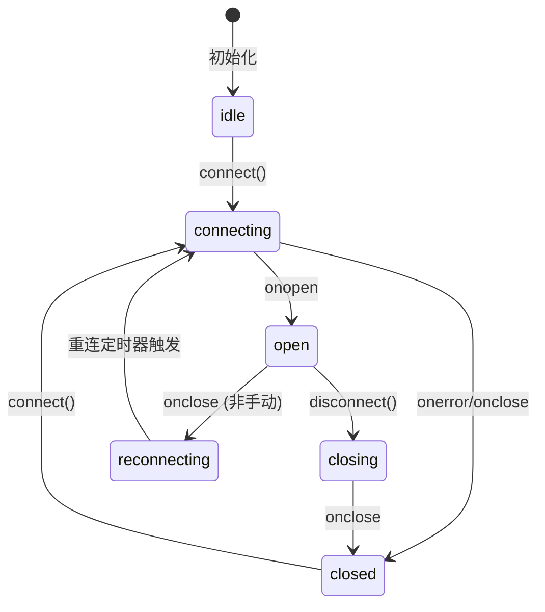

# Chat Text Conversation Feature Spec

> 创建于 2026-01-18，文档记录 ChatContainer 文本对话功能的设计与实现。

---

## 1. 背景（Background）

- **为什么要做**：N.E.K.O 项目需要支持文本对话功能，作为语音对话的补充，允许用户通过键入文字与 AI 助手交互。
- **现状问题**：
  - 之前 ChatContainer 仅支持独立模式，无法与后端 WebSocket 实时通信
  - 缺少连接状态显示，用户无法了解当前通信状态
  - 消息可能重复（内部状态和外部状态都添加用户消息）
- **约束**：
  - 需要兼容 Web (Vite) 环境
  - 需要与 `@project_neko/realtime` 包集成
  - UI 需要支持 i18n

---

## 2. 目标（Goals）

- **必须达成**：
  - ChatContainer 支持通过 WebSocket 发送和接收文本消息
  - 显示连接状态（已连接/连接中/已断开等）
  - 支持截图附件功能
  - 消息去重（外部模式下不重复添加用户消息）
  - 输入禁用状态支持

- **可选增强**：
  - 消息发送状态指示（发送中/已发送/失败）
  - 消息历史持久化
  - 打字指示器

## 3. 非目标（Non-goals）

- **明确不做**：
  - 消息编辑/删除功能
  - 消息反应（表情回复）
  - 富文本格式支持
  - 文件上传（非截图）

---

## 4. 范围与影响面（Scope）

- **涉及 packages**：
  - `@project_neko/components` - ChatContainer, ChatInput, MessageList
  - `@project_neko/realtime` - WebSocket 客户端

- **涉及宿主**：
  - Web (Vite) ✅
  - legacy HTML+JS (UMD) - 待验证
  - React Native (Expo/Metro) - 待同步

- **是否影响同步**：
  - 需要同步到 N.E.K.O.-RN（ChatContainer 接口变更）

---

## 5. 术语表（Glossary）

| 术语 | 定义 |
|------|------|
| **ChatContainer** | 聊天容器组件，包含消息列表和输入区域 |
| **externalMessages** | 来自父组件的消息（如 WebSocket 响应） |
| **internalMessages** | 组件内部管理的消息（独立模式） |
| **connectionStatus** | WebSocket 连接状态 |
| **PendingScreenshot** | 待发送的截图对象 |

---

## 6. 对外接口（Public API / Contract）

### 6.1 API（函数/类/事件）

- **入口文件**：
  - `@project_neko/components/src/chat/index.ts`

- **导出项**：
  ```typescript
  export { default as ChatContainer } from "./ChatContainer";
  export type { ChatContainerProps } from "./ChatContainer";
  export { default as ChatInput } from "./ChatInput";
  export { default as MessageList } from "./MessageList";
  export * from "./types";
  ```

### 6.2 数据结构（Types）

#### ChatContainerProps

```typescript
export interface ChatContainerProps {
  /** External messages to display (will be merged with internal messages) */
  externalMessages?: ChatMessage[];

  /** Callback when user sends a message via input */
  onSendMessage?: (text: string, images?: string[]) => void;

  /** Connection status for text chat mode */
  connectionStatus?: "idle" | "connecting" | "open" | "closing" | "closed" | "reconnecting";

  /** Whether to disable the input (e.g., when disconnected) */
  disabled?: boolean;

  /** Custom status text to show in the header */
  statusText?: string;
}
```

#### ChatMessage

```typescript
export type ChatMessage = {
  id: string;
  role: "system" | "user" | "assistant";
  createdAt: number;
} & (
  | { content: string; image?: string }
  | { content?: string; image: string }
);
```

#### PendingScreenshot

```typescript
export interface PendingScreenshot {
  id: string;
  base64: string;
}
```

---

## 7. 行为规范（Behavior）

### 消息发送行为

- **规则 1**：当提供 `onSendMessage` 回调时（外部模式），用户消息不添加到内部状态，由外部通过 `externalMessages` 返回
- **规则 2**：当未提供 `onSendMessage` 时（独立模式），用户消息添加到内部状态
- **规则 3**：消息按 `createdAt` 时间戳排序显示
- **规则 4**：截图作为 `images` 数组传递给 `onSendMessage`

### 连接状态显示

- **规则 5**：当提供 `onSendMessage` 时，显示连接状态指示器
- **规则 6**：连接状态颜色映射：
  - `open` → 绿色 (#52c41a)
  - `connecting` / `reconnecting` / `closing` → 黄色 (#faad14)
  - `closed` → 红色 (#ff4d4f)
  - `idle` → 灰色 (#d9d9d9)

### 输入禁用

- **规则 7**：当 `disabled=true` 时，输入框和按钮变灰且不可交互

---

## 8. 状态机（如适用）



---

## 9. 错误码与可观测性（Errors & Observability）

- **错误处理**：
  - WebSocket 未连接时发送消息：显示 Toast 提示并尝试连接
  - 截图失败：显示 alert 提示

- **日志**：
  - WebSocket 连接/断开事件记录
  - 消息发送/接收事件记录

---

## 10. 安全与隐私（Security & Privacy）

- **敏感数据**：
  - 截图内容（base64 编码）
  - 聊天消息文本

- **脱敏规则**：
  - 截图不持久化到本地存储
  - 消息内容仅在内存中保留

---

## 11. 兼容性矩阵（Compatibility）

| 环境 | 是否支持 | 备注 |
|---|---:|---|
| Web (Vite) | ✅ | 主要开发/测试环境 |
| legacy HTML+JS (UMD) | ⚠️ | 需要验证 bundle 导出 |
| React Native (Expo/Metro) | ⚠️ | 需要同步 ChatContainer 接口变更 |

---

## 12. 迁移与回滚（Migration / Rollback）

- **迁移步骤**：
  1. 更新 `@project_neko/components` 包
  2. 在 App.tsx 中传递 `connectionStatus` 和 `onSendMessage`
  3. 配置 WebSocket 消息处理逻辑

- **回滚策略**：
  - 不传递 `onSendMessage` 即可回退到独立模式
  - 新增的 props 均为可选，向后兼容

---

## 13. 测试计划（Test plan）

- **单测**：
  - [ ] ChatContainer 消息合并逻辑
  - [ ] ChatInput disabled 状态
  - [ ] 连接状态颜色/文本映射

- **集成测试**：
  - [ ] WebSocket 连接 → 发送消息 → 接收响应流程
  - [ ] 截图附件发送流程

- **手动验收**：
  1. 启动 Web 开发服务器
  2. 打开聊天面板
  3. 验证连接状态显示
  4. 发送文本消息，确认消息显示
  5. 截图并发送，确认图片附件
  6. 断开网络，验证状态变化和禁用状态

---

## 14. 使用示例

### 基本集成

```tsx
import { ChatContainer } from "@project_neko/components";
import { createRealtimeClient } from "@project_neko/realtime";

function App() {
  const [messages, setMessages] = useState<ChatMessage[]>([]);
  const [connectionStatus, setConnectionStatus] = useState<RealtimeConnectionState>("idle");
  const clientRef = useRef<RealtimeClient | null>(null);

  // 初始化 WebSocket 客户端
  useEffect(() => {
    const client = createRealtimeClient({ path: "/ws/chat" });
    clientRef.current = client;

    client.on("state", ({ state }) => setConnectionStatus(state));
    client.on("json", ({ json }) => {
      // 处理服务器响应，添加到 messages
    });

    client.connect();
    return () => client.disconnect();
  }, []);

  return (
    <ChatContainer
      externalMessages={messages}
      connectionStatus={connectionStatus}
      onSendMessage={(text, images) => {
        clientRef.current?.sendJson({
          action: "send_text",
          text,
          images,
        });
      }}
    />
  );
}
```

### 独立模式（无 WebSocket）

```tsx
import { ChatContainer } from "@project_neko/components";

function StandaloneChat() {
  return <ChatContainer />;
}
```
