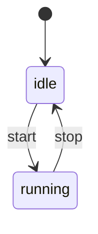

### Feature Spec 模板（适合跨端/协议/状态机）

> 复制本模板创建新 spec。建议文件名：`YYYY-MM-DD_<short-slug>.md` 或 `<feature>.md`。

---

### 1. 背景（Background）

- **为什么要做**：\n- **现状问题**：\n- **约束**（兼容 legacy HTML/JS？需要 RN？是否影响 bundles？）：\n
---

### 2. 目标（Goals）

- **必须达成**：\n- **可选增强**：\n
### 3. 非目标（Non-goals）

- **明确不做**：\n
---

### 4. 范围与影响面（Scope）

- **涉及 packages**：\n  - `@N.E.K.O/frontend/packages/<pkg>`\n- **涉及宿主**：\n  - Web（Vite）/ legacy HTML+JS（bundles+web-bridge）/ React Native（Expo/Metro）\n- **是否影响同步**：\n  - 是否需要更新 `@N.E.K.O.-RN/scripts/sync-neko-packages.js` 映射？\n
---

### 5. 术语表（Glossary）

- **术语 A**：定义\n
---

### 6. 对外接口（Public API / Contract）

#### 6.1 API（函数/类/事件）

- **入口文件**：\n  - `index.ts`：\n  - `index.web.ts`：\n  - `index.native.ts`：\n- **导出项**：\n  - `export function ...`\n
#### 6.2 数据结构（Types）

- **类型定义文件**：\n  - `src/types.ts`\n- **字段约束**：\n  - 必填/可选、默认值、错误场景\n
---

### 7. 行为规范（Behavior）

用“可执行的规则”描述行为，不要写成实现细节。

- **规则 1**：\n- **规则 2**：\n
---

### 8. 状态机（如适用）

---

### 9. 错误码与可观测性（Errors & Observability）

- **错误码**（如果需要）：\n  - `CODE_A`: 含义、触发条件、建议处理\n- **日志**：\n  - 需要记录哪些关键事件/字段（注意脱敏）\n- **指标**（可选）：\n  - 重连次数、丢包率、耗时分位等\n
---

### 10. 安全与隐私（Security & Privacy）

- **敏感数据**：Token、音频、截图等\n- **脱敏规则**：\n
---

### 11. 兼容性矩阵（Compatibility）

| 环境 | 是否支持 | 备注 |\n|---|---:|---|\n| Web(Vite) | ✅/❌ | |\n| legacy HTML+JS(UMD) | ✅/❌ | |\n| React Native(Expo/Metro) | ✅/❌ | |\n
---

### 12. 迁移与回滚（Migration / Rollback）

- **迁移步骤**：\n- **回滚策略**：\n
---

### 13. 测试计划（Test plan）

- **单测**：覆盖哪些模块/分支\n- **集成测试**：如何验证三端\n- **手动验收**：最小可复现步骤\n
