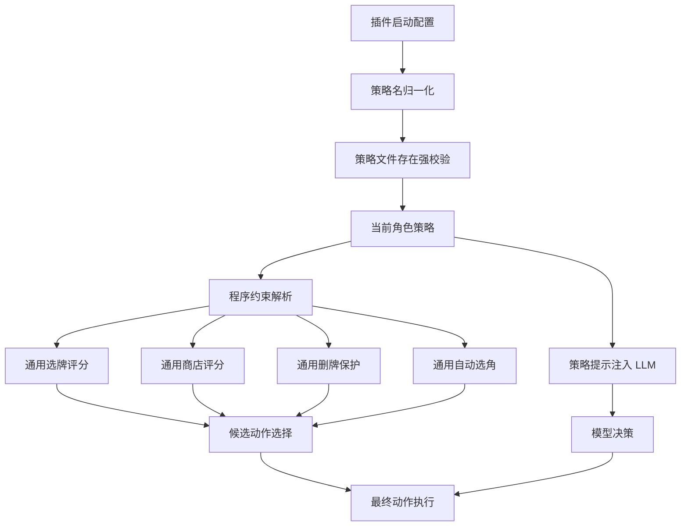

# STS2 Autoplay 角色策略链路改造设计与分阶段计划

## 背景

当前 [`sts2_autoplay`](plugin/plugins/sts2_autoplay) 已支持语义化角色策略文件名，并通过 [`StrategyParser`](plugin/plugins/sts2_autoplay/parser.py:8) 完成策略发现、别名归一化、策略提示加载与策略约束解析。已确认 [`necrobinder.md`](plugin/plugins/sts2_autoplay/strategies/necrobinder.md)、[`regent.md`](plugin/plugins/sts2_autoplay/strategies/regent.md)、[`silent_hunter.md`](plugin/plugins/sts2_autoplay/strategies/silent_hunter.md)、[`ironclad.md`](plugin/plugins/sts2_autoplay/strategies/ironclad.md)、[`defect.md`](plugin/plugins/sts2_autoplay/strategies/defect.md) 均能作为策略文档被发现。

本计划针对当前检查中暴露的扩展性问题，目标是不破坏现有运行链路的前提下，让角色策略在启动校验、自动选角、选牌、商店和地图启发式中更一致地生效。

## 当前链路观察

### 策略发现与规范化

- [`StrategyParser._available_character_strategies()`](plugin/plugins/sts2_autoplay/parser.py:57) 扫描 [`strategies`](plugin/plugins/sts2_autoplay/strategies) 目录下的 [`*.md`](plugin/plugins/sts2_autoplay/strategies)。
- [`StrategyParser._normalize_character_strategy_name()`](plugin/plugins/sts2_autoplay/parser.py:63) 先走别名表，再进行安全字符归一化；插件尚未发布，不保留数字策略名兼容。
- [`StrategyParser._ensure_character_strategy_exists()`](plugin/plugins/sts2_autoplay/parser.py:74) 可在主动设置策略时阻止不存在的策略文档。

### 启动与手动切换

- [`STS2AutoplayService.startup()`](plugin/plugins/sts2_autoplay/service.py:80) 当前只规范化 [`character_strategy`](plugin/plugins/sts2_autoplay/service.py:83)，尚未调用文件存在校验。
- [`STS2AutoplayService.set_character_strategy()`](plugin/plugins/sts2_autoplay/service.py:771) 已完成规范化、文件存在校验、配置写入和状态广播。
- [`STS2AutoplayService._configured_character_strategy()`](plugin/plugins/sts2_autoplay/service.py:800) 每次读取当前策略时都会重新规范化。

### LLM 与决策上下文

- [`STS2AutoplayService._strategy_prompt_for_llm()`](plugin/plugins/sts2_autoplay/service.py:1730) 转发到 parser 获取策略提示。
- [`STS2AutoplayService._build_llm_decision_payload()`](plugin/plugins/sts2_autoplay/service.py:1745) 将当前策略、策略约束、战斗摘要、地图摘要和合法动作传给模型。
- [`LLMStrategy.select_action_with_llm()`](plugin/plugins/sts2_autoplay/llm_strategy.py:223)、[`LLMStrategy.select_action_with_llm_and_reasoning()`](plugin/plugins/sts2_autoplay/llm_strategy.py:267)、[`LLMStrategy.select_action_full_model_and_reasoning()`](plugin/plugins/sts2_autoplay/llm_strategy.py:326) 都会读取当前策略提示。

### 程序化启发式

- [`HeuristicSelector.find_preferred_shop_card_index()`](plugin/plugins/sts2_autoplay/strategy.py:241)、[`HeuristicSelector.find_preferred_shop_relic_index()`](plugin/plugins/sts2_autoplay/strategy.py:258)、[`HeuristicSelector.find_preferred_shop_potion_index()`](plugin/plugins/sts2_autoplay/strategy.py:275)、[`HeuristicSelector.find_preferred_card_option_index()`](plugin/plugins/sts2_autoplay/strategy.py:396)、[`HeuristicSelector.find_preferred_map_option_index()`](plugin/plugins/sts2_autoplay/strategy.py:417) 目前显式限制为 [`defect`](plugin/plugins/sts2_autoplay/strategies/defect.md)。
- [`HeuristicSelector.score_shop_named_option()`](plugin/plugins/sts2_autoplay/strategy.py:378) 已经是较接近通用约束评分的雏形，可作为商店遗物和药水通用化的基础。
- [`HeuristicSelector.find_preferred_character_option_index()`](plugin/plugins/sts2_autoplay/strategy.py:555) 当前只硬编码偏好故障机器人与铁甲战士，没有根据当前 [`character_strategy`](plugin/plugins/sts2_autoplay/service.py:83) 动态匹配。

## 改造目标

1. 启动阶段尽早发现无效角色策略配置，避免运行时静默回退到 [`defect.md`](plugin/plugins/sts2_autoplay/strategies/defect.md)。
2. 自动选角逻辑跟随当前 [`character_strategy`](plugin/plugins/sts2_autoplay/service.py:83)，支持现有所有策略文档对应角色。
3. 将只服务 [`defect`](plugin/plugins/sts2_autoplay/strategies/defect.md) 的选牌、商店、地图启发式逐步改造成基于策略约束的通用评分。
4. 为策略文档建立稳定的结构化程序约束格式，减少自然语言标题推断、空格差异和符号遗漏带来的歧义。
5. 保持现有 LLM 决策链路可用，并让程序化启发式成为可解释、可追踪、可统计分析的补充，而不是替代 LLM。

## 非目标

- 不在本阶段重写整体自动游玩架构。
- 不移除已有 [`defect`](plugin/plugins/sts2_autoplay/strategies/defect.md) 专用评分，第一阶段应保持兼容并逐步退场。
- 不要求所有角色一次性拥有同等质量的完整程序化策略，优先建立统一机制和最低可用规则。
- 不改变外部插件入口协议，除非实现中发现必须补充状态字段。

## 建议架构

## 分阶段计划

### 阶段 1：配置安全与自动选角一致性

#### 目标

先解决低风险但影响确定性的问题：启动强校验与动态自动选角。

#### 实施项

1. 在 [`STS2AutoplayService.startup()`](plugin/plugins/sts2_autoplay/service.py:80) 中，对规范化后的 [`character_strategy`](plugin/plugins/sts2_autoplay/service.py:83) 调用 [`STS2AutoplayService._ensure_character_strategy_exists()`](plugin/plugins/sts2_autoplay/service.py:814)。
2. 细化启动配置回退：当 [`character_strategy`](plugin/plugins/sts2_autoplay/service.py:83) 完全为空时使用明确的安全默认策略；当配置值非空但不存在时直接抛出配置错误，使 [`STS2AutoplayPlugin.startup()`](plugin/plugins/sts2_autoplay/__init__.py:24) 返回启动失败，而不是静默回退到 [`defect.md`](plugin/plugins/sts2_autoplay/strategies/defect.md)。
3. 在启动错误信息中同时输出原始配置值、归一化结果和可用策略列表，降低用户排障成本。
4. 为 [`HeuristicSelector.find_preferred_character_option_index()`](plugin/plugins/sts2_autoplay/strategy.py:555) 增加按当前策略动态生成角色别名集合的机制。
5. 将角色别名数据从硬编码列表抽象为可复用映射，至少覆盖 [`defect.md`](plugin/plugins/sts2_autoplay/strategies/defect.md)、[`ironclad.md`](plugin/plugins/sts2_autoplay/strategies/ironclad.md)、[`silent_hunter.md`](plugin/plugins/sts2_autoplay/strategies/silent_hunter.md)、[`necrobinder.md`](plugin/plugins/sts2_autoplay/strategies/necrobinder.md)、[`regent.md`](plugin/plugins/sts2_autoplay/strategies/regent.md)。
6. 保留未匹配时返回空结果的行为，避免错误选择角色。

#### 验收标准

- 配置中填写语义别名时启动后规范化为对应策略名；数字策略名不再被视为有效别名。
- 配置值为空时启动使用安全默认策略，并在日志中记录回退原因。
- 配置中填写不存在的非空策略名时，启动阶段明确报错，错误中包含原始值、归一化结果和可用策略列表。
- 当前策略为 [`regent`](plugin/plugins/sts2_autoplay/strategies/regent.md) 时，角色选择界面优先匹配摄政王相关选项。
- 当前策略为 [`silent_hunter`](plugin/plugins/sts2_autoplay/strategies/silent_hunter.md) 时，角色选择界面优先匹配静默猎手相关选项。

### 阶段 2：策略约束结构标准化

#### 目标

在不破坏现有自然语言文档可读性的前提下，为程序化评分提供稳定输入。

#### 实施项

1. 优先引入 [`YAML Frontmatter`](plugin/plugins/sts2_autoplay/strategies/defect.md) 作为程序约束的结构化数据源，在策略文档顶部用分隔符承载可反序列化配置，同时保留正文 Markdown 供 LLM 阅读。
2. 保留 [`程序约束`](plugin/plugins/sts2_autoplay/parser.py:199) 章节作为过渡兼容输入；解析顺序为结构化 Frontmatter 优先、标准程序约束章节次之、自然语言标题推断最后兜底。
3. 统一约束分类：必需、高优先、条件、低优先、战斗偏好、战斗估算、地图偏好、商店遗物、商店药水、商店卡牌、不可移除卡牌。
4. 为 Frontmatter 定义稳定字段名、列表结构和可选条件字段，避免继续依赖 `- 标签: 别名1, 别名2 | 条件说明` 这类易受空格和符号影响的纯文本解析。
5. 为每个约束条目保留可读描述字段，使结构化数据既可供程序评分，也能在 tactical summary 中解释给 LLM。
6. 更新 [`defect.md`](plugin/plugins/sts2_autoplay/strategies/defect.md)、[`ironclad.md`](plugin/plugins/sts2_autoplay/strategies/ironclad.md)、[`silent_hunter.md`](plugin/plugins/sts2_autoplay/strategies/silent_hunter.md)、[`necrobinder.md`](plugin/plugins/sts2_autoplay/strategies/necrobinder.md)、[`regent.md`](plugin/plugins/sts2_autoplay/strategies/regent.md) 的结构化约束与程序约束章节。
7. 为 [`StrategyParser._parse_strategy_constraints()`](plugin/plugins/sts2_autoplay/parser.py:199) 增加解析回归用例，覆盖五个角色策略、Frontmatter 优先级、章节兼容和格式错误提示。

#### 验收标准

- 五个策略文档都能从结构化 Frontmatter 或标准程序约束章节解析出非空约束结构。
- 商店遗物、商店药水、卡牌优先级、不可移除卡牌、地图偏好和战斗估算均能从结构化数据读取。
- 移除或改写自然语言说明不应影响程序约束解析结果。
- Frontmatter 格式错误时给出包含文件名、字段路径和错误原因的诊断信息。

### 阶段 3：通用约束评分核心

#### 目标

把选牌、商店、删牌中的硬编码角色逻辑收敛成通用评分函数，同时保留 [`defect`](plugin/plugins/sts2_autoplay/strategies/defect.md) 的现有补充分。

#### 实施项

1. 新增通用卡牌评分函数，例如 [`HeuristicSelector.score_strategy_card_option()`](plugin/plugins/sts2_autoplay/strategy.py)，输入候选项、上下文、当前策略约束，输出分数与命中原因。
2. 将 [`HeuristicSelector.score_shop_named_option()`](plugin/plugins/sts2_autoplay/strategy.py:378) 扩展为可复用的具名物品评分函数，覆盖卡牌、遗物、药水。
3. 修改 [`HeuristicSelector.find_preferred_card_option_index()`](plugin/plugins/sts2_autoplay/strategy.py:396)，不再只允许 [`defect`](plugin/plugins/sts2_autoplay/strategies/defect.md)，而是优先使用通用约束评分。
4. 修改 [`HeuristicSelector.find_preferred_shop_card_index()`](plugin/plugins/sts2_autoplay/strategy.py:241)、[`HeuristicSelector.find_preferred_shop_relic_index()`](plugin/plugins/sts2_autoplay/strategy.py:258)、[`HeuristicSelector.find_preferred_shop_potion_index()`](plugin/plugins/sts2_autoplay/strategy.py:275)，统一使用策略约束评分和阈值判断。
5. 将 [`HeuristicSelector.score_defect_card_option_details()`](plugin/plugins/sts2_autoplay/strategy.py:437) 作为 [`defect`](plugin/plugins/sts2_autoplay/strategies/defect.md) 专用加权补充，而不是通用入口的唯一实现。
6. 在评分结果中记录结构化命中原因，字段至少包含策略名、场景、候选项、命中约束、分数增量、最终分数和是否选中，便于日志、调试输出和后续战报统计复用。

#### 验收标准

- 非 [`defect`](plugin/plugins/sts2_autoplay/strategies/defect.md) 策略在卡牌奖励和商店场景下可根据程序约束选择高优先项。
- [`defect`](plugin/plugins/sts2_autoplay/strategies/defect.md) 的现有表现不出现明显回退。
- 低优先项在分数上受到惩罚，不会在有更优项时被选中。
- 条件项在第一版可先给较低固定加分，后续再增强条件判断。
- 调试日志或测试断言可读取结构化评分原因，而不是只能解析纯文本说明。

### 阶段 4：地图与战斗摘要约束化

#### 目标

让地图路线和战斗摘要也能读取角色策略约束，减少只偏向 [`defect`](plugin/plugins/sts2_autoplay/strategies/defect.md) 的情况。

#### 实施项

1. 设计地图偏好约束格式，例如精英、营火、商店、事件、宝箱、问号的倾向。
2. 修改 [`HeuristicSelector.find_preferred_map_option_index()`](plugin/plugins/sts2_autoplay/strategy.py:417)，读取地图偏好约束并进行评分。
3. 审视 [`CombatAnalyzer.sanitize_combat_for_prompt()`](plugin/plugins/sts2_autoplay/combat.py:468) 的调用方式，减少对外部 lambda 将空策略转为当前策略的隐式依赖。
4. 为 [`STS2AutoplayService._build_llm_decision_payload()`](plugin/plugins/sts2_autoplay/service.py:1745) 中的战斗摘要加载方式增加显式当前策略参数，降低误用风险。
5. 将战斗偏好和战斗估算规则的命中结果写入 tactical summary，辅助 LLM 理解当前策略。

#### 验收标准

- 非 [`defect`](plugin/plugins/sts2_autoplay/strategies/defect.md) 策略可通过地图偏好影响路线选择。
- 战斗摘要在直接调用时也能明确使用指定策略，避免意外落到默认策略。
- LLM payload 中可看到当前策略对应的战斗偏好与估算规则。

### 阶段 5：测试与回归保护

#### 目标

为策略扩展建立低成本回归网，防止后续新增角色策略时链路失效。

#### 实施项

1. 建立 [`sts2_autoplay`](plugin/plugins/sts2_autoplay) 专用测试夹具，集中构造轻量 logger、临时策略目录、最小服务配置和示例游戏状态，避免各测试重复初始化。
2. 为 [`StrategyParser`](plugin/plugins/sts2_autoplay/parser.py:8) 增加参数化单元测试，覆盖策略发现、别名归一化、数字策略名拒绝、空值处理、非法字符清洗、缺失策略报错和程序约束解析。
3. 为策略约束解析增加表驱动用例，分别覆盖必需牌、高优先牌、条件牌、低优先牌、商店遗物、商店药水、不可移除卡牌、战斗偏好和战斗估算规则，断言解析结果的结构和命中原因。
4. 为 [`STS2AutoplayService`](plugin/plugins/sts2_autoplay/service.py) 增加服务级单元测试，覆盖启动强校验、手动切换策略、状态返回、策略缓存失效、缺失策略文档和无效配置的错误信息。
5. 为 [`HeuristicSelector`](plugin/plugins/sts2_autoplay/strategy.py:1) 增加选择器单元测试，覆盖动态自动选角、通用选牌评分、商店遗物评分、商店药水评分、不可移除卡牌保护和低优先项惩罚。
6. 为地图与战斗摘要链路增加回归测试，覆盖地图偏好约束评分、显式当前策略参数传递、空策略输入、未知策略输入，以及 tactical summary 中策略命中结果的输出。
7. 增加策略文档格式检查测试，遍历 [`plugin/plugins/sts2_autoplay/strategies`](plugin/plugins/sts2_autoplay/strategies) 下所有策略文档，确保每个策略至少包含标准程序约束章节，并输出具体缺失文件和章节。
8. 将数字策略名拒绝用例纳入独立回归矩阵，断言 [`1`](plugin/plugins/sts2_autoplay/parser.py:45) 与 [`2`](plugin/plugins/sts2_autoplay/parser.py:52) 不再映射到语义策略文档，避免未发布前遗留模糊配置。
9. 将复杂评分和解析测试拆分为小型、命名清晰的测试函数，并使用参数化输入减少重复，保证失败信息能直接指出策略、场景和期望命中项。
10. 为测试运行增加轻量化约束，避免依赖完整尖塔服务、真实游戏进程、网络请求或 LLM 调用；所有外部依赖均使用 stub、fake 或 monkeypatch 隔离。
11. 将策略文档格式检查、Frontmatter 解析测试、parser 单元测试和启发式评分核心测试接入 Pull Request 自动化门禁，例如复用现有 CI 流程或新增 [`GitHub Actions`](.github) 工作流。
12. 在 CI 门禁中输出策略文档格式错误的精确路径、字段和修复建议，确保新增或修改策略文档时能在代码审查前被自动拦截。

#### 验收标准

- 新增测试可在本地独立运行，不依赖完整尖塔服务。
- 五个现有策略均通过策略文档格式检查。
- 启发式评分逻辑具备结构化命中原因断言，便于定位误选。
- Pull Request 自动化检查会阻止格式错误、约束解析失败或核心评分回归进入主分支。

## 风险与缓解

| 风险 | 影响 | 缓解 |
| --- | --- | --- |
| 启动强校验使旧配置无法静默运行 | 用户会在启动时看到错误 | 错误信息列出可用策略；插件未发布前不保留数字策略名兼容 |
| 通用评分初期不如 [`defect`](plugin/plugins/sts2_autoplay/strategies/defect.md) 专用逻辑精细 | 非故障机器人角色选择质量有限 | 分阶段启用，先做约束命中，再逐步补充角色专用条件 |
| 策略文档格式不统一 | 解析缺失导致程序化约束失效 | 引入结构化 Frontmatter、标准程序约束章节和文档格式测试 |
| Frontmatter 格式错误或字段迁移不完整 | 启动或评分阶段无法读取策略约束 | 保留程序约束章节兼容路径，并在测试和 CI 中输出字段级错误 |
| 条件约束自然语言难以精确判断 | 条件卡可能过早或过晚选择 | 第一版使用低权重固定加分，后续为常见条件增加结构化字段 |
| 自动选角别名与游戏实际文本不一致 | 可能无法自动选择目标角色 | 将匹配失败保持为空，不做错误选择，并通过测试样例迭代别名 |

## 推荐实施顺序

1. 实施阶段 1，快速消除配置错误掩盖和自动选角不一致。
2. 实施阶段 2，使策略文档成为稳定数据源。
3. 实施阶段 3，将卡牌与商店选择迁移到通用约束评分。
4. 实施阶段 4，补齐地图与战斗摘要的策略显式传递。
5. 实施阶段 5，为上述改造建立回归测试。

## 面向实现模式的任务清单

- [x] 在 [`STS2AutoplayService.startup()`](plugin/plugins/sts2_autoplay/service.py:80) 中加入空配置安全回退、非空非法配置强校验和可诊断错误信息。
- [x] 为 [`HeuristicSelector.find_preferred_character_option_index()`](plugin/plugins/sts2_autoplay/strategy.py:555) 设计并实现动态角色别名匹配。
- [x] 为五个策略文档补齐结构化 Frontmatter 与统一 [`程序约束`](plugin/plugins/sts2_autoplay/parser.py:199) 章节。
- [x] 新增通用卡牌与商店物品约束评分函数，并返回结构化评分原因。
- [x] 将卡牌奖励和商店选择入口从 [`defect`](plugin/plugins/sts2_autoplay/strategies/defect.md) 限制迁移到通用评分。
- [x] 调整地图选择和战斗摘要策略传递方式。
- [x] 补充 parser、service、selector 的回归测试。
- [x] 将策略文档格式检查与核心回归测试接入 Pull Request 自动化门禁。

## 阶段 1 执行总结

### 已完成改动

1. 在 [`STS2AutoplayService.startup()`](plugin/plugins/sts2_autoplay/service.py:80) 中接入启动期角色策略解析，改为调用 [`STS2AutoplayService._resolve_startup_character_strategy()`](plugin/plugins/sts2_autoplay/service.py:803)。
2. 新增 [`STS2AutoplayService._DEFAULT_CHARACTER_STRATEGY`](plugin/plugins/sts2_autoplay/service.py:76)，当前安全默认策略为 [`defect`](plugin/plugins/sts2_autoplay/strategies/defect.md)。
3. 实现空配置安全回退：当 [`character_strategy`](plugin/plugins/sts2_autoplay/service.py:83) 为 [`None`](plugin/plugins/sts2_autoplay/service.py:804) 或空白字符串时，使用默认策略并记录 warning。
4. 实现非空非法配置强校验：非空策略名会先归一化，再通过 [`STS2AutoplayService._ensure_character_strategy_exists()`](plugin/plugins/sts2_autoplay/service.py:828) 校验策略文档是否存在；不存在时抛出包含原始值、归一化结果、可用策略列表和底层详情的 [`RuntimeError`](plugin/plugins/sts2_autoplay/service.py:815)。
5. 在 [`HeuristicSelector`](plugin/plugins/sts2_autoplay/strategy.py:7) 中新增动态角色策略别名映射 [`HeuristicSelector._CHARACTER_STRATEGY_ALIASES`](plugin/plugins/sts2_autoplay/strategy.py:8)，覆盖 [`defect`](plugin/plugins/sts2_autoplay/strategies/defect.md)、[`ironclad`](plugin/plugins/sts2_autoplay/strategies/ironclad.md)、[`silent_hunter`](plugin/plugins/sts2_autoplay/strategies/silent_hunter.md)、[`necrobinder`](plugin/plugins/sts2_autoplay/strategies/necrobinder.md)、[`regent`](plugin/plugins/sts2_autoplay/strategies/regent.md)。
6. 将 [`HeuristicSelector.find_preferred_character_option_index()`](plugin/plugins/sts2_autoplay/strategy.py:603) 从固定优先 [`defect`](plugin/plugins/sts2_autoplay/strategies/defect.md) / [`ironclad`](plugin/plugins/sts2_autoplay/strategies/ironclad.md) 改为根据当前 [`character_strategy`](plugin/plugins/sts2_autoplay/service.py:83) 动态生成别名并匹配角色选项。

### 验证结果

- 已运行 [`python -m py_compile`](plugin/plugins/sts2_autoplay/service.py) 检查 [`service.py`](plugin/plugins/sts2_autoplay/service.py) 与 [`strategy.py`](plugin/plugins/sts2_autoplay/strategy.py)，退出码为 0。

### 阶段 1 状态

- 配置安全与自动选角一致性已完成第一轮实现。
- 后续阶段 5 仍需补充 parser、service、selector 回归测试，将本阶段行为固化为自动化断言。

## 阶段 2 执行总结

### 已完成改动

1. 在 [`StrategyParser`](plugin/plugins/sts2_autoplay/parser.py:10) 中接入 YAML Frontmatter 优先解析，新增 [`yaml.safe_load()`](plugin/plugins/sts2_autoplay/parser.py:224) 读取 `constraints` 映射，格式错误时抛出带上下文的 [`RuntimeError`](plugin/plugins/sts2_autoplay/parser.py:226)。
2. 新增 [`StrategyParser._empty_strategy_constraints()`](plugin/plugins/sts2_autoplay/parser.py:201)，统一约束数据结构，覆盖 `required`、`high_priority`、`conditional`、`low_priority`、`map_preferences`、`combat_preferences`、`combat_estimators` 与 `shop_preferences`。
3. 新增 Frontmatter 约束归一化和合并逻辑，包括 [`StrategyParser._normalize_constraint_items()`](plugin/plugins/sts2_autoplay/parser.py:237)、[`StrategyParser._merge_named_constraint_bucket()`](plugin/plugins/sts2_autoplay/parser.py:273) 与 [`StrategyParser._merge_frontmatter_constraints()`](plugin/plugins/sts2_autoplay/parser.py:296)。
4. 保留 [`程序约束`](plugin/plugins/sts2_autoplay/parser.py:369) 章节与自然语言标题推断兼容路径：当策略文档没有 `constraints` Frontmatter 时，仍按原有章节解析逻辑提取程序约束。
5. 为五个当前策略文档补齐结构化 Frontmatter，并统一添加 [`程序约束`](plugin/plugins/sts2_autoplay/strategies/defect.md:57) 兼容章节：[`defect.md`](plugin/plugins/sts2_autoplay/strategies/defect.md)、[`ironclad.md`](plugin/plugins/sts2_autoplay/strategies/ironclad.md)、[`silent_hunter.md`](plugin/plugins/sts2_autoplay/strategies/silent_hunter.md)、[`necrobinder.md`](plugin/plugins/sts2_autoplay/strategies/necrobinder.md)、[`regent.md`](plugin/plugins/sts2_autoplay/strategies/regent.md)。
6. 策略 Frontmatter 已按统一优先级和用途拆分为 `required`、`high_priority`、`conditional`、`low_priority`、`map_preferences`、`combat_preferences`、`combat_estimators`、`shop_preferences.relic`、`shop_preferences.potion`、`shop_preferences.card` 与 `shop_preferences.card.unremovable`。

### 验证结果

- 已运行 [`python -m py_compile`](plugin/plugins/sts2_autoplay/parser.py) 检查 [`parser.py`](plugin/plugins/sts2_autoplay/parser.py)，退出码为 0。
- 已通过基于 [`importlib.util.spec_from_file_location()`](plugin/plugins/sts2_autoplay/parser.py:1) 的轻量加载方式绕过插件包级依赖，验证五个策略的 [`StrategyParser._load_strategy_constraints()`](plugin/plugins/sts2_autoplay/parser.py:106) 均可成功解析结构化约束。
- 验证输出显示五个策略均具备非空 `required`、`high_priority`、`map_preferences`、`combat_preferences` 与 `shop_preferences.card` 约束桶：[`defect`](plugin/plugins/sts2_autoplay/strategies/defect.md)、[`ironclad`](plugin/plugins/sts2_autoplay/strategies/ironclad.md)、[`silent_hunter`](plugin/plugins/sts2_autoplay/strategies/silent_hunter.md)、[`necrobinder`](plugin/plugins/sts2_autoplay/strategies/necrobinder.md)、[`regent`](plugin/plugins/sts2_autoplay/strategies/regent.md)。
- 直接通过包路径导入 [`plugin.plugins.sts2_autoplay.parser`](plugin/plugins/sts2_autoplay/parser.py:1) 时，环境缺少 [`ormsgpack`](plugin/core/message_plane_transport.py:8) 导致包级初始化失败；本阶段验证已改用文件级导入，避免与策略解析无关的外部依赖干扰。

### 阶段 2 状态

- 策略文档已具备结构化数据源，程序可优先消费 Frontmatter，同时保留原有自然语言解析兼容能力。
- 后续阶段 3 可基于统一约束结构实现通用卡牌、商店物品评分，并输出结构化命中原因。
- 后续阶段 5 仍需将本阶段的 Frontmatter 格式检查和解析验证固化为自动化测试与 Pull Request 门禁。

## 阶段 3 执行总结

### 已完成改动

1. 在 [`HeuristicSelector`](plugin/plugins/sts2_autoplay/strategy.py:7) 中新增通用约束评分基础能力，包括候选文本归一化、约束别名提取、别名命中判断、约束桶评分和策略约束安全加载。
2. 新增 [`HeuristicSelector.score_strategy_named_option()`](plugin/plugins/sts2_autoplay/strategy.py:502) 作为通用具名候选评分入口，统一处理 `required`、`high_priority`、`conditional` 与 `low_priority` 四类约束。
3. 新增 [`HeuristicSelector.score_strategy_card_option_details()`](plugin/plugins/sts2_autoplay/strategy.py:535)，使卡牌奖励和商店卡牌都能读取当前策略的结构化卡牌约束。
4. 扩展 [`HeuristicSelector.score_shop_named_option()`](plugin/plugins/sts2_autoplay/strategy.py:499) 与 [`HeuristicSelector.score_shop_named_option_details()`](plugin/plugins/sts2_autoplay/strategy.py:490)，使商店遗物、药水和卡牌统一走当前策略的 `shop_preferences` 约束。
5. 修改 [`HeuristicSelector.find_preferred_card_option_index()`](plugin/plugins/sts2_autoplay/strategy.py:541)，移除仅 [`defect`](plugin/plugins/sts2_autoplay/strategies/defect.md) 可用的限制，改为所有策略优先使用通用约束评分；[`defect`](plugin/plugins/sts2_autoplay/strategies/defect.md) 仍叠加原有专用补充分，降低回归风险。
6. 修改 [`HeuristicSelector.find_preferred_shop_card_index()`](plugin/plugins/sts2_autoplay/strategy.py:345)、[`HeuristicSelector.find_preferred_shop_relic_index()`](plugin/plugins/sts2_autoplay/strategy.py:364) 与 [`HeuristicSelector.find_preferred_shop_potion_index()`](plugin/plugins/sts2_autoplay/strategy.py:379)，移除非 [`defect`](plugin/plugins/sts2_autoplay/strategies/defect.md) 策略的早退逻辑，使五个策略都可通过结构化约束影响商店选择。
7. 在 [`STS2AutoplayService`](plugin/plugins/sts2_autoplay/service.py:21) 中新增通用评分代理方法 [`STS2AutoplayService._score_shop_named_option()`](plugin/plugins/sts2_autoplay/service.py:1645)、[`STS2AutoplayService._score_shop_named_option_details()`](plugin/plugins/sts2_autoplay/service.py:1648) 与 [`STS2AutoplayService._score_strategy_card_option_details()`](plugin/plugins/sts2_autoplay/service.py:1651)。
8. 更新 [`STS2AutoplayService._log_card_reward_options()`](plugin/plugins/sts2_autoplay/service.py:2113)，日志输出同时包含通用策略分、[`defect`](plugin/plugins/sts2_autoplay/strategies/defect.md) 专用分、总分与结构化命中原因。

### 验证结果

- 已运行 [`python -m py_compile`](plugin/plugins/sts2_autoplay/strategy.py) 检查 [`strategy.py`](plugin/plugins/sts2_autoplay/strategy.py) 与 [`service.py`](plugin/plugins/sts2_autoplay/service.py)，退出码为 0。
- 已通过文件级导入方式加载 [`StrategyParser`](plugin/plugins/sts2_autoplay/parser.py:10) 与 [`HeuristicSelector`](plugin/plugins/sts2_autoplay/strategy.py:7)，构造 [`ironclad`](plugin/plugins/sts2_autoplay/strategies/ironclad.md) 策略的轻量 selector stub，验证卡牌候选 `inflame` / `燃烧` 可命中 `required` 约束并得到正分。
- 同一轻量验证中，商店遗物候选 `vajra` / `金刚杵` 可通过 [`HeuristicSelector.score_shop_named_option_details()`](plugin/plugins/sts2_autoplay/strategy.py:490) 命中 [`ironclad`](plugin/plugins/sts2_autoplay/strategies/ironclad.md) 的遗物高优先约束。

### 阶段 3 状态

- 卡牌奖励、商店卡牌、商店遗物和商店药水已具备通用结构化约束评分能力。
- [`defect`](plugin/plugins/sts2_autoplay/strategies/defect.md) 的原有专用卡牌补充分仍保留为叠加项，避免一次性迁移造成选择质量回退。
- 后续阶段 4 可继续将地图选择和战斗摘要接入同一套结构化约束体系。
- 后续阶段 5 仍需补充自动化回归测试，固化通用评分命中、低优先惩罚和结构化评分原因输出。

## 阶段 4 执行总结

### 已完成改动

1. 在 [`HeuristicSelector`](plugin/plugins/sts2_autoplay/strategy.py:7) 中新增 [`HeuristicSelector.score_strategy_map_option_details()`](plugin/plugins/sts2_autoplay/strategy.py:546)，读取当前策略的 `map_preferences` 并输出结构化地图偏好命中原因。
2. 修改 [`HeuristicSelector.find_preferred_map_option_index()`](plugin/plugins/sts2_autoplay/strategy.py:571)，移除非 [`defect`](plugin/plugins/sts2_autoplay/strategies/defect.md) 策略早退逻辑，所有策略都可通过地图偏好约束影响路线选择；[`defect`](plugin/plugins/sts2_autoplay/strategies/defect.md) 仍叠加原有地图评分。
3. 在 [`STS2AutoplayService`](plugin/plugins/sts2_autoplay/service.py:21) 中新增 [`STS2AutoplayService._score_strategy_map_option_details()`](plugin/plugins/sts2_autoplay/service.py:2103)，作为地图通用评分代理入口。
4. 扩展 [`CombatAnalyzer.build_tactical_summary()`](plugin/plugins/sts2_autoplay/combat.py:413)，将显式 `character_strategy` 写入 summary，并输出 `strategy_preferences` 与 `strategy_estimators`，供 LLM payload、战报和调试日志直接读取。
5. 扩展 [`CombatAnalyzer.sanitize_combat_for_prompt()`](plugin/plugins/sts2_autoplay/combat.py:482)，新增显式 `character_strategy` 参数，避免通过空策略隐式回落到当前配置。
6. 修改 [`STS2AutoplayService._build_llm_decision_payload()`](plugin/plugins/sts2_autoplay/service.py:1775)，将解析后的 `resolved_strategy` 显式传入战斗摘要和 combat prompt sanitizer，确保 LLM payload 中的 `strategy_constraints`、`combat` 与 `tactical_summary` 使用同一角色策略。
7. 修改服务与启发式选择器内的战斗摘要调用点，使 [`CombatAnalyzer.build_tactical_summary()`](plugin/plugins/sts2_autoplay/combat.py:413) 调用时显式传递当前 [`character_strategy`](plugin/plugins/sts2_autoplay/service.py:1781)。

### 验证结果

- 已运行 [`python -m py_compile`](plugin/plugins/sts2_autoplay/strategy.py) 检查 [`strategy.py`](plugin/plugins/sts2_autoplay/strategy.py)、[`service.py`](plugin/plugins/sts2_autoplay/service.py) 与 [`combat.py`](plugin/plugins/sts2_autoplay/combat.py)，退出码为 0。
- 已通过文件级导入方式加载 [`StrategyParser`](plugin/plugins/sts2_autoplay/parser.py:10)、[`HeuristicSelector`](plugin/plugins/sts2_autoplay/strategy.py:7) 与 [`CombatAnalyzer`](plugin/plugins/sts2_autoplay/combat.py:7)，构造 [`regent`](plugin/plugins/sts2_autoplay/strategies/regent.md) 策略轻量验证。
- 轻量验证确认地图候选可通过 [`HeuristicSelector.score_strategy_map_option_details()`](plugin/plugins/sts2_autoplay/strategy.py:546) 命中 `map_preferences` 并得到正分。
- 轻量验证确认 [`CombatAnalyzer.build_tactical_summary()`](plugin/plugins/sts2_autoplay/combat.py:413) 会保留显式 [`regent`](plugin/plugins/sts2_autoplay/strategies/regent.md) 策略，并输出非空 `strategy_preferences` 与 `strategy_estimators`。
- 验证过程中曾发现地图偏好是顶层 `label -> items/conditions` 结构，不能复用阶段 3 的四分类具名评分桶；已修正为专用地图偏好评分路径。

### 阶段 4 状态

- 地图选择、战斗摘要和 LLM payload 已接入结构化策略约束，并显式传递当前角色策略。
- 战斗偏好与估算规则已进入 tactical summary，可供后续 LLM 提示、前端战报或测试断言复用。
- 后续阶段 5 仍需补充自动化回归测试，固化地图偏好评分、显式策略传递和 tactical summary 结构化输出。

## 阶段 5 执行总结

### 已完成改动

1. 新增 [`tests/unit/test_sts2_autoplay_strategy_refactor.py`](tests/unit/test_sts2_autoplay_strategy_refactor.py)，使用 [`importlib.util.spec_from_file_location()`](tests/unit/test_sts2_autoplay_strategy_refactor.py:31) 文件级加载 [`StrategyParser`](plugin/plugins/sts2_autoplay/parser.py:10)、[`HeuristicSelector`](plugin/plugins/sts2_autoplay/strategy.py:7) 与 [`CombatAnalyzer`](plugin/plugins/sts2_autoplay/combat.py:7)，避免完整插件包、真实游戏进程、网络请求或 LLM 依赖。
2. 增加策略文档格式检查，参数化覆盖五个当前策略文档，断言每个文档包含 YAML Frontmatter `constraints` 与标准 [`## 程序约束`](plugin/plugins/sts2_autoplay/strategies/defect.md:57) 兼容章节。
3. 增加策略约束解析回归测试，覆盖五个策略的 `required`、`high_priority`、`map_preferences`、`combat_preferences`、`combat_estimators` 与 `shop_preferences.card` 非空结构。
4. 增加数字策略名拒绝和 fail-fast 测试，断言 [`StrategyParser._normalize_character_strategy_name()`](plugin/plugins/sts2_autoplay/parser.py:65) 不再将 `1` / `2` 映射为语义策略名，且缺失策略错误信息包含可用策略列表。
5. 增加通用评分回归测试，覆盖卡牌奖励结构化命中原因、商店遗物/药水评分、低优先卡牌惩罚和地图偏好评分。
6. 增加显式策略传递回归测试，覆盖 [`CombatAnalyzer.build_tactical_summary()`](plugin/plugins/sts2_autoplay/combat.py:413) 输出当前策略、`strategy_preferences`、`strategy_estimators`，以及 [`CombatAnalyzer.sanitize_combat_for_prompt()`](plugin/plugins/sts2_autoplay/combat.py:487) 使用显式策略生成卡牌策略分。
7. 调整 [`tests/unit/conftest.py`](tests/unit/conftest.py:23) 的单元测试全局 fixture：当轻量测试环境缺少路由层可选 Web 依赖时，跳过 `main_routers.shared_state` 快照逻辑，避免与当前测试无关的 [`fastapi`](tests/unit/conftest.py:25) 依赖阻塞轻量回归用例。
8. 修正 [`StrategyParser._ensure_character_strategy_exists()`](plugin/plugins/sts2_autoplay/parser.py:76)，使存在性校验前先执行策略名归一化，同时移除未发布前不需要保留的数字策略名兼容。

### 验证结果

- 已运行 [`python -m py_compile`](tests/unit/test_sts2_autoplay_strategy_refactor.py) 检查 [`tests/unit/conftest.py`](tests/unit/conftest.py)、[`tests/unit/test_sts2_autoplay_strategy_refactor.py`](tests/unit/test_sts2_autoplay_strategy_refactor.py)、[`parser.py`](plugin/plugins/sts2_autoplay/parser.py)、[`strategy.py`](plugin/plugins/sts2_autoplay/strategy.py)、[`combat.py`](plugin/plugins/sts2_autoplay/combat.py) 与 [`service.py`](plugin/plugins/sts2_autoplay/service.py)，退出码为 0。
- 首次直接运行 [`pytest`](pytest.ini) 时曾被仓库级 [`tests/conftest.py`](tests/conftest.py:43) 的 [`uvicorn`](tests/conftest.py:43) 导入阻塞；随后改用 [`--confcutdir=tests\unit`](pytest.ini) 限定本次轻量单元测试边界。
- 限定单元测试边界后，曾发现 [`tests/unit/conftest.py`](tests/unit/conftest.py:25) 仍会导入 `main_routers` 并因环境缺少 [`fastapi`](tests/unit/conftest.py:25) 阻塞；已将该 fixture 改为对缺失可选依赖容错。
- 已运行 [`python -m pytest tests\unit\test_sts2_autoplay_strategy_refactor.py -q --confcutdir=tests\unit`](tests/unit/test_sts2_autoplay_strategy_refactor.py)，结果为 18 个测试全部通过、2 个与当前仓库 [`pytest.ini`](pytest.ini) 选项兼容性相关的 warning。

### 阶段 5 状态

- 策略文档格式、Frontmatter 解析、数字策略名拒绝、通用卡牌/商店/地图评分、结构化评分原因和显式战斗策略传递均已具备轻量回归保护。
- 当前测试命令可作为 Pull Request 门禁的核心候选命令；在完整 CI 环境中建议同时安装仓库 Web/server 依赖以恢复全量 [`tests`](tests) 配置加载。
- 五个阶段的实施与回归保护已完成闭环。
