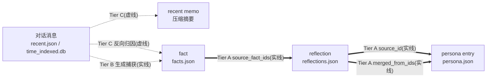

# P27 记忆溯源可视化 (Memory Trace / Lineage) — 蓝图

> **Single Source of Truth**. 本文件是 P27 阶段的**唯一权威规格**. `PLAN.md` 条目 `p27_memory_trace` 只是索引; `PROGRESS.md` 和 `AGENT_NOTES.md` 里的描述都应以本文件为准.
>
> **阶段号 / smoke 前缀说明**: 维护期文档 (`PLAN.md` v1.1-maintenance-window 节) 把下一开发阶段统称 "P27+", 故本阶段取**阶段号 P27**. 但 smoke 文件前缀 `p27`–`p31` 已被 2026-06 上游同步的 5 个记忆语义合约 adapter smoke 占用 (evidence/recall_fusion/refine/anti_repeat/topic), smoke 计数器与开发阶段号自此分叉. **本阶段新增 smoke 一律用前缀 `p32_` 起**接续单调计数器, 与阶段号 P27 不强求一致 (与 P26→p26 不同, 这是已知的有意偏移, 详见 §8.4).
>
> **动因 (2026-06-29)**: 用户在维护期主动下达新需求 (信号 A) — "对当前框架下的记忆系统浏览相关内容作大幅度新增填充: 设计一个可视化方案, 让开发人员更直观地分析当前角色记忆的**组成**和**来源**. 除记忆内容本身的显示外, 还要得到这条记忆**如何生成**、整个记忆**如何组成**, 并对记忆进行**对话级别的溯源**. 设计一个类似流程图 / 流水线图 (UI 类似 Blender shader 渲染界面) 的节点机制, 让开发人员从一条条对话开始往下走, 看清楚一条记忆具体怎么被生成、对记忆系统产生了什么影响; 允许追踪某条特定记忆的生成过程历史, 或总览整个记忆的变迁历史. 对所有记忆内容 (事实 / 反思 / 人设等) 可用. UI 要求简洁清晰容易使用."
>
> 用户两项关键决策 (2026-06-29 AskQuestion): **放置 = 顶层第 6 个全屏 Workspace**; **对话级溯源 = 进一步研究"能否结合对话内容 + 记忆生成机制重建溯源"** (见 §2 可行性结论).

---

## 1. 目标与边界

### 1.1 核心目标

让开发人员能在一个**节点流水线图** (类 Blender shader 编辑器) 里, 回答关于当前角色记忆的**四个问题**:

1. **组成 (Composition)**: 当前角色的记忆由哪些部分组成? 各层 (对话 / recent 摘要 / facts / reflections / persona) 各有多少条、什么状态?
2. **来源 (Provenance)**: 某条记忆 (尤其 fact / reflection / persona entry) 是从**哪些上游**来的? 一条 reflection 吸收了哪些 fact? 一条 persona entry 来自哪条 reflection?
3. **生成史 (Generation history)**: 某条特定记忆是**怎么被一步步生成**的? 从对话开始往下走, 经过了哪些 op (extract / reflect / promote)?
4. **变迁史 (Evolution overview)**: 总览整个记忆的变迁 — 哪些 fact 被吸收、哪些 reflection 被晋升 / 否决 / 合并、随时间如何演化?

### 1.2 范围内 (In-Scope)

- **顶层第 6 个 Workspace** `memory_trace` (全屏画布), 与 setup / chat / evaluation / diagnostics / settings 同级.
- **纯只读聚合后端**: 单一 chokepoint 把当前 active session 角色的 4 份记忆 JSON (+ 若存在的 `events.ndjson` / `time_indexed.db` / Tier-B 侧车) 聚合成稳定的 `{nodes, edges, meta}` 溯源快照.
- **节点流水线图前端**: 纯原生 SVG (无第三方图库 / 无构建链), 分层布局 (对话 → recent → facts → reflections → persona 从左到右), pan / zoom, 节点卡片 + 贝塞尔连线.
- **两种用户要求的模式**: (a) **聚焦溯源** — 点一个节点, 高亮其全部上游来源 + 下游影响子图, 其余淡化, 右侧详情面板展开该记忆的"如何生成 + 变迁"; (b) **总览** — 完整 DAG, 可切"时间轴"布局按 `created_at` 排.
- **三层溯源数据模型** (§2 核心): Tier A 结构化真因果 (实线) / Tier B 生成时捕获 (实线, 面向未来新生成的记忆) / Tier C 反向归因 (虚线, 按需, 对旧数据).
- **对所有记忆类型可用**: facts / reflections / persona entries / persona corrections / recent memo / 对话消息 全部可作节点.

### 1.3 范围外 (Out-of-Scope, 明文约束)

避免本阶段成为"无限扩张筐" (沿用 P22/P24/P25 哲学):

- **不改动主程序**: 不修改 `memory/*.py`、不让主程序写新字段、不让主程序 emit 新事件. 全部基于现有持久化数据 + testbench 侧的聚合 / 捕获.
- **不复现主程序记忆运行时机制** (§2.1 语义契约 vs 运行时机制, L25): 不模拟 embedding worker / event_log reconciler / outbox 投递 / evidence 半衰期实时 decay / FTS5 索引. 图展示的是"数据形状与因果关系" (WHAT), 不是"运行期怎么算" (HOW).
- **不冒充不存在的因果**: fact → 具体源对话 在现有持久化数据里**没有**字段 (见 §2). 任何无法从已落盘数据可靠得出的连接, 一律画**虚线**并标注"重建 / 启发式", 绝不画成实线真因果.
- **不做图编辑**: 本阶段是**只读可视化** (浏览 / 溯源 / 分析). 不在图上增删改记忆 (编辑仍走现有 Setup → Memory 四子页). Tier C 归因是"分析", 不写回记忆 JSON.
- **不引入前端图库 / 构建链**: 不加 d3 / cytoscape / mermaid 运行时 / npm / webpack. 参考现有纯 SVG 先例 (`page_aggregate.js` 的 `svg()` 工厂).
- **不做跨 session / 多角色对比**: 只可视化**当前 active session 的当前角色** (testbench 单活跃会话约束, ARCH §1.2 #1).
- **不做实时刷新流 (SSE)**: 聚合是请求-响应 `GET`; 数据变更靠事件总线 `session:change` / memory commit 事件触发整图重拉 (L23 类别 1).

### 1.4 现有数据能支撑到什么程度 (诚实声明)

| 目标 | 数据支撑 | 在图上的表现 |
|---|---|---|
| reflection ← facts | `reflections[].source_fact_ids` 已落盘 | **实线** (Tier A) |
| persona entry ← reflection | `persona.facts[].source="reflection"` + `source_id` / `merged_from_ids` 已落盘 | **实线** (Tier A) |
| fact 是否已被吸收 | `facts[].absorbed` 已落盘 | 节点状态徽章 (Tier A) |
| fact / reflection ← 具体源对话 | **无任何字段** (只有 `created_at`) | testbench 新生成的记忆: **实线** (Tier B 捕获生成窗口); 旧 / 导入的记忆: **虚线** (Tier C 反向归因) 或留空 |
| recent 摘要 ← 被压缩的原文 | **无字段** (原文被物理替换) | 虚线 + "已压缩离开 recent 窗口" ghost 提示 |
| reflection 的 evidence / 状态变迁时间线 | `events.ndjson` (主程序生产 emit, **testbench 自身不 emit**) | **仅当 `events.ndjson` 存在** (导入的真实角色) 才有 evidence 时间线; testbench 原生记忆只能用 JSON status 字段重建粗粒度变迁 |

---

## 2. 可行性结论 · 三层溯源数据模型 (核心)

> 用户对"对话级溯源"的反问是: **能否结合对话内容 + 记忆生成机制来重建溯源?** 通读 `tests/testbench/pipeline/memory_runner.py` (testbench 的 facts.extract / reflect / recent.compress 实现) 与主程序 `memory/facts.py` / `memory/reflection.py` / `memory/timeindex.py` 后, 结论是: **能, 靠"生成机制 (Tier B) + 对话内容 (Tier C)"两条腿, 但必须诚实分层.**

### 2.1 设计原则: 语义契约 vs 运行时机制

> 权威来源: [`LESSONS_LEARNED §1.6`](LESSONS_LEARNED.md) + cursor skill `semantic-contract-vs-runtime-mechanism`.

溯源图复现的是记忆的**语义关系** (谁来自谁、谁吸收了谁、何时生成), **不复现**主程序的运行期投递 / 计算机制. 任何"为了画一条边而要去模拟主程序 runtime 行为"的冲动都属漂移, 必须 OOS.

### 2.2 三层溯源 (Tier A / B / C)



- **Tier A — 结构化真因果 (默认开, 零成本, 实线)**
  - 数据来源: `reflections[].source_fact_ids` → `facts[].id`; `persona.facts[].source_id` / `merged_from_ids` → `reflections[].id`; `facts[].absorbed` 状态.
  - 这是图的**主干**, 对任何角色 (testbench 原生 / 导入真实) 都能画, 100% 可靠.

- **Tier B — 生成时捕获 (可选, 面向未来新生成的记忆, 实线)**
  - 关键洞察: testbench 的 `facts.extract` / `reflect` / `recent.compress` 在 commit 时, **输入对话窗口是完全已知的** (`_preview_facts_extract` 从 `session.messages` 或 `recent.json` 取整窗喂 LLM). 这是捕获对话级溯源的天然 chokepoint.
  - 但 LLM 返回扁平 fact 列表, **不告诉**哪条对话产生哪条 fact. 故 Tier B 给的是**批次级**实线 (一批 fact ← 一个对话窗口), 不是逐条.
  - 落地: commit 时把当时输入窗口的 message 指纹 (content_sha + role + preview) 写入**侧车账本** `trace_provenance.json` (testbench 专用文件名, 主程序不读, 向后兼容). 见 §6.3.
  - **侧车是 advisory (建议性), 非权威**: 读侧按 id 重新对齐 (fact 还在才画 generated 边); 直接经 Setup → Memory raw 编辑器增删 fact 会让侧车条目失配, 聚合器必须容忍并标记 (§6.2 + R1).

- **Tier C — 反向归因 (按需, 显式, 对旧 / 导入数据, 虚线)**
  - 对没有 Tier B 记录的记忆, 节点上提供「分析来源」按钮 → `POST /api/memory/lineage/attribute`.
  - 用对话语料 (recent.json + time_indexed.db turns) 做归因: 先**文本相似度** (免费, 默认); 可选 **LLM 精判** (走 memory 组配置, stamp `wire_tracker source="memory.llm"`, 见 R2).
  - 结果画**虚线** + 标 confidence, 明确"重建 / 启发式", 绝不冒充真因果.

### 2.3 节点与边 schema (聚合快照)

聚合器产出: `{ nodes: [...], edges: [...], meta: {...} }`.

**Node** (稳定 shape, 前端只消费不推断 — L36 §7.25):
```
{
  id: string,            # 见下方各类型 id 规则
  type: "message" | "recent_memo" | "fact" | "reflection" | "persona_entry" | "correction",
  lane: int,             # 0=对话 1=recent 2=facts 3=reflections 4=persona (布局用)
  label: string,         # 截断后的展示文本 (i18n 无关, 来自记忆内容)
  status: string|null,   # reflection: pending/confirmed/promoted/...; fact: absorbed/active
  entity: string|null,   # master/neko/relationship/world
  created_at: string|null,
  meta: { ... },         # 类型相关原始字段 (importance / source / tags / feedback ...)
  warnings: string[]     # 该节点的软错 (如 "Tier B 侧车失配")
}
```
- `message` 节点 id = `msg:{sha256(role+content)[:12]}` (内容哈希; recent.json 无稳定 message id, 见 R4); 若来自 time_indexed.db, id = `tdb:{session_id}:{rowidx}`.
- 其余节点 id 直接用各 JSON 里的 `id` 字段.

**Edge** (带 confidence):
```
{
  source: nodeId, target: nodeId,
  relation: "source_fact" | "promoted_from" | "merged_from" | "compressed_from"
          | "extracted_from" | "attributed_from",
  confidence: "persisted" | "captured" | "heuristic",   # 实线: persisted/captured; 虚线: heuristic
  score: number|null,    # Tier C 归因相似度/置信分
  note: string|null
}
```

**Meta**:
```
{
  character: string,
  counts: { messages, facts, reflections, persona, corrections },
  sources_present: { events_ndjson: bool, time_indexed_db: bool, trace_provenance: bool },
  file_warnings: string[],   # 某个 JSON 读失败的软错 (图局部渲染)
  node_budget: { total, shown, truncated: bool }   # R5 节点预算
}
```

### 2.4 加载链路核查结论 (2026-06-29, 决定性)

> **动因**: 用户指出真实用途更可能是"**加载主程序里的人格记忆 → 考察其记忆生成过程**", 并怀疑"现有加载系统压根不加载 SQL 对话信息文件 (`time_indexed.db`)", 要求详查能否满足"加载外部人格 + 对话级溯源"的需求. 核查 `persona_router` / `persistence` / `prompt_builder` / `snapshot_store` / `timeindex` 后结论如下.

| 链路 | 事实 | 对 P27 的影响 |
|---|---|---|
| **导入真实角色** `import_from_real` ([persona_router.py](../routers/persona_router.py) L607) | 用 `_copytree_safe(real_memory/{name}, sandbox_memory/{name})` 即 `rglob("*")` **递归拷贝该角色 memory 目录全部文件**; `_KNOWN_MEMORY_FILES`(L112-121) 明列 `time_indexed.db`. 故 `time_indexed.db` / `events.ndjson` **已物理落入沙盒**. | Tier C 对话语料**已在磁盘上**, P27 **无需改导入系统**. |
| **当前对 db 的消费** | 全仓唯一 db 读者是 [prompt_builder.py](../pipeline/prompt_builder.py) L485 构造 `TimeIndexedMemory`, 但仅调 `get_last_conversation_time()`(L350) 取**最后对话时间戳**做"距上次对话"提示. **对话原文从未被任何 testbench 功能解析/呈现**. | 用户"加载系统不读 db"判断**在'被消费'这层成立**; P27 是 db 对话内容的**第一个消费者**, 必须自带读取器 (见 P27.0). |
| **可复用只读接口** | 主程序 [timeindex.py](../../../memory/timeindex.py) L378 `retrieve_original_by_timeframe(name, start, end, limit_rows)` 返回 `[(ts, session_id, message), ...]` 升序; `_ensure_engine_exists(name, readonly=True)`(L343) 支持**只读**打开; `cleanup()`(L245) 释放引擎句柄. | P27.0 读取器直接复用, 不裸写 SQL. |
| **缺口 1: 存档丢重 db** | [persistence.py](../pipeline/persistence.py) `pack_memory_tarball` 打包 `memory/` 但单文件 `>10 MiB` (`_MAX_FILE_BYTES` L139) **静默跳过**. 重度真实角色 `time_indexed.db` 可能超限. | 导入后**存档→读档**会丢对话语料 → Tier C 变空. 需软处理 + 决策项 (§6.7). |
| **缺口 2: 预设无 db** | 内置预设目录不带 `time_indexed.db`; `import_builtin_preset` 只拷预设自带文件. | 预设角色 Tier C 必为空 (符合预期), UI 软处理空态. |
| **快照含 db (旁证)** | `snapshot_store._walk_memory_files`(L238) 递归把 memory 全目录 base64 入快照 (≤10 MiB). | 快照保真不丢 db; 但快照是 blob, 非解析源, 与 P27 无直接耦合. |

**一句话结论**: 需求**可满足且不必改导入系统** — 数据导入时已落盘, 缺的只是一个"读对话原文"的消费者. P27 因此新增 **P27.0 只读对话语料读取器** (下文 §5), 并对 db 缺失/锁定/存档丢失三类边界一律软处理.

---

## 3. 设计原则

1. **单一只读 chokepoint** (L6 / L36 §7.25): 图的 shape 只在 `pipeline/memory_lineage.py::build_lineage_snapshot(session)` 一处组装; 前端**不**从 4 个 JSON 各自推断再拼. 任何字段名 / envelope 改动以聚合器为准, smoke 锁契约.
2. **诚实分层** (§2.2): 实线 = 已落盘 / 已捕获的真因果; 虚线 = 重建 / 启发式. 视觉上严格区分, 详情面板标注 confidence.
3. **只读, 不改记忆** (§1.3): 浏览 / 溯源 / 分析三件事, 不写回 4 份记忆 JSON. 唯一写盘是 Tier B 侧车 (走 atomic_io, 由 memory commit 触发).
4. **软错优先** (§3A A1): 单个文件读失败 → 字段级软错 + 200 + `file_warnings`, 图局部渲染; 整 session 无效 / 无角色才 4xx (沿用 memory_router 的 404 无 session / 409 无角色).
5. **状态驱动全量重渲染** (B1): `session:change` / memory commit 事件 → `renderAll()` 整图重建, 不做 partial patch; 订阅必有 `host.__offXxx` teardown (L18).
6. **文案全走 i18n, JS 无非 ASCII 字面量, 新文件注释用英文** (L32 编码纪律): 节点 type 用稳定英文 id + 中文 label.
7. **不复现主程序 runtime** (§2.1 / L25): 见 §1.3.
8. **简洁清晰优先** (用户硬要求): 默认进**聚焦模式** + 节点预算 + 过滤, 不一上来糊一屏几百节点 (R5).

---

## 4. 数据流总览

```mermaid
flowchart LR
  subgraph data [active session sandbox memory dir]
    recent[recent.json]
    facts[facts.json]
    refl[reflections.json]
    persona[persona.json]
    corr[persona_corrections.json]
    events["events.ndjson (若存在)"]
    tdb["time_indexed.db (若存在)"]
    prov["trace_provenance.json (Tier B 侧车, 可选)"]
  end
  agg["pipeline/memory_lineage.py<br/>build_lineage_snapshot(session)<br/>单一只读 chokepoint"]
  api["GET /api/memory/lineage<br/>POST /api/memory/lineage/attribute"]
  ws["workspace_memory_trace.js<br/>纯 SVG 节点流水线图"]
  data --> agg --> api --> ws
```



---

## 5. 分阶段交付

### P27.0 — 只读对话语料读取器 (核查后新增的关键拼图, ~0.4 天)

> 由 §2.4 核查得出: `time_indexed.db` 导入时已落盘, 但无任何 testbench 功能读其对话原文. P27 的对话级溯源 (Tier C) 依赖一个**专用只读读取器**, 故独立成 P27.0, 是 P27.1 聚合器与 P27.3 归因的共同底座.

**交付物**:
- 新建 `tests/testbench/pipeline/conversation_corpus.py`:
  - `load_conversation_corpus(character, *, memory_dir, window=None, limit_rows=None) -> {turns: [...], source: "...", warnings: [...]}` 纯只读函数.
  - **复用主程序** `TimeIndexedMemory.retrieve_original_by_timeframe` + `_ensure_engine_exists(..., readonly=True)`; **强制 try/finally `cleanup()`** 释放 SQLAlchemy 引擎句柄 (Windows 文件锁是已知雷区 — snapshot_store / reset_runner / session_router 均为它打补丁; 读完不释放会阻塞后续 snapshot/reset 的 rmtree).
  - 解析 `message` JSON (`{"type", "data":{"content"}}`, schema 见 `utils/llm_client.SQLChatMessageHistory`) → 归一化 `[{ts, session_id, role, content}]`.
  - **软处理三类边界** (§2.4): db 不存在 (预设/从未对话) / 表为空 / 打开失败 → 返回空 `turns` + `warnings`, **绝不抛**.
  - message 节点稳定 id (与 §2.3 R4 一致): `tdb:{session_id}:{rowidx}` 或内容哈希派生, 保证多次聚合一致.
  - 同时统一 recent.json 对话读取 (banner 过滤复用 L53), 让聚合器只依赖本读取器一个入口.

**验收点**: 对一个导入了真实角色 (含 `time_indexed.db`) 的沙盒能读出对话原文; 对预设角色 / 无 db 沙盒返回空语料 + warning 不崩; 读取后 db 句柄已释放 (随后可 snapshot/reset 不报锁).

### P27.1 — 后端聚合器 (Tier A) + 端点 + smoke (~0.8 天)

**交付物**:
- 新建 `tests/testbench/pipeline/memory_lineage.py`:
  - `build_lineage_snapshot(session) -> dict` 纯函数. 复用 `memory_runner` 的 `_read_json_list` / `_read_json_dict` / `_memory_dir` (或下沉为共享 helper); 读侧消息复用 banner 过滤 (L53).
  - Tier A 边: `source_fact_ids` / `source_id` / `merged_from_ids`; fact `absorbed` 状态.
  - 对话 lane: **统一经 P27.0 `conversation_corpus.load_conversation_corpus`** 读 recent.json + (若存在) `time_indexed.db` turns → message 节点; 聚合器自身不再裸开 db / 裸读 JSON 消息.
  - `sources_present` / `file_warnings` / `node_budget` 填充 (`time_indexed_db` 标志由读取器的 `source` 回报).
- 新建 `tests/testbench/routers/lineage_router.py` (prefix `/api/memory`, 或并入 `memory_router.py`):
  - `GET /api/memory/lineage` → snapshot (404 无 session / 409 无角色, 对齐 memory_router 空态).
  - 在 `server.py` `include_router`.
- 新建 `tests/testbench/smoke/p32_memory_lineage_smoke.py`:
  - fixture 角色 (facts + reflections with source_fact_ids + persona with source_id) → 断言 snapshot 的实线边精确匹配; 断言 node/edge shape 字段名稳定 (锁前端契约); 断言缺 reflections.json 时图仍局部渲染 (软错); 断言无 session → 404 / 无角色 → 409.
  - **db 两态** (§2.4): (a) 构造含 `time_indexed.db` 的沙盒 → 断言对话 lane 有 message 节点 + `sources_present.time_indexed_db=true` + 读后无残留句柄锁; (b) 无 db 沙盒 → 对话 lane 仅 recent.json + 标志 false, 不崩.
- (可与上合并) P27.0 读取器单测: 复用主程序 db 写入一条对话, 经 `load_conversation_corpus` 读回并断言归一化结构 + cleanup 后可删除 db 文件 (验证句柄已释放).

**验收点**: `GET /api/memory/lineage` 对预设 + 跑过 reflect 的角色返回正确 Tier A DAG; 节点/边 shape 与 §2.3 一致.

### P27.2 — 前端 Workspace + SVG 节点图 (总览 + 聚焦) + 详情面板 (~1.5 天)

**交付物**:
- 新建 `tests/testbench/static/ui/workspace_memory_trace.js`: `mountMemoryTraceWorkspace(host)`; 订阅 `session:change` + memory commit 事件刷新; 标准 teardown (`host.__offXxx`); 事件 → `renderAll()` 全量重绘.
- 新建 `tests/testbench/static/ui/memory_trace/`:
  - `graph_canvas.js` — SVG `viewBox` 平移 / 滚轮缩放; 节点卡片 (颜色 / 徽章按 type + status + confidence); 贝塞尔连线 (实线 / 虚线区分).
  - `layout.js` — 分层 DAG (lane 0→4 从左到右); 另含"时间轴"布局按 `created_at`.
  - `detail_panel.js` — 单节点详情: 全文 / source tag / created_at / status; 变迁时间线 (若 `events.ndjson` 存在); 生成它的 LLM prompt (Tier B 侧车 / `last_llm_wire`); Tier C 归因结果占位 (P27.3 接入).
  - `toolbar.js` — 模式切换 (总览 / 聚焦); 过滤 (entity / type / status / 时间范围); 节点预算"显示更多".
- 在 `app.js` `WORKSPACES` 加第 6 项 `{ id:'memory_trace', labelKey:'tabs.memory_trace', mount: mountMemoryTraceWorkspace }`.
- `i18n.js` 加 `tabs.memory_trace` + `memory_trace.*` (节点 type 用英文 id + 中文 label; 函数型文案 `_fmt` 后缀).
- `testbench.css` 加 `.memory-trace-*` (grid 子元素数注意 L3).
- **文档同步 (必做, 否则 smoke 红 — 见 R9/R10)**: `testbench_USER_MANUAL.md` §2 workspace 数 5→6 + 新增 memory_trace 小节; 更新 `p26_docs_endpoint_smoke.py` D14 锁的 "5 workspace" 断言 → 6.
- 新建 `tests/testbench/smoke/p33_memory_trace_ui_smoke.mjs`: jsdom mount workspace + 喂 mock snapshot → 断言 SVG 节点/边数与 snapshot 一致; 聚焦模式高亮子图; teardown 不泄漏 listener.

**验收点**: 顶层第 6 tab 可见; 总览能画出当前角色完整 DAG; 点一个 reflection 节点高亮其 source facts + 下游 persona, 其余淡化, 右侧详情展开; 切 session 整图刷新.

### P27.3 — Tier C 反向归因 (~0.7 天)

**交付物**:
- `lineage_router.py` 加 `POST /api/memory/lineage/attribute` (body: `node_id` + 可选 `use_llm: bool`):
  - 文本相似度归因 (默认, 免费): 对话语料 vs 目标记忆 text, 返候选 message + score.
  - LLM 精判 (可选): 走 memory 组配置, **必须** `record_last_llm_wire(source="memory.llm")` (R2, 否则 `p25_llm_call_site_stamp_coverage_smoke` 变红); source 加入 KNOWN_SOURCES 白名单; 属 memory 域不污染 chat preview (L44 / p25_r7 分区 smoke).
- 前端节点「分析来源」按钮 → 调端点, 把候选画成**虚线**边 + confidence badge.
- 扩 `p32_memory_lineage_smoke.py` 或新建 `p34_lineage_attribute_smoke.py`: 文本相似度路径 mock; 断言 LLM 路径有 wire stamp; 断言虚线 confidence=heuristic.

**验收点**: 对一条无 Tier B 记录的 fact 点「分析来源」, 文本相似度返回候选对话并画虚线; LLM 模式有 wire 记录且不污染 Chat preview.

### P27.4 (可选) — Tier B 生成时捕获 (~0.5 天)

**交付物**:
- `memory_runner.py` 的 `_commit_facts_extract` / `_commit_reflect` / `_commit_recent_compress` 末尾追加侧车写入 `trace_provenance.json` (走 `atomic_io`; preview 阶段**不**写盘):
  - 记录 `{generated_ids, op, source, input_window:[{role, content_sha, preview}], wire_note, committed_at}`.
- 聚合器读侧车 → 画 `captured` 实线 (按 id 重新对齐, 失配则跳过 + 节点 warning, R1).
- 扩 smoke: commit 后侧车结构正确; raw 编辑器删 fact 后聚合器跳过失配条目不报错.

**验收点**: 跑一次 facts.extract commit 后, 该批 fact 在图上有连回输入对话窗口的实线 (captured).

### P27.5 — 文档同步 + 全量 smoke 收口 (~0.3 天)

- `PLAN.md` `p27_memory_trace` 状态 done + 快照段; `PROGRESS.md` 阶段详情 + changelog; `AGENT_NOTES.md §4` 追加踩坑; `CHANGELOG.md` v1.3.0 bump (维护期版本号范式).
- 全量 smoke (p00 静态门 / `_run_all` / p33 UI) 全绿; baseline 从 18/18 → 新增 p32/p33(/p34) 后的数字.

---

## 6. 关键技术决策

### 6.1 放置: 顶层第 6 Workspace (用户决策)
全屏画布最适合大图 + pan/zoom. 代价: 动 `app.js` WORKSPACES + USER_MANUAL workspace 数 + D14 smoke (R9). 已纳入 P27.2 交付物.

### 6.2 Tier B 侧车 advisory, 读侧 by-id 对齐 (R1)
`trace_provenance.json` 不是权威源. 记忆 JSON 可被 raw 编辑器 (`memory_router` PUT) 直接改, 绕过 memory_runner. 故聚合器: 仅当侧车条目的 `generated_id` 在当前 facts/reflections 里仍存在, 才画 captured 边; 失配条目静默跳过 + 给对应节点 (若存在) 一条 warning. 不因侧车 stale 而报错或污染图.

### 6.3 侧车放 memory 目录 vs 别处
放 `{memory_dir}/{character}/trace_provenance.json`: 跟记忆同生命周期, 随 session 导出 tar 一并带走, 主程序忽略未知文件名. 是 testbench_data 运行时数据 (符合代码/数据分离). 不放 session 对象 (session 是单次运行态, 记忆跨运行持久).

### 6.4 events.ndjson / time_indexed.db 仅"若存在"消费 (R3)
testbench 自身的 memory op 直接写 JSON, **不 emit** `events.ndjson`, 也无 memory_server turn loop 写 `time_indexed.db`. 故这两者只在**导入真实角色**时才有数据. evidence / 状态变迁时间线对 testbench 原生记忆**为空**, 详情面板需明示"无 events.ndjson, 变迁史由 JSON status 字段重建 (粗粒度)".

### 6.5 对话语料的范围 + 只读读取器 (P27.0)
对话节点 = recent.json messages ∪ (若存在) time_indexed.db turns ∪ (聚合器参数可选) session.messages, 按内容哈希去重. **统一经 P27.0 `conversation_corpus.load_conversation_corpus` 一个入口读取**, 聚合器与 Tier C 归因都不裸开 db. 读取器**必须只读打开 + try/finally cleanup 释放句柄** (Windows 锁雷区, §2.4). 对**导入的真实角色** (用户主用途), session.messages 通常为空, recent.json 仅压缩窗口, 故 `time_indexed.db` 是对话原文的**主要来源** — 这正是 Tier C 对话级溯源的语料根基. Tier B 记录当时实际用的 source; Tier C 归因对全语料做.

### 6.7 缺口 1 决策: 重 db 存档被静默跳过 → 方案 A (已定案, 2026-06-29)
§2.4 缺口 1: `pack_memory_tarball` 对 `>10 MiB` 单文件静默跳过, 重度真实角色 `time_indexed.db` 存档→读档后会丢. **用户决策 (2026-06-29): 走方案 A** — 理由"应该不会有太大的存档需求".
- **方案 A (采纳)**: **不动 persistence / 不改 `_MAX_FILE_BYTES`**; 仅在 P27 UI 空态文案 + USER_MANUAL 警示"导入后直接分析对话溯源; 重度角色 db 可能因存档大小上限而不随存档/读档保留, 如需溯源请重新从真实角色导入". 成本最小, 不碰已冻结的存档格式.
- ~~方案 B (否决)~~: 提高/豁免 db 的 `_MAX_FILE_BYTES`; 波及 persistence 哈希校验 + tar 上限语义, 风险高于本期收益.

落地: P27.2 空态文案 + P27.5 USER_MANUAL 警示句各一处. 聚合器对"db 缺失"本就软处理 (空 Tier C + warning), 方案 A 下无额外代码改动, 仅文案.

### 6.6 节点预算与默认聚焦 (R5, 服务"简洁"硬要求)
真实角色可能有上百 fact + reflection. 默认进**聚焦模式** (选中一条记忆 + 其 1-2 跳邻域); 总览模式带 `node_budget` (默认上限如 200 节点) + 过滤 + "显示更多". 布局避免 O(n^2) 连线交叉计算.

---

## 7. 风险与缓解

| 风险 | 可能性 | 影响 | 缓解 |
|---|---|---|---|
| 前端从多 JSON 自拼 shape 致漂移 | 中 | 中 | 单一聚合 chokepoint + smoke 锁 node/edge shape (R6 / L36 §7.25) |
| 把"对话级溯源"画成假实线 | 中 | 高 | 三层 confidence + 虚线严格区分 + 详情标注 (§2.2 / R 系列) |
| Tier B 侧车 stale (raw 编辑器绕过) | 中 | 低 | advisory + by-id 对齐 + 失配跳过 (R1 / 6.2) |
| 新增第 6 workspace 撞 D14 smoke / USER_MANUAL | **高** | 中 | P27.2 必同步改 USER_MANUAL workspace 数 + D14 断言 (R9/R10) |
| Tier C LLM 调用漏 wire stamp 致 p25 stamp smoke 红 | 中 | 中 | 端点强制 `record_last_llm_wire(source="memory.llm")` + KNOWN_SOURCES 白名单 (R2) |
| 大图卡顿 / 太乱违背"简洁" | 中 | 中 | 默认聚焦 + node_budget + 过滤 + 纯 SVG 懒渲染 (R5 / 6.6) |
| events.ndjson 缺失致"变迁史"空 | 高 | 低 | 明示仅导入角色有; 原生记忆用 JSON status 重建 (R3 / 6.4) |
| P27.0 读 db 不释放句柄, 阻塞后续 snapshot/reset rmtree (Windows 锁) | **高** | 中 | 读取器只读打开 + try/finally `cleanup()`; smoke 断言读后可删 db (R11 / §2.4 / 6.5) |
| 重 db 存档→读档被静默丢弃致 Tier C 空 (缺口1) | 中 | 中 | **方案 A 定案**: 不改 persistence, 聚合器软处理空语料 + UI/手册警示 (§6.7) |
| 用户误以为预设角色也应有对话溯源 (缺口2) | 中 | 低 | 预设无 db 属预期, UI 空态明示"该角色无对话归档 (预设/未对话)" (§2.4) |
| CJK 编码损坏 (L32) | 中 | 中 | 全文案走 i18n; 新 JS 注释英文; 改中文文件只用 UTF-8 写工具, 禁 PowerShell Set-Content |

---

## 8. 与现有阶段 / 维护期的关系

### 8.1 维护期信号
本阶段由用户主动下达新需求 (信号 A) 触发, 从 v1.1-maintenance-window 临时退回开发期 (PLAN.md "重启开发的信号触发 checklist").

### 8.2 复用现有能力
- `memory_runner` 的读写 helper + preview/commit 哲学 + `last_llm_wire` stamp 基础设施.
- `page_aggregate.js` 的纯 SVG `svg()` 工厂模式.
- `memory_router` 的 404/409 空态语义 + `atomic_io` 落盘 chokepoint.
- 事件总线 `state.js` (on/emit/set) + workspace 懒挂载 + i18n.

### 8.3 冻结决策不逆转 (只扩展)
不动单活跃会话 / 代码-数据分离 / Preview-Commit / SSE-error-frame-first / 软错vs硬错 / 状态驱动 renderAll 等已冻结约定 (AGENT_NOTES §3 / §3A).

### 8.4 smoke 前缀偏移 (已知有意)
阶段号 P27, smoke 前缀 `p32+`. 原因: p27–p31 已被上游 adapter smoke 占用 (见文首). 这是 smoke 单调计数器与开发阶段号的有意分叉, 不视为命名 bug.

### 8.5 文档同步影响 (重要)
新增第 6 workspace **必然**触动: `testbench_USER_MANUAL.md` (§2 "5 workspace" → 6 + 新小节) 与 `p26_docs_endpoint_smoke.py` D14 (锁 "5 workspace" tester-fact). 不同步则 D14 smoke 变红. 已列入 P27.2 交付物 + §7 风险表.

---

## 9. 开工门禁

进入 P27 编码前必须满足:

- [x] 用户下达新需求 + 两项关键决策 (顶层 workspace / 进一步研究对话级溯源) 已确认 (2026-06-29).
- [ ] 用户对本蓝图 (尤其 §2 三层溯源诚实声明 + §2.4 加载链路核查 + §6.7 缺口1 决策项 + §8.5 文档同步影响) 审读通过.
- [ ] **§A 设计审查 gate 完成** (本文件 §A, 若干轮自我审查 + 矫正回写 §1-§8).
- [ ] 开工第一步先跑一次全量 smoke 作 baseline (维护期纪律: 绿了再动).

---

## 10. 交付后入档事项

- `PLAN.md` — `p27_memory_trace` 状态 done + 快照段更新.
- `PROGRESS.md` — 阶段总览 + 详情 + changelog.
- `AGENT_NOTES.md §4` — 实际踩坑 + 任何新元教训候选.
- `CHANGELOG.md` — v1.3.0 (新 workspace + 记忆溯源可视化).
- `LESSONS_LEARNED §7.A` — 候选元教训 (如有, 见 §A.4).
- 视情况新增 tester 手册段落 (溯源页使用说明).

---

**变更日志**:
- 2026-06-29 初版创建 (基于维护期用户新需求 + 4 并行探查子代理调查 + 用户 2 项关键决策).
- 2026-06-29 加载链路核查修订: 经用户质询 ("加载主程序人格→考察记忆生成; 怀疑加载系统不读 db") 详查 persona_router / persistence / prompt_builder / snapshot_store / timeindex, 新增 §2.4 核查结论 (db 导入已落盘但无消费者) + §5 P27.0 只读对话语料读取器 + §6.5/§6.7 + §7 三条风险 + §A R11. 结论: 需求可满足且无需改导入系统.

---

## §A 开工前设计层回顾 (Design Review Gate, 2026-06-29)

> **权威性**: 本节是 P27 开工前的 design review gate. 列出的设计层矫正必须回写到 §1-§8 才能开工.
>
> **方法论**: 沿用 P24/P25 的多轮元审核范式 (参考 [`P25_BLUEPRINT §A`](P25_BLUEPRINT.md)), 对本蓝图 §1-§10 做思想实验, 交叉核对 `LESSONS_LEARNED §7` 元教训 / `AGENT_NOTES §3A` 设计原则, 并以**用户原始需求**为设计初衷锚点防止漂移.

### §A.1 第一轮 — 框架交叉核查 (meta-audit)

下表是对照 LESSONS / §3A 发现的设计层矫正, 已回写到正文对应处:

| # | 审核维度 | 问题 | 正确语义 | 落地处置 | 严重度 |
|---|---|---|---|---|---|
| **R1** | L6 单写者 / advisory 数据源 | Tier B 侧车若当权威源, 会与 raw 编辑器直接改 facts.json 冲突 (绕过 memory_runner) | 侧车是 advisory, 非权威; 记忆 JSON 才是真相 | §6.2 + §2.2: 读侧 by-id 对齐, 失配跳过 + 节点 warning, 不报错 | ❗ 高 |
| **R2** | L43 LLM 调用点必 stamp | Tier C 的 LLM 归因若漏 `record_last_llm_wire`, `p25_llm_call_site_stamp_coverage_smoke` 立即变红 | 所有 `.ainvoke` 前必有 wire stamp 或 NOSTAMP sentinel | §5 P27.3 + §7: 强制 stamp `source="memory.llm"` + 入 KNOWN_SOURCES 白名单 | ❗ 高 |
| **R3** | 语义契约 vs 运行时机制 (L25) | "变迁史时间线"默认依赖 `events.ndjson`, 但 testbench 自身不 emit 该文件 | testbench 原生记忆无 events.ndjson; 仅导入真实角色才有 | §6.4 + §1.4: 明示"若存在才有 evidence 时间线", 原生记忆用 JSON status 重建粗粒度 | ❗ 高 |
| **R4** | 数据真相精确性 | recent.json 消息无稳定 id, 且 compress 会物理替换原文 | message 节点需合成 id (内容哈希); 被压缩的源对话会"消失" | §2.3: msg id = 内容哈希; §1.4 + §6.6: 压缩走的原文标 ghost / 虚线 | ⚠ 中 |
| **R5** | "简洁清晰"硬要求 vs 大图 | 真实角色上百节点, 一屏全画既卡又乱, 违背用户硬要求 | 默认聚焦 + 节点预算 + 过滤 | §3 #8 + §6.6 + §7: 默认聚焦模式, `node_budget`, 过滤优先 | ⚠ 中 |
| **R6** | L36 §7.25 跨边界 shape | 前端若从 4 JSON 自拼图 shape, 易与 memory_runner 实际 commit 路径分叉 | 单一聚合 chokepoint 产 ground-truth snapshot, 前端只消费 | §3 #1 + §5 P27.1: `build_lineage_snapshot` 唯一组装处 + smoke 锁 shape | ❗ 高 |
| **R9** | 文档-代码-smoke 一致 (L51 / D14) | 新增第 6 workspace 会破坏 USER_MANUAL "5 workspace" + p26 D14 断言 | 改 workspace 数必同步文档 + smoke | §5 P27.2 交付物 + §8.5 + §7 风险表 | ❗ 高 |
| **R11** | 加载链路核查 (2026-06-29 用户质询) | 误以为对话级溯源需改导入系统; 且读 db 若不释放句柄会阻塞 snapshot/reset (Windows 锁) | db 导入时已落盘, 缺的是消费者; 读取器须只读 + cleanup | §2.4 + §5 P27.0 + §6.5 + §7: 新增 P27.0 只读读取器, 强制 cleanup, db 缺失软处理 | ❗ 高 |

(R7/R8 编号留空, 与 P25 §A 的 R 编号体系无关, 此处仅本阶段内部连续编号; R9/R11 因其重要性单列.)

### §A.2 第二轮 — 自审 (self-audit: 是否过度设计 / 漏项)

回头审视第一轮的矫正与正文本身:

- **R10 (新增)** — D14 不只锁 "5 workspace", 还锁 USER_MANUAL 多条 tester-fact (子页数等, PLAN §171/§177). 新 workspace 只动 workspace 计数那条, 但起草 USER_MANUAL 新小节前必须先 grep 真实结构 (skill `docs-code-reality-grep-before-draft` 四层防御), 不能照蓝图写. → 已并入 §8.5 / R9 处置.
- **过度设计审查**: Tier B (P27.4) 标记为**可选**且排在最后 — 因为它有写盘副作用 + 改 memory_runner commit 路径, 风险高于读侧聚合. Tier A+C 已能交付绝大部分价值 (结构化真因果 + 按需归因). 决策: P27.1-P27.3 为核心交付, P27.4 视需要再做, 不阻塞. (避免一上来就改 commit 写路径.)
- **OOS 收紧**: 明确"不做图编辑" (§1.3). 用户需求是"分析 / 浏览 / 溯源", 不是在图上改记忆. 防止 scope 漂移成"节点编辑器写回记忆".

### §A.3 第三轮 — 设计初衷锚定 (防漂移, 对照 L31)

以**用户原始需求**为锚点 (§A.0 动因引文), 重审是否引入了用户没要的目标:

| 锚点 (用户原话) | 当前设计是否守住 |
|---|---|
| "分析记忆的组成和来源" | ✅ Tier A 组成 + 来源主干 |
| "这条记忆如何生成 / 整个记忆如何组成" | ✅ 聚焦模式 + 详情面板生成史; 总览模式组成 |
| "对话级别的溯源" | ✅ 诚实分层 (Tier B 捕获 + Tier C 归因), 不假装 |
| "类 Blender shader 节点流水线图" | ✅ 纯 SVG 分层节点图 + pan/zoom |
| "追踪某条特定记忆生成史 / 总览整个变迁史" | ✅ 聚焦 / 总览双模式 |
| "对所有记忆 (事实/反思等) 可用" | ✅ facts/reflections/persona/corrections/memo/message 全覆盖 |
| "UI 简洁清晰容易使用" | ✅ R5 默认聚焦 + 预算 + 过滤 (持续守) |
| (用户**没要**) 实时复现主程序记忆 runtime | ✅ 明文 OOS (§1.3 / §2.1) — 不漂移 |
| (用户**没要**) 在图上编辑记忆 | ✅ 明文 OOS (§1.3) — 不漂移 |
| (用户**没要**) 改主程序加溯源字段 | ✅ 明文 OOS (§1.3) — 用侧车 + 归因替代 | 

**漂移诊断结论**: 无目标漂移. Tier C 的 LLM 归因是对用户"对话级溯源"诉求的**直接回应** (用户明确反问"能否结合对话内容 + 生成机制重建"), 非自造目标; 且标记为可选 / 按需, 不自动跑、不写回, 守住"只读分析"边界.

### §A.4 派生元教训候选

- **候选 (L 待编号) "可视化/聚合类功能的诚实分层原则"**: 当把多源数据聚合成关系图 / lineage 时, 必须按"数据是否已持久化该关系"分 confidence 层 (实线已落盘 / 虚线重建), 严禁把启发式推断画成真因果. 适用: 任何 provenance / lineage / 依赖图 UI. (本阶段 §2.2 派生; 待二次同族复现再升 §7 主编号, 遵循 `.cursor/rules/lessons-candidate-promote-on-threshold.mdc`.)

### §A.5 开工清单 (矫正回写校验)

开工前确认以下矫正均已在正文落地:
1. R1 侧车 advisory by-id 对齐 → §6.2 / §2.2 ✅
2. R2 Tier C LLM 必 stamp → §5 P27.3 / §7 ✅
3. R3 events.ndjson 仅若存在 → §6.4 / §1.4 ✅
4. R4 message 内容哈希 id + 压缩 ghost → §2.3 / §1.4 / §6.6 ✅
5. R5 默认聚焦 + node_budget → §3 #8 / §6.6 ✅
6. R6 单一聚合 chokepoint + smoke 锁 shape → §3 #1 / §5 P27.1 ✅
7. R9/R10 第 6 workspace 同步 USER_MANUAL + D14 → §5 P27.2 / §8.5 ✅
8. R11 P27.0 只读读取器 (复用 retrieve_original_by_timeframe + cleanup) + db 缺失软处理 + 缺口1 已定案方案 A (不改 persistence, 仅文案) → §2.4 / §5 P27.0 / §6.5 / §6.7 ✅

**门禁判据**: 用户阅读 §2 (三层诚实声明) + §8.5 (文档同步影响) + §A (审查结论) 后回复"开工"或"修订再开工", 再进 P27.1.
