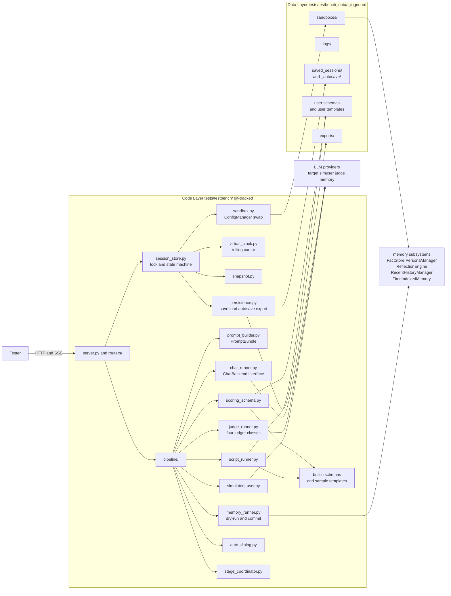
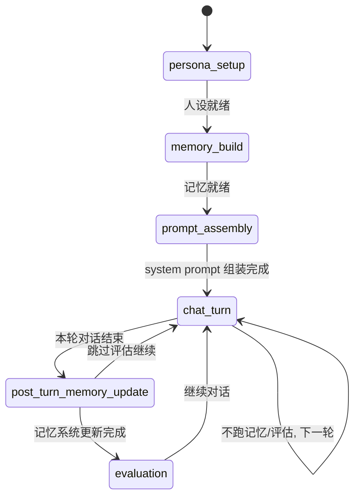
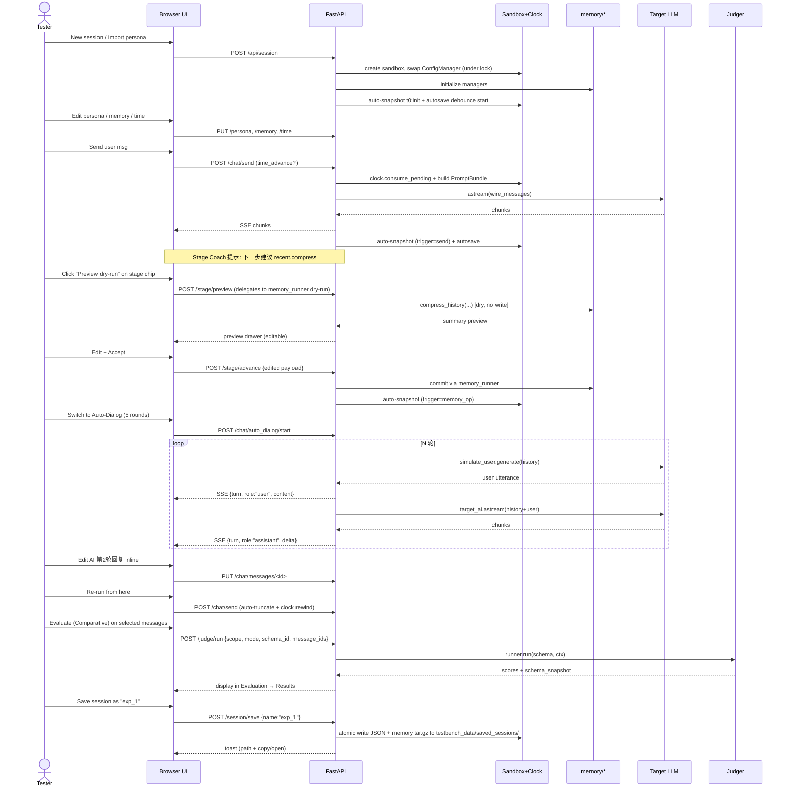

## 当前快照 (2026-04-20, P17 完成)

> 本节为后期追加, 帮助新 Agent 或调研者在不通读全文的情况下快速定位现状. 核心 `todos` 的状态仍以**条目内 `status` 字段**为准; 本节仅作总览.

**进度**: 已完成 17 / 24 阶段 (约 **71%**), 评分子系统 (P15-P17) 已完整落地, 当前处于"评分模块可用但缺持久化"的中期检查点. 下一个推荐阶段是 P19 (Errors+Logs 替换临时版), 让后续大阶段具备排障基础.

**已 done 的阶段 (P00-P17)**: 从"docs 骨架 / 后端骨架 / 沙盒 & 时钟"一路到"四类 Judger + Run / Results / Aggregate + 导出报告 + 内联评分徽章". 期间交付的**可用闭环**包括:
1. 人设编辑 + 从真实角色导入 + 内置预设导入 (含记忆全量复刻);
2. 三层记忆 (Recent / Facts / Reflections / Persona) 四子页 + 5 个记忆操作 (Preview/Commit 双阶段);
3. 四模式对话 (手动 / SimUser / Scripted / Dual-AI Auto) + SSE over POST 流式回显 + 任意消息编辑 / 从此处重跑 / timestamp 追溯;
4. 滚动虚拟时钟 (bootstrap + cursor + per-turn default + pending_advance/set + consume_pending + gap_to);
5. Prompt 双视图 (structured + wire_messages + char_counts + warnings);
6. Stage Coach (6 阶段状态机 + suggest/advance/skip/rewind);
7. ScoringSchema 一等公民 (dataclass + validate + render_prompt + compute_raw_score/normalize/evaluate_pass_rule AST 白名单);
8. 4 类 Judger (AbsoluteSingle / AbsoluteConversation / ComparativeSingle / ComparativeConversation) + POST /judge/run 统一入口 + Run 子页 1:N reference mapping;
9. **Results 子页 (filter/table/drawer/批量/导出) + Aggregate 子页 (overview cards + 维度雷达 + gap 折线 + pattern 词频) + 导出报告 (JSON / Markdown) + Chat 消息内联评分徽章 (点击跳转 Results 并按 message_id 过滤)**.

**已冻结的设计约定** (新阶段只能扩展不能逆转, 详见 `AGENT_NOTES.md §3 / §3A`): 代码/数据严格分离; 单活跃会话 + asyncio.Lock + 状态机; 沙盒只替换路径不替换 API 配置; PromptBundle 双份 (structured vs wire) 且 session.messages 是唯一真相; Preview/Commit 分阶段; SSE 顶层必须先 yield 一条 error 帧再 raise; 软错 (result.error) vs 硬错 (HTTP 4xx) 契约; 状态驱动 renderAll 优先于 partial DOM; **aggregate / export 逻辑与 session 解耦 (session-agnostic pure-Python), 以便 P21 持久化时复用**; **跨 workspace 导航先写 LS 再 set active_workspace 再 emit \`xxx:navigate\` 事件, 兼顾冷/热挂载**.

**未完成阶段 (P18-P24, 7 条)**: Snapshots+Timeline / Diagnostics Errors+Logs (替换 P04 临时版) / Paths+Snapshots+Reset / Save-Load 核心 / Autosave+续跑 / 多格式多 scope 导出 / 用户 README. 推荐执行顺序 **P19 → P18 → P20 → P21 → P22 → P23 → P24** (价值与依赖分析见 `PROGRESS.md` 中后期回顾与展望 §三).

**未解事项 / 技术债**:
- 前端渲染 `i18n(key)(arg)` 误用模式须在全仓做一次扫描 grep (P17 实现时已扫过一次, 0 命中, 但新阶段照旧定期查);
- Evaluation / Memory / Diagnostics 子页是否齐套订阅 `chat:messages_changed` / `session:change` / `judge:results_changed` 需一次横扫;
- P04 临时 Errors 面板 (`workspace_diagnostics.js` + `errors_bus.js`) 在 P19 到来时直接替换为正式 Errors + Logs 双子页;
- 踩过但未形成全仓 lint 规则的: `Node.append(null)` 静默插入、`??` 对 0/空串不 fallback、Grid template-rows 与子节点数不一致 (详见 `AGENT_NOTES.md §3A` + `§4`);
- P17 新增的 `_coerce_bool` / `_coerce_float` 值得抽成通用 helper 供将来 export/persistence 阶段复用 (目前局限在 `judge_router`).

**下一个 Agent 的第一件事**: 读 `AGENT_NOTES.md §3A 横切设计原则索引` (19 条精华) → 再扫 `PROGRESS.md` 中后期回顾与展望 → 定位 `todos[p19_diagnostics_errors_logs]` 开工.

---

## 总体架构



核心原则:
- 单活跃会话: 因 `utils/config_manager.py` 是全局单例 (`_characters_cache`、`memory_dir` 等均存于 singleton), 一次仅切换到一个会话沙盒; 沙盒切换时按 [tests/conftest.py](tests/conftest.py:212-287) 的 `clean_user_data_dir` 模式 snapshot + restore 相关属性。
- 透明可见: UI 中所有"来自某某系统"的块都打上来源 tag (例如 "recent summary from CompressedRecentHistoryManager", "persona from PersonaManager.render_persona_markdown")。
- 人工把关: 每个自动步骤 (记忆压缩 / 事实抽取 / 反思合成 / 人设更新 / 系统消息注入) 都走"预览 -> 确认 -> 写入"三步, 绝不自动落盘。

## 文件新增清单

核心 (8):
- [tests/testbench/run_testbench.py](tests/testbench/run_testbench.py) — CLI 入口: `uv run python tests/testbench/run_testbench.py --port 48920 [--host 127.0.0.1]`; **默认绑 127.0.0.1 不监听公网**, 显式传 `--host 0.0.0.0` 才开放; 启动时检查数据目录 + 打印关键路径
- [tests/testbench/server.py](tests/testbench/server.py) — FastAPI app, 全局异常中间件 (返回 `{error_type, message, trace_digest, session_state}`), 路由挂载, static / templates 绑定
- [tests/testbench/config.py](tests/testbench/config.py) — 常量 (默认端口 / 日志级别 / **数据根目录 `TESTBENCH_DATA_DIR = tests/testbench_data/` 及其所有子目录路径**, 所有模块统一从此读取, 禁止散落硬编码); 首次启动自动 `mkdir -p` 各子目录 + 写入 `tests/testbench_data/README.md`
- [tests/testbench/sandbox.py](tests/testbench/sandbox.py) — 沙盒目录管理 + ConfigManager 属性替换 (参考 conftest.py)
- [tests/testbench/virtual_clock.py](tests/testbench/virtual_clock.py) — 可注入的 `now()` / `last_conversation_at(lanlan_name)`
- [tests/testbench/session_store.py](tests/testbench/session_store.py) — 单活跃 Session 对象 (messages/memory/model_config/clock/eval_results); 内置 `snapshots: List[Snapshot]` 时间线 + `snapshot()/rewind_to(id)/list_snapshots()` API
- [tests/testbench/snapshot.py](tests/testbench/snapshot.py) — `Snapshot` dataclass + 浅/深拷贝工具; 决定快照粒度 (messages+memory dirs+clock+stage+eval_results) 与 diff 精简策略
- [tests/testbench/persistence.py](tests/testbench/persistence.py) — **保存/加载子系统**: 会话完整状态序列化 (JSON + 沙盒 memory 文件 tar + 快照时间线); 自动保存 debounce 控制; 崩溃恢复扫描; 导出 Markdown 报告 (人类可读, 分节, 复用 [tests/unit/run_prompt_test_eval.py:305](tests/unit/run_prompt_test_eval.py) 的 `generate_reports` 风格); 原子写 (tmp + rename) 确保部分失败也能回滚
- [tests/testbench/logger.py](tests/testbench/logger.py) — 每会话 JSONL 日志 + Python logger 过滤

Pipeline (7):
- [tests/testbench/pipeline/prompt_builder.py](tests/testbench/pipeline/prompt_builder.py) — 一处构建, 双视图输出:
  - 复用 [tests/dump_llm_input.py](tests/dump_llm_input.py) 的 `build_memory_context_structured / build_initial_prompt / _flatten_memory_components`, 但所有 `datetime.now()` / gap 计算换用 `virtual_clock`
  - 返回 `PromptBundle(structured, system_prompt, wire_messages, char_counts)`: `structured` 供 UI "Structured" 视图与 source tag, `system_prompt` 是拼好的扁平字符串, `wire_messages` 是最终 OpenAI messages 数组
  - `chat_runner` / `judge_runner` 等所有与 LLM 交互的模块只使用 `wire_messages`; structured 只给 UI 看
- [tests/testbench/pipeline/chat_runner.py](tests/testbench/pipeline/chat_runner.py) — 消费 `PromptBundle.wire_messages` (扁平 role+content 数组), 走 `create_chat_llm(...).astream(wire_messages)`, SSE 推流; **每次调用都从 session.messages + 虚拟时钟重建 wire_messages, 无状态, 编辑历史即刻生效**; 发送前把完整 `wire_messages` 写入会话 JSONL 日志, 供事后 100% 复现
- [tests/testbench/pipeline/memory_runner.py](tests/testbench/pipeline/memory_runner.py) — 按需手动触发 `CompressedRecentHistoryManager.compress_history` / `FactStore.extract_facts` / `ReflectionEngine.reflect` / `PersonaManager` 的矛盾检测与更新
- [tests/testbench/pipeline/scoring_schema.py](tests/testbench/pipeline/scoring_schema.py) — **评分标准一等公民**:
  - `ScoringSchema` dataclass: `id / name / description / mode (absolute|comparative) / dimensions[{key, label, weight, anchors{range:desc}}] / ai_ness_penalty? / raw_score_formula / normalize_formula / pass_rule / prompt_template / version`
  - 加载/保存 `tests/testbench/scoring_schemas/*.json` (内置 + 自定义同目录, 内置以 `builtin_` 前缀标识不可覆盖)
  - 内置三套预设 (从现有代码复刻):
    - `builtin_human_like.json` = 对标 [tests/utils/human_like_judger.py](tests/utils/human_like_judger.py) 的 7 维 + ai_ness_penalty
    - `builtin_prompt_test.json` = 对标 [tests/utils/prompt_test_judger.py](tests/utils/prompt_test_judger.py) 的 6 维 + ai_ness_penalty
    - `builtin_comparative_basic.json` = 对比模式的起点, 直接引用 human_like 的 6 维 + 附加 gap/relative_advantage 字段
  - `ScoringSchema.validate()`: 校验权重和、anchor 覆盖 1-10 整区间、prompt 变量合法
  - `ScoringSchema.render_prompt(ctx)`: 支持变量插值 `{system_prompt} {history} {user_input} {ai_response} {reference_response} {dimensions_block} {anchors_block} {formula_block}`; 未引用的变量自动省略
- [tests/testbench/pipeline/judge_runner.py](tests/testbench/pipeline/judge_runner.py) — 封装四类 judger, 全部基于 `ScoringSchema` 驱动:
  - `AbsoluteSingleJudger` (基线复用 [tests/utils/prompt_test_judger.py](tests/utils/prompt_test_judger.py) 的 LLM 调用/解析逻辑, 但 prompt 与 anchors 改由 schema 提供)
  - `AbsoluteConversationJudger` (基线复用 [tests/utils/human_like_judger.py](tests/utils/human_like_judger.py))
  - `ComparativeSingleJudger` (新; 输入 `(system_prompt, history, user_input, ai_response, reference_response, schema)`; 输出每维 AI/reference 双分 + gap + relative_advantage + diff_analysis + problem_patterns)
  - `ComparativeConversationJudger` (新; 输入两条平行轨迹, 逐轮+整段双评, 输出趋势)
  - 所有 judger 在 `EvalResult` 里内嵌 `schema_snapshot`, 保证后续 schema 被修改不影响历史结果的重现
- [tests/testbench/pipeline/simulated_user.py](tests/testbench/pipeline/simulated_user.py) — **假想用户 AI**: 独立 LLM 实例 + 独立 user_persona_prompt, 接收 `conversation_so_far`, 生成下一条 user 消息; 支持风格预设 (友好/好奇/挑刺/情绪化 等)
- [tests/testbench/pipeline/script_runner.py](tests/testbench/pipeline/script_runner.py) — **脚本化对话**: 读取 `dialog_templates/*.json` (schema: `[{role, content, expected_assistant?}]`), 支持 "Next turn" 逐轮 / "Run all" 批量 / 任意轮次对照 `expected_assistant` 做 diff
- [tests/testbench/pipeline/auto_dialog.py](tests/testbench/pipeline/auto_dialog.py) — **双 AI 自动对话控制器**: 在 sim_user 与 target AI 间交替 N 轮, 每轮完成发送 SSE 进度事件, 支持 pause/resume/stop, 全部消息正常落盘, 和手动发送无差异
- [tests/testbench/pipeline/stage_coordinator.py](tests/testbench/pipeline/stage_coordinator.py) — **流水线阶段引导**: 维护有限状态机 `persona_setup → memory_build → prompt_assembly → chat_turn → post_turn_memory_update → evaluation → (loop back to chat_turn)`; 对外提供 `current_stage()`, `next_suggested_op()`, `run_dry_preview()`, `advance()`, `rewind()`

Routers (11):
- [tests/testbench/routers/session_router.py](tests/testbench/routers/session_router.py):
  - 会话生命周期: `POST /api/session`, `DELETE`, `POST /reset` (三级)
  - 快照: `GET /session/snapshots`, `POST /session/snapshot` (手动), `POST /session/rewind_to/{snapshot_id}`, `DELETE /session/snapshots/{id}`
  - **保存/加载**:
    - `GET /session/saved` 列出 `saved_sessions/*.json` 及其 metadata (名称 / 大小 / 更新时间 / 消息数 / 快照数 / 最近 autosave 标记)
    - `POST /session/save` body `{name}` 手动保存为命名归档
    - `POST /session/save_as` body `{name, overwrite?}` 另存为
    - `POST /session/load/{name}` 从磁盘恢复会话 (会先优雅关闭当前会话并 backup)
    - `POST /session/autosave/config` body `{enabled, debounce_seconds}` (默认开启, 5 秒防抖)
    - `GET /session/autosave/latest` 获取最新 autosave 文件的 metadata (供前端询问"是否恢复?")
    - `DELETE /session/saved/{name}`
  - **导出**:
    - `POST /session/export/json` body `{scope: "full"|"persona+memory"|"conversation"|"evaluations", include_snapshots?}` 返回下载文件
    - `POST /session/export/markdown` body `{scope, include_wire?}` 返回可读 Markdown
    - `POST /session/export/dialog_template` 把当前对话导出为 `dialog_templates/` 兼容 JSON (自动抽 user turn + 把 assistant 原文作为 expected), 供后续脚本复用
  - **导入**:
    - `POST /session/import` 上传 JSON 文件, 按 scope 合并到当前会话或创建新会话
- [tests/testbench/routers/persona_router.py](tests/testbench/routers/persona_router.py) — `GET/PUT` master_name / character_name / system_prompt / language; `POST /import_from_real/{name}`
- [tests/testbench/routers/memory_router.py](tests/testbench/routers/memory_router.py) — `GET/PUT` recent|facts|reflections|persona JSON; `POST /trigger/{op}` 触发并返回预览; `POST /commit/{op}` 正式落盘
- [tests/testbench/routers/chat_router.py](tests/testbench/routers/chat_router.py):
  - messages CRUD (含 **PUT 改 AI 上一轮回复** 与 `PATCH /messages/{id}/timestamp` 追溯编辑消息时间)
  - `GET /chat/prompt_preview`: 返回 `PromptBundle` (同时包含 structured + system_prompt + wire_messages + char_counts), UI 两个视图共用
  - `POST /chat/send` SSE 流式, body 可带 `time_advance`; 发送前持久化 wire_messages 到日志
  - `POST /chat/inject_system`
  - `POST /chat/simulate_user` (让假想用户 AI 出 1 条 user 消息, 也走 wire_messages)
  - `POST /chat/script/load|next|run_all` (自动消费 turn.time 字段)
  - `POST /chat/auto_dialog/start|pause|stop` (SSE 进度, 支持 per-turn step 模式)
- [tests/testbench/routers/judge_router.py](tests/testbench/routers/judge_router.py):
  - Schema CRUD: `GET /judge/schemas`, `GET /judge/schemas/{id}`, `POST /judge/schemas` (新建/更新), `DELETE /judge/schemas/{id}` (内置不可删), `POST /judge/schemas/import`, `GET /judge/schemas/{id}/export`, `POST /judge/schemas/{id}/validate`
  - 评分触发: `POST /judge/run` 统一入口, body = `{scope: "conversation"|"messages", message_ids?, mode: "absolute"|"comparative", schema_id, judge_model_override?, extra_context?}`
  - 结果查询: `GET /judge/results` (支持过滤/排序/分页), `GET /judge/results/{id}`, `DELETE /judge/results/{id}`, `POST /judge/results/batch_delete`
  - 报告导出: `POST /judge/export_report` body = `{result_ids, format: "json"|"markdown", filename?}`, 复用 [tests/unit/run_prompt_test_eval.py:305](tests/unit/run_prompt_test_eval.py) `generate_reports` 的样式
- [tests/testbench/routers/time_router.py](tests/testbench/routers/time_router.py):
  - Bootstrap: `PUT /time/bootstrap` (会话起点 now + last_gap)
  - Live cursor: `GET /time/cursor`, `PUT /time/cursor` (absolute set), `POST /time/advance` (relative)
  - Per-turn default: `PUT /time/per_turn_default` (Auto-Dialog/Scripted 每轮默认推进)
  - Next-turn staging: `POST /time/stage_next_turn` (body: `{delta?: "1h30m", absolute?: "2026-04-18T09:00"}`, 等效于 composer 的 Next turn + 选项; 在下一次 /chat/send 时被消费)
- [tests/testbench/routers/config_router.py](tests/testbench/routers/config_router.py) — chat/judge/memory/**simuser** 四组模型配置 (从 `config/api_providers.json` 下拉, 或手动 base_url/api_key/model); `GET /config/providers` 返回预置列表; `GET /config/api_keys_status` 返回 `tests/api_keys.json` 各 key 是否已填 (不回显明文)
- [tests/testbench/routers/stage_router.py](tests/testbench/routers/stage_router.py) — `GET /stage` 查询当前阶段 + 下一步建议; `POST /stage/preview` 干跑下一步; `POST /stage/advance` 接受并执行; `POST /stage/skip` 跳过并进入下一阶段
- [tests/testbench/routers/health_router.py](tests/testbench/routers/health_router.py) — `/healthz`, `/logs/tail`, `/version`; `GET /system/paths` 返回所有运行时数据路径 + 大小 + 用途标签; `POST /system/open_path` 打开白名单内路径到 OS 文件管理器 (Windows/macOS/Linux 分别调用 os.startfile / open / xdg-open, **仅允许 `tests/testbench_data/` 子路径**, 越界返回 403)

前端 (模块化拆分, 避免单文件臃肿; 全部原生 ES modules, 无构建步骤):
- [tests/testbench/templates/index.html](tests/testbench/templates/index.html) — 单页: 顶栏 + 5 workspace 切换 + 各 workspace 空壳; 通过 `<script type="module" src="/static/app.js">` 引导
- [tests/testbench/static/testbench.css](tests/testbench/static/testbench.css) — 简洁暗色/亮色自适应, 等宽 JSON 编辑区
- [tests/testbench/static/app.js](tests/testbench/static/app.js) — 入口: 初始化状态机, 挂载顶栏, 加载 i18n, 注册 workspace 路由
- [tests/testbench/static/core/state.js](tests/testbench/static/core/state.js) — 全局会话状态 + 事件总线 (observer 模式)
- [tests/testbench/static/core/api.js](tests/testbench/static/core/api.js) — fetch/SSE 封装, 统一错误拦截 → 顶栏 toast + Diagnostics Errors 同步
- [tests/testbench/static/core/i18n.js](tests/testbench/static/core/i18n.js) — 简体中文文案字典 `I18N.zhCN`; 所有 UI 文本通过 `i18n(key)` 读取, 未来扩语种只加字典
- [tests/testbench/static/core/collapsible.js](tests/testbench/static/core/collapsible.js) — CollapsibleBlock (localStorage 持久化 + 容器级 Expand/Collapse all)
- [tests/testbench/static/core/toast.js](tests/testbench/static/core/toast.js) — 全局 toast (成功/警告/错误/信息)
- [tests/testbench/static/ui/topbar.js](tests/testbench/static/ui/topbar.js) — 顶栏 (Session dropdown / Stage chip / Timeline chip / Err badge / Menu)
- [tests/testbench/static/ui/workspace_setup.js](tests/testbench/static/ui/workspace_setup.js)
- [tests/testbench/static/ui/workspace_chat.js](tests/testbench/static/ui/workspace_chat.js) — 消息流 + composer + Prompt Preview 双视图
- [tests/testbench/static/ui/workspace_evaluation.js](tests/testbench/static/ui/workspace_evaluation.js) — Run/Results/Aggregate/Schemas 四子页
- [tests/testbench/static/ui/workspace_diagnostics.js](tests/testbench/static/ui/workspace_diagnostics.js)
- [tests/testbench/static/ui/workspace_settings.js](tests/testbench/static/ui/workspace_settings.js)

(不引 Monaco / React / Chart.js 等需构建或重依赖的库; 雷达图/折线图/分数条一律纯 SVG 实现)

### 目录分离 — 代码 vs. 运行时数据

严格区分:

**A) 代码目录** (入库 git): `tests/testbench/` 及其所有子目录
- 仅包含可执行代码 / 模板 / 静态资源 / **内置** 预设
- `tests/testbench/scoring_schemas/` — 只放 `builtin_*.json` (三套不可覆盖预设, 随代码分发)
- `tests/testbench/dialog_templates/` — 只放内置示例 `sample_*.json` (2-3 个)

**B) 运行时数据目录** (**全部** gitignore, 独立于代码): `tests/testbench_data/`
- 所有测试人员产生的本地文件都集中到这里, 便于查找与整体备份/删除, 也确保不会污染代码目录或 `tests/` 其他脚本目录
- 子目录:
  - `sandboxes/<session_id>/` — 每会话沙盒 (memory/ / character_cards/ / config/ 等)
  - `logs/<session_id>-YYYYMMDD.jsonl` — 每会话日志
  - `saved_sessions/<name>.json` + `<name>.memory.tar.gz` — 命名存档
  - `saved_sessions/_autosave/<session_id>.json` (及 `.memory.tar.gz`) — 自动保存滚动 3 份
  - `scoring_schemas/<custom>.json` — **用户自定义** schema (与内置合并加载; 同 id 时 user override builtin 并在 UI 标"Overriding builtin")
  - `dialog_templates/<custom>.json` — **用户自定义** 对话模板
  - `exports/<timestamp>_<scope>.md` / `.json` — 手动导出的默认落盘位置 (浏览器下载对话框仍可另选位置)
  - `README.md` — 自动生成, 说明各子目录用途

加载优先级: builtin 先加载 (作为底), 然后 user 覆盖同 id 条目; UI 展示时 user-defined 标绿色徽章, 内置标灰色 "builtin" + "Clone to customize" 按钮 (克隆到 user 目录以可改可删).

文档与配置 (用户/测试人员面向 + 开发/Agent 面向):
- [tests/testbench_README.md](tests/testbench_README.md) — **面向测试人员**: 启动 / UI 指南 / Stage Coach 用法 / SimUser 用法 / Auto-Dialog 用法 / 历史编辑注意事项 / 常见问题; **专门一节说明 `tests/testbench_data/` 的目录结构与备份建议**
- [tests/testbench_data/README.md](tests/testbench_data/README.md) — 自动写入的数据目录说明 (UI 启动时若不存在会创建)
- [tests/testbench/docs/PLAN.md](tests/testbench/docs/PLAN.md) — **面向开发/Agent**: 本计划的完整 Markdown 副本; **所有计划变更同步双写这里和 `.cursor/plans/*.plan.md`**; 新会话读这个即可获得完整上下文
- [tests/testbench/docs/PROGRESS.md](tests/testbench/docs/PROGRESS.md) — 进度检查点; 每阶段开始/完成必更新; 断点续跑的关键凭证
- [tests/testbench/docs/AGENT_NOTES.md](tests/testbench/docs/AGENT_NOTES.md) — Agent 恢复指南 + 关键决策摘要 + 常见陷阱 + 每阶段完成操作流程
- [.gitignore](.gitignore) 追加一行 `tests/testbench_data/` (整个数据目录); 明确留下 `tests/testbench/scoring_schemas/builtin_*.json` / `tests/testbench/dialog_templates/sample_*.json` / `tests/testbench/docs/*` 入库

## UI 布局 (Workspace-based, 精简版)

设计原则:
- 按"测试人员此刻在做什么"分 workspace, 而不是按数据类型堆 tab; 一次只看一个 workspace 的主视图, 切换像 Excel 的 sheet
- 全局常驻只留**最小信息密度**: 会话名 / 错误徽章 / Hard Reset; 其他全局元素 (Stage Coach / Snapshot Timeline / 模型摘要) 用**折叠条**或**弹出层**, 默认折叠到单行
- 不常用的功能 (快照详细列表 / schema 编辑 / api_keys 状态 / 日志) 塞进 Settings 或 Diagnostics
- Prompt Preview 不再单独占 tab, 而是 Chat workspace 内的**右侧可伸缩面板** (对话时常需对照)
- Memory 四类 (Recent/Facts/Reflections/Persona) 在 Setup 内部用左侧纵向导航, 不再是顶级 tab
- **长内容一律可折叠**: 所有可能超过一屏的文本块 (system prompt / persona content / 长消息 / AI 回复 / eval analysis / trace / schema prompt 模板 / 日志 entry) 必须以折叠组件包裹, 默认行为按下面的统一约定渲染

### UI 约定: 语言本地化

- **默认语言: 简体中文 (zh-CN)**. 所有面向测试人员的 UI 文案 (tab 名、按钮、提示、错误消息、帮助文字、空状态文案、确认对话框) 一律用简体中文编写.
- 代码层按用户规则保持英文: 文件名/变量名/函数名/docstring/API 路径/日志的 op 字段/JSON schema 字段名.
- 日志消息分层: 机器可读 (op/level/error_type 英文 key) 保持英文; 面向测试人员阅读的 message 字段可写中文.
- 内置数据 (scoring_schemas/dialog_templates 内的 description/anchor 文本) 默认中文. prompt_template 内"给 judging model 的指令"沿用现有 [tests/utils/prompt_test_judger.py](tests/utils/prompt_test_judger.py) / [tests/utils/human_like_judger.py](tests/utils/human_like_judger.py) 的中文提示风格.
- README ([tests/testbench_README.md](tests/testbench_README.md)) 用中文.
- 扩展预留: 全部 UI 文案集中在 [tests/testbench/static/i18n.js](tests/testbench/static/i18n.js) 作为 `I18N.zhCN = {...}` 字典; Settings → UI 预留语言切换下拉位 (本期只落 zh-CN, 其他语言留 TODO, 便于将来加 en/ja 等).

### UI 约定: 统一折叠规范 (贯穿所有 workspace)

实现一个**通用折叠组件** `<CollapsibleBlock>` (JS 函数而非独立 Web Component), 行为:
- 折叠态: 显示一行摘要, 格式 `▸ <title>  <preview first ~120 chars>  [<length badge, 如 2347 chars>]`
- 展开态: 完整内容, 头部仍保留 `▾ <title>  [length badge]  [Copy]  [Collapse]`
- 状态持久化到 `localStorage`, key = `fold:<session_id>:<block_id>`; 会话切换不互相污染
- 容器级操作: 任何有多个折叠块的区域提供 `[Expand all] [Collapse all]` 按钮 (顶部工具栏或右键菜单)
- 键盘: Space / Enter 切换, `Alt+Click` 一次性展开/折叠全部兄弟块

**默认折叠策略** (按内容类型, Settings → UI 可调):

| 内容类型 | 默认折叠态 | 摘要显示 | 阈值 |
|---|---|---|---|
| system_prompt (flat, Raw wire 第 0 条) | 折叠 | 前 2 行 + 总字符数 | 始终折叠 |
| Character system_prompt (Setup/Persona 编辑器) | 展开 | — | 短于阈值时也展开 |
| Persona entity 分节 (master/neko/relationship/…) | 折叠 | entity 名 + 事实数 | 每节独立 |
| Recent history entry | 长内容折叠 | 前 120 字符 | > 500 字符 |
| Chat message (user/assistant) | 长内容折叠 | 前 120 字符 | > 500 字符 |
| Reference response | 折叠 | 前 120 字符 + "ref" 标 | 始终折叠 |
| Eval analysis / diff_analysis | 展开 | — | 展开显示, 超长仍可手动折 |
| Eval 原始 JSON / schema_snapshot | 折叠 | "Raw JSON (N bytes)" | 始终折叠 |
| Log entry payload | 折叠 | level + op + ts | 始终折叠 |
| Error stack trace | 折叠 | 首行 | 始终折叠 |
| Snapshot detail (rewind 确认) | 折叠 | 快照标签 + 消息数 + 时间 | 始终折叠 |
| Schema prompt template | 折叠 | 前 2 行 + 变量表 | 始终折叠 |

**Workspace 级的折叠能力**:
- 左侧 Sub-nav (Setup/Diagnostics/Settings) 可折叠成图标条 (宽度: ~200px ↔ ~44px)
- Prompt Preview 右面板可折叠成竖向 40px 条 (保留"待刷新"提示徽章)
- Stage chip / Timeline chip 折叠成单行 chip (顶栏); 展开为宽横条
- Composer 的 `[⋯ more]` 本质也是折叠低频动作

**"只看我关心的"模式**:
- Chat 页: 顶部工具栏有 `[Collapse all messages]` 把所有消息内容折成一行标题 + 预览; 只看对话节奏/时间轴时非常有用
- Evaluation → Results drawer: 每个分节 (Header/Dimensions/Analysis/Context/Raw) 独立折叠, 支持容器级 `[Collapse all]`

```
+-----------------------------------------------------------------------+
| [NEKO Testbench]  session: <id ▾>  [▸Stage] [▸Timeline] [!Err] [⋮Menu]|  <- 顶栏: 单行, 折叠式控件
+-----------------------------------------------------------------------+
| Workspace Tabs:  [Setup]  [Chat ●]  [Evaluation]  [Diagnostics]  [Settings] |   <- 主切换 (5 个 sheet)
+-----------------------------------------------------------------------+
|                                                                       |
|  <workspace 主区: 每个 sheet 自己的布局>                               |
|                                                                       |
+-----------------------------------------------------------------------+
```

### 顶栏 (global header, 单行)

左到右:
- Logo + "NEKO Testbench"
- Session dropdown (列当前/最近会话, 内含 `[New] [Load] [Save] [Save as...]`)
- `▸Stage` chip: 折叠时只显 `Stage: chat_turn`; 点开下拉出 Stage Coach 全套 (下一步建议 + Preview/Accept/Edit/Skip 四按钮). 仅在 Setup / Chat workspace 里默认展开, 其他 workspace 折叠为 chip
- `▸Timeline` chip: 折叠时只显 `t7 (now)`; 点开横向弹出最近 10 个快照 + `[查看全部]` (跳 Diagnostics -> Snapshots)
- 错误徽章 `!Err(3)`: 有未读错误才显眼 (红色), 否则灰色
- `⋮Menu`: 不常用动作集中点 (Hard Reset / Soft Reset / Export session / About). 避免顶栏按钮爆炸

### Workspace 1: Setup (测试环境准备, 低频)

一次性工作流: 新建会话后进来一次, 把人设/记忆/时间配好, 切到 Chat.

```
+-----------+-------------------------------------------------------+
| Left nav  | Right main pane                                       |
|           |                                                       |
| Persona ●|  (当前被选项的编辑器)                                  |
| Memory    |                                                       |
|  ├Recent  |                                                       |
|  ├Facts   |                                                       |
|  ├Reflec. |                                                       |
|  └Persona |                                                       |
| Virtual   |                                                       |
|  Clock    |                                                       |
| Import    |                                                       |
+-----------+-------------------------------------------------------+
```

Import 独立项: 一站式"从真实角色 X 拷贝 persona+memory 到沙盒", 避免在每个子页都放 Import 按钮造成重复。

### Workspace 2: Chat (测试主战场, 高频)

测试人员大部分时间待在这里。

```
+--------------------------------+--------------------------------+
| 对话流 (主区, 可滚动)           | Prompt Preview (右侧面板, ⟷伸缩)|
|                                |                                |
| [msg #1 user]      [⋯]        | [session_init]                 |
| [msg #2 ai]  ref✓  [⋯]        | [character_prompt]             |
| [msg #3 user]      [⋯]        | [persona]                      |
| ...                            | [recent]                       |
|                                | [time_context]                 |
+--------------------------------+ [closing]                      |
| Composer:                      |                                |
| mode: [Manual|SimUser|Script|Auto]                             |
| [textarea]                [Send] [Inject sys]  [⋯ more]       |
+--------------------------------+--------------------------------+
```

- 消息 `[⋯]` 菜单包含 Edit / Delete / Evaluate / Re-run from here / Add reference — 避免每条消息挂一排按钮
- Prompt Preview 默认展开到 40% 宽, 可折叠成竖条; 折叠后改动会有未读指示
- 顶栏 Stage Coach 和 Timeline 在这里默认展开为单行 chip (占一个小条高度)
- Auto-Dialog 运行时: 对话流上方插入一个**进度横幅** (N/M 轮, `[Pause] [Stop]`), 结束自动消失

### Workspace 3: Evaluation (评分中心, 中频)

独立 workspace, 内部 4 个小 tab (不是顶级):

```
+-------------------------------------------------------------+
| Tabs: [Run ●] [Results] [Aggregate] [Schemas]               |
+-------------------------------------------------------------+
|                                                             |
| (每个 tab 内容如前述)                                        |
|                                                             |
+-------------------------------------------------------------+
```

顺序调整: 最常用的 `Run` 放第一位, `Schemas` (低频配置) 放最后。

### Workspace 4: Diagnostics (诊断/运维, 低频)

出问题时才来, 平时不进。

```
+-----------+-------------------------------------------------------+
| Left nav  | Right main pane                                       |
|           |                                                       |
| Logs ●    |  实时 tail JSONL 日志 + 级别过滤 + 关键字 + 导出      |
| Errors    |  最近错误列表 (可清空), 点击展开 trace                |
| Snapshots |  完整快照时间线表格 + 标签管理 + 回退 + 压缩图标      |
| Sandbox   |  沙盒路径 + 文件树 + 文件大小 + 打开目录 + 手动清理   |
| Reset     |  三级 Reset (Soft / Medium / Hard) 带说明与确认对话框 |
+-----------+-------------------------------------------------------+
```

### Workspace 5: Settings (配置, 低频)

```
+-----------+-------------------------------------------------------+
| Left nav  | Right main pane                                       |
|           |                                                       |
| Models ●  |  四组模型配置 (chat / simuser / judge / memory)       |
| API Keys  |  tests/api_keys.json 状态 + `[Reload]` (不回显明文)   |
| Providers |  config/api_providers.json 展示 (只读)                 |
| UI        |  深浅色 / 快照上限 / Timeline 默认折叠 / 日志级别      |
| About     |  版本 / 依赖版本 / 本期限制声明                         |
+-----------+-------------------------------------------------------+
```

### 不再作为顶级 tab 的项及其归属

| 原项 | 现归属 |
|---|---|
| Persona (顶级) | Setup -> Persona |
| Memory (顶级) | Setup -> Memory (+4 子项) |
| Prompt Preview (顶级) | Chat 右侧伸缩面板 |
| Logs (顶级) | Diagnostics -> Logs |
| 侧边栏 Sessions | 顶栏 Session dropdown |
| 侧边栏 Virtual Time | Setup -> Virtual Clock + Chat 顶栏 chip |
| 侧边栏 Models | Settings -> Models + 顶栏 Menu 里快捷跳转 |
| Evals 四子页 | Evaluation 内部顺序重排: Run / Results / Aggregate / Schemas |
| Snapshot Timeline (独占一行) | 顶栏 Timeline chip, 完整视图在 Diagnostics |
| Stage Coach (独占一行) | 顶栏 Stage chip, 在 Setup/Chat 默认展开 |
| Hard Reset (顶栏按钮) | 顶栏 Menu 里 + Diagnostics -> Reset |

### Setup workspace 详细交互
- Persona 子页: 表单 (master_name / character_name / language) + 大 textarea 编辑 system_prompt
- Memory -> Recent: 消息列表编辑器 + `[Compress from current chat]` → 预览 modal → 确认写入 + `[Clear]`
- Memory -> Facts: 表格 (id/entity/text/absorbed) + `[Extract from selected chat msgs]` → 预览 diff → 确认 + 手动增删改
- Memory -> Reflections: 两列 pending / confirmed + `[Reflect now]` 触发合成预览
- Memory -> Persona: 以 entity 分节 (master/neko/relationship/自定义) + `[Update from recent facts]` LLM 更新预览
- Virtual Clock (三块, 避免概念混淆):
  - **Bootstrap**: 会话起点 now + 首条消息的 gap bootstrap
  - **Live cursor**: 实时 `clock.now()`, 可 set/advance; 下方消息 timestamp 迷你时间轴 (悬停看摘要, 点 dot 编辑); `[Jump cursor to last message]` / `[Reset cursor to real now]`
  - **Per-turn default**: Auto-Dialog / Scripted / Manual composer 的默认每轮推进时长
- Import: 一站式从真实角色拷贝 persona+memory 到沙盒

### Chat workspace 详细交互
- 消息流 + 每条 `[⋯]` 菜单 (Edit/Delete/Evaluate/Re-run from here/Add reference/Edit timestamp/Fold); 消息本体含 role 标签 + 来源 tag + `ref✓` 徽章 (当有 reference_content 时)
- 消息 > 500 字符默认折叠 (CollapsibleBlock); 工具栏 `[Collapse all messages]` 一键折叠
- 消息左下显 virtual timestamp; 相邻跨度 > 30min 插入时间分隔条 `— 2h 30m later —` (点击可编辑 gap)
- `Add reference` 折叠 textarea (可从脚本 `expected` 一键导入); 有 reference 时 Evaluate 默认切 Comparative
- 编辑 AI 消息提示: "目标模型无状态, 改动在下次发送即生效 (Realtime 将来会不同)"
- Prompt Preview 右侧伸缩面板, 双视图 `[Structured] [Raw wire ●]`, 容器级 Expand/Collapse all
  - **Structured**: 每分区 (`session_init / character_prompt / persona / inner_thoughts / recent_history / time_context / holiday / closing`) 独立 CollapsibleBlock + 来源 tag + 字符数/token 估算
  - **Raw wire**: 完整 `messages: [...]` 数组, 每条 CollapsibleBlock; 首条 system (扁平串) 折叠态预览 + `[Copy as JSON] [Copy system string]`; 顶部固定提示: "这是真正送到 AI 的内容. Structured 仅人类视图."
- Composer 两行扁平布局:
  - 第 1 行: `Clock: <now> | Next turn +: [+5m][+1h][+1d][Custom]` | `Role: (●User ○System)` | `Mode: [Manual|SimUser|Script|Auto]`
  - 第 2 行: 单 textarea + `[Send]` + `[⋯ more]` (收纳"插入空白 assistant 槽"等低频动作)
  - 四模式: Manual (手动) / SimUser (生成到 textarea 先编辑再发) / Scripted (逐轮 Next/Run to end + 对照 `expected`) / Auto-Dialog (N 轮 + Progress 面板 + Pause/Stop + per-turn step 配置)

### Evaluation workspace 详细交互 (独立四子页, 顺序 `Run → Results → Aggregate → Schemas`):
  - **Schemas 子页**: 评分标准管理
    - 左侧: schema 列表 (内置 3 条不可编辑但可复制, 自定义条目可改可删); 每条显示 name / mode / 维度数 / 版本
    - 右侧: schema 编辑器
      - 基本信息: name / description / mode (absolute/comparative)
      - 维度表格: key, label, weight, 四档 anchor 文本 (9-10, 7-8, 5-6, 1-4)
      - 可选 ai_ness_penalty 开关及其 anchors
      - 公式区: raw_score_formula 自由文本 (默认自动按权重求和), normalize (默认 `raw/max*100`), pass_rule 配置 (overall 阈值 / 各维度最低分 / ai_ness 上限)
      - prompt_template 大编辑框 + 可用变量表 + `[Preview rendered]` 按钮
      - `[Validate]` / `[Save]` / `[Duplicate]` / `[Export JSON]` / `[Import JSON]`
  - **Run 子页**: 触发评分
    - **粒度**: `整段对话` / `已勾选消息` 两选一 (多选消息时自动下拉预览所选)
    - **模式**: `Absolute` / `Comparative` 两选一; Comparative 下校验"所选 AI 消息是否都已有 reference_content", 缺失时红字列出, 并给 `[一键从脚本模板/手动输入导入]` 按钮
    - **Schema**: 从 Schemas 子页选, 可就地覆盖 (临时 override, 不回写)
    - **Judge 模型**: 下拉 (复用 Settings 里 judge 组), 可就地覆盖
    - `[Run]` 按钮, 评分进行时顶部出现进度条 (N/M), 单次评分失败不中断批跑, 失败项会明确标记 (可重试按钮)
  - **Results 子页**: 易读且详细
    - 顶部过滤栏: scope / mode / schema / judge_model / 分数区间 / verdict / 关键字搜索
    - 表格 (主视图, 支持排序): `时间 / 粒度 / 模式 / 目标 / 总分(色块徽章) / verdict / schema / judge_model / 备注`; 行可勾选用于批量导出/删除
    - 点击任一行展开 drawer, 每个分节独立 CollapsibleBlock, drawer 顶部带 `[Expand all] [Collapse all]`:
      - **Header** (默认展开): 评分总分 (大字号) + verdict 徽章 + 使用的 schema 名称 + judge 模型 + 真实时间 + 关联消息快速跳转链接
      - **Dimensions** (默认展开): 每维显示横条形分数条 (1-10 刻度), 右侧贴其 anchor 描述 (命中档位高亮); Comparative 模式则每维两条并排 (AI 浅蓝 / reference 浅绿) + gap 数字
      - **Analysis** (默认展开): `analysis` 文本 (多段落自然显示) + `strengths` / `weaknesses` 列表 (卡片式)
      - **Comparative 专属** (默认展开): `relative_advantage` 大标签 + `diff_analysis` 段落 + `problem_patterns` 项目符号 + Conversation 级的"偏移趋势"迷你折线
      - **Context** (默认折叠, 通常很长): 评分时的 system_prompt + user_input + ai_response (+ reference_response) 原文; 内部每条再独立 CollapsibleBlock
      - **Raw JSON** (默认折叠): schema_snapshot + 原始 judge 返回, 便于调试
      - `[Re-run with current schema]` / `[Export this result]` / `[Delete]` 按钮
    - 批量操作: 选中多行后 `[Batch delete]` / `[Export report]` / `[Compare selected]` (后者把选中结果的维度均分做并排柱状图)
  - **Aggregate 子页**: 会话级统计
    - 总览卡片: 评分总数 / 通过数 / 平均分 / 维度均分 / Comparative 下的平均 relative_advantage 分布
    - 维度均分雷达图 (本期用轻量 SVG, 不引 Chart.js 依赖, 避免构建)
    - Comparative 模式: 逐轮 gap 折线 (横轴 turn, 纵轴 AI-reference), 便于直观看"AI 在对话后段是否越走越偏"
    - Problem pattern 词频云 (纯 CSS + 频次大小)
    - `[Export session report]` 一键生成 Markdown + JSON (复用 [tests/unit/run_prompt_test_eval.py:305](tests/unit/run_prompt_test_eval.py) 结构)

每条消息右下仍保留紧凑内联评分徽章 (最近一次评分的总分/verdict), 点击跳转 Evaluation → Results 并自动筛选到该消息.

**Stage Coach (顶栏 chip, Setup/Chat workspace 默认展开为单行)**: 显示 `current_stage` + `next_suggested_op`; 展开时四个动作按钮 `[Preview dry-run][Accept & run][Edit manually][Skip]`; Preview 在右侧 drawer 显示 dry-run 结果, 支持直接编辑 → Accept.

**Snapshot Timeline (顶栏 chip)**: 折叠态只显 `t7 (now)`; 点开弹出最近 10 个快照横向条; `[查看全部]` 跳 Diagnostics → Snapshots. Rewind 操作在弹出条里直接可点.

**Diagnostics workspace (低频, 出问题才来)**:
- Logs 子页: 实时 tail JSONL + 级别过滤 + 关键字搜索 + 导出; **每条日志 entry 是一个 CollapsibleBlock** (默认折叠显 `ts · level · op · short msg`, 展开看 payload + 完整 JSON); `[Collapse all] [Expand all]` 顶部按钮
- Errors 子页: 最近错误列表, **每条 error 为 CollapsibleBlock** (默认折叠显首行 + ts, 展开看完整 trace + 关联操作上下文); `[Clear]`
- Snapshots 子页: 完整时间线表格 + 重命名 / 删除 / 压缩状态 / Rewind / 手动建; 快照 metadata 展开时 CollapsibleBlock
- Paths 子页 (原 Sandbox 子页扩充): 集中展示所有本地数据位置, 每项一行:
  - 当前沙盒目录: `tests/testbench_data/sandboxes/<id>/` + 大小 + `[Copy path] [在文件管理器中打开] [手动清空]`
  - 当前会话日志: `tests/testbench_data/logs/<id>-*.jsonl` + 大小 + `[Copy path] [打开]`
  - Saved sessions 目录: `tests/testbench_data/saved_sessions/`
  - Autosave 目录: `tests/testbench_data/saved_sessions/_autosave/`
  - Exports 目录: `tests/testbench_data/exports/`
  - 用户自定义 schemas: `tests/testbench_data/scoring_schemas/`
  - 用户自定义 dialog templates: `tests/testbench_data/dialog_templates/`
  - 每行有个 `?` tooltip 说明"这个目录放什么"; 底部永久提示条: "本目录已整体添加到 .gitignore, 不会被提交"
  - "在文件管理器中打开"通过 `POST /system/open_path` 后端调用 `os.startfile` (Windows) / `open` (macOS) / `xdg-open` (Linux); 仅对 `tests/testbench_data/` 子路径放行 (白名单, 防任意路径打开)
- Reset 子页: 三级 Reset 各自独立按钮, 每个带说明文字 + 二次确认对话框, 避免误触

**Settings workspace (低频, 集中配置)**:
- Models: 四组模型配置 (chat / simuser / judge / memory), 每组含预设下拉 (从 `GET /config/providers`) 或自定义 (base_url / api_key / model / temperature / max_tokens / timeout); api_key 只显 `✓ configured` / `✗ missing` 不回显明文; `[Test connection]` 按钮
- API Keys: `tests/api_keys.json` 各 key 状态 + `[Reload from disk]`
- Providers: `config/api_providers.json` 只读展示
- UI: 语言下拉 (本期只有 "简体中文", 其他语种置灰并标 "TODO") / 深浅色切换 / 快照上限 / Timeline 默认折叠状态 / 日志级别 / **内容折叠默认**表 (按"统一折叠规范"表格里的类型逐项可调: 默认展开/折叠 + 长度阈值) + `[Reset fold state for this session]` 按钮 (清除当前会话的 localStorage fold keys)
- About: 版本 / 依赖 / 本期限制声明 (不支持 Realtime/多会话等)

## 关键技术点

1) ConfigManager 沙盒补丁 (核心, 含并发锁)

参考 [tests/conftest.py](tests/conftest.py:212-287) `clean_user_data_dir` 中的补丁流程, 把 cm.docs_dir / app_docs_dir / config_dir / memory_dir / chara_dir 指向 `tests/testbench_data/sandboxes/<session_id>/`; 切换会话时先 snapshot 旧值, yield 新值, 退出恢复。"Import from real character" 时, 读取真实 `memory_dir/{name}/*.json` 后 copy 到沙盒下。

**并发锁与会话状态机** (关键安全保证): session_store 持有一个 `asyncio.Lock` + 状态枚举 `idle / busy:<op_name> / loading / saving / rewinding / resetting`. 所有可能修改 ConfigManager 或沙盒的操作必须先 `async with session.lock:` 并设置状态; UI 通过 `GET /session/state` (或 SSE 推送) 知道当前状态, 锁内期间 dangerous 操作 (切换会话 / rewind / reset / load) 的按钮 disabled 并给 tooltip. 后端遇到并发冲突返回 409 + `state` 字段, 前端据此提示 "等待 <op> 完成"。加载过程中服务若崩溃, 下次启动 autosave 恢复逻辑会优先选 `pre_load.json` 作为回退点。

2) 虚拟时钟 — 滚动游标模型

**关键设计**: 虚拟时钟是一个**随对话前进的游标**, 不是"一次设定就不动"的静态值。测试人员既可以在会话开始时设定起点, 也可以在每一条消息发送前声明"这一轮发生在上一轮之后 X 时间", 从而模拟真实使用中"早上聊两句 - 下午再聊 - 第二天又聊"的跨度场景。

不做全局 monkey-patch。创建 [tests/testbench/virtual_clock.py](tests/testbench/virtual_clock.py):
```python
class VirtualClock:
    def __init__(self):
        self.cursor: datetime | None = None            # 当前游标 ("virtual now"), None = 用真实时间
        self.initial_last_gap_seconds: int | None = None  # session 启动时 "上次对话 X 秒前" 的 bootstrap 值 (仅首条消息前有效)
        self.pending_advance: timedelta | None = None  # "下一条消息前推进 Δ", 消费后置 None
        self.pending_set: datetime | None = None       # "下一条消息时间直接设为 X", 消费后置 None

    def now(self) -> datetime: return self.cursor or datetime.now()
    def set_now(self, dt: datetime): self.cursor = dt
    def advance(self, delta: timedelta): self.cursor = self.now() + delta
    def stage_next_turn(self, *, delta=None, absolute=None):
        """Chat composer 'Time for this turn' 的声明, 在 send 刚开始时被消费"""
        self.pending_advance = delta; self.pending_set = absolute
    def consume_pending(self):
        if self.pending_set: self.cursor = self.pending_set
        elif self.pending_advance: self.cursor = self.now() + self.pending_advance
        self.pending_advance = None; self.pending_set = None
    def gap_to(self, earlier: datetime) -> timedelta: return self.now() - earlier
```

Send 流程里的时间协同:
1. `/chat/send` 收到请求 (可带 `time_advance` 参数覆盖 pending)
2. `clock.consume_pending()` 把游标推进到"本轮时间"
3. `prompt_builder` 用 `clock.now()` 填 inner_thoughts_dynamic (当前时间), 用 `clock.gap_to(previous_message.timestamp or last_conversation_time)` 计算"距上次对话多久"
4. 发送 + 流式接收
5. user/assistant 两条消息都标 `timestamp = clock.now()` 落 session.messages, 同时 `TimeIndexedMemory.store_conversation(timestamp=clock.now())`

时间权威来源: **每条 message.timestamp 是最终事实记录**。gap 计算优先用 `session.messages[-1].timestamp`, 退化到 `TimeIndexedMemory.get_last_conversation_time`, 再退化到 `initial_last_gap_seconds` bootstrap.

消息时间可改: `PATCH /chat/messages/{id}/timestamp` 允许追溯编辑; 改动会触发 "clock resync" 提示 — 若改动的是最后一条消息, 游标自动跟着移到它的新时间。

Re-run from here 同时回滚时钟: 截断到消息 N 时, `clock.cursor = messages[N].timestamp`。

对 `FactStore/ReflectionEngine/PersonaManager` 内部的 `datetime.now()` 调用 (cooldown/archive 用途) 本期不覆盖, 在 README 中声明该限制。

3) Prompt 还原 — 结构化拆解 vs. 原始扁平 wire payload (双视图)

**必须区分两类数据**:
- **Structured breakdown**: 把 system prompt 拆成 `session_init / character_prompt / persona_header / persona_content / inner_thoughts / recent_history / time_context / holiday / closing` 若干字段. **这是给人看的调试视图**, 和 [tests/dump_llm_input.py](tests/dump_llm_input.py) 的结构化输出同质. AI 模型**永远看不到这个 dict 结构**.
- **Raw wire payload**: 真正发给模型的 OpenAI messages 数组, 每个元素是 `{"role": "system"|"user"|"assistant", "content": "<扁平字符串>"}`. 参考 [tests/unit/run_prompt_test_eval.py:154-182](tests/unit/run_prompt_test_eval.py) 与 [main_logic/omni_offline_client.py](main_logic/omni_offline_client.py) 的装配逻辑: **system 消息是 `session_init + character_prompt + persona + inner_thoughts + recent_history + time_context + holiday + closing` 首尾相接的一整段字符串**, 之后挂上 session.messages 对应的 user/assistant/system_injection 扁平消息. 这是"测试真相"。

`pipeline/prompt_builder.py` 同时产出两者:
```python
def build(session, virtual_clock) -> PromptBundle:
    components = build_memory_context_structured(..., virtual_clock=virtual_clock)   # 结构化块 (dict)
    system_prompt_flat = flatten(session_init, char_prompt, components, closing)      # 单一字符串
    wire_messages = [
        {"role": "system", "content": system_prompt_flat},
        *[{"role": m.role, "content": m.content} for m in session.messages],
    ]
    return PromptBundle(
        structured=components,             # UI Structured 视图数据源
        system_prompt=system_prompt_flat,  # 真正送给模型的 system 字符串
        wire_messages=wire_messages,       # 真正送给模型的 messages 数组
        char_counts={...},                 # 每段字符数 / 近似 token 数
    )
```

Chat send 流程里 **`chat_runner` 直接消费 `wire_messages`** (`create_chat_llm(...).astream(wire_messages)`), 从不消费 structured dict; 后者仅供 UI 和日志。

4) SSE 流式对话

`POST /api/session/{id}/chat/send` 返回 `text/event-stream`; 后端按 `ChatOpenAI.astream(messages)` 产出的 `LLMStreamChunk.content` 逐块 flush; 前端 EventSource 累积到同一 assistant message 节点; 结束后该 message 落盘并可被评分/编辑。

5) 评分复用 (ScoringSchema-driven)

judge_runner 的四类 judger 共享一个基类, 调用 LLM / 解析 JSON / 校验分数 / 归一化 / 判定 verdict 的骨架复用 [tests/utils/llm_judger.py](tests/utils/llm_judger.py) 与 [tests/utils/prompt_test_judger.py](tests/utils/prompt_test_judger.py) 的现有逻辑, **但 prompt 文本和 anchors 不再硬编码**, 全部由传入的 `ScoringSchema.render_prompt(ctx)` 动态生成。

具体复用:
- 底层 LLM 调用 / 重试 / 网络跳过逻辑 → 沿用 `LLMJudger._call_llm`
- 扁平 JSON 解析 / score clamp / list normalize → 沿用 `prompt_test_judger.py` 的 helper 函数, 提取到 judge_runner 共用
- 内置 schema `builtin_human_like` / `builtin_prompt_test` 的 anchors / 权重 / verdict rule 直接复刻自 human_like_judger.py / prompt_test_judger.py 的常量, 保证行为等价
- Comparative 的两套 schema / prompt 模板 / 结果字段 (`gap`, `relative_advantage`, `diff_analysis`, `problem_patterns`) 是新增

6) 错误处理 + 复位

- FastAPI `@app.exception_handler(Exception)` 统一返回 `{error_type, message, trace_digest, session_state}` 并写入会话日志 + Diagnostics → Errors 列表。
- 前端顶栏"!Err" 徽章有未读时红色, 点击展开 Last Error drawer (首行 + 完整 trace CollapsibleBlock)。
- 三级复位 (每级都会先自动建一个 `pre_reset_backup` 快照以防误操作):
  - **Soft**: 仅清空 session.messages 和 eval_results; 保留 persona / memory 文件 / clock / model_config / schema 配置 / 快照时间线
  - **Medium**: Soft + 清空沙盒 memory/ 子目录 (FactStore/ReflectionEngine/PersonaManager/recent 全部归零); 保留 persona / clock / model_config / schema / 快照时间线
  - **Hard**: 销毁当前沙盒并重建 t0 初始状态; 清空**除 `pre_reset_backup` 外**的所有快照; 保留 model_config (否则用户又要重配) 与 schema (全局性)。pre_reset_backup 给"我改主意了"留后路。
- "编辑历史 / Re-run from here / Rewind to snapshot" 三者的使用边界 (README 也会写):
  - **编辑历史 (message.content inline edit)**: 只改单条消息内容, 不动时间轴/记忆/评分, 下次 send 自动以新内容进入 wire_messages
  - **Re-run from here**: 从某条消息开始截断尾部, 时钟回退到该消息的 timestamp, 重发最后一条 user msg; 适用"我想看如果 AI 这句说成 X 会怎么样"
  - **Rewind to snapshot**: 回到**某个时间点的完整状态** (含 memory 文件); 适用"把整个测试倒回 5 分钟前重走"

7) 日志

- 每会话一个 `tests/testbench_data/logs/<session_id>-YYYYMMDD.jsonl`
- 每条含 `ts, level, op, session_id, payload, error?`
- 运行日志也同时打到控制台 (`logging.getLogger("testbench")`)

8) 扩展点 (供未来 Realtime 接入)

- `pipeline/chat_runner.py` 抽象 `ChatBackend` 接口, 当前只实现 `OfflineChatBackend`; `RealtimeChatBackend` 留 TODO。
- `routers/chat_router.py` 的 `/send` 里按 session.mode 分派, 目前硬编码 `mode="text"`。

9) 流水线阶段协调器 (stage_coordinator.py)

**主程序中的模块执行顺序**（参考 [main_logic/core.py](main_logic/core.py) 与 [memory_server.py](memory_server.py) 的行为）可抽象为:



`StageCoordinator` 内部维护:
- `current_stage: Stage`
- `suggest_next() -> {op, reason, dry_run_fn}` 基于当前 stage + session 状态给"下一步建议" (如 `chat_turn` 后推荐 `recent.compress` 若 history 超过阈值, 推荐 `facts.extract` 若有多轮未抽取)
- `preview(op)` 执行 dry-run, 返回结果但不写入 (memory trigger 端点本来就先走 preview modal, 这里复用同一入口)
- `advance(op, accept=True, edited_payload=None)` 接受/编辑后的 payload 并 commit, 推进阶段

阶段日志: 每次 advance/preview/skip 写入会话 JSONL, `op:"stage.advance"` 类型, 便于回溯。

10) 假想用户 / 脚本 / 双 AI 对话 (与历史编辑的上下文一致性)

关键认识: **目标 AI 走的是 ChatCompletion 无状态调用** (参照 [tests/unit/run_prompt_test_eval.py:154-182](tests/unit/run_prompt_test_eval.py)); 每次 `/chat/send` 都从当前 `session.messages` 数组重新拼 messages + system_prompt, 因此:

- 编辑任何历史消息 (包括 AI 上一轮回复) 即刻对下一次推理生效, 不存在"服务端粘着的旧上下文"。
- `Re-run from here` 只是在 UI 端截断 + 重发, 技术上与手动删尾再发送等价。
- SimulatedUser AI 也是无状态调用, 输入为"当前对话 + user_persona_prompt", 产出一条 user 消息; 它的上下文和目标 AI 的上下文互相独立, 不会串扰。
- Auto-Dialog 实质是 `(sim_user.generate → append → target_ai.stream → append)` 的循环, 每步都落盘到同一 `session.messages`, 测试人员随时暂停后编辑任一条, 再继续, 下一轮自然以编辑后的版本为准。

**Realtime API 将来的差异 (扩展提示)**: 会话有端上状态, 改历史需要 `reset + replay(new_history)`; 因此 `ChatBackend` 接口需暴露 `reset()` 和 `replay(messages)`, 供未来 `RealtimeChatBackend` 覆盖。当前 `OfflineChatBackend` 两者均为 no-op。UI 中"编辑 AI 消息"提示语里会说明这一差异。

脚本模板 schema (`tests/testbench/dialog_templates/*.json`):
```json
{
  "name": "greeting_then_complaint",
  "description": "测试情绪转折场景 (跨越一天)",
  "user_persona_hint": "心情不好的用户, 前两轮还好, 第二天突然诉苦",
  "bootstrap": {"virtual_now": "2026-04-17T09:00", "last_gap_minutes": 60},
  "turns": [
    {"role": "user", "content": "嗨今天过得怎么样"},
    {"role": "assistant", "expected": "自然回应 + 反问"},
    {"role": "user", "content": "我今天被老板骂了...", "time": {"advance": "1d"}},
    {"role": "assistant", "expected": "共情 + 不急着给建议"}
  ]
}
```
- `expected` 字段可选, 用于 Comparative 评分的参考; 不强制校验
- `bootstrap` 可选, 覆盖会话起点时钟
- 每个 turn 的 `time` 可选:
  - `{"advance": "1d"}` / `{"advance": "2h30m"}` / `{"advance_seconds": 3600}` — 相对推进
  - `{"at": "2026-04-18T09:00"}` — 绝对跳转
  - 省略 = 用 Virtual Clock 的"每轮默认推进" (若未设则不推进)
- Auto-Dialog 模式有独立配置页: 固定步长 / 线性步长 / 随机范围 / 关闭

11) 对照评分 (ComparativeJudger)

Message 结构扩展:
```python
@dataclass
class Message:
    id: str
    role: Literal["system","user","assistant"]
    content: str
    source: str                             # manual_user / sim_user@... / script/... / ai@... / system_injection
    timestamp: datetime                     # 虚拟时钟
    reference_content: str | None = None    # 仅 assistant 有效, 测试人员手写"理想人类回复"
    reference_source: str | None = None     # "manual" / "script:greeting#turn2" / "import:live_chat"
    eval_results: list[EvalResult] = field(default_factory=list)
    metadata: dict = field(default_factory=dict)
```

脚本模板的 `expected` 字段加载后自动写入对应 assistant message 的 `reference_content` (若该轮已实际发生过). Simulated User / Auto-Dialog 模式下也可以事后补写 reference.

Comparative 评分 prompt (示意, ComparativeSingleJudger 内部):
```text
你是一名中文对话评审员. 同一段上下文下, 有两条针对同一条用户消息的回复:
  [A] AI 模型的回复: <ai_response>
  [B] 人类参考回复:  <reference_response>

请做以下几件事:
1. 对 A 和 B 分别按 naturalness/empathy/lifelikeness/context_retention/engagement/persona_consistency 打 1-10 分, 并分别给出 ai_ness_penalty (0-15).
2. 对每个维度给出 `gap = A - B` (可正可负), 解释差距来源.
3. 输出 `relative_advantage` = "ai" | "tie" | "reference".
4. `diff_analysis`: 用 2-4 句说明 A 相对 B 的主要风格偏移 (说教更重? 更抽象? 更书面? 过度回避? 过度积极?).
5. `problem_patterns`: 抽出 A 身上 1-3 条典型机器感模式 (若有).
返回 JSON, 字段名保持英文.
```

Conversation 级的 Comparative 类似, 但给 judge 的是两条平行轨迹, 每轮 assistant 都有 A 和 B; judge 先逐轮评, 再整段总结 `problem_patterns` 趋势 (例如"前两轮还贴近参考, 第三轮开始明显说教").

Judge 的输出在 UI 里用**纯 SVG 维度雷达图** (无外部依赖) 并排显示 A vs B, 突出差距最大的维度.

对比评分也进入 session.eval_results, 并参与导出报告 (在 MD 里为每条 Comparative 评分追加"差距表"区块).

12) 保存 / 加载 / 断点续跑 / 导出

**目录约定** (全部位于 `tests/testbench_data/`):
- `tests/testbench_data/saved_sessions/` — 人工命名的存档 (`<name>.json` + 同名 `.memory.tar.gz` 伴生文件)
- `tests/testbench_data/saved_sessions/_autosave/` — 自动保存 (每个 session_id 一份, 滚动覆盖, 保留最近 3 份以防损坏); 崩溃恢复时扫描
- `tests/testbench_data/exports/` — 手动导出报告默认落盘目录
- `tests/testbench_data/sandboxes/<session_id>/` — 沙盒 memory 和配置文件
- `tests/testbench_data/logs/` — 会话 JSONL 日志

**存档结构** (`<name>.json`):
```json
{
  "schema_version": 1,
  "metadata": {
    "saved_at": "...", "testbench_version": "...",
    "session_id": "...", "name": "...",
    "message_count": 42, "snapshot_count": 17, "eval_count": 8
  },
  "persona": { "character_name": "...", "master_name": "...", "system_prompt": "...", "language": "zh" },
  "virtual_clock": { "cursor": "...", "initial_last_gap_seconds": 3600, "per_turn_default_seconds": null },
  "model_config": { "chat": {...}, "simuser": {...}, "judge": {...}, "memory": {...} },
  "stage_state": { "current_stage": "chat_turn" },
  "messages": [ {... full Message dicts including reference_content and eval_results ...} ],
  "snapshots": [ { "id": "...", "label": "t3:facts", "created_at": "...", ... } ],
  "scoring_schemas_used": [ {...} ],  // 内嵌被用到的 schema 快照, 避免加载机器上没有对应自定义 schema
  "eval_results": [ ... ],
  "memory_archive_ref": "<name>.memory.tar.gz"  // 沙盒 memory/ 目录 tar+gzip
}
```

**自动保存机制**:
- session_store 每次状态变更触发一个 debounced 任务 (默认 5s), 把当前状态写入 `_autosave/<session_id>.json` (原子写: `.tmp` → rename)
- 大状态 (memory 文件) 用 tar+gzip 旁路文件, JSON 里只存相对引用
- 防抖期间再次变更重置计时器; 达到上限 (例如 60s 内至少一次) 强制落盘避免长期不保存
- Settings → UI 可调 debounce 与启用开关

**断点续跑 (启动时恢复)**:
- 服务启动进入 UI 时, 若 `_autosave/` 有最近 24h 内的存档, 顶栏弹一次性提示条: "检测到 2 个未保存的会话 (最近 autosave 3 分钟前), 是否恢复? [查看] [忽略]"
- 选"查看"弹模态列出所有 autosave 条目 (name / 消息数 / 上次修改), 点任一项即 load
- 也可手动从 Session dropdown → "Restore autosave..." 进入同一界面

**加载流程**:
1. 关闭当前沙盒 (保存当前状态为临时 backup `_autosave/<current_id>.pre_load.json`)
2. 创建新沙盒目录, 解压存档的 `memory.tar.gz`
3. ConfigManager 指向新沙盒
4. session_store 重建状态 (messages / snapshots / eval_results / clock / stage / model_config)
5. UI 全量刷新

**三种导出格式** (由 `persistence.py` 统一产出):
- **Machine-readable JSON** (full 或 scope 裁剪): 跟存档同构, 可被 `/session/import` 逆向加载
- **Human-readable Markdown**: 分节 (元信息 / 人设 / 记忆快照 / 对话逐轮 / 评分汇总 / 评分详情); 时间戳以虚拟 + 真实双栏; Comparative 评分用差距表; 自动把 CollapsibleBlock 折叠态翻译为"展开原文见 ..."链接 (其实直接全展开); 复用 [tests/unit/run_prompt_test_eval.py](tests/unit/run_prompt_test_eval.py) `generate_reports` 的格式骨架
- **Dialog template JSON**: 只导对话, 结构即 `dialog_templates/*.json` 的 schema, 方便把一次手动测试回流成可重复的脚本

**Scope 粒度** (裁剪导出):
- `full` (默认)
- `persona+memory` (播种新测试)
- `conversation` (分析对话本身)
- `conversation+evaluations` (QA 报告)
- `evaluations` (汇总评分)

**UI 入口**:
- 顶栏 Session dropdown: `[New] [Save ●Ctrl+S] [Save as...] [Load...] [Import...] [Restore autosave...]`
- 顶栏 ⋮Menu: `[Export ▾]` 子菜单 `[Full JSON] [Markdown report] [Dialog template]`
- Evaluation → Aggregate: 独立 `[Export session report]` (Markdown + JSON, scope=conversation+evaluations)
- Diagnostics → Paths: `[Export sandbox snapshot]` (纯 memory 文件 tar, 无会话状态)

**保存/导出对话框强制显示目标路径**:
- Save / Save as 弹窗: 输入 name 后下方实时显示 `将保存到: tests/testbench_data/saved_sessions/<name>.json`, 附一个 `[复制路径]` 按钮
- Export 弹窗同理: `将导出到: tests/testbench_data/exports/<timestamp>_<scope>.md`
- 保存成功后弹一个 toast: `保存成功: <path> [打开目录] [复制路径]`; 失败弹红色 toast 并引导去 Diagnostics → Errors 查看

**原子性与崩溃安全**:
- 所有写操作经过 [utils/file_utils.py](utils/file_utils.py) 的 `atomic_write_json` / `atomic_write_json_async` (tmp + rename)
- tar 打包使用内存 buffer → 写 tmp → rename, 失败回滚
- autosave 失败不阻断主流程, 记 error 到 Diagnostics Errors 子页, UI 顶栏显示红色 "!保存失败" 徽章

**安全默认: api_key 脱敏**:
- 导出 / 保存到 `saved_sessions/` 时, `model_config` 内所有 `api_key` 字段默认替换为 `"<redacted>"` 占位
- Save 对话框提供 checkbox `包含 API keys (仅限本机使用, 不推荐分享)`; 手动取消脱敏时 UI 给红色警告
- autosave 永远脱敏 (避免意外泄露); load 时若发现字段为 `<redacted>`, UI 会提示"当前模型配置缺 API key, 请在 Settings → Models 填入"

**schema_version 迁移**:
- load 时若 `schema_version` 低于当前代码版本, `persistence.migrate(data, from_ver, to_ver)` 逐版本做字段映射 (本期只有 v1, 迁移函数为 no-op 占位, 但预留接口便于将来加字段时 backfill)
- 版本不兼容则拒绝加载并弹模态 "该存档由更新版本 testbench 创建, 请升级代码或手动编辑 schema_version"

13) 快照与回退 (session_store.snapshots)

由于目标模型走无状态 ChatCompletion, 回退纯粹是本地 state 层操作, 不需要通知远端。

- `Snapshot` 数据结构:
  ```python
  @dataclass
  class Snapshot:
      id: str                          # uuid
      created_at: datetime             # 真实时间
      virtual_now: datetime            # 快照时的虚拟时钟值
      label: str                       # auto 或 用户命名
      trigger: str                     # "init" | "send" | "edit" | "memory_op" | "stage_advance" | "manual"
      messages: list[dict]             # 深拷贝
      memory_files: dict[str, bytes]   # sandbox/memory/<char>/*.json + time_indexed.db 二进制快照
      model_config: dict               # 全部四组模型配置
      stage: str                       # coordinator 的 current_stage
      eval_results: list[dict]         # 消息级评分
      clock_override: dict | None      # virtual_clock 当前设置
  ```

- 自动建快照时机 (在 session_store 里拦截):
  - Session 创建 (label `t0:init`)
  - 每次 `/chat/send` 完成 (含 assistant 响应落盘后)
  - 每次 `PUT /chat/messages/<id>` 消息编辑
  - 每次 `/memory/commit/<op>` 记忆写入
  - 每次 `/stage/advance`
  - 每次从脚本模板加载 / Auto-Dialog 启动
  - 每次 persona / time / model_config 修改 (合并防抖: 5 秒内同字段改动只留最后一个快照)

- 手动 `[Save snapshot]` 按钮支持自定义 label。

- 存储: 内存里保留最近 N 个 (默认 30, Settings 可调); 超出后最老的压入磁盘 `tests/testbench_data/sandboxes/<session_id>/.snapshots/<id>.pickle.gz`; UI 时间线上显示压缩图标。

- `rewind_to(snapshot_id)`:
  1. 把当前 live state 存成一个 `label="pre_rewind_backup"` 的额外快照 (防误操作)
  2. 清空 sandbox memory 目录, 解包 snapshot.memory_files 写回
  3. 替换 session.messages / model_config / stage / clock_override / eval_results
  4. 删除时间线上此 snapshot 之后的所有节点 (除 pre_rewind_backup)
  5. 日志记 `op:"rewind"` + from/to snapshot_id

- Hard Reset = 回到 t0 + 清空 pre_rewind_backup 以外全部历史; 或通过 `POST /reset?level=hard` 直接重建沙盒。

- 会话保存 (`saved_sessions/*.json`) 含完整快照时间线 (memory_files 用 base64 打包), 加载后完全可复现。

## 端到端依赖图



10) 崩溃恢复与启动自检 (crash safety / boot-time self-check)

**背景**: P20 hotfix 2 修复 "rewind 撞 time_indexed.db 文件锁" 后, 自然引出一个架构级问题 — **如果进程异常终止 (任务管理器强杀 / 蓝屏 / 断电 / OOM killer), 当前框架有没有兜底措施?** 完整诊断见 [AGENT_NOTES §4.26 #91](AGENT_NOTES.md).

**设计约束**: 本项目定位是"本地开发工具", 用户机器上大概率同时跑多个开发环境 (Cursor IDE / VSCode / 浏览器), 系统内存/CPU 突发是常态, 进程被 OOM killer 挑中不是 edge case. 任何写磁盘的 phase 都要按"**进程可能在下一行代码崩掉**"的悲观假设设计.

**两条路径, 分别由"hook"与"boot scan"覆盖**:

| 关闭场景 | 覆盖方式 | 当前能力 |
|---|---|---|
| Ctrl+C / `kill <pid>` / `uvicorn --reload` | `@app.on_event("shutdown")` + `atexit` | ✅ 已覆盖 (清 log_cleanup_task + `session_store.destroy(purge_sandbox=False)`) |
| SIGKILL / 任务管理器强杀 / 蓝屏 / 断电 | 启动自检 (boot-time scan + cleanup) | ❌ 缺失 — 沙盒/`.tmp`/`.locked_*`/`.db-journal` 残留永不清理 |

**设计目标**:

1. **不丢数据**: 关键状态写入走 `atomic_write_json` (tmp + `os.replace`), 崩溃只丢正在写的 tmp 不破坏原文件. 已全量覆盖 memory 文件 / schema 文件 / script 文件.
2. **启动可恢复**: 启动时扫 `SANDBOXES_DIR` 识别孤儿 (无对应活跃 session 的沙盒目录), 用户可见 Paths 子页的"孤儿徽章"并选择清理.
3. **报告而非静默删**: 孤儿可能是用户故意保留的排查素材 — **默认 scan + UI 展示, 不自动删**. 手动清理走 Paths 子页的按钮确认.
4. **残留清理分类**: `<sandbox>/N.E.K.O/memory/*.tmp` (半写状态, 直接删); `<sandbox>/N.E.K.O/memory/memory.locked_*` (> 24h 直接 rmtree); 孤儿 `*.db-journal` (无伴随 `.db`, 删).
5. **资源显式 dispose, 不靠 GC**: SQLAlchemy engine / SQLite connection / 文件句柄 在 rewind/reset 等关键路径**主动**调 `dispose()` + `gc.collect()`. 已通过 `_dispose_all_sqlalchemy_caches` 覆盖 (P20 hotfix 2).

**待交付项 (归属 P22 Autosave+续跑)**:

- `pipeline/boot_self_check.py` (新增): `scan_orphans()` / `scan_half_written_tmps()` / `scan_stale_locked_dirs()` / 组合成 `run_boot_self_check(data_dir)` 返回结构化报告
- `routers/health_router.py` 新增 `GET /system/orphans` + `POST /system/orphans/cleanup` 两端点 (白名单仅 DATA_DIR)
- `server.py::_startup_cleanup` 把 boot self-check 的 report 挂到 `app.state.boot_report` (不直接清理, 给 UI 看)
- `static/ui/diagnostics/page_paths.js` 顶部显示"孤儿数量 + 总大小"徽章 + `[查看详情]` modal + `[一键清理]` 按钮
- P22 autosave 时将 "最后活跃会话 ID + autosave 路径" 写入 `DATA_DIR/.last_session.json`, 启动扫孤儿时匹配此文件, 孤儿若有对应 autosave 则提示"检测到上次未正常关闭的会话, [从 autosave 恢复] / [丢弃沙盒]"

**为什么归 P22 而不是另立 phase**: P22 本身就要实装 autosave + "启动时续跑", boot self-check 是同一 boot-time 阶段的工作, 两者的孤儿扫描结果共享同一份数据 ("这个沙盒目录对应的 autosave 是否存在"). 拆成独立 phase 会重复实现 scan 逻辑.

**提前修的部分** (P20 hotfix 2 已交付): `atomic_write_json` (多处) / `_dispose_all_sqlalchemy_caches` / `robust_rmtree` / `memory.locked_<ts>` 旁路模式 — 这些都是"崩溃安全的构件", 留给 P22 的是"组装+入口 UI".

**主动不做**:

- WAL 模式 SQLite (`PRAGMA journal_mode=WAL`): 引入 `-wal` / `-shm` 旁车文件, 对 Windows 文件锁问题火上浇油, **保守选 DELETE 模式**.
- 崩溃后自动 rollback 到上一个 `pre_*_backup` 快照: 用户可能希望保留崩溃时刻的状态以便排查, 不应该自动"擦干净". 提供 UI 入口让用户选.
- 跨进程锁文件 (PID file): 当前"单活跃会话 + 单 uvicorn 进程"的定位不需要, PID file 在 Windows 上语义弱 (进程死了 PID 复用).

## 分阶段实现 (见 todos)

每阶段可独立运行/验证, 阶段末有一个可演示的 UI 能力。用户可在任一阶段后中止评审或加需求。

### 断点续跑规范 (开发层面)

**位置**: 所有计划相关文档入库在 `tests/testbench/docs/`, 这是**单一真相源**, 不在 `tests/testbench_data/` (那里是运行时数据)。

**三份核心文档** (由 P00 建立, 后续阶段维护):

1) **`tests/testbench/docs/PLAN.md`** — 本计划的完整 Markdown 副本
   - 任何计划变更都同步更新此文件 (不只是 `.cursor/plans/*.plan.md`)
   - 作为跨机器、跨会话的权威参考; 新 Agent 会话只需读此文件即可获得完整上下文
   - 入库 git, 便于历史追溯

2) **`tests/testbench/docs/PROGRESS.md`** — 进度检查点
   - Checklist 格式, 一条对应一个 todo (id + 一句话目标 + 预期产物 + 状态 + 完成时间 + 遗留问题)
   - 状态: `pending` / `in_progress` / `done` / `blocked`
   - **规则**:
     - 开始一个 todo 前, 把状态从 `pending` 改为 `in_progress` (并写开始时间)
     - 阶段内部如果跨多次会话, 可在条目下追加 subtask checklist, 已完成的打勾
     - 完成时改为 `done` + 完成时间; 若发现下游影响的小问题, 写到该条目的"遗留问题"中
     - 受阻时改为 `blocked` + 原因 + 已尝试方案
   - 每次阶段推进或被打断, 都必须先落盘 PROGRESS.md 再做别的事
   - 示例条目:
     ```markdown
     ### [x] P01 后端骨架 + 目录分离
     - 状态: done (2026-04-18 10:22)
     - 产物: tests/testbench/{config.py, server.py, run_testbench.py, logger.py}, tests/testbench_data/ 含 README.md, .gitignore 更新
     - 遗留: 无
     ### [ ] P02 会话/沙盒/时钟最小实现
     - 状态: in_progress (2026-04-18 10:30)
     - 子任务:
       - [x] session_store.py 基础
       - [ ] asyncio.Lock 状态机
       - [ ] sandbox.py ConfigManager 补丁
     - 遗留: 暂无
     ```

3) **`tests/testbench/docs/AGENT_NOTES.md`** — 给后续 Agent 会话的恢复指南
   - "读这个文档 + PROGRESS.md 就能无缝接手"
   - 内容:
     - 读 PROGRESS.md 找第一个 `in_progress` 或下一个 `pending` 的 todo, 即当前断点
     - 环境检查清单 (是否在 uv venv / 数据目录是否存在 / 沙盒是否残留)
     - 常见陷阱 (ConfigManager 单例切换锁 / wire_messages 不要误用 structured dict / 折叠组件的 localStorage 命名空间等)
     - 本计划的关键决策摘要 (代码/数据分离 / wire vs structured / 滚动时钟 / 四 Judger / 快照回退)
     - "如何中止恢复": 遇到需要多轮澄清时, 切到 plan 模式与用户确认, 再继续

**每阶段完成时的操作流程** (写在 AGENT_NOTES.md 里):

```text
1. 代码改动完成并自检 (ReadLints + 启动自测)
2. 更新 tests/testbench/docs/PROGRESS.md 对应条目状态为 done
3. 如本阶段引出新决策或调整, 同步更新 PLAN.md 对应章节 + 本文件 .cursor/plans/*.plan.md
4. 生成简短 git 提交信息 (但只在用户明确要求时才 git commit)
5. 切到下一 todo
```

**中断恢复场景**:
- **网络断/对话崩溃/机器重启** → 新会话打开项目 → 读 `tests/testbench/docs/PLAN.md` + `PROGRESS.md` + `AGENT_NOTES.md` → 定位 `in_progress` 条目 → 按子任务清单继续
- **用户临时加需求** → 回 plan 模式讨论 → 用户确认后 → 同步写入 PLAN.md 对应章节 + 更新相关 todo 或新增 todo → 回 agent 模式继续
- **某阶段被 blocked** → PROGRESS.md 状态改 blocked + 记录原因 → 若用户决定跳过则改 done 并标记"跳过, 见 AGENT_NOTES 原因" → 继续下一条

## 启动方式 (README 片段)

```bash
uv run python tests/testbench/run_testbench.py --port 48920
# 打开 http://localhost:48920
```

## 本期支持总览

- 五 Workspace UI (Setup / Chat / Evaluation / Diagnostics / Settings), 顶栏只留会话+折叠 Stage+折叠 Timeline+错误徽章+Menu, 信息密度单行
- UI 默认简体中文 (i18n.js 字典集中管理), README 中文; 代码层保持英文命名与 docstring
- 统一折叠规范: 所有长内容 (system prompt / 消息 / reference / eval analysis / 日志 entry / trace / schema template 等) 均用 CollapsibleBlock 包裹; 持久化 fold 状态到 localStorage, 容器级 Expand/Collapse all; Settings → UI 可调每类内容的默认折叠策略与字符阈值
- 沙盒隔离 + 从真实角色导入
- 三层记忆 (recent/facts/reflections/persona) 读写 + 手动触发 + 预览确认
- 虚拟时钟 (滚动游标模型): 会话 bootstrap + 每轮前可声明"下一轮发生在 Xh 之后"/绝对跳转 + per-turn 默认步长 + 消息时间戳追溯编辑; prompt 装配 gap 从最近消息时间算, 不依赖静态设定
- Prompt 双视图: 人类 Structured (分区 + 来源 tag) 与模型 Raw wire (真正送出的 messages 数组 + 扁平 system 字符串); chat_runner 只消费 wire, wire_messages 每次 send 前落盘日志可 100% 复现
- 流水线阶段引导 (Stage Coach)
- 对话四模式: 手动 / 假想用户 AI / 脚本化 / 双 AI 自动
- 任意历史消息可编辑 (含 AI 上一轮), `Re-run from here`
- 独立 Evaluation tab (Schemas / Run / Results / Aggregate 四子页): 评分标准作为一等公民可配置与导入导出; 评分结果易读且详细, 含维度条形 / 对比雷达 / gap 折线 / 原始 JSON
- 评分双轴: 粒度 (整段 / 多选消息) × 模式 (Absolute / Comparative 人类参考对照)
- 每条 AI 消息支持挂载"理想人类回复", 脚本 `expected` 字段可一键导入
- 每条评分结果内嵌 schema_snapshot, schema 后续修改不影响旧结果重现
- 快照时间线 + 任意步骤回退 + Hard Reset 一键归零
- 集中 Settings tab: 四组模型配置 + 本地 api_keys 状态 + 后续扩展预留区
- 会话保存与加载: 命名存档 + 自动保存 (滚动 3 份) + 启动时扫描恢复 + 断点续跑; 四种裁剪 scope + JSON/Markdown/Dialog template 三种导出格式; 原子写 + 失败可见
- 代码与数据严格分离: 代码常驻 `tests/testbench/` (入库 git); **所有**测试人员产生的本地文件 (沙盒/日志/存档/autosave/自定义 schema/自定义模板/导出报告) 集中在独立目录 `tests/testbench_data/` 并整体 gitignore; Diagnostics → Paths 子页一览所有路径, 带复制与"在文件管理器中打开"; 保存/导出对话框实时显示目标路径
- 开发层断点续跑: `tests/testbench/docs/` 入库 `PLAN.md` + `PROGRESS.md` + `AGENT_NOTES.md`; 每阶段开始/完成必更新 PROGRESS.md; 网络中断或会话崩溃后新会话读这三份文档即可精准恢复到断点
- 三级 Reset + 全局错误处理 + per-session JSONL 日志

## 本期主动不做 (在 README 声明)

- Realtime / 语音 / 视觉多模态 (预留 `ChatBackend.reset/replay` 接口)
- 多会话并发 (ConfigManager 单例限制)
- 多客户端同步: 同一测试人员仅建议开一个浏览器标签连接 testbench; 若多标签打开同一会话, 可能互相踩状态 (顶栏显示"已有 N 个活跃连接"警告, 但不强制阻断)
- FactStore / ReflectionEngine / PersonaManager 内部 `datetime.now()` 的虚拟时钟覆盖 (仅覆盖 prompt 装配 + TimeIndexedMemory 存储时间 + session.messages.timestamp)
- Stage Coach 的"主动执行"(永远只建议 + 预览 + 等确认, 绝不自动跑)
- 公网部署 / 认证鉴权 (本地开发工具, `127.0.0.1` 绑定即可, 不监听公网; `/system/open_path` 白名单限制进一步防越界)