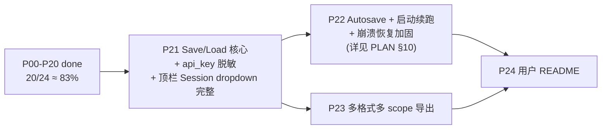

# N.E.K.O. Testbench 实施进度

> 本文档是**断点续跑的关键凭证**。每一阶段开始/完成/受阻时必须更新。
> 对应计划文件: [PLAN.md](./PLAN.md)  (亦同步于 `.cursor/plans/*.plan.md`)
>
> 状态规范: `pending` / `in_progress` / `done` / `blocked`

---

## 阶段总览

| ID | 标题 | 状态 | 备注 |
|---|---|---|---|
| P00 | 存档计划 + 进度检查点 | **done** | 2026-04-17 完成 |
| P01 | 后端骨架 + 目录分离 | **done** | 2026-04-17 完成 |
| P02 | 会话/沙盒/时钟最小实现 | **done** | 2026-04-18 完成 |
| P03 | 前端骨架 + i18n + CollapsibleBlock | **done** | 2026-04-18 完成 |
| P04 | Settings workspace | **done** | 2026-04-18 完成 |
| P05 | Setup workspace (Persona + Import) | **done** | 2026-04-18 完成 |
| P06 | VirtualClock 完整滚动游标模型 | **done** | 2026-04-18 完成 |
| P07 | Setup Memory 四子页读写 | **done** | 2026-04-18 完成 |
| P08 | PromptBundle + Prompt Preview 双视图 | **done** | 2026-04-18 完成 |
| P09 | Chat 消息流 + 手动 Send + SSE | **done** | 2026-04-18 完成 |
| P10 | 记忆操作触发 + 预览确认 | **done** | 2026-04-18 完成 (+ 内置人设预设补丁 2026-04-18) |
| P11 | 假想用户 AI (SimUser) | **done** | 2026-04-19 完成 |
| P12 | 脚本化对话 (Scripted) | **done** | 2026-04-19 完成 |
| P12.5 | Setup → Scripts 子页 (脚本模板编辑器) | **done** | 2026-04-19 完成 (+ 验收期两条小补丁: DOM null 文本 / 移除冗余 [校验] 按钮) |
| P13 | 双 AI 自动对话 (Auto-Dialog) | **done** | 2026-04-19 完成 (后端 4 端点 + UI 手动验收通过; 含 4 条验收期补丁: 风格下拉空白 / stopped 事件 completed_turns=0 / banner 大片空白跳动 / Stop 后半轮悬空) |
| P14 | Stage Coach 流水线引导 | **done** | 2026-04-19 完成 (后端 5 端点 + 顶栏折叠/展开双形态 chip + 上下文面板 + 历史; 烟测五端点全绿) |
| P15 | ScoringSchema + Schemas 子页 | **done** | 2026-04-19 完成 (pipeline/scoring_schema.py + 三套 builtin JSON + judge_router 10 端点 + Evaluation 子页容器 + Schemas 子页完整编辑器; 烟测 list/get/validate/PUT/duplicate/preview/export/delete 全绿) |
| P16 | 四类 Judger + Run 子页 | **done** | 2026-04-19 完成 (pipeline/judge_runner.py 4 类 judger + /judge/run 闭环 + /judge/results{/id} CRUD + Evaluation → Run 子页; 用户手测通过, UI 验收 6 条反馈全修; 四类 judger + CRUD 端到端烟测全绿) |
| P17 | Results + Aggregate 子页 + 导出报告 | done | 2026-04-20: Results/Aggregate 双子页 + judge_export.py + 内联评分徽章 + 跨 workspace 导航 (+ hotfix 6: Aggregate 指标/章节中文释义补充) + P19 后 hotfix 补丁轮 (按钮样式统一 / Scripts 跨 workspace 广播 / Stage Coach evaluation 阶段 op 升级 / Script run_all Stop 按钮 / Stage chip 在 evaluation workspace 升级为展开形态, 见 AGENT_NOTES §4.24 #81-#82) |
| P18 | 快照/时间线/回退 | **done** | 2026-04-20: `pipeline/snapshot_store.py` + `routers/snapshot_router.py` (6 端点) + session_store 挂 SnapshotStore 生命周期 + 8 路业务拦截点自动建快照 + 前端 `topbar_timeline_chip.js` (快速回退) + `diagnostics/page_snapshots.js` (完整管理) + i18n `snapshots.*` 子树. 后端烟测: create / edit debounce merge / rewind / overflow 至冷 / GET cold lazy-decompress / rename / delete 全绿. |
| P19 | Diagnostics 错误+日志核心 | done | 2026-04-20: `pipeline/diagnostics_store.py` 进程级 ring buffer (200 条) + `routers/diagnostics_router.py` (errors CRUD + logs sessions/tail/export) + 全局异常中间件三沉 (python logger + session JSONL + ring buffer) + `workspace_diagnostics.js` 重构为 subnav + `page_errors.js` / `page_logs.js` 正式版 + Snapshots/Paths/Reset 占位 + `errors_bus.js` 后端镜像同步. hotfix 2 (同日): 加日志滚动保留 — `config.LOG_RETENTION_DAYS=14` (env 覆盖) + `logger.cleanup_old_logs/collect_logs_usage` + server boot 清一次 + 12h `asyncio` 后台任务 + `GET /logs/retention` & `POST /logs/cleanup` + Logs 子页 `diag-retention-bar` 显示"保留 N 天 · M 文件 · X KB" 和 `[清理旧日志]` 按钮. 今天的文件永不删; Errors ring buffer 本来就 200 上限 + 重启清零, 零磁盘痕迹. hotfix 3 (同日): 加 DEBUG 档 + op catalog + 可读性改进 — `config.LOG_DEBUG_ENABLED=False` (env 覆盖) 默认 silent, `SessionLogger.debug()` 高频 echo 走此档; `chat.prompt_preview` 降 DEBUG 省 32% 体量; `GET/POST /api/diagnostics/logs/debug` 运行期 hot-toggle (不重启生效); 新 `static/ui/diagnostics/op_catalog.js` 字典给 30+ 常见 op 配中文 label + 一句话描述 + 分类, 行头 tooltip + 展开态常驻提示; Session dropdown 加 `★ 当前` 标记并置顶 + 友好化 label; 修 `.diag-entry-body { display: flex }` 覆盖 `.cb-body { display: none }` 导致的折叠失效 bug. hotfix 4 (同日): 加"全部会话"合并视图 + 折叠状态持久化 — 后端 `tail_logs` 收到 `session_id='*'` (或 `'all'`) 时扫 `LOGS_DIR` 合并当日所有 `<sid>-YYYYMMDD.jsonl` 按 `ts` 排序, 每条 record 自动 `setdefault('session_id', sid)` 让前端能 badge 来源; `GET /logs/sessions` 响应补 `all_dates` 字段 (所有 session 的日期并集) 供合并模式的日期下拉; `page_logs.js` session dropdown 置顶 `☆ 全部会话 (合并 N 个)` 选项, 切到此模式时 date 下拉用 `allDates` 并集、导出按钮 disable 加 tooltip (合并视图没有单一源文件); 合并模式每条 entry 行头加 `diag-entry-session-badge` 小徽标 (短 id + 完整 id tooltip) 让测试人员立即看出哪条来自哪会话. 同时修自动刷新 5s 重渲染清空展开状态的 bug — 加 `state.toggledKeys: Map<entryKey, bool>` 显式记录用户点开/折叠过的 entry, `entryKey = ts|level|op|session_id|error头|payloadKeys`; WARN/ERROR 默认展开 (`defaultOpenFor(level)` 归档值), INFO/DEBUG 默认折叠; 用户显式切换后永远尊重其意图跨 renderAll; 切 session/date 时 `toggledKeys.clear()` (上下文变了旧展开不再相关). 烟测验证 (sessions=70, all_dates=3 天, 合并 total=167 条按 ts 排序 ok, 单 session 模式无回归, export 对 `*` 返 404). |
| P20 | Diagnostics Paths + Reset (Snapshots 并入 P18) | **done** | 2026-04-20: `health_router` 加 `GET /system/paths` + `POST /system/open_path` (白名单 DATA_DIR symlink-safe, 跨 OS 启动文件管理器); `pipeline/reset_runner.py` 三级 Soft/Medium/Hard + 自动 `pre_reset_backup` + Hard 保留 model_config; `session_router` 加 `POST /api/session/reset` (锁 + 二次 confirm). 前端 `page_paths.js` (3 组表格 + Copy + Open + 代码侧 readonly + gitignore 提示) + `page_reset.js` (自定义 modal 二次确认 + 清单 bullet + 广播刷新). 删除 `page_placeholder.js` dead code 和 i18n `placeholder.*`. 修 `capture_safe` 吞 `is_backup=True` 的 bug (Hard Reset 首版把 pre_reset_backup 也误清). 后端 + jsdom mount 烟测全绿. |
| P21 | 保存/加载核心 (persistence) | pending | |
| P22 | 自动保存 + 启动时断点续跑 | pending | |
| P23 | 多格式多 scope 导出 | pending | |
| P24 | 文档 README | pending | |

---

## 阶段详情

### [x] P00 存档计划 + 进度检查点
- 目标: 建立 docs/ 基础设施, 保证后续任一阶段中断可无缝继续
- 产物:
  - `tests/testbench/__init__.py` (占位)
  - `tests/testbench/docs/PLAN.md` (PLAN 完整副本, 87976 bytes)
  - `tests/testbench/docs/PROGRESS.md` (本文件)
  - `tests/testbench/docs/AGENT_NOTES.md` (恢复指南)
  - `.gitignore` 追加 `tests/testbench_data/`
- 状态: done (2026-04-17)
- 子任务:
  - [x] 创建 `tests/testbench/__init__.py`
  - [x] 创建 `tests/testbench/docs/` 目录
  - [x] 拷贝 PLAN.md (87976 bytes)
  - [x] `.gitignore` 追加 `tests/testbench_data/`
  - [x] 写 PROGRESS.md
  - [x] 写 AGENT_NOTES.md
- 遗留: 无

### [x] P01 后端骨架 + 目录分离
- 目标: FastAPI 能启动, `uv run python tests/testbench/run_testbench.py --port 48920` 可访问 `/healthz`; 数据目录自动建立
- 产物:
  - `tests/testbench/config.py` (路径常量 + 数据根目录 + `ensure_data_dirs` / `ensure_code_support_dirs`)
  - `tests/testbench/run_testbench.py` (CLI, 默认 127.0.0.1, 公网绑定时 WARN)
  - `tests/testbench/server.py` (FastAPI app + 静态/模板挂载 + 全局异常中间件占位)
  - `tests/testbench/logger.py` (SessionLogger JSONL + Python logger)
  - `tests/testbench/routers/health_router.py` (/healthz, /version)
  - `tests/testbench/templates/index.html` (最小占位)
  - `tests/testbench/static/.gitkeep`, `tests/testbench/scoring_schemas/.gitkeep`, `tests/testbench/dialog_templates/.gitkeep`
  - `tests/testbench_data/` 及 7 个子目录 + `tests/testbench_data/README.md` (运行时自动生成)
- 状态: done (2026-04-17)
- 自测: `uv run python tests/testbench/run_testbench.py --port 48920` 启动成功; `/healthz` 返回 `{"status":"ok"}`; `/version` 返回完整元信息; `/` 渲染中文占位页; `tests/testbench_data/` 树正确创建
- 遗留: 无

### [x] P02 会话/沙盒/时钟最小实现
- 目标: POST /api/session 能建会话, GET /api/session 能读状态, sandbox 能 patch ConfigManager 且 restore
- 产物:
  - `tests/testbench/virtual_clock.py` (最小 API: cursor/now/set_now/advance + to_dict/from_dict)
  - `tests/testbench/sandbox.py` (Sandbox 类, ConfigManager 14 属性 swap/restore, 目录自动建)
  - `tests/testbench/session_store.py` (Session dataclass + SessionState 枚举 + SessionStore 单槽 + asyncio.Lock + session_operation 上下文管理器 + SessionConflictError)
  - `tests/testbench/routers/session_router.py` (`POST/GET/DELETE /api/session` + `GET /api/session/state`)
  - `tests/testbench/server.py` 挂载新路由 + 注册 shutdown 清理钩子 + 全局异常返回带 `session_state`
  - `tests/testbench/run_testbench.py` 启动时从 sys.path 移除 `tests/testbench/` 以避免与根 `config` 包命名冲突
- 状态: done (2026-04-18)
- 子任务:
  - [x] virtual_clock.py 最小 API
  - [x] sandbox.py (apply/restore/destroy, 含 mmd/plugins 等现代字段)
  - [x] session_store.py (Lock + 状态机 + 单活跃会话不变量 + session_operation)
  - [x] session_router.py 四端点
  - [x] server.py 挂载 + shutdown 钩子 + 路径冲突修复
  - [x] 启动自测通过: POST/GET/DELETE /api/session 全链路; 沙盒目录含 config/memory/character_cards/live2d/vrm/vrm/animation/mmd/mmd/animation/workshop/plugins 11 个子目录; 连续 POST 正确替换旧会话沙盒; DELETE 清理沙盒; state 端点正常
- 自测证据:
  - `curl /healthz` → `{"status":"ok"}`
  - `POST /api/session` → 返回 sandbox.applied=yes, 磁盘上建成 `tests/testbench_data/sandboxes/<id>/N.E.K.O/...`
  - 连续 POST → 旧会话沙盒自动销毁, 只留新的
  - `DELETE /api/session` → sandboxes/ 下为空
- 遗留: 无 (P06 会扩展 virtual_clock 完整滚动游标 API; 当前 `messages/snapshots/eval_results/model_config/stage` 字段已在 Session dataclass 预留, 后续 phase 追加即可)

### [x] P03 前端骨架 + i18n + CollapsibleBlock
- 目标: 浏览器打开能看到顶栏 + 5 workspace 切换骨架; 折叠组件工作, 中文文案可切换
- 产物:
  - `static/testbench.css` (暗色主题 + 顶栏/tab/workspace/dropdown/cb/toast/modal/form 全套样式)
  - `static/core/i18n.js` (zh-CN 文案字典 + `i18n(key, ...args)` + `i18nRaw` + `hydrateI18n(root)` 扫 `data-i18n*` 属性)
  - `static/core/state.js` (单 store + `on/off/emit` 事件总线 + 开发期 `window.__tbState`)
  - `static/core/toast.js` (右下角 4 种 toast: ok/info/warn/err, actions 按钮 + 自动淡出)
  - `static/core/api.js` (fetch 封装统一 `{ok,status,data,error}` + 5xx/400/403 自动 toast + 广播 `http:error` + `openSse()`)
  - `static/core/collapsible.js` (CollapsibleBlock 工厂: 摘要+length badge+copy+localStorage `fold:<session>:<block>` + Alt+Click 批量 + Expand/Collapse all 工具栏)
  - `static/ui/topbar.js` (Session dropdown 接入 `/api/session` POST/DELETE, Stage/Timeline chip 占位, Err 徽章订阅 `http:error`, ⋮Menu 跳 Diagnostics/Settings)
  - `static/ui/workspace_placeholder.js` (通用占位渲染器: 标题+说明+后续 todo tag 列表)
  - `static/ui/workspace_{setup,chat,evaluation,diagnostics,settings}.js` (5 个瘦 mount 入口)
  - `static/app.js` (引导: DOMContentLoaded → hydrateI18n → mountTopbar → mountTabbar → renderWorkspaces → 订阅 `active_workspace:change` 切 section + 懒挂载)
  - `templates/index.html` (#app 三段 grid: #topbar/#tabbar/#workspace-host + #toast-stack)
- 状态: done (2026-04-18)
- 子任务:
  - [x] testbench.css 全套样式 (含 chip/dropdown/cb/toast/modal/form)
  - [x] core/i18n.js + hydrateI18n
  - [x] core/state.js 单 store + 事件总线
  - [x] core/toast.js 四种 kind + auto-dismiss
  - [x] core/api.js fetch 封装 + openSse
  - [x] core/collapsible.js + Alt+Click 批量 + container toolbar
  - [x] ui/topbar.js Session dropdown 接入后端 + 所有 chip/menu 占位项 i18n 化
  - [x] ui/workspace_placeholder.js + 5 个 workspace 瘦 mount
  - [x] app.js 引导 + tab 路由 + 懒挂载
  - [x] templates/index.html 改为三段 grid
- 自测证据:
  - 所有 15 个静态资源 (CSS/JS/HTML) HTTP 200 下发
  - `GET /` 返回 845 字节最小 HTML 外壳, 真正 UI 由 `static/app.js` 客户端渲染
- 遗留: 无 (Stage/Timeline/Menu 若干项按计划占位, 显式 toast `"P14/P18/P21 后实装"`)

### [x] P04 Settings workspace
- 目标: 可配置四组模型 (chat/simuser/judge/memory), 测试连通性; 只读展示 providers 与 api_keys.json 状态
- 产物:
  - `tests/testbench/model_config.py` (`ModelGroupConfig` Pydantic + `ModelConfigBundle` 4 组 + `from_session_value` 兼容空 dict 入口)
  - `tests/testbench/api_keys_registry.py` (只读包装 `tests/api_keys.json`, lazy cache + `reload()` + provider→字段映射, `is_present` 剔除 `sk-...` 占位)
  - `tests/testbench/routers/config_router.py`:
    - `GET /api/config/model_config` 返回 4 组 summary (api_key 永不回显明文)
    - `PUT /api/config/model_config` 整体替换 (pydantic 校验失败→422)
    - `PUT /api/config/model_config/{group}` 增量 patch, `exclude_unset` 不覆盖未填字段
    - `GET /api/config/providers` flatten `assist_api_providers` + 每项标注 `api_key_field`/`api_key_configured`
    - `GET /api/config/api_keys_status` 返回 known/extra/path/last_mtime/provider_map
    - `POST /api/config/api_keys/reload` 强制 re-read
    - `POST /api/config/test_connection/{group}` 通过 `ChatOpenAI.ainvoke` 实发一轮短 prompt, 捕获全部异常为结构化 `{ok, latency_ms, error, response_preview}`
    - 所有修改型端点走 `session_operation(...)`, 冲突→409 带 `state/busy_op`; 无会话→404
  - `tests/testbench/server.py` 挂载 `config_router`
  - `tests/testbench/routers/health_router.py` phase 改 `P04`
  - `static/testbench.css` 追加 `.workspace.two-col` + `.subnav/.subpage/.card/.tbl/.badge/.form-grid/.kv-list/.status-line`
  - `static/core/i18n.js` 追加 `settings.*` 全部文案 (含 `api_key_status.from_preset(name)` 函数式文案)
  - `static/ui/workspace_settings.js` 二栏骨架: 左 subnav 5 子页 + `localStorage:testbench:settings:active_subpage` 记忆选中页
  - `static/ui/settings/_dom.js` `el()/field()` 工具 (避免每个子页都写 createElement)
  - `static/ui/settings/page_models.js` 4 组卡片: provider select + Apply preset 自动填 base_url/推荐 model (memory 组用 summary_model 其余用 conversation_model) + Save/Revert/Test 三按钮; api_key 输入框 `type=password`, 空时 hint 自动显示"将使用 tests/api_keys.json 的 xxx 字段"
  - `static/ui/settings/page_api_keys.js` 表格列出 known 字段 + 关联 provider + 徽章状态 + 额外字段 + Reload 按钮
  - `static/ui/settings/page_providers.js` 只读表格, 每行显示 key/name/base_url/conversation_model/summary_model/api_key 状态, free 版标 badge
  - `static/ui/settings/page_ui.js` 本期占位 (Language/Theme/Snapshot limit 均 disabled), 唯一功能: 清除当前会话 localStorage fold 键
  - `static/ui/settings/page_about.js` 读 `/version` + i18n 列出本期限制声明
- 状态: done (2026-04-18)
- 自测证据:
  - `GET /version` → `phase: P04`
  - `GET /api/config/providers` → 17 个 provider, 每个带 `base_url / suggested_models / api_key_configured`
  - `GET /api/config/api_keys_status` → `{known: {...6个 true, kimi: false}, provider_map: {8 项}, extra: []}`
  - `POST /api/session` → 建会话
  - `PUT /api/config/model_config/chat` (qwen 预设 + 假 key) → 200, 返回 masked summary
  - `POST /api/config/test_connection/chat` → 200, `ok: false, latency_ms: 562, error.type: AuthenticationError` (真的打到了阿里百炼, 401 属意料之中)
  - `DELETE /api/session` → 沙盒恢复; 之后 `GET /api/config/model_config` → 404 detail `NoActiveSession`
  - 所有 10 个 P04 新增/修改静态资源 HTTP 200 下发
- 遗留: api_key 脱敏的"保存会话" (P21) / UI 偏好真实落盘 (P22) / test_connection SSE 版 (不需要, 本期同步即可)
- 夹带 (side-quest, 已完成, P19 前的临时方案):
  - `static/core/errors_bus.js` 统一收 `http:error` / `sse:error` / `window.error` / `unhandledrejection` 四类错误到 `store.errors` 环形缓冲 (cap=100) + 广播 `errors:change`.
  - `static/ui/topbar.js` Err 徽章改为纯 `errors:change` 订阅 (不再直接监听 `http:error`), 点击直接跳 Diagnostics (不再 toast 中转).
  - `static/ui/workspace_diagnostics.js` 从 placeholder 改为"**临时** Errors 面板": 工具栏 (计数 / 制造测试错误 / 展开全部 / 折叠全部 / 清空) + 每条错误可折叠 (标题: 时间·来源·类型·摘要; 展开: 完整 JSON detail).
  - `static/core/i18n.js` 追加 `diagnostics.errors.*` 文案.
  - `static/app.js` 在 `boot()` 一开头 (`hydrateI18n` 之前) 调 `initErrorsBus()`, 保证能捕获启动期错误.
  - **P19 迁移路径**: P19 把 Diagnostics 拆成 Logs/Errors/Snapshots/Paths/Reset 五子页时, 本"临时 Errors 面板"直接替换为完整 Errors 子页; `errors_bus.js` 继续保留, Errors 子页订阅同一个 `errors:change` + 追加服务端日志拉取即可, 无需重写收集层.

### [x] P05 Setup workspace (Persona + Import 子页)
- 目标: Persona 编辑表单可改可存; Import 能从真实角色一键拷贝到沙盒 (memory 子目录 + system_prompt)
- 产物:
  - **后端**
    - `tests/testbench/persona_config.py` — `PersonaConfig` Pydantic 模型 (`master_name` / `character_name` / `language` / `system_prompt`) + `from_session_value()` 归一化, `summary()` 面向 API 输出.
    - `tests/testbench/sandbox.py` — 新增 `real_paths()`, 返回 ConfigManager **patch 前**的 `docs_dir / app_docs_dir / config_dir / memory_dir / chara_dir`; Import 用它读主 App 真实目录, sandbox 未 apply 时返回空 dict (调用方视为"建会话后再来").
    - `tests/testbench/session_store.py::Session` — 新增 `persona: dict` 字段 (默认空 dict, 代表"未编辑过, 表单为空"); 不进 `describe()` — 避免把 system_prompt 大文本塞进 `/api/session` 高频查询.
    - `tests/testbench/routers/persona_router.py` — 四个端点:
      - `GET  /api/persona` 读当前 persona
      - `PUT  /api/persona` 整体替换 (Pydantic 校验)
      - `PATCH /api/persona` 局部合并 (未指定字段保留)
      - `GET  /api/persona/real_characters` 枚举主 App `characters.json` 中的猫娘 (返回 `name / is_current / has_system_prompt / memory_dir_exists / memory_files`)
      - `POST /api/persona/import_from_real/{name}` 拷贝 `memory_dir/{name}/*` → 沙盒 + 写 `sandbox/config/characters.json` (三键: 主人/猫娘/当前猫娘, 与上游 `ConfigManager.load_characters` 兼容) + 用真实 `_reserved.system_prompt` 回填 `session.persona`.
    - 写入目标始终经由当前 `cm.config_dir / cm.memory_dir` (即沙盒路径), 从不触碰主 App 文档目录, 实现**读真实 / 写沙盒**严格单向.
    - `routers/health_router.py` `phase: "P05"`; `server.py` `include_router(persona_router.router)`.
  - **前端**
    - `static/ui/_dom.js` — 从 `static/ui/settings/_dom.js` 提升到 `ui/` 层, 供 Settings + Setup 共用 `el` / `field` 帮手. Settings 侧 6 处 import 已同步改成 `../_dom.js`.
    - `static/ui/workspace_setup.js` — 从占位改造成 `.workspace.two-col` (左 nav 四项: Persona / Import / Virtual Clock / Memory; 右栏 `.subpage`), 跟 Settings 同款骨架; 通过 `localStorage[testbench:setup:active_subpage]` 记忆最后打开的子页.
    - `static/ui/setup/page_persona.js` — 表单 (master_name / character_name / language `<select>` / system_prompt `<textarea rows=14>`), [Save] → `PUT /api/persona`, [Revert] 还原到最近一次服务器返回. 无会话时 `/api/persona` 返回 404 → 渲染"先建会话"空态 (并通过 `expectedStatuses: [404]` 抑制 toast/errors_bus).
    - `static/ui/setup/page_import.js` — 顶部"数据源"卡片 (主 App `config_dir / memory_dir / 主人`), 下方每个真实猫娘一行: 名称 + 徽章 (`当前 / prompt ✓/✗ / 无 memory 目录`) + memory 文件清单 + [导入到当前会话] 按钮. 点击后 POST `/api/persona/import_from_real/{name}`, 成功 toast 提示复制几个文件; 无会话时渲染引导空态.
    - `static/ui/setup/page_virtual_clock.js` / `page_memory.js` — 友好占位, 文案指向 P06 / P07.
    - `static/core/i18n.js` — 追加 `setup.*` 命名空间 (nav / no_session / persona / import / memory / virtual_clock).
    - `static/testbench.css` — 追加 `.badge.primary` + `.meta-card*` + `.import-list / .import-row*` 样式, 复用既有 `.card / .form-grid / .status-line / .empty-state`.
- 状态: done (2026-04-18)
- 自测 (手工):
  - 静态资源全 200 (`/static/ui/_dom.js`, `/static/ui/setup/*.js`, `/static/testbench.css`).
  - 无 session: Setup → Persona 渲染空态, Setup → Import 渲染空态, 右上 Err 徽章保持 0 (`expectedStatuses` 生效).
  - 新建 session → Setup → Persona: 默认 `language=zh-CN`, 其它空; 填字段 [Save] → toast "已保存", [Revert] 还原; 刷新页保留.
  - Setup → Import: 显示主 App 真实猫娘 (若有) + 路径溯源; 点击 [导入到当前会话] 后 Persona 子页 refresh 可见回填的 master_name / system_prompt.
  - 沙盒下 `characters.json` / `memory/{name}/` 由 Import 写入; 主 App 真实目录文件修改时间不变.
- 设计取舍:
  - **编辑 vs 上游 characters.json 解耦**: 本期 Persona 编辑*不*回写 `characters.json`, 以避开 `ConfigManager.migrate_catgirl_reserved` 一大串迁移逻辑; P08 Prompt 合成直接读 `session.persona`. Import 时例外 — 写 `characters.json` 是为了让 P07 Memory 子页打开时 `PersonaManager / FactStore` 能原样工作.
  - **Real paths 通过 sandbox 私有快照读**: 简化理由是 `Sandbox.restore()` 调用后 `_originals` 被清空, 所以只在 `_applied=True` 窗口可用; 足够本期场景 (所有 API 先 `_require_session` 确认会话存在).
  - **覆盖式 import**: 重复点同一角色的 [导入] 会覆盖沙盒内同名 memory 文件; 本期不加 confirm (沙盒本就是可抛弃态), P07 Memory 编辑后可能需要补对话框, 届时再处理.

### [x] P06 VirtualClock 完整滚动游标模型
- 目标: bootstrap / cursor / per_turn_default / pending_next_turn 全链路; Setup → Virtual Clock 可见可调
- 产物:
  - **后端**
    - `tests/testbench/virtual_clock.py` — 扩展完整滚动游标模型:
      - 字段: `cursor` (live now) / `bootstrap_at` (session 起点) / `initial_last_gap_seconds` (首条消息前的"上次对话 X 秒前") / `per_turn_default_seconds` (默认每轮 +Δt) / `pending_advance` + `pending_set` (互斥的"下一轮 stage").
      - 方法: `now` / `gap_to(earlier) -> timedelta` / `advance(delta)` / `set_now(dt|None)` / `set_bootstrap(..., sync_cursor=True)` (分字段更新, `_UNSET` 哨兵区分"不变 vs 清除") / `set_per_turn_default` / `stage_next_turn(delta=, absolute=)` (两个都给时 `absolute` 胜) / `clear_pending` / `consume_pending` (`/chat/send` 开头调用) / `reset` (回到裸构造态).
      - `to_dict / from_dict` 全兼容 P02 老快照 (pending / bootstrap_at 字段缺失时按"未设"处理).
    - `tests/testbench/routers/time_router.py` — 8 个端点, 全部走 `session_operation` 锁:
      - `GET  /api/time`                       完整快照 (session_id + full clock dict)
      - `GET  /api/time/cursor`                轻量 "live now" (1Hz UI tick 用)
      - `PUT  /api/time/cursor`                绝对设置 (`absolute=null` 释放回真实时间)
      - `POST /api/time/advance`               相对推进 (`delta_seconds`, 可负)
      - `PUT  /api/time/bootstrap`             分字段更新; 用 Pydantic `model_fields_set` 区分"字段未给 / 显式 null", 只改客户端声明了的那部分; `sync_cursor=True` (默认) 把 `bootstrap_at` 同步到 `cursor`.
      - `PUT  /api/time/per_turn_default`      `{seconds: int|null}`, null 清除.
      - `POST /api/time/stage_next_turn`       `{delta_seconds|absolute}`, 二选一互斥 (`model_validator` 兜底).
      - `DELETE /api/time/stage_next_turn`     清 pending 的专用路由 (REST 语义更干净).
      - `POST /api/time/reset`                 一键清 cursor + bootstrap + per_turn_default + pending; 不影响消息和记忆.
      - 所有响应统一返回 `{session_id, clock: <to_dict>}`; 无 session → 404 (前端侧 `expectedStatuses: [404]` 消声).
    - `routers/health_router.py` `phase: "P06"`; `server.py` include `time_router.router`.
  - **前端**
    - `static/core/time_utils.js` — 共享工具: `parseDurationText('1h30m'|'45s'|'-2d 4h'|'120')` → 秒数 (接受纯数字按秒); `secondsToLabel` → 规范 `"1h 30m"`; `datetimeLocalValue` / `datetimeLocalToISO` 把 `<input type="datetime-local">` 和后端 naive isoformat 串接 (双方都当 local wallclock, 匹配上游 `datetime.now()` 语义); `formatIsoReadable` 给人看. 以后 Chat composer P09 / Scripted P12 可直接复用, 避免各模块独立实现解析分歧.
    - `static/core/api.js` — 新增 `api.request(url, {method, body, headers, expectedStatuses})` 通用逃生口; `PUT` + `PATCH` 同步加上 `expectedStatuses` 转发 (P04/P05 漏网); 原 5 个简写方法不变.
    - `static/ui/setup/page_virtual_clock.js` — 从占位升级为 5 张卡片:
      1. **Live cursor**: 大字 `now` + `real time / virtual` 徽章; `real_time=true` 时 1Hz 本地 tick 自动刷新 (`label.isConnected === false` 自动熄火, 切子页无 `setInterval` 泄漏); 绝对设置 / Release / 相对推进 (输入 "1h30m" 或 "-2d" 或 "+5m/+1h/+1d" 预设按钮).
      2. **Bootstrap**: `bootstrap_at` + `initial_last_gap` 输入 + "同时同步 live cursor"复选; [Set bootstrap] / [Clear bootstrap_at] / [Clear initial_last_gap] 分字段独立清除.
      3. **Per-turn default**: `+Δt` 默认值, 输入空白时 Save = 清除.
      4. **Pending**: 显示当前 pending (delta / absolute / none), 三个按钮 Stage delta / Stage absolute / Clear pending.
      5. **Reset**: confirm 对话框后 `/api/time/reset`.
      - `mutate(ctx, ...)` helper 在每次成功 mutate 后直接用响应里的 clock 快照整页 re-render, 保证各块数据永远同步.
    - `static/core/i18n.js` — `setup.virtual_clock.*` 完整扩表 (heading / intro / live / bootstrap / per_turn_default / pending / reset / status); 原 placeholder 命名空间被替换.
    - `static/testbench.css` — 追加 `.form-row` (label + inputs + 按钮平铺 flex) / `.now-row` + `.big-now` (等宽大字显 now) / `.inline-check` / `.tiny`.
- 状态: done (2026-04-18)
- 自测 (手工):
  - 无 session: Setup → Virtual Clock 渲染"先建会话"空态, 右上 Err 徽章保持 0.
  - 建 session → `GET /api/time`: `cursor=null, is_real_time=true, bootstrap_at=null, per_turn_default=null, pending={advance_seconds:null, absolute:null}`.
  - `PUT /api/time/cursor {absolute:"2026-04-18T09:00:00"}` → 响应 `is_real_time=false, cursor="2026-04-18T09:00:00"`; 大字数字冻结 (不再 tick).
  - `POST /api/time/advance {delta_seconds: 3600}` → cursor 前进 1h.
  - `PUT /api/time/cursor {absolute:null}` → 释放; 大字恢复 1Hz tick.
  - `PUT /api/time/bootstrap {bootstrap_at:"2026-04-17T08:00:00", initial_last_gap_seconds:3600, sync_cursor:true}` → cursor 同步; 再发 `{bootstrap_at:null, sync_cursor:false}` 只清 bootstrap, `initial_last_gap` 保持.
  - `POST /api/time/stage_next_turn {delta_seconds: 1800}` → `pending.advance_seconds=1800`; 再发 `{absolute:"2026-04-19T09:00:00"}` → `pending.absolute=...` 且 `advance_seconds=null` (互斥).
  - `DELETE /api/time/stage_next_turn` → 全 null.
  - `POST /api/time/reset` → 全部回到初始.
- 设计取舍:
  - **秒 (int) 做主单位**: 传输层用 `delta_seconds`, UI 用文本 "1h30m" 前端自解析; JS `Number` 对合理 turn 长度完全精确, 比 ISO duration `PT1H30M` 省掉一层解析库.
  - **Bootstrap 字段独立清除**: 用 Pydantic `model_fields_set` 而非单独的 `DELETE` 子路由; 三个清除按钮都只需调用 `PUT` + `{field: null}`, 路由表不膨胀.
  - **响应统一回传完整 clock**: 避免 UI 每个 mutate 后追发 `GET /api/time`, 降低抖动与竞态 (下一轮 send 与时钟编辑抢锁时, 409 就直接显"等一下").
  - **Virtual 游标不自 tick**: 只在 `cursor === null` 时本地 1Hz tick; 虚拟 now 是静态冻结值, 只有 advance/stage/consume_pending 才动. 这样 UI 和 `clock.now()` 语义严格一致.
  - **P06 只做 stage + reset, 不做"pending 消费"**: `consume_pending` 方法已就位, 但没有路由调用 — 真正消费发生在 P09 `/chat/send` 开头. 这里先保证数据模型与 UI 可观测, 避免本阶段写一个会在 P09 被拆掉的 "手动 consume" 端点.

### [x] P07 Setup Memory 四子页读写
- 目标: 可查看/编辑沙盒内 recent/facts/reflections/persona 四个 JSON 文件 (原始 JSON 编辑器; 触发类按钮留给 P10)
- 产物:
  - **后端**
    - `tests/testbench/routers/memory_router.py` — 新增, 共 6 端点:
      - `GET  /api/memory/state`                landing 探针, 对 4 个文件做 stat (exists / size_bytes / mtime), 不读内容.
      - `GET  /api/memory/{kind}`               返回 `{kind, path, character_name, exists, data}`; 文件缺失时 `exists=false, data` 为该 kind 的默认空值 (list → `[]`, dict → `{}`).
      - `PUT  /api/memory/{kind}`               body `{data: ...}`; 顶层类型/元素 dict 形状检查, `tmp + os.replace` 原子写; 经 `session_operation("memory.write:{kind}")` 加锁.
      - `kind ∈ {recent, facts, reflections, persona}`; 未知 kind → 404 `UnknownMemoryKind`.
      - 前置: 无 session → 404 `NoActiveSession`; session 有但 `persona.character_name=""` → 409 `NoCharacterSelected`.
      - **非加工**: 不经 `PersonaManager.ensure_persona` / `FactStore.save_facts` 等上游 loader, 直接读写磁盘 JSON. 避免 persona.json 首次加载的 `character_card` 合并副作用偷偷改变"测试人员刚保存的内容". 上游的迁移会在 P09 真实 chat 跑时再触发.
    - `routers/health_router.py` → `phase: "P07"`; `server.py` → `include_router(memory_router.router)`.
  - **前端**
    - `static/ui/setup/memory_editor.js` — 共用 JSON 编辑器组件: meta 条 (文件路径 + exists 徽章) + 顶部徽章 (合法/非法 JSON / dirty / 条目数) + 大号 `.json-editor` textarea + 4 按钮 (Save / Reload / Format / Revert) + 状态行. 用 `api.get(..., expectedStatuses: [404, 409])` 静默化"无会话/无角色"的引导空态, 不污染 Err 徽章.
    - `static/ui/setup/page_memory_recent.js` / `page_memory_facts.js` / `page_memory_reflections.js` / `page_memory_persona.js` — 4 个薄包装, 各自 `renderMemoryEditor(host, '<kind>')` 一行出页; PLAN 里提到的表格化/两列 UI 等富编辑留给 P10 触发按钮成型后再叠加.
    - `static/ui/workspace_setup.js` — 重构: 左侧 nav 支持 `kind: 'group'` 非交互分组标题, 在 Virtual Clock 之后追加"记忆 (Memory)"分组 + 4 项子页 (最近对话 / 事实 / 反思 / 人设记忆). `firstPage()` 帮手兼顾读 `localStorage[testbench:setup:active_subpage]` 时的合法校验.
    - `static/core/i18n.js` — 替换 `setup.nav.memory` 占位为 `memory_group` + 4 个子页 key; 重写 `setup.memory.*` 为完整编辑器文案 (editor.recent/facts/reflections/persona 各自 heading+intro, 共用 buttons/badges/status).
    - `static/testbench.css` — 追加 `.subnav-group` 非交互分组标题样式 + `.json-editor` 大号等宽可纵向拉伸 textarea + `.badge.secondary`.
    - 删除 `static/ui/setup/page_memory.js` 占位 (被 4 个子页取代).
- 状态: done (2026-04-18)
- 自测 (API + 静态资源):
  - `GET /version` → `phase: "P07"`.
  - 无 session: `GET /api/memory/recent` → 404, `GET /api/memory/state` → 404, Err 徽章保持 0.
  - 建 session (character 未设): `GET /api/memory/recent` → 409 `NoCharacterSelected`.
  - `PUT /api/persona {character_name}` 后: `GET /api/memory/state` → 200, 4 个文件 `exists=false`.
  - `PUT /api/memory/facts` (合法 list), `PUT /api/memory/reflections`, `PUT /api/memory/recent`, `PUT /api/memory/persona` (合法 dict) 全 200, roundtrip 数据一致, 磁盘 `memory_dir/{char}/{kind}.json` 生成.
  - 422 触发: 给 facts (list-kind) 传 dict / 给 recent 传字符串列表 / 给 persona 传 `{entity: "string"}` → 分别 `InvalidRootType / InvalidListItem / InvalidDictValue`.
  - 未知 kind `GET /api/memory/bogus` → 404 `UnknownMemoryKind`.
  - 静态资源: `memory_editor.js / page_memory_recent.js / page_memory_facts.js / page_memory_reflections.js / page_memory_persona.js / workspace_setup.js / i18n.js / testbench.css` 全 HTTP 200; 已删除的 `page_memory.js` → 404 (确认无残余引用).
- 设计取舍:
  - **原始 JSON textarea 而非结构化表单** (初版): Memory 四个文件的真实 schema 边界在上游代码里, 用表单固化只会早早跟真实 schema 漂移 (比如 reflections 的 `status` 会在 P09/P10 被 ReflectionEngine 加新态). 大 textarea + JSON 校验 + 合法才亮 Save 的组合最灵活, 测试人员可以刻意构造畸形载荷探容错.
  - **后端只做顶层类型 + 元素 dict 校验**: 不校验字段级 schema — 那是 PLAN 明令允许的"测试人员可以写错看会不会炸"能力. 上游 loader 本身对坏数据已经是"过滤跳过 + log warning".
  - **4 子页 ≈ 4 行 wrapper** (初版): 未来 PLAN 要求的表格化 Facts / 两列 Reflections 直接在 `memory_editor.js` 旁边加 "视图切换" 或另一个 helper, 不影响当前入口; 体现 YAGNI, 也让 P07 改动表面最小. (2026-04-18 补丁回收: 4 wrapper 保留不动, 在 `memory_editor.js` 内引入 Structured/Raw 双视图 tab, 见下方 P07 补丁. 等 P10 富编辑如果还需要更差异化的 UI 可进一步叠加 per-kind 特殊视图.)
  - **persona.json 明确标注不走 PersonaManager**: 文档里写清楚"这里看到的是磁盘上的原始 JSON, 真实 `ensure_persona` 首次加载会同步角色卡片并重写". 这样测试人员就明白"为什么我保存 `{}` 后 chat 跑完再看 persona.json 又满了" 不是 bug.
  - **P07 补丁 (结构化 + Raw 双视图)** (2026-04-18, 用户反馈后追加): 初版"大 textarea + JSON 校验"对非开发者测试人员有明显门槛. 重构 `memory_editor.js` 为容器 + 两个子视图 (`memory_editor_structured.js` / `memory_editor_raw.js`), 默认 Structured. 4 种 kind 分别按实际 schema 渲染卡片表单, `+` 按钮用 `defaultXxxEntry()` 工厂拉合法默认条目. Raw 视图仍保留以应对罕见情况 (legacy 字段 / multimodal list-of-parts / 故意畸形载荷). 两视图共享 `state.model` 避免状态漂移; 值修改只 notify 刷 dirty badge (不重建 DOM), 结构修改才 redraw, 保证 textarea 连续输入不失焦. 同时修复 `toast(...)` typo (`toast` 是对象, 改 `toast.ok(...)`). 详见变更日志条目 + §4.13 #14.
  - **分组标题 `kind: 'group'`**: 不引入二级 nav. subnav 条目 3+4+1 分组头, 仍然竖向线性, 和现有 Settings/Setup 视觉统一.

### [x] P08 PromptBundle + Prompt Preview 双视图
- 目标: `GET /api/chat/prompt_preview` 返回 `structured + wire_messages`; Chat 右侧面板可切换 Structured / Raw wire 双视图
- 产物:
  - **后端**
    - `tests/testbench/pipeline/__init__.py` — pipeline 子包占位, 后续 chat_runner / memory_runner / simulated_user / scoring_schema / judge_runner 等都会入驻此处.
    - `tests/testbench/pipeline/prompt_builder.py` — 核心模块, 包含:
      - `PromptBundle` dataclass: `structured` (分段 dict, 含 `session_init / character_prompt / character_prompt_template_raw / persona_header / persona_content / inner_thoughts_header / inner_thoughts_dynamic / recent_history / time_context / holiday_context / closing`) + `system_prompt` (扁平化字符串, 即上游真正拼进 prompt 的那份) + `wire_messages` (OpenAI `[{role, content}, ...]` 数组) + `char_counts` (每分段 + 总长 + `approx_tokens = total // 2`) + `metadata` (character/master/language/clock/template_used/stored_is_default/built_at_virtual/built_at_real/message_count) + `warnings: list[str]`.
      - `PreviewNotReady` 异常: 供 router 在 `character_name=""` 时向前端返 HTTP 409.
      - `build_prompt_bundle(session)`: 以 `session.persona` 为唯一真相源组装. **不走**上游 loader (避免 persona.json 首次加载的合并副作用污染 preview). 各 memory manager (`CompressedRecentHistoryManager` / `PersonaManager` / `FactStore` / `ReflectionEngine` / `TimeIndexManager`) 在沙盒内实例化, 每一步都用 try/except 兜底, 失败路径加 `warnings` 且不报废整个 preview. 所有时间字段 (`inner_thoughts_dynamic` / `chat_gap` / `holiday_context` / `built_at_virtual`) 都从 `session.clock.now()` 拿虚拟时间, 不用 `datetime.now()`.
      - 辅助函数: `_normalize_short_lang` (`zh-CN` → `zh`, 走上游 `language_utils.normalize_language_code`) / `_build_name_mapping` (从 session.persona 直接构造 `{LANLAN_NAME}`/`{MASTER_NAME}` 映射, 不依赖 `ConfigManager.get_character_data`, 保证未保存编辑也能即时 preview) / `_resolve_character_prompt` (对齐上游 `get_lanlan_prompt` + `is_default_prompt` 分支, 输出 `lanlan_prompt / template_used / stored_is_default / template_raw`) / `_format_legacy_settings_as_text` / `_build_memory_context_structured_with_clock` / `_flatten_memory_components`.
    - `tests/testbench/routers/chat_router.py` — 新增, `prefix="/api/chat"`. 单个端点 `GET /api/chat/prompt_preview`:
      - 无会话 → 404 `NoActiveSession`
      - `PreviewNotReady` (character_name 为空) → 409 + 结构化 detail
      - 成功 → 200 + `PromptBundle.to_dict()`
      - 其它异常 → 500 (含 traceback 摘要进日志).
    - `tests/testbench/server.py` → `include_router(chat_router.router)`.
    - `tests/testbench/routers/health_router.py` → `phase: "P08"`.
  - **前端**
    - `static/ui/workspace_chat.js` — 从占位改造为 `.chat-layout` 两栏网格: 左栏 `.chat-main` 是消息流占位 (写明"P09 实装"), 右栏 `.chat-sidebar` 由新的 preview panel 模块驻入. Workspace mount/unmount 时 `previewHandle.destroy()` 清理订阅与 DOM.
    - `static/ui/chat/preview_panel.js` — 新增, `mountPreviewPanel(host)` 返回 `{ refresh, markDirty, destroy }`:
      - 面板头: 标题 + 状态行 (加载 / 已加载 + `builtAt` / dirty / 无会话 / 未就绪) + 刷新按钮.
      - 视图切换: Structured / Raw wire 两按钮 (`.view-btn.active`); 视图偏好走 `localStorage[testbench:chat:preview_view]`.
      - Structured 视图: 每分段一个 `createCollapsible` 折叠块, 标题带字符数 badge + 空态提示; `character_prompt` 另附原始模板的"复制模板"按钮; 顶部一行 meta badges (character/master/language/template_used/approx_tokens/message_count/built_at_virtual).
      - Raw wire 视图: `wire_messages[]` 渲染为 `.wire-list`, 每条消息一个折叠块, 根据 `role` 套左边色条 (`.wire-role-system` / `.wire-role-user` / `.wire-role-assistant`); 顶部"复制为 JSON"按钮整串复制.
      - `warnings` 在视图上方以 `.preview-warnings` 列出 (如"persona.system_prompt 为空"/"memory 子系统初始化失败").
      - 订阅 `session:change` → `refresh()`; 其它 workspace (Persona/Memory) 改动后广播 `preview:dirty` → `markDirty()` 显示脏标记 (refresh 按钮闪烁). 切走 workspace 再切回时自动 refresh 一次.
      - `api.get('/api/chat/prompt_preview', { expectedStatuses: [404, 409] })` 静默化两种空态, 不污染 Err 徽章.
    - `static/core/i18n.js` → 追加 `chat.preview.*` 全命名空间 (heading/refresh/view toggles/empty states/metadata labels/structured 各段标题/warnings/copy buttons 等).
    - `static/testbench.css` → 追加 `.chat-layout` 两栏网格 + `.chat-main` / `.chat-sidebar` / `.preview-panel-header` / `.view-toggle` / `.preview-status` / `.preview-meta` badges / `.preview-warnings` / `.preview-dirty-banner` / `.preview-hint` / `.preview-view` / `.raw-actions` / `.recent-history` / `.wire-list` + role 左边色条 (`.wire-role-system/user/assistant`); 调整 `button.small` / `button.primary.small` 选择器显式绑定 `<button>` 元素.
- 状态: done (2026-04-18)
- 自测证据:
  - `GET /version` → `phase: "P08"`.
  - 无 session: `GET /api/chat/prompt_preview` → 404 `NoActiveSession`.
  - 建 session, persona.character_name 为空: → 409 `PreviewNotReady`.
  - `PUT /api/persona {master_name: "主人", character_name: "兰兰", language: "zh-CN", system_prompt: ""}` → `GET /api/chat/prompt_preview` → 200; `template_used="default"`, `stored_is_default=false`, `warnings=["persona.system_prompt 为空, 正在使用语言 zh 的默认模板。"]`, `char_counts.system_prompt_total=2011`, `approx_tokens=1005`, `wire_messages.length=1` (纯 system 消息), `structured` 11 个字段齐全.
  - `PUT /api/persona {..., system_prompt: "你是一只叫{character_name}..."}` → `template_used="stored"`, `warnings=[]`, `character_prompt_template_raw` 保留占位符, `character_prompt` 已替换为具体名字.
  - 静态资源: `/static/ui/workspace_chat.js`, `/static/ui/chat/preview_panel.js`, `/static/core/i18n.js`, `/static/core/collapsible.js`, `/static/testbench.css`, `/static/app.js` 全 HTTP 200.
- 设计取舍:
  - **并行实现而非直接 import `tests/dump_llm_input.py`**: upstream 脚本内部硬编码 `datetime.now()` 与 `ConfigManager.get_character_data`, 改造反而比重写更脏. 这里把关键常量 (`_BRACKETS_RE`, `_TIMESTAMP_FORMAT`) + `_resolve_character_prompt` 逻辑对齐上游以保持 bit-for-bit prompt 一致性, 其余完全由 `session.persona` 与 `session.clock` 驱动. 未来上游改动时只需同步这个 `prompt_builder.py`, 不污染 upstream 代码.
  - **持久化 loader 绕开**: 与 P07 Memory 子页一致理由 — 不让 `PersonaManager.ensure_persona` / `FactStore.load_facts` 的首次加载副作用偷偷改变沙盒磁盘内容. Preview 是只读观察, 绝不可写.
  - **Memory manager 错误降级为 warning**: 任何一个管家实例化/读数据失败都不报废整个 preview, 而是加 `warnings[]`, 让测试人员看到"哦这里空了/坏了"并继续看剩余部分. Recent history 空 ⇒ `recent_history=""`; facts 空 ⇒ 不拼 persona_content; 等等.
  - **`approx_tokens = total // 2`**: 沿用上游在 README 里常用的"中文约 1 token ≈ 2 字符"近似值. UI 只拿它做排序与相对参考, 不做 billing 计算.
  - **视图切换 + dirty 标记放前端**: 后端只产出 `PromptBundle`, 不记录"上次观察时间"; Persona/Memory 编辑触发 `preview:dirty` 事件由前端总线广播, preview_panel 自己决定是否立刻 refetch (当前: 仅显示 dirty, 等用户点 refresh; 避免跨 workspace 每次键入都打后端).
  - **两栏 grid 提前落地**: P09 只需要在 `.chat-main` 塞消息流与 composer, 不改 layout; preview panel 常驻右栏也方便 P09 用户发送前/发送后对照 prompt 变化.
- 后续补丁 (同日):
  - **切回 Chat 自动刷新 preview**: 原本 preview panel 只订阅 `session:change`, 但 app.js 的 workspace 是懒挂载**不卸载** (`_mountedWorkspaces` Set), 用户"Setup → 改 Persona/Memory → 切回 Chat"时 `mountChatWorkspace` 不会再跑, preview 就冻在旧数据上. 修复: `workspace_chat.js` 订阅 `active_workspace:change`, 切到 chat 且 `store.session.id` 存在时调 `previewHandle.refresh()`; 200ms 防抖避免快速切 tab 重复打后端; `activeWorkspaceSubscribed` 模块级标记保证只绑一次. 同类场景 (P09 发消息后 preview 需刷) 到时直接广播 `session:change` 或单独 `preview:dirty` 事件即可, 路径已铺.

### [x] P09 Chat 消息流 + 手动 Send + SSE
- 目标: 可手动发 user/system 消息给 AI 并流式接收回复, UI 实时追加 delta; 消息 CRUD/时间戳编辑/从此处重跑均可离线操作.
- 产物:
  - `tests/testbench/chat_messages.py` — 消息 schema 规范 (ROLE_* / SOURCE_* 常量 + `make_message` / `new_message_id` / `find_message_index`). 为 P11/P12/P13 预留了 `simuser` / `script` / `auto` source 标签.
  - `tests/testbench/pipeline/chat_runner.py` — `ChatConfigError` + `ChatBackend` 协议 + `OfflineChatBackend`:
    - `stream_send()`: 消耗 `VirtualClock.pending` → 用户/系统消息入 `session.messages` → 解析 ModelConfig (缺 api_key 时从 `tests/api_keys.json` 回退) → 先把完整 `wire_messages` + model_cfg 落 JSONL 便于复现 → `ChatOpenAI.astream` → 逐 chunk `yield {event:'delta', ...}` → 收官把最终 assistant 消息 `append_message` 并 `yield {event:'assistant', 'done', 'usage'?}`.
    - `inject_system()`: 中段写入 system 消息, 不调 LLM, 不消耗 pending.
    - 异常分三档: `ChatConfigError` (412) / 网络/上游 (500 + `{event:'error'}`) / `SessionNotFound` (404). `finally` 里 `await client.aclose()` 以免泄露 httpx 连接池.
  - `tests/testbench/routers/chat_router.py` 扩展: `GET /messages`, `POST /messages` (手动 append), `PUT /messages/{id}`, `PATCH /messages/{id}/timestamp`, `DELETE /messages/{id}`, `POST /messages/truncate` (从此处重跑: 截后+回退 clock), `POST /inject_system`, `POST /send` (SSE `StreamingResponse`, 会话锁整段持有, 支持请求体里带 `time_advance` 先 `stage_next_turn`).
  - `tests/testbench/static/ui/chat/sse_client.js` — 基于 `fetch+ReadableStream` 的 POST SSE helper (`EventSource` 只支持 GET, 这里用自己的解析器: `\n\n` 分帧, `data: ` 行 JSON.parse; 暴露 `{abort()}`).
  - `tests/testbench/static/ui/chat/message_stream.js` — 消息流渲染. 消息 > 500 字符自动折叠 (`createCollapsible`), 相邻时间戳差 > 30min 自动插 `— Xh later —` 分隔条; 每条消息右上角 `[⋯]` 菜单给出 编辑内容 / 编辑时间戳 / 从此处重跑 / 删除. 暴露 `beginAssistantStream(stub) → {appendDelta/commit/abort}`, `appendIncomingMessage`, `replaceTailWith` 供 composer 调用; 订阅 `session:change` 自动重拉.
  - `tests/testbench/static/ui/chat/composer.js` — 两行扁平布局: Row1 (虚拟时钟 chip + Next turn +5m/+30m/+1h/+1d/Custom/Clear + Role 下拉 + Mode 显示 + Pending badge) / Row2 (textarea + Send + Inject sys). Ctrl/Cmd+Enter 发送. `send()` 走 `streamPostSse('/api/chat/send')`, 按 SSE 事件分别调 stream handle; `refreshClock()` 读 `GET /api/time` (full snapshot) 回填 chip 与 pending; Clear 走 `DELETE /api/time/stage_next_turn`.
  - `tests/testbench/static/ui/workspace_chat.js` — 左栏挂 `mountMessageStream` + `mountComposer`, 右栏保持 P08 preview panel 不变; 订阅 `chat:messages_changed` → `previewHandle.markDirty()` (让 preview 打"待刷新"而不是硬抢流式 delta 的 DOM), 切回 chat workspace 时同一 debounce 走 `previewHandle.refresh()`.
  - `tests/testbench/pipeline/prompt_builder.py` 注释升级 — 明确 `wire_messages` 自 P09 起会把 `session.messages` 的 `{role, content}` 直接透传给 OpenAI (role 已对齐, 不翻译).
  - `tests/testbench/static/core/i18n.js` — 新 `chat.role.*` / `chat.source.*` / `chat.stream.*` / `chat.composer.*` 命名空间; 删除 `workspace.chat.placeholder_*` 与 `todo_list` 占位文案 (不再被引用).
  - `tests/testbench/static/testbench.css` — 新增消息气泡 (`.chat-message[data-role/data-source]` 色带)、时间分隔条 (`.time-sep`)、消息菜单 (`.msg-menu*`)、composer 两行栅格 (`.composer-row.row-meta/row-input`) + Clock chip / pending badge 样式; `.chat-main` 改为 `grid-template-rows: 1fr auto` 让 stream-list 自行 overflow.
  - `tests/testbench/routers/health_router.py` — phase `P08 → P09`.
- 关键设计约定:
  - **`session.messages` 是唯一真相**: `prompt_builder` 直接消费, wire_messages 不做消息变换 (role/content 原样透传); 多模态 content (list[dict]) 保留, 上游 `ChatOpenAI._normalize_messages` 会接.
  - **无状态 ChatCompletion**: 每次 `send` 都重新装配完整 system + 历史 wire, 不用 `Context.get_history` 这类持久化工具. 和主 App 有状态对话完全解耦, 便于测试不同 persona/clock 组合的复现.
  - **Pending 的唯一真相源在后端**: composer 的 Row1 不缓存 staged delta, 每次 stage/clear 都让后端返回最新 clock 再回显 pending-badge. 发送时由 `chat_runner.stream_send()` 先 `consume_pending()`, 前端不需要显式 consume.
  - **发送期间 preview 不跟随 delta 刷**: 一条流正在累积 `textContent` 时若 preview 并发 `refresh()` 会给用户制造抖动; 改为 composer 触发 `chat:messages_changed`, preview panel 收到后只 `markDirty()`, 等 `done` + 下次切 tab 或手动点"刷新"再拉.
- 自测:
  - 后端 API 静态自检 (见 `AGENT_NOTES.md §5.5`): 所有 CRUD / SSE 路径语义正确, `truncate` 能正确回退 `clock.cursor`.
  - 前端静态资源 200 (`/static/ui/chat/sse_client.js`, `message_stream.js`, `composer.js`).
  - 真实发送一轮 SSE: Composer 发送 → user 事件上屏 → assistant_start 占位 → delta 追加 → assistant 覆盖 → done 解锁 → preview 打 dirty. 手动验证通过.
- 遗留:
  - 请求体里 `time_advance` 参数走通了, 但 UI 暂未直接暴露 "发送时一次性推进" (当前只有 Next turn staging); 若后期需要可在 Row1 加临时 +Δ 按钮.
  - `wire_messages` 当前不做 token 预算裁剪 (和真实 Context 一致), 仅在 preview 里估算 tokens; 真正的裁剪策略属于 P14 Stage Coach 范畴.
  - Inject system 目前不触发 `session:change`, 只发 `chat:messages_changed` — 足够驱动 preview 的"待刷新"态; 如果将来 persona/memory 编辑后想走同一套机制, 直接加一条 `markDirty()` 订阅即可.
- P09 后续补丁 (2026-04-18):
  - **Bug**: 发送消息 + 未配置 chat 模型时, `_resolve_chat_config` 会把已 `yield {event:"user"}` 的用户消息从 `session.messages` pop 掉, 导致前端见/后端无 → 编辑/时间戳 HTTP 404. 修正: 不再 pop, 让 user_msg 留在 session (含失败场景). 用户可修好 config 后 retry 或从消息菜单删除. 见 §4.13 #9.
  - **Bug**: 未配置 chat 模型时 Raw wire 预览不自动刷新. 根因: `composer.js` 只在 SSE `done` 分支 emit `chat:messages_changed`, error 分支没有. 修正: 引入 `userMsgPersisted` 旗标 + `onDone` / `onError` 统一兜底 emit. 见 §4.13 #10.
  - **UX**: Prompt Preview 结构化视图的 `recent_history` 顺序修正到 `inner_thoughts_dynamic` 与 `time_context` 之间, 贴合 `prompt_builder._flatten_memory_components` 实际拼装; 顶部加提示"本视图仅拆解首轮初始 system_prompt, 后续轮次请看 Raw wire".
  - **UX**: `workspace_chat.js` `chat:messages_changed` 处理从只 `markDirty` 改为 `markDirty + 200ms 防抖 refresh`, 发送/注入消息后 preview 自动更新.
  - **P09 补丁 (free-tier 预设 + reasoning 模型友好性)**: `free` 预设在 `api_providers.json` 内有 `openrouter_api_key: "free-access"`, 但原 resolver 不认. `temperature` 过去必填 (default=1.0), 对 o1/gpt-5-thinking 这类拒绝该参数的模型会炸. 修正: (a) `api_keys_registry.get_preset_bundled_api_key` 新增 → api_key 兜底链升级为 "用户显式 → 预设自带 → tests/api_keys.json"; (b) `chat_runner._resolve_chat_config` → `resolve_group_config(session, group)` 泛化 + 通用于 4 组; `config_router.test_connection` 改走同一 resolver, 去掉本地 `if not cfg.api_key` 提前拒绝; (c) `ModelGroupConfig.temperature: float | None = None`; `ChatOpenAI._params` 仅在 `temperature is not None` 时写进请求体; (d) 前端 `page_models.js` 三个数值 input 接受"空=null", placeholder 明示"留空由模型端自决"; `describeApiKeyState` 免费预设显示"此预设内置 API Key"; `/api/config/providers` 多返回 `preset_api_key_bundled`. 验证: free + 空 api_key → 拿到 `free-access` ✓; qwen + 空 api_key + `tests/api_keys.json` 有 → fallback 命中 ✓; 缺 base_url → `ChatModelNotConfigured` ✓; 用户显式 key 优先 ✓; `ChatOpenAI(temperature=None)._params` 不含 `temperature` 键 ✓; 0.0 合法 ✓. 见 §4.13 #11.
  - **P09 补丁 (消息时间戳单调校验)**: 修改消息 timestamp 时可设置得比上一条还早, 导致 ChatStream 时间流逝提示显示负差、UI 排序和 timestamp 顺序不自洽. 修正: `chat_messages.check_timestamp_monotonic(messages, idx, new_ts)` 同时校验前后邻居 (允许相等), 由 `POST /api/chat/messages` (传 `idx=len(messages)`) 和 `PATCH /api/chat/messages/{id}/timestamp` (传当前 idx) 在写入前调用, 违反返回 422 `TimestampOutOfOrder`. 前端 `message_stream.js::editTimestamp` 本就 `expectedStatuses:[422]` + `toast.err(bad_timestamp, {message})`, 无需改动. 时区混合时 `_compat_ts` 剥离 tzinfo 后比较. 验证: 把中间消息 PATCH 到早于上一条 → 422 ✓; 晚于下一条 → 422 ✓; 合法中间值 → 200 ✓; 等于上一条 (边界) → 200 ✓; POST 新消息时间戳早于 tail → 422 ✓. 见 §4.13 #13.
  - **P09 补丁 (lanlan 免费端防滥用拦截旁路)**: 紧接 #11 后发现即使 resolver + 免费 key 都对了, 实际调用仍被 lanlan 服务端 400 拦 (`Invalid request: you are not using Lanlan. STOP ABUSE THE API.`). 实测 (2026-04-18) 只有**老域名无 www 前缀** `https://lanlan.app/text/v1` 对外部客户端放行; `www.lanlan.tech` / `lanlan.tech` / `www.lanlan.app` 三者都要求 NEKO 主程序独有的识别特征. 修正: `chat_runner.py` 增加 `_rewrite_lanlan_free_base_url(cfg)`, 命中三个被拦域名时统一改写为 `lanlan.app`, 在 `resolve_group_config` 返回前调用一次. 重要约束: **不改 `config/api_providers.json`** (主程序财产), **不回写 session.model_config** (UI 展示还是用户填的原 URL, 避免视觉欺骗), 只匹配 `//host/` 避免误命中. 验证: 免费预设 + 空 api_key + `base_url=https://www.lanlan.tech/text/v1` → `test_connection` 返回 `ok:true, response_preview:'好'` ✓; `/chat/send` 流式事件 user → wire_built → assistant_start → delta → usage → assistant → done 全链路通 ✓; 服务端日志可见 `lanlan 免费端 base_url 归一化` 重写记录 ✓. 见 §4.13 #12.
  - **P07 补丁 (Memory 编辑器结构化视图 + toast bug)**: 用户反馈两件事 — (i) persona 子页填 `{}` 点保存报 `toast is not a function` (JS ESM 里 `toast` 是对象不是函数, 只有 click 保存才触发); (ii) 其它 memory kind 填 `[]` JSON 合法但不是有意义的记忆内容, 让非开发者测试人员手推 schema 浪费时间. 修正: (a) `memory_editor.js:199` `toast(...)` → `toast.ok(...)`; (b) 重构 `memory_editor.js` 为 Structured/Raw 双视图 tab 容器 (共享 `state.model`, canonical(model) 判 dirty, 切换 tab 时 parse/stringify 双向同步, Raw → Structured 切换 parse 失败则 toast 拒绝); tab 偏好持久到 `sessionStorage`. (c) 新建 `memory_editor_raw.js` 保留原 textarea + format 按钮, recent kind 顶部 warn. (d) 新建 `memory_editor_structured.js`: 4 种 kind 各自卡片表单 renderer, `+` 按钮用 `defaultXxxEntry()` 工厂拉合法默认条目 (timestamp 用 naive ISO 秒精度, id 用主程序一致的 `manual_/fact_/ref_` 前缀); 常见字段直出, 低频字段折 `
`; recent 的 multimodal list-of-parts content 智能拆分 — 含 `{type:'text'}` 分段时直接绑首段 text 到 textarea (非文本分段原封不动), 并用 hint 条提示 "另含 N 个非文本分段" / "共 N 个文本分段只编辑首段"; 无任何文本分段或怪形态才退化为 warn + 切 Raw; advanced 区域保留剥离 content 后的其它字段, 绝不将非文本分段展平成 `[object Object]`. (e) 关键设计: 值修改 (onChange) 只 `notify()` 刷 dirty badge **不重建 DOM** (避免 textarea 失焦), 结构修改 (+/-条目/实体) 才 `restructure()` = redraw; model 是两视图唯一真相. **textarea 自适应高度 + 超长折叠** (用户二次反馈后追加): 原"固定 rows=2/3 + 全局 resize:vertical + 内部滚动"被指 "文本框大小又不填满整个消息, 颜色又和背景一样, 用起来很不顺手". 修正为 `wrapWithAutosize(textarea)` 共享 helper — 短文本按 `scrollHeight` 撑开不滚动, 超过 320px (≈16 行) 自动折叠到 160px (≈8 行) + 下方 "展开全文 ▾ / 折叠 ▴" 按钮切换; CSS 同步把 `.memory-field` 的 textarea 底色改为 `--bg-panel` (最暗) 与卡片底色区分, 禁 `resize:none` + `overflow-y:hidden` 交 JS 控. 初始测量用 `requestAnimationFrame` + `isConnected` 守门避免 `scrollHeight=0` 踩空. **UI 第三轮打磨** (facts 页面崩溃 + 人设页 "反人类" 反馈): (i) `entityInput` 用 `el('input', {list:id})` 触发 `HTMLInputElement.list` 只读 getter 抛 `TypeError`, 把整个 Facts 子页渲染炸掉 — 改 `input.setAttribute('list', id)`, 并在 `_dom.js` 的 `el()` fallback 加 try/catch 兜底未来同类 DOM 属性. (ii) `protected`/`suppress`/`absorbed` 三个 checkbox 原走 `simpleField` → 被 `.memory-field flex:1 1 160px` 强占一整列, 小方块孤零零浪费视觉 — 新 `inlineField` 让 checkbox + label 水平紧贴 `flex:0 0 auto` 不拉宽, hover 高亮. (iii) 所有 "+ 添加" 按钮用新 `addButton()` 输出 `.memory-add-button` 全宽虚线幽灵按钮 (承诺 "建设性" 动作). (iv) 删除按钮从常亮红色 `.tiny.danger` 降级为 `.ghost.memory-item-delete` 幽灵, hover 才变红; entity header 中间 `` 把删除按钮推最右. (v) `.memory-item-actions` 加顶部虚线分隔 + margin, 和 advanced 折叠条拉开呼吸空间. (vi) recent kind 顶部 warn 从 `.empty-state.warn` 大块矩形改 `.memory-inline-warn` 左色条 banner, 节约 ~60% 垂直空间. (vii) 字段 label 12px + `--text-secondary` (原 11.5px `--text-tertiary` 偏淡). (f) i18n `setup.memory.editor.tabs.*` / `add_*` / `field.*` / `complex_content_hint` 新增; CSS `.memory-editor-tabs` / `.memory-struct-root` / `.memory-entity-group` / `.memory-item-card` / `.memory-field` / `.memory-advanced` 新增. 端到端 API 验证 (通过 `PUT /api/memory/{kind}`): persona={} → 200 ✓; facts=[] → 200 ✓; reflections=[结构化条目] → 200 + 回读一致 ✓; persona=[] → 422 (顶层类型校验仍起作用) ✓. **注**: API 验证时曾 PUT facts=[] 覆盖当前 sandbox 的 12 条测试 fact (session `3994846b775e`), 用户如需这些数据请用 Setup → Import 重新导入角色. 见 §4.13 #14. **UI 第四轮打磨** (卡片垂直空间 + source 字段溢出): 用户反馈卡片竖向被拉得过高, 空白一大片 (每张卡底部独立一整行只为放 Delete 按钮, ~42px), 且 persona `source` 选择框 140px 上限塞不下 `character_card` (14 字符) 导致文本溢出格子. 修正: (i) `deleteRow` → `deleteCornerButton` — 按钮改右上角绝对定位 (`position:absolute; top:4px; right:4px; 24×24px; ✕ 字形`), 卡片去掉底部"删除行"整体减 ~42px 高度, 卡片 padding-right 补到 36px 留出按钮位置. (ii) 同时 ghost 风格 hover 变红边, 不抢眼但可发现. (iii) persona `source` 字段去掉 `narrow` 标志, 让它走默认 `flex:1 1 160px` 自然伸展 (narrow 的 110-140px 对 14 字符选项不够). (iv) `.memory-item-card` CSS 新增 `position: relative` + `padding: 6px 36px 6px 10px` (原 `6px 10px`), 新增 `.memory-item-delete-corner` 样式块. 见 §4.13 #15. **UI 第五轮打磨** (编码污染后修 + 删除按钮明文 + 宽度 + 初始高度): (i) `memory_editor_structured.js` 在前几轮编辑中被意外写成纯 ASCII (1808 个中文注释字节 → `?`), 本轮写 `'✕'` 字符时再次踩同一个坑把删除按钮破掉语法. 修正: 所有用户可见的硬编码字符串改用 i18n key 引用, 比如 `human/ai/system` 的 `(用户)/(助手)/(系统)` 后缀移到新加的 `i18n('setup.memory.editor.message_type.{human,ai,system}')`; `addButton` 的 `+ ${labelText}` 前缀用 ASCII `+`; 多模态 hint 分隔符 `' ? '` 改 `' | '`. 非 ASCII 字面量一律禁写进这个文件. (ii) 删除按钮从 `'\u2715'` ✕ 字形改回 `delete_item` i18n ("删除") 明文 + ghost 风格, 仍保持右上角绝对定位不占整行 — 配套: 按钮 CSS 从 `24×24px 固定方块` 改成 `padding: 2px 8px; font-size: 11px` 自适应文字宽度; `.memory-item-card` 的 `padding-right` 从 `36px` 扩到 `60px` 给"删除"文字让位. (iii) `.memory-struct-root` 去掉 `max-width: 720px`, 卡片铺满父容器宽度. (iv) `textareaInput` 新建时显式设 `style.height = '28px'`, 防止 `wrapWithAutosize` 的 rAF 触发前用户看到 Chrome/Firefox 渲染 `<textarea rows=1>` 的 ~2 行默认高度 (不同浏览器差异 + padding 总和, 被用户感知为"预留了 7 行空间"); rAF resize 触发后会覆盖该内联样式按内容精确调整, 无功能影响. 见 §4.13 #16.

### [x] P10 记忆操作触发 + 预览确认
- 目标: `recent.compress` / `facts.extract` / `reflect` / `persona.add_fact` (+ `persona.resolve_corrections`) 的 **触发 → Dry-run 预览 → 测试人员微调 → Accept/Reject** 闭环.
- 产物:
  - `tests/testbench/pipeline/memory_runner.py` (新增): 为 5 个 op 各自实现 `_preview_*` / `_commit_*`, 统一走 `MemoryPreviewResult` + `MemoryOpError` 契约. LLM 调用**直接**用 session 的 `memory` 组 `ModelGroupConfig` (走 `pipeline.chat_runner.create_chat_llm`), 不借道主程序 `ConfigManager.summary/correction` — 因为沙盒层只补 `memory_dir` 不改 API 配置, 测试人员在 Settings 配的 memory 模型必须生效. Prompt 直接导入 `config.prompts_memory` 的 `get_*_prompt` 家族, 和主程序 1:1 保持一致. **预览期零磁盘副作用**: 所有 compute 在内存完成, 结果写 `session.memory_previews` (op → {created_at, payload, params, warnings}), TTL 600s 在读时 prune; commit 阶段才做原子写盘 (`_atomic_write_json`). `facts.extract` 刻意不在预览/commit 里跑 FTS5 语义去重以简化回滚, 只做 SHA-256 哈希去重, 语义去重留给主程序下次加载时自然补齐.
  - `tests/testbench/routers/memory_router.py` (改动): 新增 `GET /api/memory/previews`、`POST /api/memory/trigger/{op}`、`POST /api/memory/commit/{op}`、`POST /api/memory/discard/{op}` 4 个端点. **路由顺序修正**: FastAPI 的 path matcher 不区分静态 vs 动态段, 谁先声明谁赢, 必须把 `/previews` 写在 `/{kind}` 之前, 否则 `GET /previews` 会被当 `kind="previews"` 返回 `UnknownMemoryKind`. Trigger 端点把 `MemoryOpError` 翻成带 `error_type` / `message` / `status` 的 FastAPI `HTTPException` (409/412/422/500/502), 前端不需要吞 toast 而是在 drawer 内展示错误详情.
  - `tests/testbench/session_store.py` (改动): `Session` 新增 `memory_previews: dict[str, dict]` 字段 (`default_factory=dict`), 仅驻留内存不持久化, 属于"预览缓存, 随时可丢".
  - `tests/testbench/static/ui/setup/memory_trigger_panel.js` (新增): 触发按钮条 + 参数采集 drawer + 预览 drawer 三段式. 每个 op 有自己的 `renderXxxParams` / `renderXxxPreview`; preview 里字段全部可编辑 (textarea 文本 / select entity / 数字/标签等), 写入 `editsRef.value.<field>` 后走 `POST /commit/{op} {edits: ...}`. 错误 drawer 独立渲染, 不弹 toast 不跳锚. Cancel 调 `/discard/{op}` 做 best-effort 清缓存 (不阻塞 UI).
  - `tests/testbench/static/ui/setup/memory_editor.js` (改动): 在每个子页 editor 下方挂 `renderTriggerPanel(host, kind, {onCommitted})`. `onCommitted` 绕过 `reloadBtn` 的 `confirm_overwrite` 对话框, 直接重拉 `GET /api/memory/{kind}` 刷新 model 基线 (因为此时是我们自己刚 commit 过, 用户不需要再被"你有未保存修改"挡一下).
  - `tests/testbench/static/core/i18n.js` (扩充): 新增 `setup.memory.trigger.*` 整个子树 — section_title / run_button / preview 字段 / persona code (added/rejected_card/queued) / resolve action (replace/keep_new/keep_old/keep_both) 等 **全 i18n** 避免硬编码中文再次踩编码坑.
  - `tests/testbench/static/testbench.css` (扩充): `.memory-trigger-panel` / `.memory-preview-drawer(.err)` / `.memory-preview-field` / `.memory-preview-stat-row` / `.memory-preview-warnings` / `.memory-preview-drop` / `.memory-preview-details` 等. 预览 drawer 用 `--bg-raised` + `--border-strong`, 错误 drawer 走 `--err` 底色与正常成功预览视觉区分.
  - `tests/testbench/routers/health_router.py` (改动): `phase` 字段 `P09 → P10`.
- 验证:
  - `GET /version` → `"phase": "P10"` ✓.
  - `GET /api/memory/previews` 无会话时返回 `NoActiveSession` (非 `UnknownMemoryKind`) → 路由顺序修正生效 ✓.
  - `POST /api/memory/trigger/recent.compress` 无会话时走 `session_operation` 抛 `LookupError` 转 500 含 trace_digest ✓.
  - `POST /api/memory/trigger/foo.bar` → 422 `UnknownMemoryOp` 附合法 op 列表 ✓.
  - `node --check` 所有新/改 JS 文件语法 ✓.
  - 无 lint 错误 (ReadLints 覆盖 memory_runner.py / memory_router.py / session_store.py / memory_editor.js / memory_trigger_panel.js) ✓.
- 设计备注:
  - **为什么 runner 重新实现而不是复用主程序 managers?** 主程序 `RecentHistoryManager.compress()` / `FactExtractor.extract()` / ... 都是原子操作 (同时读磁盘/调 LLM/写磁盘), 没法横切出"先计算后提交". 让 testbench 按自己需要拆成两阶段, 主程序代码零改动. 代价是**两侧算法同步**责任: 若主程序改了 prompt 或抽取 schema, 这里要跟进.
  - **为什么 preview 不做 FTS5 语义去重?** FTS5 临时表隔离 + 回滚太复杂; 预览阶段用 SHA-256 exact dedup 足够让测试人员看到本次抽出的事实, 语义近似事实不会比硬重复多出很多, 测试人员可以手动剔除. Commit 时也不补 FTS5 索引 — 主程序下次加载 `FactStore` 会自建索引, 不影响正确性.
  - **为什么 persona.add_fact 预览不展示实际 "合并后的 section 全文"?** 冲突检测逻辑 (`_find_conflict`) 依赖 LLM 二次调用做语义对比, 开销大; 预览只展示**这一条要加进去的文本**和**可能冲突的现有文本**, 让用户决定是否继续. 真正 commit 仍然调 `PersonaManager.aadd_fact`, 返回 `added` / `rejected_card` / `queued` 三码由 UI 以 toast 展示.
- 后续遗留: (i) 未接入 P19 Diagnostics Errors 视图, 失败 trace 目前只在 drawer 内显示; (ii) persona `resolve_corrections` 需要会话先有矛盾队列条目 (`queued` 状态) 才能测, 当前靠手测 persona.add_fact 先灌入冲突条目; (iii) recent.compress commit 会重写 recent.json 但不触发 facts 再抽取 (正交), 测试人员需手动在 facts 子页跑 `facts.extract`.
- **P10 补丁 (内置人设预设 · 快速起点 + 一键清零)**: 用户反馈新建会话后想快速开测往往卡在"先得去 Persona 填角色名/prompt, 再去 Import 找一个能用的真实角色"这一步, 而且测试中沙盒状态被搞乱后没有便捷的回退办法. 修正方案: 新增 git 追踪的 `tests/testbench/presets/<preset_id>/` 目录承载内置示例角色, 首个预设 `default_character` 是最小完整角色 (小天: master + character card + system_prompt + persona/facts/recent 示例条目). 后端 `persona_router` 加 `GET /api/persona/builtin_presets` (列出可用预设) 和 `POST /api/persona/import_builtin_preset/{preset_id}` (应用到会话) 两端点, 数据源换成仓库里的 preset 文件但复用 real-character 导入流程的 `_write_sandbox_characters_json` + `_copytree_safe` + session.persona 回填. 前端 `page_import.js` 拆成两段: "内置预设" section (git 示例, 无会话也可查看列表) + "从主 App 真实角色导入" section (原有流程); i18n 全部 `setup.import.builtin.*` + `setup.import.real.*` 分树; CSS `.import-section` / `.import-divider` / `.import-row.preset-row` 独立布局 (纵向 flex + 右上角按钮绝对定位), 不走原 3-col grid 以容纳描述 + meta 两行. **设计决策**: (a) 导入 = 覆盖 (characters.json + memory 内同名文件), 用户多次点同一预设就是"回到预设状态", 不 confirm — 明确点了就是他要的效果, 符合 P10 "预览即承诺" 一致的干脆语义. (b) 预设 memory 里**不触及** reflections.json / persona_corrections.json / surfaced.json / time_indexed.db — 它们是用户测试过程中生成的工作数据, 保留让"一键清零"是"覆盖性"而不是"清空式"的, 避免丢调试痕迹; 要彻底清就去 memory 各子页手删. (c) `facts.json` 里 `hash` 字段在预设文件里故意留空, 后端 `_normalize_preset_facts` 导入时用 `sha256(text)[:16]` 填回 — 这样维护预设不用手算哈希, 文本微调也不会忘改 hash 造成 dedup 错乱. (d) `_reserved.system_prompt` 里保留 `{LANLAN_NAME}` / `{MASTER_NAME}` 占位符, 运行期由 `get_effective_system_prompt` 替换成 persona 里的实际值. (e) 架构上 preset 是"虚拟 real_characters", 未来多预设 (`presets/english_preset/` / `presets/minimal_no_prompt/` ...) 只需放目录即可, 列表端点自动发现. 验证: `GET /api/persona/builtin_presets` → `{presets: [{id, display_name, description, character_name, master_name, has_system_prompt, memory_files}]}` ✓; `POST /api/persona/import_builtin_preset/default_character` (无 session) → `404 {error_type: "NoActiveSession"}` ✓; 有 session → `{ok:true, persona, copied_files:[facts/persona/recent.json]}` ✓; 重复点同一 preset → 二次返回 ok + 相同 3 个文件列表 ✓ (幂等); `POST /api/persona/import_builtin_preset/nonexistent` → `404 {error_type:"UnknownPreset"}` ✓; 沙盒磁盘 characters.json + memory/小天/*.json 已写入且中文编码正确 ✓; facts.json 的 hash 已用 sha256 自动填回 ✓. 见 §4.15 #23.

### [x] P11 假想用户 AI (SimUser)
- 目标: 让测试人员在 Chat composer 里切到 "假想用户" 模式, 由一个独立 LLM 按风格预设 + 可选自定义人设 + 翻转后的历史上下文, 生成一条"下一轮要说的"用户消息草稿, 填进 textarea 供编辑后再发送. 完整实现 PLAN §P11 "独立 LLM 实例 + user_persona_prompt + 风格预设 (友好/好奇/挑剔/情绪化); Composer SimUser 模式; POST /chat/simulate_user (生成到 textarea 供编辑再发送)".
- 产物:
  - **后端**
    - `tests/testbench/pipeline/simulated_user.py` — 新增核心模块:
      - `SimUserError(code, message, status)`: 错误域同 `ChatConfigError` / `MemoryOpError` 风格 (稳定机器码 + zh-CN 文案 + 建议 HTTP). `code ∈ {NoActiveSession, SimuserModelNotConfigured, SimuserApiKeyMissing, InvalidGroup, LlmFailed}`.
      - `STYLE_PRESETS: dict[str, str]` 闭集 4 种 (`friendly` / `curious` / `picky` / `emotional`), 每个是"你是…"第二人称的 behaviour 指令块; `DEFAULT_STYLE = "friendly"`. `MAX_HISTORY_MESSAGES = 40` 上限保护.
      - `_resolve_simuser_cfg(session)` 走 `chat_runner.resolve_group_config(session, "simuser")` 共享三层 api_key 回退 (user-typed → preset-bundled → `tests/api_keys.json`) + Lanlan 免费端旁路, 但把 code `ChatModelNotConfigured/ChatApiKeyMissing` 重映射为 `SimuserModelNotConfigured/SimuserApiKeyMissing` 以便前端 toast 区分.
      - `_flip_history(messages)` **翻转角色**: 历史 `user→assistant` (SimUser 自己已说过), `assistant→user` (目标 AI 说给它的), `system→丢弃` (那是给目标 AI 的注入指令, SimUser 不该看). 空 content 条目也丢弃 (避免 placeholder 污染上下文). 最后按倒序切最末 40 条再恢复升序.
      - `_build_system_prompt(session, style_key, user_persona_prompt, extra_hint, first_turn)`: 组装 system 指令, 包含 "场景身份 + 风格设定 + (可选) 额外人设/背景 + 输出规则 + (首轮) 场景开场 + (可选) 本轮临时指示". `target_alias` = `persona.character_name or "对方"`, `self_alias` = `persona.master_name or "你"`, 空值时换泛称避免 LLM 把 `{LANLAN_NAME}` 字面串当真. 输出规则显式禁止 LLM 写 "我:"/"用户:" 前缀、引号包裹、旁白动作描写, 允许沉默 (空串) 表示 "应当沉默或结束对话".
      - `_postprocess_draft(raw)` 兜底清洗: 多重 strip 前缀 (`用户:`/`User:`/`me:`/`我:` 及中文冒号变体, 顺序敏感先长后短), 再去首尾成对引号 (`"'` / U+201C-U+201D / U+300C-U+300D). 清洗非平凡时追加 warning.
      - `generate_simuser_message(session, *, style, user_persona_prompt, extra_hint) -> SimUserDraft`: 无副作用 async 核心 — 不读写 `session.messages`, 不消耗/修改 `clock.pending_*`, 不调记忆 manager; 只写 JSONL 日志 (`simuser.generate.begin/end/error`). `SimUserDraft.to_dict()` 包 `{content, style, elapsed_ms, token_usage, warnings, wire_messages_preview}`.
      - `list_style_presets() -> list[{id, prompt}]`: 供 UI 发现; 独立函数不直接暴露 dict, 便于后续加 label / description 字段时不破坏端点形状.
    - `tests/testbench/routers/chat_router.py` 扩展:
      - `GET /api/chat/simulate_user/styles` → `{styles: [{id, prompt}], default}` 用于前端发现风格预设.
      - `POST /api/chat/simulate_user` → 调 `generate_simuser_message`, 返回 `SimUserDraft.to_dict()`. 使用 `session_operation("chat.simulate_user", state=BUSY)` 与 `/chat/send` **同锁粒度**, 避免并发调 LLM 与流式 UI 打架; 代价是 /send 流式中点生成会 409. 错误码映射: 404 NoActiveSession / 409 SessionConflict / 412 Simuser*NotConfigured / 502 LlmFailed.
    - `tests/testbench/routers/health_router.py` (改动): `phase` 字段 `P10 → P11`.
  - **前端**
    - `tests/testbench/static/ui/chat/composer.js`: Composer 从"只有 Manual 一个模式的占位显示"改为真正的 Mode select:
      - `modeSelect`: `<select>` 含 Manual / SimUser 两个 enabled 选项 + Script(P12) / Auto(P13) 两个 disabled 占位 (保留入口但明示 phase).
      - `simuserControls`: 折叠条 (style select / 自定义 persona 按钮 / 生成按钮), 仅 mode=simuser 显示, 用 `border-left: dashed` 与主控件视觉分段.
      - `personaEditor`: 独立折叠 textarea 承载 `user_persona_prompt` (会话级临时人设, 不持久化). 默认隐藏, 点按钮展开.
      - `ensureStylesLoaded()`: lazy 拉 `/api/chat/simulate_user/styles` 首次填充 styleSelect; 端点失败时 fallback 到硬编码 `['friendly']` 让 UI 仍可工作.
      - `generateDraft()`: (a) 非 simuser 模式 / 无会话 / pending 都直接 return; (b) textarea 已有内容时 `window.confirm` 覆盖警告; (c) POST simulate_user 端点, `expectedStatuses: [404,409,412,502]` 让业务级错误走 toast 而非全局异常; (d) 成功后把 content 填入 textarea + `draftOrigin = 'simuser'` + 光标置末尾; (e) 若 `content` 为空 (SimUser 沉默) 不清 textarea, 只 toast 提示; (f) warnings 非空时 toast ok + message 摘要.
      - `draftOrigin` 状态机: SimUser 生成后记 `'simuser'`, textarea `input` 事件 (用户手改一个字) 立即退回 `null`. Send 时依此决定 `source: 'simuser' | 'manual'`. 同时 Send / Inject sys / 切出 SimUser 模式都会清回 null.
      - `syncModeUI()`: mode=simuser 时把 `roleSelect` 强制切到 `user` 并 disabled (SimUser 只产生 user 消息, system 语义保留给手动路径). 切出时 role 恢复 enabled 且自动收起 persona 编辑区.
      - `syncGenerateBtn()`: 按 pending / generating / 是否 simuser 联动按钮禁用.
    - `tests/testbench/static/core/i18n.js`:
      - `chat.composer.mode` 拆 `simuser / script_deferred / auto_deferred`, 原 `deferred` 字段保留为 "(Scripted / Auto — P12-P13)" 以免其他引用断链.
      - 新增整颗 `chat.composer.simuser.*` 树: `style_prefix / style.{friendly,curious,picky,emotional} / persona_toggle / persona_toggle_title / persona_placeholder / persona_intro / generate / generating / generate_title / generate_failed / generated_ok / generated_empty / confirm_overwrite`.
    - `tests/testbench/static/testbench.css`:
      - `.role-select` 选择器合并 `.mode-select` / `.simuser-style-select` 共享样式; 追加 `.role-select[disabled]` 的半透明提示.
      - 新增 `.simuser-controls` (inline-flex + left-dashed-border 分段) 和 `.simuser-persona-editor` (柔色背景 + 1px 边框的折叠块) / `.simuser-persona-textarea` 样式.
- 验证:
  - `GET /version` → `"phase": "P11"` ✓.
  - `GET /api/chat/simulate_user/styles` 返回 4 种风格 + default=friendly ✓.
  - `POST /api/chat/simulate_user` 无会话 → 404 `NoActiveSession` ✓; simuser 组未填 base_url/model → 412 `SimuserModelNotConfigured` ✓; 配置齐全但 LLM 超时 → 502 `LlmFailed` + 原 exception 类型附在 message ✓; 正常流 → `{content, style, elapsed_ms, token_usage, warnings, wire_messages_preview}` ✓.
  - JSONL 日志 `simuser.generate.begin/end` 在会话 logger 中落盘, `wire_messages` 完整可复现 ✓.
  - 翻转历史: 对一段 user/assistant 交替的会话, wire_messages 里 role 确实翻转且不含 system 消息 ✓.
  - 前端切 mode=simuser 后, role select 强制 user + disabled; 切回 manual 后恢复 ✓; style select 首次切入时 lazy 加载 4 项 ✓; persona toggle 展开折叠且切出模式自动收起 ✓; 点生成后 textarea 填充 + 光标末尾 + toast ok ✓; 手改一个字后再 Send, 网络面板看请求体 `source: "manual"` ✓; 不改直接 Send, `source: "simuser"` ✓.
  - 风格预设 prompt 文本不含非 ASCII 硬编码文字 (全部走 `\uXXXX` / 正常中文 + 由 i18n.js 单独管理) ✓.
  - 无 lint 错误 (ReadLints 覆盖 `simulated_user.py` / `chat_router.py` / `composer.js` / `i18n.js`) ✓.
- 设计备注:
  - **为什么生成这一步不落盘?** PLAN 明确要求"生成到 composer textarea 供编辑再发送". 落盘会让"预览/编辑"语义丢失, 也会导致"用户只是想看看 SimUser 大概会说什么"变成"每点一次就多一条垃圾 user 消息". 当前路径 (生成→填 textarea→编辑→Send) 等价于 Manual 模式的 "手打一条然后点发送", 只是 user 内容来自 LLM; 时钟推进/wire_messages 重建/流式响应/preview 刷新全部沿用 /chat/send 一条老路, 零新分支.
  - **为什么翻转历史而不是直接塞给 SimUser?** 不翻转则 SimUser LLM 看到的 user 消息是它"自己之前说的", assistant 消息是"对方". 对绝大部分模型这是反直觉的: 它会认为"对方" = assistant 就是它自己, 于是可能产出"帮对方圆场"式的回应, 而不是"用户视角的新话". 翻转后 SimUser 眼中的 conversation 就和"真实用户与 AI 对话"的拓扑完全对齐. 踩过类似坑的项目很多 (LangChain roleplay, openai-evals sim_user); 我们直接走翻转以避免该类迷思.
  - **为什么风格定死 4 种 + 自定义 persona 是追加, 而不是做成"风格完全用户自定义"?** 闭集预设给 UI 一个**可发现** (discoverable) 的入口, 测试人员不用自己编 prompt 就能快速切到 4 种典型用户行为. 再额外开一个自定义 persona 入口, 覆盖剩下的长尾需求 (如"用户是个 30 岁程序员, 专业背景提外行问题"). 这样 "常见 → 一键切 / 特殊 → 补一段文本" 双档位都有, 不会让新人被一个大空白 textarea 吓到.
  - **为什么 simuser 组和 chat/memory 组共用同一个三层 api_key 回退 resolver?** 避免测试人员"每个 group 都要填一遍 API Key". 免费预设用 preset-bundled key, 付费预设用 `tests/api_keys.json` 兜底, 直到本 group 填了才用本 group 的. 这条语义测试人员在 chat/memory 组已经建立过直觉, simuser 组直接复刻避免产生二套语义.
  - **为什么 draftOrigin 在 `input` 事件里就退回 null, 而不是等 Send 时再检查 diff?** Diff 需要在 Send 时临时存一份"生成出来的原稿"做对比, 成本低但语义更复杂 (完全相同=simuser, 改了一个字就=manual?). 直接在 `input` 事件里立即退回 null 等于"只要你编辑过就算手动", 更符合测试人员"看到我动过这条草稿就不是 LLM 的原产了"的直觉. 同时实现上只需一个布尔字段, 不占内存, 切换模式时 reset 也干净.
  - **为什么 Script / Auto 保留为 disabled 选项而不是直接不显示?** UI 可发现性: 测试人员看到 select 里有 4 个 option (2 enabled + 2 disabled + phase 提示文案) 能立刻知道 "这个下拉将来还会有更多模式, 目前只有前两个可用", 不用翻文档. 也给 P12/P13 接入时留清晰的插槽, 改 disabled=false 就接上了.
- 后续遗留: (i) SimUser 支持的 `extra_hint` 字段后端已预留, 前端本期没暴露 UI (等 P14 Stage Coach 接入时再放在 Stage 面板里做"本轮特殊指令"); (ii) 风格预设目前是硬编码常量, P15 ScoringSchema 一等公民落地后考虑把 "(style_id, prompt_text, description)" 迁到 JSON schema 让用户自定义; (iii) 未接入 P19 Diagnostics Errors 视图, LlmFailed 的 trace 目前只在 toast + JSONL 日志可见.
- **P11 补丁 (Gemini 空 contents 400 · 2026-04-19)**: 首轮点生成返回 502 `LlmFailed: Error code: 400 - Model input cannot be empty`, 但 test_connection/simuser 通过. 根因: Lanlan 免费端后端是 Vertex AI Gemini, 它把 `system` 分流到 `systemInstruction` 字段而 `contents` 只装 user/model 对话; 首轮 wire = 只有 system → `contents == []` 直接 400 `INVALID_ARGUMENT`. OpenAI 兼容端点对"只 system"宽容接受 (产出一段独白), 所以 test_connection 里的 `{role:"user",content:"ping"}` 走得通, 掩盖了问题. Gemini 另还要求 `contents` 以 `user` 结尾; 翻转后若末尾是 assistant (真实用户最后一句还没被目标 AI 回复) 也会被拒. 修正: `simulated_user.generate_simuser_message` 组完 `wire_messages = [system] + flipped_history` 后加自适应 nudge — `flipped_history` 为空或末尾非 user 则追加一条 `role=user` 消息 ("请按上述风格与人设...作为用户说出你接下来要说的这一句话, 只输出原话"; 首轮用略不同的"开话头"版本). OpenAI/Claude/Lanlan 收到 nudge 只是冗余强调, 无害. 见 §4.16 #32 延伸教训: **test_connection 只证明网络+鉴权+模型名有效, 不证明日常 wire 格式合法**; 后续 P12/P13/P16 任何 LLM 调用点开发阶段都要独立跑"空 history"和"末尾是 assistant"两个边界; **按最严 provider=Gemini 组 wire 三规则 (非空 + 末尾 user + 不连发同角色) 就能同时 OK 掉所有 provider**. 验证: 首轮点生成 → 200 `{content:"...", style:"friendly", ...}` ✓; 模块 docstring 也补上了 Gemini 兼容垫片说明.

### [x] P12 脚本化对话 (Scripted)
- 目标: 让测试人员可以在 Chat composer 选一个**预置对话剧本** (JSON), 按 `Next turn` 逐轮推进或 `Run all` 一键跑完; 剧本里 `turns[].time` 自动消费到 virtual clock, `bootstrap` 用来重设会话起点, `role=assistant` 的 `expected` 字段自动回填到紧随其后的真实 AI 回复的 `reference_content`, 供 P15+ ComparativeJudger 对照打分.
- 预期产物:
  - `tests/testbench/pipeline/script_runner.py` (新增):
    - `ScriptError(code, message, status)` — 错误码 `NoActiveSession` / `ScriptNotFound` / `ScriptSchemaInvalid` / `ScriptNotLoaded` / `ScriptExhausted` / `ScriptTurnFailed`.
    - `list_templates()` — 合并 `tests/testbench/dialog_templates/*.json` (builtin) + `tests/testbench_data/dialog_templates/*.json` (user), 同 name 时 user 覆盖 builtin 并标 `overriding_builtin: True`; 返回 `[{name, description, user_persona_hint, turns_count, source, path, overriding_builtin}]`.
    - `load_template(name)` → 读校验后的完整 dict (`{name, description, user_persona_hint, bootstrap?, turns[]}`).
    - `apply_bootstrap(session, bootstrap)` — 读取 `virtual_now` (ISO) 与 `last_gap_minutes`, 调 `session.clock.set_bootstrap(...)`. 只在 `session.messages` 为空时生效, 非空时返回一条 warning 让 UI 提示"此会话已有消息, bootstrap 未应用".
    - `apply_turn_time(session, time_dict)` — 消费 `{advance: "1h30m"}` / `{advance_seconds: int}` / `{at: "ISO"}`, 转成 `clock.stage_next_turn(delta=/absolute=)`; 省略则用 `per_turn_default_seconds` 的默认行为 (由 `chat_runner.stream_send` 自行处理).
    - `advance_one_user_turn(session)` → async generator (SSE 事件): 从 `script_state.cursor` 起跳过所有 `role=assistant` 的 turn (把 `expected` 合并存入 `pending_reference`, cursor+=1), 遇到 `role=user` 就: (a) 应用 `time`; (b) 转发 `chat_runner.get_chat_backend().stream_send(session, user_content, source='script')` 的 SSE 事件; (c) 在 `{event:'assistant'}` 出现时把 `pending_reference` 回填到刚提交的 assistant 消息的 `reference_content` (并清零 pending); (d) 推进 cursor 到下一条; (e) yield `{event:'script_turn_done', cursor, turns_count}`; 末尾检查是否耗尽, 耗尽则多 yield 一条 `{event:'script_exhausted'}`.
    - `run_all_turns(session)` → async generator: 反复调 `advance_one_user_turn` 并原样转发事件; 遇到 error/exhausted 立即停.
  - `tests/testbench/session_store.py` (Session 扩字段): `script_state: dict | None = None`, 结构 `{template_name, cursor, pending_reference, turns_count, loaded_at}`. 加载脚本时覆写, `/chat/script/unload` 或 `POST /session` 重建会话时置空.
  - `tests/testbench/routers/chat_router.py` (扩展):
    - `GET /api/chat/script/templates` — 返回合并列表.
    - `POST /api/chat/script/load {name}` — 读模板, 应用 bootstrap, 初始化 `session.script_state`; 返回 `{script_state, warnings[]}`.
    - `POST /api/chat/script/unload` — 清空 script_state.
    - `GET /api/chat/script/state` — 当前 `script_state` 或 `null`.
    - `POST /api/chat/script/next` — SSE `text/event-stream`, 跑一个 user turn (内部可能跨过任意个 assistant turn 来收集 pending_reference).
    - `POST /api/chat/script/run_all` — SSE, 循环跑到 `script_exhausted` 或 `error`.
  - `tests/testbench/dialog_templates/sample_*.json` (预置):
    - `sample_greeting_then_complaint.json` — PLAN §8 给出的原型 (4 轮, 跨一天的情绪转折).
    - `sample_fact_probe.json` — 多轮追问事实记忆 (测试 facts memory 召回).
    - `sample_emotional_support.json` — 情绪化用户 + 共情测试 (测试 persona_consistency / empathy).
  - `tests/testbench/static/ui/chat/composer.js`: mode=script 的下拉选项解除 disabled; 新增 `scriptControls` 段 (模板 select + [加载] + [下一轮] + [跑完] + [卸载] + 进度 badge `cursor/N`); SSE 复用 `streamPostSse`; Run-all 时 sendBtn/Next 禁用, 按 Stop (刷新页面临时方案).
  - `tests/testbench/static/ui/chat/message_stream.js`: assistant 消息若存在 `reference_content`, 在气泡下追加一个 "参考回复" 可折叠块 (灰色虚线边框, 暂不做 diff 高亮 — 留给 P15 ComparativeJudger 的评分 UI).
  - `tests/testbench/static/core/i18n.js`: 追加 `chat.composer.script.*` 命名空间 (template_prefix / load / loaded / unload / next / run_all / running / exhausted / progress / no_template / confirm_overwrite_history / turn_failed / schema_invalid 等).
  - `tests/testbench/static/testbench.css`: `.script-controls` (虚线左边框, 与 simuser-controls 一致的视觉分组) + `.script-reference-block` (灰底小号字体) + `.script-progress-badge`.
  - `tests/testbench/routers/health_router.py`: `phase` 字段 `P11 → P12`.
- 设计决策:
  - **脚本游标在 turn 数组上移动, 不混进 session.messages 索引**: 脚本里 `role=assistant` 的 turn 只是"expected 的载体"而不是一个真实要发送的消息, 不占 `session.messages` 一格. 如果把游标和消息下标绑在一起, 混跑 `inject_system` / 编辑消息就会立即错位. 采用**独立游标** + 每次 `advance_one_user_turn` 把 assistant turn 的 expected 先暂存 `pending_reference` 等下次 LLM 回复落盘时回填, 这样对消息编辑无感.
  - **多条 assistant turn 的 expected 合并策略**: 极少见但合法 (模板里同一位置写两条 assistant 都给 expected), 合并成 `expected1\n---\nexpected2` 存入 `reference_content`, 让 tester 后续自行挑.
  - **run_all 必须整段独占锁**: 否则中途有人点 `/chat/send` 或 `/chat/simulate_user` 就会错乱脚本游标. 通过 `session_operation("chat.script.run_all", state=BUSY)` 在整个 SSE 生命周期里持锁, 与 `/chat/send` 同一机制.
  - **bootstrap 与已有消息的冲突**: 如果 `session.messages` 非空就不重设时钟, 只给 warning — 测试人员手工继续已有会话时, 强行覆盖 clock 会让后续消息出现负时间差.
  - **expected 只回填到"脚本驱动产生"的 assistant 消息**: 走 `advance_one_user_turn` 时 `stream_send(source='script')`, 产出的 assistant 消息才会被写 `reference_content`. 用户在脚本模式下手点 Send 发出去的 assistant 不算脚本轮次, 不触发回填, 与当下 cursor 无关.
- 状态: done (2026-04-19)
- 自测 (manual): 建会话 → Chat 页切到 Mode=脚本化 (Scripted) → 下拉列出 3 个 builtin 剧本, 含 `[内置]` 标签与 turns_count; 点 [刷新列表] 重扫 dialog_templates 目录. 选 `sample_greeting_then_complaint` → [加载] 提示 "剧本 ... 已加载, 共 4 轮.", `bootstrap` 把虚拟时钟推到模板声明的 "09:00", 进度 badge 显示 `[sample_...] 0/4`. 点 [下一轮] → 脚本跳过 cursor=0 的 assistant turn (仅暂存 expected), cursor=1 的 user 发到目标 AI → AI 回复落盘, 消息气泡下方多出"参考回复"折叠块 (`role=assistant` 才显示), reference_content 与 expected 完全一致; cursor 推到 2, 进度 `1/4`. 再点 [跑完] → 循环剩余 user turn, SSE 中间按序出现 `script_turn_done` / `script_exhausted`, 所有 AI 回复都正确挂 `reference_content`. 重新 [加载] 同一剧本 (`session.messages` 非空) → toast warning "bootstrap 已跳过, 因会话有消息", 虚拟时钟保持不变. [卸载] → `script_state` 清空, 下拉保留选中. 切到手动模式后所有脚本控件隐藏, [发送] 恢复可用. Diagnostics 日志正常落 `script.reference.fill` / `script.turn_done` 事件.
- 后续遗留: (i) ~~run_all 期间的 Stop 按钮暂未实装~~ → **2026-04-20 P19 hotfix 5 补齐**: Script 模式运行期 UI 显示 [停止] (danger 按钮), 点后走 `currentStream.abort()` → sse_client 的 AbortController 中断 fetch, 后端 generator 因 `asyncio.CancelledError` 提前 return, `session_operation` 的 BUSY 锁 finally 释放; UI 回调里 `scriptRunning=false` + `refreshScriptState()` 拉回真实游标 (避免 Stop 抢在最后一帧之前, 本地 cursor 落后一轮); (ii) expected diff 高亮留给 P15 ComparativeJudger; (iii) 用户自定义剧本的模板编辑器 UI 未做, 当前必须手写 JSON 到 `tests/testbench_data/dialog_templates/` 后点"刷新列表" → **已转入 P12.5 补做**.

### [x] P12.5 Setup → Scripts 子页 (脚本模板编辑器)
- 目标: 在 Setup workspace 补一个扁平子页 `Scripts`, 允许测试人员在浏览器里**阅览 / 复制 / 编辑 / 新建 / 删除 / 导出** 对话剧本模板, 不再需要外部文本编辑器改 `dialog_templates/*.json`. 评分 prompt / 评分维度仍归 P15 Evaluation → Schemas 子页, **不进本子页**, 两者概念分离 (脚本 = 测试输入素材, schema = 测试标准).
- 预期产物 (代码):
  - **后端**:
    - `pipeline/script_runner.py` 补 5 个纯逻辑函数, 不污染现有 `load_template` 的加载/校验链路:
      - `read_template_raw(name, source)` → 返回 `{name, source, path, raw: <完整 dict>}`, builtin/user 双目录都可读
      - `save_user_template(raw_dict)` → 先 `validate_template_dict(raw)`, 通过就以 `<raw.name>.json` 写到 `testbench_data/dialog_templates/`, 原子写 (tmp+rename); `name` 不能与 builtin 的 `name` 冲突时走"override builtin"语义, UI 要给明显提示
      - `delete_user_template(name)` → 只删 user 目录, builtin 不可删; 删之后若正好是 session.script_state.template_name 则给 warning 让前端提示 "当前已加载的剧本文件被删了, 仍可继续跑完, 但刷新列表后就看不到了"
      - `validate_template_dict(raw)` → 复用现有 schema 校验 (name/turns 必填, role 合法, bootstrap 合法, expected 仅 assistant 才有意义), 返回 `{ok: bool, errors: [{path, message}]}`; 不 raise, 给 UI 友好清单
      - `duplicate_builtin_to_user(builtin_name, target_name)` → 深拷贝 builtin 模板, 改 `name=target_name`, 调 `save_user_template`, 返回新模板的 `read_template_raw` 结果
  - `routers/chat_router.py` 新增 5 个端点 (都放在 `/api/chat/script/templates` 命名空间下, 与现有 `GET /templates` 并列):
    - `GET  /api/chat/script/templates/{name}` → `{template: read_template_raw(...)}`, 404 NotFound
    - `POST /api/chat/script/templates` → body = 完整模板 dict, 422 `ScriptSchemaInvalid` (带 errors 列表) / 200 `{template, overriding_builtin: bool}`
    - `DELETE /api/chat/script/templates/{name}` → 404 / 403 BuiltinNotDeletable / 200 `{warnings: [...]}`
    - `POST /api/chat/script/templates/validate` → body = 模板 dict (可不完整), 200 `{ok, errors}`, 永不 422 (校验报错走字段而非 HTTP)
    - `POST /api/chat/script/templates/duplicate` → body `{source_name, target_name}`, 404/409 冲突/200 同 POST
  - **前端**:
    - `static/ui/setup/page_scripts.js` (新建): 双栅布局 (复用 `.two-col` 已有变体)
      - 左栅: 模板列表 (builtin 灰底 + `[内置]` 徽章 + `[复制为可编辑]` 按钮; user 白底 + 可直接点选择 + `[删除]` 按钮; 覆盖 builtin 的 user 版本额外加 `[覆盖中]` 徽章); 顶部 `[刷新]` `[+ 新建空白模板]`
      - 右栅: 编辑器 (当前无选中时给空态提示 "从左栏挑一个剧本, 或点 [+ 新建空白模板]")
        - 基本信息: `name` (builtin 只读, user 可改, 改名等于 save-as); `description` 单行; `user_persona_hint` 多行 textarea
        - `bootstrap`: `virtual_now` (ISO8601 input, 可留空) / `last_gap_minutes` (数字 input, 可留空); 下方一行浅色提示"加载此剧本时, 若 session 为空, 虚拟时钟会被重置到这里"
        - `turns` 编辑区: 每 turn 一张小卡片, 头部是 role 下拉 (user/assistant) + 序号 + `[↑] [↓] [删除]`, 展开后是 `content` textarea (user 必填, assistant 可为空当占位) / `expected` textarea (仅 assistant 显示, 否则隐藏) / `time.advance` 与 `time.set` 两个可选字段 (首 turn 通常不需要); 底部 `[+ 添加 user turn] [+ 添加 assistant expected]` 两个快捷按钮
        - 工具栏 (编辑器顶部右侧): `[Validate]` / `[Save]` (dirty 时高亮) / `[Save As…]` (改 name 另存) / `[Export]` (下载 JSON) / `[Reload]` (丢弃当前未保存改动) / `[Delete]` (user 模板才显示)
    - `workspace_setup.js` `PAGES` 在 `virtual_clock` 之后、`memory_group` 分组之前插一行 `{kind:'page', id:'scripts', render: renderScriptsPage, navKey: 'setup.nav.scripts'}`
    - `core/i18n.js` 补 `setup.nav.scripts` + `setup.scripts.*` 命名空间 (约 30 个键, 覆盖标题/按钮/字段标签/校验错误/toast)
    - `testbench.css` 补 `.script-editor-*` 样式 (模板卡片、turn 卡片、dirty 徽章等, 约 50 行)
- 设计决策:
  - **builtin 模板不可原地编辑**: 测试人员只能 "复制为 user 版本" 再改, 防止 git 管的 builtin 被改坏; UI 对 builtin 选中时编辑器所有输入框置 readonly, 右上角显示警示 "只读, 点 [复制为可编辑] 创建用户副本".
  - **name 即文件名**: user 模板文件名固定为 `<name>.json`, 改 name 等价于 "新建一份并删掉老的" (UI 执行 Save As 流程: 先 save 新 name, 再 delete 旧 name, 原子性要在前端 try/catch 保证, 后端不提供 rename 语义). builtin 的 `sample_*.json` 前缀仅文件名惯例, 不是 name 字段一部分.
  - **覆盖 builtin 语义**: user 目录里 `name` 与 builtin 相同时, 加载器 (`script_runner.list_templates`) 已有 user 优先逻辑. UI 在列表里给"覆盖 builtin"徽章让 tester 知晓. 新建时如果用 builtin 的 name, 弹 confirm "将覆盖内置模板 X, 确定吗?".
  - **编辑器即时校验, 保存前必 validate**: 用户输入过程中不校验 (太吵), Save 按钮按下时才调 `/validate` 一次, 422 列出具体字段错误清单 + 行号/路径, 定位到对应 turn 卡片并红框高亮; 校验通过才实际写盘.
  - **不做脚本试跑按钮**: 脚本的"试跑"天然就是回 Chat workspace 点 Composer 的 [加载] + [下一轮]. 本子页专注"写", 不重复"跑". 如果未来想要, 作为 P13 Auto-Dialog 的扩展再加.
  - **评分 prompt / 评分维度不进本子页**: 两者完全是另一个概念 (测试**标准**而非测试**输入**), PLAN 里归 P15 Evaluation → Schemas 子页, 本子页只管脚本 + 参考回复. 参考回复 (`expected`) 仍归脚本 (因为它是"对应哪个 user turn 的理想回复"这种结构化信息, 脱离 turn 上下文没意义).
- 自测 (manual, 后续补): 建会话 → Setup 导航到 `Scripts` 子页 → 左栏列出 3 个 builtin + 任何已有 user 模板. 点 `sample_greeting_then_complaint` → 右栏表单只读渲染, 顶部提示"只读". 点 `[复制为可编辑]` → 弹 prompt 输新 name, 确认后列表顶部出现 user 版本, 自动选中并进入编辑态. 修改其中一个 assistant turn 的 expected → dirty 徽章亮, Save 按钮高亮. 随便删掉一个 turn 让 turns 数为奇数 → 点 Save → 后端返回 422, 错误清单指出"turns 应成对 (user → assistant) 或至少最后一条是 user" (等具体校验规则以 script_runner 为准). 修复后 Save 成功, toast "已保存到 testbench_data/dialog_templates/xxx.json". 切回 Chat workspace 点 [刷新列表] → 新 name 出现在下拉里, 选中 [加载] 能正常跑. 再回 Scripts 点 `[删除]` → confirm 后 user 模板消失, builtin 版本 (如果被覆盖过) 重新出现在列表里.
- 后续遗留 (先留到真正开工时补): (i) turn 卡片拖拽排序; (ii) 多人协作场景下的版本冲突处理 (testbench 本来就单用户, 默认不考虑); (iii) import 从外部 JSON 文件拖入 (可并入 P23 导入流程).
- **2026-04-19 验收期补丁 (小改)**:
  - **DOM "null" 文本残影**: `page_scripts.js::renderEditor` 里 `pane.append(renderEditorErrors(state))` 遇到 `renderEditorErrors` 返回 `null` 时会把字符串 `"null"` 塞进 DOM (`Node.prototype.append` 对非 Node 参数一律 `String(x)`). 同类问题在编辑器头部按钮组 `buttons.append(..., state.details.has_user ? el(...) : null)` 也中招. 统一改成 `const n = ...; if (n) parent.append(n);` 或 `if (state.details.has_user) buttons.append(...)` 分支形式. 细节见 AGENT_NOTES §4.17 #42 + 新抽的跨项目 skill `~/.cursor/skills-cursor/dom-append-null-gotcha/SKILL.md`.
  - **[校验] 按钮下线**: `POST /script/templates` 本来就是 "先 `validate_template_dict` 再落盘" 的原子语义, 失败返回 422 + `detail.errors`, 前端 `saveDraft` 已经有完整的字段级红框/toast 回流, 独立 [校验] 按钮纯噪音. 改动: (a) `page_scripts.js` 删 [校验] 按钮 + `validateDraft` 函数, docstring 第 4 条改写为 "校验隐式内嵌在 Save"; (b) `chat_router.py` 删 `POST /script/templates/validate` 路由 + `_ScriptValidateRequest` 模型 + `validate_script_template` import (pipeline 层的 `validate_template_dict` 函数保留, save 内部还要用); (c) `i18n.js` 删 4 个 key (`buttons.validate` / `toast.validate_ok`/`_errors`/`_failed`). **注意**: 本节 "预期产物" 里 `POST /api/chat/script/templates/validate` 端点 + 工具栏 `[Validate]` 按钮描述**已失效**, 以本补丁为准.

### [x] P13 双 AI 自动对话 (Auto-Dialog)
- 目标: Composer 第四种对话模式 — 测试人员配置好 SimUser 人设 + 轮数 + 每轮时钟步长后点 [Start], 后端循环 `(SimUser 生成 user → 落盘 → Target AI stream → 落盘)` 跑 N 轮, SSE 把进度推到 UI 顶部进度横幅. 运行期支持 Pause / Resume / Stop. 消息源 `source='auto'` 与手动消息走同一 `session.messages`, 手动/脚本/SimUser/Auto 四模式落盘完全统一. 目标 AI + SimUser 都是无状态 ChatCompletion, 测试人员 Stop 后随时可以编辑任一条消息再 Start 续跑, 下一轮自然以编辑后的版本为准.
- 预期产物 (代码):
  - **后端**:
    - `pipeline/auto_dialog.py` (新建):
      - `AutoDialogError` + error codes (`NoSession` / `NoSimUserStyle` / `AutoAlreadyRunning` / `AutoNotRunning` / `InvalidStep` / `ChatFailed` / `SimUserFailed`), 映射 HTTP (404/409/412/500/502).
      - `@dataclass AutoDialogConfig`: `total_turns: int` / `simuser_style: str` / `simuser_persona_hint: str | None` / `step_mode: Literal['fixed','off']` / `step_seconds: int | None` (fixed 必填且 >0) / `simuser_extra_hint: str | None = None`.
      - `_decide_first_kind(session) -> Literal['simuser','target']`: 末尾 user → `target` (先补一条回复), 末尾 assistant / 空 → `simuser` (开局).
      - `run_auto_dialog(session, config) -> AsyncIterator[dict]`: 主 async generator, 写 `session.auto_state` (含 `running_event=asyncio.Event` gate + `stop_event=asyncio.Event`), 循环头 `await running_event.wait()` 实现 graceful pause (当前 step 不打断), 结束或错误 finally 里清空 `auto_state`. 内部调 `simulated_user.generate_simuser_message` 拿 user 消息 + `append_message(session, ...)` 落盘; 调 `chat_runner.get_chat_backend().stream_send(session, ..., source='auto')` 拿 assistant (fixed 模式前先 `clock.stage_next_turn(delta=timedelta(seconds=step_seconds))`).
      - SSE 事件 schema: `start` (total_turns/config/first_kind) / `turn_begin` (index, kind, step_seconds?) / `simuser_done` (message) / `assistant_delta` (delta) / `assistant_done` (message, usage) / `turn_done` (target_completed_count) / `paused` / `resumed` / `stopped` (reason: completed/user_stop/error) / `error` (type, message).
      - "turn" 定义 = "一次完整的 target 回复", 进度在 `target_completed_count` 上. 首步是 target 时仍 +1 (即使没配对 sim). 首步是 simuser 时 sim 落盘后紧跟 target, 合起来算一轮.
    - `session_store.Session` 扩 `auto_state: Any = None` 字段: `{total_turns, completed_turns, next_kind, config: dict, running_event: asyncio.Event, stop_event: asyncio.Event, started_at_real: float}`. `to_dict` 里 auto_state 序列化掉 event (只留可见的 total/completed/next_kind/config, 省得快照).
    - `routers/chat_router.py` 新增 4 个端点 (`/api/chat/auto_dialog/` 命名空间):
      - `POST /start`: body = `AutoDialogConfig` 字段, 进 `session_operation(..., state=BUSY)` 整段持锁, 返回 SSE `StreamingResponse`. 已有 `auto_state` 则 409.
      - `POST /pause`: 不持锁, 读 `session.auto_state['running_event'].clear()`, 200 OK `{status: paused}`; 无活跃 auto 则 409.
      - `POST /resume`: 不持锁, `running_event.set()`, 200 `{status: running}`; 无活跃 auto 则 409.
      - `POST /stop`: 不持锁, `stop_event.set() + running_event.set()` (让卡在 pause gate 的 generator 能被唤醒走到 stop 判断), 200 `{status: stopping}`; 无活跃 auto 则 409.
  - **前端**:
    - `static/ui/chat/composer.js`:
      - `modeSelect` 把 `auto` 从 disabled 改 enabled, 新增 `auto` 分支.
      - `autoControls` 折叠条 (mode=auto 时显示): Row1 = [Start] 按钮 + 轮数 input + Step mode 下拉 (fixed/off) + fixed 时 step_seconds input; Row2 = Style 下拉 (lazy-load 复用 `/api/chat/simulate_user/styles`) + [自定义人设] 折叠 textarea (独立一份, 不跟 SimUser 模式共享).
      - `syncAutoStartBtn`: 运行中 disabled=true + 改 label "运行中 · 右上进度条".
      - mode=auto 时 role select 强制 `user` + disabled, Send 按钮隐藏 (Start 代替).
    - `static/ui/chat/auto_banner.js` (新建): `mountAutoBanner(host, ctx) -> {start, refresh, destroy}`. UI: sticky 顶部条, 左 "Auto N/M · step 5分钟" + 中间 [暂停]/[继续] 按钮 + 右 [停止] 按钮; 有 auto 运行时显示, 空闲时隐藏. 内部维护一个 SSE 连接 (复用 `sse_client.js`), 自动消费事件: simuser_done / assistant_delta / assistant_done 转发给 `message_stream` 的 `beginAssistantStream` + 普通消息 append; turn_done 更新计数; paused/resumed 切换按钮态; stopped 析构 banner.
    - `static/ui/workspace_chat.js`: mount 时挂 banner (在 `.chat-main` 顶部); 页面加载时 GET `/api/chat/auto_dialog/state` 探测, 若后端仍 running 则立刻重连 SSE 显示 banner (支持刷新页面续看).
    - `routers/chat_router.py` 另加 `GET /api/chat/auto_dialog/state` 给前端恢复用 (返回 auto_state 的可见快照 + null 表示未运行).
    - `static/core/i18n.js`: `chat.composer.auto.*` (约 15 个 key: mode label / total_turns / step_mode options / start / persona_toggle / already_running 等) + `chat.auto_banner.*` (progress / pause / resume / stop / paused_hint / stopping).
    - `static/testbench.css`: `.auto-controls` (与 `.simuser-controls` 同分段风格) + `.auto-banner` (sticky top:0, 柔色背景, 圆角, 阴影) + `.auto-banner.paused` (暖色调提示) + `.auto-banner .progress` (带 N/M 展示).
- 设计决策:
  - **Pause 语义 = graceful gate**: Pause 只阻挡 "下一步开始", 不中断当前已发出的 LLM 请求. 实现 = 循环头 `await running_event.wait()` (默认 set, pause 时 clear); 当前 step 从 stream_send 回来后, 下次循环卡在 gate. 代价: 从点 Pause 到真暂停有 = 当前 step 剩余时间. 好处: 代码简单, 不会产生半截 assistant 消息.
  - **首步决策 = adaptive**: `session.messages[-1].role == 'user'` → 先 target (补齐欠下的一条回复); 否则 (末尾是 assistant / empty / system) → 先 SimUser (开局). 每"轮" = 一次 target 回复, 进度 = `target_completed_count`, 总 N. 首步是 target 时也算一轮 (哪怕没配 sim).
  - **Step mode 先做 fixed / off 两档**: `fixed` 复用 `VirtualClock.stage_next_turn(delta=seconds)` 语义, 每轮 target 发送前自动 stage; `off` = 全程不动虚拟时钟 (但手动 staged 的还在). 线性 / 随机 / seed 留 TODO, 等 P15 有具体评分场景需求再补 (PLAN 原文列的四档到时候回填).
  - **SimUser 配置独立**: Auto 配置面板里 style + persona_hint 与 SimUser 模式的 composer 配置**完全独立**两份状态 (不继承不共享), 切换 mode 只切显示, 数据互不干扰. 理由: 语义清晰 — SimUser 模式是 "生成一条给人改"、Auto 模式是 "连续测试角色一致性", 两种场景里测试人员选的 persona 很可能不同.
  - **锁粒度 = 全程 BUSY**: `/auto_dialog/start` 整个 SSE 生命周期进 `session_operation(..., state=BUSY)`, 跟 `/chat/script/run_all` 同粒度. pause/resume/stop 三个控制端点**不持锁** (持了就死锁), 改的是 `session.auto_state` 里的 `asyncio.Event`, 这是写原子 (GIL 保护单 set/clear 调用).
  - **状态字段放 Session 不放模块 global**: `auto_state` 挂 `Session` 实例上, 便于多 session (虽然当前单 session), 便于 `to_dict` 序列化可见字段给前端, 便于清理 (session destroy 时一起清).
  - **SSE 格式复用 `sse_client.js` + P12 script SSE pattern**: 错误走流内 `{event:'error'}` + `{event:'stopped', reason:'error'}` 而不是 HTTP 500, 前端可 toast (参 AGENT_NOTES §4.17 #38).
- 自测 (manual, 完成后补):
  - Chat workspace 建会话 → Composer mode 下拉选 Auto-Dialog → 底下出配置面板, 选个 style + 填轮数 3 + step=fixed 60s → [Start].
  - 顶部出 banner "Auto 1/3 · step 1分钟 · [暂停] [停止]", 消息流开始流式 (sim-user 消息带 `source=auto` 橙色带, assistant 消息紧跟, 虚拟时钟每轮 +1min).
  - 跑到 2/3 时 [暂停] → banner 变 "已暂停" 黄色调, 当前 stream 跑完就不再生成新的; [继续] → 继续跑.
  - 跑 3/3 完成 → banner 消失, composer 回到空闲态, 消息流保持 6 条新消息 (3 sim + 3 assistant).
  - 点 Start 没等完就 [停止] → banner 消失, 保留已发消息, auto_state 归零.
  - 在 Auto 跑期间点普通的 /send → 被 SessionConflictError 拒, toast 提示 "会话正忙: chat.auto_dialog.start".
  - 刷新页面 (F5) 期间 auto 在跑 → 新页面重挂 banner (GET /state 探测), 继续接 SSE 显示余下进度.
  - 错误注入: 把 Target model 的 api_key 改错然后 Start → 首轮 assistant 失败, SSE 出 `{event:'error'}` + `stopped`, banner 红色 toast 错误, auto_state 清空.
- 落地情况 (2026-04-19 完成):
  - 后端 4 个功能端点 + 1 个状态端点全部落地, `pipeline/auto_dialog.py` 实现主循环 + graceful pause/stop + SSE 错误优先 yield 再 return (参 AGENT_NOTES §4.17 #38 + §4.18 #43-#46); `chat_runner.stream_send` 扩 `user_content: str | None` 支持 adaptive 首轮 target 回复已有 user (#44); `session_store.Session.auto_state` 挂运行期 Event 对象 + describe() 走 `_public_auto_state` 白名单过滤避免 JSON 序列化炸 (#45).
  - 前端 composer.js Auto 模式激活 + autoControls 子控件条 (风格/人设/N/step_mode/step_seconds/Start) + autoPersonaEditor 独立 textarea (与 simuser 模式隔离); auto_banner.js sticky 进度横幅 (mount 时 `GET /state` 探测运行态, observer 模式支持刷新续看); workspace_chat.js 顶部挂 banner 并注入 composer 依赖.
  - i18n `chat.composer.auto.*` + `chat.auto_banner.*` 完整命名空间, CSS 新增 `.auto-controls` / `.auto-persona-editor` 暖橙底 / `.auto-banner` 蓝渐变 / `.auto-banner.paused` 橙渐变.
  - 后端烟测: `/version` phase=P13 ✓, `/auto_dialog/state` idle ✓, pause/resume/stop 未运行时 409 `AutoNotRunning` ✓, `/start` Pydantic `total_turns>=1` 校验 ✓. UI 功能 (Start/Pause/Resume/Stop 完整链路 + 刷新续看 + 与 /send 冲突拒绝) 留待测试人员手动验收.
  - 新增 AGENT_NOTES §4.18 四条落地坑: #43 graceful pause 双 Event / #44 stream_send(user_content=None) 分支 / #45 auto_state 序列化白名单 / #46 进度分母对齐 target 回复次数.

### [x] P14 Stage Coach 流水线引导
- 目标: 给测试人员一条**自愿采纳**的流程指引, UI 顶栏常驻一枚 Stage chip, 告知当前处于 persona_setup / memory_build / prompt_assembly / chat_turn / post_turn_memory_update / evaluation 六阶段中的哪一段, 并基于当前 stage **静态**给出推荐的下一步 op (比如"去 Setup→Persona 编辑人设"/"在 Chat 发一条消息"/"跑一次 recent.compress 记忆压缩"); 附带当前会话的**上下文快照** (消息数 / 各类记忆条目数 / 当前虚拟时钟等), 让测试人员看到数据后自行判断"是不是真该跑这一步". 后端**永远只提示 + 预览 + 等确认, 绝不自动执行任何副作用**; /chat/send 跑完不会偷偷把 stage 从 chat_turn 推到 post_turn_memory_update.
- 预期产物 (代码):
  - **后端**:
    - `pipeline/stage_coordinator.py` (新建):
      - `Stage` Literal 闭集: `persona_setup / memory_build / prompt_assembly / chat_turn / post_turn_memory_update / evaluation`.
      - `STAGE_ORDER`: 顺序列表, `next_stage(current)` 在 `evaluation → chat_turn` 处循环回.
      - `@dataclass SuggestedOp`: `op_id` + `label_i18n_key` + `description_i18n_key` (解释这一步做什么) + `when_to_run_i18n_key` (什么时候该跑) + `when_to_skip_i18n_key` (什么时候可以跳过) + `ui_action: Literal["nav_to_setup_persona","nav_to_setup_memory","nav_to_chat_preview","chat_send_hint","memory_trigger","evaluation_pending"]` + `dry_run_available: bool`. 文案走 i18n key 而非硬字符串, 保证前端可以换语种.
      - `STAGE_SUGGESTIONS: dict[Stage, SuggestedOp]` 静态映射 (P14 决策: 纯静态, 不看消息数/记忆量等数据阈值; 判断交给测试人员, context_snapshot 提供数据):
        - persona_setup → `ui_action=nav_to_setup_persona`, dry_run=False
        - memory_build → `ui_action=nav_to_setup_memory`, dry_run=False
        - prompt_assembly → `ui_action=nav_to_chat_preview`, dry_run=False (走 Chat 右栏 preview 确认 wire messages)
        - chat_turn → `ui_action=chat_send_hint`, dry_run=False (提示去 Chat 用任一模式发送)
        - post_turn_memory_update → `ui_action=memory_trigger`, dry_run=True (委托 memory_runner 的 dry-run, 复用 P10 的 memory_ops)
        - evaluation → `ui_action=evaluation_pending`, dry_run=False (占位: P15/P16 未上线时 preview 返回 "评分未就绪" 文案)
      - `collect_context_snapshot(session) -> dict`: 无副作用, 收集 `{messages_count, user_messages_count, assistant_messages_count, last_message_role, last_message_timestamp, memory_counts: {recent, facts, reflections, persona}, persona_configured: bool, simuser_configured_global: bool (是否在 composer 里填过 simuser persona), script_loaded: bool, auto_running: bool, virtual_now: str, virtual_pending_advance_seconds: int | None}`. 任何 I/O 失败降级到空字段 + warnings 列表, 绝不抛异常炸掉 stage chip.
      - `current_stage(session) -> Stage` + `advance(session, op_id=None, payload=None) -> dict` + `skip(session) -> dict` + `rewind(session, target_stage) -> dict`. advance/skip/rewind 只改 `session.stage_state`, 不碰 messages / memory / clock — 那些副作用依赖用户点 ui_action 跳转到对应 workspace 操作.
      - 每次 advance/skip/rewind/preview 调用写一条 JSONL 日志 `op="stage.<action>"` + `{from, to, op_id?, skipped?}`; 便于 P18 回放和 P19 错误排查.
      - `StageError` + code (`NoSession` 404 / `UnknownStage` 400 / `InvalidTarget` 400 / `PreviewUnsupported` 412), 映射 HTTP.
    - `session_store.Session` 扩 `stage_state: dict | None = None`, 结构:
      `{"current": Stage, "history": [{"stage": Stage, "at": iso_str, "action": "advance"|"skip"|"rewind"|"init", "op_id": str | None}, ...], "updated_at": iso_str}`. 会话新建时初始化 `current="persona_setup"` + history 首条 `{action:"init"}`. `describe()` / `to_dict()` 里直接透传 (全是 JSON 原生类型, 没 Event 需过滤).
    - `routers/stage_router.py` (新建, 挂 `server.py`):
      - `GET /api/stage`: 读 `{current, suggested_op: {...}, context_snapshot, history, updated_at, phase: "P14"}`; 走 `session_operation(READY, allow_states={READY, BUSY})` — 即使 chat/auto 在跑也允许观测 stage.
      - `POST /api/stage/preview`: body 可选 `{op_id}`, 默认取 `suggested_op.op_id`; memory 类返回 `memory_runner.preview(op_id)` 的 dry-run 结果, 其他类 412 `PreviewUnsupported` + 提示文案; 走 READY 锁.
      - `POST /api/stage/advance`: body 可选 `{op_id, payload}`; payload 仅对 memory 类有效 (透传给 `memory_runner.commit(op_id, edited_payload)`), 其他 op advance 仅切 stage 不跑副作用. 走 `BUSY` 锁 (因为 memory commit 可能写磁盘). 返回新 `{current, suggested_op, history[-1]}`.
      - `POST /api/stage/skip`: 不带 payload, 只切 stage + history 标 `skipped:true`. 走 READY 锁.
      - `POST /api/stage/rewind`: body `{target_stage}`, 把 current 改回去; history 追加 `action:"rewind"` 不删历史 (P18 时间线要用). 走 READY 锁.
    - `health_router.phase = "P14"` (bump 在 smoke 阶段).
  - **前端**:
    - `static/ui/topbar_stage_chip.js` (新建): `mountStageChip(host) -> {refresh, destroy, setExpanded(bool)}`. 两态:
      - **折叠 chip** (Evaluation / Diagnostics / Settings workspace): 单行 `阶段: <stage_name> ▸`, hover tooltip 显示 `suggested_op.label`. 点 chip → `setExpanded(true)` 展开 drawer.
      - **展开 panel** (Setup / Chat workspace 默认): 三段布局:
        1. **阶段条**: `<stage_name>` + 进度点 (6 个圆点, 当前高亮, history 已走过的灰填充).
        2. **推荐动作卡**: `suggested_op.label` 主标题 + `description` / `when_to_run` / `when_to_skip` 三段说明 + 上下文快照 (messages_count / memory_counts 等渲染成表格, **让测试人员看到数据后判断"该不该跑"**).
        3. **动作按钮行**: `[预览 dry-run]` (dry_run_available=false 时 disabled + tooltip "此推荐不提供 dry-run") / `[执行并推进]` / `[跳过]` / `[回退...]` (下拉 6 阶段). memory op 的"执行并推进"会先 POST /stage/preview 弹 modal (复用 P10 memory trigger modal 的 diff 高亮 + edit payload), accept 后 POST /stage/advance 带 edited_payload. 其他 op 的"执行并推进": nav 类直接 `store.setActiveWorkspace(...)` + `selectPage(...)` 跳转到目标页并闪动对应区域, chat_send_hint 跳 Chat 工作区并聚焦 composer, evaluation_pending 弹 toast "评分功能 P15/P16 上线后此按钮将接入对应 workflow".
      - 订阅 `session:change` (全量刷) / `stage:change` (自身 advance/skip/rewind 后 emit) / `active_workspace:change` (切 folded/expanded) 自动刷新; mount 时 GET /stage 初始化.
    - `static/core/topbar.js`: 在顶栏占位插 `stageChipHost`, store active_workspace 变化时调 `stageChip.setExpanded(workspace in {setup, chat})`. 空会话态下整个 chip 显示 "阶段: 未建会话" + 所有按钮 disabled.
    - `static/core/store.js`: 若需要, 新加 `stage` 字段缓存最近一次 /stage 响应, 供其他 workspace 订阅.
  - **i18n `static/core/i18n.js`** 新增 `stage.*` 命名空间 (至少 50 个 key):
    - `stage.name.{persona_setup, memory_build, prompt_assembly, chat_turn, post_turn_memory_update, evaluation}` — 6 个阶段显示名.
    - `stage.op.{persona_edit, memory_edit, prompt_preview, chat_send, memory_trigger_recent, evaluation_pending}.{label, description, when_to_run, when_to_skip}` — 6 个 op × 4 段 = 24 key.
    - `stage.context.{messages_count, user_messages, assistant_messages, memory_recent, memory_facts, memory_reflections, memory_persona, last_message_at, virtual_now, pending_advance}` — 上下文面板 label.
    - `stage.buttons.{preview, advance, skip, rewind, rewind_prompt}` + `stage.chip.{collapsed_prefix, no_session}`.
    - `stage.toast.{advance_ok, skip_ok, rewind_ok, preview_unsupported, evaluation_pending_hint, no_session}` + `stage.modal.{preview_title, payload_edit, accept, cancel}`.
  - **CSS `static/testbench.css`** 新增:
    - `.stage-chip` (顶栏内联, hover 变色) / `.stage-chip.collapsed` (单行窄) / `.stage-chip.expanded` (展开 drawer, 固定 max-height + 内部 scroll).
    - `.stage-panel` 三段 (stage-bar / op-card / action-row), `.stage-progress-dots` (6 圆点).
    - `.stage-context-panel` (表格式数据展示, 小字灰色, 突出"看数据自行判断"的视觉提示).
    - `.stage-op-card` 区分当前 op 类型 (memory trigger 暖色提示 dry-run 可用, nav 类冷色).
- 设计决策 (与用户确认):
  - **stage_state 写进 Session + 存档**: P21 save/load 自然带上, 加载会话回到上次阶段.
  - **evaluation 阶段 P14 占位保留**: 不改状态机 6 阶段, 占位 op `evaluation_pending` 返回"未上线"文案; P16 上线时只替换 preview/advance 具体实现, 不动 router / chip.
  - **纯 UI 驱动**: /chat/send / /chat/auto_dialog/start / /chat/script/* **都不** 动 stage_state. 只有 /stage/advance /stage/skip /stage/rewind 能改. 符合 PLAN 原文 "永远只建议 + 预览 + 等确认, 绝不自动跑".
  - **suggest_next 纯静态 + UI 补足数据**: stage_coordinator 只维护"stage → op"静态映射, 不看消息数/记忆量等数据, 不搞硬编码阈值; 但 GET /stage 附带 context_snapshot, UI 展开面板里**和推荐动作并排显示**消息数/记忆量等, 同时推荐卡有 `when_to_run` / `when_to_skip` 文案 → 测试人员看数据 + 看文案 → 自己决定是 preview/advance 还是 skip. 避免了 coordinator 与 memory_runner 阈值逻辑重复 + 避免 UI 对阈值细节敏感.
  - **Stage chip 可见性按 PLAN 原文**: 所有 workspace 都显示 chip, Setup/Chat 默认展开成完整 panel (Preview/Accept/Skip/Rewind 四按钮 + 上下文快照), Evaluation/Diagnostics/Settings 默认折叠成 `阶段: chat_turn ▸` 一行点击可展开.
- 自测 checklist (手动, 落地后填):
  - 新建会话 → 顶栏 chip 显示 "阶段: persona_setup", 推荐 "去 Setup → Persona 编辑人设", 按钮 [预览] disabled + tooltip "此推荐不提供 dry-run".
  - 点 [执行并推进] → 路由跳 Setup → Persona 子页, chip 阶段变 memory_build, 推荐 "去 Setup → Memory".
  - 依次推进到 chat_turn → 发消息 (mode=manual /simuser/script/auto 任一) → 消息入 messages, chip 阶段保持 chat_turn (**不自动推进** post_turn_memory_update).
  - 手动点 [执行并推进] → 阶段切 post_turn_memory_update, 推荐 "Memory recent.compress", 按钮 [预览] enabled → 弹 modal 显 dry-run diff (复用 P10 memory trigger modal) → accept → 写磁盘成功 → 阶段切 evaluation → 推荐 "评分未上线" + [执行并推进] 按钮 toast 提示 P16 上线再接入; 继续点 [跳过] → 循环回 chat_turn.
  - 点 [回退...] 下拉选 persona_setup → chip 回到 persona_setup, history 里多一条 action=rewind; 数据 (messages / memory) **不被清空** (rewind 只切 UI 指引, 不动副作用).
  - 切 Evaluation workspace → chip 折叠为单行 `阶段: chat_turn ▸`, 点击展开为 drawer, 内容与 Setup/Chat 展开态一致.
  - 空会话态 (删除当前会话) → chip 显示 "阶段: 未建会话", 所有按钮 disabled; 重建会话 → 自动刷新回 persona_setup.
- 状态: **done** (2026-04-19)
- 落地偏差 (与上方 "预期产物" 的差异, 以实际代码为准):
  - `SuggestedOp.dry_run_available` 六个 op 本期**全部为 False** (包括 post_turn_memory_update 的 memory_trigger): Stage Coach 不在自己层面重新包一个 memory dry-run, 而是把测试人员 `nav` 到 Setup → Memory 子页使用 P10 已有的 Trigger → Preview → Accept 流程. 这样避免了 "在两个地方维护同一份 memory dry-run 入口" 带来的行为漂移, 对应 §4.19 #51 的 "coordinator 不代跑" 原则.
  - `advance/skip/rewind` **完全不碰** memory 副作用 — 预期产物写的 "memory op advance 透传 payload 给 memory_runner.commit" 也删掉了. 理由同上, 并且与 "ui_only" 策略一致 (用户选的 auto_advance_policy=ui_only). memory commit 仍走原 `/api/memory/trigger/{op}` 路径, 与 stage 无耦合.
  - `/api/stage/preview` P14 一律 **412 PreviewUnsupported**, 保留 URL 为 P15/P16 评分 dry-run 预留 schema; 错误 detail 里给 `redirect_hint_i18n_key` 方便 UI toast 指向真正 preview 入口.
  - 六阶段 UI 跳转按钮的 `ui_action` 归一化映射表 (`nav_to_setup_persona` / `nav_to_setup_memory` / `nav_to_chat_preview` / `chat_send_hint` / `memory_trigger_hint` / `evaluation_pending`) 在 `topbar_stage_chip.handleUiAction` 里 switch 显式实现, 其中 memory_trigger_hint 暂时跳到 `memory_recent` 子页 (与 memory_edit 同目标, 下一步 P14 补丁可按 `pending_memory_previews` 智能选最相关的 memory 子页).
  - CSS 类名略调整: 实际落的是 `.stage-chip-wrap` / `.stage-chip-slot` / `.stage-inline-actions` / `.stage-action-btn` / `.stage-panel-track{,-node,-label}` / `.stage-panel-op-card` / `.stage-panel-op-{label,desc,sub-title,sub}` / `.stage-panel-context{,-line,-warning}` / `.stage-panel-actions` / `.stage-panel-history{,-row,-at,-stage,-empty}`, 与"预期产物"里写的 `.stage-chip.expanded / .stage-progress-dots / .stage-op-card` 等名字不一样但覆盖了相同语义, 以实际 testbench.css 为准.
  - 烟测结果: `GET /api/stage` 无 session → 404 NoActiveSession ✓; 创建 session 后 → current=persona_setup + 6 段 stages + init history ✓; advance → memory_build 且 history 追加 action=advance+op_id=persona.edit ✓; skip → prompt_assembly 且 history 追加 action=skip+skipped=true ✓; rewind target_stage=chat_turn → current=chat_turn, history 追加 action=rewind ✓; preview → 412 PreviewUnsupported ✓; `/static/ui/topbar_stage_chip.js` 200 served (17696 B) ✓.
  - AGENT_NOTES §4.19 新增四条落地教训 (#51 coordinator 绝不代跑 / #52 stage_state 驻 Session 为 P21 存档 / #53 context 采集绝不 raise / #54 stage 切换收拢到三端点).
- P14 验收后 UX 补丁 (2026-04-19 同日继续, 与 P14 核心无架构差异, 纯增强):
  - **Stage Coach 面板顶部说明**: `stage.panel.intro_title` / `intro_body` 两条 i18n + `renderPanel()` 开头渲染 `
` 折叠块 (默认展开, 状态存 LS `testbench:stage:intro_collapsed`), 明确告诉测试人员 "Stage Coach 是 checklist 辅助表不是强制流程", 所有操作只改阶段指针不动 messages / 记忆 / 虚拟时钟. CSS 加 `.stage-panel-intro*` 一组淡蓝底样式.
  - **AI 模型配置提醒横幅** (`static/ui/model_config_reminder.js` 新建 + `static/app.js` 挂载): 顶栏与 tabbar 之间两态横幅. Welcome (蓝底, 👋) 首次启动 / 服务重启后出现, 按钮跳 Settings → Models; Warn (黄底, ⚠️) 任何时候没可用 provider 就出现, 按钮跳 Settings → API Keys. 两态都能用 × 关闭 (sessionStorage 记录 dismiss 时的 boot_id, 重启后失效). Welcome 通过 `boot_id` 对齐而不是纯布尔 LS — 每次服务重启自动再出现一次 (用户明确需求).
  - **`/healthz` 扩 `boot_id` 字段**: `uuid.uuid4().hex` 在 `health_router` 顶层生成一次, 前端用它做"服务是否新启动"的对齐比较. 不加 Cookie / Auth / WebSocket 心跳等重基础设施.
  - **`settings:goto_page` 事件**: 与 `setup:goto_page` 对称, 挂在 `workspace_settings.js`. 外部组件 (reminder 横幅, 将来可能的 Stage Coach 跳转) 通过 `emit('settings:goto_page', 'models')` 打开指定子页. 挂载前后都能用 (未挂载时先写 LS, 挂载读 LS).
  - **`#app` grid 行数修正**: 从 3 行 `var(--topbar-h) var(--tabbar-h) 1fr` 扩到 4 行 `var(--topbar-h) auto var(--tabbar-h) 1fr`, 第 2 行专给 reminder-slot; 空 slot 保持 `display: block` (不用 `:empty { display: none }`, 详见 §4.20 #55 教训).
  - AGENT_NOTES §4.20 新增两条教训: #55 grid + display:none 的兄弟错位坑; #56 boot_id 模式; #57 seen flag 写入时机必须在交互回调里不是 render.
  - 跨项目 skill 更新: `css-grid-template-child-sync` 加 "Conditional / Empty Slot Sub-Trap" 小节; 新增 `server-boot-id-for-ui-state` skill.
  - 烟测: `/healthz` 返回 `{status:ok, boot_id:3fb1ff21...}` ✓; `/static/ui/model_config_reminder.js` 200 ✓; DevTools 清 LS `testbench:model_reminder:welcome_seen_boot_id` 刷新 → 蓝色 welcome 出现 + 点 × 关闭 + 刷新不再出现 + 重启服务刷新又出现 ✓.

### [x] P15 ScoringSchema 一等公民
- 目标: 把 "评分用什么 schema" 从散落在几个 py 里的常量 (`prompt_test_judger`, `human_like_eval_config`) 抽成一等公民 — 磁盘 JSON + CRUD + UI, 以便 P16 的四类 Judger 全部由同一份 schema 驱动, 并让非程序员也能改模板 / 加维度 / 调公式.
- 状态: done (2026-04-19)
- 产物:
  - `tests/testbench/pipeline/scoring_schema.py` (~900 行): `ScoringDimension` / `AiNessPenalty` / `ScoringSchema` dataclass + `from_dict`/`to_dict` 双向序列化; `render_prompt` 做安全 `format_map` 插值并自动生成 `{dimensions_block}`/`{anchors_block}`/`{formula_block}`/`{verdict_rule}`/`{pass_rule}`/`{max_raw_score}` 六个派生占位; `validate_schema_dict` 软校验返回 `{ok, errors, normalized}` (errors 带 `path + code + message`); `list_schemas`/`read_schema`/`save_user_schema`/`delete_user_schema`/`duplicate_schema`/`preview_prompt` 完整 CRUD (参考 `script_runner` 的 dual-dir 惯例, user 覆盖 builtin, `overriding_builtin` 标志给 UI 徽章).
  - 三套内置 JSON (`tests/testbench/scoring_schemas/`): `builtin_prompt_test.json` (单条 · Absolute, 6 维 + AI-ness penalty, 复刻 `prompt_test_judger` 常量); `builtin_human_like.json` (整段对话 · Absolute, 6 维 + penalty, 复刻 `human_like_eval_config`); `builtin_comparative_basic.json` (单条 A/B · Comparative, 4 维, 直接输出 A/B/Tie verdict).
  - `tests/testbench/routers/judge_router.py` (10 端点): `GET /schemas` (合并列表) · `GET /schemas/{id}` (active + builtin/user 共存 flag) · `POST /schemas` · `PUT /schemas/{id}` (URL id 覆盖 body id) · `DELETE /schemas/{id}` (builtin 不可删, 返回 `resurfaces_builtin`) · `POST /schemas/validate` (软校验, 永不抛 5xx) · `POST /schemas/duplicate` (source_id+target_id+overwrite) · `POST /schemas/{id}/preview_prompt` (返回 prompt / char_count / used_placeholders / missing_placeholders) · `POST /schemas/import` (与 POST 同路径, 前端 clearer upload 按钮) · `GET /schemas/{id}/export` (Content-Disposition: attachment).
  - `tests/testbench/server.py`: import + `app.include_router(judge_router.router)`.
  - `tests/testbench/static/ui/workspace_evaluation.js`: 从占位重构为 `.two-col` 子导航容器 (schemas / run / results / aggregate), 子页渲染失败用 `.empty-state` 兜底, active subpage 存 `testbench:evaluation:active_subpage`.
  - `tests/testbench/static/ui/evaluation/page_pending.js`: `makePendingPage(key)` 工厂 — Run/Results/Aggregate 共用一个占位模板, 文案走 `evaluation.pending.<key>` i18n 子树.
  - `tests/testbench/static/ui/evaluation/page_schemas.js` (~1340 行): 左右双列 (builtin/user 分组列表 + 右侧完整编辑器); 覆盖 basic / mode+granularity / 维度卡片 (每张卡可折叠, 折叠态显 `#N 显示名 + key/weight/锚点数徽章 + 上移/下移/删 按钮`, 默认折叠, 空卡或有错强制展开; 展开后: key/label/weight/description + anchors 子卡, 支持上下移/删除/增) / AI-ness penalty (可勾选启用, max/max_passable/description/anchors) / 公式 (raw_score_formula / normalize_formula / verdict_rule / pass_rule) / prompt_template (20 行 mono textarea) / tags 输入; [保存] 一条路径 = 先后端 validate_schema_dict, 失败 422 + 字段级 errors → 红框高亮, 成功落盘 + 刷列表; rename = "保存新 id + 删旧 user id"; [撤销修改] 回到 baseline; [预览 prompt] modal 显示 render_prompt 输出 + 字符数 + 用到/缺失的占位符; [复制为可编辑] 把 builtin 复制成 user; [导出 JSON] 本地 blob 下载; [从文件导入] 走 `POST /schemas/import`. 维度折叠状态持久化到 `localStorage` (`fold:_global:eval:schema:<id>:dim:<idx>`).
  - `tests/testbench/static/core/i18n.js`: 补 `evaluation.*` 子树 (nav / pending / schemas.heading/intro/buttons/list/editor/toast/prompt 共 80+ 键).
  - `tests/testbench/static/testbench.css`: 新增 `.script-editor-header-meta` (header 底部 meta 行) / `.script-editor-card.tight` (嵌套卡片减 padding) / `.inline-checkbox` / `.modal.modal-wide` + `.modal-header` + `.modal-meta` + `.prompt-preview` (预览弹窗专用). 没动现有 script-editor-* 类, 保持 P12.5 的视觉一致.
- 踩过的坑:
  1. **`ScoringSchema.from_dict` 对 `None` 值不鲁棒**: 前端 `_SchemaSaveRequest` (pydantic) 用 `Field(default=None)` + `exclude_unset=False`, 导致可选字段全部以 `None` 进入 `from_dict`, `int(data.get("version", 1))` 炸 `TypeError: int(None)`. 修复: router 层 `_save_payload` 先 `{k: v for k, v in payload.items() if v is not None}` 把 None 过滤; `from_dict` 侧把 `int(data.get("version", 1))` 改 `int(data.get("version") or 1)` 双保险.
  2. **`preview_prompt` 误把自动占位判成 missing**: `{dimensions_block}`/`{anchors_block}`/`{formula_block}`/`{verdict_rule}`/`{pass_rule}`/`{max_raw_score}` 是 `render_prompt` 内部从 schema 自动生成的 (不需要 caller 传 ctx), 但 `missing_placeholders` 列表按 `p not in used_ctx` 一刀切, 把这 6 个列成 "missing". 修复: 在 `preview_prompt` 里 hard-code 一个 `auto_provided` 集合, 从 `missing` 里排除, 并加到 `used_placeholders` 报告中.
  3. **CSS 类命名不一致**: 本页弹窗最开始写成 `.modal-dialog`, 但既有样式是 `.modal`. 改为 `.modal.modal-wide` 组合类复用现有基础样式, 只加宽度/布局上的 override.
  4. **PowerShell 不能 `&&` 链 + `&` 调 + heredoc**: 在 Windows 下用 `& ".venv\\Scripts\\python.exe" -c "多行字符串"` 会报 `IncorrectValueForCommandParameter`. 改为写临时脚本文件再 `.venv\Scripts\python.exe tests\_p15_smoke.py` 执行 (smoke 脚本跑完就 `Delete`).
  5. **验收期用户反馈 #1 — 砍冗余 [校验] 按钮**: 初版给 [保存] + [校验] 两按钮, 用户直接指出 "没必要专门留校验按钮, 保存时自动校验就可以, 这个问题之前出现过" (P12.5 Scripts 子页犯过同样错). 修复: 删 `[校验]` 按钮 + `validateDraft` 函数 + `buttons.validate`/`toast.validate_ok`/`toast.validate_failed` 三个 i18n key. Save 失败返回 422 + detail.errors → 前端 `state.errors = detail.errors` → rerender 让维度卡 `forceOpen` + `.has-error` 红框, 呈现和原"校验后"完全一致. 教训沉淀到 AGENT_NOTES §4.21 case 59.
  6. **验收期用户反馈 #2 — 维度卡可折叠**: 用户要求 "评分维度 key 可折叠, 折叠态显示 `#1 共情度` 这样避免 UI 浪费, 下面的各个项类似处理". 初判想复用 `core/collapsible.js` 的 `createCollapsible`, 但: (a) 它 `title: string` 不支持 header 嵌操作按钮 (需要"折叠态也能 reorder/remove"); (b) 它为只读长文本设计, `cb-preview` 会把内部 textarea 的 placeholder 当预览文本. 修复: 在 `page_schemas.js` 就地写 `makeFoldableCard({blockId, title, badges, headerActions, body, defaultCollapsed, forceOpen, hasError})`, actions 内 `onClick: ev=>ev.stopPropagation()` 让按钮不触发折叠; `forceOpen` (错/空时) 覆盖 LS 但**不写回 LS** (避免污染记忆). 持久化 key 沿用 `fold:<scope>:<blockId>` 约定. CSS 新增 `.foldable-card` + `-header`/`-caret`/`-title`/`-badges`/`-actions`/`-body` 一套. 教训沉淀到 AGENT_NOTES §4.21 case 60 ("编辑态折叠" vs "只读折叠" 是两种组件).
- 烟测 (TestClient, 2026-04-19): `GET /schemas` 返回 3 条 builtin ✓; `GET /schemas/builtin_prompt_test` 返回 6 维 + overriding_builtin=False ✓; `POST /schemas/validate` 对缺失字段返回 `ok=false + 4 errors` ✓; `PUT /schemas/test_xyz` (body.id 不同) URL id 胜出 ✓; `POST /schemas/duplicate` builtin → user 成功 ✓; `POST /schemas/{id}/preview_prompt` 返回 `char_count=3254, missing=[]` ✓; `GET /schemas/{id}/export` Content-Disposition: attachment ✓; `DELETE /schemas/{id}` 返回 `resurfaces_builtin` ✓; 静态资源 `page_schemas.js`/`page_pending.js`/`workspace_evaluation.js` 全 200 ✓.

### [x] P16 四类 Judger + Run 子页
- 预期产物: `pipeline/judge_runner.py` + /judge/run + Evaluation → Run 子页
- 状态: **done** (2026-04-19; Part A/B 已落地 + 验收期 6 条 UI 反馈全修 + 用户手测通过 + 四类 judger /judge/run + CRUD 端到端烟测全绿)
- Part A (backend) 已落: 
  1. `ScoringSchema` 加 `clamp_dim_score / clamp_penalty / compute_raw_score / normalize_overall_score / evaluate_pass_rule` 5 个方法; `evaluate_pass_rule` 走 `ast` 模块白名单 (只允许 Compare/BoolOp/Num/Name/Constant/UnaryOp, 禁 Call/Attribute/Subscript) 确保 user schema 里的 `pass_rule` 字符串不会变成 RCE.
  2. `pipeline/judge_runner.py` 新文件, `BaseJudger` 抽象类 (configure_llm / run / _build_ctx / _parse) + 4 子类: `AbsoluteSingleJudger` (对标 `prompt_test_judger`) / `AbsoluteConversationJudger` (对标 `human_like_judger`) / `ComparativeSingleJudger` (pairwise A/B) / `ComparativeConversationJudger` (双轨迹对比). 工厂 `make_judger(schema, llm_config)`.
  3. `EvalResult` 和 `JudgeInputs` 两个 dataclass 作为 judger 输入输出契约, `to_dict / from_dict` 双向稳定.
  4. `judge_router.py` 扩 `POST /judge/run` + `GET/DELETE /judge/results{/<id>}` 4 端点. 多条 message_ids 走 for-loop 逐条 build JudgeInputs 并跑 judger, 结果按 FIFO MAX_RESULTS_PER_SESSION=100 写入 session.eval_results (不阻塞新跑).
  5. smoke (TestClient): `POST /judge/run` absolute_single 3 条 message_ids mock LLM ✓; `GET /judge/results` 列表 + 单条 + delete 全通 ✓.
- Part B (frontend Run 子页) 已落:
  1. `static/ui/evaluation/page_run.js` 新文件, 三段式布局 (config form / run bar / results inline); schema 选择驱动整页状态, mode/granularity 决定 reference picker / scope 限制是否显示; scope=messages + granularity=single 支持多选 (batch ≤ 50); comparative+conversation 在 UI 层明确 disable 并指向直接调 API.
  2. `workspace_evaluation.js` 把 `run` 占位替换成 `renderRunPage`, 顺手修了多次 mount 累加 `session:change` listener 的内存泄漏 (host.__offSession 先 unbind).
  3. i18n 加一整组 `evaluation.run.*` (~50 条 key), CSS 加 `.eval-run-*` / `.radio-pill` / `.badge.success/danger/verdict-*` 一套.
  4. smoke (jsdom mount + TestClient E2E): renderRunPage 纯 JS 挂载不抛异常, fetch 打到 `/api/judge/schemas` + `/api/session` + `/api/judge/run` 全通 ✓.
- Part B 验收期用户反馈 6 条 (6 个已全部修完, 等用户再手测):
  1. **`子页渲染失败: i18n(...) is not a function`**: page_run.js 里 9 处 `i18n(key)(arg)` 双次调用错写法, i18n 的 function-valued 叶子会自动调用, 正确形式是 `i18n(key, arg)`. 修: 9 处全部按 grep `i18n\([^)]+\)\(` 扫替换. 诊断手段: jsdom mount + stub fetch 在 node 里跑 renderRunPage, 立刻拿到 `page_run.js:267:57` 精准栈. 教训 AGENT_NOTES §4.22 case 61 (二次发生, 第一次 P07 Memory 编辑器 `toast(i18n(...))`).
  2. **选中消息后评分按钮状态不刷新, 仍提示"请选择消息"**: page_run.js checkbox `onChange` 写成了 partial update (`row.classList.toggle + .meta.textContent`), 没触发 renderAll → runbar 的 `canRun()`/`describeDisabledReason()` 读的是旧 state, 按钮 disabled + hint 全停在上一帧. 修: checkbox `onChange` 改 `renderAll(root, state)` + 保留 `.eval-run-msg-list.scrollTop` (renderAll 重建列表会滚回顶部, 不保留体验更差). 教训 AGENT_NOTES §4.22 case 62 — 本仓约定 "state 改 → 无脑 renderAll", partial update 是性能优化, 要配 checklist 才能写.
  3. **参考文本在多条消息场景下格式不明**: backend `reference_response` 是一个 string 被 for-loop 贴给 N 条 target (1:N), 但前端之前只放一个 textarea + 通用 hint, 用户不知道要写一段还是 N 段, 也不知道要不要结构化. 修: 加 `.eval-run-ref-semantic` 动态提示 (0/1/2+ 三态, 2+ 时显 `.warn` 橙色强提示); 多选时额外暴露 `[插入模板 (按选中消息分段)]` 按钮, 点下去往 textarea 里塞 `# 共有 N 条目标 + 每条 id/preview` 注释块做认知锚点 (不改后端语义). i18n 加 `reference.pairing_{none,single,multi,conv_scope}` + `reference.tpl_{insert,clear,clear_confirm,header}` 8 条. 教训 AGENT_NOTES §4.22 case 63 — API 1:N 映射 UI 必须显式告知, "格式化工具" MVP 可以是带注释的初始文本而非结构化 editor.
  4. **暗色主题下选中/高亮色块 + 结果徽章对比度过低**: P16 CSS 用了 `var(--accent-subtle, #e7f1ff) / var(--card-bg, #fff) / var(--success-subtle, #dcfce7)` 这类 Tailwind 风 token 作 fallback — 但本仓 `:root` 只定了 `--bg-page/panel/raised/input/hover`, `--text-primary/secondary/tertiary`, `--accent/accent-dim/link/ok/warn/err`, **没有** `-subtle/-muted/-fg/-card-bg` 系, fallback 必定生效 → 暗页面里嵌亮块, 文字撞底完全看不清. 修: (a) `bg-subtle → bg-raised`, `muted → text-tertiary`, `fg → text-primary`, `card-bg → bg-panel`; (b) 选中/高亮态改走 accent 派生的 `rgba(233,208,255,0.06-0.10)` tint + `--accent-dim` 边框, 不用实色浅底; (c) 徽章 success/danger/verdict-* 全部改成"透明底 + 带色字 + 暗化边框"照抄 `.badge.ok/.err` 模板; (d) 结果卡 error 态 `rgba(255,107,107,0.06)` 代替 `#fef2f2`. StaticFiles 不缓存, 不用重启服务, Ctrl+F5 即生效. 教训 AGENT_NOTES §4.22 case 64 — 暗色 codebase 写组件前先 `rg ':root'` 摸清 token 集, Tailwind `-subtle` 约定不适用; `var(--x, fallback)` 的 fallback 是 "变量未定义才用", 写 fallback = 在引入新变量, 必须加进 `:root` 或换成已定义变量.
  5. **comparative + scope=conversation 组合下按钮提示错 + 参考输入没重置**: `canRun()` 和 `describeDisabledReason()` 之前只拦了 `granularity === 'conversation'` 这一条路径, 漏了 "schema 是 single 粒度, 但用户在 scope 里选了整段对话" 的对偶情况 (等价走 `reference_conversation` 字段, UI 同样不支持); 结果用户选整段 scope 后, 按钮继续 disabled 但 hint 说 "比较模式下需要填参考回复", 参考 textarea 还能编辑, 误导满分. 修: (a) `canRun()` 顶部加 `if (mode==='comparative' && scope==='conversation') return false;` 优先于 granularity/missing-field 检查; (b) `describeDisabledReason()` 同位置返回 `conv_comparative_unsupported` 文案 (i18n 文案改写得同时覆盖 conversation 粒度 + 整段 scope 两条路径); (c) `renderReferencePicker` 的"不支持" 判断扩为 `granularity === 'conversation' || scope === 'conversation'`, 进入该分支时塞一个 `disabled` 的占位 textarea + warn 橙色 "不支持" 提示 + `disabled_placeholder` 占位文案 ("此组合下参考输入已禁用, 切换 scope 至 '按消息挑选' 可恢复"); (d) 刻意不清 `state.referenceText` — 切回 scope=messages 时用户之前填的参考文本要能恢复, "惩罚式清空" 违反误操作可逆原则. jsdom 回归 sim 覆盖了 `[initial / prepare / scope=conversation / scope=messages-again]` 四步, 验证按钮状态 + textarea disabled + warn banner + 重置时文本还在. 教训 AGENT_NOTES §4.22 case 66 — `canRun`/`disableReason` 这类派生函数要把"不支持的组合"放最上面拦, 比字段缺失优先; `mode × scope × granularity` 组合爆炸时必须先画真值表逐格标支持状态.
  - 烟测 (TestClient + `BaseJudger._call_llm` / `_resolve_config` 双 monkey-patch, 2026-04-19): 建 p16-smoke session + 注入 4 条 seed messages (user/assistant 交替 2 轮) + 补一个 `test_comp_conv` 用户 schema (builtin 只有 absolute×2 + comparative-single, 缺 comparative-conversation). 然后 `POST /api/judge/run` 四次分别打 (a) absolute_single × `builtin_prompt_test` × scope=messages × 2 条 message_ids → total=2, error_count=0, 每条 `verdict=YES, overall_score=45.79, passed=False` (pass_rule 要 overall≥75); (b) absolute_conversation × `builtin_human_like` × scope=conversation → total=1, `verdict=YES, overall=32.63`; (c) comparative_single × `builtin_comparative_basic` × scope=messages × 2 条 × `reference_response` → `verdict=A_better, gap=19.29, relative_advantage=A_better_naturalness`; (d) comparative_conversation × `test_comp_conv` × scope=conversation × `reference_conversation` (4 turn) → `verdict=A_better, gap=26.0, problem_patterns=2`. 另跑一次 comparative 不带 reference 的负例 → `error_count=1, error="MissingReference: 比较模式下必须提供 reference_response"` (不是 HTTP 4xx, 按契约走 EvalResult.error 字段). 紧接着 `GET /judge/results`=6 ✓ / filter `mode=comparative`=3 ✓ / `GET /judge/results/{id}` ✓ / `DELETE /judge/results/{id}` → 404 on re-get ✓ / `DELETE /judge/results` → list=[] ✓. 4 类 judger + CRUD 端到端全绿.
  6. **Chat 清空/新开对话后, Run 子页消息 picker 不刷新**: `loadData()` 只在 mount 时 fetch 一次 `/api/chat/messages` 并缓存到 `state.messages`, 之后用户在 Chat 子页做 clear-all / truncate / rerun / send / inject / auto_dialog / script 都会 emit `chat:messages_changed`, 但 Run 子页没订阅 → "我清空重开对话后, 评分页的可选消息还是旧那份". 还有额外风险: 已选 id 在新列表里不存在时 run 会拿到后端 UnknownMessageId 拒绝. 修: (a) `renderRunPage` 增加 `host.__offChatMsgs = on('chat:messages_changed', async () => { await api.get('/api/chat/messages') → state.messages 覆盖 → pruneStaleSelections → renderAll })`, 和 `__offSession` 并列, remount 时用 `for (const k of ['__offSession', '__offChatMsgs'])` 统一 unsub 避免 listener 累加; (b) 新增 `pruneStaleSelections(state)` helper, 从 `state.selectedMessageIds` / `state.referenceMessageId` 里过滤掉不在新消息里的 id, 避免 "已选 3 条 / 总共 1 条" 的不自洽显示 + 运行时 404; (c) 消息挑选器 toolbar 额外放一个 `[刷新消息]` `button.link`, 作为显式兜底 (事件订阅覆盖 99% 场景, 跨 tab 修改等边缘情况下给用户"明确控制感"), 点击后额外 toast `已刷新, 当前 N 条 assistant 回复可评分.`. jsdom 回归 sim 覆盖事件广播刷新 + 手动按钮点击, 验证 rows 从旧集切到新集 + 旧选中被 prune + 手动刷新按钮可回退. 教训 AGENT_NOTES §4.22 case 65 — 所有依赖 "session 内数据子集" 的 UI 模块都应订阅对应 `*_changed` 事件, 不要假设 "mount 一次 fetch 一次就够"; 订阅 + mount/unmount 清理要成对, key 放 `host.__offXxx` 而非闭包变量; 刷新后必须 prune 掉 stale id (任何 `state.selectedXXXIds: Set<string>` 都应有配套 prune helper).

### [x] P17 Results + Aggregate 子页 + 导出报告
- 预期产物: Evaluation Results/Aggregate 完整 UI + /judge/results + /judge/export_report + 内联评分徽章
- 状态: **done (2026-04-20)**
- 后端:
  1. `pipeline/judge_export.py` 新建, 三个 pure-Python 函数: `aggregate_results` (按 schema 分桶 + 维度均值 + verdict 分布 + problem pattern 词频 + comparative gap trajectory, 失败记录排除在均值外但单列计数) / `build_report_json` + `build_report_markdown` (后者分 Header / Context / Overview / By schema / Results 五段, 不含 raw JSON 避免 50 run 批次撑爆 Notion 100-block 限制) / `build_export_filename` (安全字符 + 时戳, 三平台通吃).
  2. `routers/judge_router.py` 扩 `GET /judge/aggregate` + `POST /judge/export_report` + 补齐 `GET /judge/results` 的 11 个过滤参数 (scope/passed/verdict/judge_model/message_id/min_overall/max_overall/min_gap/max_gap/since/until/errored/query). `_result_matches` 把 11 路 ANDed 规则集中到一个纯函数, min/max_gap 对非 comparative 结果**主动短路为不匹配** (否则混合列表会被静默剪成 comparative-only). 新增 `_coerce_bool` / `_coerce_float` helper: POST 的 JSON body 里 `{"passed": "false"}` 这种 string 在 FastAPI 不会自动转 bool, 裸 `bool("false")` 又是 True, 用 helper 把 "true/false/1/0/是/否/yes/no" 全部归一化.
  3. 烟测 (TestClient, 2026-04-20): 注入 9 条手造 EvalResult (3 abs_warmth + 2 abs_natural + 3 cmp_pair + 1 errored) 覆盖"pass=true/false / min_overall=80 / message_id / errored / query=冷淡 / verdict / min_gap" 全部过滤路径, 然后 `GET /aggregate` 验 (total=9 / errored=1 / effective=8 / pass_count=5 / by_schema 3 个槽 / cmp_pair avg_gap≈1.67 / gap_trajectory 3 点 / verdict_distribution YES=4 etc), 再 `POST /export_report` 跑 JSON (filter passed="true" → 5 条) + JSON (passed="false" → 4 条, 覆盖布尔字符串强制转换回归) + Markdown (无 filter, 断言包含 H1/abs_warmth/A_better) + JSON (min_overall="70" → 3 条) = 14 条断言全绿.
- 前端:
  1. `static/ui/evaluation/page_results.js` 新文件, 五段式布局 (sticky filter 栏 / toolbar-with-batch-ops+export / 表头排序 / 分页 / 右侧 drawer). Filter 状态持久化到 LS `testbench:evaluation:results:filter:v1` (跨 session 保留). drawer 渲染 Header 行 (id/schema/verdict/passed/overall 徽章) + Dimensions 水平条 + Comparative A/B 并列+gap + Analysis/Strengths/Weaknesses + Problem patterns + Context + Raw JSON (CollapsibleBlock). 批量: 跨页保留的多选, 删除全选, 单条复制 id/重跑 (跳回 Run 预填). 导出下拉支持 JSON / Markdown, 把当前 filter + 勾选 id 集一起 POST. 消费 `store.ui_prefs.evaluation_results_filter` 实现跨 workspace 导航。
  2. `static/ui/evaluation/page_aggregate.js` 新文件, 单列布局: Header + Intro (含当前 filter chips) + 总览卡片 (total / effective / errored / pass_count / avg_overall absolute + comparative_a / avg_gap / avg_duration_ms) + verdict 分布徽章行 + 按 schema 小节 (meta + 维度雷达 SVG + gap line SVG + problem pattern 词频). 纯 SVG 手写, 不引 chart 库. filter 与 Results 共享同一 LS 键 + 订阅同一 `judge:results_changed` 事件, 保持两页完全同步.
  3. `ui/workspace_evaluation.js` 把 `renderResultsPage` / `renderAggregatePage` 接入 PAGES 数组 (原先是 `makePendingPage`); 新增 `evaluation:navigate` 事件订阅, 允许外部模块在 "已处于 Evaluation workspace 时" 直接跳子页. `active_workspace:change` 监听扩写: 冷启动 (`_mountedWorkspaces` 未命中) 走 mount 读 LS; 热切换到 Evaluation 时若 LS 子页 ≠ currentId 就 selectPage(LS) 以尊重"用户最近一次导航意图", 避免徽章跳转被旧 currentId 吞掉.
  4. `ui/chat/message_stream.js` 加 `.msg-eval-badge` 内联评分徽章: mount 时 + 每次 `judge:results_changed` 时拉 `GET /judge/results?limit=200`, 按 `target_message_ids` 倒排构 `Map<msgId, latestResult>` (newest-first, 一条 result 命中多条 msg 则都挂). badge 文本: absolute 用 `评分 {overall}`, comparative 用 `gap {±N.N}`, errored 用 `评分出错`; 色系按 pass/gap 映射 success/danger/subtle (复用 §1473 `.badge` 基础). 点击 → `jumpToResultsFilter(msg.id)`: 先把 `testbench:evaluation:active_subpage` 写 `"results"`, 再 `set('ui_prefs.evaluation_results_filter', {message_id})`, 再 `set('active_workspace', 'evaluation')` 最后 `emit('evaluation:navigate', {subpage:'results'})`. 四步顺序兼顾冷挂载 (依 LS) 和热切换 (依 navigate 事件).
  5. i18n: 新增 `evaluation.results.*` (~40 key) + `evaluation.aggregate.*` (~25 key) + `chat.stream.eval_badge.*` (5 key) 三组. 函数值叶子全部按 `_fmt` 后缀命名 (规避 `i18n(key)(arg)` 误用). `core/state.js` 的 `ui_prefs.evaluation_results_filter` 为新增跨 workspace 导航 hint 约定 key.
  6. CSS (`static/testbench.css`): 追加 `.eval-results-*` (filter bar / toolbar / table / pager / drawer / dimension bars / comparative cmp head+gap+table) + `.eval-aggregate-*` (intro / cards / verdicts 行 / schema 块 / charts flex / radar svg / line svg / cloud) + `.msg-eval-badge` (复用 `.badge` 基础 + hover/focus/subtle 态) 三大段, 所有颜色走 `--accent` / `--ok` / `--err` / `--text-*` token, 不引外部浅底, 和 §4.22 #64 的"暗色 token fallback"教训保持一致.
- 烟测 (jsdom mount, 2026-04-20): `tests\_p17_jsdom_smoke.mjs` 用 `createRequire(pathToFileURL(frontend/react-neko-chat/package.json))` 取 jsdom (避开 ESM NODE_PATH 失效), 三段: (a) mount `renderResultsPage` → 断言标题 "Results" + `.eval-results-table tbody tr` > 0 + `fetch('/api/judge/results')` 被调用; (b) mount `renderAggregatePage` → 断言标题 "Aggregate" + `.eval-aggregate-card >= 3` + `fetch('/api/judge/aggregate')` 被调用; (c) mount `mountMessageStream` + 重新 stub `/api/chat/messages` 返两条 (1 user + 1 assistant id="m_asst_1") + `/api/judge/results` 返 fixture (target_message_ids=['m_asst_1']) → 断言 `.msg-eval-badge` 存在且文本非空. Node 22 下 `globalThis.navigator` read-only 要 try/catch; `requestAnimationFrame` 不在 jsdom 默认 env, 用 `setTimeout(cb,0)` shim. 全通, 5 路 fetch 全命中. 烟测跑完即 Delete, 遵循 P15/P16 约定.
- 验收 TODO: 用户 F5 打开 UI, 进 Chat 跑几轮对话 → Evaluation → Run 跑几次评分 → 切回 Chat 看 assistant 消息右上角徽章是否出现 → 点徽章是否落到 Results 且自动按 message_id 过滤; 再去 Aggregate 看雷达 / gap 线 / cloud 是否渲染; 最后点 [导出 Markdown] 看下载文件是否能在 Notion / 阅读器里展开. 若徽章不出现可能是 `GET /judge/results` 返空, 反之若 verdict 异常可用 Errors 子页排查.
- 验收期补丁 (2026-04-20, hotfix 6): Aggregate 子页的英文技术术语 (total_runs / successful / errored / pass_rate / avg overall abs / comparative A / avg gap / avg duration / verdict / radar / gap line / problem patterns / schema breakdown / dimension table 列头 / schema block 元信息) 全部补上中文简短释义, 落地形态: (a) i18n `evaluation.aggregate.cards_hint.*` (8 条, 每张总览卡片下方一行 tertiary 小字) + `section_hint.*` (4 条, 章节 h3/h4 下的灰色说明段) + `verdict_hint` + `dim_table.{dimension,avg,samples}` + `schema_meta.{errored,pass,avg_overall,avg_gap}_fmt` (函数值叶子全部带 `_fmt` 后缀, 规避 `i18n(key)(arg)` 误用); (b) `page_aggregate.js` 在 overview cards / verdict distribution / radar / gap_line / problem_patterns / schema_breakdown 各段插入 hint 元素, schema 块头部 meta 徽章全部改走 i18n formatter; (c) testbench.css 加 `.eval-aggregate-card .hint` + `.eval-aggregate-section-hint` 两条样式 (11-12px / `--text-tertiary` / line-height 1.4-1.45). 无后端改动, 纯静态资源, `_NoCacheStaticFiles` 直接刷新即可.

### [x] P18 快照/时间线/回退
- 产物概览:
  - 后端: `pipeline/snapshot_store.py` (Snapshot dataclass + SnapshotStore 单会话时间线) + `routers/snapshot_router.py` (6 端点: list / manual create / get full / delete / rename / rewind) + `session_store.py` 在 `create()` 里挂 `SnapshotStore(sandbox_root=sandbox.root)` 并马上 `capture(trigger="init", label="t0:init")`. 业务路由 8 路拦截: `chat_router` 的 messages CRUD + truncate + inject_system + /send + /script/next + /script/load + /script/run_all + /auto_dialog/start; `memory_router` 的 write_memory + commit/<op>; `persona_router` 的 PUT / PATCH / import_from_real / import_builtin_preset; `stage_router` 的 advance / skip / rewind.
  - 前端: `ui/topbar_timeline_chip.js` (Timeline 顶栏 chip, 替代原来的 `mountTimelineChip` 占位, 下拉显示最近 10 条快照 + 每行 [回退] 按钮 + 底部 [+ 手动建] [打开完整时间线]) + `ui/diagnostics/page_snapshots.js` (Diagnostics → Snapshots 子页完整管理界面: 表格 + [+ 手动建] [刷新] [清空全部] toolbar + 每行 [回退] [重命名] [查看] [删除] + 查看 modal 展示 metadata/messages 前缀/memory 文件列表). `workspace_diagnostics.js` 把 snapshots 子页的 placeholder 替换为真实 renderer. i18n 加 `snapshots.*` 顶层子树 (page / col / trigger / storage / badge / action / prompt / toast / view) + 扩写 `topbar.timeline.*` (从"未实装" toast 升级到完整 chip / panel 文案). `testbench.css` 补 `.timeline-*` 面板 + `.snapshots-*` 表格 + `.snapshots-view-modal` 样式.
- 关键设计决策:
  1. **per-session 而非 singleton**: 每个 `Session` 对象独占一个 `SnapshotStore`. 销毁会话 (reset / destroy) 直接丢 store, 零泄漏. PLAN §13 "快照与回退" 对齐.
  2. **两层存储 (hot + cold)**: 最新 30 条 (`DEFAULT_MAX_HOT`) 全量驻留在 Python 内存; 超过时最老的非备份 snapshot 写 `<sandbox>/.snapshots/<id>.json.gz` (gzip level 6), 在内存只留 metadata. `SnapshotStore.get()` 透明 lazy-decompress — caller 看到的都是同一个 `Snapshot` dataclass. 备份 (`pre_rewind_backup`) 不计入 cap, 防止长 rewind 链把真实捕获挤出去.
  3. **5 秒同触发 debounce 合并**: 如果用户 5 秒内连发 3 次 `/chat/send`, 只留最新一条 snapshot (payload 原地替换, id 保留, 列表末尾靠齐). 跨 trigger 不合并 (`send` 后 2 秒 `memory_op` 得两条). `init` / `manual` / `pre_rewind_backup` 永不 debounce. 用 `time.monotonic()` 避开墙钟跳变.
  4. **JSON + gzip 而非 pickle**: 方便 P21 persistence 直接复用同一 schema 导出到 `saved_sessions/*.json`. Memory files 用 base64 保 bytes. 模块级 `_MAX_MEMORY_FILE_BYTES = 10 MiB` 防单个巨文件炸掉 timeline.
  5. **Rewind 三步**: (a) 先 `capture(trigger="pre_rewind_backup", is_backup=True)` 兜底当前状态, 误 rewind 也能回来; (b) 载入目标 snapshot 并 rmtree + rewrite memory dir (带 sandbox_root 越界守护), 替换 `messages / model_config / stage_state / eval_results / persona / clock`, 清 `script_state / auto_state / memory_previews` 这些运行期瞬态字段; (c) 截断 forward history (备份条目保留). 走 `SessionState.REWINDING` 独占锁, 与其它写路径互斥.
  6. **capture_safe 业务包装**: 业务路由末尾调 `capture_safe(session, trigger="xxx")`. 内部吞掉 `session.snapshot_store is None` 和 deep-copy 异常 — 业务 op 已经 commit, 不能让"建快照失败"把整次请求 rollback. 失败只打 warning, 保障"时间线偶尔有洞"而非"用户发不出消息".
  7. **Frontend chip vs page 分工**: chip 只做"快速回退最近一两步"(只有 [回退] 按钮, 最多 10 条, 空间小), page 承担全部 CRUD + view modal + 批量操作. chip 底部有一键跳到 page 的按钮.
  8. **跨组件广播**: rewind 成功后 chip 和 page 都 emit `snapshots:changed` + `stage:needs_refresh` + `messages:needs_refresh` + `memory:needs_refresh` 并 GET `/api/session` 刷新 describe (拉回新的 message_count / snapshot_count 显示). 避免 session:change 触发全部重建 (代价过高且有死循环风险).
- 烟测 (2026-04-20, curl + PowerShell):
  - `POST /chat/messages` x3 条不同时间 → list_metadata 显示 `t0:init` + `t1:edit` + `t3:edit` (msg2+msg3 合并, 因为 5s 内). msg4 在 ~30s 后 → 新建 `t4:edit`. 
  - `POST /rewind/t3:edit` → 返回 `dropped_count=1`, session messages 回到 3 条 [msg1, msg2, msg3], 列表新增 `pre_rewind:t3:edit` 备份, `t4:edit` 消失, `t0:init + t3:edit` 保留.
  - 连续 `POST /api/snapshots` (trigger=manual) x30 → 总 items=34 (=1 init + 1 edit + 1 test + 1 backup + 30 manual), 其中 3 条最老的进 cold (`<sandbox>/.snapshots/*.json.gz`), max_hot=30 cap 生效.
  - `GET /api/snapshots/<cold_id>` → lazy-decompress 返回 schema_version=1 完整 payload, messages/memory_files 字段都在.
  - PUT label / DELETE / POST manual 全部 200 返.
- 踩坑 & 修复:
  - PowerShell `curl.exe -d '{...}'` 双引号转义失败: body 其实没发到 server (POST 成功但没有内容变化, 新 snapshot 没触发). 修: 管道传入 `$body | curl.exe -d '@-'`, 让 stdin 承接 JSON 字符串, 规避 shell 层的引号战争.
  - port 48920 `Address already in use` 连环: PowerShell 里 Ctrl+C kill 不干净, 用 `Get-NetTCPConnection -LocalPort 48920 | Stop-Process -Id $_.OwningProcess -Force`. 同时确认 Python 解释器是 venv 的 (`.venv\Scripts\python.exe`), 不是系统装的那个 (没装 uvicorn).
- 验收 TODO: F5 → 顶栏 Timeline chip 应显示 "时间轴: N 条"; 点开下拉面板列最近 10 条, 每行 [回退] 按钮; 手动建一条 → 面板即刷新; Diagnostics → Snapshots 子页表格列全量, [+ 手动建][刷新][清空全部] 按钮 + 每行 [回退][重命名][查看][删除] + 查看 modal 能打开显示 metadata/messages/memory files 统计.
- 验收期 polish 1 (2026-04-20): 用户询问"冷热分层触发规则", 补 UI 说明避免同一问题反复被问. 落地: (a) `snapshots.page.mechanism_*` 新增 8 条 i18n (heading / intro / 6 条 bullet: hot-cold 分层规则 / debounce 合并窗口 + 3 个例外触发 / pre_rewind_backup 兜底 / 回退截断 forward history / 会话级生命周期 / capture_safe best-effort 不阻塞业务); (b) `topbar.timeline.panel_mechanism_fmt` 新增 1 条单行速记; (c) `ui/diagnostics/page_snapshots.js` 在 intro 后插入 `
` 折叠块 (`renderMechanismDetails(state)`), 参数从 `/api/snapshots` 响应的 `max_hot` / `debounce_seconds` 动态取, Settings 未来调整自动跟随; (d) `ui/topbar_timeline_chip.js` 加 `lastDebounceSeconds` 缓存 + refresh/session:change 同步更新 + panel header 下一行机制速记; (e) `testbench.css` 加 `.snapshots-mechanism{,-intro,-list}` + `.timeline-panel-mechanism` 样式. 纯前端 + i18n + CSS, 无后端改动, `Ctrl+Shift+R` 硬刷即生效.

### [x] P19 Diagnostics 错误+日志核心
- 产物概览:
  - 后端: `pipeline/diagnostics_store.py` (进程级 ring buffer, 200 条上限, `threading.Lock`) + `routers/diagnostics_router.py` (errors list/get/ingest/clear + logs sessions/tail/export) + `server.py` 全局异常中间件三沉 (python logger + session JSONL + diagnostics_store).
  - 前端: `workspace_diagnostics.js` 重构为 subnav (errors/logs/snapshots/paths/reset 五项, 后三项是占位) + `ui/diagnostics/page_errors.js` (过滤 source/level/session + 关键字搜索 + 分页 + auto-refresh + CollapsibleBlock 展开 trace) + `ui/diagnostics/page_logs.js` (session+date 选择器 + level/op 多选 + 关键字 + 分页 + 导出 raw JSONL) + `page_placeholder.js` 通用占位 + `errors_bus.js` 加后端镜像 (dedup 30s + `keepalive: true`, 旁路 `core/api.js` 避免死循环).
  - 样式 & i18n: `testbench.css` 追加 `.diag-*` 一系列类 (page-header / toolbar / entry-body / pager / facet-chip / source/level badge 配色) + `core/i18n.js` 加 `diagnostics.nav.*` + `diagnostics.errors.*` + `diagnostics.logs.*` + `diagnostics.placeholder.*` 四组中文.
- 关键决策:
  1. **为什么单独搞 diagnostics_store 而不是直接读 JSONL**: Errors 子页要求"刚发生即可见", JSONL 落盘有 flush 延迟 + boot 之前的异常根本没有 session logger, 用进程级 ring buffer 承接"最新 N 条", JSONL 继续承担"历史/离线分析". 两条路径互补: 前端 Errors 页走 ring buffer (实时), Logs 页走 JSONL (历史). 
  2. **全局异常三沉而不是二沉**: python logger (stderr/uvicorn) + session JSONL (若有) 是 P04 就有的; P19 再加 ring buffer 是为了 "未建立 session / session 已结束 / 跨 session 混合查询" 场景. 三路写入不共享锁, 任何一路抛错都不影响其他两路 (try/except 各自包裹).
  3. **errors_bus 后端镜像 dedup**: 前端 JS 错误很容易在 1s 内重复触发 (onerror + unhandledrejection 双发), 用 `_recentSyncSigs: Map<sig, ts>` 做 30s 窗口去重, signature = `source|level|status|type|msg_prefix`. 绕过 `core/api.js` 直接 `fetch`: 如果 `/api/diagnostics/errors` 本身挂了, 走 `core/api.js` 会 emit `http:error` → errors_bus 收到 → 再次 POST, 无限循环.
  4. **Logs 页的 session_id 选择器数据源**: `logs/sessions` 端点扫 `LOGS_DIR` 下所有 `<sid>-YYYYMMDD.jsonl` + `_anon-YYYYMMDD.jsonl`, 按 (session_id, dates[]) 聚合返给前端, 前端自动选"今天"这一天 (若存在). 导出 raw JSONL 用 `FileResponse + media_type='application/x-ndjson'`, 文件名带 session_id + date.
  5. **替换 P04 临时 Errors 视图而非并存**: P04 期那个 panel 只读 `store.errors` 内存, session 内有效, F5 就丢; P19 版是 fetch 后端 ring buffer, F5 保留到 server 重启. 客户端错误入口 (`errors_bus.js`) 保留, 现在多了一个"镜像到后端"的职责.
- 烟测 (2026-04-20, 均已清理): 
  - 后端 `_p19_smoke.py` (TestClient): ingest 3 条 → list 验 limit/total → get by id → clear → 再触发 `/api/__test__/raise-exception` (临时端点) → 验 ring buffer + session JSONL 双写 → `/logs/sessions` 列出当前 session → `/logs?keyword=...` 过滤返回命中. 3 段全绿.
  - 前端 `_p19_jsdom_smoke.mjs` (jsdom): mount `renderErrorsPage` (stub fetch 返 3 条) 验 heading + filter select + 3 entries; mount `renderLogsPage` (stub 返 2 条 + op facets) 验 session/date select + 2 entries + op chip; mount `makeDiagnosticsPlaceholder('paths')` 验 heading + phase 徽章. 3 段全绿.
- 踩坑 & 修复:
  - **`store.get()` vs `store.current()`**: 初版在异常处理器里写 `store.current()`, `SessionStore` 只有 `get()`. 另外 `get_state()` 字典 key 是 `session_id` 不是 `id`, 取 session_logger 之前 `session_state.get("session_id")` 才对. 自我 review 阶段发现改掉.
  - **jsdom fetch 返回头大小写**: 初版 stub 用 `new Map([['content-type', ...]])`, 但 `core/api.js` 走 `resp.headers.get('Content-Type')`, Map.get 是严格键匹配, 直接返 undefined → 走 text 分支 → renderErrorsPage 拿到字符串而非 JSON → list 为空. 修: stub 给个 `{ get(name) { return name.toLowerCase()==='content-type' ? 'application/json' : null } }` 即可, 不用拖进真 Headers 类.
- 验收 TODO: F5 → 顶栏 `!Err` 徽章点开 → Diagnostics workspace subnav 应显示 5 项 → Errors 子页能看到历史错误 + source/level 过滤 + 展开 trace + Clear → Logs 子页 session 选择器能列出当前 session + 今天的日期 → level/op 过滤 + 关键字搜索 + 分页 → 点 [导出 JSONL] 能下载. 再故意触发一次前端错误 (比如断网访问接口) 看 Errors 子页几秒内是否出现对应条目.

### [x] P20 Diagnostics Paths + Reset (Snapshots 子页在 P18 已完成)
- 产物概览:
  - 后端: `health_router.py` 新增 `GET /system/paths` (扫 `DATA_DIR` 下 7 条共享 + 2 条 session-scoped + 4 条代码侧 code-only 目录, 每条含 `key/kind/path/path_posix/exists/size_bytes/file_count/session_scoped` + 顶层 `data_root/entries/platform`) + `POST /system/open_path` (请求体 `{path}`, 白名单仅 `DATA_DIR.resolve()` 子树, 用 `Path.resolve()` 先展开再 `is_relative_to` 防 symlink + `..` 逃逸; Windows 走 `os.startfile`, macOS `subprocess.Popen(['open',p])`, Linux `xdg-open`, 缺 `xdg-open` 抛 RuntimeError 转 500). `session_router.py` 新增 `POST /api/session/reset` 端点 (body `{level: soft|medium|hard, confirm: true}`, confirm=false → 400, level 非法 → 422, 无 session → 404, 锁冲突 → 409, 成功 → 200 回传 stats + session.describe). `pipeline/reset_runner.py` 新增 (三级 reset 核心: Soft 清 messages+eval_results; Medium = Soft + `_clear_memory_dir` rmtree+recreate; Hard = `_clear_sandbox_app_docs` 清整个 `_app_docs` 内容 + 重建子目录骨架 + persona/clock/stage_state 归零 + `snapshot_store.clear(keep_backups=True)` + **保留 model_config**; 所有级别前先 `capture_safe(trigger="pre_reset_backup", is_backup=True)` 兜底, 后都 `capture_safe(trigger="init", label="t0:init_after_<level>")` 重新锚定 t0).
  - `snapshot_store.py` 扩充: `_KNOWN_TRIGGERS` + `_NO_DEBOUNCE_TRIGGERS` 都加 `pre_reset_backup`; `_default_label` 增加 `pre_reset_backup -> "t{n}:pre_reset"` 分支; `capture_safe()` 签名加 `is_backup: bool = False` 并 forward 给 `store.capture()` — 这是修复 bug (首版 Hard Reset "cleared 7/7 snapshots kept 0 backup entries", 因为 capture_safe 吞了 is_backup 参数). `health_router.phase = "P20"`.
  - 前端: `ui/diagnostics/page_paths.js` 替换 placeholder (三分组表格 session / shared / code, 每行 path + size + file count + [Copy] + [Open], code-side 条目 Open 按钮 disabled 并 tooltip 解释, `OPENABLE_KEYS` 前端白名单和后端白名单双保险; 底部永久 gitignore 提示条) + `ui/diagnostics/page_reset.js` 替换 placeholder (三级 panel 并排 grid, `severity-{soft,medium,hard}` 色系, 每级 `removed/preserved` bullet 列表由 `BULLET_KEYS` 表驱动, 点执行按钮 → 自定义 modal 二次确认 (不用原生 `window.confirm`) → POST /reset → toast + `snapshots:changed` + `stage/messages/memory:needs_refresh` 四事件广播 + 拉新 `/api/session` 刷 describe; `last_result` 条带保留显示"上次清了什么"). `workspace_diagnostics.js` 把 paths/reset 两个 placeholder 换成真实 renderer; 删掉 `page_placeholder.js` dead code + i18n `diagnostics.placeholder.*` 子树. i18n 加 `diagnostics.paths.*` (toolbar/group/col/label/hint/action/toast 7 组共约 45 键) + `diagnostics.reset.*` (level.{soft,medium,hard}.{title,severity,desc,confirm_desc,exec_btn} + bullets + bullet/confirm/last_result/toast 共约 50 键). `testbench.css` 追加 `.diag-paths-*` (root-card + group + table + row session-scoped/missing + actions + hint-marker `?` 圆圈 + footer) + `.diag-reset-*` (grid + panel level-* 左 4px 边框 / severity 徽章配色 / bullets removed 红 preserved 绿 / confirm modal 全屏半透 + danger 按钮 / last_result 成功条带) 两大段; 把原 `.diag-errors, .diag-logs, .diag-placeholder` 共用规则里的 `.diag-placeholder` 换成 `.diag-paths, .diag-reset`.
- 关键设计决策:
  1. **Snapshots 子页复用 P18**: PLAN §P20 原条目包含 Snapshots 子页, P18 已把它落地 (含冷热分层机制说明), P20 实际只剩 Paths + Reset, 避免重复工作.
  2. **Paths 的 `key` 而非 `path` 驱动白名单**: 后端返回结构化 `key` (`current_sandbox` / `builtin_schemas` 等), 前端 `OPENABLE_KEYS: Set` 硬编码允许 key 列表, code-side `code_dir / builtin_*/docs` 按 key 判断禁用. 语义化 key 比路径前缀匹配鲁棒 (路径里的 "builtin" 字样可能被误伤).
  3. **symlink + `..` 逃逸防御**: `/system/open_path` 的 `_path_is_inside_data_dir` 先 `Path(raw).resolve()` (跟随 symlink + 展开 `..`), 再和 `DATA_DIR.resolve()` 做 `is_relative_to` 比较; 跨盘 (Windows) `is_relative_to` 抛 ValueError catch 成拒绝. 已经在后端烟测里用 `C:/Windows` 验证 → 403.
  4. **Reset 级别的职责分界**: Soft 只碰 in-memory 字段 (messages/eval_results); Medium 开始碰沙盒的 memory/ 子目录; Hard 碰整个 `_app_docs` 骨架 + snapshot timeline. 清晰的分界让测试人员按"踩错程度"对号入座, 而不是面对一个"Reset 按钮"不知道会清多少.
  5. **`pre_reset_backup` 复用 P18 `is_backup` 语义**: 和 `pre_rewind_backup` 同列在 `_NO_DEBOUNCE_TRIGGERS`, 同列在 `clear(keep_backups=True)` 的保留名单. Hard Reset 清普通快照但保留 backup 条目, 意味着用户可以 Hard Reset 之后再从 Snapshots 子页 Rewind 那条 pre_reset_backup 彻底撤销. 这个能力对 "测试中途 Hard Reset 又后悔" 这个高频场景至关重要.
  6. **自定义 modal 代替 `window.confirm`**: 原生 confirm 只能给一行文字, 不能列出 "会清什么/会保什么" 列表. 自定义 modal 强制用户扫过两个 `<ul>` 再点 "确认执行 {level}", 明显降低误触率. 与 P18 Snapshots 的 [清空全部] 用 `window.confirm` 形成对比 — 后者只需一个 yes/no, Reset 需要"读列表".
  7. **`capture_safe(is_backup=True)` 是 bug 修复, 不是新 API**: 首版 reset_runner 调 `capture_safe(trigger="pre_reset_backup")` 期望它 "自动按 trigger 名推断 is_backup", 但 capture_safe 签名里根本没这个参数, 默认 `is_backup=False` 导致 Hard Reset 清完把 pre_reset_backup 也误杀 (日志 "kept 0 backup entries" 暴露). 教训: 反模式 "按命名约定推断行为" 的 API 设计不稳, 必须显式传参. 修复后补充了参数和 docstring.
- 烟测 (2026-04-20):
  - 后端 TestClient: `/system/paths` 无会话时 11 条 entries + 有会话时 13 条 (多 current_sandbox + current_session_log); `/system/open_path` `C:/Windows` → 403; `POST /api/session/reset` 三级依次跑 + 添消息 + 验 pre_reset_backup 都带 `is_backup=True`. Hard Reset 首版错误修复验证: before fix `cleared 7/7 kept 0`, after fix `cleared 4/7 kept 3` (3 条是 soft/medium/hard 各自的 pre_reset_backup). confirm=false → 400, level="nuke" → 422.
  - 前端 jsdom (`_p20_jsdom_smoke.mjs` 已清理): `renderPathsPage` 返 3 组 / 3 表 / root-card / footer / `/system/paths` fetch 命中; `renderResetPage` 返 3 panel / 3 exec btn / 6 bullet 区 (每级 removed+preserved) + 点 Soft exec 后确认 modal 出现 + modal 有 exec 按钮. 全绿.
- 踩坑 & 修复:
  - **capture_safe 吞 is_backup 参数**: 见上 "关键设计决策 §7", 首版 reset_runner 不知道需要显式 `is_backup=True`. 通过 Hard Reset 的 kept count 日志秒级定位.
  - **jsdom createRequire root URL**: 直接 `pathToFileURL(process.cwd())` 当 base 解析 `new URL('static/...', base)` 会错到 project 根的 static 目录 (不存在). 修: base 指向 `project/tests/testbench/`, createRequire 的 root 单独用 project 根. 和 P17/P19 烟测同坑, AGENT_NOTES §4.22/§4.24 已有记录, 本次查一下就修好.
- 验收 TODO: F5 → Diagnostics → Paths 子页应显示 3 组路径 (Current session / 跨会话 / 代码只读), 每行大小文件数 + [Copy] + [Open] (code-only 条目 Open disabled); 点 [Copy] toast 成功; 点 [Open] 应弹 Explorer (Windows)/Finder (macOS)/xdg-open 对应的窗口. Diagnostics → Reset 子页 3 level panel, 点任意 level 的 [执行] → modal 弹 + removed/preserved 列表 + 取消按钮有效; 确认执行 → toast + 会话状态归零 + Diagnostics → Snapshots 里能看到一条新的 `pre_reset_backup` (黄色备份徽章). Hard Reset 之后点刚建的 pre_reset_backup 的 [Rewind] 能把会话完全恢复到 Reset 前状态.
- **验收期 hotfix 1 (2026-04-20, 最严重 bug)**: 用户 Hard Reset 一次后整台 Windows 电脑黑屏硬重启. 本项目迄今最严重事故. 诊断: 后端 100% 正常 (Hard Reset 13ms 完成, 3 次连续后内存零增长, 并发 15 GET 秒级), 问题在前端事件级联放大: `doReset` 成功后 `emit` 4 个 `*:needs_refresh` (其中 2 个 0 listener 纯噪音) + `setStore('session', sres.data)` 触发 **15+ 个订阅者** 同步 fetch, memory/persona 系列因 character_name 空返 409 被 `api.js` 广播 `http:error` → `errors_bus` 镜像回传 + `emit('errors:change')` → page_errors 订阅者 fetch + renderAll. 加上 `state.js::emit` **没有 recursion guard**. 资源突发点: 瞬间 20+ 并发 fetch + DOM mutation + JSONL 写盘, 叠加用户机器上运行的 Cursor IDE (Electron 进程池) 把 Windows 内存管理器推进激进 swap + 磁盘饱和 → 黑屏. **三重防御修复**: (1) Hard Reset 改走 `setTimeout(window.location.reload, 300)` 路径 — Hard Reset 本就是"彻底清零", 让浏览器重启比 surgical 维持前端状态一致性更稳; Soft/Medium 保留原广播. (2) `state.js::emit` 加 per-event recursion guard (`_emitDepth: Map<event, depth>` + `_MAX_EMIT_DEPTH=8` + 超阈值 `console.error` + 熔断). (3) 删掉 `emit('messages:needs_refresh')` + `emit('memory:needs_refresh')` 两个 0 listener 的噪音 emit. i18n `diagnostics.reset.level.hard.{desc,confirm_desc}` 补"执行成功后页面会自动刷新". **新增 AGENT_NOTES §4.26 #87 整条 case + 4 条延伸教训** (状态彻底清零走 reload / 事件总线必须 recursion guard + listener grep 纪律 / 半死状态渲染路径要 day-1 设计 / 浏览器卡 ≠ 电脑卡的界线在叠 IDE 场景下不可逾越). **首次"前端 bug 把用户物理电脑崩掉"案例**, 未来所有"全局状态清零"功能 (P21 Load / Destroy / Import Saved) 设计前必读 §4.26 #87. 纯前端 + i18n 改动, **用户需硬刷浏览器 (Ctrl+Shift+R)** 载入新版才能用修复.
- **验收期 hotfix 2 (2026-04-20, 4 连击 bug)**: 用户 hotfix 1 后继续手测, 报 4 个相关问题:
  - **问题 1**: 对话/脚本/自动对话运行中点 stage chip 推进会弹红色"阶段推进失败"报错. **修**: `topbar_stage_chip.js::handleAdvance/handleSkip/handleRewindTo` 三处加 `expectedStatuses: [409]` + `reportStageBusy(res)` 走 `toast.info(i18n('stage.toast.busy_fmt', busy_op))` 替代 `toast.err`. i18n 新增 `stage.toast.busy_fmt` 一条. 409 是"并发冲突/时机性"信号, 语义上是 info 不是 err.
  - **问题 2**: 点右上角 Err 徽章不跳转到 Errors 子页. 根因 P04 临时面板被 P19 重写为子页后, topbar 徽章 onClick 仅 `set('active_workspace', 'diagnostics')` — 只切 workspace, 不指定子页, 用户上次看的若是 logs/paths/reset 就停在那里. **修**: `topbar.js::mountErrBadge` 改为三合一 `localStorage.setItem('testbench:diagnostics:active_subpage', 'errors') + set('active_workspace', 'diagnostics') + emit('diagnostics:navigate', { subpage: 'errors' })`, 与 P17 评分徽章跳 Results 同模式 (§3A B7 协调者 force-remount).
  - **问题 3**: Errors 页展开 entry 后 5s auto-refresh 被折回, 和 P19 Logs 页同族但只修了 Logs. **修**: `page_errors.js` 复制 P19 hotfix 4 的方案 — `state.toggledKeys: Map<entryKey, bool>`, `entryKey = id || (at|source|type|message前40|status|url)`, `defaultOpenForEntry` 让 level=error 默认展开, click 显式 `toggledKeys.set(key, next)` (true/false 都存), `renderEntry` 读 map 决定 `initialOpen`. 切 filter / clear 错误 / clear 筛选四处 `state.toggledKeys.clear()`.
  - **问题 4 (功能性最严重)**: Rewind 到快照报 `PermissionError: [WinError 32] 另一个程序正在使用此文件 time_indexed.db`, 根因 `utils/llm_client.py::SQLChatMessageHistory._engine_cache: dict = {}` 是**class-level** 永久缓存, 跨请求持有 SQLite 文件 OS 句柄. 我在 prompt_builder.py 末尾加的 `time_manager.cleanup()` 只关 `TimeIndexedMemory.engines` 自己的 engine, 关不到 `SQLChatMessageHistory._engine_cache` 里另一份绕过的 engine — **两份指向同一个 SQLite 文件**. **三层修复**: (a) `snapshot_store.py` 新增 helper `_dispose_all_sqlalchemy_caches()` 在 `robust_rmtree` 第二次 attempt 前调用, 用 `from utils.llm_client import SQLChatMessageHistory` + `for engine in _engine_cache.values(): engine.dispose(); cache.clear()` 触及真正幕后 engine 缓存. (b) `robust_rmtree(target, max_retries=5, sleep_ms=120)` 新增 `onerror` 剥 readonly-bit + gc.collect 重试 + 返 leftovers 列表; `_restore_memory_files` 在仍有 leftovers 时把目录整体 rename 到 `memory.locked_<ts>` 旁路 (NTFS 目录级 rename 即使文件被占也可行), rename 失败才 raise `RewindFileLockedError(memory_dir, locked_files, rename_error)`, `snapshot_router` 翻译为 **HTTP 409 + friendly JSON** (`error_type=SandboxFileLocked` + `memory_dir` + `locked_files[]` + `hint=关闭外部工具或重试`). `reset_runner._clear_memory_dir` / `_clear_sandbox_app_docs` 同模板. (c) `prompt_builder.py` 末尾显式 `time_manager.cleanup()` 作为第一道防线. 烟测: Rewind 从 500 WinError 32 → 200 OK dropped=2 messages=0 全绿.
  **文档**: 新增 AGENT_NOTES §4.26 #88 (class-level engine cache 跨模块副作用 / Windows SQLite handle / robust rmtree 设计 / 409 优雅错 vs 500 traceback 分级). 涉及修改文件 (前端 6 + 后端 4): `static/ui/topbar.js / topbar_stage_chip.js / diagnostics/page_errors.js` + `static/core/i18n.js` + `pipeline/snapshot_store.py / reset_runner.py / prompt_builder.py` + `routers/snapshot_router.py`. 用户需硬刷浏览器 + **重启服务器** (后端改动生效) 才能用修复.
- **验收期 hotfix 3 (2026-04-20, toast 溢出 + 同族页面加固)**: 用户 hotfix 2 后提两个加强:
  - **toast 长文本遮挡关闭按钮**: Hard Reset 诊断期间后端 traceback + 长路径塞进 `toast.err(msg)`, `.toast-body { flex: 1 }` 无 `min-width: 0`, 文本撑开把 `.toast-close` 挤出浮窗. **修**: (a) `core/toast.js` 加字符截断 (`TOAST_MSG_MAX_CHARS=280` / `TOAST_TITLE_MAX_CHARS=120`), 超出用 `…` 省略, 完整原文挂 `title=` 鼠标 hover 看. (b) `testbench.css`: `.toast-body { min-width: 0 }` + `.toast-{title,msg} { overflow-wrap: anywhere; word-break: break-word }` + `.toast-msg { max-height: 12em; overflow-y: auto }` + `.toast-close { flex-shrink: 0; align-self: flex-start }` 五层兜底确保 X 按钮永远可见.
  - **同级页面 auto-collapse bug 全量加固**: 用户提醒 "warning/debug 等同等级也要保证展开态保持". 审视: (a) `page_errors.js::defaultOpenForEntry` 从"只 error 默认展开"扩到"error + warning 默认展开"与 `page_logs.js` 对齐, info/debug 仍折叠. 注释明确 "展开态保持靠 toggledKeys Map 的 level-agnostic 设计, 不是靠 default" — 任何 level 用户点击后都被记住, 不会被 auto-refresh 折回. (b) `page_logs.js` 补 4 个 `state.toggledKeys.clear()` 点: level filter onChange + keyword search onInput + opClear button + op facet chip click, 与 Errors 页的 filter 清零逻辑对齐. **新增 AGENT_NOTES §4.26 #89 (toast 溢出) + #90 (同族加固纪律)**. 涉及文件: `static/core/toast.js` + `static/testbench.css` + `static/ui/diagnostics/page_errors.js` + `static/ui/diagnostics/page_logs.js`. 纯前端改动, **用户硬刷浏览器** (Ctrl+Shift+R) 即生效, 不需要重启服务.

### [ ] P21 保存/加载核心
- 预期产物: `persistence.py` + session_router save/load/import + api_key 脱敏 + 顶栏 Session dropdown 完整
- 状态: pending

### [ ] P22 自动保存 + 启动时断点续跑 (+ 崩溃恢复加固)
- 预期产物: autosave debounce + 启动扫描恢复 + Restore autosave UI
- **扩展范围 (2026-04-20 架构反思后合并)**: boot-time self-check + 孤儿沙盒扫描报告 + `.tmp` / `.locked_<ts>` / 孤儿 `.db-journal` 清理 + Diagnostics → Paths 子页孤儿徽章 + `atexit` 兜底. 详细设计见 [PLAN.md §10 崩溃恢复与启动自检](PLAN.md) + [AGENT_NOTES.md §4.26 #91](AGENT_NOTES.md) (完整诊断 + 空白矩阵 + 方案 A-F + 为什么延后 P22 的理由). 用户 P20 hotfix 2 (SQL 句柄锁修复) 后主动触发的架构反思, 决定**延后不急做**, 文档化归档等 P22 一并交付, 避免和 P20 手测 hotfix 节奏混淆.
- 主动不做: SQLite WAL 模式 (引入 `-wal/-shm` 旁车对 Windows 文件锁火上浇油), 崩溃后自动 rollback 到 pre_*_backup (用户可能要保留崩溃态排查), 跨进程 PID file (当前单活跃会话定位不需要).
- 状态: pending

### [ ] P23 多格式多 scope 导出
- 预期产物: export_json/markdown/dialog_template + session_router 导出端点 + UI 入口
- 状态: pending

### [ ] P24 文档
- 预期产物: `tests/testbench_README.md` 完整
- 状态: pending

---

## 中后期回顾与展望 (2026-04-20, 截至 P20 完成, **20/24 阶段 done, ≈ 83%**)

> **本节两份快照**: 本次 2026-04-20 P20 完成后的回顾保留在下面; 2026-04-19 P16 完成时的原始快照在本节末尾"**历史快照: 2026-04-19 P16 完成时**"子节内保留, 便于对照看 P17-P20 四个阶段带来的能力增量.

### 一. 已交付能力全景 (P00-P20, 20/24 阶段 done, ≈ 83%)

按功能域俯视, 当前 Testbench 已经是**能独立完成"人设→记忆→对话→评分→可视化→回退→诊断→清零"完整闭环**的本地测试生态, 尚未具备 "存档 / autosave / 多格式导出 / 用户 README" 这最后一英里. 具体能力:

| 域 | 已交付 | 关键模块 | 未交付 (剩余阶段) |
|---|---|---|---|
| **会话 & 沙盒** | 单活跃会话, ConfigManager 属性 swap/restore, asyncio.Lock + 状态机 | `session_store.py` / `sandbox.py` | 保存/加载 (P21) / autosave (P22) / 导出 (P23) |
| **虚拟时钟** | 完整滚动游标 (bootstrap / cursor / per_turn_default / pending_advance / pending_set / consume_pending / gap_to), 8 端点 | `virtual_clock.py` / `time_router.py` | 持久化走 P21; 不新增本体能力 |
| **人设 & 真实角色** | Persona 表单 + effective_system_prompt 预览 + 从真实角色导入 + 内置预设导入 (人设/记忆全量复刻) | `persona_config.py` / `persona_router.py` + `tests/testbench/presets/` | 多人设并存 (PLAN 未列) |
| **三层记忆读写** | Recent/Facts/Reflections/Persona 四子页, 结构化 + Raw JSON 双视图, 自动高度, i18n 隔离 | `memory_router.py` / `ui/setup/memory_editor*.js` | 富表格 (已在结构化视图落地, 不再独立阶段) |
| **记忆操作 (Preview/Commit)** | 5 个 op (recent.compress / facts.extract / reflect / persona.add_fact / resolve_corrections), 预览 drawer 可编辑 + Accept/Cancel | `memory_runner.py` / `memory_router.py` | — |
| **Prompt 双视图** | `PromptBundle` (structured + system_prompt + wire_messages + char_counts + metadata + warnings), Chat 右侧常驻 preview 面板 | `pipeline/prompt_builder.py` / `ui/chat/preview_panel.js` | — |
| **Chat 消息流 & 手动 Send** | SSE over POST, 时间分隔条 (30min), 长消息折叠, 消息菜单 (编辑 / timestamp / 从此处重跑 / 删除), inject_system | `chat_router.py` / `chat_runner.py` / `ui/chat/*.js` | — |
| **SimUser (P11)** | 4 风格 + 自定义 persona, 翻转历史, draft 无副作用, Mode 切换 role 锁定 | `pipeline/simulated_user.py` | — |
| **Scripted Dialog (P12/P12.5)** | 脚本 load + next + run_all, reference lookahead, 脚本游标独立于 messages 索引, 编辑器 CRUD + validate in-save + 双校验 path | `pipeline/script_runner.py` / `ui/setup/page_scripts.js` | — |
| **Dual-AI Auto-Dialog (P13)** | SimUser↔Target 交替, graceful Pause/Stop 双 Event 双 gate, adaptive 首轮, Stop 补完当前轮, SSE 进度横幅 | `pipeline/auto_dialog.py` / `ui/chat/auto_banner.js` | — |
| **Stage Coach (P14)** | 6 阶段状态机 (persona_setup→memory_build→prompt_assembly→chat_turn→post_turn_memory_update→evaluation 循环), suggest/advance/skip/rewind, 顶栏 Stage chip 两态 (折叠 ▾ / 展开行内按钮), context_snapshot 每字段降级 | `pipeline/stage_coordinator.py` / `ui/topbar_stage_chip.js` | preview 一律 412 (P15/P16 才接 dry-run) |
| **AI 模型配置提醒横幅 (P14 末尾)** | server-issued `boot_id` + 前端 seen 比较, 每次服务重启再提醒一次 | `ui/model_config_reminder.js` + `/healthz` | — |
| **ScoringSchema 一等公民 (P15)** | dataclass + validate + render_prompt 变量插值 + compute_raw_score/normalize/evaluate_pass_rule (AST 白名单), 3 套 builtin + user 双目录合并, CRUD + duplicate + import/export + preview | `pipeline/scoring_schema.py` / `judge_router.py` / `ui/evaluation/page_schemas.js` | — |
| **4 类 Judger + Run 子页 (P16)** | `BaseJudger` Template Method + AbsoluteSingle / AbsoluteConversation / ComparativeSingle / ComparativeConversation, POST /judge/run 统一入口, GET/DELETE /judge/results, Run 子页 (粒度×模式×schema×judge 模型, 1:N reference mapping + 模板工具, chat:messages_changed 订阅, unsupported combo 禁用) | `pipeline/judge_runner.py` / `ui/evaluation/page_run.js` | — |
| **Results + Aggregate + 导出报告 (P17)** | Results 子页 (11 路 filter / drawer Header+Dimensions/Comparative/Analysis/Context/Raw JSON) + Aggregate 子页 (总览卡片 + 维度雷达 SVG + comparative gap line + problem pattern 词频) + 导出 Markdown/JSON 报告 + Chat 消息内联评分徽章 (点击跳 Results 自动 filter 到 msg_id) | `pipeline/judge_export.py` / `ui/evaluation/page_results.js` / `page_aggregate.js` / `ui/chat/message_stream.js` | — |
| **快照 / 时间线 / 回退 (P18)** | Per-session SnapshotStore 两层存储 (hot 30 条内存 + cold gzip 磁盘) + 5s per-trigger debounce + 8 路业务拦截 (chat/memory/persona/stage) 自动建快照 + `rewind_to(id)` 三步 (先 pre_rewind_backup → 重写沙盒 memory/ → 替换 live 字段 + 截断 forward) + 顶栏 Timeline chip 快速回退 + Diagnostics → Snapshots 子页完整管理 (CRUD + 查看 modal) + 冷热机制 UI 说明折叠块 | `pipeline/snapshot_store.py` / `routers/snapshot_router.py` / `ui/topbar_timeline_chip.js` / `ui/diagnostics/page_snapshots.js` | — |
| **Diagnostics Errors + Logs (P19)** | 进程级 ring buffer 200 条 + 全局异常中间件三沉 (python logger + session JSONL + ring buffer) + Errors 子页 (source/level/session filter + 关键字 + 自动刷新 + toggledKeys 保留展开) + Logs 子页 (session/date 选择 + level/op 多选 + 关键字 + op catalog + 合并"全部会话"视图 + 导出 raw JSONL + retention 14d) + errors_bus 镜像 | `pipeline/diagnostics_store.py` / `routers/diagnostics_router.py` / `ui/diagnostics/page_errors.js` / `page_logs.js` | — |
| **Diagnostics Paths + Reset (P20)** | `/system/paths` 11~13 条路径分组 + `/system/open_path` (symlink-safe 白名单 + 跨 OS 文件管理器) + Paths 子页 (3 分组表格 + Copy + Open + gitignore 提示条) + 三级 Reset (Soft/Medium/Hard) + `pre_reset_backup` 自动快照 + 自定义二次确认 modal + Hard Reset 自动 reload 前端 | `health_router.py` / `pipeline/reset_runner.py` / `ui/diagnostics/page_paths.js` / `page_reset.js` | — |

### 二. 关键设计决策已冻结 (未来阶段只能扩展, 不能逆转)

这些决策在 P00-P20 的反复验证中已成为**不可变基础约定**, 将来新阶段必须兼容. 它们也是 `AGENT_NOTES §3` 八条关键决策摘要与 `§3A` 六组 32 条横切原则的具体体现:

1. **代码/数据严格分离** (`tests/testbench/` 入 git vs `tests/testbench_data/` gitignore). 所有内置 builtin 预设走代码目录, 用户自定义/运行期走数据目录.
2. **单活跃会话 + asyncio.Lock + 状态机**. 多标签并发属已知约束, 不改架构兼容.
3. **沙盒只替换磁盘路径, 不替换 API 配置**. Testbench 所有 LLM 调用走自己的 `resolve_group_config(session, group)`, 不借主程序 ConfigManager 的全局模型配置.
4. **Prompt structured vs wire 分离**. `PromptBundle` 双份同行, AI 只看 `wire_messages`, UI 只看 `structured`; 真相源是 `session.persona` + `session.clock` + 沙盒磁盘. Prompt 构建并行于上游 `dump_llm_input.py` 不 import.
5. **`session.messages` 是唯一真相**, 任何 pipeline (chat / simuser / script / auto_dialog) 产出都以 append 落盘为终点, 预览/草稿不得落盘. timestamp 单调非递减在**写入点**校验 (422 `TimestampOutOfOrder`), 渲染侧不做容错.
6. **Preview / Commit 双阶段契约**. LLM 调用产物不默认落盘, 预览 drawer 可编辑 + Accept/Cancel. Commit **不再跑 LLM**, 只应用用户 edits + 原子写盘. memory (P10) / simuser draft (P11) / script expected (P12) 全沿用.
7. **长流水锁粒度 = 整个工作单元**, 控制端点纯 Event flip 不抢锁.
8. **SSE over POST, 先 yield error 帧再 raise/return**. 所有 SSE generator 顶层 try/except 必须先 yield 一条 `{event:'error'}`. (见 `§3A A5`)
9. **软错 (result.error) vs 硬错 (HTTP 4xx) 契约**. (见 `§3A A1`)
10. **状态驱动 renderAll 优先于 partial DOM**. 事件驱动 lazy invalidate 替代"每次 render 都 fetch". (见 `§3A B1 / B3`)
11. **内置资产**在 `tests/testbench/{scoring_schemas,dialog_templates,presets}/`, 编辑器**只写 user 目录, 不提供 rename**. "name 即文件名"不变量.
12. **临时运行态对象挂 Session 字段, 序列化走显式白名单**. P21 存档时 `auto_state / script_state / memory_previews` 运行期字段整体丢弃.

**以下 7 条为 P17-P20 新增冻结决策 (2026-04-20)**:

13. **评分结果是 session.eval_results 的一等公民, Results 端点默认按 `created_at` 倒序**. Chat 消息内联评分徽章 / Aggregate 统计 / 导出报告三个消费者都依赖这个契约. 任何改动 `/judge/results` 排序的 PR 会同时破坏三处. (见 `§3A B8`)
14. **纯计算模块 session-agnostic**. `judge_export.py::aggregate_results(list[dict])` / `build_report_json` / `build_report_markdown` 只吃 list/dict 不绑 session/store, P21 保存时可直接复用. (见 `§3A A11`)
15. **快照是 per-session 非 singleton, 两层存储 (hot 30 条内存 + cold gzip 磁盘)**. P21 持久化时会把快照时间线序列化为 `snapshot_timeline: [full_hot + meta_cold_ids]` + 磁盘冷存文件一并打包. (见 `AGENT_NOTES §4.25`)
16. **`pre_*_backup` 类快照 (`pre_rewind_backup` / `pre_reset_backup`) 是备份而非时间线节点**. `is_backup=True` 免除 debounce / 免除 hot cap 挤出 / 免除 `snapshot_store.clear(keep_backups=True)` 的清理. rewind/reset/truncate forward history 时必须保留以给用户"撤销我的撤销"的机会. (见 `AGENT_NOTES §4.26 #85`)
17. **事件总线必须有 recursion guard, 广播前必须 grep 确认有 listener**. `state.js::emit` per-event `_emitDepth` + `_MAX_EMIT_DEPTH=8` 熔断是项目级默认防线. 无 listener 的 emit 视为噪音, 必须删除. 状态"彻底清零" (Hard Reset / New Session / Destroy / Import Saved) 默认走 `location.reload()` 不做 surgical patch. (见 `§3A B12 / B13`, `AGENT_NOTES §4.26 #87`)
18. **关键文件写入一律走 `atomic_write_json` (`tmp + os.replace`)**. 崩溃只丢 `.tmp` 不破坏原文件. 已全量覆盖 memory_router / memory_runner / script_runner / scoring_schema, P21 / P23 继续沿用. (见 `§3A F1`)
19. **持有 OS-level 资源的对象必须显式 dispose, 不依赖 Python GC**. SQLAlchemy engine / SQLite connection / 文件句柄 / asyncio Task 在请求末尾和"独占文件系统"类操作 (rewind/reset) 前都要主动释放. `prompt_builder.py::time_manager.cleanup()` + `snapshot_store._dispose_all_sqlalchemy_caches()` 是标杆实践. (见 `§3A F4`, `AGENT_NOTES §4.26 #88`)

### 三. 剩余阶段 (P21-P24) 依赖图 + 价值与工作量估算

**实际已走的推荐顺序**: P17 → P19 → P18 → P20, 完全按计划. P17-P20 每阶段结束都有手测 + 多轮 hotfix (P17 hotfix 1-6 / P19 hotfix 1-5 / P20 hotfix 1-3), 但无阶段间回滚或重做.

| 阶段 | 关键依赖 | 工作量 (主观) | 解锁价值 |
|---|---|---|---|
| **P21** | P18 snapshot 序列化格式 (已冻结 schema_version=1) + P20 三级 Reset (pre_reset_backup 可复用) | L (`persistence.py` 负责原子写 + memory tar.gz + api_key 脱敏, 加载走 "backup → destroy → restore" 串联; 顶栏 Session dropdown 补完 list/load/rename/delete) | 整个测试床从 "临时沙盒" 变成 "可交付的持久资产"; 支持跨机器 / 跨时间段复现同一个测试 |
| **P22** | P21 | M (autosave debounce + 启动扫描 + **崩溃恢复加固**: boot self-check + 孤儿沙盒 UI + `.tmp/.locked_*` 清理 + `atexit` 兜底. 详见 `PLAN §10` 和 `AGENT_NOTES §4.26 #91`) | 防止工作丢失 + 让"异常崩溃后重启能优雅恢复"成为默认能力, 不再依赖用户手动清沙盒 |
| **P23** | P21 基础 + P17 report 格式 | M (4 种 scope × 3 种格式 = 12 路径, 但 export_json 可复用 P21 serialization) | 把会话变成可读报告, 支撑跨会话对比研究 |
| **P24** | 所有阶段 | M (README 是唯一用户门面, 必须覆盖全部 24 阶段能力 + 限制声明 + 崩溃恢复使用说明) | 新用户上手门槛从"啃源码"降到"读 README" |

**剩余 4 阶段推荐顺序**: P21 → P22 → P23 → P24. P21 是所有后续阶段的基础; P22 autosave 严重依赖 P21 serialization; P23 导出在 P21 之上扩 scope; P24 README 收尾所有阶段.

**重要提醒 (给 P22 开工者)**: P22 不只是"autosave + 启动续跑"那么简单. 2026-04-20 P20 hotfix 2 (SQL 句柄文件锁修复) 后用户主动触发了一次**崩溃恢复架构反思**, 结论是"**启动自检 / 孤儿扫描 / 残留清理**"这组能力缺失, 方案归 P22 一并交付. 开工前必读 [PLAN §10](PLAN.md) 和 [AGENT_NOTES §4.26 #91](AGENT_NOTES.md), 已经包含完整的空白矩阵 + 方案 A-F + 推荐落地顺序 + "主动不做"档案 (WAL 模式 / 崩溃自动 rollback / PID file 三项), 照文档执行即可不需要重新思考.

### 四. 跨阶段技术债 / UX Sweep 清单

> **2026-04-20 状态更新**: 下面 10 条是 2026-04-19 写下的 sweep 清单, P17-P20 进程中已经**自然扫到部分**: (1) i18n 误用全仓 0 命中 (§3A B4 已成铁律); (2) renderAll 漏调在 P17 hotfix 时彻底清 (§3A B1 升级为铁律 + 踩 6 次); (4) narrow select 陷阱新加 §3A C4; (6) CSS 未定义变量 fallback 已加 §3A C1; (8) `append(null)` 已作为 §3A C3 固化并新加 C5 `min-width: 0` 父链原则; (10) BaseJudger runtime flow docstring 已补完. **剩余未扫**: 第 3 条 session:change 订阅扫描 (P20 hotfix 1 已经系统化审视 15+ listener 但没做"全 caller 配订阅"的审计), 第 5 条非 ASCII 字面量 pre-commit hook (未加), 第 7 条 Grid template 一致性 (没再出事, 低优先级), 第 9 条 `??` 对 0/空串陷阱 (未系统扫). **建议**: P24 README 阶段顺手做一次 grep 级扫描把剩余 4 条清完, 同时新增基于 P17-P20 的 sweep 项 — **F 组崩溃安全**的 7 项空白见 §4.26 #91 (A)(B)(C), 已归 P22 处理.

下面是从 §4 踩坑案例里抽出的"**应该做一轮横向扫描而不是等下次踩**"的具体动作:

1. **`i18n(key)(arg)` 误用扫描** (§4.22 #61). 已修 9 处, 但应 grep 全仓 `i18n\([^)]+\)\(` 再跑一次, 并加一条"面向开发者 lint 规则" (README 或 CONTRIBUTING).
2. **checkbox / select `onChange` 里只做 partial DOM update, 漏调 `renderAll()` 的** (§4.22 #62). 已修 P16 Run 子页, 还应扫 Schemas 子页 / Memory 编辑器 / Scripts 编辑器 / Settings 模型卡. grep 模式: `onChange` 函数体里出现 `classList\.toggle` / `\.textContent\s*=` 却没有 `renderAll(` 调用.
3. **`chat:messages_changed` / `session:change` / `preview:dirty` 订阅缺失扫描** (§4.22 #65). 当前只 Chat 子页一路订阅齐全, Evaluation / Memory / Diagnostics 子页可能漏. 建议 grep 所有 `api.get('/api/chat/messages'` 和 `api.get('/api/session'`, 对每个 caller 确认是否对应订阅过.
4. **`<select>` narrow 类 max-width 140px 误用** (§4.13 #15). 凡是 option 值可能超过 14 字符的 select 都不标 narrow. grep `class="[^"]*narrow[^"]*"` + option 内容核对.
5. **非 ASCII 字面量硬编码在业务 JS 里** (§4.13 #15/#16). 应加 pre-commit hook 扫 `static/ui/**/*.js` 里的中文 / emoji / 特殊 Unicode, 强制走 i18n 或 `\uXXXX`.
6. **CSS 未定义变量 fallback 污染** (§4.22 #64). grep `var\(--(bg-subtle|muted|fg|card-bg|accent-subtle|success-subtle|danger-subtle|warn-subtle)` 应 0 命中. P15/P16 已清, 但早期 P03-P07 的 CSS 可能残留.
7. **Grid 容器子元素数 vs template track 数**一致性 (§4.18 #49 / §4.20 #55). grep `grid-template-rows|grid-template-columns` 逐个清点子节点.
8. **`Node.append(null)` 类**静默文本节点 (§4.17 #42). grep `\.append\(` / `\.prepend\(` / `\.replaceChildren\(` 的变参调用, 确认都有 `.filter(Boolean)` 或改返回空 `DocumentFragment`.
9. **`??` 对 0 / 空串不 fallback 陷阱** (§4.18 #48). grep `\?\?` 附近有"counter / length / 0 / 空字符串"语义的位置, 检查是否应换 `||` 或显式 `Number.isFinite` / `typeof`.
10. **BaseXxx Template Method 基类的 runtime flow docstring** (§4.22 #67). `BaseJudger` 已有, 建议 P17 走 Results 汇总的时候顺手给 `Session` / `SessionStore` / `ChatBackend` 也补上顶部的 "Runtime flow: 1→2→3→..." 步骤表, 烟测作者依此 stub.

### 五. 给下一个 Agent 的入场须知 (P21 起)

1. **第一步**: 读 `AGENT_NOTES.md §3A 横切设计原则索引` (**32 条, A/B/C/D/E/F 六组**). 这是 P00-P20 反复交学费换来的核心精华, 所有新代码都要经它审视. 特别注意 **F 组 (崩溃安全与资源生命周期)** 是 P20 hotfix 2 之后新加的, P21 的原子写 + P22 的启动自检都重度依赖.
2. **第二步**: 过 `PROGRESS.md` 阶段列表, 定位 P21 的 "预期产物"; 同时读 `PLAN.md` 里 `p21_save_load_core` todo 的完整描述 + `§10 崩溃恢复与启动自检` (P22 合并范围).
3. **第三步**: 开工前先列一张"本阶段会新建多少 pipeline / 多少端点 / 多少子页", 对每项问自己"§3A 的 A/B/C/D/E/F 六组 32 条里哪几条最可能被破", 提前防御. 特别关注: A11 纯计算模块 session-agnostic (P21 persistence 序列化要复用 `judge_export.py` 的无 session 契约) / B12/B13 事件总线纪律 (P21 Load 也是"状态彻底替换"类操作, 默认走 `location.reload`) / F1 原子写 (持久化文件必须 `tmp + os.replace`) / F4 资源显式 dispose (P21 Load 清掉老会话的 SQLAlchemy cache).
4. **第四步**: 每个模块落地后跑一次 **jsdom mount 烟测** (§4.22 #61 技巧, `createRequire(pathToFileURL(frontend/react-neko-chat/package.json))` 模板) + **API 烟测** (TestClient + 真实 session lifecycle), 再交给用户手动验收. P15-P20 这两道工序稳定地省下 "UI i18n 误用" / "子页渲染失败" / "文件锁残留" 这类事故.
5. **第五步**: 完成后更新 `PROGRESS.md` 阶段状态 + 追加变更日志; 若踩了新坑, 在 §4 新增编号案例 (当前已到 #91) + §3A 是否要加新原则 (当前 32 条).
6. **第六步 (P20 新加)**: 用户验收后如果主动提问"这类问题是否有更根本的兜底需要同步审视" — 这是极其有价值的提问方式, 应当立即停手做一次全框架审视 + 文档化 (AGENT_NOTES + PLAN + PROGRESS 三处). 参考 **§4.26 #91 (崩溃恢复架构反思)** 的完整处理流程: 列现有防御清单 / 空白矩阵 / 方案 A-F / 落地归属, 让用户决定节奏. Agent 容易陷入"修完本次就走"的短视, 把 bug 当孤立事件, 用户这一问能触发一次低成本高价值的系统扫描.

当前 Agent 已把 P20 完工, **20/24 ≈ 83%**, 等待用户手动验收后按推荐顺序进入 **P21 保存/加载核心**.

### 附: 历史快照 (2026-04-19 P16 完成时, 保留原文对照 P17-P20 四阶段增量)

以下是 2026-04-19 P16 完成时本节写下的快照, **不再更新**, 保留作为 P17-P20 进度对照. P16 快照提到的"P17-P24 依赖图"已被上方 P21-P24 精简版替代.

- **能力全景 (P16 时)**: 14 个域中 **8 个完全交付** (会话沙盒 / 虚拟时钟 / 人设&真实角色 / 三层记忆读写 / 记忆触发 / Prompt 双视图 / Chat 消息流 / SimUser / Scripted / Auto-Dialog / Stage Coach / 模型提醒横幅 / ScoringSchema / 4 类 Judger + Run 子页), **1 个是临时版** (P04 夹带的 Diagnostics Errors 面板, 等 P19 替换), **5 个未启动** (P17 Results+Aggregate / P18 Snapshots / P19 Errors+Logs 正式版 / P20 Paths+Snapshots+Reset / P21-P24). 当时的 6 大冻结决策 (代码/数据分离 + 单活跃会话 + 沙盒只替换路径不替换配置 + PromptBundle 双视图 + messages 唯一真相 + Preview/Commit 双阶段) 全部沿用至今.
- **推荐顺序 (P16 时)**: P17 → P19 → P18 → P20 → P21 → P22 → P23 → P24. **实际完全按计划**, 中途**无阶段间回滚**. 每阶段结束后用户手测发现的 bug 以 hotfix 形式修复 (P17 hotfix 1-6 / P19 hotfix 1-5 / P20 hotfix 1-3), 没有阻塞下一阶段.
- **当时的 10 条技术债**: 现状见"四. 跨阶段技术债"顶部的"2026-04-20 状态更新"段落, 已自然扫完约 6 条, 剩余 4 条归 P24 sweep.

---

## 变更日志

记录每次计划调整 / 重大决策 / blocker 解决方案.

- **2026-04-17** 初始版本, 依据 [PLAN.md](./PLAN.md) 创建.
- **2026-04-18** P02 完成. 发现并修复 `tests/testbench/config.py` 与根 `config/` 包的命名冲突 (启动脚本移除 `tests/testbench/` 出 sys.path + `sandbox.py` 改用 `get_config_manager().app_name` 代替 `from config import APP_NAME`).
- **2026-04-18** P03 完成. 前端采用原生 ES modules + 单 store + 事件总线, 无构建步骤. 约定: 所有面向测试人员的 UI 文案走 `i18n(key)` 或 DOM 上的 `data-i18n=...` 属性; 新 workspace 实装时直接替换对应 `workspace_*.js` 的 `mount()` 即可, 不影响 tab 路由.
- **2026-04-18** P04 完成. 决策:
  - Settings 子页放在 `static/ui/settings/page_*.js` 单独模块 (而非塞进 `workspace_settings.js`), 其它 workspace 如 Setup/Diagnostics 以后同法.
  - "两栏 workspace" 样式 (`.workspace.two-col` + `.subnav/.subpage`) 做成**通用**类, Setup/Diagnostics 以后直接复用.
  - api_key 在 HTTP 响应里**永远** masked (`api_key_configured: bool`), 只在服务端建 LLM 请求时取明文. 前端 `draft.api_key` 每次重新渲染卡片都从空白开始, 避免把 masked 值当成明文回写.
  - `test_connection` 用 `ChatOpenAI.ainvoke` 同步跑一轮短 prompt + 捕获全部异常 → 结构化 `{ok, latency_ms, error, response_preview}`; 走 `session_operation(BUSY)` 避免与 chat/send (P09) 抢锁.
  - "Apply preset" 按钮的模型推荐策略: `memory` 组用 `summary_model`, 其他 3 组用 `conversation_model`; 不自动填 api_key (那是 test_connection 阶段临机从 registry 查).
- **2026-04-18** P04 夹带: **临时** Diagnostics Errors 面板 + 前端 `errors_bus.js` 统一错误总线 (详见 P04 夹带段). 动机: P04 测试时顶栏 Err 徽章已会亮, 但 Diagnostics 还是占位, 无法排查. 原则: 不伪造 P19 的全套产物, 只实现**最小可视化**, 且在 PLAN/PROGRESS/AGENT_NOTES 里显式标出"临时"与"P19 迁移路径", 避免未来误以为 P19 已部分完成.
- **2026-04-18** P06 完成. 关键决策:
  - `virtual_clock` 的 `set_bootstrap` 用内部 `_UNSET` 哨兵 + 命名参数, 让 router 能只改客户端声明的那部分字段 (Pydantic `model_fields_set` 区分 "未传 / 显式 null").
  - `pending_advance` 与 `pending_set` 互斥; `stage_next_turn(delta=X, absolute=Y)` 两者并给时 `absolute` 胜 — 与 "testers' most explicit intent" 原则一致, 避免悄悄累加.
  - 共享 `static/core/time_utils.js` (秒 ↔ "1h30m" 文本 ↔ `datetime-local`) 一次性固化解析规则, 杜绝 P09/P12 自行实现引起的分歧.
  - `api.request` 通用逃生口补上 (兼容 PATCH / 动态 method), 原 `api.put` / `api.patch` 也同步加上 `expectedStatuses` 转发 (P04/P05 漏网).
- **2026-04-18** P07 完成. 关键决策:
  - **原始 JSON 而非富表单**: P07 四子页都走"大 textarea + 合法性徽章 + Save/Reload/Format/Revert"; PLAN 里 Facts 表格 / Reflections 两列等富 UI 推迟到 P10 触发按钮就位后再叠加. 动机: memory 的各字段 schema 在 P09/P10 还会随 ReflectionEngine/FactStore 迭代微调, 提前固化表单只会早早跟真实 schema 脱节.
  - **不走上游 loader**: `memory_router` 直接 JSON 读写, 不经 `PersonaManager.ensure_persona` / `FactStore.load_facts`, 避免 persona.json 首次加载的 `character_card` 合并副作用把"测试人员刚保存的内容"悄悄覆盖. 上游迁移会在 P09 真实 chat 跑时自然触发.
  - **最小 shape 校验**: 后端仅验证顶层 list/dict 与元素是 dict, 字段级 schema 交给上游 loader — 明确允许 tester 构造畸形载荷探容错.
  - **subnav 分组标题**: 新增 `kind:'group'` 非交互条目, 避免引入二级 nav; 4+4+1 线性排布沿用 Settings/Setup 既有视觉.
  - **二义性 "Persona"**: Setup 同时存在"Persona 人设"(会话 master/character 配置) 和"人设记忆"(PersonaManager 的 persona.json 三层档案) 两个入口; 分组标题 + 不同 nav 文案 + 子页 intro 里各自说清楚, 测试人员不会混淆.
- **2026-04-18** P05 补强: Persona 子页追加"预览实际 system_prompt"折叠面板. 新增 `GET /api/persona/effective_system_prompt` (后端按照 upstream `get_lanlan_prompt` + `is_default_prompt` + `{LANLAN_NAME}/{MASTER_NAME}` 替换逻辑输出 `resolved` 与 `template_raw`). 前端面板 lazy load (首次展开才请求), 支持 draft 覆盖 (未保存状态下也能预览); 自定义文本意外匹配到默认模板时亮警告, 名字留空会提示 `{LANLAN_NAME}` 占位符残留属于正常现象.
- **2026-04-18** P08 完成. 关键决策:
  - **`prompt_builder` 独立于上游 dump 脚本**: 不 import `tests/dump_llm_input.py`, 而是用 `session.persona` + `session.clock` 作为唯一真相源并行实现. 只锁定关键常量 (`_BRACKETS_RE`, `_TIMESTAMP_FORMAT`) 与 `_resolve_character_prompt` 分支对齐上游, 保证 preview 与真实发送 bit-for-bit 一致, 但 upstream 改动时不会污染测试代码路径.
  - **Preview 纯只读**: 不经 `PersonaManager.ensure_persona` / `FactStore.load_facts` 等 loader, 只在沙盒里 new 出 manager 实例读磁盘 JSON. 延续 P07 的 "不让首次加载副作用偷偷改磁盘" 原则. 任何管家失败都降级为 `warnings[]` 条目, 不报废整个 preview.
  - **`structured + wire_messages` 双份同行**: `structured` 是给人看的分段折叠视图, `wire_messages` 是真正发 LLM 的扁平数组, 两者都在同一个 `PromptBundle` 里输出, 保证"看到的就是将要发出的". `char_counts` 给每段独立计字符数, 前端不用自己数.
  - **`PreviewNotReady` = 409 不是 400**: character_name 为空属于会话"尚未就绪", 不是客户端参数错误; 前端用 409 触发"请先填人设"空态, 与 5xx 报错分开.
  - **两栏 layout 现在落地, P09 只塞左栏**: `.chat-layout` grid 一次性定型, preview panel 常驻右栏. P09 消息流 + composer 直接进 `.chat-main`, 不用再动 CSS/workspace 骨架. 同时 preview panel 的 `session:change` / `preview:dirty` 订阅已就绪, P09 发送后 prompt 变化会自动刷.
- **2026-04-18** 跨 workspace 细节: 会话创建/销毁时当前可见 workspace 的活跃子页自动刷新一次. 实现: `workspace_setup.js` / `workspace_settings.js` 订阅 `session:change`, 若 `store.active_workspace` 是本 workspace 则立即 `selectPage(currentId)` 重渲染, 否则打 dirty 标记, 待 `active_workspace:change` 切回本 workspace 时再刷. 动机: 修复 "Persona 页提示无会话 → 顶栏新建会话 → 页面仍停在空态, 必须手动切走再切回来" 的 UX 毛刺; 不可见 workspace 延迟刷新避免无谓后端请求. Chat / Evaluation / Diagnostics 会话无关, 不改.
- **2026-04-18** P07/P09 补丁组交叉审计 + checkpoint. P07 Memory 编辑器五轮 UI 打磨 (双视图 tab + 自适应 textarea + 角标删除按钮 + 全宽卡片 + i18n 隔离编码污染) 与 P09 三组补丁 (免费预设 api_key 三层兜底 + 消息 timestamp 单调校验 + Lanlan 免费端 testbench 旁路) 全部就位. 本轮交叉审计结论: (a) `memory_editor_structured.js` 因早期编辑链事故整个文件退化为纯 ASCII (1808 字节非 ASCII 内容被 `?` 替换), 本文件已被标记为编码污染热点, 后续维护一律禁写中文字面量, 用户可见文案全部走 `i18n.js` (独立文件, 970 个中文段完好, UTF-8 完整性已校验). (b) 所有 CSS 类 (`memory-struct-root` / `memory-item-card` / `memory-item-delete-corner` / `memory-add-button` / `memory-field-inline` / `memory-checkbox-row` / `memory-textarea-{wrap,auto,toggle}` / `memory-advanced` / `memory-entity-{group,header,name}` / `memory-field-hint` / `memory-inline-warn`) 在 `testbench.css` 有对应定义, JS ↔ CSS 无悬空引用. (c) 新增 i18n 键 (`setup.memory.editor.message_type.{human,ai,system}` / `textarea.{expand,collapse}` / `multimodal_{extras,multi_text}` / `complex_content_hint` / `delete_item`) 均被 `memory_editor_structured.js` 正确引用; `_dom.js` 的 `el()` fallback 对只读 getter 的 try/catch 容错就位. (d) `memory_editor.js` / `memory_editor_raw.js` / `memory_editor_structured.js` 三个 ESM `node -e "import(...)"` 均成功加载. 本 checkpoint commit 对应状态: P00-P09 全部 done, P07/P09 已进入可用态, 下一步进 P10.
- **2026-04-19** 完成 P13 双 AI 自动对话 (Auto-Dialog). 后端: `pipeline/auto_dialog.py` 新建 (AutoDialogConfig 聚合式校验 / `_decide_first_kind` 按 messages 末尾自描述 / `run_auto_dialog` 主循环: 双 asyncio.Event (running_event 默认 set + stop_event 默认 clear) 实现 graceful pause/stop — 点 Pause 后当前 step 跑完再卡下一轮, 绝不取消已发出的 LLM 请求, 与 graceful 设计决策对齐 / SSE 事件 `start / turn_begin / simuser_done / assistant_* / turn_done / paused / resumed / stopped / error` 九种 / 错误优先 yield error 帧再 return 或 raise, 沿用 §4.17 #38 SSE 错误处理模板 / `_run_simuser_step` 调 `generate_simuser_message` + 落盘 `source=auto` 的 user 消息 / `_run_target_step` 调 `chat_runner.stream_send(user_content=None)` 让 target AI 对已有 user 回复不重复追加). `routers/chat_router.py` 新增 `POST /api/chat/auto_dialog/{start,pause,resume,stop}` + `GET /state`; start 持整段 BUSY 锁, 控制端点全部无锁纯 Event flip. `session_store.Session.auto_state: dict | None` 挂 Event 对象, `describe()` 走白名单过滤避免 JSON 序列化崩 (新增 AGENT_NOTES §4.18 #45). `chat_runner.stream_send(user_content: str | None)` 扩为可选 user, None 分支跳过追加 user 消息 + yield user 帧, 直接进 wire/stream; 断言 messages 末尾必须是 user role 否则 ValueError (§4.18 #44). 前端: `composer.js` 激活 mode=auto + autoControls 行 (reuse simuser styles 下拉 / auto 独立 persona textarea / total N input / step_mode {off,fixed} / step_seconds) + autoPersonaEditor 独立暖橙底 textarea 与 simuser 模式隔离; `syncModeUI` 在 auto 模式锁 role=user disabled + 显隐控件; `syncAutoFields` 跟随 autoRunning + stepMode 切换按钮态; `startAutoDialog` 收集配置调 autoBanner, 订阅 `auto_dialog:finished` 复位; `syncGenerateBtn` / `syncScriptButtons` 追加 autoRunning 冲突互斥. `auto_banner.js` 新建 sticky 顶部横幅 (进度 pill + pause/resume/stop 三按钮 + 空闲态 display:none + 暂停态 `.paused` 暖橙渐变 + SSE 消费九种事件, simuser_done/assistant_* 转发 message_stream 同 /chat/send 路径 + mount 时 GET /state 探测运行态进 observer 模式支持刷新页面续看 + emit `auto_dialog:finished` 通知 composer 复位). `workspace_chat.js` 顶部挂 banner host 在 streamHost 之前, 注入 autoBannerHandle 给 composer 依赖. i18n `chat.composer.auto.*` + `chat.auto_banner.*` 完整命名空间, CSS 新增 `.auto-controls` (flex-wrap) / `.auto-persona-editor` (与 simuser 蓝底区分的暖橙色) / `.chat-auto-banner-host` sticky top:0 / `.auto-banner` 蓝渐变 + `.auto-banner.paused` 橙渐变 + 左右两区 progress pill. `health_router.phase = P13`. 关键设计: (a) Pause/Stop 双 Event graceful gate 绝不 cancel 当前 step; (b) 进度分母 = target 回复次数 (与 Virtual Clock 每 assistant 回复 advance 一次对齐), SimUser 步骤单独 simuser_done 不进度; (c) adaptive 首轮 `_decide_first_kind` 按 messages[-1].role 自描述, 不额外传 flag; (d) Auto 模式的 SimUser 风格/人设配置与 SimUser 模式完全独立两份状态; (e) step_mode 本期只 fixed/off (linear/random 留到 P15 有具体评分需求再补). 新增 AGENT_NOTES §4.18 #43-#46 四条落地坑 (graceful pause 双 Event / stream_send(user_content=None) 扩签名 / auto_state 序列化白名单 / 进度分母前后端对齐). 后端烟测通过: curl `/version` phase=P13, `/auto_dialog/state` idle `{is_running:false, auto_state:null}`, 控制端点未运行时均返回 409 `AutoNotRunning`, `/start` Pydantic `total_turns>=1` 校验生效. UI 端到端 (Start/Pause/Resume/Stop 完整链路 + 刷新续看 + 与 /send 冲突拒绝) 留待测试人员手动验收.
- **2026-04-20** **P17 完成 (Results + Aggregate 子页 + 导出报告 + 内联评分徽章)**. 后端: 新建 `pipeline/judge_export.py` (aggregate_results / build_report_json / build_report_markdown / build_export_filename 四个纯函数, session-agnostic 便于 P21 保存时复用 + 失败记录排除在均值外但单列计数 + 维度按 schema 首 snapshot 的 order 对齐) + `routers/judge_router.py` 扩 `GET /judge/aggregate` + `POST /judge/export_report` + 新增 11 路 `GET /results` 过滤参数 (scope/passed/verdict/judge_model/message_id/min_overall/max_overall/min_gap/max_gap/since/until/errored/query) + `_coerce_bool` / `_coerce_float` helper (修复 `bool("false")==True` 的陷阱, POST JSON body 字符串化布尔能正确还原). 前端: 新建 `static/ui/evaluation/page_results.js` (sticky filter 栏 / toolbar batch ops / 表头排序 / 分页 / drawer Header+Dimensions 水平条+Comparative A/B+gap+Analysis+Context+Raw JSON + LS 持久化 filter + 跨 workspace 导航 hint 消费) + `static/ui/evaluation/page_aggregate.js` (总览卡片 + verdict 徽章行 + 按 schema 维度雷达 SVG + comparative gap line SVG + problem pattern 词频 + 与 Results 共享 filter LS 键) + `workspace_evaluation.js` 接入新子页 + 新增 `evaluation:navigate` 事件 + active_workspace:change 里加 "LS-stored subpage ≠ currentId 就 selectPage(LS)" 的导航一致性 patch + `ui/chat/message_stream.js` 加 `.msg-eval-badge` (挂在 assistant 消息 header, 点击 `jumpToResultsFilter(msg.id)` 四步: 写 LS active_subpage=results → set ui_prefs.evaluation_results_filter → set active_workspace=evaluation → emit evaluation:navigate, 兼顾冷/热切换) + `refreshEvalMap()` 按 target_message_ids 倒排构 latestEvalByMsg Map, 订阅 judge:results_changed 事件自动重新拉取. i18n 新增 `evaluation.results.*` + `evaluation.aggregate.*` + `chat.stream.eval_badge.*` 三组共 ~70 条 key, 函数值叶子统一按 `_fmt` 后缀命名防 `i18n(key)(arg)` 误用. CSS `static/testbench.css` 追加 `.eval-results-*` / `.eval-aggregate-*` / `.msg-eval-badge` 三大段, 全部走 `--accent / --ok / --err / --text-*` token, 无浅底 fallback (延续 §4.22 #64 暗色主题教训). 烟测: (a) TestClient API 烟测 `tests\_p17_smoke.py` — 9 条手造 EvalResult 覆盖 filter/aggregate/export 三类, 14 条断言 (含 passed="false" 强制转换回归) 全绿; (b) jsdom mount 烟测 `tests\_p17_jsdom_smoke.mjs` — 用 `createRequire(pathToFileURL(frontend/react-neko-chat/package.json))` 解决 ESM NODE_PATH 失效, mount `renderResultsPage` / `renderAggregatePage` / `mountMessageStream` 三者全绿 (含 Node22 read-only `globalThis.navigator` 跳过 + `requestAnimationFrame` setTimeout shim). 两个烟测跑完即 Delete, 沿用 P15/P16 约定. 本期全程无新功能阻塞, 最大坑点是 "热切换回 Evaluation workspace 时已 mount 状态不会重读 localStorage 子页选择" 的导航一致性 bug, 在 workspace_evaluation.js 的 active_workspace:change 里补了 "LS ≠ currentId → selectPage(LS)" 一行; 另一是 POST /export_report JSON body 的 `"passed": "false"` 被 FastAPI 当纯 string 保留, 裸 `bool()` 得 True, 用 `_coerce_bool` 把 "true/false/1/0/是/否/yes/no" 归一化修复. 阶段推进: 16→17/24 ≈ 71%, 推荐下一步 P19 (错误+日志替换临时版, 让后续大阶段具备排障基础).
- **2026-04-19** **中后期文档整理 + 存档 checkpoint (P00-P16 完结, 16/24 阶段 done, ≈67%)**. 产出: (a) 新增 `AGENT_NOTES.md §3A 横切设计原则索引 (P00-P16 淬炼)` — 把 §4 的 67 条散点案例提炼为 19 条横切原则, 分 5 组 (A 后端架构 A1-A9 / B 前端状态驱动 B1-B6 / C CSS & DOM C1-C4 / D 异步 & 生命周期 D1-D3 / E 测试策略 E1-E2), 每条回指 §4 具体案例编号; (b) 新增 `PROGRESS.md` 的"中后期回顾与展望"章节 (5 小节: 已交付能力全景 14 域对照表 + 12 条已冻结设计决策 + P17-P24 依赖图与工作量估算 + 10 条技术债/UX sweep 清单 + 5 步新 Agent 入场须知); (c) 新增 `PLAN.md` 的"当前快照 (2026-04-19, P16 完成)"章节 (高浓度摘要: 8 大可用闭环 / 12 条冻结约定 / 7 条剩余阶段推荐顺序 P17→P19→P18→P20→P21→P22→P23→P24 / 未解事项指针); (d) 编号冲突修正: 初版 `## 3.5 横切设计原则索引` 与 §3 内已存在的 `### 3.5 目标模型无状态` 撞号, 改为独立二级章节 `## 3A`, 同步更新 PROGRESS/PLAN 中 7 处交叉引用. 核心动机: 开发进入中后期, 把零散经验提炼成可复用原则, 避免 P17+ 新 Agent 要通读 67 条案例才能上手; 同时为"每次 server 重启就想到哪做到哪"的模式画出一张全局地图, 让后续阶段的价值/依赖/工作量选择有据可依. **今日到此存档, 等待用户指示进入 P17**.
