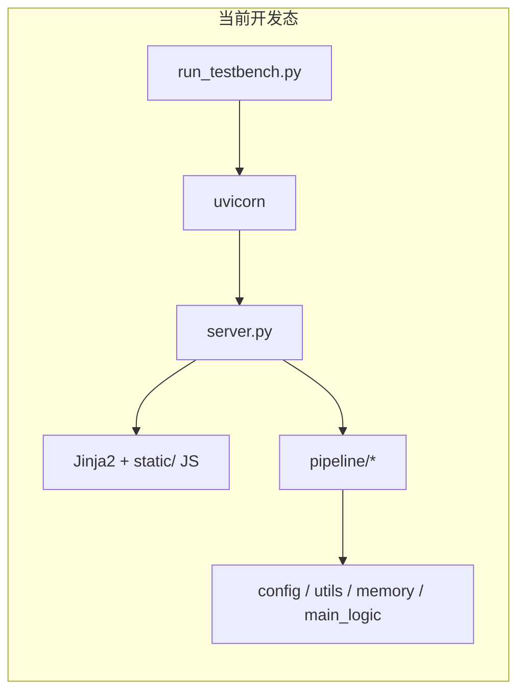
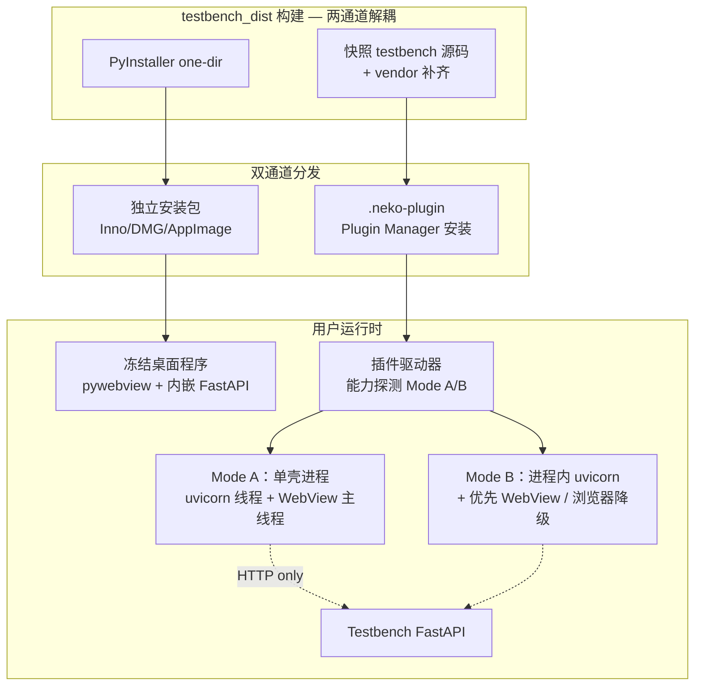
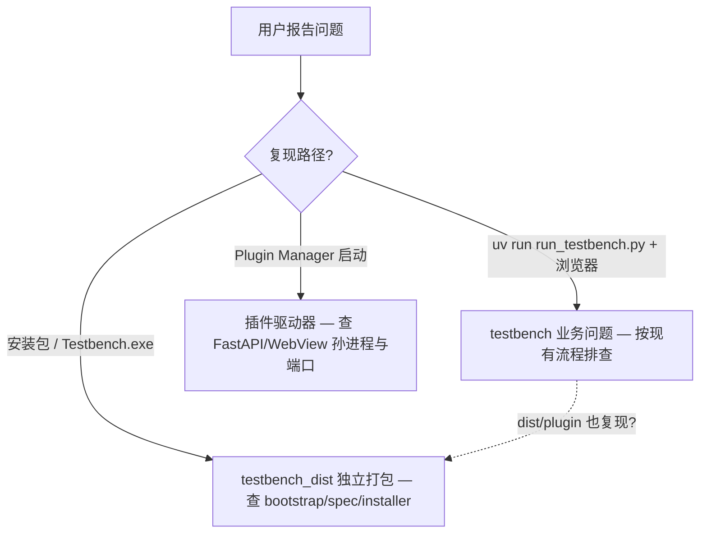
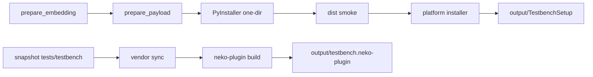

# Testbench 独立桌面安装包方案

> **固化说明（2026-08-24）**  
> 本文归档于 [`tests/testbench_dist/docs/PLAN.md`](./PLAN.md)。  
> 实现落点在 `tests/testbench_dist/`（**不修改** `tests/testbench/` 业务源码）。  
> Windows 独立安装包已落地：`output/installer/TestbenchSetup.exe`、`Testbench-win-x64.zip`。  
>
> **修订（2026-08-24）— 插件通道**：废弃「捆绑多平台桌面 exe」；改为「驱动器 + 独立 FastAPI；**能力允许时优先独立 WebView 窗口**；Nuitka 正式包走嵌入 HTTP + 浏览器/窗口降级」。独立安装包通道不变。  
> 后续若再修订，请改本文件并同步 README / USER_INSTALL / PLUGIN_INSTALL。

## 现状结论

Testbench 是 **FastAPI + Jinja2 + 原生 ES Module** 的本地 Web 应用，入口为 [`tests/testbench/run_testbench.py`](tests/testbench/run_testbench.py)，默认 `http://127.0.0.1:48920`。



**关键约束（来自架构文档与代码）：**

| 维度 | 现状 |
|------|------|
| NEKO 依赖 | 大量 import `config.*`、`utils.*`、`memory.*`；少量 `main_logic.topic` / `main_logic.core`（`avatar_dedupe` 已 copy，不 import `cross_server`） |
| 运行数据 | [`tests/testbench/config.py`](tests/testbench/config.py) 写死 `DATA_DIR = PROJECT_ROOT / "tests/testbench_data"` |
| API Keys | [`api_keys_registry.py`](tests/testbench/api_keys_registry.py) 读 `tests/api_keys.json` |
| 嵌入模型 | `memory/embeddings.py` 需要 onnx + tokenizer；主项目已有 [`scripts/prepare_embedding_model.py`](scripts/prepare_embedding_model.py) |
| 打包先例 | 主程序走 Nuitka+Electron；Monitor 有 [`specs/monitor_build.spec`](specs/monitor_build.spec)（PyInstaller + FastAPI 精简版） |
| Testbench 自身 | **无** 现有打包脚本；定位为开发/测试工具，非终端产品 |

**目标形态（用户已确认）：三平台 + 安装包分发 + NEKO 插件包**



| 用户场景 | 推荐通道 | UI 打开方式 |
|----------|----------|-------------|
| 没有 NEKO、只要 Testbench | 独立安装包 | 冻结二进制内的 pywebview |
| 已装 NEKO、从 Plugin Manager 打开 | `.neko-plugin` | **优先独立 WebView**；不可用时浏览器 / Electron 外开 |
| NEKO 开发者日常改 testbench | `uv run run_testbench.py`（不变） | 系统浏览器 |

---

## 开发流隔离原则（零侵入，最高优先级）

用户明确要求：**打包小工程不得影响 testbench 主开发工作流**，避免出问题时难以区分「业务 bug」与「打包层 bug」。

### 硬性约束

| 规则 | 说明 |
|------|------|
| **testbench 源码零改动** | [`tests/testbench/`](tests/testbench/) 内所有 `.py` / `.js` / 配置**不**为打包添加 `IS_FROZEN`、`TESTBENCH_FROZEN`、dist import 等分支 |
| **开发入口不变** | [`run_testbench.py`](tests/testbench/run_testbench.py) + `uv run` + 浏览器访问 **保持唯一官方开发路径**，不新增「开发也用 desktop_main」的混用 |
| **单向依赖** | `testbench_dist → testbench`（构建时引用）；**禁止** `testbench → testbench_dist` |
| **smoke 不耦合** | 现有 `tests/testbench/smoke/*` **不**新增打包相关用例；打包验收 smoke 全部放在 `tests/testbench_dist/smoke/` |
| **CI 分离** | testbench 日常 CI 不跑 PyInstaller；打包 CI 为独立 workflow，失败不阻塞 testbench 开发合并 |

### 冻结态适配的唯一落点：`bootstrap.py`

所有「独立安装包才需要」的行为，集中在 [`tests/testbench_dist/src/bootstrap.py`](tests/testbench_dist/src/bootstrap.py)，在 `desktop_main.py` **最早阶段**、**任何 testbench router/pipeline import 之前**执行：

```python
# bootstrap.py — 仅 dist 入口调用；必须覆盖「全部」派生常量，见「审查补漏」
def apply_standalone_patches(*, bundle_dir: Path, user_data_dir: Path) -> None:
    import tests.testbench.config as tb_config
    tb_config.PROJECT_ROOT = bundle_dir
    tb_config.CODE_DIR = bundle_dir / "testbench"
    tb_config.DATA_DIR = user_data_dir
    tb_config.SANDBOXES_DIR = user_data_dir / "sandboxes"
    tb_config.LOGS_DIR = user_data_dir / "logs"
    # … AUTOSAVE / EXPORTS / USER_* 等全部派生目录（勿只改 DATA_DIR）
    tb_config.STATIC_DIR = tb_config.CODE_DIR / "static"
    # …

    import tests.testbench.api_keys_registry as keys
    keys.API_KEYS_PATH = user_data_dir / "api_keys.json"
    keys._registry = None  # 重建单例；勿依赖 def 默认参数

    # live_runtime_log / logger 用 from-import 绑了旧 Path，必须二次赋值
    from tests.testbench.pipeline import live_runtime_log
    live_runtime_log.LIVE_DIR = user_data_dir / "live_runtime"
    live_runtime_log.CURRENT_FILE = live_runtime_log.LIVE_DIR / "current.log"
    live_runtime_log.PREVIOUS_FILE = live_runtime_log.LIVE_DIR / "previous.log"

    import tests.testbench.logger as tb_logger
    tb_logger.LOGS_DIR = tb_config.LOGS_DIR

    from tests.testbench.pipeline import embedding_space
    embedding_space.install_umap = _frozen_install_umap_stub

    tb_config.ensure_code_support_dirs = lambda: None  # bundle 只读，禁止 mkdir
```

**原理**：`from X import Y` 会在 import 时把 Path **拷贝到子模块命名空间**；事后只改 `tb_config.DATA_DIR` **不会**更新 `live_runtime_log.LIVE_DIR` / `logger.LOGS_DIR`。bootstrap 必须按「审查补漏」清单二次赋值。

### 排障分界（写进 README）



- **开发态能复现、安装包/插件也能复现** → 先修 testbench，再重打产物。
- **仅独立安装包能复现** → 只查 `testbench_dist/` 冻结层。
- **仅插件通道能复现** → 查驱动器、壳进程 / Mode B 嵌入线程、vendor、路径 shadow。
- **仅开发态能复现** → 与打包/插件层无关。

### 隔离门禁（dist 侧自检）

在 `tests/testbench_dist/smoke/p00_isolation_gate.py` 中静态检查：

1. `tests/testbench/` 下无 `testbench_dist` / `TESTBENCH_FROZEN` / `IS_FROZEN` 字符串（防未来误改渗入）。
2. `tests/testbench/` 的 import 图不包含 `tests.testbench_dist`。
3. （可选）`git diff` 门禁：打包 PR 若修改 `tests/testbench/**` 则 CI 失败，强制将改动挪到 dist 层。

---

## 推荐技术选型

### 桌面壳：pywebview（首选）

- **理由**：保留现有 6 个 workspace 的全部 JS/CSS，无需重写 UI；窗口内嵌系统 WebView（Win=Edge WebView2，macOS=WKWebView，Linux=GTK WebKit），满足「不在浏览器打开」。
- **模式**：后台线程启动 uvicorn → 等待 `/api/health` 就绪 → `webview.create_window(url=...)` → 关闭窗口时优雅 shutdown。
- **备选（不推荐首发）**：Electron 壳 — 体积 +100MB+，需维护独立前端仓库，与「py 脚本打 exe」诉求偏离。

### 打包器：PyInstaller one-dir + 各平台安装器

- **理由**：项目 dev 依赖已有 `pyinstaller==6.12.0`；[`monitor_build.spec`](specs/monitor_build.spec) 可复用 FastAPI/uvicorn 打包模式；比 Nuitka 上手快，且与「py 脚本处理 exe」一致。
- **分发**：**one-dir 文件夹**作为 payload（不选 onefile — onnx/大资源冷启动慢、排错难），外层再包安装器：
  - **Windows**：Inno Setup（`.exe` 安装向导，可注册开始菜单/卸载项）
  - **macOS**：`.app` bundle + `.dmg` 或 `.pkg`
  - **Linux**：AppImage（通用）或 `.deb`（Debian/Ubuntu）

### 依赖策略：独立精简 requirements，非整仓 pyproject

主项目 [`pyproject.toml`](pyproject.toml) 含 playwright、browser-use、dxcam 等 Testbench **不需要**的包。在 `tests/testbench_dist/requirements-standalone.txt` 维护**按 import 图裁剪**的依赖清单（fastapi、uvicorn、jinja2、onnxruntime、tokenizers、numpy、openai、anthropic、sklearn、umap-learn、tiktoken、pywebview 等），构建时在隔离 venv 中 `pip install -r requirements-standalone.txt` 再跑 PyInstaller，避免 1GB+ 膨胀。

---

## 新建目录结构

在 [`tests/testbench_dist/`](tests/testbench_dist/) 集中所有打包工作（不污染 testbench 业务代码）：

```
tests/testbench_dist/
├── README.md
├── USER_INSTALL.md              # 独立安装包用户说明
├── PLUGIN_INSTALL.md            # 插件安装/使用说明（对齐官方 quick-start）
├── requirements-standalone.txt  # 仅独立安装包 / PyInstaller
├── requirements-plugin.txt      # 插件 vendor 补齐（本体没有的：fastapi/uvicorn/jinja2/pywebview 等）
├── src/                         # 独立桌面 + 可被插件复用的壳
│   ├── desktop_main.py          # standalone 冻结入口；亦可 --url 仅开 WebView
│   ├── frozen_runtime.py
│   ├── bootstrap.py             # 路径 patch（standalone / 插件壳共用思路）
│   └── plugin_shell_main.py     # 插件 Mode A 单壳：uvicorn 线程 + WebView（可复用 desktop_main）
├── plugin/                      # NEKO 插件（源码仅在此，不进 plugin/plugins/）
│   └── testbench/
│       ├── plugin.toml
│       ├── __init__.py          # 驱动器：启停 FastAPI/WebView 孙进程 + plugin_entry
│       ├── pyproject.toml       # 声明 vendor 依赖
│       ├── config.example.toml
│       ├── ui/
│       │   └── panel.tsx        # Hosted UI：启动/停止/状态/打开窗口
│       ├── docs/
│       │   └── quickstart.md
│       ├── tests/
│       │   └── test_smoke.py
│       ├── vendor/              # gitignore / 构建生成：neko-plugin add/sync
│       └── bundled/             # gitignore：构建时快照
│           └── tests/
│               └── testbench/   # 保留 tests.testbench 包名（非 exe）
├── smoke/
├── specs/
├── assets/installer/
├── scripts/
│   ├── build_all.py             # 可分通道：--standalone / --plugin / 全量
│   ├── build_pyinstaller.py     # 仅独立安装包
│   ├── build_plugin.py          # 快照源码 + vendor + neko-plugin build（不依赖 PyInstaller）
│   └── ...
├── staging/
└── output/                      # TestbenchSetup.* + testbench.neko-plugin
```

> **废弃**：`plugin/testbench/runtime/<platform>/*.exe` 不再作为插件包内容。现有旧产物可删，构建脚本停止复制。

---

## 安装向导品牌图占位

所有品牌资源放在 [`tests/testbench_dist/assets/installer/`](tests/testbench_dist/assets/installer/)，**与 testbench 业务代码完全分离**。首发用纯色/网格占位图（可提交 git），你后续只需**同名覆盖** PNG 文件，无需改 Inno Setup / 构建脚本。

### 需要准备的图片尺寸

| 用途 | 文件路径 | 推荐分辨率 | 格式 | 说明 |
|------|----------|------------|------|------|
| **Windows 主背景（最重要）** | `win/wizard-sidebar.png` | **164 × 314 px** | PNG（支持透明） | Inno Setup `WizardImageFile` 标准尺寸；安装向导内页左侧竖条，最适合放 logo + 渐变/品牌色。竖构图，重要内容居中偏上，底部 40px 留安全边距（避免被拉伸裁切）。 |
| Windows HiDPI 侧栏（可选） | `win/wizard-sidebar@2x.png` | **328 × 628 px** | PNG | 高 DPI 屏更清晰；构建脚本优先检测 `@2x`，无则回退 1x。 |
| Windows 角标 | `win/wizard-small.png` | **55 × 55 px** | PNG | Inno Setup `WizardSmallImageFile`；向导窗口右上角小方块，放方形 logo 图标。 |
| Windows 欢迎页横幅（可选） | `win/welcome-banner.png` | **497 × 312 px** | PNG | 用于欢迎页/完成页的宽幅品牌图（若启用自定义 `wpWelcome` / `wpFinished` 页）。横构图。 |
| **macOS DMG 背景** | `mac/dmg-background.png` | **1320 × 800 px** | PNG | `create-dmg` 窗口 @2x（逻辑尺寸 660×400）。左侧放 App 图标拖拽区，右侧/中部放 logo 与产品名。 |
| macOS DMG 背景（1x 兜底） | `mac/dmg-background@1x.png` | **660 × 400 px** | PNG | 非 Retina 或脚本不支持 @2x 时使用。 |

**设计建议（logo 性质背景）：**

- 主视觉按 **164×314（竖条）** 和 **1320×800（横 DMG）** 各做一版，不要只裁一张大图——构图比例不同。
- 背景可用品牌色渐变 + 半透明 logo watermark；文字尽量少（安装器会叠加系统 UI 文案）。
- 导出 **sRGB**，PNG-24；需要透明区域用 PNG alpha，不要用 JPG。
- 若只有一张横版主 KV，可先做 `welcome-banner.png`（497×312），侧栏再单独设计竖版。

### Inno Setup 引用方式（`build_installer_win.iss`）

```iss
[Setup]
WizardStyle=modern
WizardImageFile=..\assets\installer\win\wizard-sidebar.png
WizardSmallImageFile=..\assets\installer\win\wizard-small.png
; 可选：欢迎页定制
; WizardImageAlphaFormat=png
```

占位图首发为浅灰底 + 「NEKO Testbench / 替换此图」水印文字，保证安装向导可跑通；你替换为正式 logo 背景后重新编译安装包即可。

### macOS DMG 引用方式（`build_installer_mac.sh`）

```bash
create-dmg \
  --background assets/installer/mac/dmg-background.png \
  --window-size 660 400 \
  ...
```

### Linux

AppImage / deb 通常无多步安装向导；若后续加首次启动 splash，建议 **512 × 512 px**（应用图标式）或 **1280 × 720 px**（横版启动图），本期不强制占位。

---

## 核心实现要点

### 1. 冻结态路径解析（`frozen_runtime.py` + `bootstrap.py`）

**全部在 `testbench_dist/` 内完成，testbench 源码不读、不写 frozen 分支。**

`frozen_runtime.py` 解析路径（复用 [`launcher_core/bootstrap.py`](launcher_core/bootstrap.py) 判别逻辑）：

```python
IS_FROZEN = getattr(sys, "frozen", False) or "__compiled__" in globals()
bundle_dir = Path(sys._MEIPASS)  # PyInstaller one-dir
user_data_dir = ...  # Win: %LOCALAPPDATA%/NEKO-Testbench 等
```

`bootstrap.apply_standalone_patches()` 在 server 启动前覆盖模块级常量：

| 常量 | 开发态（testbench 默认，不动） | 安装包（bootstrap patch 后） |
|------|-------------------------------|------------------------------|
| `tb_config.CODE_DIR` | `tests/testbench/` | `{bundle}/testbench/` |
| `tb_config.DATA_DIR` | `tests/testbench_data/` | `{user_data_dir}/` |
| `keys.API_KEYS_PATH` | `tests/api_keys.json` | `{user_data_dir}/api_keys.json` |
| 嵌入模型 | 用户 Documents / `data/embedding_models` | bundle 内 `embedding_models/`（build 时打入） |

**注意**：`config.py` 里 `DATA_DIR = PROJECT_ROOT / "tests/testbench_data"` 在模块 import 时会被求值一次；bootstrap 必须在 **任何消费 `DATA_DIR` 的代码运行前** 覆盖 `tb_config.DATA_DIR`（`desktop_main` 第一行即 patch，再 `import tests.testbench.server`）。`ensure_data_dirs()` 读的是 patch 后的值，无需改 testbench。

### 2. 桌面入口（`desktop_main.py`）

职责清单：

1. 修正 `sys.path`（复制 [`run_testbench.py`](tests/testbench/run_testbench.py) 的 shadow 处理逻辑到 dist，**不修改 run_testbench.py 本身**）
2. 调用 `bootstrap.apply_standalone_patches()` — **不设任何 testbench 可读的环境变量**
3. `ensure_data_dirs()` + 首次启动复制 `api_keys.json.template` → 用户目录
3. 在 daemon 线程启动 `uvicorn.run(app, host=127.0.0.1, port=0)` 或固定端口 + 冲突重试
4. 轮询 `/api/health` 直到就绪
5. `import webview; webview.create_window("N.E.K.O. Testbench", url, width=1400, height=900)`
6. 窗口关闭 → `server.should_exit = True` + join 线程
7. Win 下 `console=False`（windowed exe）；保留 `--console` 调试 flag

### 3. PyInstaller spec 资源清单

参考 [`monitor_build.spec`](specs/monitor_build.spec)，扩展 `datas` + `hiddenimports`：

**必须打包的 Python 包**（通过 `collect_submodules` + 显式 hiddenimports）：

- `tests.testbench`（含 `static/`、`templates/`、`presets/`、`scoring_schemas/`、`dialog_templates/`、`docs/`）
- `config`（含 `prompts/`、`api_providers.json` 等 JSON）
- `utils`（按 import 图，排除 monitor-only 无关子模块）
- `memory`
- `main_logic.topic`、`main_logic.core`（仅 external_events / topic_sim 所需）

**必须打包的数据文件**：

- `embedding_models/local-text-retrieval-v1/`（经 `prepare_embedding_model.py`）
- `tiktoken` 编码表（PyInstaller hook 或 `collect_data_files`）
- `config/api_providers.json`、`config/characters.json` 等

**显式 excludes**（减小体积、避免误拉）：

- `playwright`、`browser_use`、`brain`、`app.*`、`main_routers`、`plugin`、`frontend`、`galgame_plugin`、`dxcam`、`pyautogui` 等

### 4. 冻结态功能适配

| 功能 | 开发态 | 冻结态处理 |
|------|--------|------------|
| UMAP 按需 `pip install` | testbench 原逻辑不变 | dist **预打包** sklearn+umap；`bootstrap` patch `install_umap` 为 stub（不改 `embedding_space.py`） |
| 从真实 NEKO 角色导入 | `sandbox.real_paths()` | **无需 dist 改动**：`ConfigManager` 仍读系统标准路径 |
| Diagnostics 打开文件夹 | testbench 原逻辑 | 若安装包复现问题，在 dist 层 patch router 或文档说明；**优先不改 testbench** |
| `--reload` | uvicorn 热重载 | `desktop_main` 不传 `--reload`；开发流仍用 `run_testbench.py --reload` |

### 5. 构建流水线（双产物，通道解耦）



**统一入口** `scripts/build_all.py`（可只跑一侧）：

1. **独立通道**：embedding → payload → PyInstaller → 安装器（与插件无关）
2. **插件通道**：快照 `tests/testbench/` → `plugin/testbench/bundled/testbench/`；`neko-plugin sync` / `add` 补齐 `vendor/`；`neko-plugin build` → `output/testbench.neko-plugin`
3. **禁止**：把 PyInstaller 产物复制进插件包

**CI 建议**：`build-testbench-dist.yml` 矩阵产出 **安装包 + .neko-plugin** 双 artifact（两 job 可并行）。

**本地验收**：
- 独立包：无 Python VM 安装 → 桌面窗口
- 插件包：已装 NEKO → 面板「启动」→ healthz 通 + **优先独立 WebView**（失败则浏览器；Nuitka 可能 Mode B）

---

## NEKO 插件版（驱动器 + 独立 FastAPI + 优先独立窗口）

参考官方文档：[用 Plugin CLI 创建并运行第一个插件](https://project-neko.online/zh-CN/plugins/quick-start)

### 修订动机（相对旧「exe 启动器」）

| 旧方案问题 | 新方案 |
|------------|--------|
| 按 OS×CPU 捆绑 PyInstaller 二进制，跨平台/机型不友好 | 用 **NEKO 本体可 import 的 Python 环境** 跑源码快照，不塞多平台 exe |
| 包体积 ≈ standalone（数百 MB/平台） | 包内为 **源码快照 + 少量 vendor**，embedding 用本体 `data/embedding_models` |
| 与已装 NEKO 的 `config`/`memory`/`utils` 重复冻结 | 运行时 **复用本体** 语义库（插件进程由 Host 注入 repo root；壳进程须显式继承同等 `PYTHONPATH`/`vendor`） |

先例：[`neko_warthunder` 数据层](plugin/plugins/neko_warthunder/adapters/data_layer_process.py) — 可 spawn 则子进程挂端口，否则 **嵌入同进程 HTTP**（正式 Nuitka 宿主常走后者）。

### 产品偏好（已确认）

**在能力允许的前提下，优先打开独立 WebView 客户端窗口**（薄壳加载 `http://127.0.0.1:port`，体验对齐独立安装包）。  
系统浏览器 / Electron `openExternal` **仅作降级与兜底**，不是首选。

Hosted UI 只做启停/状态/打开窗口；**不**重写 Testbench 整页。

### 为什么不把 Testbench UI 搬进 Hosted UI？

| 约束 | 说明 |
|------|------|
| Hosted UI 边界 | TSX 用 `@neko/plugin-ui`，禁止 npm；testbench 数千行 ESM + SSE，重写成本极高 |
| 插件进程模型 | 经 ZMQ 与 Host 通信；**不应**把 10+ router 挂进 Host 主 FastAPI |
| 产品形态 | 完整工作台需要独立窗口（优先）或至少外开页面 |

### 能力分层（实现必须按此探测，禁止单路径假设）

正式 NEKO 为 **Nuitka standalone + Electron**（见 `docs/deployment/windows-exe.md`）。`Popen(sys.executable, "xxx.py")` 在冻结宿主上经常 **不能**当 CPython 用。须在 `start` 时探测并选择模式：

```text
探测 can_spawn_script_python?（sys.executable / _base_executable / PATH 上的 python
  能执行 -c "import sys" 且不是「再拉起冻结主程序」）

├─ 是（典型：uv 源码开发态）
│    └─ Mode A【首选】单壳孙进程（对齐 desktop_main）
│         · 一进程内：uvicorn 后台线程 + pywebview 主线程
│         · FastAPI 与插件 IPC 零交互
│         · 独立窗口优先；若 WebView 后端缺失 → 同进程只起 HTTP，
│           面板 openExternal 打开 URL（仍算降级，不静默失败）
│
└─ 否（典型：Steam / Nuitka 正式包）
     └─ Mode B【正式包兜底】插件进程内嵌
          · 在插件进程内起 uvicorn 守护线程（参考 WarThunder embedded）
          · UI：仍优先独立 WebView 窗口（仅加载已起的 URL，不重复起第二套
            解释器跑业务；可用短生命周期 Popen 只开 WebView，或经验证的
            隔离线程）；若会阻塞 ZMQ / WebView 不可用 → Hosted openExternal
          · 禁止假设「一定能再 spawn 一个完整 Python 解释器」
```

| 优先级 | UI | 条件 |
|--------|-----|------|
| P0 | **独立 WebView 窗口** | 脚本 Python 可用，或进程内 HTTP 已起且 WebView 后端可用 |
| P1 | 系统浏览器 / Electron 外开 | WebView 缺失、GUI 与 IPC 冲突、或用户点「在浏览器打开」 |
| — | Hosted 面板内嵌整页 | **不做** |

面板 `status` 须回传：`mode`（A/B）、`ui`（webview|browser）、`url`、失败原因摘要。

### 运行时拓扑（Mode A — 首选）

```text
Plugin Manager
  └─ 插件进程（NekoPluginBase，ZMQ）— 仅驱动器
        └─ start → 单个壳进程 plugin_shell_main / desktop_main(--plugin)
              ├─ thread: uvicorn → Testbench FastAPI @ 127.0.0.1:port
              └─ main:  pywebview.create_window(url)   # 独立窗口优先
                    （WebView 失败则只留 HTTP，驱动器通知面板走 P1）
```

**不要**默认拆成「FastAPI 孙进程 + WebView 孙进程」两个 Popen（生命周期/孤儿/关窗语义更脆）。单壳与独立安装包同构，排障更简单。

### Mode B 要点（Nuitka）

- HTTP：**嵌入插件进程**（线程），对齐 WarThunder `_spawn_embedded_*`
- 窗口：仍 **优先**尝试独立 WebView（只加载 URL）；失败 → `openExternal`
- **禁止**在 ZMQ 插件进程的主异步循环里同步跑 `webview.start()` 阻塞 IPC；WebView 必须进程外或严格隔离的线程策略，测不过就降到 P1

### 路径 / import / 环境（两 Mode 共用）

| 项 | 要求 |
|----|------|
| 快照布局 | `bundled/tests/testbench/`（保留 `tests.testbench` 包名）；`PYTHONPATH` 含 `bundled/` **与** 本体 repo root |
| `PROJECT_ROOT` | bootstrap **强制**设为本体根，禁止用快照路径的 `parents[2]` |
| `DATA_DIR` | 插件 `data_path()` 或共享 `%LOCALAPPDATA%/NEKO-Testbench`；二次绑定全部派生 `*_DIR` / LIVE_* / logger / ApiKeysRegistry（同 standalone bootstrap） |
| `config` shadow | 同 `run_testbench.py`：勿让 `tests/testbench` 目录抢顶层 `config` 包 |
| 壳/嵌入进程 env | 显式传入本体 root、`vendor/`、`bundled/`；白名单环境，剥离脏 `PYTHONPATH`/`VIRTUAL_ENV` |
| embedding | 本体 `data/embedding_models`；不打进插件包 |
| UMAP | 插件路径 stub `install_umap`（与冻结态一致），避免再调 pip |
| 日志 | 壳/嵌入 stdout·stderr → `data_path()/logs/`；面板可展示尾部错误 |
| 兼容性 | `plugin.toml` 声明 `compatible_neko`（或等价字段）；start/install 时版本不符早失败 |
| 关窗 | Mode A：关 WebView ⇒ 停 uvicorn 并清 pid；Mode B：关窗不杀嵌入 HTTP 时面板须显示「仅服务在跑」，stop 才卸线程 |

### 插件设计：`testbench` 驱动器

**位置**：[`tests/testbench_dist/plugin/testbench/`](tests/testbench_dist/plugin/testbench/) — **不**放入 [`plugin/plugins/`](plugin/plugins/)。

**`plugin.toml` 要点**：

```toml
[plugin]
id = "testbench"
name = "N.E.K.O. Testbench"
description = "AI 角色测试工作台。插件驱动独立 FastAPI；能力允许时打开独立 WebView 窗口。"
passive = true
entry = "plugin.plugins.testbench:TestbenchDriverPlugin"

[plugin_runtime]
enabled = true
auto_start = false

[plugin.ui]
enabled = true

[[plugin.ui.panel]]
id = "main"
title = "Testbench"
entry = "ui/panel.tsx"
context = "dashboard"
permissions = ["state:read", "action:call"]
```

**Python 侧（`__init__.py`）**：

| `@plugin_entry` | 行为 |
|-----------------|------|
| `start` | 能力探测 → Mode A 单壳或 Mode B 嵌入 → 等 `/healthz` → **优先**开独立窗口（否则标记需浏览器） |
| `stop` | 停壳进程 / 停嵌入线程；清锁 |
| `status` | mode / ui / running / pids / port / url / data_dir / last_error |
| `open` | 优先聚焦已有 WebView；否则 `openExternalUrl(url)` |

- `@lifecycle shutdown`：确保壳/线程退出
- **vendor**：web 栈缺口（fastapi/uvicorn/jinja2 等）；`pywebview` **建议按构建平台打入**（支撑 P0 独立窗口）。多平台发布：分平台插件包，或「通用包 + 各平台 WebView 可选附加」——避免 Win 上 sync 的 wheel 到 mac 必挂
- **开发探测**：源码树存在且 `dev_mode=true` 可用仓库 `tests/testbench` 代替 `bundled/`（不影响日常 `run_testbench.py`）

**Hosted UI（`ui/panel.tsx`）**：

- 显示 mode、url、数据目录、last_error
- 按钮：**启动**（默认冲独立窗口）/ **停止** / **打开窗口**（聚焦或浏览器）
- `openExternalUrl` 模式参考 `game_agent_minecraft`

### 插件包内容

```
payload/plugins/testbench/
├── plugin.toml
├── __init__.py                 # 驱动器 + 能力探测
├── pyproject.toml
├── vendor/                     # 按需；含 pywebview 时注意平台
├── bundled/
│   └── tests/
│       └── testbench/          # 快照（排除 smoke/__pycache__/大 fixture）
├── ui/panel.tsx
└── docs/quickstart.md
```

**体积目标**：远小于独立安装包；快照须裁剪测试与缓存目录。

### 构建与安装命令

```bash
uv run python tests/testbench_dist/scripts/build_plugin.py
# snapshot（裁剪）→ vendor sync → neko-plugin build

uv run neko-plugin install tests/testbench_dist/output/testbench.neko-plugin
uv run neko-plugin check -r tests/testbench_dist/plugin/testbench
```

数据目录可与独立安装包共享，便于 `sandbox.real_paths()` 导入真实角色。

### 插件版隔离原则

| 规则 | 说明 |
|------|------|
| 不进 `plugin/plugins/` | 仅 `.neko-plugin` → 用户插件目录 |
| testbench 业务零改动 | 只快照，不改 `tests/testbench/` |
| 不捆绑 exe | 无 `runtime/<platform>/` |
| FastAPI ≠ 插件 IPC | 业务 HTTP 不走 ZMQ；Mode B 仅共享进程，不共享业务协议 |
| 独立窗口优先 | 能力允许必须尝试 WebView；浏览器是降级 |
| smoke 分家 | `testbench_dist/plugin/testbench/tests/` |
| 排障 | 启停/窗口/mode → 驱动器日志；功能 → `run_testbench.py` |

### 插件通道审查补记（2026-08-24）

| # | 风险 | 计划对策 |
|---|------|----------|
| P1 | Nuitka 下 `sys.executable` 跑脚本失败 | 能力探测 + Mode B 嵌入 |
| P2 | 壳进程不继承 vendor/repo `sys.path` | 显式 env / path 注入 |
| P3 | `bundled/` 布局破坏 `tests.testbench` / `PROJECT_ROOT` | `bundled/tests/testbench` + 强制 patch root |
| P4 | 快照与本体 API 漂移 | `compatible_neko` + 按版本发插件 |
| P5 | 双 Popen 生命周期脆 | **单壳进程**（Mode A） |
| P6 | vendor 内 pywebview 跨平台 wheel | 分平台包或可选 WebView；失败降 P1，但仍优先尝试独立窗口 |
| P7 | 关窗与 stop 语义不清 | Mode A 关窗即停服；Mode B 面板区分「仅 HTTP」 |
| P8 | 与本体抢 LLM/embedding | 文档提示；非代码阻断 |

---

## 审查补漏：日志 / 文件读写 / 冻结态陷阱

> 2026-08-24 对草案的专项审查结论。`atomic_io` 本身（tmp → fsync → replace）跨平台可用；**真正会坏的是根路径绑错**，以及若干「import 时拷贝 Path」的零侵入陷阱。

### High — 必须在 bootstrap / 验收中覆盖

| # | 问题 | 表现 | 缓解 |
|---|------|------|------|
| H1 | [`config.py`](tests/testbench/config.py) 在 import 时一次性求值 `DATA_DIR` / `SANDBOXES_DIR` / `LOGS_DIR` / `AUTOSAVE_DIR` / `EXPORTS_DIR` / `STATIC_DIR` 等 | 只改 `DATA_DIR` 时，sandbox/autosave 仍写旧路径或 `_MEIPASS`（只读/重启丢数据） | bootstrap **重绑全部派生常量**；dist smoke：建会话后断言文件落在 `%LOCALAPPDATA%/NEKO-Testbench`（等） |
| H2 | [`live_runtime_log.py`](tests/testbench/pipeline/live_runtime_log.py)：`from config import DATA_DIR` → `LIVE_DIR = DATA_DIR / "live_runtime"` | 事后改 `tb_config.DATA_DIR` **不更新** `LIVE_*`；tee 写错目录或 `OSError` 被吞后「无实时日志」 | import 后立刻重设 `LIVE_DIR` / `CURRENT_FILE` / `PREVIOUS_FILE`；关窗调用 `close()` |
| H3 | [`logger.py`](tests/testbench/logger.py)：`from config import LOGS_DIR` | `SessionLogger` mkdir / 部分路径用模块级 `LOGS_DIR`，与 `session_log_path()`（走 config 模块）可能分叉 | bootstrap 同步 `logger.LOGS_DIR = tb_config.LOGS_DIR`；smoke 断言 JSONL 在用户数据目录 |
| H4 | [`api_keys_registry.py`](tests/testbench/api_keys_registry.py)：`def __init__(path=API_KEYS_PATH)` **默认参数在 def 时绑定** + `get_api_keys_registry()` 单例 | 只改 `keys.API_KEYS_PATH` 无效；Settings 密钥读写仍指向 bundle / 源码树 | patch 后 `keys._registry = None`，并以**显式 path** 重建；首次启动从 template 拷到用户目录 |
| H5 | tiktoken / onnx embedding 资源未打入 | token 计数静默 fallback；向量空间不可用 | spec 打入 `tiktoken` 编码 + `embedding_models/`；验收禁止 fallback |
| H6 | 冻结态 `install_umap` 调 `sys.executable -m pip` | 必挂或误导用户 | 预打 umap+sklearn；bootstrap stub；UI 文案「已内置」 |
| H7 | 插件驱动器端口冲突 / 多实例 / 脏 env / GUI 阻塞 ZMQ / Nuitka 误用 sys.executable | 二次启动撞端口；webview 卡死 IPC；冻结宿主 spawn 脚本失败 | 单实例锁；能力探测 Mode A/B；Mode A **单壳**；禁止在 ZMQ 主循环同步 `webview.start()`；独立窗口优先，失败降浏览器 |

### Med — 应处理或文档化

| # | 问题 | 缓解 |
|---|------|------|
| M1 | [`ensure_code_support_dirs()`](tests/testbench/config.py) 在 `CODE_DIR` 下 mkdir；`_MEIPASS` 只读 | bootstrap 换成 no-op；datas 已含 static/templates/presets |
| M2 | pywebview + Chat **POST SSE** 长连接可能被缓冲/空闲断连 | 专项手测流式回复 / Auto-Dialog；URL 必须是 `http://127.0.0.1`；必要时加 heartbeat |
| M3 | Diagnostics「打开文件夹」依赖桌面会话 | 白名单对齐用户 `DATA_DIR`；失败时提示复制路径 |
| M4 | [`holiday_cache`](utils/holiday_cache.py) 缓存消费路径，可能在 sandbox apply 前写真实 Documents | session 边界重置缓存；或文档说明「节日缓存写真实 CM 配置」 |
| M5 | ConfigManager frozen 下 `project_root=_MEIPASS`，`docs_dir` 仍系统 Documents | 「导入真实角色」需本机已有 NEKO 用户数据；文档写明 |
| M6 | `uvicorn.run("tests.testbench.server:app")` 字符串入口 + `--reload` | desktop 禁用 reload；确保 collect_submodules；提供 `--console` |

### Low — 基本安全

| # | 结论 |
|---|------|
| L1 | [`atomic_io`](tests/testbench/pipeline/atomic_io.py) / persistence / autosave：**逻辑 OK**；风险在根路径（H1）与杀软锁 `.tmp` |
| L2 | SessionLogger 无长期 FileHandler，append 即关；无旋转句柄泄漏 |
| L3 | `presets/`、builtin schemas 只读，打进 datas 即可 |
| L4 | testbench 主路径未见自建 multiprocessing；onnx 风险主要在 datas/DLL |

### bootstrap 必补清单（相对初版示例）

1. `tb_config` **全部**派生 `*_DIR`（含 STATIC/TEMPLATES/BUILTIN）
2. `live_runtime_log.LIVE_*` 二次赋值
3. `logger.LOGS_DIR` 二次赋值
4. `API_KEYS_PATH` + **销毁并重建** `_registry`（显式 path）
5. `ensure_code_support_dirs` → no-op
6. `embedding_space.install_umap` stub
7. （建议）`holiday_cache` 消费路径缓存清空

**import 顺序**：`sys.path` → import `config` → patch 全部派生路径 → patch keys + 清单例 → import `live_runtime_log`/`logger` 并重绑 → stub UMAP / ensure_code → 再 `create_app` / uvicorn / webview。

### 冻结态验收门禁（补进 Phase 3）

1. 干净机：sandbox + autosave + JSONL + `live_runtime/current.log` 全部在用户数据目录，重启仍在
2. Settings 改 api_keys 落用户目录且 Reload 生效
3. Chat SSE 流式可见（非整段到达）；Auto-Dialog 跑完
4. `count_tokens` 非启发式；embedding profile complete
5. UMAP 按钮不调 pip
6. 插件：连点启动不双开；端口占用有明确错误；WebView 窗口出现；关窗/stop 后端口释放
7. 静态门禁：扫描 `from tests.testbench.config import X` 的模块级绑定点，防止新增漏 patch

### 体积 / 平台风险（保留）

| 项目 | 估计 / 缓解 |
|------|-------------|
| 完整**独立**安装包 | 350–650 MB（含 embedding） |
| **插件** `.neko-plugin` | 远小于独立包（源码快照 + vendor；无冻结解释器 / 无平台 exe） |
| PyInstaller 漏模块 | dist smoke：health + session + memory space（仅独立通道） |
| Win WebView2 未装 | 独立安装器提示；插件通道回退系统浏览器 |
| Linux WebKit/GTK | AppImage + 文档；插件同 |
| macOS 签名 | 首发 ad-hoc；正式需证书 |
| `config` 包 shadow | 复制 `run_testbench.py` 的 sys.path 清理（两通道共用） |
| 依赖膨胀 | 独立 requirements + excludes；插件只 vendor 缺口 |
| 插件↔本体 API 漂移 | 按 NEKO 版本回归；快照与当前 `memory`/`utils` 对齐 |

---

## 实施阶段（建议顺序）

### Phase 0 — 脚手架（1–2 天）

- 创建 `tests/testbench_dist/` 目录与 README
- 实现 `frozen_runtime.py` + `desktop_main.py` 原型（开发态用 pywebview 连现有 testbench 验证窗口壳）

### Phase 1 — bootstrap 适配（1–2 天）

- 实现完整 bootstrap（见「审查补漏」H1–H4/H6/M1）：全部派生路径 + LIVE_* + logger.LOGS_DIR + ApiKeysRegistry 单例重建 + UMAP stub + ensure_code no-op
- 验证：patch 后 sandbox/JSONL/live_runtime/api_keys 写入用户目录；**不提交任何 testbench 文件变更**
- 跑 isolation gate + 路径落盘 smoke

### Phase 2 — Windows PyInstaller 首通（3–5 天）

- 编写 `requirements-standalone.txt` + `testbench_standalone.spec`
- `prepare_payload.py` 收集 NEKO 语义模块
- 在 Windows 上产出 `dist/Testbench/` 文件夹并可双击运行
- Inno Setup 脚本产出 `TestbenchSetup.exe`

### Phase 3 — 功能验收（2–3 天）

- 干净 Windows VM：执行「冻结态验收门禁」全表（SSE / tokens / embedding / 单实例 / 密钥）
- 修复 hiddenimports / 静态资源路径 / onnx DLL 问题

### Phase 4 — macOS + Linux（各 2–4 天）

- 调整 spec（`.app` bundle 结构、Linux rpath）
- DMG/AppImage 安装器
- 三平台 WebView 依赖文档

### Phase 5 — NEKO 插件版（重构，3–5 天）

> 旧「exe 启动器 + runtime/」作废；按「驱动器 + 能力分层 + **独立窗口优先**」重做。

- 能力探测：`can_spawn_script_python` → Mode A 单壳 / Mode B 嵌入
- 复用/抽薄 `desktop_main` 为插件壳（uvicorn 线程 + WebView 主线程）
- Mode B：进程内 uvicorn + 仍优先尝试独立窗口；测不过则 openExternal
- `build_plugin.py`：`bundled/tests/testbench` 裁剪快照 + vendor（无 PyInstaller）
- `compatible_neko`、面板 mode/ui/last_error、关窗语义
- Plugin Manager 手测：源码态 Mode A 出窗口；文档化 Nuitka Mode B 验收项

### Phase 6 — 发布与文档（1 天）

- `USER_INSTALL.md` + `PLUGIN_INSTALL.md` 与双通道一致
- CI workflow 双 artifact（安装包 job ∥ 插件 job）

---

## 明确不在本期范围

- 用 Electron / Hosted UI **重写** Testbench 界面
- 在 Host 主 FastAPI 上挂载 testbench router
- 在插件 ZMQ **主异步循环**里同步阻塞跑 `webview.start()`（独立窗口须进程外或经验证隔离）
- 插件包再捆绑多平台 PyInstaller exe（已废弃）
- 在 `plugin/plugins/` 注册内置 testbench 插件（污染主仓插件扫描）
- 将 Testbench 并入主程序 Nuitka+Electron 桌面链
- 离线 wheelhouse 以外的 UMAP 运行时安装
- 插件市场上架 / 自动更新通道（可后续加）

---

## 与现有 testbench 的关系

- **业务代码**：`tests/testbench/` **零改动**（插件构建只做快照）
- **开发流**：`uv run python tests/testbench/run_testbench.py` + 浏览器（不变）
- **独立用户流**：安装包 → 冻结桌面程序
- **NEKO 用户流**：Plugin Manager → 驱动器 → **优先独立 WebView 窗口**（能力不足时浏览器降级；Nuitka 走 Mode B）
- **数据目录**：两通道可共用 `%LOCALAPPDATA%/NEKO-Testbench`（等），可从已装 NEKO 导入真实角色
- **排障**：先区分 dev / standalone / plugin（含 mode A/B）；插件启停查驱动器日志，功能问题先 `run_testbench.py`
